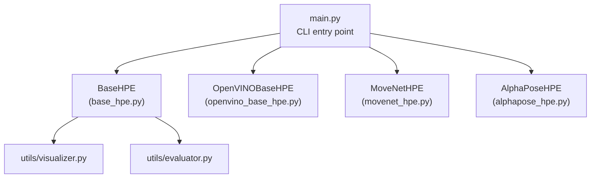
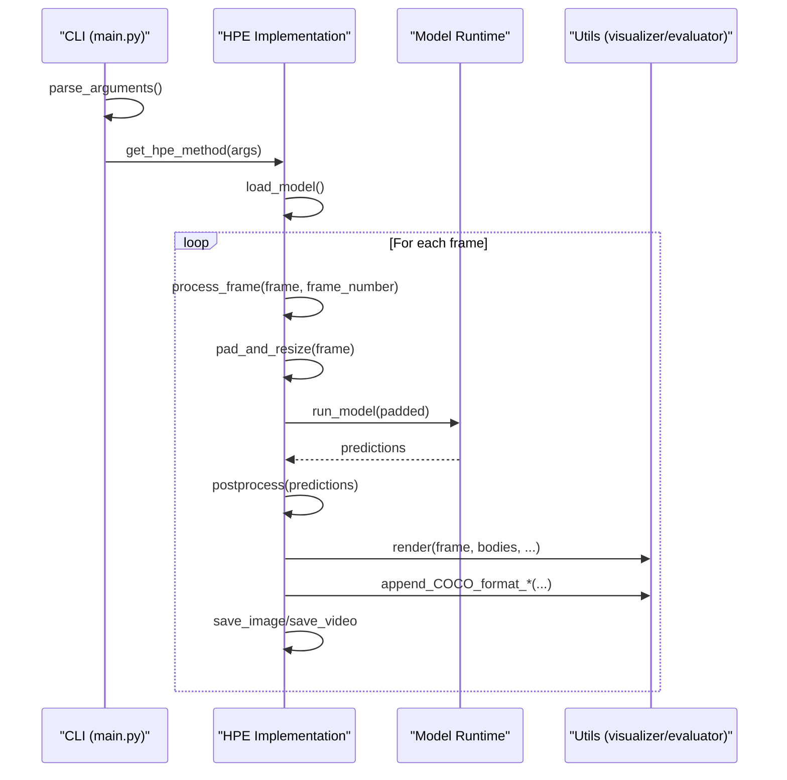
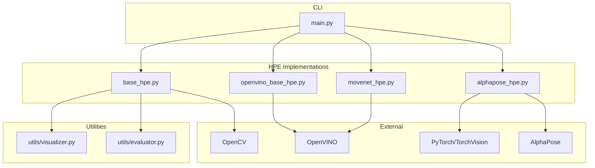

# API Reference

<cite>
**Referenced Files in This Document**
- [base_hpe.py](file://base_hpe.py)
- [main.py](file://main.py)
- [openvino_base_hpe.py](file://openvino_base_hpe.py)
- [movenet_hpe.py](file://movenet_hpe.py)
- [alphapose_hpe.py](file://alphapose_hpe.py)
- [utils/visualizer.py](file://utils/visualizer.py)
- [utils/evaluator.py](file://utils/evaluator.py)
- [requirements.txt](file://requirements.txt)
- [README.md](file://README.md)
</cite>

## Table of Contents
1. [Introduction](#introduction)
2. [Project Structure](#project-structure)
3. [Core Components](#core-components)
4. [Architecture Overview](#architecture-overview)
5. [Detailed Component Analysis](#detailed-component-analysis)
6. [Dependency Analysis](#dependency-analysis)
7. [Performance Considerations](#performance-considerations)
8. [Troubleshooting Guide](#troubleshooting-guide)
9. [Conclusion](#conclusion)
10. [Appendices](#appendices)

## Introduction
This document provides comprehensive API documentation for the Human Pose Estimation (HPE) framework. It covers the command-line interface, the main application API, utility interfaces for visualization and evaluation, and configuration management. It also documents the BaseHPE abstract class and its concrete implementations, including method contracts and extension guidelines for adding new HPE methods.

## Project Structure
The HPE framework is organized around a shared base class and multiple HPE method implementations. The main entry point parses command-line arguments and instantiates the selected HPE method. Utility modules provide visualization and evaluation capabilities.

**Diagram sources**
- [main.py:22-99](file://main.py#L22-L99)
- [base_hpe.py:36-546](file://base_hpe.py#L36-L546)
- [openvino_base_hpe.py:55-653](file://openvino_base_hpe.py#L55-L653)
- [movenet_hpe.py:12-111](file://movenet_hpe.py#L12-L111)
- [alphapose_hpe.py:33-334](file://alphapose_hpe.py#L33-L334)
- [utils/visualizer.py:4-49](file://utils/visualizer.py#L4-L49)
- [utils/evaluator.py:11-114](file://utils/evaluator.py#L11-L114)

**Section sources**
- [main.py:22-99](file://main.py#L22-L99)
- [base_hpe.py:36-546](file://base_hpe.py#L36-L546)
- [openvino_base_hpe.py:55-653](file://openvino_base_hpe.py#L55-L653)
- [movenet_hpe.py:12-111](file://movenet_hpe.py#L12-L111)
- [alphapose_hpe.py:33-334](file://alphapose_hpe.py#L33-L334)
- [utils/visualizer.py:4-49](file://utils/visualizer.py#L4-L49)
- [utils/evaluator.py:11-114](file://utils/evaluator.py#L11-L114)

## Core Components
- BaseHPE: Abstract base class defining the HPE interface, input handling, preprocessing, inference orchestration, and postprocessing hooks.
- OpenVINOBaseHPE: Implements OpenVINO-based HPE methods (OpenPose, HigherHRNet, EfficientHRNet variants).
- MoveNetHPE: Implements MoveNet using OpenVINO runtime.
- AlphaPoseHPE: Implements AlphaPose with integrated detection and pose estimation.
- CLI: Command-line interface for selecting methods, configuring inputs, outputs, and metrics collection.
- Utilities: Visualization and evaluation helpers for rendering skeletons and exporting COCO-format results.

Key responsibilities:
- Input routing: Images, directories, videos, HTTP streams, and webcams.
- Preprocessing: Aspect-preserving padding and resizing to model input sizes.
- Inference: Model-specific run_model implementations.
- Postprocessing: Converting raw outputs to standardized Body structures.
- Rendering and saving: Visual overlay, optional image/video outputs, and CSV/JSON exports.

**Section sources**
- [base_hpe.py:36-546](file://base_hpe.py#L36-L546)
- [openvino_base_hpe.py:55-653](file://openvino_base_hpe.py#L55-L653)
- [movenet_hpe.py:12-111](file://movenet_hpe.py#L12-L111)
- [alphapose_hpe.py:33-334](file://alphapose_hpe.py#L33-L334)
- [main.py:47-99](file://main.py#L47-L99)
- [utils/visualizer.py:4-49](file://utils/visualizer.py#L4-L49)
- [utils/evaluator.py:11-114](file://utils/evaluator.py#L11-L114)

## Architecture Overview
The framework follows a layered design:
- CLI layer: Parses arguments and selects the HPE implementation.
- HPE layer: Base and concrete HPE classes encapsulate model loading, preprocessing, inference, and postprocessing.
- Utility layer: Visualization and evaluation modules operate on standardized Body structures.

**Diagram sources**
- [main.py:22-99](file://main.py#L22-L99)
- [base_hpe.py:207-519](file://base_hpe.py#L207-L519)
- [openvino_base_hpe.py:183-276](file://openvino_base_hpe.py#L183-L276)
- [movenet_hpe.py:58-111](file://movenet_hpe.py#L58-L111)
- [alphapose_hpe.py:69-294](file://alphapose_hpe.py#L69-L294)
- [utils/visualizer.py:4-49](file://utils/visualizer.py#L4-L49)
- [utils/evaluator.py:35-114](file://utils/evaluator.py#L35-L114)

## Detailed Component Analysis

### BaseHPE Abstract Class
The BaseHPE class defines the contract for all HPE implementations:
- Initialization: Handles input selection (image, directory, video, HTTP stream, webcam), output directories, and metrics collection.
- Input handling: Detects input type and initializes capture or decoder paths (OpenCV fallback or PyNvCodec).
- Preprocessing: Computes padding to preserve aspect ratio and resizes to model input dimensions.
- Inference orchestration: Runs model inference and timing, then renders and saves outputs.
- Postprocessing hook: Converts raw model outputs to standardized Body structures.
- Main loops: Supports standard and timeout-aware processing for HTTP streams and videos.

Key methods and contracts:
- load_model(): Abstract method to initialize the model.
- run_model(padded): Abstract method to run inference on preprocessed frames.
- postprocess(predictions): Abstract method to convert raw outputs to Body structures.
- process_frame(frame, frame_number): Orchestrates preprocessing, inference, postprocessing, rendering, and saving.
- set_padding(): Computes padding to maintain aspect ratio.
- pad_and_resize(frame): Applies padding and resizing.

Important attributes:
- input_type: Detected input type.
- img_w/img_h: Original frame dimensions.
- pd_w/pd_h: Model input dimensions.
- score_thresh: Keypoint score threshold for filtering.
- show_scores/show_bounding_box: Rendering toggles.
- json/csv/measurement_interval_ms: Metrics export controls.
- output_dir: Directory for saving outputs.

Exceptions and error handling:
- Raises ValueError for unsupported input sources or invalid configurations.
- Prints warnings for missing hardware acceleration and unsupported inputs.
- Gracefully handles stream timeouts and frame read failures.

**Section sources**
- [base_hpe.py:36-546](file://base_hpe.py#L36-L546)

### OpenVINOBaseHPE
Implements OpenVINO-based HPE methods:
- Model registry: Defines supported architectures and input sizes.
- Device configuration: CPU/GPU selection with environment variable overrides.
- OpenVINO core configuration: Performance hints, threading, and CPU pinning.
- Model loading: Reads XML, configures ImageModel, and loads weights.
- Inference: Preprocess, run inference, and postprocess to Body structures.
- Streaming handling: Ensures capture initialization for HTTP streams.

Key methods:
- load_model(): Reads and configures the OpenVINO model.
- run_model(padded): Preprocess, infer, and return poses and scores.
- postprocess(predictions): Converts outputs to Body structures with bounding boxes.
- main_loop(): Overrides to handle streaming URL capture.

Environment variables:
- OV_THREADS: Inference threads.
- OV_MODE: Performance mode (latency/throughput).
- OV_STREAMS: Number of streams.
- OV_CPU_PINNING/OV_HYPER_THREADING: CPU tuning flags.

Asynchronous variant:
- AsyncOpenVINOBaseHPE: Provides an async pipeline with frame queues, thread pools, and display tasks.

**Section sources**
- [openvino_base_hpe.py:55-653](file://openvino_base_hpe.py#L55-L653)

### MoveNetHPE
Implements MoveNet using OpenVINO runtime:
- Fixed input size: 256x256.
- GPU fallback: Automatically falls back to CPU if GPU is requested.
- Model loading: Reads XML and compiles the model.
- Inference: Converts frame to expected input format and runs inference.
- Postprocessing: Decodes keypoints, bounding boxes, and scores; converts to Body structures.

**Section sources**
- [movenet_hpe.py:12-111](file://movenet_hpe.py#L12-L111)

### AlphaPoseHPE
Implements AlphaPose with integrated detection and pose estimation:
- Configurable device: GPU/CPU selection mapped to device indices.
- Detection loader: Manages detection for image/directory inputs.
- Pose model: Loads AlphaPose model and prepares transformations.
- Inference: Performs detection and pose estimation; supports GPU-accelerated cropping and resizing.
- Postprocessing: Converts heatmap coordinates to normalized and absolute keypoints.

Special handling:
- set_padding()/pad_and_resize(): Override to disable padding/resizing for AlphaPose’s native input handling.

**Section sources**
- [alphapose_hpe.py:33-334](file://alphapose_hpe.py#L33-L334)

### CLI and Programmatic Usage
Command-line interface:
- Method selection: --method with choices ['openpose', 'alphapose', 'movenet', 'hrnet', 'ae1', 'ae2', 'ae3'].
- Input: --input defaults to webcam ('0').
- Output: --output_dir for saving results.
- Metrics: --json/--csv for COCO-format exports; --measurement_interval_ms for Tx data volume measurements.
- Device: --device CPU/GPU for OpenVINO-based methods.
- Batch size: --detbatch for AlphaPose detection batch.
- Timeout and frame limits: --timeout and --max_frames for HTTP streams and videos.

Programmatic usage patterns:
- Instantiate HPE class directly with desired parameters.
- Call load_model() to initialize the model.
- Call main_loop() or main_loop_with_timeout() depending on input type and requirements.
- Access Body structures from postprocess outputs for custom integrations.

Integration patterns:
- Use Body structures to integrate with downstream analytics or visualization systems.
- Export COCO-format JSON/CSV via evaluator utilities for external evaluation tools.

**Section sources**
- [main.py:47-99](file://main.py#L47-L99)
- [README.md:95-125](file://README.md#L95-L125)

### Utility Interfaces

#### Visualization
- render(frame, bodies, LINES_BODY, score_thresh, show_scores, show_bounding_box): Draws skeletons, keypoint circles, optional scores, and bounding boxes.

**Section sources**
- [utils/visualizer.py:4-49](file://utils/visualizer.py#L4-L49)

#### Evaluation and Metrics
- append_COCO_format_json(bodies, score_thresh, frame_number): Accumulates COCO-format results.
- append_COCO_format_csv(bodies, score_thresh, frame_number, timestamp, measurement_interval_ms): Writes per-frame JSON and CSV entries.
- append_Tx_csv_data(json_string, timestamp, measurement_interval_ms): Aggregates transmitted bytes per millisecond interval.
- save_COCO_format_json(filepath): Saves accumulated COCO JSON.
- save_COCO_format_csv(filepath): Saves CSV with frame_number, timestamp, and json_output.
- save_Tx_csv_data(filepath): Saves Tx CSV with msecond and json_bytes.

**Section sources**
- [utils/evaluator.py:11-114](file://utils/evaluator.py#L11-L114)

## Dependency Analysis
External dependencies include OpenCV, OpenVINO, PyTorch/TorchVision, and AlphaPose components. The CLI depends on the HPE implementations and utility modules.

**Diagram sources**
- [main.py:9-13](file://main.py#L9-L13)
- [base_hpe.py:16-17](file://base_hpe.py#L16-L17)
- [openvino_base_hpe.py:15-19](file://openvino_base_hpe.py#L15-L19)
- [movenet_hpe.py:3-7](file://movenet_hpe.py#L3-L7)
- [alphapose_hpe.py:12-22](file://alphapose_hpe.py#L12-L22)
- [requirements.txt:56-91](file://requirements.txt#L56-L91)

**Section sources**
- [requirements.txt:56-91](file://requirements.txt#L56-L91)
- [main.py:9-13](file://main.py#L9-L13)
- [base_hpe.py:16-17](file://base_hpe.py#L16-L17)
- [openvino_base_hpe.py:15-19](file://openvino_base_hpe.py#L15-L19)
- [movenet_hpe.py:3-7](file://movenet_hpe.py#L3-L7)
- [alphapose_hpe.py:12-22](file://alphapose_hpe.py#L12-L22)

## Performance Considerations
- OpenVINO tuning: Configure threads, streams, and performance mode via environment variables for CPU optimization.
- GPU fallback: Some models fall back to CPU when GPU is requested but not supported.
- Streaming latency: FFmpeg backend is used for HTTP streams to reduce latency.
- Frame buffering: Asynchronous variant buffers frames and drops when necessary to maintain throughput.
- Timings: Built-in FPS calculation and console updates for performance monitoring.

[No sources needed since this section provides general guidance]

## Troubleshooting Guide
Common issues and resolutions:
- Missing hardware acceleration: PyNvCodec availability warning; fallback to OpenCV for video decoding.
- Unsupported input types: ValueError raised for invalid sources; ensure supported file types or devices.
- Stream timeouts: main_loop_with_timeout stops processing after timeout or max frames; adjust parameters accordingly.
- Stream read failures: OpenCV fallback retries with a maximum failure threshold.
- AlphaPose import errors: Ensure AlphaPose installation and dependencies are correctly configured.

**Section sources**
- [base_hpe.py:97-117](file://base_hpe.py#L97-L117)
- [base_hpe.py:152-157](file://base_hpe.py#L152-L157)
- [base_hpe.py:283-404](file://base_hpe.py#L283-L404)
- [openvino_base_hpe.py:94-151](file://openvino_base_hpe.py#L94-L151)
- [alphapose_hpe.py:20-22](file://alphapose_hpe.py#L20-L22)

## Conclusion
The HPE framework provides a unified interface for multiple pose estimation backends, with robust input handling, visualization, and evaluation utilities. The BaseHPE contract enables straightforward extension with new methods, while the CLI and utilities support flexible deployment and integration scenarios.

[No sources needed since this section summarizes without analyzing specific files]

## Appendices

### API Definitions

#### BaseHPE
- Constructor parameters:
  - input_src: Input path or URL.
  - output_dir: Output directory for results.
  - enable_json: Enable COCO JSON export.
  - enable_csv: Enable CSV export.
  - measurement_interval_ms: Interval for Tx data volume measurements.
  - save_image: Save annotated images.
  - save_video: Save annotated video.
  - score_thresh: Keypoint score threshold.
  - show_scores: Show keypoint scores.
  - show_bounding_box: Show bounding boxes.
  - pd_w/pd_h: Model input dimensions.
  - gpu_id: GPU identifier for PyNvCodec.
- Methods:
  - load_model(): Abstract.
  - run_model(padded): Abstract.
  - postprocess(predictions): Abstract.
  - process_frame(frame, frame_number): Orchestrates processing.
  - set_padding(): Computes padding.
  - pad_and_resize(frame): Applies padding and resizing.
  - main_loop(): Standard processing loop.
  - main_loop_with_timeout(timeout_seconds, max_frames): Timeout-aware loop.

**Section sources**
- [base_hpe.py:40-171](file://base_hpe.py#L40-L171)
- [base_hpe.py:177-276](file://base_hpe.py#L177-L276)
- [base_hpe.py:405-519](file://base_hpe.py#L405-L519)

#### OpenVINOBaseHPE
- Constructor parameters:
  - model_type: One of ['openpose', 'higherhrnet', 'efficienthrnet1', 'efficienthrnet2', 'efficienthrnet3'].
  - device: 'CPU' or 'GPU'.
  - ov_threads/ov_mode/ov_streams: OpenVINO tuning parameters.
  - Additional BaseHPE parameters.
- Methods:
  - load_model(): Loads OpenVINO model with configuration.
  - run_model(padded): Preprocess, infer, and return poses/scores.
  - postprocess(predictions): Converts outputs to Body structures.
  - main_loop(): Overrides to handle streaming URLs.

**Section sources**
- [openvino_base_hpe.py:64-92](file://openvino_base_hpe.py#L64-L92)
- [openvino_base_hpe.py:183-276](file://openvino_base_hpe.py#L183-L276)
- [openvino_base_hpe.py:316-395](file://openvino_base_hpe.py#L316-L395)

#### MoveNetHPE
- Constructor parameters:
  - xml_path: Path to MoveNet XML.
  - device: 'CPU' or 'GPU' (with automatic fallback).
  - Additional BaseHPE parameters.
- Methods:
  - load_model(): Reads and compiles MoveNet model.
  - run_model(padded): Performs inference and returns predictions.
  - postprocess(predictions): Converts outputs to Body structures.

**Section sources**
- [movenet_hpe.py:20-31](file://movenet_hpe.py#L20-L31)
- [movenet_hpe.py:58-111](file://movenet_hpe.py#L58-L111)

#### AlphaPoseHPE
- Constructor parameters:
  - detbatch: Detection batch size.
  - cfg/checkpoint: Model configuration and weights.
  - device: 'GPU' or 'CPU'.
  - posebatch: Pose estimation batch size.
  - detector: Detection backend.
  - sp: Multiprocessing sharing strategy.
  - Additional BaseHPE parameters.
- Methods:
  - load_model(): Loads detector and pose model.
  - run_model(frame_input): Performs detection and pose estimation.
  - postprocess(predictions): Converts outputs to Body structures.
  - set_padding()/pad_and_resize(): Override to disable padding.

**Section sources**
- [alphapose_hpe.py:41-66](file://alphapose_hpe.py#L41-L66)
- [alphapose_hpe.py:69-294](file://alphapose_hpe.py#L69-L294)
- [alphapose_hpe.py:326-334](file://alphapose_hpe.py#L326-L334)

#### CLI Arguments
- --method: HPE method selector.
- --input: Input path or URL.
- --output_dir: Output directory.
- --json/--csv: Enable exports.
- --measurement_interval_ms: Tx measurement interval.
- --save_video/--save_image: Output formats.
- --device: CPU/GPU for OpenVINO methods.
- --detbatch: AlphaPose detection batch size.
- --timeout: HTTP stream timeout.
- --max_frames: Maximum frames to process.

**Section sources**
- [main.py:47-62](file://main.py#L47-L62)

### Extension Guidelines
To add a new HPE method:
- Subclass BaseHPE and implement:
  - load_model(): Initialize model and adapters.
  - run_model(padded): Inference logic returning predictions.
  - postprocess(predictions): Convert to Body structures.
- Set model input dimensions (pd_w/pd_h) and define LINES_BODY for rendering.
- Integrate with CLI by adding a mapping in get_hpe_method() and updating argument parsing if needed.
- Ensure input handling supports images, directories, videos, HTTP streams, and webcams.

**Section sources**
- [base_hpe.py:36-546](file://base_hpe.py#L36-L546)
- [main.py:64-84](file://main.py#L64-L84)