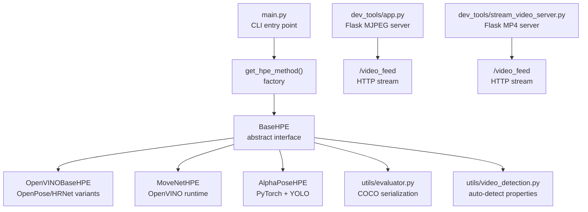
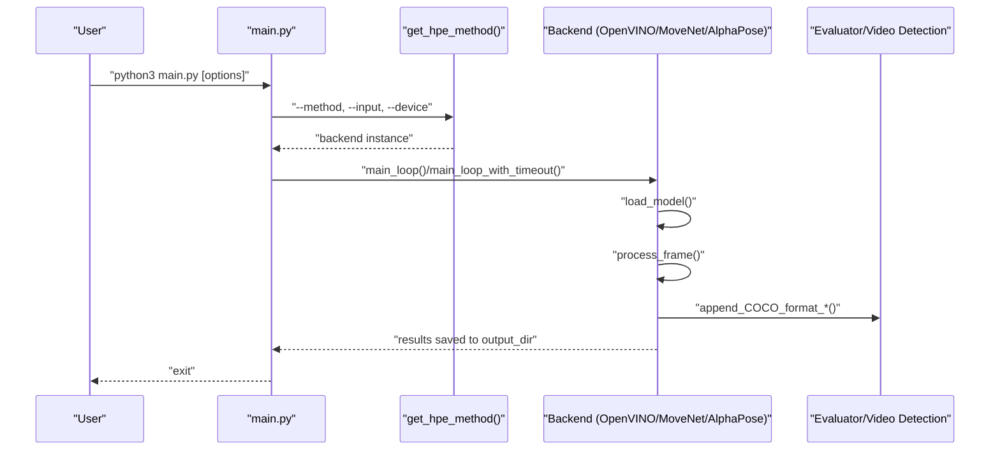
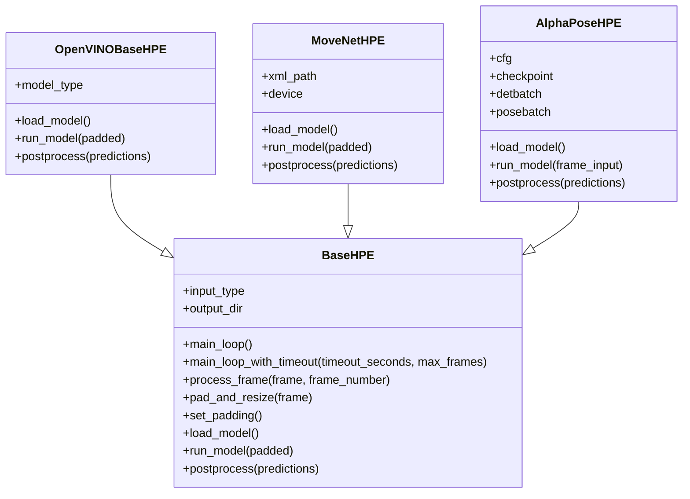
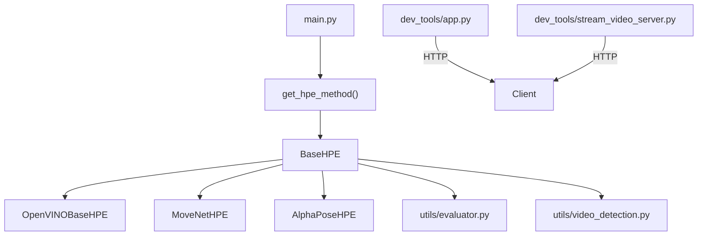

# API Reference

<cite>
**Referenced Files in This Document**
- [main.py](file://main.py)
- [base_hpe.py](file://base_hpe.py)
- [openvino_base_hpe.py](file://openvino_base_hpe.py)
- [movenet_hpe.py](file://movenet_hpe.py)
- [alphapose_hpe.py](file://alphapose_hpe.py)
- [utils/evaluator.py](file://utils/evaluator.py)
- [utils/video_detection.py](file://utils/video_detection.py)
- [dev_tools/app.py](file://dev_tools/app.py)
- [dev_tools/stream_video_server.py](file://dev_tools/stream_video_server.py)
- [README.md](file://README.md)
</cite>

## Table of Contents
1. [Introduction](#introduction)
2. [Project Structure](#project-structure)
3. [Core Components](#core-components)
4. [Architecture Overview](#architecture-overview)
5. [Detailed Component Analysis](#detailed-component-analysis)
6. [Dependency Analysis](#dependency-analysis)
7. [Performance Considerations](#performance-considerations)
8. [Troubleshooting Guide](#troubleshooting-guide)
9. [Conclusion](#conclusion)
10. [Appendices](#appendices)

## Introduction
This document provides comprehensive API documentation for the Human Pose Estimation (HPE) system. It covers:
- Command-line interface (CLI) usage and parameters
- REST API endpoints exposed by development tools and web applications
- Configuration parameters, environment variables, and runtime options
- The BaseHPE abstract class interface and backend-specific APIs
- Extension points for custom implementations
- Common usage patterns, error handling, and integration guidelines
- API versioning, backward compatibility, and migration guidance

## Project Structure
The HPE system consists of:
- A CLI entry point that orchestrates model selection, input routing, and processing
- An abstract base class defining the shared pipeline and extension points
- Backend implementations for different HPE methods
- Utilities for evaluation, video property detection, and development-time streaming servers
- A lightweight Flask-based HTTP streaming server for testing

**Diagram sources**
- [main.py:190-237](file://main.py#L190-L237)
- [base_hpe.py:98-196](file://base_hpe.py#L98-L196)
- [openvino_base_hpe.py:56-94](file://openvino_base_hpe.py#L56-L94)
- [movenet_hpe.py:12-27](file://movenet_hpe.py#L12-L27)
- [alphapose_hpe.py:33-67](file://alphapose_hpe.py#L33-L67)
- [utils/evaluator.py:11-114](file://utils/evaluator.py#L11-L114)
- [utils/video_detection.py:42-221](file://utils/video_detection.py#L42-L221)
- [dev_tools/app.py:79-102](file://dev_tools/app.py#L79-L102)
- [dev_tools/stream_video_server.py:206-209](file://dev_tools/stream_video_server.py#L206-L209)

**Section sources**
- [README.md:176-208](file://README.md#L176-L208)
- [main.py:190-237](file://main.py#L190-L237)
- [base_hpe.py:98-196](file://base_hpe.py#L98-L196)

## Core Components
- CLI entry point: parses arguments, selects backend, initializes input, and runs the processing loop
- BaseHPE: abstract class defining the shared pipeline, input detection, model loading hooks, and output handling
- Backends:
  - OpenVINO-based implementations for OpenPose, HigherHRNet, and EfficientHRNet variants
  - MoveNet using OpenVINO runtime (CPU only)
  - AlphaPose using PyTorch and YOLO detector
- Utilities:
  - Evaluator: COCO-format JSON/CSV serialization and bandwidth measurement
  - Video detection: automatic FPS, duration, and frame-count detection for HTTP/RTSP streams
- Development servers:
  - Flask MJPEG server for testing HTTP streams
  - Flask MP4 server for MP4-based HTTP streaming

**Section sources**
- [main.py:51-188](file://main.py#L51-L188)
- [base_hpe.py:98-675](file://base_hpe.py#L98-L675)
- [openvino_base_hpe.py:56-412](file://openvino_base_hpe.py#L56-L412)
- [movenet_hpe.py:12-111](file://movenet_hpe.py#L12-L111)
- [alphapose_hpe.py:33-341](file://alphapose_hpe.py#L33-L341)
- [utils/evaluator.py:11-114](file://utils/evaluator.py#L11-L114)
- [utils/video_detection.py:42-221](file://utils/video_detection.py#L42-L221)
- [dev_tools/app.py:79-102](file://dev_tools/app.py#L79-L102)
- [dev_tools/stream_video_server.py:206-209](file://dev_tools/stream_video_server.py#L206-L209)

## Architecture Overview
The system routes inputs (image, video file, directory, webcam, HTTP/RTSP stream) through a unified pipeline. The selected backend loads the appropriate model and executes inference, producing COCO-formatted keypoints and optional annotated outputs.

**Diagram sources**
- [main.py:51-188](file://main.py#L51-L188)
- [main.py:207-237](file://main.py#L207-L237)
- [base_hpe.py:250-549](file://base_hpe.py#L250-L549)
- [utils/evaluator.py:35-114](file://utils/evaluator.py#L35-L114)

## Detailed Component Analysis

### Command-Line Interface (CLI)
The CLI is defined in main.py and supports:
- Method selection: movenet, alphapose, openpose, hrnet, ae1, ae2, ae3
- Input sources: image, video file, directory, webcam (by index), HTTP/RTSP stream
- Output options: JSON, CSV, annotated images, annotated video
- Device selection: CPU or GPU
- Control parameters: detection batch size, timeout, max frames, measurement interval
- Structured logging for sessions and events

Key behaviors:
- Auto-detection of video properties for HTTP streams and fallback to user-provided timeouts/max frames
- Selection of backend via factory mapping
- Unified main loop execution with timeout support for streams

Usage examples:
- Single image with annotated output
- Directory of images with JSON export
- Video file with annotated video output
- Help for all options

**Section sources**
- [main.py:190-205](file://main.py#L190-L205)
- [main.py:207-237](file://main.py#L207-L237)
- [main.py:51-188](file://main.py#L51-L188)
- [README.md:178-190](file://README.md#L178-L190)

### BaseHPE Abstract Class Interface
BaseHPE defines the core interface and shared pipeline:
- Constructor parameters: input source, output directory, JSON/CSV export flags, measurement interval, image/video saving flags, scoring thresholds, padding sizes, GPU ID
- Input detection: image, video, directory, webcam, HTTP/RTSP stream
- Video capture initialization: OpenCV fallback and PyNvCodec path
- Main loops:
  - main_loop: continuous processing for images, directories, and video/webcam
  - main_loop_with_timeout: stream-aware loop with timeout and max frames, including MJPEG socket handling for HTTP streams
- Frame processing pipeline:
  - pad_and_resize
  - run_model (backend-specific)
  - postprocess (backend-specific)
  - render and save outputs
  - append COCO-format JSON/CSV and bandwidth measurements
- Utility methods: set_padding, extract metadata from HTTP headers, stream URL detection

Extension points:
- load_model: backend-specific model loading
- run_model: backend-specific inference
- postprocess: backend-specific result conversion to Body list

**Diagram sources**
- [base_hpe.py:98-675](file://base_hpe.py#L98-L675)
- [openvino_base_hpe.py:56-412](file://openvino_base_hpe.py#L56-L412)
- [movenet_hpe.py:12-111](file://movenet_hpe.py#L12-L111)
- [alphapose_hpe.py:33-341](file://alphapose_hpe.py#L33-L341)

**Section sources**
- [base_hpe.py:98-675](file://base_hpe.py#L98-L675)

### OpenVINO-Based Backends (OpenPose, HigherHRNet, EfficientHRNet)
OpenVINOBaseHPE provides:
- Model configuration mapping for multiple architectures with input sizes and GPU support flags
- OpenCV video capture with FFmpeg backend for HTTP/RTSP streams
- OpenVINO core configuration: performance mode, threads, streams, CPU pinning, hyper-threading
- Model loading and inference pipeline using OpenVINO model API
- Postprocessing to Body objects with bounding boxes and normalized keypoints

Runtime options:
- Environment variables for OpenVINO tuning: OV_THREADS, OV_MODE, OV_STREAMS, OV_CPU_PINNING, OV_HYPER_THREADING
- Device selection: CPU or automatic fallback for unsupported GPU models

**Section sources**
- [openvino_base_hpe.py:23-54](file://openvino_base_hpe.py#L23-L54)
- [openvino_base_hpe.py:65-94](file://openvino_base_hpe.py#L65-L94)
- [openvino_base_hpe.py:154-190](file://openvino_base_hpe.py#L154-L190)
- [openvino_base_hpe.py:191-262](file://openvino_base_hpe.py#L191-L262)
- [openvino_base_hpe.py:263-282](file://openvino_base_hpe.py#L263-L282)
- [openvino_base_hpe.py:284-322](file://openvino_base_hpe.py#L284-L322)

### MoveNet Backend
MoveNetHPE:
- Uses OpenVINO runtime for inference
- Fixed input size (256x256)
- CPU-only fallback for GPU device selection
- OpenCV video capture with FFmpeg backend for streams
- Postprocessing to Body objects with bounding boxes and keypoints

**Section sources**
- [movenet_hpe.py:20-31](file://movenet_hpe.py#L20-L31)
- [movenet_hpe.py:32-57](file://movenet_hpe.py#L32-L57)
- [movenet_hpe.py:58-87](file://movenet_hpe.py#L58-L87)
- [movenet_hpe.py:88-111](file://movenet_hpe.py#L88-L111)

### AlphaPose Backend
AlphaPoseHPE:
- PyTorch-based with YOLO detector
- GPU/CPU device selection mapped to device indices
- Supports image/directory inputs via DetectionLoader and video/webcam via BaseHPE
- GPU-accelerated preprocessing and pose estimation
- Postprocessing to Body objects with detector-derived bounding boxes

**Section sources**
- [alphapose_hpe.py:41-67](file://alphapose_hpe.py#L41-L67)
- [alphapose_hpe.py:69-117](file://alphapose_hpe.py#L69-L117)
- [alphapose_hpe.py:126-294](file://alphapose_hpe.py#L126-L294)
- [alphapose_hpe.py:295-341](file://alphapose_hpe.py#L295-L341)

### REST API Endpoints (Development Tools)
Flask-based streaming servers expose:
- GET /video_feed: MJPEG or MP4 HTTP stream
- GET /video_info (app_ffmpeg.py): JSON with original/target FPS, durations, and converted frame counts

Environment variables:
- VIDEO_PATH: path to the video file used by the server
- PORT: server port (default varies by script)

Notes:
- These are development tools for local testing and should not be used in production
- The HTTP server streams a single playback and does not loop by default

**Section sources**
- [dev_tools/app.py:79-102](file://dev_tools/app.py#L79-L102)
- [dev_tools/stream_video_server.py:206-209](file://dev_tools/stream_video_server.py#L206-L209)
- [dev_tools/app_ffmpeg.py:206-219](file://dev_tools/app_ffmpeg.py#L206-L219)

### Configuration Parameters, Environment Variables, and Runtime Options
CLI parameters:
- --method: backend selection
- --input: input source path or URL
- --output_dir: output directory for results
- --json/--csv: enable COCO export
- --measurement_interval_ms: bandwidth measurement interval
- --save_video/--save_image: save annotated outputs
- --device: CPU or GPU
- --detbatch: detection batch size
- --timeout/--max_frames: stream control parameters

Backend-specific environment variables:
- OV_THREADS, OV_MODE, OV_STREAMS, OV_CPU_PINNING, OV_HYPER_THREADING (OpenVINO tuning)
- VIDEO_PATH, PORT (development servers)

Runtime behavior:
- Automatic video property detection for HTTP streams with fallback to user-provided limits
- Stream-aware loops with timeout and max frames
- Bandwidth measurement per time interval

**Section sources**
- [main.py:190-205](file://main.py#L190-L205)
- [openvino_base_hpe.py:73-87](file://openvino_base_hpe.py#L73-L87)
- [dev_tools/app.py:12-13](file://dev_tools/app.py#L12-L13)
- [dev_tools/stream_video_server.py:214-220](file://dev_tools/stream_video_server.py#L214-L220)
- [utils/video_detection.py:42-221](file://utils/video_detection.py#L42-L221)

### Backend-Specific APIs and Extension Points
- OpenVINOBaseHPE:
  - load_model: reads XML, configures core, creates model adapter, loads model
  - run_model: preprocess, infer_sync, postprocess
  - postprocess: converts outputs to Body list
- MoveNetHPE:
  - load_model: reads IR, compiles model
  - run_model: inference on prepared input
  - postprocess: constructs Body list with bounding boxes
- AlphaPoseHPE:
  - load_model: loads detector and pose model, sets up transformations
  - run_model: detection and pose estimation with GPU acceleration
  - postprocess: converts heatmap outputs to keypoints and bounding boxes

**Section sources**
- [openvino_base_hpe.py:191-282](file://openvino_base_hpe.py#L191-L282)
- [movenet_hpe.py:58-111](file://movenet_hpe.py#L58-L111)
- [alphapose_hpe.py:69-294](file://alphapose_hpe.py#L69-L294)

### Common API Usage Patterns
- Single image processing with annotated output
- Directory of images with JSON export
- Video file processing with optional timeout and max frames
- HTTP/RTSP stream processing with auto-detection and control parameters
- Development server usage for local testing

Integration guidelines:
- Use VIDEO_PATH to configure the development server
- Use PORT to bind the server to a specific port
- For production, integrate BaseHPE subclasses directly with your application

**Section sources**
- [README.md:178-208](file://README.md#L178-L208)
- [dev_tools/app.py:12-13](file://dev_tools/app.py#L12-L13)
- [dev_tools/stream_video_server.py:214-220](file://dev_tools/stream_video_server.py#L214-L220)

### Error Handling Procedures
- Video property detection failures: fallback to user-provided timeout and max frames, structured logging
- Stream read failures: retry mechanism with maximum consecutive failures
- MJPEG socket handling: robust frame extraction and skipping logic
- OpenCV/FFmpeg backend errors: graceful fallback and informative messages
- AlphaPose detection failures: empty results when no humans are detected

**Section sources**
- [main.py:76-86](file://main.py#L76-L86)
- [base_hpe.py:410-440](file://base_hpe.py#L410-L440)
- [base_hpe.py:466-540](file://base_hpe.py#L466-L540)
- [alphapose_hpe.py:174-183](file://alphapose_hpe.py#L174-L183)

### API Versioning, Backward Compatibility, and Migration
- The system uses method selection via --method to choose backends; ensure model weights and configurations remain compatible with selected backends
- OpenVINO model configurations are defined centrally; updates require aligning with supported architectures and input sizes
- AlphaPose relies on external model files and configuration; ensure YAML and checkpoint paths are valid
- Migration guidance:
  - When changing model paths or configurations, update backend constructors and configuration mappings
  - When adding new backends, implement load_model, run_model, and postprocess consistently with BaseHPE
  - Maintain backward-compatible CLI options and default values

**Section sources**
- [openvino_base_hpe.py:23-54](file://openvino_base_hpe.py#L23-L54)
- [alphapose_hpe.py:24-25](file://alphapose_hpe.py#L24-L25)
- [README.md:115-157](file://README.md#L115-L157)

## Dependency Analysis
The following diagram shows the primary dependencies among components:

**Diagram sources**
- [main.py:207-237](file://main.py#L207-L237)
- [base_hpe.py:98-196](file://base_hpe.py#L98-L196)
- [openvino_base_hpe.py:56-94](file://openvino_base_hpe.py#L56-L94)
- [movenet_hpe.py:12-27](file://movenet_hpe.py#L12-L27)
- [alphapose_hpe.py:33-67](file://alphapose_hpe.py#L33-L67)
- [utils/evaluator.py:11-114](file://utils/evaluator.py#L11-L114)
- [utils/video_detection.py:42-221](file://utils/video_detection.py#L42-L221)
- [dev_tools/app.py:79-102](file://dev_tools/app.py#L79-L102)
- [dev_tools/stream_video_server.py:206-209](file://dev_tools/stream_video_server.py#L206-L209)

**Section sources**
- [main.py:207-237](file://main.py#L207-L237)
- [base_hpe.py:98-196](file://base_hpe.py#L98-L196)

## Performance Considerations
- OpenVINO tuning via environment variables for threads, streams, and performance mode
- PyNvCodec acceleration for video decoding when available
- Stream-aware loops with timeout and max frames to prevent resource exhaustion
- Bandwidth measurement per time interval for network-aware deployments

[No sources needed since this section provides general guidance]

## Troubleshooting Guide
Common issues and resolutions:
- Video property detection failures for HTTP streams: rely on user-provided timeout and max frames
- Stream read failures: adjust buffer sizes and retry thresholds
- MJPEG socket handling problems: ensure headers and frame boundaries are correctly parsed
- OpenCV/FFmpeg backend errors: verify stream URLs and codec support
- AlphaPose detection failures: confirm detector model availability and input preprocessing

**Section sources**
- [main.py:76-86](file://main.py#L76-L86)
- [base_hpe.py:410-440](file://base_hpe.py#L410-L440)
- [base_hpe.py:466-540](file://base_hpe.py#L466-L540)
- [alphapose_hpe.py:174-183](file://alphapose_hpe.py#L174-L183)

## Conclusion
This API reference documents the CLI, REST endpoints, configuration, and extension points for the HPE system. The BaseHPE abstract class provides a unified interface for multiple backends, while development tools enable local testing of HTTP streams. Follow the usage patterns and troubleshooting steps to integrate the system effectively.

[No sources needed since this section summarizes without analyzing specific files]

## Appendices

### Appendix A: CLI Parameter Reference
- --method: Backend selector (movenet, alphapose, openpose, hrnet, ae1, ae2, ae3)
- --input: Input path or URL
- --output_dir: Output directory
- --json/--csv: Export formats
- --measurement_interval_ms: Bandwidth measurement interval
- --save_video/--save_image: Save outputs
- --device: CPU or GPU
- --detbatch: Detection batch size
- --timeout/--max_frames: Stream control

**Section sources**
- [main.py:190-205](file://main.py#L190-L205)

### Appendix B: Environment Variables Reference
- VIDEO_PATH: Path to video file for development servers
- PORT: Port for development servers
- OV_THREADS/OV_MODE/OV_STREAMS/OV_CPU_PINNING/OV_HYPER_THREADING: OpenVINO tuning
- OPENCV_FFMPEG_OPEN_TIMEOUT/OPENCV_FFMPEG_READ_TIMEOUT: Stream timeouts

**Section sources**
- [dev_tools/app.py:12-13](file://dev_tools/app.py#L12-L13)
- [openvino_base_hpe.py:73-87](file://openvino_base_hpe.py#L73-L87)
- [README.md:355-379](file://README.md#L355-L379)