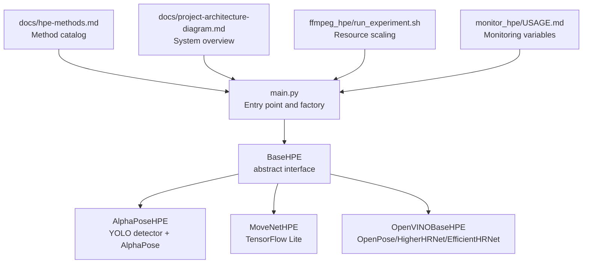
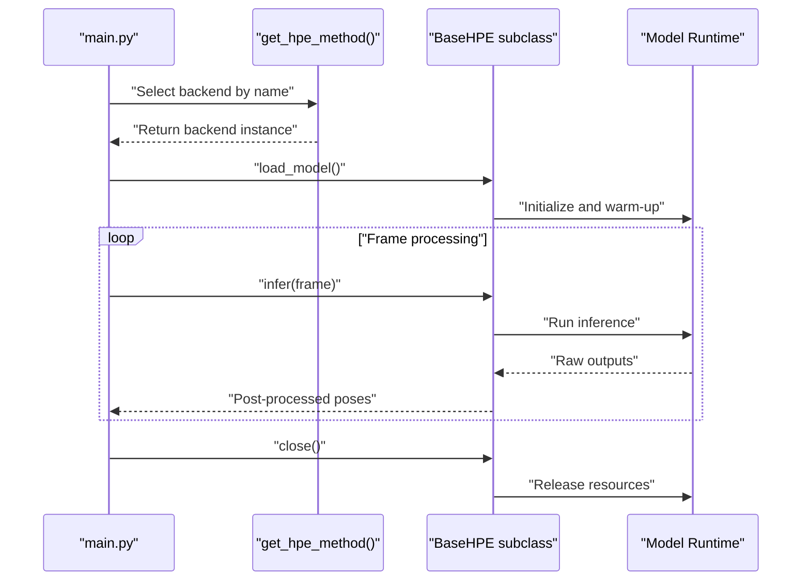
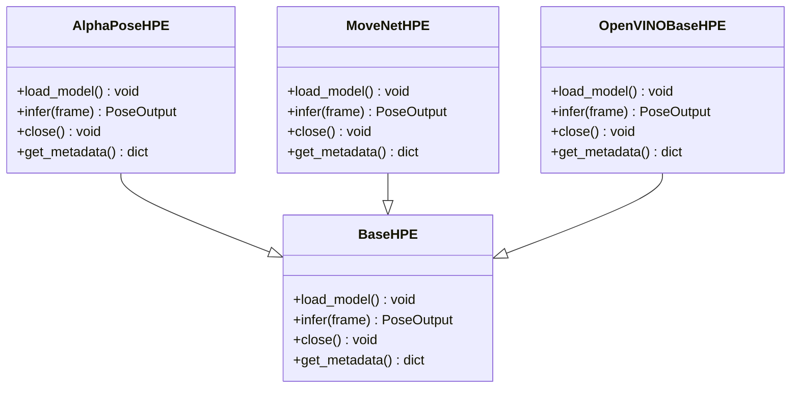
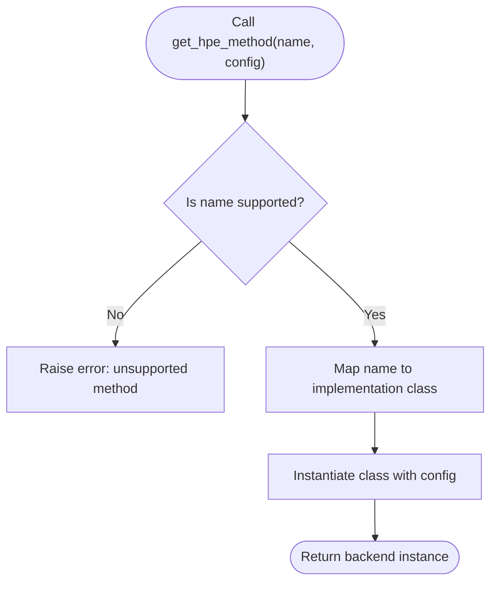
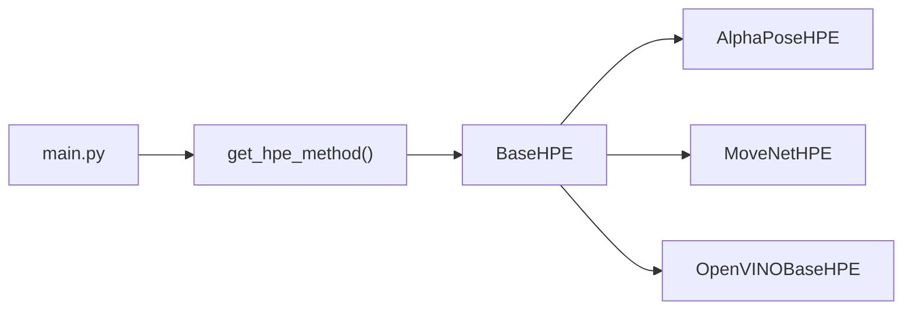

# Class Interfaces

<cite>
**Referenced Files in This Document**
- [base_hpe.py](file://base_hpe.py)
- [alphapose_hpe.py](file://alphapose_hpe.py)
- [movenet_hpe.py](file://movenet_hpe.py)
- [openvino_base_hpe.py](file://openvino_base_hpe.py)
- [main.py](file://main.py)
- [get_hpe_method](file://main.py)
- [hpe-methods.md](file://docs/hpe-methods.md)
- [project-architecture-diagram.md](file://docs/project-architecture-diagram.md)
- [run_experiment.sh](file://ffmpeg_hpe/run_experiment.sh)
- [USAGE.md](file://monitor_hpe/USAGE.md)
- [PLOT_GENERATION_ANALYSIS.md](file://monitor_hpe/PLOT_GENERATION_ANALYSIS.md)
</cite>

## Table of Contents
1. [Introduction](#introduction)
2. [Project Structure](#project-structure)
3. [Core Components](#core-components)
4. [Architecture Overview](#architecture-overview)
5. [Detailed Component Analysis](#detailed-component-analysis)
6. [Dependency Analysis](#dependency-analysis)
7. [Performance Considerations](#performance-considerations)
8. [Troubleshooting Guide](#troubleshooting-guide)
9. [Conclusion](#conclusion)
10. [Appendices](#appendices)

## Introduction
This document describes the class interfaces for the Human Pose Estimation (HPE) backend system. It focuses on the BaseHPE abstract class interface, concrete implementations (AlphaPoseHPE, MoveNetHPE, and OpenVINO-based HPE variants), the factory pattern used to select backends, and operational guidance for extending the system with custom backends. It also covers initialization parameters, method contracts, exception handling, thread-safety considerations, and performance/memory characteristics for each backend family.

## Project Structure
The HPE backend system is organized around a shared BaseHPE abstraction and several concrete implementations. A factory function selects the appropriate backend at runtime. Monitoring and benchmarking utilities provide performance insights and resource configuration guidance.

**Diagram sources**
- [main.py](file://main.py)
- [base_hpe.py](file://base_hpe.py)
- [alphapose_hpe.py](file://alphapose_hpe.py)
- [movenet_hpe.py](file://movenet_hpe.py)
- [openvino_base_hpe.py](file://openvino_base_hpe.py)
- [hpe-methods.md](file://docs/hpe-methods.md)
- [project-architecture-diagram.md](file://docs/project-architecture-diagram.md)
- [run_experiment.sh](file://ffmpeg_hpe/run_experiment.sh)
- [USAGE.md](file://monitor_hpe/USAGE.md)

**Section sources**
- [project-architecture-diagram.md:73-80](file://docs/project-architecture-diagram.md#L73-L80)
- [hpe-methods.md](file://docs/hpe-methods.md)

## Core Components
This section documents the BaseHPE abstract class and the concrete implementations, focusing on method contracts, initialization parameters, and behavior.

- BaseHPE (abstract)
  - Purpose: Defines the canonical interface for all HPE backends.
  - Responsibilities:
    - Model loading and warm-up
    - Inference pipeline
    - Post-processing and output formatting
    - Resource configuration hooks
  - Expected methods (contract):
    - Initialization parameters: backend-specific configuration keys (e.g., model paths, device, batch size, input resolution)
    - load_model(): Prepare model resources and warm-up
    - infer(frame): Accept a single frame and return pose detections
    - close(): Release resources and shut down cleanly
    - get_metadata(): Return backend metadata (name, supported formats, capabilities)
  - Thread-safety: Not guaranteed by the abstract interface; implementations may be thread-safe depending on internal design.

- AlphaPoseHPE
  - Detector: YOLO-based person detector integrated with AlphaPose
  - Initialization parameters: detector configuration, AlphaPose model path, input size, device, batch size
  - Methods: load_model(), infer(frame), close(), get_metadata()
  - Notes: Combines detection and pose estimation; expects pre-detected bounding boxes or integrated detection depending on configuration.

- MoveNetHPE
  - Backend: TensorFlow Lite optimized
  - Initialization parameters: TFLite model path, input size, num threads, device (e.g., CPU vs GPU/CPU threading)
  - Methods: load_model(), infer(frame), close(), get_metadata()
  - Notes: Lightweight and suitable for edge devices; supports quantized models.

- OpenVINOBaseHPE variants
  - Backends: OpenPose, HigherHRNet, EfficientHRNet
  - Initialization parameters: OpenVINO model path(s), inference device, number of threads, performance mode, enable CPU pinning, hyper-threading
  - Methods: load_model(), infer(frame), close(), get_metadata()
  - Notes: Tuned for Intel hardware; supports latency vs throughput modes; configurable thread and memory limits.

**Section sources**
- [base_hpe.py](file://base_hpe.py)
- [alphapose_hpe.py](file://alphapose_hpe.py)
- [movenet_hpe.py](file://movenet_hpe.py)
- [openvino_base_hpe.py](file://openvino_base_hpe.py)

## Architecture Overview
The system routes frames through a selected backend chosen by a factory function. The backend performs detection/inference and returns standardized pose outputs.

**Diagram sources**
- [main.py](file://main.py)
- [get_hpe_method](file://main.py)
- [base_hpe.py](file://base_hpe.py)

## Detailed Component Analysis

### BaseHPE Abstract Class
- Purpose: Define a uniform interface for all HPE backends.
- Initialization parameters: Varies by implementation; typically include model paths, device identifiers, input dimensions, and runtime tuning knobs.
- Core methods:
  - load_model(): Initialize model, allocate buffers, and perform warm-up.
  - infer(frame): Process a single frame and return pose detections.
  - close(): Free resources and shut down gracefully.
  - get_metadata(): Return a dictionary with backend identity, supported formats, and capabilities.
- Exception handling: Implement robust error handling during model load and inference; propagate meaningful exceptions to the caller.
- Thread-safety: Not enforced by the interface; implementations may be thread-safe if designed accordingly.

**Diagram sources**
- [base_hpe.py](file://base_hpe.py)
- [alphapose_hpe.py](file://alphapose_hpe.py)
- [movenet_hpe.py](file://movenet_hpe.py)
- [openvino_base_hpe.py](file://openvino_base_hpe.py)

**Section sources**
- [base_hpe.py](file://base_hpe.py)

### AlphaPoseHPE
- Integration: YOLO detector plus AlphaPose model.
- Initialization parameters: detector config, AlphaPose model path, input size, device, batch size.
- Method contracts:
  - load_model(): Load detector and pose model, warm-up detector, then warm-up pose model.
  - infer(frame): Optionally run detector, then run pose model on detected persons; return standardized pose output.
  - close(): Release detector and pose model resources.
  - get_metadata(): Return backend identity and capabilities.
- Exception handling: Validate detector and model readiness; handle missing artifacts and runtime errors.
- Thread-safety: Depends on underlying libraries; avoid concurrent infer calls unless proven safe.

**Section sources**
- [alphapose_hpe.py](file://alphapose_hpe.py)

### MoveNetHPE
- Backend: TensorFlow Lite optimized model.
- Initialization parameters: TFLite model path, input size, number of threads, device selection.
- Method contracts:
  - load_model(): Load TFLite interpreter, allocate tensors, warm-up.
  - infer(frame): Preprocess frame, run inference, post-process outputs to pose format.
  - close(): Dispose interpreter and tensors.
  - get_metadata(): Return backend identity and capabilities.
- Exception handling: Handle invalid model path, unsupported input shapes, and inference failures.
- Thread-safety: Interpreter instances are not inherently thread-safe; synchronize concurrent calls.

**Section sources**
- [movenet_hpe.py](file://movenet_hpe.py)

### OpenVINOBaseHPE Variants
- Backends: OpenPose, HigherHRNet, EfficientHRNet.
- Initialization parameters: OpenVINO model path(s), device, number of threads, performance mode, CPU pinning, hyper-threading.
- Method contracts:
  - load_model(): Initialize OpenVINO adapter, set inference threads, configure performance mode, warm-up.
  - infer(frame): Preprocess, run inference, post-process to pose format.
  - close(): Release OpenVINO resources.
  - get_metadata(): Return backend identity and capabilities.
- Exception handling: Validate model files, device availability, and thread configuration.
- Thread-safety: OpenVINO pipelines may be thread-safe depending on configuration; consult vendor guidance.

**Section sources**
- [openvino_base_hpe.py](file://openvino_base_hpe.py)

### Factory Pattern and Backend Selection
- Factory function: get_hpe_method(name, config)
  - Purpose: Construct and return a backend instance based on the requested method name and configuration.
  - Inputs: name (string), config (dict-like) containing backend-specific parameters.
  - Outputs: Instance of a BaseHPE subclass.
  - Behavior: Map name to implementation class, pass config to constructor, return initialized instance.
- Selection logic:
  - Supported names: alpha_pose, movenet, openvino_openpose, openvino_higher_hrnet, openvino_efficient_hrnet.
  - Validation: Raise error for unknown names; validate required config keys for each backend.
- Usage: Called from main entry point to instantiate the selected backend.

**Diagram sources**
- [main.py](file://main.py)
- [get_hpe_method](file://main.py)

**Section sources**
- [main.py](file://main.py)

## Dependency Analysis
- Internal dependencies:
  - main.py depends on get_hpe_method to construct backends.
  - Backends depend on their respective runtime libraries (AlphaPose, TensorFlow Lite, OpenVINO).
- External dependencies:
  - OpenVINO requires compatible drivers and models.
  - TensorFlow Lite relies on platform-specific delegates where applicable.
- Coupling:
  - Low coupling via BaseHPE interface.
  - Backends encapsulate runtime specifics behind a unified contract.

**Diagram sources**
- [main.py](file://main.py)
- [base_hpe.py](file://base_hpe.py)
- [alphapose_hpe.py](file://alphapose_hpe.py)
- [movenet_hpe.py](file://movenet_hpe.py)
- [openvino_base_hpe.py](file://openvino_base_hpe.py)

**Section sources**
- [main.py](file://main.py)
- [base_hpe.py](file://base_hpe.py)

## Performance Considerations
- OpenVINO-based backends:
  - Resource scaling: CPU threads and memory limits scale with vCPUs; defaults ensure minimum memory and CPU reservations.
  - Monitoring variables: OV_THREADS, OV_MODE, OV_CPU_PINNING, OV_HYPER_THREADING, HPE_CPU_LIMIT, HPE_CPU_RESERVATION, HPE_MEMORY_LIMIT, HPE_MEMORY_RESERVATION.
  - Throughput vs latency: Choose performance mode based on workload.
- TensorFlow Lite:
  - Number of threads impacts inference speed; tune based on device capabilities.
- AlphaPose:
  - Detection and pose stages introduce overhead; batching can improve throughput but increases latency.

Practical guidance:
- Use monitoring scripts to collect CPU and memory metrics; plots are generated from collected CSV data.
- Adjust backend parameters to meet latency/throughput targets while respecting resource limits.

**Section sources**
- [run_experiment.sh:147-165](file://ffmpeg_hpe/run_experiment.sh#L147-L165)
- [USAGE.md:162-207](file://monitor_hpe/USAGE.md#L162-L207)
- [PLOT_GENERATION_ANALYSIS.md:226-255](file://monitor_hpe/PLOT_GENERATION_ANALYSIS.md#L226-L255)

## Troubleshooting Guide
- Attribute access robustness:
  - When accessing underlying socket attributes, use proper exception handling to avoid crashes on unexpected response structures.
- Model loading failures:
  - Verify model paths and device availability; ensure required artifacts are present.
- Inference errors:
  - Validate input shape and preprocessing steps; confirm runtime compatibility.
- Monitoring issues:
  - Confirm CSV column names match the plot script; ensure dependencies are installed and the Agg backend is available.

**Section sources**
- [COMMIT_3161ac1_ANALYSIS.md:16-51](file://COMMIT_3161ac1_ANALYSIS.md#L16-L51)
- [USAGE.md:162-207](file://monitor_hpe/USAGE.md#L162-L207)
- [PLOT_GENERATION_ANALYSIS.md:226-255](file://monitor_hpe/PLOT_GENERATION_ANALYSIS.md#L226-L255)

## Conclusion
The HPE backend system is structured around a clean BaseHPE interface, enabling pluggable implementations for AlphaPose, MoveNet, and OpenVINO-based backends. The factory pattern simplifies backend selection, while monitoring and resource configuration utilities support performance tuning. Extending the system involves implementing BaseHPE and registering the backend in the factory.

## Appendices

### Example: Extending BaseHPE
- Steps:
  - Subclass BaseHPE and implement load_model(), infer(frame), close(), get_metadata().
  - Add backend-specific initialization parameters and validation.
  - Register the new backend in the factory function with a unique name.
- Integration points:
  - Use the same method contracts so downstream consumers remain unchanged.
  - Provide accurate metadata for discovery and monitoring.

**Section sources**
- [base_hpe.py](file://base_hpe.py)
- [main.py](file://main.py)