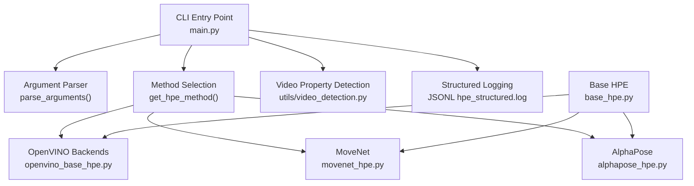
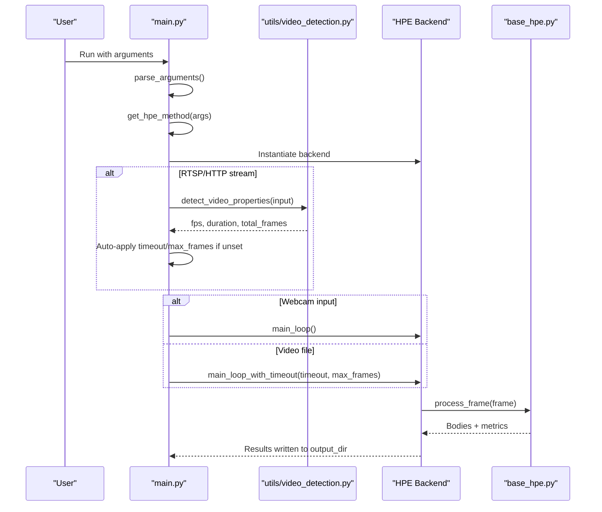
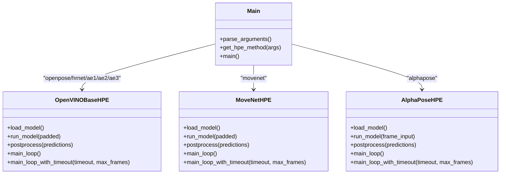
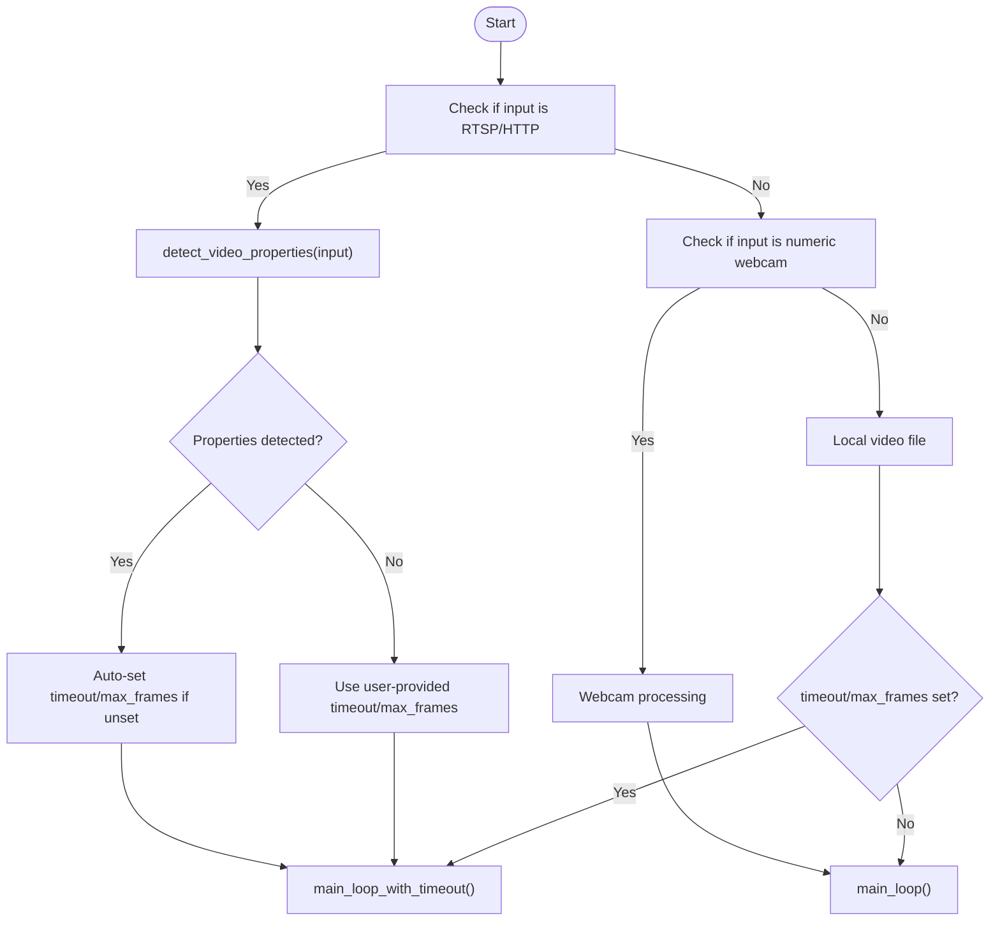
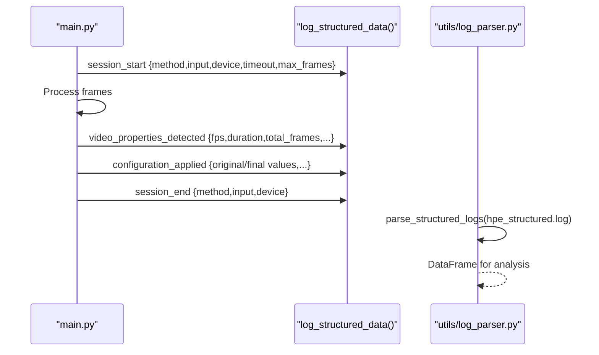
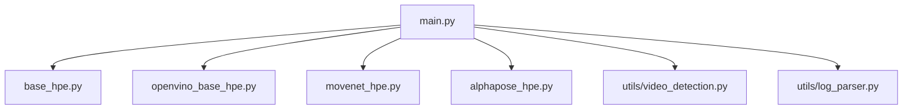

# Command-Line Interface

<cite>
**Referenced Files in This Document**
- [main.py](file://main.py)
- [base_hpe.py](file://base_hpe.py)
- [openvino_base_hpe.py](file://openvino_base_hpe.py)
- [movenet_hpe.py](file://movenet_hpe.py)
- [alphapose_hpe.py](file://alphapose_hpe.py)
- [utils/video_detection.py](file://utils/video_detection.py)
- [utils/log_parser.py](file://utils/log_parser.py)
</cite>

## Table of Contents
1. [Introduction](#introduction)
2. [Project Structure](#project-structure)
3. [Core Components](#core-components)
4. [Architecture Overview](#architecture-overview)
5. [Detailed Component Analysis](#detailed-component-analysis)
6. [Dependency Analysis](#dependency-analysis)
7. [Performance Considerations](#performance-considerations)
8. [Troubleshooting Guide](#troubleshooting-guide)
9. [Conclusion](#conclusion)

## Introduction
This document provides comprehensive command-line interface (CLI) documentation for the main.py script. It explains all available command-line arguments, method selection options and their corresponding human pose estimation (HPE) backends, input handling for different sources (video files, RTSP/HTTP streams, webcams), practical usage examples, and the structured logging system with JSONL output format for automated analysis.

## Project Structure
The CLI is implemented in main.py with argument parsing, method selection, and runtime orchestration. Supporting components include:
- Base HPE abstraction (base_hpe.py) defining common input handling, processing loops, and output generation
- Backend implementations (openvino_base_hpe.py, movenet_hpe.py, alphapose_hpe.py)
- Stream property detection (utils/video_detection.py)
- Structured logging and JSONL output (main.py) plus log analysis utilities (utils/log_parser.py)

**Diagram sources**
- [main.py:190-205](file://main.py#L190-L205)
- [main.py:207-227](file://main.py#L207-L227)
- [openvino_base_hpe.py:56-94](file://openvino_base_hpe.py#L56-L94)
- [movenet_hpe.py:12-31](file://movenet_hpe.py#L12-L31)
- [alphapose_hpe.py:33-66](file://alphapose_hpe.py#L33-L66)
- [utils/video_detection.py:42-221](file://utils/video_detection.py#L42-L221)

**Section sources**
- [main.py:190-205](file://main.py#L190-L205)
- [main.py:207-227](file://main.py#L207-L227)
- [base_hpe.py:98-180](file://base_hpe.py#L98-L180)

## Core Components
This section documents all CLI arguments and their behavior as defined in main.py and the supporting modules.

- --method (required)
  - Values: openpose, alphapose, movenet, hrnet, ae1, ae2, ae3
  - Purpose: Select the HPE backend and model family
  - Behavior: Instantiates the corresponding HPE class with selected device and parameters
  - Notes: Some backends restrict device usage (e.g., MoveNet does not support GPU)

- --input (default='0')
  - Purpose: Path to video or image file, or numeric webcam index
  - Behavior: Detected as video file, RTSP/HTTP stream, or webcam based on scheme and format
  - Notes: For RTSP/HTTP streams, automatic property detection is applied when timeout or max_frames are unspecified

- --output_dir
  - Purpose: Directory where output artifacts (JSON, CSV, images, video) are saved
  - Behavior: Created if it does not exist; defaults to out/ when enabled

- --json
  - Purpose: Enable exporting keypoints to a single JSON file in COCO format

- --csv
  - Purpose: Enable exporting keypoints and Tx metrics to CSV files

- --measurement_interval_ms (default=100)
  - Purpose: Interval for aggregating transmitted data volume per millisecond bin
  - Behavior: Used by CSV exporter to compute per-interval byte counts

- --save_video
  - Purpose: Save annotated results to a video file

- --save_image
  - Purpose: Save individual frames with rendered poses as images

- --device (choices: GPU, CPU, default=GPU)
  - Purpose: Device to run inference on
  - Notes: Some backends restrict device usage (e.g., MoveNet falls back to CPU)

- --detbatch (default=5)
  - Purpose: Detection batch size for AlphaPose
  - Behavior: Multiplied by number of GPUs for effective batch

- --timeout (default=0)
  - Purpose: Processing timeout in seconds (0 means unlimited)
  - Behavior: Controls main_loop_with_timeout for streams and videos

- --max_frames (default=0)
  - Purpose: Maximum number of frames to process (0 means unlimited)
  - Behavior: Controls main_loop_with_timeout for streams and videos

**Section sources**
- [main.py:190-205](file://main.py#L190-L205)
- [main.py:207-227](file://main.py#L207-L227)
- [movenet_hpe.py:20-31](file://movenet_hpe.py#L20-L31)
- [openvino_base_hpe.py:65-94](file://openvino_base_hpe.py#L65-L94)
- [alphapose_hpe.py:41-52](file://alphapose_hpe.py#L41-L52)

## Architecture Overview
The CLI orchestrates method selection, input detection, and processing loops. For RTSP/HTTP streams, automatic video property detection is performed to set sensible defaults for timeout and max_frames when not provided.

**Diagram sources**
- [main.py:51-188](file://main.py#L51-L188)
- [utils/video_detection.py:42-221](file://utils/video_detection.py#L42-L221)
- [base_hpe.py:250-330](file://base_hpe.py#L250-L330)

## Detailed Component Analysis

### Argument Parsing and Validation
- Required vs optional arguments
- Choice validation for --method
- Default values and help text
- Mapping to backend constructor parameters

**Section sources**
- [main.py:190-205](file://main.py#L190-L205)

### Method Selection and Backend Mapping
- Mapping of --method to backend classes
- Device handling and restrictions
- Parameter forwarding (device, detbatch, measurement_interval_ms, etc.)

**Diagram sources**
- [main.py:207-227](file://main.py#L207-L227)
- [openvino_base_hpe.py:56-94](file://openvino_base_hpe.py#L56-L94)
- [movenet_hpe.py:12-31](file://movenet_hpe.py#L12-L31)
- [alphapose_hpe.py:33-66](file://alphapose_hpe.py#L33-L66)

**Section sources**
- [main.py:207-227](file://main.py#L207-L227)
- [openvino_base_hpe.py:56-94](file://openvino_base_hpe.py#L56-L94)
- [movenet_hpe.py:12-31](file://movenet_hpe.py#L12-L31)
- [alphapose_hpe.py:33-66](file://alphapose_hpe.py#L33-L66)

### Input Handling and Stream Property Detection
- Automatic detection of RTSP/HTTP streams vs video files vs webcam
- Property detection pipeline for HTTP streams (streamer API, source video ffprobe, HTTP ffprobe, OpenCV fallback)
- Auto-configuration of timeout and max_frames when not provided

**Diagram sources**
- [main.py:66-188](file://main.py#L66-L188)
- [utils/video_detection.py:42-221](file://utils/video_detection.py#L42-L221)

**Section sources**
- [main.py:66-188](file://main.py#L66-L188)
- [utils/video_detection.py:42-221](file://utils/video_detection.py#L42-L221)

### Structured Logging and JSONL Output
- Session-level structured logging for automated analysis
- JSONL format with timestamped entries
- Event types: session_start, session_end, video_properties_detected, video_properties_detection_failed, configuration_applied
- Log parsing utility for analysis

**Diagram sources**
- [main.py:31-49](file://main.py#L31-L49)
- [main.py:55-62](file://main.py#L55-L62)
- [main.py:82-99](file://main.py#L82-L99)
- [main.py:124-134](file://main.py#L124-L134)
- [main.py:184-188](file://main.py#L184-L188)
- [utils/log_parser.py:12-33](file://utils/log_parser.py#L12-L33)

**Section sources**
- [main.py:31-49](file://main.py#L31-L49)
- [main.py:55-62](file://main.py#L55-L62)
- [main.py:82-99](file://main.py#L82-L99)
- [main.py:124-134](file://main.py#L124-L134)
- [main.py:184-188](file://main.py#L184-L188)
- [utils/log_parser.py:12-33](file://utils/log_parser.py#L12-L33)

### Practical Usage Examples
Below are common scenarios with recommended command-line patterns. Replace placeholders with your actual paths and values.

- Benchmark different backends on a local video
  - OpenPose: python3 main.py --method openpose --input path/to/video.mp4 --device GPU --json --csv --output_dir out/
  - AlphaPose: python3 main.py --method alphapose --input path/to/video.mp4 --device GPU --json --csv --output_dir out/
  - MoveNet: python3 main.py --method movenet --input path/to/video.mp4 --json --csv --output_dir out/
  - HigherHRNet variants: python3 main.py --method hrnet --input path/to/video.mp4 --device GPU --json --csv --output_dir out/

- Process an RTSP stream with automatic timeout detection
  - python3 main.py --method openpose --input rtsp://host:port/path --device GPU --json --csv --output_dir out/

- Process an HTTP stream with explicit limits
  - python3 main.py --method alphapose --input http://host:port/stream --device GPU --timeout 60 --max_frames 1500 --json --csv --output_dir out/

- Save annotated results to video and images
  - python3 main.py --method movenet --input 0 --device CPU --save_video --save_image --output_dir out/

- Configure device-specific optimizations (OpenVINO)
  - Set environment variables (e.g., OV_THREADS, OV_MODE, OV_STREAMS, OV_CPU_PINNING, OV_HYPER_THREADING) before running
  - Example: OV_THREADS=8 OV_MODE=throughput OV_STREAMS=4 python3 main.py --method hrnet --input video.mp4 --device GPU --json --csv --output_dir out/

- Analyze structured logs for automated reporting
  - python3 utils/log_parser.py --log-file hpe_structured.log --show-all --export-csv analysis.csv

**Section sources**
- [main.py:190-205](file://main.py#L190-L205)
- [openvino_base_hpe.py:65-94](file://openvino_base_hpe.py#L65-L94)
- [utils/log_parser.py:122-151](file://utils/log_parser.py#L122-L151)

## Dependency Analysis
The CLI depends on the base HPE abstraction and backend implementations. Input detection and stream property detection are decoupled and reusable.

**Diagram sources**
- [main.py:1-14](file://main.py#L1-L14)
- [base_hpe.py:98-180](file://base_hpe.py#L98-L180)
- [openvino_base_hpe.py:56-94](file://openvino_base_hpe.py#L56-L94)
- [movenet_hpe.py:12-31](file://movenet_hpe.py#L12-L31)
- [alphapose_hpe.py:33-66](file://alphapose_hpe.py#L33-L66)
- [utils/video_detection.py:42-221](file://utils/video_detection.py#L42-L221)
- [utils/log_parser.py:12-33](file://utils/log_parser.py#L12-L33)

**Section sources**
- [main.py:1-14](file://main.py#L1-L14)
- [base_hpe.py:98-180](file://base_hpe.py#L98-L180)
- [openvino_base_hpe.py:56-94](file://openvino_base_hpe.py#L56-L94)
- [movenet_hpe.py:12-31](file://movenet_hpe.py#L12-L31)
- [alphapose_hpe.py:33-66](file://alphapose_hpe.py#L33-L66)
- [utils/video_detection.py:42-221](file://utils/video_detection.py#L42-L221)
- [utils/log_parser.py:12-33](file://utils/log_parser.py#L12-L33)

## Performance Considerations
- Device selection: Some backends restrict GPU usage (e.g., MoveNet falls back to CPU)
- Batch sizing: --detbatch affects AlphaPose throughput; adjust based on GPU memory
- Timeout and frame limits: Use --timeout and --max_frames to bound processing for streams
- Measurement intervals: Tune --measurement_interval_ms for desired Tx granularity
- OpenVINO tuning: Set OV_THREADS, OV_MODE, OV_STREAMS, OV_CPU_PINNING, OV_HYPER_THREADING for CPU performance

[No sources needed since this section provides general guidance]

## Troubleshooting Guide
- No video properties detected for HTTP stream
  - Symptom: Warning about inability to detect properties; processing controlled by user-provided timeout/max_frames
  - Action: Provide explicit --timeout and/or --max_frames or switch to a local video file

- Stream ends unexpectedly or frame read failures
  - Symptom: Consecutive read failures during processing
  - Action: Verify stream URL, network stability, and increase buffer sizes if applicable

- MoveNet on GPU
  - Symptom: Automatic fallback to CPU
  - Action: Use --device CPU or choose a GPU-supported backend

- AlphaPose device mapping
  - Symptom: GPU/CPU selection mapped via internal device strings
  - Action: Ensure CUDA availability and correct device configuration

**Section sources**
- [main.py:76-86](file://main.py#L76-L86)
- [main.py:135-149](file://main.py#L135-L149)
- [movenet_hpe.py:28-31](file://movenet_hpe.py#L28-L31)
- [alphapose_hpe.py:28-31](file://alphapose_hpe.py#L28-L31)

## Conclusion
The main.py CLI provides a unified interface to run multiple HPE backends on diverse input sources. It supports automatic stream property detection, configurable timeouts and frame limits, structured logging for automated analysis, and flexible output formats. By selecting appropriate methods, devices, and parameters, users can efficiently benchmark backends, process live streams, and generate artifacts for downstream analysis.