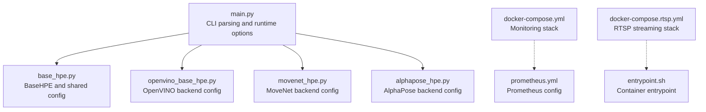
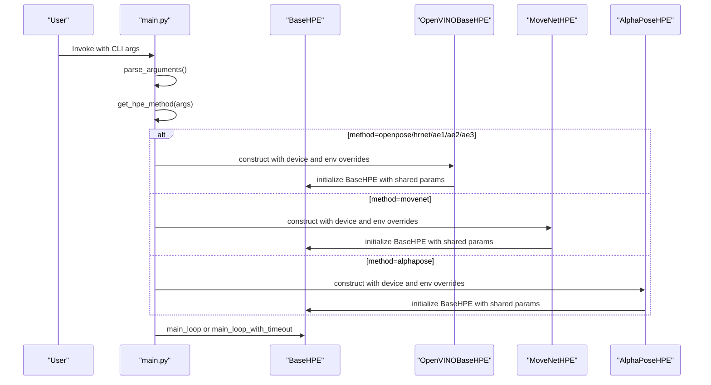
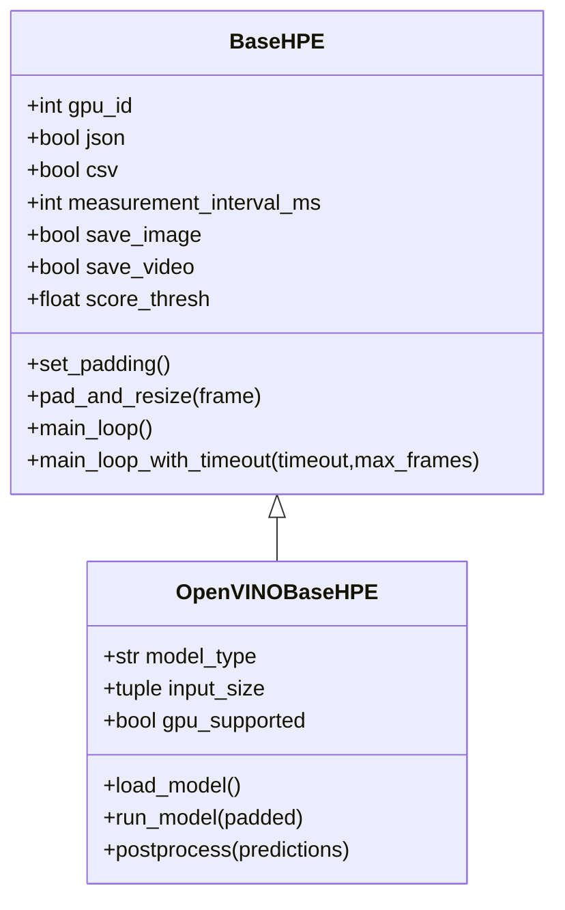
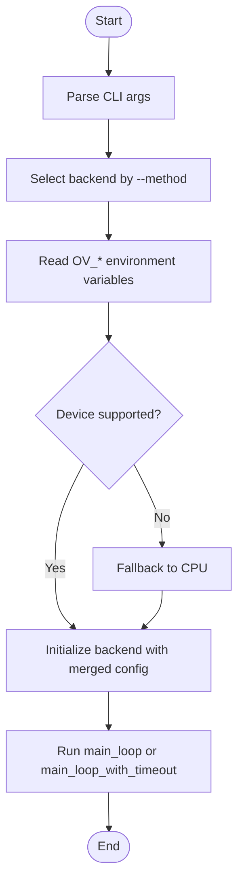
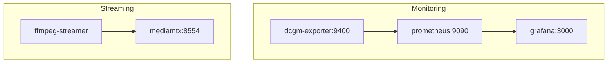
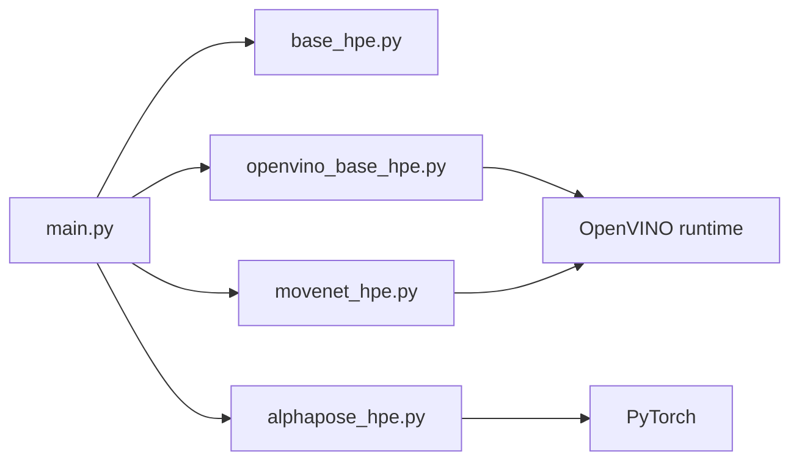

# Configuration Parameters

<cite>
**Referenced Files in This Document**
- [main.py](file://main.py)
- [base_hpe.py](file://base_hpe.py)
- [openvino_base_hpe.py](file://openvino_base_hpe.py)
- [movenet_hpe.py](file://movenet_hpe.py)
- [alphapose_hpe.py](file://alphapose_hpe.py)
- [docker-compose.yml](file://docker-compose.yml)
- [docker-compose.rtsp.yml](file://docker-compose.rtsp.yml)
- [prometheus.yml](file://prometheus.yml)
- [entrypoint.sh](file://entrypoint.sh)
- [show_5fps_env_vars.sh](file://show_5fps_env_vars.sh)
</cite>

## Table of Contents
1. [Introduction](#introduction)
2. [Project Structure](#project-structure)
3. [Core Components](#core-components)
4. [Architecture Overview](#architecture-overview)
5. [Detailed Component Analysis](#detailed-component-analysis)
6. [Dependency Analysis](#dependency-analysis)
7. [Performance Considerations](#performance-considerations)
8. [Troubleshooting Guide](#troubleshooting-guide)
9. [Conclusion](#conclusion)
10. [Appendices](#appendices)

## Introduction
This document provides comprehensive configuration parameter documentation for the Human Pose Estimation (HPE) pipeline. It covers:
- Command-line arguments and runtime options defined in the main entry point
- Environment variables for OpenVINO performance tuning and Docker orchestration
- Configuration inheritance and override mechanisms across HPE backends
- Parameter validation rules, defaults, and acceptable ranges
- Configuration templates for common deployment scenarios
- Troubleshooting guidance and performance optimization recommendations

## Project Structure
The configuration system spans the main entry point, backend-specific HPE implementations, and Docker orchestration files. Key areas:
- Runtime options and CLI argument parsing
- Backend-specific model configuration and environment variable overrides
- Container orchestration for monitoring and streaming infrastructure
- Output and logging configuration

**Diagram sources**
- [main.py:190-205](file://main.py#L190-L205)
- [base_hpe.py:98-180](file://base_hpe.py#L98-L180)
- [openvino_base_hpe.py:65-94](file://openvino_base_hpe.py#L65-L94)
- [movenet_hpe.py:20-31](file://movenet_hpe.py#L20-L31)
- [alphapose_hpe.py:41-66](file://alphapose_hpe.py#L41-L66)
- [docker-compose.yml:1-30](file://docker-compose.yml#L1-L30)
- [docker-compose.rtsp.yml:1-37](file://docker-compose.rtsp.yml#L1-L37)
- [prometheus.yml](file://prometheus.yml)
- [entrypoint.sh](file://entrypoint.sh)

**Section sources**
- [main.py:190-205](file://main.py#L190-L205)
- [base_hpe.py:98-180](file://base_hpe.py#L98-L180)
- [openvino_base_hpe.py:65-94](file://openvino_base_hpe.py#L65-L94)
- [movenet_hpe.py:20-31](file://movenet_hpe.py#L20-L31)
- [alphapose_hpe.py:41-66](file://alphapose_hpe.py#L41-L66)
- [docker-compose.yml:1-30](file://docker-compose.yml#L1-L30)
- [docker-compose.rtsp.yml:1-37](file://docker-compose.rtsp.yml#L1-L37)

## Core Components
This section documents the primary configuration surfaces: CLI arguments, environment variables, and backend-specific settings.

- CLI Arguments (main.py)
  - Method selection: --method with choices ['openpose','alphapose','movenet','hrnet','ae1','ae2','ae3']
  - Input handling: --input (default '0' for webcam), --output_dir, --json, --csv, --measurement_interval_ms (default 100)
  - Device configuration: --device with choices ['GPU','CPU'] (backend-dependent behavior)
  - Batch and limits: --detbatch (default 5), --timeout (seconds, default 0 for unlimited), --max_frames (default 0 for unlimited)
  - Output controls: --save_video, --save_image

- Environment Variables (OpenVINO backends)
  - OV_THREADS: inference threads for CPU (default 1)
  - OV_MODE: performance mode ('latency' or 'throughput', default 'latency')
  - OV_STREAMS: number of streams for CPU (optional numeric value)
  - OV_CPU_PINNING: enable CPU pinning (boolean true/false)
  - OV_HYPER_THREADING: enable hyper-threading (boolean true/false)

- Backend-Specific Behavior
  - MoveNet: forces CPU device if GPU requested
  - HigherHRNet: not supported on GPU
  - AlphaPose: maps device to CUDA device index or CPU

- Validation Rules and Defaults
  - CLI defaults are explicit in argument definitions
  - Environment variables are parsed with sensible defaults when unset
  - Device selection falls back to CPU when a backend does not support the requested device

**Section sources**
- [main.py:190-205](file://main.py#L190-L205)
- [openvino_base_hpe.py:73-86](file://openvino_base_hpe.py#L73-L86)
- [movenet_hpe.py:28-31](file://movenet_hpe.py#L28-L31)
- [openvino_base_hpe.py:88-90](file://openvino_base_hpe.py#L88-L90)
- [alphapose_hpe.py:28-31](file://alphapose_hpe.py#L28-L31)

## Architecture Overview
The configuration architecture integrates CLI-driven runtime options with backend-specific environment variables and Docker orchestration.

**Diagram sources**
- [main.py:207-237](file://main.py#L207-L237)
- [base_hpe.py:98-180](file://base_hpe.py#L98-L180)
- [openvino_base_hpe.py:65-94](file://openvino_base_hpe.py#L65-L94)
- [movenet_hpe.py:20-31](file://movenet_hpe.py#L20-L31)
- [alphapose_hpe.py:41-66](file://alphapose_hpe.py#L41-L66)

## Detailed Component Analysis

### CLI Argument Specifications
- --method: Required; selects backend. Choices: openpose, alphapose, movenet, hrnet, ae1, ae2, ae3
- --input: Path or device; default '0' (webcam). Supports images, videos, and HTTP/RTSP streams
- --output_dir: Output directory for artifacts
- --json, --csv: Enable exporting keypoints to single JSON or CSV
- --measurement_interval_ms: Sampling interval for throughput measurements (default 100)
- --save_video, --save_image: Save annotated video or images
- --device: Target device for inference (CPU/GPU); backend-dependent
- --detbatch: Detection batch size (default 5)
- --timeout: Processing timeout in seconds (default 0 for unlimited)
- --max_frames: Maximum frames to process (default 0 for unlimited)

Validation and defaults are enforced by argparse and backend constructors.

**Section sources**
- [main.py:190-205](file://main.py#L190-L205)

### Environment Variables for OpenVINO Backends
- OV_THREADS: Number of inference threads for CPU (default 1)
- OV_MODE: Performance mode, 'latency' or 'throughput' (default 'latency')
- OV_STREAMS: Optional numeric value for CPU streams
- OV_CPU_PINNING: Boolean enabling CPU pinning (default false)
- OV_HYPER_THREADING: Boolean enabling hyper-threading (default false)

These variables are read during backend initialization and applied to the OpenVINO core configuration.

**Section sources**
- [openvino_base_hpe.py:73-86](file://openvino_base_hpe.py#L73-L86)
- [openvino_base_hpe.py:154-189](file://openvino_base_hpe.py#L154-L189)

### Backend-Specific Configuration

#### OpenVINO Backends (openpose, hrnet, ae1–ae3)
- Supported devices: CPU and selected models also support GPU
- Unsupported GPU models fall back to CPU
- Input sizes vary by model type
- Performance tuning via environment variables

**Diagram sources**
- [base_hpe.py:98-180](file://base_hpe.py#L98-L180)
- [openvino_base_hpe.py:56-94](file://openvino_base_hpe.py#L56-L94)

**Section sources**
- [openvino_base_hpe.py:23-54](file://openvino_base_hpe.py#L23-L54)
- [openvino_base_hpe.py:88-90](file://openvino_base_hpe.py#L88-L90)
- [openvino_base_hpe.py:191-261](file://openvino_base_hpe.py#L191-L261)

#### MoveNet Backend
- Forces CPU device if GPU requested
- Fixed input size for model
- Uses OpenCV/FFMPEG for stream handling

**Section sources**
- [movenet_hpe.py:28-31](file://movenet_hpe.py#L28-L31)
- [movenet_hpe.py:32-56](file://movenet_hpe.py#L32-L56)

#### AlphaPose Backend
- Maps device to CUDA device index or CPU
- Uses detection loader for images/directories
- GPU tensors for video/webcam/stream paths
- Manual preprocessing for detection on GPU

**Section sources**
- [alphapose_hpe.py:28-31](file://alphapose_hpe.py#L28-L31)
- [alphapose_hpe.py:69-116](file://alphapose_hpe.py#L69-L116)
- [alphapose_hpe.py:126-293](file://alphapose_hpe.py#L126-L293)

### Configuration Inheritance and Override Mechanisms
- CLI arguments are parsed first and passed to backend constructors
- Backend constructors read environment variables to override defaults
- Device selection is validated against model capabilities; unsupported devices fall back to CPU
- Shared parameters (e.g., output paths, thresholds, saving options) are inherited from BaseHPE

**Diagram sources**
- [main.py:207-237](file://main.py#L207-L237)
- [openvino_base_hpe.py:73-90](file://openvino_base_hpe.py#L73-L90)
- [movenet_hpe.py:28-31](file://movenet_hpe.py#L28-L31)

**Section sources**
- [main.py:207-237](file://main.py#L207-L237)
- [openvino_base_hpe.py:73-90](file://openvino_base_hpe.py#L73-L90)
- [movenet_hpe.py:28-31](file://movenet_hpe.py#L28-L31)

### Docker Deployment and Service Configuration
- Monitoring stack: Prometheus, Grafana, DCGM exporter
- RTSP streaming stack: MediaMTX and FFmpeg streamer
- Environment variables for RTSP service configuration

**Diagram sources**
- [docker-compose.yml:1-30](file://docker-compose.yml#L1-L30)
- [docker-compose.rtsp.yml:1-37](file://docker-compose.rtsp.yml#L1-L37)

**Section sources**
- [docker-compose.yml:1-30](file://docker-compose.yml#L1-L30)
- [docker-compose.rtsp.yml:1-37](file://docker-compose.rtsp.yml#L1-L37)

## Dependency Analysis
- main.py depends on backend implementations and BaseHPE
- OpenVINO backends depend on OpenVINO runtime and model API
- MoveNet backend depends on OpenCV and OpenVINO runtime
- AlphaPose backend depends on PyTorch and AlphaPose libraries
- Docker compose files define external dependencies for monitoring and streaming

**Diagram sources**
- [main.py:10-12](file://main.py#L10-L12)
- [openvino_base_hpe.py:16-18](file://openvino_base_hpe.py#L16-L18)
- [movenet_hpe.py:3](file://movenet_hpe.py#L3)
- [alphapose_hpe.py:4](file://alphapose_hpe.py#L4)

**Section sources**
- [main.py:10-12](file://main.py#L10-L12)
- [openvino_base_hpe.py:16-18](file://openvino_base_hpe.py#L16-L18)
- [movenet_hpe.py:3](file://movenet_hpe.py#L3)
- [alphapose_hpe.py:4](file://alphapose_hpe.py#L4)

## Performance Considerations
- OpenVINO performance tuning
  - OV_MODE: choose 'throughput' for high throughput, 'latency' for lower latency
  - OV_THREADS: adjust based on CPU cores and workload
  - OV_STREAMS: increase for multi-stream inference on CPU
  - OV_CPU_PINNING and OV_HYPER_THREADING: tune for NUMA and HT settings
- MoveNet
  - GPU requests are ignored; ensure CPU execution for compatibility
- AlphaPose
  - GPU device mapping affects performance; ensure CUDA availability
- Streaming inputs
  - HTTP/RTSP streams benefit from reduced buffer sizes and appropriate timeouts
  - Use --timeout and --max_frames to bound resource usage

[No sources needed since this section provides general guidance]

## Troubleshooting Guide
- Device not supported
  - Symptom: GPU selection ignored for certain models
  - Resolution: Use CPU device or select a GPU-supported model
  - Reference: [openvino_base_hpe.py:88-90](file://openvino_base_hpe.py#L88-L90), [movenet_hpe.py:28-31](file://movenet_hpe.py#L28-L31)
- Stream initialization failures
  - Symptom: Video capture not opened for HTTP/RTSP
  - Resolution: Verify stream URL, network connectivity, and FFmpeg backend support
  - Reference: [base_hpe.py:210-222](file://base_hpe.py#L210-L222), [openvino_base_hpe.py:113-124](file://openvino_base_hpe.py#L113-L124)
- Timeout and frame limits
  - Symptom: Unexpected early termination
  - Resolution: Adjust --timeout and --max_frames; verify stream properties detection
  - Reference: [main.py:107-149](file://main.py#L107-L149), [base_hpe.py:331-548](file://base_hpe.py#L331-L548)
- AlphaPose preprocessing
  - Symptom: Empty detections or errors on GPU
  - Resolution: Ensure proper device mapping and input normalization
  - Reference: [alphapose_hpe.py:126-293](file://alphapose_hpe.py#L126-L293)
- Docker monitoring stack
  - Symptom: Metrics not visible in Grafana
  - Resolution: Confirm port mappings and service dependencies
  - Reference: [docker-compose.yml:14-30](file://docker-compose.yml#L14-L30)

**Section sources**
- [openvino_base_hpe.py:88-90](file://openvino_base_hpe.py#L88-L90)
- [movenet_hpe.py:28-31](file://movenet_hpe.py#L28-L31)
- [base_hpe.py:210-222](file://base_hpe.py#L210-L222)
- [openvino_base_hpe.py:113-124](file://openvino_base_hpe.py#L113-L124)
- [main.py:107-149](file://main.py#L107-L149)
- [base_hpe.py:331-548](file://base_hpe.py#L331-L548)
- [alphapose_hpe.py:126-293](file://alphapose_hpe.py#L126-L293)
- [docker-compose.yml:14-30](file://docker-compose.yml#L14-L30)

## Conclusion
The configuration system combines explicit CLI arguments with environment-driven tuning for OpenVINO backends, while backend-specific constraints ensure safe operation. Docker orchestration supports monitoring and streaming workflows. Proper understanding of validation rules, defaults, and override mechanisms enables reliable deployment across single-node, distributed, and cloud environments.

[No sources needed since this section summarizes without analyzing specific files]

## Appendices

### Configuration Templates

- Single-node inference (CPU)
  - CLI: --method openpose --input /path/to/video.mp4 --device CPU --timeout 60
  - Environment: OV_MODE=latency, OV_THREADS=4
  - Reference: [main.py:190-205](file://main.py#L190-L205), [openvino_base_hpe.py:73-86](file://openvino_base_hpe.py#L73-L86)

- GPU-accelerated OpenVINO (supported models)
  - CLI: --method hrnet --input rtsp://host/stream --device GPU
  - Environment: OV_MODE=throughput, OV_STREAMS=2
  - Reference: [openvino_base_hpe.py:23-54](file://openvino_base_hpe.py#L23-L54), [openvino_base_hpe.py:73-86](file://openvino_base_hpe.py#L73-L86)

- MoveNet CPU-only
  - CLI: --method movenet --input 0 --device CPU
  - Reference: [movenet_hpe.py:28-31](file://movenet_hpe.py#L28-L31)

- AlphaPose with GPU
  - CLI: --method alphapose --input /path/to/image.jpg --device GPU
  - Environment: CUDA_VISIBLE_DEVICES=0
  - Reference: [alphapose_hpe.py:28-31](file://alphapose_hpe.py#L28-L31)

- Distributed streaming with RTSP
  - Services: mediamtx and ffmpeg-streamer
  - Reference: [docker-compose.rtsp.yml:1-37](file://docker-compose.rtsp.yml#L1-L37)

- Monitoring stack
  - Services: dcgm-exporter, prometheus, grafana
  - Reference: [docker-compose.yml:1-30](file://docker-compose.yml#L1-L30)

### Parameter Reference Summary

- CLI Parameters
  - --method: openpose|alphapose|movenet|hrnet|ae1|ae2|ae3
  - --input: path or device index
  - --output_dir: output directory
  - --json, --csv: export flags
  - --measurement_interval_ms: sampling interval
  - --save_video, --save_image: output flags
  - --device: CPU|GPU
  - --detbatch: detection batch size
  - --timeout: seconds
  - --max_frames: frame limit

- Environment Variables
  - OV_THREADS: integer threads
  - OV_MODE: latency|throughput
  - OV_STREAMS: integer streams
  - OV_CPU_PINNING: true|false
  - OV_HYPER_THREADING: true|false

**Section sources**
- [main.py:190-205](file://main.py#L190-L205)
- [openvino_base_hpe.py:73-86](file://openvino_base_hpe.py#L73-L86)
- [docker-compose.rtsp.yml:1-37](file://docker-compose.rtsp.yml#L1-L37)
- [docker-compose.yml:1-30](file://docker-compose.yml#L1-L30)