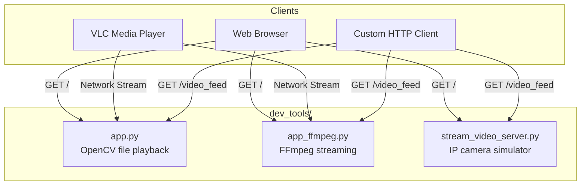
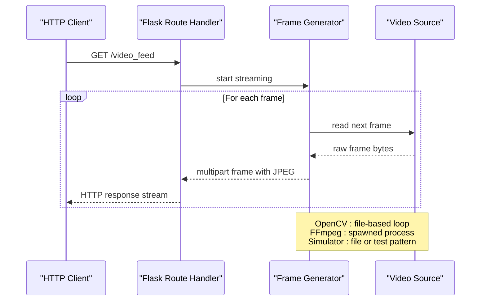
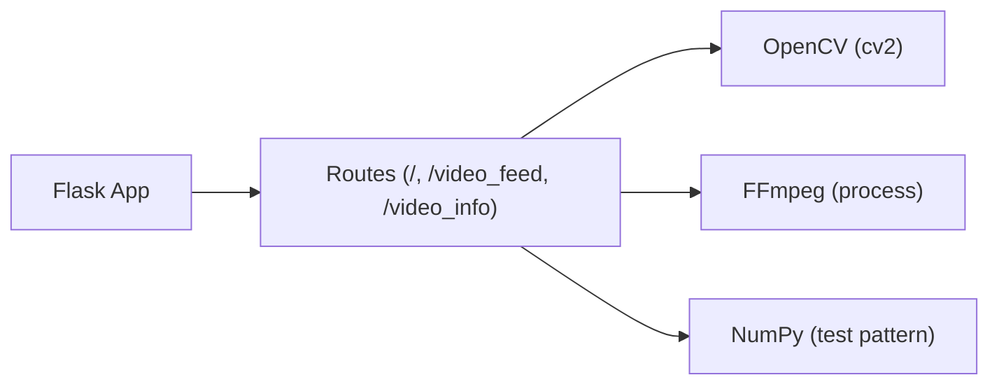

# REST API Endpoints

<cite>
**Referenced Files in This Document**
- [app.py](file://dev_tools/app.py)
- [app_ffmpeg.py](file://dev_tools/app_ffmpeg.py)
- [stream_video_server.py](file://dev_tools/stream_video_server.py)
- [README.md](file://dev_tools/README.md)
</cite>

## Table of Contents
1. [Introduction](#introduction)
2. [Project Structure](#project-structure)
3. [Core Components](#core-components)
4. [Architecture Overview](#architecture-overview)
5. [Detailed Component Analysis](#detailed-component-analysis)
6. [Dependency Analysis](#dependency-analysis)
7. [Performance Considerations](#performance-considerations)
8. [Troubleshooting Guide](#troubleshooting-guide)
9. [Conclusion](#conclusion)
10. [Appendices](#appendices)

## Introduction
This document describes the REST API endpoints exposed by three Flask-based development tools under dev_tools/. These tools simulate IP camera video feeds for testing Human Pose Estimation (HPE) pipelines and similar computer vision workloads. The focus areas are:
- File-based video playback streaming via OpenCV
- FFmpeg-based streaming with MJPEG over HTTP
- A development-only IP video stream simulator with optional looping and fallback test patterns

Each tool exposes a primary streaming endpoint and related status/index pages. Authentication, rate limiting, and configuration are documented below.

## Project Structure
The dev_tools/ directory contains three scripts that each run a minimal Flask server:
- app.py: OpenCV-based file playback streaming
- app_ffmpeg.py: FFmpeg-based streaming with metadata headers
- stream_video_server.py: Development-only IP camera simulator with test pattern fallback

**Diagram sources**
- [app.py:79-102](file://dev_tools/app.py#L79-L102)
- [app_ffmpeg.py:189-204](file://dev_tools/app_ffmpeg.py#L189-L204)
- [stream_video_server.py:206-209](file://dev_tools/stream_video_server.py#L206-L209)

**Section sources**
- [README.md:1-102](file://dev_tools/README.md#L1-L102)

## Core Components
- OpenCV Streaming Tool (app.py): Serves MJPEG over HTTP from a local MP4 file. Supports HEAD requests and graceful degradation if the video is unavailable.
- FFmpeg Streaming Tool (app_ffmpeg.py): Spawns ffmpeg to produce MJPEG frames, emitting metadata headers alongside each frame. Includes a JSON endpoint for video info.
- IP Camera Simulator (stream_video_server.py): Development-only tool that loops a video file or falls back to a static test pattern. Provides debug information and CLI configuration.

Key runtime configuration:
- Environment variables:
  - VIDEO_PATH: Path to the MP4 file used for streaming
  - PORT: TCP port the Flask server binds to (default varies by script)
- Command-line arguments:
  - stream_video_server.py accepts --video to override the default video path

**Section sources**
- [app.py:12-14](file://dev_tools/app.py#L12-L14)
- [app.py:136-139](file://dev_tools/app.py#L136-L139)
- [app_ffmpeg.py:18-20](file://dev_tools/app_ffmpeg.py#L18-L20)
- [app_ffmpeg.py:264-267](file://dev_tools/app_ffmpeg.py#L264-L267)
- [stream_video_server.py:214-219](file://dev_tools/stream_video_server.py#L214-L219)

## Architecture Overview
All three servers expose a shared streaming pattern: a multipart/x-mixed-replace HTTP stream with JPEG frames and a fixed boundary. Differences lie in the source pipeline and metadata.

**Diagram sources**
- [app.py:79-102](file://dev_tools/app.py#L79-L102)
- [app_ffmpeg.py:189-204](file://dev_tools/app_ffmpeg.py#L189-L204)
- [stream_video_server.py:206-209](file://dev_tools/stream_video_server.py#L206-L209)

## Detailed Component Analysis

### OpenCV Streaming Tool (app.py)
- Base URL: http://host:port
- Streaming endpoint: GET /video_feed
  - Method: GET
  - Response: multipart/x-mixed-replace; boundary=frame
  - Body: Alternating MJPEG frames with HTTP framing
  - HEAD support: Returns 204 No Content with correct Content-Type
  - Behavior: Plays the video once; does not loop
  - Fallback: If video cannot be opened, returns an empty stream
- Index endpoint: GET /
  - Returns a simple HTML page embedding the stream
- Configuration:
  - VIDEO_PATH: Environment variable for the MP4 path
  - PORT: Environment variable for the server port (default 8089)
- Notes:
  - Threading enabled for concurrency

Example usage:
- Start server and open browser to the index page
- Point VLC to http://host:port/video_feed
- For programmatic clients, issue GET /video_feed and consume the multipart stream

Status codes:
- 200 OK for successful streaming
- 204 No Content for HEAD requests
- Empty stream returned if initialization fails

Authentication:
- None configured

Rate limiting:
- Not implemented

**Section sources**
- [app.py:79-102](file://dev_tools/app.py#L79-L102)
- [app.py:104-134](file://dev_tools/app.py#L104-L134)
- [app.py:136-139](file://dev_tools/app.py#L136-L139)

### FFmpeg Streaming Tool (app_ffmpeg.py)
- Base URL: http://host:port
- Streaming endpoint: GET /video_feed
  - Method: GET
  - Response: multipart/x-mixed-replace; boundary=frame
  - Body: MJPEG frames with an X-Metadata header containing frame_number, server_timestamp, and elapsed_time
  - HEAD support: Returns 204 No Content with correct Content-Type
  - Behavior: Delegates looping and timing to ffmpeg
  - FFmpeg invocation includes scaling and quality controls
- Info endpoint: GET /video_info
  - Method: GET
  - Response: JSON object with original_fps, original_frames, duration, target_fps, converted_frames
  - Error: 500 with error message if video info cannot be determined
- Index endpoint: GET /
  - Returns an HTML page displaying video statistics
- Configuration:
  - VIDEO_PATH: Environment variable for the MP4 path
  - PORT: Environment variable for the server port (default 8089)
- Notes:
  - Threading enabled for concurrency
  - ffmpeg must be installed and available in PATH

Example usage:
- Start server and browse to / to inspect video stats
- Consume /video_feed with a client that reads X-Metadata headers
- Call /video_info to pre-compute expected frame counts

Status codes:
- 200 OK for successful streaming
- 204 No Content for HEAD requests
- 500 for /video_info errors

Authentication:
- None configured

Rate limiting:
- Not implemented

**Section sources**
- [app_ffmpeg.py:189-204](file://dev_tools/app_ffmpeg.py#L189-L204)
- [app_ffmpeg.py:206-219](file://dev_tools/app_ffmpeg.py#L206-L219)
- [app_ffmpeg.py:221-262](file://dev_tools/app_ffmpeg.py#L221-L262)
- [app_ffmpeg.py:264-267](file://dev_tools/app_ffmpeg.py#L264-L267)

### IP Camera Simulator (stream_video_server.py)
- Base URL: http://host:port
- Streaming endpoint: GET /video_feed
  - Method: GET
  - Response: multipart/x-mixed-replace; boundary=frame
  - Body: MJPEG frames
  - Behavior: Loops the video indefinitely; if missing, emits a static test pattern at ~2 FPS
- Index endpoint: GET /
  - Returns an HTML page with embedded stream and debug info (video path, resolution, FPS, frame count)
- Configuration:
  - --video: CLI argument to override the default video path
  - PORT: Hardcoded to 8089 in the script
- Notes:
  - Development-only; do not deploy in production
  - Uses OpenCV for file playback and generates a test pattern if the file is missing

Example usage:
- Run with default video or pass --video to select a file
- Browse to / for debug info and embedded player
- Consume /video_feed with any HTTP-capable client

Status codes:
- 200 OK for successful streaming
- 200 OK for index page

Authentication:
- None configured

Rate limiting:
- Not implemented

**Section sources**
- [stream_video_server.py:206-209](file://dev_tools/stream_video_server.py#L206-L209)
- [stream_video_server.py:173-204](file://dev_tools/stream_video_server.py#L173-L204)
- [stream_video_server.py:211-227](file://dev_tools/stream_video_server.py#L211-L227)

## Dependency Analysis
- All three tools depend on Flask for routing and HTTP serving.
- app.py depends on OpenCV (cv2) for file-based frame extraction.
- app_ffmpeg.py depends on FFmpeg being installed and available in PATH; it spawns ffmpeg to produce MJPEG frames.
- stream_video_server.py depends on OpenCV for file-based playback and NumPy for generating a test pattern.

**Diagram sources**
- [app.py:4-10](file://dev_tools/app.py#L4-L10)
- [app_ffmpeg.py:6-16](file://dev_tools/app_ffmpeg.py#L6-L16)
- [stream_video_server.py:8-18](file://dev_tools/stream_video_server.py#L8-L18)

**Section sources**
- [app.py:1-10](file://dev_tools/app.py#L1-L10)
- [app_ffmpeg.py:1-16](file://dev_tools/app_ffmpeg.py#L1-L16)
- [stream_video_server.py:1-18](file://dev_tools/stream_video_server.py#L1-L18)

## Performance Considerations
- Streaming protocol: All tools use multipart/x-mixed-replace with JPEG frames. This is lightweight but CPU-bound on the server side.
- Throughput: Expect modest bandwidth usage suitable for local development and testing.
- Latency: Low latency due to direct file or process-based frame generation.
- Scalability: Concurrency is enabled via threading; however, each streaming route may become a bottleneck due to CPU-bound decoding and encoding. Consider running multiple instances behind a reverse proxy if high concurrency is required.
- FFmpeg toolchain: Ensure ffmpeg is optimized and tuned for the target hardware; adjust scale and quality parameters as needed.

[No sources needed since this section provides general guidance]

## Troubleshooting Guide
Common issues and resolutions:
- FFmpeg not found
  - Symptom: Server logs indicate ffmpeg not available or failed to execute
  - Resolution: Install ffmpeg and ensure it is in PATH
- Video file not found or cannot be opened
  - Symptom: Logs indicate failure to open video; app.py returns empty stream; stream_video_server.py falls back to test pattern
  - Resolution: Verify VIDEO_PATH or --video argument; ensure file permissions and path correctness
- Port conflicts
  - Symptom: Server fails to bind to the configured port
  - Resolution: Change PORT or free the port; for stream_video_server.py, change the hardcoded port in the script
- Client compatibility
  - Symptom: VLC or browsers fail to play the stream
  - Resolution: Confirm the client supports MJPEG over HTTP and multipart/x-mixed-replace

**Section sources**
- [app_ffmpeg.py:72-84](file://dev_tools/app_ffmpeg.py#L72-L84)
- [app.py:38-40](file://dev_tools/app.py#L38-L40)
- [stream_video_server.py:40-50](file://dev_tools/stream_video_server.py#L40-L50)
- [stream_video_server.py:108-132](file://dev_tools/stream_video_server.py#L108-L132)

## Conclusion
These development tools provide simple, effective HTTP endpoints for MJPEG video streaming:
- Use app.py for straightforward file-based playback
- Use app_ffmpeg.py for metadata-rich streams and precomputed video info
- Use stream_video_server.py for development-only looping with fallback patterns

None of the tools implement authentication or rate limiting; deploy only in trusted, isolated environments.

[No sources needed since this section summarizes without analyzing specific files]

## Appendices

### Endpoint Reference Summary
- app.py
  - GET /video_feed: MJPEG stream; HEAD supported; plays once
  - GET /: HTML index page
- app_ffmpeg.py
  - GET /video_feed: MJPEG stream with X-Metadata headers; HEAD supported
  - GET /video_info: JSON with video statistics; 500 on error
  - GET /: HTML index page
- stream_video_server.py
  - GET /video_feed: MJPEG stream; loops video or shows test pattern
  - GET /: HTML index page with debug info

Configuration keys:
- VIDEO_PATH: Path to MP4 file
- PORT: TCP port for the server
- --video: Override video path (stream_video_server.py)

**Section sources**
- [app.py:79-102](file://dev_tools/app.py#L79-L102)
- [app_ffmpeg.py:189-204](file://dev_tools/app_ffmpeg.py#L189-L204)
- [app_ffmpeg.py:206-219](file://dev_tools/app_ffmpeg.py#L206-L219)
- [stream_video_server.py:206-209](file://dev_tools/stream_video_server.py#L206-L209)