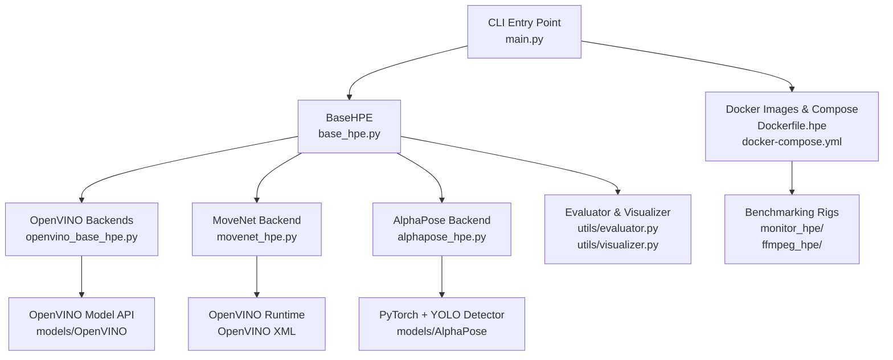
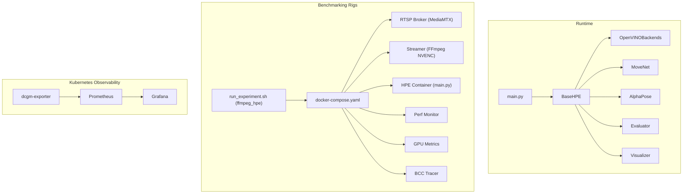
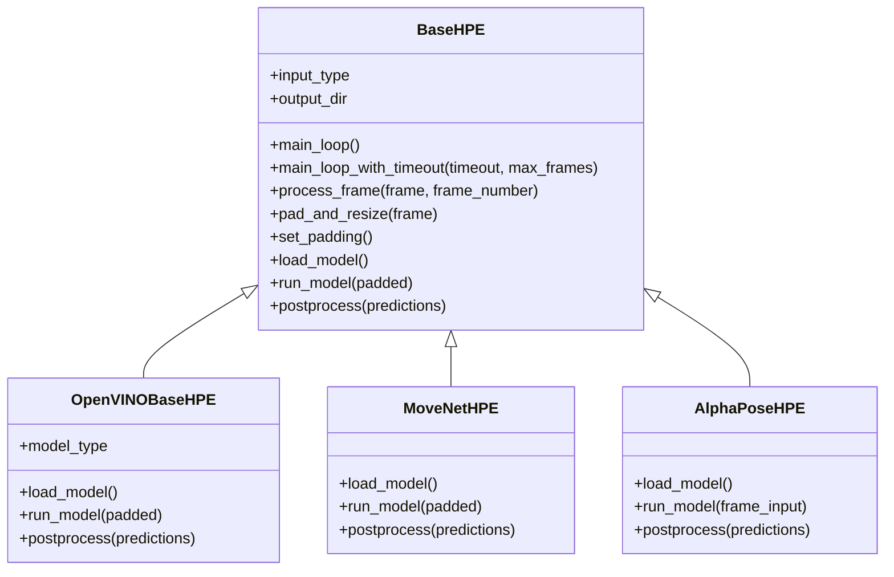
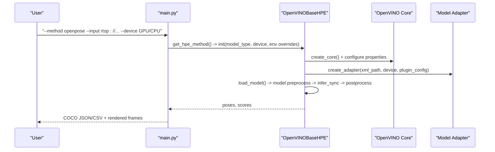
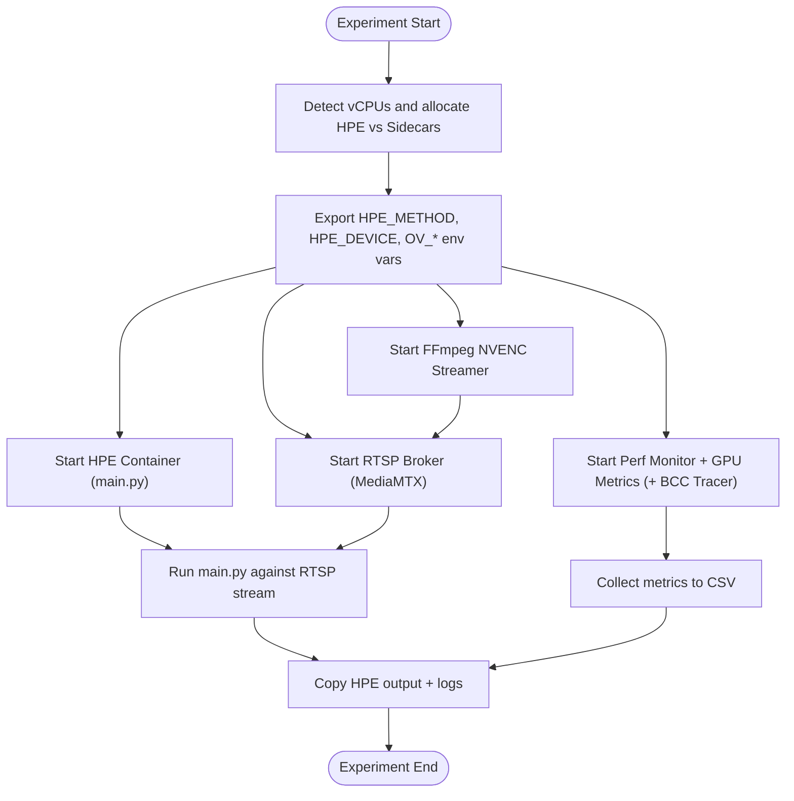
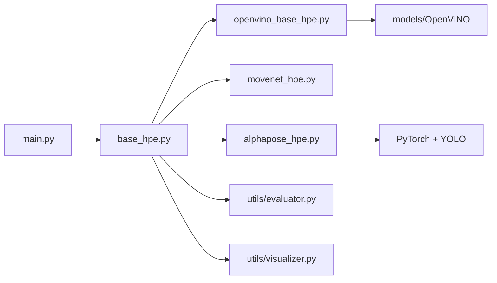
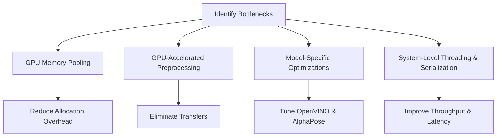

# Advanced Topics

<cite>
**Referenced Files in This Document**
- [README.md](file://README.md)
- [main.py](file://main.py)
- [base_hpe.py](file://base_hpe.py)
- [openvino_base_hpe.py](file://openvino_base_hpe.py)
- [movenet_hpe.py](file://movenet_hpe.py)
- [alphapose_hpe.py](file://alphapose_hpe.py)
- [utils/evaluator.py](file://utils/evaluator.py)
- [utils/visualizer.py](file://utils/visualizer.py)
- [Dockerfile.hpe](file://Dockerfile.hpe)
- [docker-compose.yml](file://docker-compose.yml)
- [OPTIMIZATION_PLAN.md](file://OPTIMIZATION_PLAN.md)
- [monitor_hpe/run_experiment.sh](file://monitor_hpe/run_experiment.sh)
- [ffmpeg_hpe/run_experiment.sh](file://ffmpeg_hpe/run_experiment.sh)
- [dev_tools/app.py](file://dev_tools/app.py)
</cite>

## Table of Contents
1. [Introduction](#introduction)
2. [Project Structure](#project-structure)
3. [Core Components](#core-components)
4. [Architecture Overview](#architecture-overview)
5. [Detailed Component Analysis](#detailed-component-analysis)
6. [Dependency Analysis](#dependency-analysis)
7. [Performance Considerations](#performance-considerations)
8. [Troubleshooting Guide](#troubleshooting-guide)
9. [Conclusion](#conclusion)
10. [Appendices](#appendices)

## Introduction
This document presents advanced topics for the pose estimation platform, focusing on expert-level customization, performance optimization, and research-grade deployment. It covers:
- Backend extension techniques for custom backends and hybrid pipelines
- Performance tuning strategies grounded in the repository’s optimization plan
- Advanced configuration for OpenVINO, PyTorch, and hardware acceleration
- Research methodologies for streaming experiments and throughput benchmarking
- Cloud and distributed deployment patterns using Docker Compose and Kubernetes
- Mathematical foundations of pose estimation outputs and evaluation metrics
- High-throughput debugging, profiling, and system optimization

## Project Structure
The repository combines a unified HPE library with a containerized benchmarking platform. The HPE library defines a shared pipeline with pluggable backends, while the benchmarking rigs orchestrate streaming, metrics, and tracing.

**Diagram sources**
- [main.py:51-242](file://main.py#L51-L242)
- [base_hpe.py:98-675](file://base_hpe.py#L98-L675)
- [openvino_base_hpe.py:56-412](file://openvino_base_hpe.py#L56-L412)
- [movenet_hpe.py:12-111](file://movenet_hpe.py#L12-L111)
- [alphapose_hpe.py:33-341](file://alphapose_hpe.py#L33-L341)
- [utils/evaluator.py:1-114](file://utils/evaluator.py#L1-L114)
- [utils/visualizer.py:1-53](file://utils/visualizer.py#L1-L53)
- [Dockerfile.hpe:1-122](file://Dockerfile.hpe#L1-L122)
- [docker-compose.yml:1-30](file://docker-compose.yml#L1-L30)

**Section sources**
- [README.md:20-403](file://README.md#L20-L403)
- [main.py:51-242](file://main.py#L51-L242)
- [base_hpe.py:98-675](file://base_hpe.py#L98-L675)

## Core Components
- Unified HPE pipeline: BaseHPE encapsulates input routing, decoding, preprocessing, inference, postprocessing, rendering, and output serialization. Backends implement only model loading, inference, and postprocessing.
- Backends:
  - OpenVINO-based models (OpenPose, HigherHRNet, EfficientHRNet variants) via the OpenVINO Model API
  - MoveNet via OpenVINO runtime (CPU-only)
  - AlphaPose via PyTorch + YOLO detector
- Utilities:
  - Evaluator: COCO-format JSON/CSV serialization and per-interval Tx volume measurement
  - Visualizer: OpenCV rendering of skeletons and bounding boxes
- Benchmarking platform: Containerized rigs orchestrated by Docker Compose to measure throughput, CPU/GPU utilization, memory, and network bandwidth under realistic streaming conditions.

**Section sources**
- [base_hpe.py:98-675](file://base_hpe.py#L98-L675)
- [openvino_base_hpe.py:56-412](file://openvino_base_hpe.py#L56-L412)
- [movenet_hpe.py:12-111](file://movenet_hpe.py#L12-L111)
- [alphapose_hpe.py:33-341](file://alphapose_hpe.py#L33-L341)
- [utils/evaluator.py:1-114](file://utils/evaluator.py#L1-L114)
- [utils/visualizer.py:1-53](file://utils/visualizer.py#L1-L53)

## Architecture Overview
The system supports multiple input modalities (image, video, webcam, HTTP/RTSP streams) and backends. The benchmarking rigs add streaming, metrics, and tracing.

**Diagram sources**
- [main.py:51-242](file://main.py#L51-L242)
- [base_hpe.py:98-675](file://base_hpe.py#L98-L675)
- [ffmpeg_hpe/run_experiment.sh:1-481](file://ffmpeg_hpe/run_experiment.sh#L1-L481)
- [docker-compose.yml:1-30](file://docker-compose.yml#L1-L30)

**Section sources**
- [README.md:210-403](file://README.md#L210-L403)
- [ffmpeg_hpe/run_experiment.sh:1-481](file://ffmpeg_hpe/run_experiment.sh#L1-L481)
- [docker-compose.yml:1-30](file://docker-compose.yml#L1-L30)

## Detailed Component Analysis

### BaseHPE: Shared Pipeline and Extension Surface
BaseHPE defines the end-to-end pipeline and the minimal contract backends must implement:
- Input detection: image, directory, video, webcam, HTTP/RTSP
- Video capture: PyNvCodec GPU decoding path and OpenCV fallback
- Preprocessing: padding and resizing to model input size
- Inference: delegated to backend-specific run_model()
- Postprocessing: backend-specific postprocess() returning Body objects
- Rendering and output: optional image/video saving and COCO serialization

**Diagram sources**
- [base_hpe.py:98-675](file://base_hpe.py#L98-L675)
- [openvino_base_hpe.py:56-412](file://openvino_base_hpe.py#L56-L412)
- [movenet_hpe.py:12-111](file://movenet_hpe.py#L12-L111)
- [alphapose_hpe.py:33-341](file://alphapose_hpe.py#L33-L341)

**Section sources**
- [base_hpe.py:98-675](file://base_hpe.py#L98-L675)

### OpenVINO Backends: Configuration, Threading, and CPU Pinning
OpenVINOBaseHPE centralizes:
- Model selection and input size configuration
- OpenVINO core configuration with performance mode, threads, streams, CPU pinning, and hyper-threading
- Pre/post-processing via the OpenVINO Model API
- Streaming URL handling with FFmpeg backend and buffer tuning

**Diagram sources**
- [main.py:207-237](file://main.py#L207-L237)
- [openvino_base_hpe.py:191-262](file://openvino_base_hpe.py#L191-L262)
- [openvino_base_hpe.py:263-282](file://openvino_base_hpe.py#L263-L282)
- [openvino_base_hpe.py:284-322](file://openvino_base_hpe.py#L284-L322)

**Section sources**
- [openvino_base_hpe.py:65-190](file://openvino_base_hpe.py#L65-L190)
- [openvino_base_hpe.py:191-262](file://openvino_base_hpe.py#L191-L262)
- [openvino_base_hpe.py:263-322](file://openvino_base_hpe.py#L263-L322)

### MoveNet Backend: CPU-Only OpenVINO Runtime
MoveNetHPE uses the OpenVINO runtime to compile and run the MoveNet XML on CPU. It sets model input size and provides a lightweight pipeline suitable for multi-instance deployments.

**Section sources**
- [movenet_hpe.py:12-111](file://movenet_hpe.py#L12-L111)

### AlphaPose Backend: PyTorch + YOLO Detector
AlphaPoseHPE integrates a YOLO detector and a pose model. It supports GPU/CPU, multiprocessing strategies, and custom preprocessing. The backend overrides padding/resizing to preserve original resolution.

**Section sources**
- [alphapose_hpe.py:33-341](file://alphapose_hpe.py#L33-L341)

### Evaluator and Visualizer: Output and Rendering
- Evaluator: Serializes detections to COCO JSON/CSV and computes per-interval transmitted data volume
- Visualizer: Draws skeletons and bounding boxes with configurable visibility thresholds and optional scores

**Section sources**
- [utils/evaluator.py:1-114](file://utils/evaluator.py#L1-L114)
- [utils/visualizer.py:1-53](file://utils/visualizer.py#L1-L53)

### Benchmarking Rigs: Streaming, Metrics, and Tracing
- monitor_hpe: Baseline CPU monitoring with auto-scaling based on vCPUs
- ffmpeg_hpe: Full streaming rig with RTSP broker, FFmpeg NVENC streamer, HPE container, perf monitor, GPU metrics, and optional BCC tracer
- Kubernetes observability: DCGM exporter, Prometheus, and Grafana for GPU telemetry

**Diagram sources**
- [monitor_hpe/run_experiment.sh:1-235](file://monitor_hpe/run_experiment.sh#L1-L235)
- [ffmpeg_hpe/run_experiment.sh:1-481](file://ffmpeg_hpe/run_experiment.sh#L1-L481)

**Section sources**
- [monitor_hpe/run_experiment.sh:1-235](file://monitor_hpe/run_experiment.sh#L1-L235)
- [ffmpeg_hpe/run_experiment.sh:1-481](file://ffmpeg_hpe/run_experiment.sh#L1-L481)
- [docker-compose.yml:1-30](file://docker-compose.yml#L1-L30)

## Dependency Analysis
- Backends depend on BaseHPE for input handling, preprocessing, rendering, and output serialization
- OpenVINO backends depend on the OpenVINO Model API and runtime
- AlphaPose backend depends on PyTorch and YOLO detector modules
- Evaluator and Visualizer are utilities consumed by BaseHPE
- Benchmarking rigs depend on Docker Compose and container images

**Diagram sources**
- [base_hpe.py:98-675](file://base_hpe.py#L98-L675)
- [openvino_base_hpe.py:56-412](file://openvino_base_hpe.py#L56-L412)
- [movenet_hpe.py:12-111](file://movenet_hpe.py#L12-L111)
- [alphapose_hpe.py:33-341](file://alphapose_hpe.py#L33-L341)
- [utils/evaluator.py:1-114](file://utils/evaluator.py#L1-L114)
- [utils/visualizer.py:1-53](file://utils/visualizer.py#L1-L53)
- [main.py:51-242](file://main.py#L51-L242)

**Section sources**
- [base_hpe.py:98-675](file://base_hpe.py#L98-L675)
- [openvino_base_hpe.py:56-412](file://openvino_base_hpe.py#L56-L412)
- [movenet_hpe.py:12-111](file://movenet_hpe.py#L12-L111)
- [alphapose_hpe.py:33-341](file://alphapose_hpe.py#L33-L341)
- [utils/evaluator.py:1-114](file://utils/evaluator.py#L1-L114)
- [utils/visualizer.py:1-53](file://utils/visualizer.py#L1-L53)
- [main.py:51-242](file://main.py#L51-L242)

## Performance Considerations
Grounded in the repository’s optimization plan, the following strategies apply across backends:

- GPU memory management and pooling
  - Eliminate GPU→CPU→GPU transfers by keeping tensors on device for preprocessing and inference
  - Implement GPU memory pools to reduce allocation overhead and fragmentation
  - Enable smart allocation and automatic cleanup with monitoring

- GPU-accelerated preprocessing
  - Replace OpenCV operations with GPU-native transforms (e.g., torchvision functional)
  - Batch person crops and resizing to improve kernel launch efficiency and memory bandwidth utilization

- AlphaPose-specific optimizations
  - GPU-resident detection preprocessing and batched NMS
  - Memory-efficient bounding box processing and optimized anchor generation

- OpenVINO performance tuning
  - Auto-tuned thread allocation and workload-aware performance hints
  - CPU affinity and memory bandwidth optimization
  - Model-specific tuning (e.g., preferred batch sizes and memory patterns)

- System-level improvements
  - Redesign threading architecture with dedicated decode and preprocessing threads
  - Memory-efficient data export with binary formats and batch serialization

**Diagram sources**
- [OPTIMIZATION_PLAN.md:1-374](file://OPTIMIZATION_PLAN.md#L1-L374)

**Section sources**
- [OPTIMIZATION_PLAN.md:1-374](file://OPTIMIZATION_PLAN.md#L1-L374)

## Troubleshooting Guide
Common issues and remedies observed in the repository:

- Network monitoring discrepancies
  - TX can be measured via PID-filtered bpftrace in the HPE process; RX must use BPF socket filters on the tracer interface (bcc-tracer) to capture the exact traffic seen by HPE
  - The netif_receive_skb bpftrace attempt in softirq context yields no RX data due to PID filtering limitations

- Video property detection for HTTP/RTSP
  - Auto-detection of FPS, duration, and frame count; fallback to user-provided timeout/max_frames when detection fails
  - For HTTP streams, frame counts may be adjusted to the streamer’s target FPS

- Container orchestration
  - Ensure RTSP broker readiness and stream publication before starting HPE
  - Confirm GPU runtime visibility settings for GPU-enabled backends

- Logging and structured events
  - Structured logging for session start/end and configuration changes aids debugging and reproducibility

**Section sources**
- [README.md:333-403](file://README.md#L333-L403)
- [main.py:64-188](file://main.py#L64-L188)
- [ffmpeg_hpe/run_experiment.sh:268-304](file://ffmpeg_hpe/run_experiment.sh#L268-L304)

## Conclusion
This platform provides a robust foundation for advanced pose estimation research and production deployment. By leveraging the unified BaseHPE abstraction, the benchmarking rigs, and the optimization strategies outlined in the repository’s plan, teams can:
- Extend backends with custom models and hybrid pipelines
- Achieve significant performance gains through GPU memory pooling, GPU-native preprocessing, and OpenVINO tuning
- Conduct rigorous experiments under realistic streaming conditions
- Scale across cloud and Kubernetes environments with observability stacks

## Appendices

### Mathematical Foundations of Pose Estimation Outputs
- COCO keypoint format: 17 keypoints per person with x, y, and visibility flag; global person score computed as the mean of keypoint scores
- Normalization: Keypoints are normalized to [0,1] relative to image width/height; bounding boxes derived from visible keypoints
- Evaluation: JSON/CSV serialization with per-frame entries; Tx volume measured per millisecond interval

**Section sources**
- [README.md:96-110](file://README.md#L96-L110)
- [utils/evaluator.py:11-47](file://utils/evaluator.py#L11-L47)
- [utils/evaluator.py:295-331](file://utils/evaluator.py#L295-L331)

### Advanced Configuration Options
- OpenVINO tuning via environment variables:
  - OV_THREADS, OV_MODE, OV_STREAMS, OV_CPU_PINNING, OV_HYPER_THREADING
- Device selection: CPU vs GPU for each backend
- Streaming: HTTP/RTSP with buffer tuning and FFmpeg backend selection

**Section sources**
- [openvino_base_hpe.py:65-93](file://openvino_base_hpe.py#L65-L93)
- [openvino_base_hpe.py:154-190](file://openvino_base_hpe.py#L154-L190)
- [base_hpe.py:202-248](file://base_hpe.py#L202-L248)

### Cloud Deployment and Distributed Patterns
- Container images: Multi-stage builds with FFmpeg, OpenCV, and OpenVINO support
- Orchestration: Docker Compose for local rigs; Kubernetes stack for GPU telemetry (DCGM exporter, Prometheus, Grafana)
- Scalability: Auto-scaling based on vCPUs; resource allocation tuned per model family

**Section sources**
- [Dockerfile.hpe:1-122](file://Dockerfile.hpe#L1-L122)
- [docker-compose.yml:1-30](file://docker-compose.yml#L1-L30)
- [monitor_hpe/run_experiment.sh:12-80](file://monitor_hpe/run_experiment.sh#L12-L80)
- [ffmpeg_hpe/run_experiment.sh:99-178](file://ffmpeg_hpe/run_experiment.sh#L99-L178)

### Experimental Methodologies and Research Applications
- Streaming experiments: RTSP via MediaMTX; HTTP MJPEG via Flask server for local testing
- Metrics: CPU%, RSS, GPU utilization/temp/power, network RX/TX via bpftrace/BCC
- Reproducibility: Timestamped results directories, structured logs, and containerized provenance

**Section sources**
- [README.md:210-403](file://README.md#L210-L403)
- [dev_tools/app.py:1-140](file://dev_tools/app.py#L1-L140)
- [ffmpeg_hpe/run_experiment.sh:394-481](file://ffmpeg_hpe/run_experiment.sh#L394-L481)

### High-Throughput Debugging and Profiling
- Profiling tools: NVIDIA Nsight Compute/Systems, PyTorch Profiler, custom memory pool statistics
- Monitoring: Grafana dashboards, Prometheus scraping DCGM exporter
- Practical tips: Reduce CPU thread contention, avoid GPU→CPU transfers, batch preprocessing, and tune OpenVINO threads and streams

**Section sources**
- [OPTIMIZATION_PLAN.md:323-374](file://OPTIMIZATION_PLAN.md#L323-L374)
- [docker-compose.yml:1-30](file://docker-compose.yml#L1-L30)