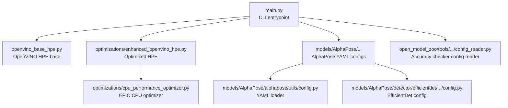
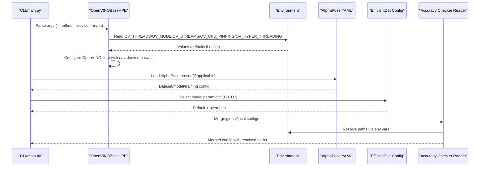
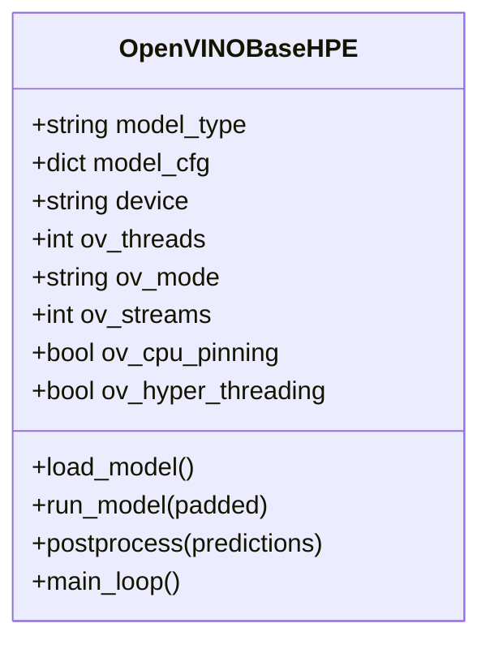
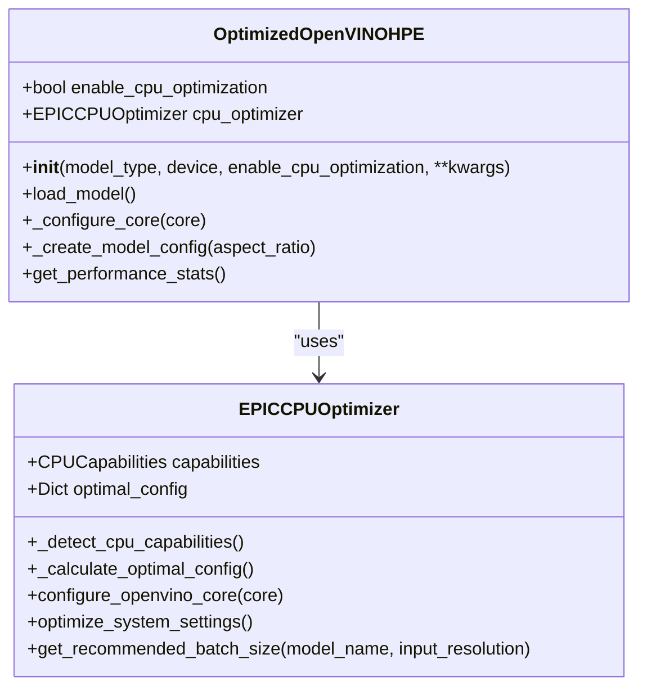
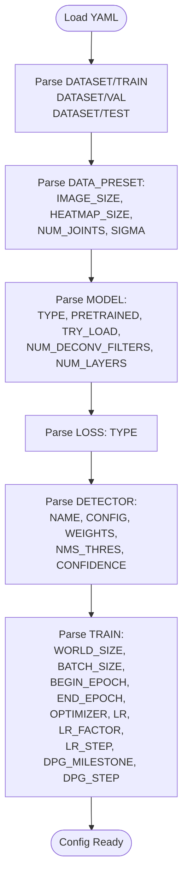
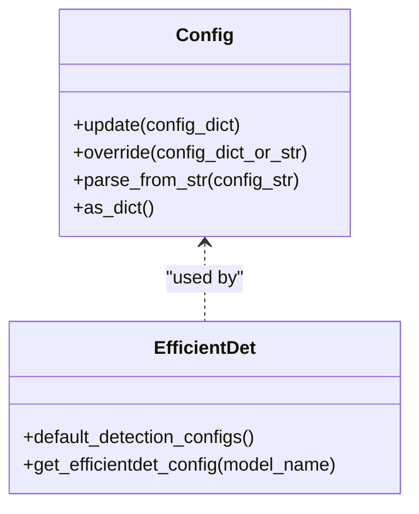
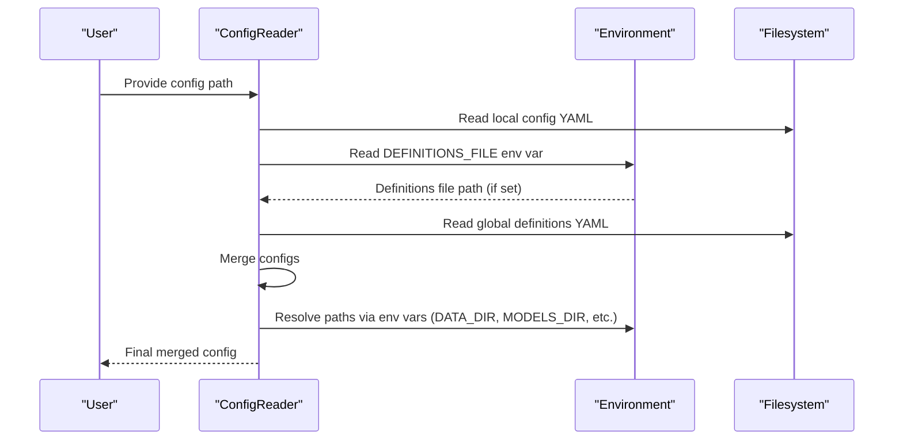
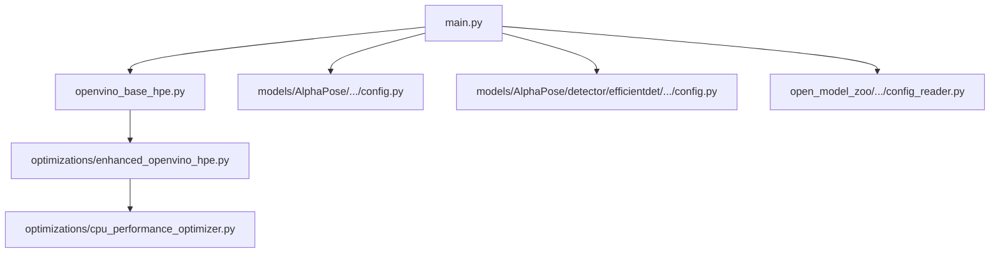

# Configuration and Customization

<cite>
**Referenced Files in This Document**
- [main.py](file://main.py)
- [openvino_base_hpe.py](file://openvino_base_hpe.py)
- [optimizations/enhanced_openvino_hpe.py](file://optimizations/enhanced_openvino_hpe.py)
- [optimizations/cpu_performance_optimizer.py](file://optimizations/cpu_performance_optimizer.py)
- [models/AlphaPose/pretrained_models/256x192_res50_lr1e-3_1x.yaml](file://models/AlphaPose/pretrained_models/256x192_res50_lr1e-3_1x.yaml)
- [models/AlphaPose/alphapose/utils/config.py](file://models/AlphaPose/alphapose/utils/config.py)
- [models/AlphaPose/detector/efficientdet/effdet/config/config.py](file://models/AlphaPose/detector/efficientdet/effdet/config/config.py)
- [open_model_zoo/tools/accuracy_checker/accuracy_checker/config/config_reader.py](file://open_model_zoo/tools/accuracy_checker/accuracy_checker/config/config_reader.py)
</cite>

## Table of Contents
1. [Introduction](#introduction)
2. [Project Structure](#project-structure)
3. [Core Components](#core-components)
4. [Architecture Overview](#architecture-overview)
5. [Detailed Component Analysis](#detailed-component-analysis)
6. [Dependency Analysis](#dependency-analysis)
7. [Performance Considerations](#performance-considerations)
8. [Troubleshooting Guide](#troubleshooting-guide)
9. [Conclusion](#conclusion)
10. [Appendices](#appendices)

## Introduction
This document explains configuration and customization options for the Human Pose Estimation (HPE) framework. It covers model-specific configuration files, environment variable management, and system parameter tuning for OpenVINO-based HPE, AlphaPose, and related components. You will learn how to customize inference parameters, adjust performance settings, and configure different deployment scenarios. Guidance is included for modifying model architectures, adjusting preprocessing parameters, and optimizing for specific hardware configurations. Examples illustrate common customization scenarios and their impact on system performance.

## Project Structure
The HPE framework integrates multiple components:
- OpenVINO-based HPE backends with configurable performance parameters
- AlphaPose with YAML-based training and model presets
- OpenVINO model API and pipelines
- CPU performance optimization tailored for high-core-count x86_64 systems
- Accuracy checker configuration reader supporting environment-driven overrides

**Diagram sources**
- [main.py:22-99](file://main.py#L22-L99)
- [openvino_base_hpe.py:55-93](file://openvino_base_hpe.py#L55-L93)
- [optimizations/enhanced_openvino_hpe.py:25-66](file://optimizations/enhanced_openvino_hpe.py#L25-L66)
- [optimizations/cpu_performance_optimizer.py:34-49](file://optimizations/cpu_performance_optimizer.py#L34-L49)
- [models/AlphaPose/pretrained_models/256x192_res50_lr1e-3_1x.yaml:1-66](file://models/AlphaPose/pretrained_models/256x192_res50_lr1e-3_1x.yaml#L1-L66)
- [models/AlphaPose/alphapose/utils/config.py:5-9](file://models/AlphaPose/alphapose/utils/config.py#L5-L9)
- [models/AlphaPose/detector/efficientdet/effdet/config/config.py:24-106](file://models/AlphaPose/detector/efficientdet/effdet/config/config.py#L24-L106)
- [open_model_zoo/tools/accuracy_checker/accuracy_checker/config/config_reader.py:93-142](file://open_model_zoo/tools/accuracy_checker/accuracy_checker/config/config_reader.py#L93-L142)

**Section sources**
- [main.py:22-99](file://main.py#L22-L99)
- [openvino_base_hpe.py:55-93](file://openvino_base_hpe.py#L55-L93)

## Core Components
- OpenVINO HPE base class with environment-driven performance tuning
- Optimized OpenVINO HPE with CPU-specific tuning for EPIC processors
- AlphaPose YAML configuration loader and presets
- EfficientDet configuration system
- Accuracy checker configuration reader supporting environment variables

Key configuration surfaces:
- Environment variables for OpenVINO tuning
- YAML presets for AlphaPose training/inference
- EfficientDet model parameter dictionaries
- Accuracy checker merging and environment-based path resolution

**Section sources**
- [openvino_base_hpe.py:64-93](file://openvino_base_hpe.py#L64-L93)
- [optimizations/enhanced_openvino_hpe.py:25-66](file://optimizations/enhanced_openvino_hpe.py#L25-L66)
- [models/AlphaPose/alphapose/utils/config.py:5-9](file://models/AlphaPose/alphapose/utils/config.py#L5-L9)
- [models/AlphaPose/detector/efficientdet/effdet/config/config.py:190-274](file://models/AlphaPose/detector/efficientdet/effdet/config/config.py#L190-L274)
- [open_model_zoo/tools/accuracy_checker/accuracy_checker/config/config_reader.py:93-142](file://open_model_zoo/tools/accuracy_checker/accuracy_checker/config/config_reader.py#L93-L142)

## Architecture Overview
The configuration architecture combines CLI arguments, environment variables, and model-specific presets to produce runtime behavior. OpenVINO HPE reads environment variables to set threads, streams, performance mode, and CPU pinning. AlphaPose loads YAML presets for dataset, model, and training parameters. EfficientDet provides model parameter dictionaries and a configuration class with override mechanisms. Accuracy checker merges global and local configuration files and resolves paths using environment variables.

**Diagram sources**
- [main.py:47-99](file://main.py#L47-L99)
- [openvino_base_hpe.py:72-85](file://openvino_base_hpe.py#L72-L85)
- [models/AlphaPose/pretrained_models/256x192_res50_lr1e-3_1x.yaml:1-66](file://models/AlphaPose/pretrained_models/256x192_res50_lr1e-3_1x.yaml#L1-L66)
- [models/AlphaPose/detector/efficientdet/effdet/config/config.py:269-274](file://models/AlphaPose/detector/efficientdet/effdet/config/config.py#L269-L274)
- [open_model_zoo/tools/accuracy_checker/accuracy_checker/config/config_reader.py:130-142](file://open_model_zoo/tools/accuracy_checker/accuracy_checker/config/config_reader.py#L130-L142)

## Detailed Component Analysis

### OpenVINO HPE Configuration
- Environment variables:
  - OV_THREADS: inference threads
  - OV_MODE: performance mode (throughput or latency)
  - OV_STREAMS: number of streams
  - OV_CPU_PINNING: enable CPU pinning
  - OV_HYPER_THREADING: enable hyper-threading
- Device selection:
  - CPU or GPU; GPU support varies by model
- Model configuration:
  - Input sizes and architecture for OpenPose and EfficientHRNet variants
- Core configuration:
  - Sets performance mode, threads, streams, CPU pinning, and hyper-threading
  - Logs effective settings for verification

**Diagram sources**
- [openvino_base_hpe.py:55-93](file://openvino_base_hpe.py#L55-L93)
- [openvino_base_hpe.py:153-182](file://openvino_base_hpe.py#L153-L182)
- [openvino_base_hpe.py:183-261](file://openvino_base_hpe.py#L183-L261)

**Section sources**
- [openvino_base_hpe.py:64-93](file://openvino_base_hpe.py#L64-L93)
- [openvino_base_hpe.py:153-182](file://openvino_base_hpe.py#L153-L182)
- [openvino_base_hpe.py:183-261](file://openvino_base_hpe.py#L183-L261)

### Optimized OpenVINO HPE for EPIC CPUs
- Automatically detects CPU capabilities and applies optimal thread, stream, and performance hints
- Applies NUMA-aware configuration and memory bandwidth optimizations
- Provides factory function to create optimized instances
- Includes benchmarking utilities for comparing standard vs optimized performance

**Diagram sources**
- [optimizations/enhanced_openvino_hpe.py:25-66](file://optimizations/enhanced_openvino_hpe.py#L25-L66)
- [optimizations/enhanced_openvino_hpe.py:77-131](file://optimizations/enhanced_openvino_hpe.py#L77-L131)
- [optimizations/enhanced_openvino_hpe.py:132-167](file://optimizations/enhanced_openvino_hpe.py#L132-L167)
- [optimizations/cpu_performance_optimizer.py:34-49](file://optimizations/cpu_performance_optimizer.py#L34-L49)
- [optimizations/cpu_performance_optimizer.py:100-227](file://optimizations/cpu_performance_optimizer.py#L100-L227)
- [optimizations/cpu_performance_optimizer.py:336-403](file://optimizations/cpu_performance_optimizer.py#L336-L403)

**Section sources**
- [optimizations/enhanced_openvino_hpe.py:25-66](file://optimizations/enhanced_openvino_hpe.py#L25-L66)
- [optimizations/enhanced_openvino_hpe.py:77-131](file://optimizations/enhanced_openvino_hpe.py#L77-L131)
- [optimizations/cpu_performance_optimizer.py:100-227](file://optimizations/cpu_performance_optimizer.py#L100-L227)
- [optimizations/cpu_performance_optimizer.py:336-403](file://optimizations/cpu_performance_optimizer.py#L336-L403)

### AlphaPose Configuration (YAML Presets)
- Dataset configuration: training/validation/test splits, augmentation parameters
- Data preset: image size, heatmap size, number of joints
- Model configuration: architecture type, pretrained weights, deconv filters, layers
- Loss configuration: loss type
- Detector configuration: detector name, config path, weights, NMS threshold, confidence
- Training configuration: world size, batch size, epoch schedule, optimizer, learning rate

**Diagram sources**
- [models/AlphaPose/pretrained_models/256x192_res50_lr1e-3_1x.yaml:1-66](file://models/AlphaPose/pretrained_models/256x192_res50_lr1e-3_1x.yaml#L1-L66)

**Section sources**
- [models/AlphaPose/pretrained_models/256x192_res50_lr1e-3_1x.yaml:1-66](file://models/AlphaPose/pretrained_models/256x192_res50_lr1e-3_1x.yaml#L1-L66)
- [models/AlphaPose/alphapose/utils/config.py:5-9](file://models/AlphaPose/alphapose/utils/config.py#L5-L9)

### EfficientDet Configuration System
- Default detection configuration with image size, input random horizontal flip, scale range, autoaugment policy, and class count
- Model parameter dictionaries for D0..D7 with backbone names, image size, FPN channels, repeats, and anchor scale
- Config class with update/override mechanisms and string parsing for overrides

**Diagram sources**
- [models/AlphaPose/detector/efficientdet/effdet/config/config.py:24-106](file://models/AlphaPose/detector/efficientdet/effdet/config/config.py#L24-L106)
- [models/AlphaPose/detector/efficientdet/effdet/config/config.py:190-274](file://models/AlphaPose/detector/efficientdet/effdet/config/config.py#L190-L274)

**Section sources**
- [models/AlphaPose/detector/efficientdet/effdet/config/config.py:24-106](file://models/AlphaPose/detector/efficientdet/effdet/config/config.py#L24-L106)
- [models/AlphaPose/detector/efficientdet/effdet/config/config.py:190-274](file://models/AlphaPose/detector/efficientdet/effdet/config/config.py#L190-L274)

### Accuracy Checker Configuration Reader
- Reads local and global configuration files
- Supports environment variable DEFINITIONS_FILE to locate global definitions
- Merges global and local configs, filters launchers by device/framework/backend, and converts paths using environment variables

**Diagram sources**
- [open_model_zoo/tools/accuracy_checker/accuracy_checker/config/config_reader.py:93-142](file://open_model_zoo/tools/accuracy_checker/accuracy_checker/config/config_reader.py#L93-L142)
- [open_model_zoo/tools/accuracy_checker/accuracy_checker/config/config_reader.py:299-334](file://open_model_zoo/tools/accuracy_checker/accuracy_checker/config/config_reader.py#L299-L334)

**Section sources**
- [open_model_zoo/tools/accuracy_checker/accuracy_checker/config/config_reader.py:93-142](file://open_model_zoo/tools/accuracy_checker/accuracy_checker/config/config_reader.py#L93-L142)
- [open_model_zoo/tools/accuracy_checker/accuracy_checker/config/config_reader.py:299-334](file://open_model_zoo/tools/accuracy_checker/accuracy_checker/config/config_reader.py#L299-L334)

## Dependency Analysis
- main.py depends on OpenVINO HPE, AlphaPose HPE, and MoveNet HPE implementations
- OpenVINO HPE depends on OpenVINO model API and pipelines
- Optimized OpenVINO HPE depends on EPIC CPU optimizer
- AlphaPose YAML loader depends on YAML and EasyDict
- EfficientDet config depends on AST, JSON, and six
- Accuracy checker config reader depends on YAML, pathlib, and environment variables

**Diagram sources**
- [main.py:10-12](file://main.py#L10-L12)
- [openvino_base_hpe.py:15-17](file://openvino_base_hpe.py#L15-L17)
- [optimizations/enhanced_openvino_hpe.py:15-22](file://optimizations/enhanced_openvino_hpe.py#L15-L22)
- [optimizations/cpu_performance_optimizer.py:16-17](file://optimizations/cpu_performance_optimizer.py#L16-L17)
- [models/AlphaPose/alphapose/utils/config.py:1](file://models/AlphaPose/alphapose/utils/config.py#L1)
- [models/AlphaPose/detector/efficientdet/effdet/config/config.py:8](file://models/AlphaPose/detector/efficientdet/effdet/config/config.py#L8)
- [open_model_zoo/tools/accuracy_checker/accuracy_checker/config/config_reader.py:17-25](file://open_model_zoo/tools/accuracy_checker/accuracy_checker/config/config_reader.py#L17-L25)

**Section sources**
- [main.py:10-12](file://main.py#L10-L12)
- [openvino_base_hpe.py:15-17](file://openvino_base_hpe.py#L15-L17)
- [optimizations/enhanced_openvino_hpe.py:15-22](file://optimizations/enhanced_openvino_hpe.py#L15-L22)
- [optimizations/cpu_performance_optimizer.py:16-17](file://optimizations/cpu_performance_optimizer.py#L16-L17)
- [models/AlphaPose/alphapose/utils/config.py:1](file://models/AlphaPose/alphapose/utils/config.py#L1)
- [models/AlphaPose/detector/efficientdet/effdet/config/config.py:8](file://models/AlphaPose/detector/efficientdet/effdet/config/config.py#L8)
- [open_model_zoo/tools/accuracy_checker/accuracy_checker/config/config_reader.py:17-25](file://open_model_zoo/tools/accuracy_checker/accuracy_checker/config/config_reader.py#L17-L25)

## Performance Considerations
- OpenVINO tuning:
  - Use OV_MODE to switch between throughput and latency modes
  - Tune OV_THREADS and OV_STREAMS for your workload
  - Enable OV_CPU_PINNING and manage OV_HYPER_THREADING based on system topology
- CPU optimization for EPIC processors:
  - Automatic detection of physical/logical cores, base/max frequencies, L3 cache, NUMA nodes, and AVX support
  - NUMA-aware thread allocation and memory bandwidth optimization
  - Model-specific tuning for OpenPose, EfficientHRNet variants, and HigherHRNet
- Batch sizing:
  - Estimate memory usage per sample and balance against CPU availability
  - Recommended batch sizes vary by model complexity and input resolution
- System-level optimizations:
  - CPU governor set to performance mode
  - Disable power management features that cause latency spikes
  - Increase process priority for inference workloads

[No sources needed since this section provides general guidance]

## Troubleshooting Guide
- OpenVINO configuration mismatches:
  - Verify effective settings printed after core configuration
  - Ensure device selection aligns with model GPU support
- AlphaPose preset issues:
  - Confirm dataset paths and augmentation parameters
  - Validate model architecture and pretrained weights paths
- EfficientDet configuration:
  - Use override mechanism to apply model-specific parameters
  - Parse string overrides for dynamic configuration updates
- Accuracy checker configuration:
  - Set DEFINITIONS_FILE environment variable to locate global definitions
  - Ensure paths are resolved using environment variables for datasets/models

**Section sources**
- [openvino_base_hpe.py:174-181](file://openvino_base_hpe.py#L174-L181)
- [models/AlphaPose/pretrained_models/256x192_res50_lr1e-3_1x.yaml:1-66](file://models/AlphaPose/pretrained_models/256x192_res50_lr1e-3_1x.yaml#L1-L66)
- [models/AlphaPose/detector/efficientdet/effdet/config/config.py:72-82](file://models/AlphaPose/detector/efficientdet/effdet/config/config.py#L72-L82)
- [open_model_zoo/tools/accuracy_checker/accuracy_checker/config/config_reader.py:130-142](file://open_model_zoo/tools/accuracy_checker/accuracy_checker/config/config_reader.py#L130-L142)

## Conclusion
The HPE framework offers flexible configuration through environment variables, YAML presets, and model-specific configuration classes. OpenVINO HPE supports runtime tuning for throughput and latency, while the EPIC CPU optimizer provides automatic, workload-aware optimization for high-core-count systems. AlphaPose and EfficientDet configurations enable precise control over model architectures and training parameters. Accuracy checker configuration reader simplifies merging and resolving configuration files using environment variables. By combining these configuration surfaces, you can tailor the system to diverse deployment scenarios and hardware constraints.

[No sources needed since this section summarizes without analyzing specific files]

## Appendices

### Environment Variables Reference
- OV_THREADS: OpenVINO inference threads
- OV_MODE: OpenVINO performance mode (throughput or latency)
- OV_STREAMS: Number of streams
- OV_CPU_PINNING: Enable CPU pinning
- OV_HYPER_THREADING: Enable hyper-threading
- DEFINITIONS_FILE: Path to global definitions for accuracy checker

**Section sources**
- [openvino_base_hpe.py:72-85](file://openvino_base_hpe.py#L72-L85)
- [open_model_zoo/tools/accuracy_checker/accuracy_checker/config/config_reader.py:83](file://open_model_zoo/tools/accuracy_checker/accuracy_checker/config/config_reader.py#L83)

### Common Customization Scenarios
- Real-time latency optimization:
  - Set OV_MODE=latency, reduce OV_STREAMS, enable OV_CPU_PINNING
  - Use OptimizedOpenVINOHPE with model-specific tuning for AE1
- Throughput-heavy batch processing:
  - Set OV_MODE=throughput, increase OV_THREADS, tune OV_STREAMS
  - Apply NUMA-aware configuration for multi-socket systems
- AlphaPose training customization:
  - Modify dataset paths, augmentation parameters, and training schedule in YAML
  - Adjust model architecture and deconv filters for desired complexity
- EfficientDet scaling:
  - Select model variant (D0..D7) and apply model-specific parameter overrides
  - Use string parsing to dynamically adjust configuration during runtime

**Section sources**
- [optimizations/enhanced_openvino_hpe.py:169-217](file://optimizations/enhanced_openvino_hpe.py#L169-L217)
- [optimizations/cpu_performance_optimizer.py:100-227](file://optimizations/cpu_performance_optimizer.py#L100-L227)
- [models/AlphaPose/pretrained_models/256x192_res50_lr1e-3_1x.yaml:1-66](file://models/AlphaPose/pretrained_models/256x192_res50_lr1e-3_1x.yaml#L1-L66)
- [models/AlphaPose/detector/efficientdet/effdet/config/config.py:269-274](file://models/AlphaPose/detector/efficientdet/effdet/config/config.py#L269-L274)