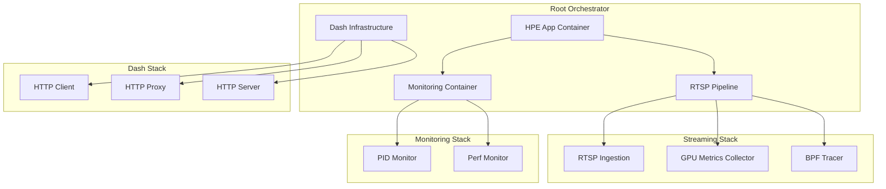
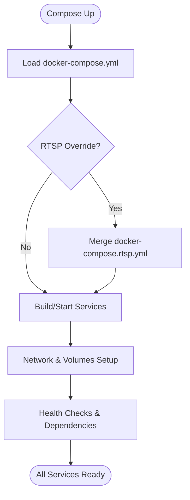
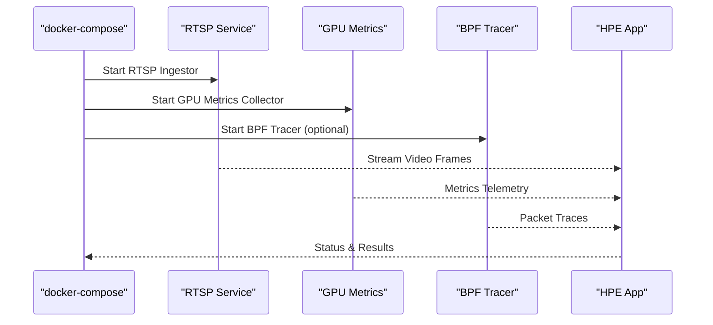
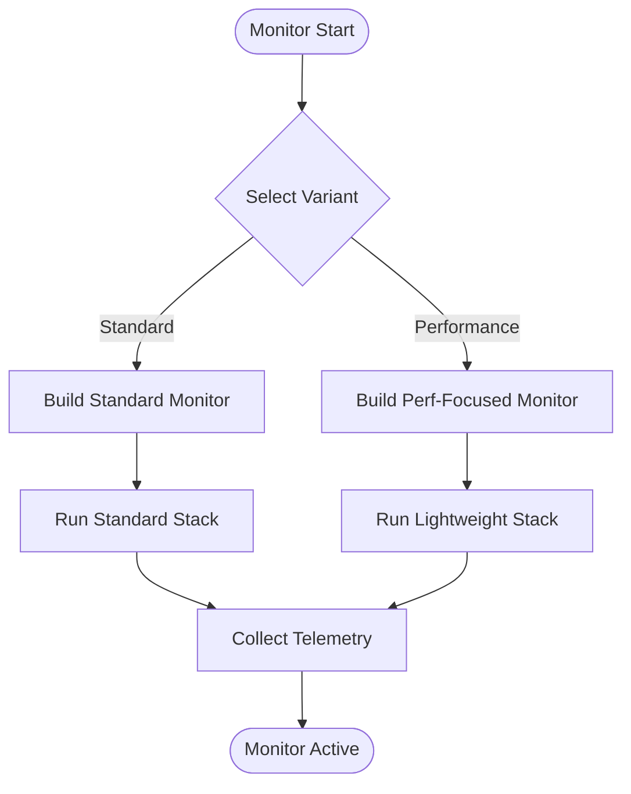
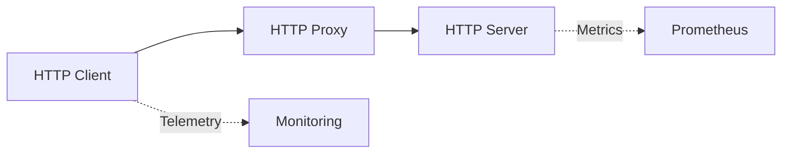
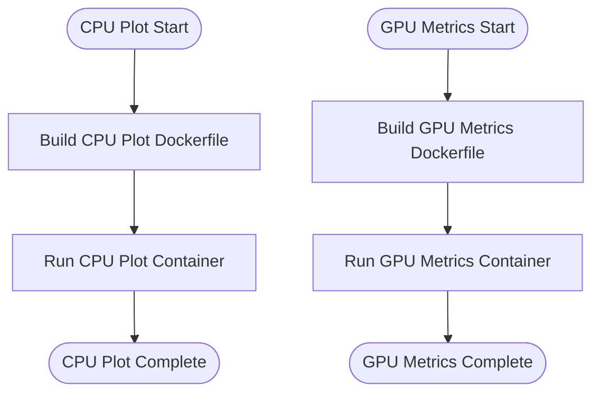
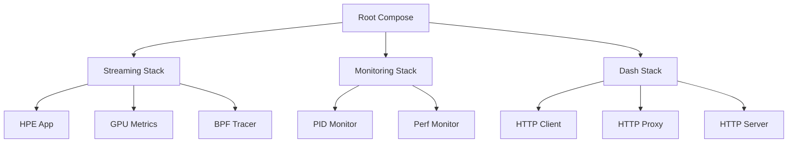

# Containerized Deployment

<cite>
**Referenced Files in This Document**
- [Dockerfile.hpe](file://Dockerfile.hpe)
- [docker-compose.yml](file://docker-compose.yml)
- [docker-compose.rtsp.yml](file://docker-compose.rtsp.yml)
- [ffmpeg_hpe/docker-compose.yaml](file://ffmpeg_hpe/docker-compose.yaml)
- [ffmpeg_hpe/Dockerfile.gpu_metrics](file://ffmpeg_hpe/Dockerfile.gpu_metrics)
- [ffmpeg_hpe/bpftrace-tracer/Dockerfile](file://ffmpeg_hpe/bpftrace-tracer/Dockerfile)
- [ffmpeg_hpe/bpftrace-tracer/Dockerfile.bcc](file://ffmpeg_hpe/bpftrace-tracer/Dockerfile.bcc)
- [ffmpeg_hpe/bpftrace-tracer/Dockerfile.wind](file://ffmpeg_hpe/bpftrace-tracer/Dockerfile.wind)
- [ffmpeg_hpe/entrypoint.sh](file://ffmpeg_hpe/entrypoint.sh)
- [monitor_hpe/Dockerfile](file://monitor_hpe/Dockerfile)
- [monitor_hpe/Dockerfile.perf](file://monitor_hpe/Dockerfile.perf)
- [monitor_hpe/docker-compose.yaml](file://monitor_hpe/docker-compose.yaml)
- [monitor_hpe/docker-compose.perf.yml](file://monitor_hpe/docker-compose.perf.yml)
- [dev_tools/Dockerfile](file://dev_tools/Dockerfile)
- [recent-dash/HTTP-Client.Dockerfile](file://recent-dash/HTTP-Client.Dockerfile)
- [recent-dash/HTTP-Proxy.Dockerfile](file://recent-dash/HTTP-Proxy.Dockerfile)
- [recent-dash/HTTP-Server.Dockerfile](file://recent-dash/HTTP-Server.Dockerfile)
- [recent-dash/docker-compose.yml](file://recent-dash/docker-compose.yml)
- [recent-dash/docker-compose.infra.yml](file://recent-dash/docker-compose.infra.yml)
- [Measure_plot_cpu_perf/Dockerfile](file://Measure_plot_cpu_perf/Dockerfile)
- [Measure_gpu_dcgm/Dockerfile.gpu_metrics](file://Measure_gpu_dcgm/Dockerfile.gpu_metrics)
- [prometheus.yml](file://prometheus.yml)
- [.dockerignore](file://.dockerignore)
- [README.md](file://README.md)
</cite>

## Table of Contents
1. [Introduction](#introduction)
2. [Project Structure](#project-structure)
3. [Core Components](#core-components)
4. [Architecture Overview](#architecture-overview)
5. [Detailed Component Analysis](#detailed-component-analysis)
6. [Dependency Analysis](#dependency-analysis)
7. [Performance Considerations](#performance-considerations)
8. [Troubleshooting Guide](#troubleshooting-guide)
9. [Conclusion](#conclusion)
10. [Appendices](#appendices)

## Introduction
This document provides comprehensive guidance for containerized deployment of the Human Pose Estimation (HPE) measurement platform. It covers Docker configurations for all major components, multi-container orchestration via docker-compose, service dependencies, and network configuration. It also documents Dockerfile variants optimized for different deployment scenarios, production deployment considerations, scaling strategies, resource allocation, customization guidelines, lifecycle management, cloud platform integration, and security and performance optimization recommendations.

## Project Structure
The repository organizes containerization artifacts across multiple subprojects:
- Root-level orchestrator and shared assets
- ffmpeg_hpe: RTSP streaming pipeline and tracing utilities
- monitor_hpe: HPE monitoring and performance measurement
- recent-dash: HTTP infrastructure and dashboards
- dev_tools: developer tooling container
- Measure_*: specialized metric collection containers

```mermaid
graph TB
subgraph "Root Orchestration"
DC["docker-compose.yml"]
DCR["docker-compose.rtsp.yml"]
PD["prometheus.yml"]
DK[".dockerignore"]
end
subgraph "FFMPEG HPE Pipeline"
FDC["ffmpeg_hpe/docker-compose.yaml"]
FDG["ffmpeg_hpe/Dockerfile.gpu_metrics"]
FBT["ffmpeg_hpe/bpftrace-tracer/Dockerfile*"]
FE["ffmpeg_hpe/entrypoint.sh"]
end
subgraph "Monitoring"
MD["monitor_hpe/Dockerfile"]
MDP["monitor_hpe/Dockerfile.perf"]
MDC["monitor_hpe/docker-compose.yaml"]
MDCP["monitor_hpe/docker-compose.perf.yml"]
end
subgraph "Recent Dash"
RDC["recent-dash/docker-compose.yml"]
RDCC["recent-dash/docker-compose.infra.yml"]
RHCD["recent-dash/HTTP-Client.Dockerfile"]
RHDD["recent-dash/HTTP-Server.Dockerfile"]
RHOD["recent-dash/HTTP-Proxy.Dockerfile"]
end
subgraph "Measurement Tools"
MPD["Measure_plot_cpu_perf/Dockerfile"]
MGD["Measure_gpu_dcgm/Dockerfile.gpu_metrics"]
DEV["dev_tools/Dockerfile"]
end
DC --> FDC
DC --> MDC
DC --> RDC
DC --> RHCD
DC --> RHDD
DC --> RHOD
DC --> MPD
DC --> MGD
DC --> DEV
```

**Diagram sources**
- [docker-compose.yml](file://docker-compose.yml)
- [ffmpeg_hpe/docker-compose.yaml](file://ffmpeg_hpe/docker-compose.yaml)
- [monitor_hpe/docker-compose.yaml](file://monitor_hpe/docker-compose.yaml)
- [recent-dash/docker-compose.yml](file://recent-dash/docker-compose.yml)
- [recent-dash/docker-compose.infra.yml](file://recent-dash/docker-compose.infra.yml)

**Section sources**
- [docker-compose.yml](file://docker-compose.yml)
- [README.md](file://README.md)

## Core Components
This section outlines the primary containerized services and their roles:

- HPE Application Container (root-level): Built from the root Dockerfile variant, designed to run the main HPE inference pipeline. It integrates with streaming and monitoring services orchestrated via docker-compose.
- Streaming Services (ffmpeg_hpe): Provides RTSP ingestion, GPU metrics collection, and optional BPF tracing for network visibility.
- Monitoring Containers (monitor_hpe): Offers HPE performance monitoring and optional performance-focused builds for resource-constrained environments.
- Recent-Dash Infrastructure (recent-dash): HTTP client, server, and proxy containers supporting dashboard and telemetry workflows.
- Measurement Tool Containers: Specialized containers for CPU performance plotting and GPU metrics collection.

Key orchestration files define service dependencies, volumes, networks, and environment-specific overrides.

**Section sources**
- [Dockerfile.hpe](file://Dockerfile.hpe)
- [ffmpeg_hpe/docker-compose.yaml](file://ffmpeg_hpe/docker-compose.yaml)
- [monitor_hpe/docker-compose.yaml](file://monitor_hpe/docker-compose.yaml)
- [recent-dash/docker-compose.yml](file://recent-dash/docker-compose.yml)

## Architecture Overview
The containerized architecture combines a root orchestrator with specialized sub-projects. The root docker-compose defines the primary services and their interdependencies. Sub-project docker-compose files encapsulate domain-specific stacks (streaming, monitoring, dash infrastructure).

**Diagram sources**
- [docker-compose.yml](file://docker-compose.yml)
- [ffmpeg_hpe/docker-compose.yaml](file://ffmpeg_hpe/docker-compose.yaml)
- [monitor_hpe/docker-compose.yaml](file://monitor_hpe/docker-compose.yaml)
- [recent-dash/docker-compose.yml](file://recent-dash/docker-compose.yml)

## Detailed Component Analysis

### Root Orchestrator and HPE Application
- Purpose: Central orchestration for HPE application, streaming, monitoring, and dash components.
- Services: Defines service topology, environment variables, volumes, ports, and network attachments.
- Overrides: Uses docker-compose.rtsp.yml for RTSP-specific configurations.

**Diagram sources**
- [docker-compose.yml](file://docker-compose.yml)
- [docker-compose.rtsp.yml](file://docker-compose.rtsp.yml)

**Section sources**
- [docker-compose.yml](file://docker-compose.yml)
- [docker-compose.rtsp.yml](file://docker-compose.rtsp.yml)

### FFmpeg HPE Streaming Pipeline
- Purpose: RTSP ingestion, GPU metrics collection, and optional BPF tracing.
- Services:
  - RTSP ingestor: Receives video streams and feeds into HPE processing.
  - GPU metrics collector: Gathers GPU utilization and power metrics.
  - BPF tracer: Optional kernel-space tracing for packet-level insights.
- Entrypoint: Initializes environment and starts pipeline components.

**Diagram sources**
- [ffmpeg_hpe/docker-compose.yaml](file://ffmpeg_hpe/docker-compose.yaml)
- [ffmpeg_hpe/entrypoint.sh](file://ffmpeg_hpe/entrypoint.sh)

**Section sources**
- [ffmpeg_hpe/docker-compose.yaml](file://ffmpeg_hpe/docker-compose.yaml)
- [ffmpeg_hpe/Dockerfile.gpu_metrics](file://ffmpeg_hpe/Dockerfile.gpu_metrics)
- [ffmpeg_hpe/bpftrace-tracer/Dockerfile](file://ffmpeg_hpe/bpftrace-tracer/Dockerfile)
- [ffmpeg_hpe/bpftrace-tracer/Dockerfile.bcc](file://ffmpeg_hpe/bpftrace-tracer/Dockerfile.bcc)
- [ffmpeg_hpe/bpftrace-tracer/Dockerfile.wind](file://ffmpeg_hpe/bpftrace-tracer/Dockerfile.wind)
- [ffmpeg_hpe/entrypoint.sh](file://ffmpeg_hpe/entrypoint.sh)

### Monitoring Stack
- Purpose: Monitor HPE performance and system resources.
- Variants:
  - Standard monitoring container: General-purpose metrics collection.
  - Performance-focused container: Optimized for constrained environments.
- Compose files:
  - Standard compose: Full monitoring stack.
  - Performance compose: Lightweight overrides for resource-limited deployments.

**Diagram sources**
- [monitor_hpe/docker-compose.yaml](file://monitor_hpe/docker-compose.yaml)
- [monitor_hpe/docker-compose.perf.yml](file://monitor_hpe/docker-compose.perf.yml)

**Section sources**
- [monitor_hpe/Dockerfile](file://monitor_hpe/Dockerfile)
- [monitor_hpe/Dockerfile.perf](file://monitor_hpe/Dockerfile.perf)
- [monitor_hpe/docker-compose.yaml](file://monitor_hpe/docker-compose.yaml)
- [monitor_hpe/docker-compose.perf.yml](file://monitor_hpe/docker-compose.perf.yml)

### Recent-Dash Infrastructure
- Purpose: HTTP client, server, and proxy for dashboards and telemetry.
- Services:
  - HTTP Client: Initiates requests and validates responses.
  - HTTP Server: Serves static content and handles requests.
  - HTTP Proxy: Routes traffic and applies caching policies.
- Compose files:
  - Main compose: Full infrastructure stack.
  - Infra compose: Minimal infrastructure for testing.

**Diagram sources**
- [recent-dash/docker-compose.yml](file://recent-dash/docker-compose.yml)
- [recent-dash/docker-compose.infra.yml](file://recent-dash/docker-compose.infra.yml)

**Section sources**
- [recent-dash/HTTP-Client.Dockerfile](file://recent-dash/HTTP-Client.Dockerfile)
- [recent-dash/HTTP-Server.Dockerfile](file://recent-dash/HTTP-Server.Dockerfile)
- [recent-dash/HTTP-Proxy.Dockerfile](file://recent-dash/HTTP-Proxy.Dockerfile)
- [recent-dash/docker-compose.yml](file://recent-dash/docker-compose.yml)
- [recent-dash/docker-compose.infra.yml](file://recent-dash/docker-compose.infra.yml)

### Measurement Tool Containers
- CPU Performance Plotter: Dedicated container for CPU performance visualization.
- GPU Metrics Collector: Specialized container for GPU telemetry collection.

**Diagram sources**
- [Measure_plot_cpu_perf/Dockerfile](file://Measure_plot_cpu_perf/Dockerfile)
- [Measure_gpu_dcgm/Dockerfile.gpu_metrics](file://Measure_gpu_dcgm/Dockerfile.gpu_metrics)

**Section sources**
- [Measure_plot_cpu_perf/Dockerfile](file://Measure_plot_cpu_perf/Dockerfile)
- [Measure_gpu_dcgm/Dockerfile.gpu_metrics](file://Measure_gpu_dcgm/Dockerfile.gpu_metrics)

## Dependency Analysis
Container dependencies are primarily defined by docker-compose service relationships and volume mounts. The root orchestrator coordinates inter-service dependencies, while sub-project stacks manage domain-specific dependencies.

**Diagram sources**
- [docker-compose.yml](file://docker-compose.yml)
- [ffmpeg_hpe/docker-compose.yaml](file://ffmpeg_hpe/docker-compose.yaml)
- [monitor_hpe/docker-compose.yaml](file://monitor_hpe/docker-compose.yaml)
- [recent-dash/docker-compose.yml](file://recent-dash/docker-compose.yml)

**Section sources**
- [docker-compose.yml](file://docker-compose.yml)
- [ffmpeg_hpe/docker-compose.yaml](file://ffmpeg_hpe/docker-compose.yaml)
- [monitor_hpe/docker-compose.yaml](file://monitor_hpe/docker-compose.yaml)
- [recent-dash/docker-compose.yml](file://recent-dash/docker-compose.yml)

## Performance Considerations
- Resource Allocation: Use separate compose files for performance-sensitive deployments to adjust CPU and memory limits per service.
- GPU Workloads: Ensure GPU metrics containers have appropriate device access and driver compatibility.
- Network Throughput: Optimize RTSP ingestion buffer sizes and streaming resolutions to match network capacity.
- Monitoring Overhead: Prefer lightweight monitoring variants in constrained environments to minimize overhead.
- Caching Strategies: Apply caching policies in dash infrastructure to reduce redundant requests.

[No sources needed since this section provides general guidance]

## Troubleshooting Guide
- Health Checks: Verify service health checks defined in compose files to identify startup failures.
- Logs: Inspect container logs for streaming pipeline initialization errors, GPU metrics collection failures, and dash infrastructure connectivity issues.
- Entrypoints: Confirm entrypoint scripts initialize environment variables and dependencies correctly.
- Network Issues: Validate network configurations and port mappings defined in compose files.
- Prometheus Integration: Ensure Prometheus configuration aligns with exposed metrics endpoints.

**Section sources**
- [prometheus.yml](file://prometheus.yml)
- [ffmpeg_hpe/entrypoint.sh](file://ffmpeg_hpe/entrypoint.sh)

## Conclusion
The containerized deployment strategy leverages a modular approach with a root orchestrator coordinating specialized stacks for streaming, monitoring, and dash infrastructure. Dockerfiles and compose files are organized to support diverse deployment scenarios, from development to production. By following the customization and lifecycle management practices outlined here, teams can reliably deploy, scale, and operate the HPE measurement platform across various environments.

[No sources needed since this section summarizes without analyzing specific files]

## Appendices

### Dockerfile Variants and Optimization Strategies
- HPE Application: Use the root Dockerfile variant tailored for HPE workloads.
- Streaming Pipeline: GPU metrics Dockerfile optimized for GPU-enabled environments.
- Monitoring: Standard and performance-focused Dockerfiles for different resource profiles.
- Dev Tools: Developer-focused container for local experimentation and testing.
- Measurement Tools: Specialized Dockerfiles for CPU and GPU metrics collection.

**Section sources**
- [Dockerfile.hpe](file://Dockerfile.hpe)
- [ffmpeg_hpe/Dockerfile.gpu_metrics](file://ffmpeg_hpe/Dockerfile.gpu_metrics)
- [monitor_hpe/Dockerfile](file://monitor_hpe/Dockerfile)
- [monitor_hpe/Dockerfile.perf](file://monitor_hpe/Dockerfile.perf)
- [dev_tools/Dockerfile](file://dev_tools/Dockerfile)
- [Measure_plot_cpu_perf/Dockerfile](file://Measure_plot_cpu_perf/Dockerfile)
- [Measure_gpu_dcgm/Dockerfile.gpu_metrics](file://Measure_gpu_dcgm/Dockerfile.gpu_metrics)

### Production Deployment Considerations
- Scaling: Use compose scaling directives for stateless services; consider horizontal scaling for dash infrastructure and monitoring.
- Resource Allocation: Set CPU and memory limits per service; use performance compose variants for constrained environments.
- Networking: Define dedicated networks for streaming and monitoring to isolate traffic.
- Security: Restrict privileged access; use non-root users where possible; apply secrets management for credentials.
- Observability: Integrate Prometheus and Grafana for metrics; ensure logging pipelines capture container logs.

[No sources needed since this section provides general guidance]

### Customizing Container Configurations and Managing Lifecycles
- Adding New Services: Define service in the appropriate compose file; ensure dependencies and volumes are declared.
- Environment Variables: Use environment overrides in compose files for different deployment stages.
- Lifecycle Management: Implement graceful shutdown hooks; configure restart policies; use health checks for readiness.

[No sources needed since this section provides general guidance]

### Cloud Platform and Registry Integration
- Container Registries: Push built images to registries; tag images consistently for releases.
- Orchestration Systems: Deploy using Kubernetes or cloud-native orchestrators; translate compose definitions to native manifests.
- Auto-scaling: Configure auto-scaling policies based on CPU, memory, and custom metrics.

[No sources needed since this section provides general guidance]

### Security Considerations and Networking Requirements
- Security: Minimize attack surface by avoiding root privileges; restrict network access; rotate secrets regularly.
- Networking: Isolate sensitive services on private networks; expose only necessary ports; use TLS termination at proxies.

[No sources needed since this section provides general guidance]