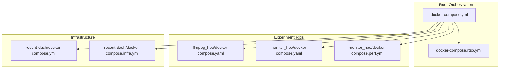
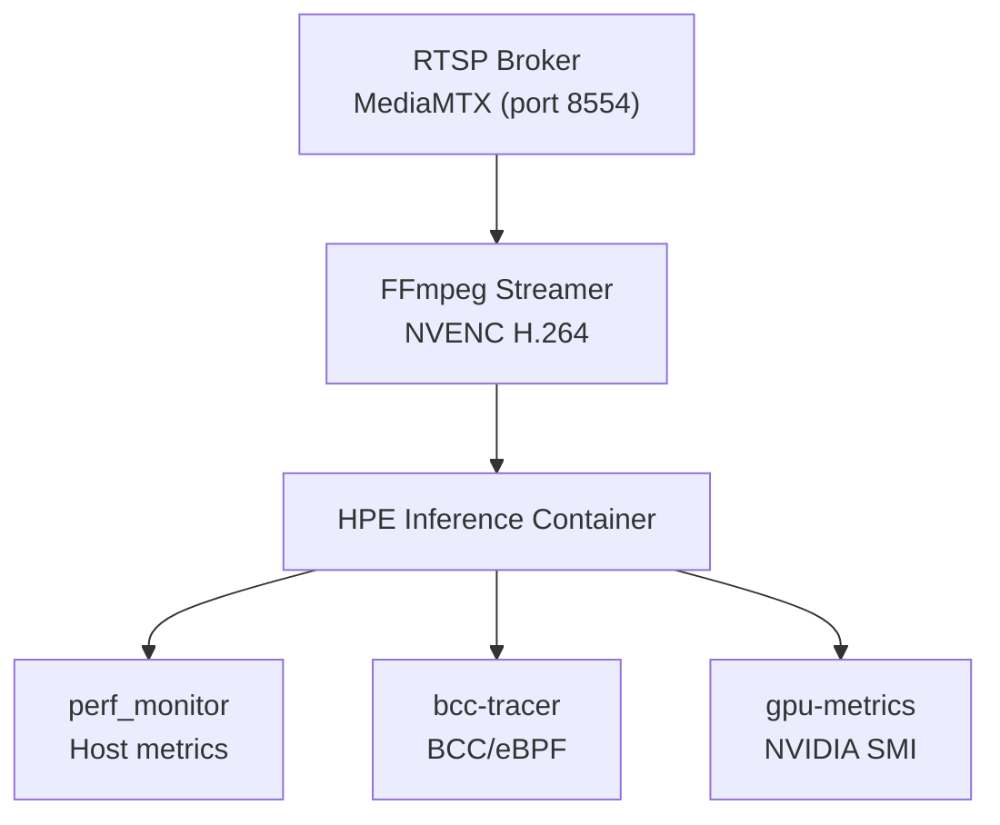
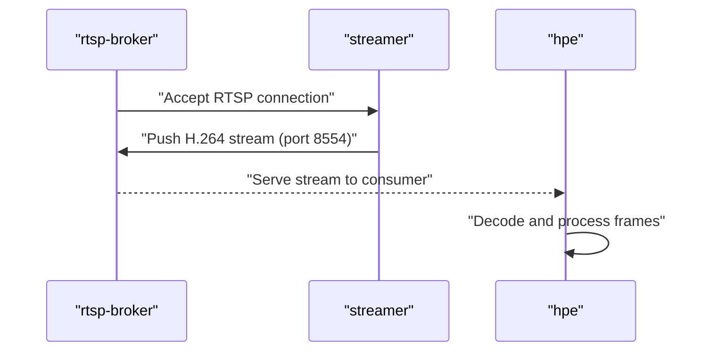
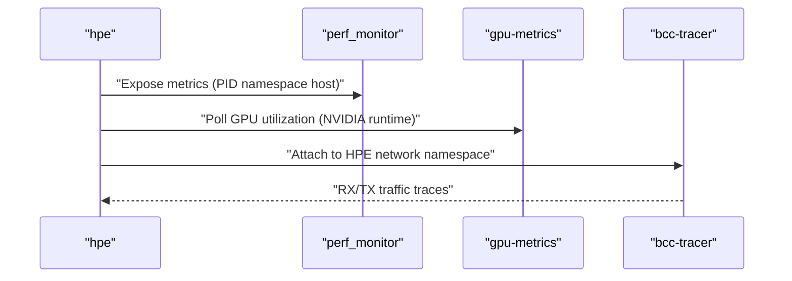
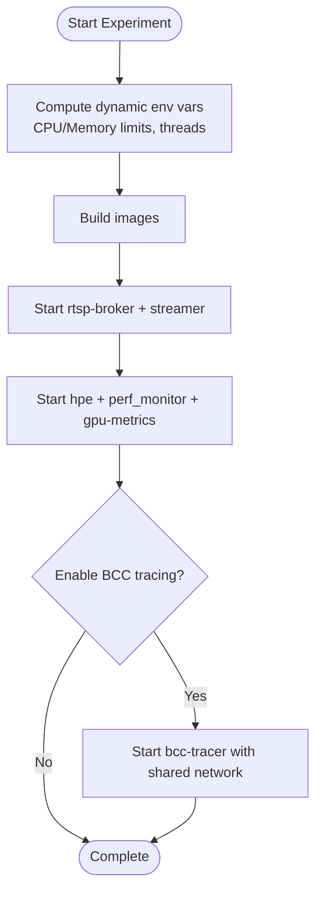
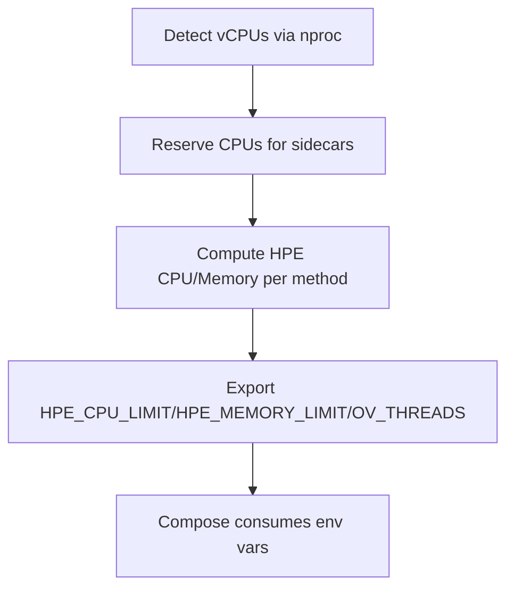
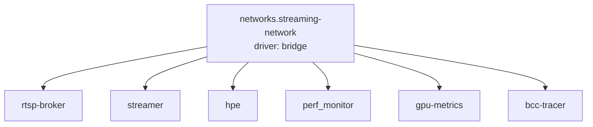
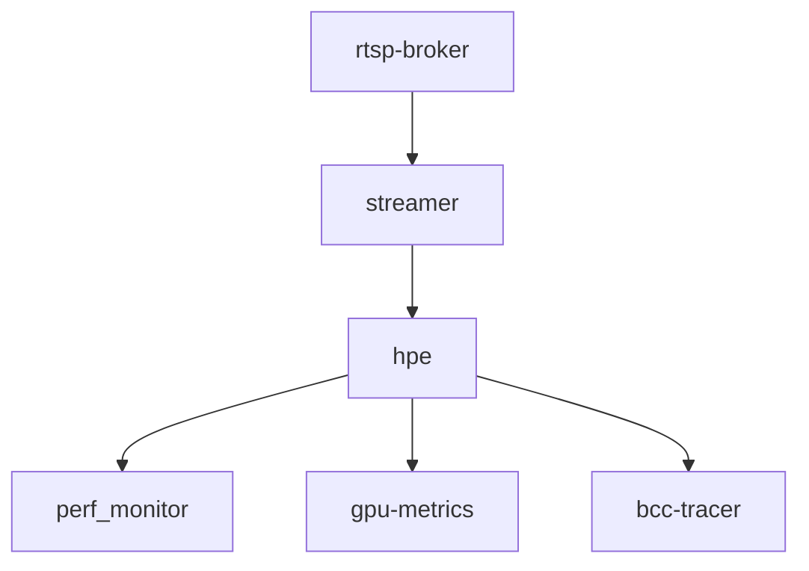

# Docker Compose Orchestration

<cite>
**Referenced Files in This Document**
- [docker-compose.yml](file://docker-compose.yml)
- [docker-compose.rtsp.yml](file://docker-compose.rtsp.yml)
- [docker-compose.yaml](file://ffmpeg_hpe/docker-compose.yaml)
- [docker-compose.yaml](file://monitor_hpe/docker-compose.yaml)
- [docker-compose.perf.yml](file://monitor_hpe/docker-compose.perf.yml)
- [docker-compose.yml](file://recent-dash/docker-compose.yml)
- [docker-compose.infra.yml](file://recent-dash/docker-compose.infra.yml)
- [docker-services.md](file://docs/docker-services.md)
- [DYNAMIC_RESOURCE_ALLOCATION_SUMMARY.md](file://DYNAMIC_RESOURCE_ALLOCATION_SUMMARY.md)
- [ffmpeg_hpe_experiment_rig.md](file://docs/ffmpeg_hpe_experiment_rig.md)
- [COMPLETE_AUDIT_SUMMARY.md](file://COMPLETE_AUDIT_SUMMARY.md)
- [run_experiment.sh](file://ffmpeg_hpe/run_experiment.sh)
- [run_experiment.sh](file://monitor_hpe/run_experiment.sh)
- [run_with_video.sh](file://monitor_hpe/run_with_video.sh)
- [run_experiment.sh](file://recent-dash/run_experiment.sh)
- [HTTP-Server.launch.sh](file://recent-dash/HTTP-Server.launch.sh)
- [prometheus.yml](file://prometheus.yml)
- [prometheus.yml](file://recent-dash/prometheus.yml)
- [entrypoint.sh](file://entrypoint.sh)
- [entrypoint.sh](file://ffmpeg_hpe/entrypoint.sh)
- [entrypoint.sh](file://monitor_hpe/entrypoint.sh)
- [monitor_pid.sh](file://monitor_hpe/monitor_pid.sh)
- [monitor_pid.sh](file://ffmpeg_hpe/monitor_pid.sh)
- [plot_graph.py](file://monitor_hpe/plot_graph.py)
- [plot_graph.py](file://ffmpeg_hpe/plot_graph.py)
- [plot_rx_bytes.py](file://ffmpeg_hpe/plot_rx_bytes.py)
- [plot_smi_output.py](file://ffmpeg_hpe/plot_smi_output.py)
- [plot_perf_metrics.py](file://Measure_plot_cpu_perf/plot_perf_metrics.py)
- [run_perf_plot.sh](file://Measure_plot_cpu_perf/run_perf_plot.sh)
- [run_nvidia_dcgm.sh](file://Measure_gpu_dcgm/run_nvidia_dcgm.sh)
- [requirements.txt](file://ffmpeg_hpe/requirements.txt)
- [requirements.txt](file://Measure_plot_cpu_perf/requirements.txt)
- [requirements.txt](file://Measure_gpu_dcgm/requirements.txt)
- [Dockerfile.hpe](file://Dockerfile.hpe)
- [Dockerfile](file://Measure_plot_cpu_perf/Dockerfile)
- [Dockerfile.gpu_metrics](file://Measure_gpu_dcgm/Dockerfile.gpu_metrics)
- [Dockerfile](file://dev_tools/Dockerfile)
- [Dockerfile](file://recent-dash/bpftrace-tracer/Dockerfile)
- [Dockerfile](file://recent-dash/perf_monitor/Dockerfile)
- [Dockerfile](file://ffmpeg_hpe/bpftrace-tracer/Dockerfile)
- [Dockerfile.gpu_metrics](file://ffmpeg_hpe/Dockerfile.gpu_metrics)
- [Dockerfile](file://monitor_hpe/Dockerfile)
- [Dockerfile.perf](file://monitor_hpe/Dockerfile.perf)
- [Dockerfile_mpv](file://recent-dash/Dockerfile_mpv)
</cite>

## Table of Contents
1. [Introduction](#introduction)
2. [Project Structure](#project-structure)
3. [Core Components](#core-components)
4. [Architecture Overview](#architecture-overview)
5. [Detailed Component Analysis](#detailed-component-analysis)
6. [Dependency Analysis](#dependency-analysis)
7. [Performance Considerations](#performance-considerations)
8. [Troubleshooting Guide](#troubleshooting-guide)
9. [Conclusion](#conclusion)
10. [Appendices](#appendices)

## Introduction
This document explains multi-container orchestration using Docker Compose across the repository’s experiment rigs. It focuses on the main compose configuration, service definitions, inter-service dependencies, RTSP streaming setup, monitoring coordination, and experiment orchestration workflows. It also covers network configuration, volume mounting strategies, service discovery, scaling and resource allocation, health checks, customization for different environments, integrating multiple compose files, troubleshooting, and performance optimization.

## Project Structure
The orchestration spans several compose files and complementary scripts:
- Root compose orchestrates the primary experiment rig and RTSP streaming.
- ffmpeg_hpe compose defines the RTSP pipeline, HPE inference, optional BCC tracing, and monitoring sidecars.
- monitor_hpe compose provides a simplified local monitoring rig with dynamic resource allocation.
- recent-dash compose defines infrastructure services for dashboards and proxies.
- Supporting scripts and Dockerfiles define runtime behavior, entrypoints, and metrics plotting.

**Diagram sources**
- [docker-compose.yml](file://docker-compose.yml)
- [docker-compose.rtsp.yml](file://docker-compose.rtsp.yml)
- [docker-compose.yaml](file://ffmpeg_hpe/docker-compose.yaml)
- [docker-compose.yaml](file://monitor_hpe/docker-compose.yaml)
- [docker-compose.perf.yml](file://monitor_hpe/docker-compose.perf.yml)
- [docker-compose.yml](file://recent-dash/docker-compose.yml)
- [docker-compose.infra.yml](file://recent-dash/docker-compose.infra.yml)

**Section sources**
- [docker-compose.yml](file://docker-compose.yml)
- [docker-compose.rtsp.yml](file://docker-compose.rtsp.yml)
- [docker-compose.yaml](file://ffmpeg_hpe/docker-compose.yaml)
- [docker-compose.yaml](file://monitor_hpe/docker-compose.yaml)
- [docker-compose.perf.yml](file://monitor_hpe/docker-compose.perf.yml)
- [docker-compose.yml](file://recent-dash/docker-compose.yml)
- [docker-compose.infra.yml](file://recent-dash/docker-compose.infra.yml)

## Core Components
This section outlines the principal services and their roles in the orchestration.

- rtsp-broker: MediaMTX RTSP server streaming H.264 video on port 8554.
- streamer: FFmpeg NVENC H.264 encoder feeding the RTSP broker.
- hpe: Human Pose Estimation inference container running the selected method.
- perf_monitor: Host-level performance metrics collector (CPU, memory, I/O) with elevated privileges.
- gpu-metrics: Sidecar collecting GPU metrics (NVIDIA SMI) while sharing the HPE network namespace.
- bcc-tracer: Optional BCC/eBPF network tracer attached to the HPE container’s network namespace for RX/TX traffic capture.
- Prometheus: Metrics aggregation and scraping for observability.

Key orchestration characteristics:
- Services share a dedicated bridge network for service discovery.
- Volumes mount results and tracer outputs for persistent data collection.
- Environment variables drive dynamic configuration and resource allocation.
- Healthchecks and resource limits ensure robust operation.

**Section sources**
- [docker-services.md](file://docs/docker-services.md)
- [docker-compose.yaml](file://ffmpeg_hpe/docker-compose.yaml)
- [docker-compose.yaml](file://monitor_hpe/docker-compose.yaml)
- [docker-compose.perf.yml](file://monitor_hpe/docker-compose.perf.yml)
- [prometheus.yml](file://prometheus.yml)
- [prometheus.yml](file://recent-dash/prometheus.yml)

## Architecture Overview
The RTSP streaming pipeline integrates media ingestion, encoding, inference, and measurement:

**Diagram sources**
- [COMPLETE_AUDIT_SUMMARY.md](file://COMPLETE_AUDIT_SUMMARY.md)
- [docker-compose.yaml](file://ffmpeg_hpe/docker-compose.yaml)

**Section sources**
- [COMPLETE_AUDIT_SUMMARY.md](file://COMPLETE_AUDIT_SUMMARY.md)
- [docker-compose.yaml](file://ffmpeg_hpe/docker-compose.yaml)

## Detailed Component Analysis

### RTSP Streaming Pipeline
The RTSP pipeline streams H.264 video from FFmpeg to the HPE container, enabling real-time pose estimation.

**Diagram sources**
- [docker-compose.yaml](file://ffmpeg_hpe/docker-compose.yaml)

**Section sources**
- [docker-compose.yaml](file://ffmpeg_hpe/docker-compose.yaml)

### Monitoring and Measurement Sidecars
Sidecar containers collect performance and network metrics during experiments.

**Diagram sources**
- [docker-compose.yaml](file://ffmpeg_hpe/docker-compose.yaml)
- [docker-compose.yaml](file://monitor_hpe/docker-compose.yaml)

**Section sources**
- [docker-compose.yaml](file://ffmpeg_hpe/docker-compose.yaml)
- [docker-compose.yaml](file://monitor_hpe/docker-compose.yaml)

### Experiment Orchestration Workflows
Experiments are orchestrated via scripts that compute dynamic resource allocations and launch services in the correct order.

**Diagram sources**
- [run_experiment.sh](file://ffmpeg_hpe/run_experiment.sh)
- [run_experiment.sh](file://monitor_hpe/run_experiment.sh)
- [docker-compose.yaml](file://ffmpeg_hpe/docker-compose.yaml)

**Section sources**
- [run_experiment.sh](file://ffmpeg_hpe/run_experiment.sh)
- [run_experiment.sh](file://monitor_hpe/run_experiment.sh)
- [docker-compose.yaml](file://ffmpeg_hpe/docker-compose.yaml)
- [DYNAMIC_RESOURCE_ALLOCATION_SUMMARY.md](file://DYNAMIC_RESOURCE_ALLOCATION_SUMMARY.md)

### Scaling Configuration and Resource Allocation
Auto-scaling computes CPU and memory limits per method and hardware capacity, exporting environment variables consumed by compose.

**Diagram sources**
- [DYNAMIC_RESOURCE_ALLOCATION_SUMMARY.md](file://DYNAMIC_RESOURCE_ALLOCATION_SUMMARY.md)
- [run_experiment.sh](file://ffmpeg_hpe/run_experiment.sh)
- [run_experiment.sh](file://monitor_hpe/run_experiment.sh)

**Section sources**
- [DYNAMIC_RESOURCE_ALLOCATION_SUMMARY.md](file://DYNAMIC_RESOURCE_ALLOCATION_SUMMARY.md)
- [run_experiment.sh](file://ffmpeg_hpe/run_experiment.sh)
- [run_experiment.sh](file://monitor_hpe/run_experiment.sh)

### Network Configuration and Service Discovery
All services attach to a shared bridge network, enabling service-to-service communication by service name.

**Diagram sources**
- [docker-compose.yaml](file://ffmpeg_hpe/docker-compose.yaml)
- [docker-compose.yaml](file://monitor_hpe/docker-compose.yaml)

**Section sources**
- [docker-compose.yaml](file://ffmpeg_hpe/docker-compose.yaml)
- [docker-compose.yaml](file://monitor_hpe/docker-compose.yaml)

### Volume Mounting Strategies
Persistent and ephemeral volumes support results collection, PID tracking, and tracer outputs.

- Results: Mounted read-write to a host directory for artifacts.
- PID tracking: Mounted read-only for process inspection.
- Tracer outputs: Mounted read-write for captured traces.
- Kernel modules and debugfs: Mounted read-only or read-write for BCC/eBPF.

**Section sources**
- [docker-compose.yaml](file://ffmpeg_hpe/docker-compose.yaml)
- [docker-compose.yaml](file://monitor_hpe/docker-compose.yaml)

### Health Checks and Stability
Services define healthchecks to ensure liveness and readiness:
- HPE: Validates the main process is running.
- GPU metrics: Validates the NVIDIA SMI poller is active.
- perf_monitor: Validates host-level metrics collection.

**Section sources**
- [docker-services.md](file://docs/docker-services.md)
- [docker-compose.yaml](file://ffmpeg_hpe/docker-compose.yaml)
- [docker-compose.yaml](file://monitor_hpe/docker-compose.yaml)

### Integration Between Compose Files
Multiple compose files coordinate distinct use cases:
- Root compose orchestrates the primary experiment rig and RTSP streaming.
- ffmpeg_hpe compose defines the RTSP pipeline and measurement sidecars.
- monitor_hpe compose provides a lightweight alternative with dynamic scaling.
- recent-dash compose defines infrastructure services for dashboards and proxies.

Integration points:
- Shared environment variables computed by scripts.
- Optional inclusion of perf compose for additional metrics.
- Separate infra compose for proxy and HTTP services.

**Section sources**
- [docker-compose.yml](file://docker-compose.yml)
- [docker-compose.rtsp.yml](file://docker-compose.rtsp.yml)
- [docker-compose.yaml](file://ffmpeg_hpe/docker-compose.yaml)
- [docker-compose.yaml](file://monitor_hpe/docker-compose.yaml)
- [docker-compose.perf.yml](file://monitor_hpe/docker-compose.perf.yml)
- [docker-compose.yml](file://recent-dash/docker-compose.yml)
- [docker-compose.infra.yml](file://recent-dash/docker-compose.infra.yml)

### Customization for Different Environments
Customization leverages environment variables and compose overrides:
- Method selection and device targeting via environment variables.
- Resource limits and thread counts computed dynamically based on hardware.
- Optional BCC tracing toggled by scripts and compose profiles.

Practical steps:
- Copy and edit .env files to set baseline variables.
- Override variables via shell exports or script logic before compose up.
- Use compose profiles to enable/disable optional services.

**Section sources**
- [ffmpeg_hpe_experiment_rig.md](file://docs/ffmpeg_hpe_experiment_rig.md)
- [docker-services.md](file://docs/docker-services.md)
- [run_experiment.sh](file://ffmpeg_hpe/run_experiment.sh)
- [run_experiment.sh](file://monitor_hpe/run_experiment.sh)

### Adding New Services and Managing Dependencies
To add a new service:
- Define the service in the appropriate compose file.
- Declare dependencies using depends_on to ensure proper startup order.
- Configure volumes, environment variables, and resource limits.
- Integrate healthchecks and optional profiling/tracing as needed.

Best practices:
- Keep service-specific compose files modular.
- Share networks and volumes thoughtfully.
- Use environment variables for configuration portability.

**Section sources**
- [docker-compose.yaml](file://ffmpeg_hpe/docker-compose.yaml)
- [docker-compose.yaml](file://monitor_hpe/docker-compose.yaml)

## Dependency Analysis
Inter-service dependencies ensure correct startup sequencing and data flow.

**Diagram sources**
- [docker-compose.yaml](file://ffmpeg_hpe/docker-compose.yaml)
- [docker-compose.yaml](file://monitor_hpe/docker-compose.yaml)

**Section sources**
- [docker-compose.yaml](file://ffmpeg_hpe/docker-compose.yaml)
- [docker-compose.yaml](file://monitor_hpe/docker-compose.yaml)

## Performance Considerations
- Auto-scaling computes CPU and memory allocations per method and hardware capacity, minimizing manual tuning.
- Resource limits prevent contention and stabilize measurements.
- Elevated privileges for perf_monitor and BCC tracer enable accurate host-level metrics and kernel-space tracing.
- GPU metrics collection runs alongside inference to avoid overhead spikes.

Recommendations:
- Validate resource limits on target hardware before production runs.
- Prefer dynamic allocation scripts to ensure compatibility across VM sizes.
- Use compose profiles to selectively enable heavy-sidecars in constrained environments.

**Section sources**
- [DYNAMIC_RESOURCE_ALLOCATION_SUMMARY.md](file://DYNAMIC_RESOURCE_ALLOCATION_SUMMARY.md)
- [docker-services.md](file://docs/docker-services.md)
- [docker-compose.yaml](file://ffmpeg_hpe/docker-compose.yaml)
- [docker-compose.yaml](file://monitor_hpe/docker-compose.yaml)

## Troubleshooting Guide
Common issues and resolutions:
- Services fail to start due to missing environment variables:
  - Ensure dynamic variables are exported by the experiment script before compose up.
- GPU metrics not collected:
  - Verify NVIDIA runtime and visible devices configuration.
- BCC tracing fails:
  - Confirm kernel module mounts and debugfs availability; ensure seccomp and capabilities are set.
- perf_monitor not capturing metrics:
  - Validate host PID namespace and required capabilities.
- RTSP stream not received:
  - Check port exposure and firewall rules; confirm streamer is pushing to the broker.

Operational commands:
- Inspect service configuration and environment variables.
- Review healthcheck status and logs.
- Validate volume mounts and permissions.

**Section sources**
- [docker-services.md](file://docs/docker-services.md)
- [docker-compose.yaml](file://ffmpeg_hpe/docker-compose.yaml)
- [docker-compose.yaml](file://monitor_hpe/docker-compose.yaml)
- [run_experiment.sh](file://ffmpeg_hpe/run_experiment.sh)
- [run_experiment.sh](file://monitor_hpe/run_experiment.sh)

## Conclusion
The orchestration combines modular compose files, dynamic resource allocation, and robust sidecars to deliver reproducible, scalable experiments. By leveraging environment-driven configuration, shared networks, and healthchecks, the system supports diverse environments and use cases while maintaining reliability and performance.

## Appendices

### Appendix A: Orchestration Command Sequences
Typical experiment sequences:
- Build images, start streaming services, then inference and monitoring.
- Enable BCC tracing via the dedicated script to attach the tracer to the HPE container’s network namespace.

**Section sources**
- [docker-services.md](file://docs/docker-services.md)
- [run_experiment.sh](file://ffmpeg_hpe/run_experiment.sh)
- [run_experiment.sh](file://monitor_hpe/run_experiment.sh)

### Appendix B: Prometheus Integration
Prometheus configuration aggregates metrics from sidecars and services for dashboarding and alerting.

**Section sources**
- [prometheus.yml](file://prometheus.yml)
- [prometheus.yml](file://recent-dash/prometheus.yml)

### Appendix C: Entry Points and Scripts
Entry points and launch scripts initialize services and prepare runtime environments.

**Section sources**
- [entrypoint.sh](file://entrypoint.sh)
- [entrypoint.sh](file://ffmpeg_hpe/entrypoint.sh)
- [entrypoint.sh](file://monitor_hpe/entrypoint.sh)
- [HTTP-Server.launch.sh](file://recent-dash/HTTP-Server.launch.sh)

### Appendix D: Plotting and Post-Processing
Post-processing utilities generate plots for performance and GPU metrics.

**Section sources**
- [plot_graph.py](file://monitor_hpe/plot_graph.py)
- [plot_graph.py](file://ffmpeg_hpe/plot_graph.py)
- [plot_rx_bytes.py](file://ffmpeg_hpe/plot_rx_bytes.py)
- [plot_smi_output.py](file://ffmpeg_hpe/plot_smi_output.py)
- [plot_perf_metrics.py](file://Measure_plot_cpu_perf/plot_perf_metrics.py)
- [run_perf_plot.sh](file://Measure_plot_cpu_perf/run_perf_plot.sh)
- [run_nvidia_dcgm.sh](file://Measure_gpu_dcgm/run_nvidia_dcgm.sh)