# Docker Configuration

<cite>
**Referenced Files in This Document**
- [Dockerfile.hpe](file://Dockerfile.hpe)
- [Dockerfile_base](file://Dockerfile_base)
- [Dockerfile_combined_multistage_app](file://Dockerfile_combined_multistage_app)
- [Dockerfile_cuda_ffmpeg_hpe](file://Dockerfile_cuda_ffmpeg_hpe)
- [Dockerfile_optimized_multistage_v4](file://Dockerfile_optimized_multistage_v4)
- [Dockerfile.gpu_metrics](file://Measure_gpu_dcgm/Dockerfile.gpu_metrics)
- [Dockerfile.gpu_metrics (ffmpeg_hpe)](file://ffmpeg_hpe/Dockerfile.gpu_metrics)
- [Dockerfile](file://Measure_plot_cpu_perf/Dockerfile)
- [Dockerfile](file://dev_tools/Dockerfile)
- [Dockerfile](file://monitor_hpe/Dockerfile)
- [.dockerignore](file://.dockerignore)
- [ffmpeg_hpe/.dockerignore](file://ffmpeg_hpe/.dockerignore)
- [docker-compose.yml](file://docker-compose.yml)
- [docker-compose.rtsp.yml](file://docker-compose.rtsp.yml)
- [docker-compose.perf.yml](file://monitor_hpe/docker-compose.perf.yml)
- [docker-compose.yml (recent-dash)](file://recent-dash/docker-compose.yml)
- [docker-compose.infra.yml (recent-dash)](file://recent-dash/docker-compose.infra.yml)
- [entrypoint.sh](file://entrypoint.sh)
- [entrypoint.sh (ffmpeg_hpe)](file://ffmpeg_hpe/entrypoint.sh)
- [run_nvidia_dcgm.sh](file://Measure_gpu_dcgm/run_nvidia_dcgm.sh)
- [run_nvidia_dcgm.sh (ffmpeg_hpe)](file://ffmpeg_hpe/run_nvidia_dcgm.sh)
- [run_perf_plot.sh](file://Measure_plot_cpu_perf/run_perf_plot.sh)
- [plot_perf_metrics.py](file://Measure_plot_cpu_perf/plot_perf_metrics.py)
- [requirements.txt](file://requirements.txt)
- [requirements_dev.txt](file://requirements_dev.txt)
- [requirements_torch_cpu.txt](file://requirements_torch_cpu.txt)
- [packages.txt](file://packages.txt)
- [Makefile](file://Makefile)
- [build_ffmpeg_cuda.sh](file://build_ffmpeg_cuda.sh)
- [upgrade_cuda.sh](file://upgrade_cuda.sh)
</cite>

## Table of Contents
1. [Introduction](#introduction)
2. [Project Structure](#project-structure)
3. [Core Components](#core-components)
4. [Architecture Overview](#architecture-overview)
5. [Detailed Component Analysis](#detailed-component-analysis)
6. [Dependency Analysis](#dependency-analysis)
7. [Performance Considerations](#performance-considerations)
8. [Troubleshooting Guide](#troubleshooting-guide)
9. [Conclusion](#conclusion)
10. [Appendices](#appendices)

## Introduction
This document provides comprehensive Docker configuration guidance for all project components. It covers the main HPE Dockerfile configurations, base image setup, and GPU-optimized builds. It explains multi-stage build processes, dependency management, environment variable configuration, Dockerfile best practices, layer optimization, and security considerations. Differences between CPU and GPU container configurations are detailed, including CUDA runtime dependencies and driver requirements. Guidance is included for customizing Dockerfiles for different deployment scenarios, adding new dependencies, and optimizing container size. The document also documents the .dockerignore configuration and build context management.

## Project Structure
The repository contains multiple Docker configurations across several components:
- HPE application Dockerfiles: optimized multi-stage builds, combined app builder, CUDA-focused builds, and a base image variant.
- Specialized tooling containers: GPU metrics collection, CPU performance plotting, development tools, and monitoring utilities.
- Compose files orchestrating multi-container deployments.
- Supporting scripts and requirements files that influence containerization decisions.

```mermaid
graph TB
subgraph "HPE Application Images"
HPE["Dockerfile.hpe"]
BASE["Dockerfile_base"]
COMB["Dockerfile_combined_multistage_app"]
CUDA["Dockerfile_cuda_ffmpeg_hpe"]
OPT["Dockerfile_optimized_multistage_v4"]
end
subgraph "Specialized Tools"
METRICS["Measure_gpu_dcgm/Dockerfile.gpu_metrics"]
CPU_PERF["Measure_plot_cpu_perf/Dockerfile"]
DEVTOOLS["dev_tools/Dockerfile"]
MONITOR["monitor_hpe/Dockerfile"]
FFMPEG_METRICS["ffmpeg_hpe/Dockerfile.gpu_metrics"]
end
subgraph "Compose Orchestration"
DC["docker-compose.yml"]
DC_RTSP["docker-compose.rtsp.yml"]
DC_PERF["monitor_hpe/docker-compose.perf.yml"]
DC_RD_INFRA["recent-dash/docker-compose.infra.yml"]
DC_RD["recent-dash/docker-compose.yml"]
end
HPE --> DC
BASE --> DC
COMB --> DC
CUDA --> DC
OPT --> DC_RTSP
METRICS --> DC
CPU_PERF --> DC
DEVTOOLS --> DC
MONITOR --> DC_PERF
FFMPEG_METRICS --> DC
DC_RD_INFRA --> DC_RD
```

**Diagram sources**
- [Dockerfile.hpe:1-122](file://Dockerfile.hpe#L1-L122)
- [Dockerfile_base:1-93](file://Dockerfile_base#L1-L93)
- [Dockerfile_combined_multistage_app:1-221](file://Dockerfile_combined_multistage_app#L1-L221)
- [Dockerfile_cuda_ffmpeg_hpe:1-109](file://Dockerfile_cuda_ffmpeg_hpe#L1-L109)
- [Dockerfile_optimized_multistage_v4:1-130](file://Dockerfile_optimized_multistage_v4#L1-L130)
- [Dockerfile.gpu_metrics:1-12](file://Measure_gpu_dcgm/Dockerfile.gpu_metrics#L1-L12)
- [Dockerfile:1-18](file://Measure_plot_cpu_perf/Dockerfile#L1-L18)
- [Dockerfile:1-28](file://dev_tools/Dockerfile#L1-L28)
- [Dockerfile:1-8](file://monitor_hpe/Dockerfile#L1-L8)
- [Dockerfile.gpu_metrics (ffmpeg_hpe):1-20](file://ffmpeg_hpe/Dockerfile.gpu_metrics#L1-L20)
- [docker-compose.yml](file://docker-compose.yml)
- [docker-compose.rtsp.yml](file://docker-compose.rtsp.yml)
- [docker-compose.perf.yml](file://monitor_hpe/docker-compose.perf.yml)
- [docker-compose.yml (recent-dash)](file://recent-dash/docker-compose.yml)
- [docker-compose.infra.yml (recent-dash)](file://recent-dash/docker-compose.infra.yml)

**Section sources**
- [Dockerfile.hpe:1-122](file://Dockerfile.hpe#L1-L122)
- [Dockerfile_base:1-93](file://Dockerfile_base#L1-L93)
- [Dockerfile_combined_multistage_app:1-221](file://Dockerfile_combined_multistage_app#L1-L221)
- [Dockerfile_cuda_ffmpeg_hpe:1-109](file://Dockerfile_cuda_ffmpeg_hpe#L1-L109)
- [Dockerfile_optimized_multistage_v4:1-130](file://Dockerfile_optimized_multistage_v4#L1-L130)
- [Dockerfile.gpu_metrics:1-12](file://Measure_gpu_dcgm/Dockerfile.gpu_metrics#L1-L12)
- [Dockerfile.gpu_metrics (ffmpeg_hpe):1-20](file://ffmpeg_hpe/Dockerfile.gpu_metrics#L1-L20)
- [Dockerfile:1-18](file://Measure_plot_cpu_perf/Dockerfile#L1-L18)
- [Dockerfile:1-28](file://dev_tools/Dockerfile#L1-L28)
- [Dockerfile:1-8](file://monitor_hpe/Dockerfile#L1-L8)
- [docker-compose.yml](file://docker-compose.yml)
- [docker-compose.rtsp.yml](file://docker-compose.rtsp.yml)
- [docker-compose.perf.yml](file://monitor_hpe/docker-compose.perf.yml)
- [docker-compose.yml (recent-dash)](file://recent-dash/docker-compose.yml)
- [docker-compose.infra.yml (recent-dash)](file://recent-dash/docker-compose.infra.yml)

## Core Components
This section outlines the primary Docker configurations and their roles:
- HPE multi-stage app builder: builds FFmpeg with CUDA, compiles PyAV and VPF, installs OpenVINO, downloads models, and prepares a runtime image.
- CUDA-focused HPE builder: pulls prebuilt FFmpeg image, installs PyAV/VPF wheels, and builds optional extensions.
- Optimized multi-stage FFmpeg runtime: minimal runtime image containing FFmpeg built with CUDA/NPP/NVENC.
- Base HPE image: installs system dependencies, PyTorch-based toolchain, PyNvCodec, OpenVINO, and models.
- GPU metrics collector: runs NVIDIA DCGM collection scripts inside a CUDA base image.
- CPU performance plotting: Ubuntu-based image with perf tools and plotting utilities.
- Dev tools: lightweight Python image for local development and service hosting.
- Monitoring utilities: installs BPF tools and monitoring scripts.

Key environment variables and runtime configuration:
- CUDA and library paths are configured consistently across stages.
- Torch CUDA architecture list is set for optimal GPU kernels.
- Entrypoints are customized to run application scripts rather than NVIDIA defaults.

**Section sources**
- [Dockerfile_combined_multistage_app:1-221](file://Dockerfile_combined_multistage_app#L1-L221)
- [Dockerfile_cuda_ffmpeg_hpe:1-109](file://Dockerfile_cuda_ffmpeg_hpe#L1-L109)
- [Dockerfile_optimized_multistage_v4:1-130](file://Dockerfile_optimized_multistage_v4#L1-L130)
- [Dockerfile_base:1-93](file://Dockerfile_base#L1-L93)
- [Dockerfile.hpe:1-122](file://Dockerfile.hpe#L1-L122)
- [Dockerfile.gpu_metrics:1-12](file://Measure_gpu_dcgm/Dockerfile.gpu_metrics#L1-L12)
- [Dockerfile.gpu_metrics (ffmpeg_hpe):1-20](file://ffmpeg_hpe/Dockerfile.gpu_metrics#L1-L20)
- [Dockerfile:1-18](file://Measure_plot_cpu_perf/Dockerfile#L1-L18)
- [Dockerfile:1-28](file://dev_tools/Dockerfile#L1-L28)
- [Dockerfile:1-8](file://monitor_hpe/Dockerfile#L1-L8)

## Architecture Overview
The HPE application leverages multi-stage builds to separate build-time dependencies from runtime images, minimizing final image size and attack surface. The typical flow:
- Stage 1 (Builder): Installs build tools, compiles FFmpeg with CUDA/NPP/NVENC, builds PyAV/VPF wheels, and prepares models.
- Stage 2 (Runtime): Copies built artifacts and minimal runtime libraries, sets environment variables, and runs the application via a custom entrypoint.

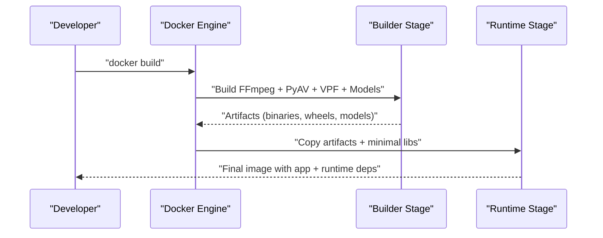

**Diagram sources**
- [Dockerfile_combined_multistage_app:1-221](file://Dockerfile_combined_multistage_app#L1-L221)
- [Dockerfile_cuda_ffmpeg_hpe:1-109](file://Dockerfile_cuda_ffmpeg_hpe#L1-L109)

## Detailed Component Analysis

### HPE Multi-Stage App Builder
This configuration demonstrates a robust multi-stage build:
- Uses a CUDA 12.2 base for building FFmpeg with NVENC/NVDEC/NPP.
- Replaces the base CUDA toolkit with the matching version to align with FFmpeg’s expectations.
- Builds PyAV against the locally installed FFmpeg and installs VPF with Python bindings.
- Downloads and organizes model assets for AlphaPose, MoveNet, and OpenVINO.
- Produces a runtime image with minimal system dependencies and the compiled artifacts.

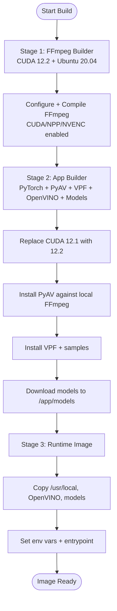

**Diagram sources**
- [Dockerfile_combined_multistage_app:1-221](file://Dockerfile_combined_multistage_app#L1-L221)

**Section sources**
- [Dockerfile_combined_multistage_app:1-221](file://Dockerfile_combined_multistage_app#L1-L221)

### CUDA-Focused HPE Builder
This configuration emphasizes leveraging prebuilt FFmpeg artifacts:
- Pulls a prebuilt FFmpeg image and copies binaries and CUDA libraries into the builder.
- Builds PyAV and VPF wheels locally and installs them.
- Builds optional AlphaPose extensions.
- Produces a runtime image using the PyTorch runtime base with minimal system dependencies.

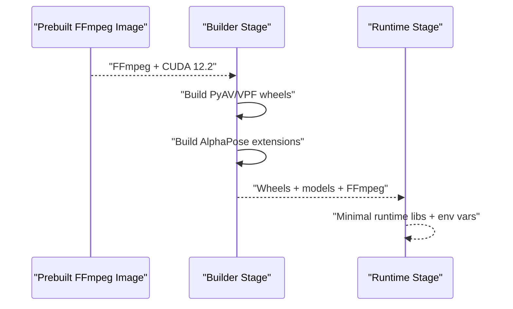

**Diagram sources**
- [Dockerfile_cuda_ffmpeg_hpe:1-109](file://Dockerfile_cuda_ffmpeg_hpe#L1-L109)

**Section sources**
- [Dockerfile_cuda_ffmpeg_hpe:1-109](file://Dockerfile_cuda_ffmpeg_hpe#L1-L109)

### Optimized Multi-Stage FFmpeg Runtime
This configuration focuses on producing a minimal runtime image containing FFmpeg built with CUDA:
- Builder stage compiles FFmpeg with NVENC/NVDEC/NPP and installs dependencies.
- Runtime stage installs only the minimal system libraries required to run FFmpeg.

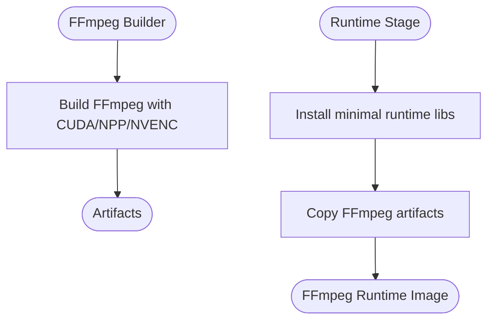

**Diagram sources**
- [Dockerfile_optimized_multistage_v4:1-130](file://Dockerfile_optimized_multistage_v4#L1-L130)

**Section sources**
- [Dockerfile_optimized_multistage_v4:1-130](file://Dockerfile_optimized_multistage_v4#L1-L130)

### Base HPE Image
This configuration installs system dependencies and Python packages directly into a PyTorch base image:
- Installs build tools and system libraries.
- Installs PyNvCodec and OpenVINO with GPU support.
- Downloads model assets and builds AlphaPose extensions.
- Sets environment variables and entrypoint.

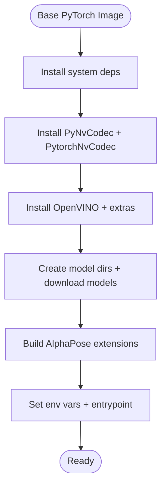

**Diagram sources**
- [Dockerfile_base:1-93](file://Dockerfile_base#L1-L93)

**Section sources**
- [Dockerfile_base:1-93](file://Dockerfile_base#L1-L93)

### GPU Metrics Container
Two variants collect GPU metrics:
- A minimal CUDA base image that runs a DCGM collection script.
- Another variant pinned to CUDA 11.8 with NVIDIA utilities.

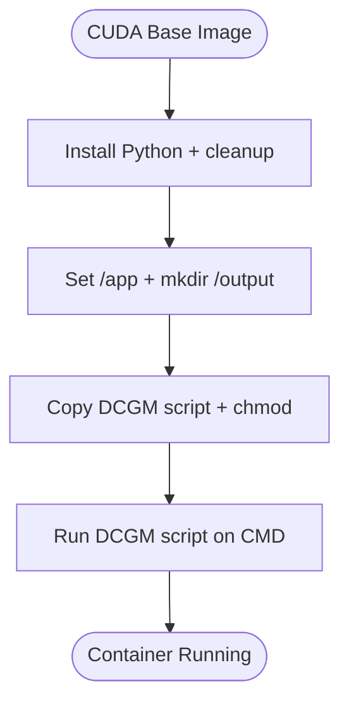

**Diagram sources**
- [Dockerfile.gpu_metrics:1-12](file://Measure_gpu_dcgm/Dockerfile.gpu_metrics#L1-L12)
- [Dockerfile.gpu_metrics (ffmpeg_hpe):1-20](file://ffmpeg_hpe/Dockerfile.gpu_metrics#L1-L20)

**Section sources**
- [Dockerfile.gpu_metrics:1-12](file://Measure_gpu_dcgm/Dockerfile.gpu_metrics#L1-L12)
- [Dockerfile.gpu_metrics (ffmpeg_hpe):1-20](file://ffmpeg_hpe/Dockerfile.gpu_metrics#L1-L20)
- [run_nvidia_dcgm.sh](file://Measure_gpu_dcgm/run_nvidia_dcgm.sh)
- [run_nvidia_dcgm.sh (ffmpeg_hpe)](file://ffmpeg_hpe/run_nvidia_dcgm.sh)

### CPU Performance Plotting Container
A CPU-centric image with perf tools and plotting utilities:
- Installs Linux perf tools and Python plotting libraries.
- Adds a non-root user with sudo privileges for perf operations.
- Runs a shell script that executes plotting routines.

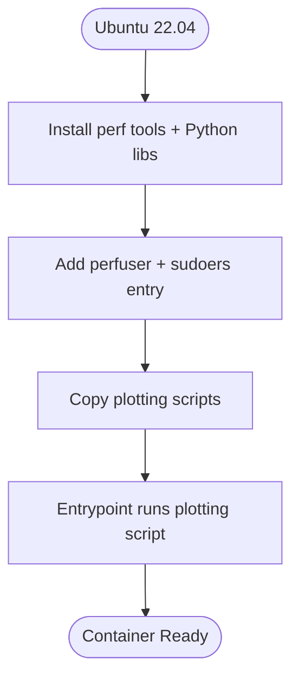

**Diagram sources**
- [Dockerfile:1-18](file://Measure_plot_cpu_perf/Dockerfile#L1-L18)
- [run_perf_plot.sh](file://Measure_plot_cpu_perf/run_perf_plot.sh)
- [plot_perf_metrics.py](file://Measure_plot_cpu_perf/plot_perf_metrics.py)

**Section sources**
- [Dockerfile:1-18](file://Measure_plot_cpu_perf/Dockerfile#L1-L18)
- [run_perf_plot.sh](file://Measure_plot_cpu_perf/run_perf_plot.sh)
- [plot_perf_metrics.py](file://Measure_plot_cpu_perf/plot_perf_metrics.py)

### Dev Tools Container
A lightweight Python image for development and service hosting:
- Uses a slim Python base.
- Installs Flask, OpenCV headless, and Gunicorn.
- Configures healthchecks and environment variables.
- Exposes a configurable port and runs the app with Gunicorn.

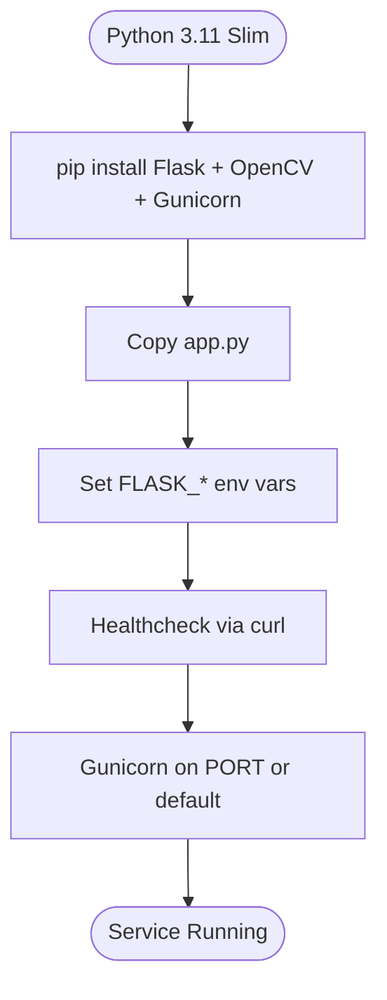

**Diagram sources**
- [Dockerfile:1-28](file://dev_tools/Dockerfile#L1-L28)

**Section sources**
- [Dockerfile:1-28](file://dev_tools/Dockerfile#L1-L28)

### Monitoring Utilities Container
Installs BPF tracing tools and monitoring scripts:
- Installs perf tools and bpftrace.
- Copies a monitoring script and makes it executable.
- Runs a shell by default.

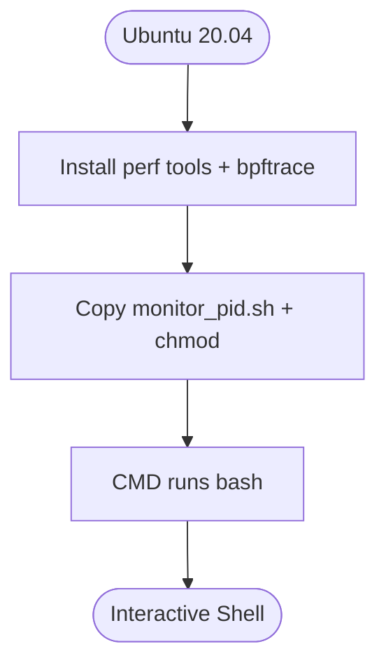

**Diagram sources**
- [Dockerfile:1-8](file://monitor_hpe/Dockerfile#L1-L8)

**Section sources**
- [Dockerfile:1-8](file://monitor_hpe/Dockerfile#L1-L8)

## Dependency Analysis
This section analyzes dependencies across Docker configurations and their impact on build and runtime behavior.

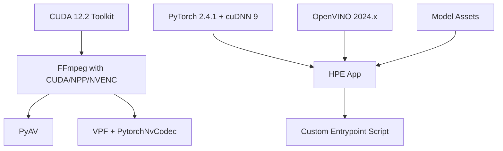

**Diagram sources**
- [Dockerfile_combined_multistage_app:1-221](file://Dockerfile_combined_multistage_app#L1-L221)
- [Dockerfile_cuda_ffmpeg_hpe:1-109](file://Dockerfile_cuda_ffmpeg_hpe#L1-L109)
- [Dockerfile_base:1-93](file://Dockerfile_base#L1-L93)
- [Dockerfile.hpe:1-122](file://Dockerfile.hpe#L1-L122)

**Section sources**
- [Dockerfile_combined_multistage_app:1-221](file://Dockerfile_combined_multistage_app#L1-L221)
- [Dockerfile_cuda_ffmpeg_hpe:1-109](file://Dockerfile_cuda_ffmpeg_hpe#L1-L109)
- [Dockerfile_base:1-93](file://Dockerfile_base#L1-L93)
- [Dockerfile.hpe:1-122](file://Dockerfile.hpe#L1-L122)

## Performance Considerations
- Multi-stage builds reduce final image size and attack surface by separating build-time dependencies from runtime images.
- Aligning CUDA toolkit versions across build and runtime stages prevents ABI mismatches and ensures optimal performance.
- Using ccache for compilers and NVCC host compiler improves incremental build performance during development.
- Installing only necessary system libraries in the runtime stage reduces image size and startup time.
- Setting TORCH_CUDA_ARCH_LIST optimizes PyTorch kernel selection for target GPUs.
- Minimizing apt cache and cleaning package lists reduces filesystem footprint.

[No sources needed since this section provides general guidance]

## Troubleshooting Guide
Common issues and resolutions:
- CUDA version mismatch: Ensure the CUDA toolkit version used for building FFmpeg matches the runtime CUDA toolkit. The combined app builder replaces the base CUDA toolkit to align versions.
- Missing NVIDIA runtime libraries: Verify that libnpp and CUDA runtime libraries are present in the runtime stage.
- Entrypoint conflicts: Custom entrypoints override NVIDIA-provided ones to run application scripts instead of default containers.
- Model download failures: Network timeouts or missing credentials can cause model downloads to fail; ensure network connectivity and correct gdown IDs.
- Build isolation issues: Some legacy packages require specific setuptools versions; the base image handles this by pinning setuptools and disabling build isolation.

**Section sources**
- [Dockerfile_combined_multistage_app:115-131](file://Dockerfile_combined_multistage_app#L115-L131)
- [Dockerfile_base:50-55](file://Dockerfile_base#L50-L55)
- [Dockerfile.hpe:120-121](file://Dockerfile.hpe#L120-L121)

## Conclusion
The project employs robust multi-stage Docker configurations tailored for GPU-accelerated HPE applications. By aligning CUDA versions, building FFmpeg with CUDA/NPP/NVENC, and installing PyAV/VPF/OpenVINO with model assets, the images deliver optimized performance and minimal runtime footprints. Specialized containers address GPU metrics collection, CPU performance plotting, development, and monitoring. Adhering to best practices around layering, environment variables, and build context management ensures maintainable and secure deployments.

[No sources needed since this section summarizes without analyzing specific files]

## Appendices

### A. Differences Between CPU and GPU Container Configurations
- GPU images use CUDA-enabled bases and compile/install CUDA-dependent components (FFmpeg, PyAV, VPF, OpenVINO).
- CPU images rely on CPU-only builds and avoid CUDA toolchains; they typically use CPU-focused OpenVINO builds and CPU-compatible dependencies.

**Section sources**
- [Dockerfile.hpe:1-122](file://Dockerfile.hpe#L1-L122)
- [Dockerfile_base:1-93](file://Dockerfile_base#L1-L93)
- [Dockerfile_optimized_multistage_v4:1-130](file://Dockerfile_optimized_multistage_v4#L1-L130)
- [Dockerfile:1-18](file://Measure_plot_cpu_perf/Dockerfile#L1-L18)

### B. Environment Variables and Entrypoints
- CUDA_HOME, PATH, LD_LIBRARY_PATH, PKG_CONFIG_PATH are set to ensure FFmpeg and CUDA libraries are discoverable.
- TORCH_CUDA_ARCH_LIST is configured for optimal PyTorch kernels.
- Entrypoints are customized to run application scripts rather than default container entrypoints.

**Section sources**
- [Dockerfile_combined_multistage_app:92-100](file://Dockerfile_combined_multistage_app#L92-L100)
- [Dockerfile_cuda_ffmpeg_hpe:13-16](file://Dockerfile_cuda_ffmpeg_hpe#L13-L16)
- [Dockerfile_base:60-62](file://Dockerfile_base#L60-L62)
- [Dockerfile.hpe:101-101](file://Dockerfile.hpe#L101-L101)
- [entrypoint.sh](file://entrypoint.sh)
- [entrypoint.sh (ffmpeg_hpe)](file://ffmpeg_hpe/entrypoint.sh)

### C. .dockerignore and Build Context Management
- Root-level .dockerignore excludes unnecessary files and directories from the build context to speed up builds and reduce image size.
- ffmpeg_hpe/.dockerignore further restricts build context for that module.

**Section sources**
- [.dockerignore](file://.dockerignore)
- [ffmpeg_hpe/.dockerignore](file://ffmpeg_hpe/.dockerignore)

### D. Orchestration with docker-compose
- docker-compose.yml orchestrates the HPE application and related services.
- docker-compose.rtsp.yml targets RTSP streaming scenarios.
- docker-compose.perf.yml coordinates performance monitoring.
- recent-dash compose files manage infrastructure and client/proxy/server services.

**Section sources**
- [docker-compose.yml](file://docker-compose.yml)
- [docker-compose.rtsp.yml](file://docker-compose.rtsp.yml)
- [docker-compose.perf.yml](file://monitor_hpe/docker-compose.perf.yml)
- [docker-compose.yml (recent-dash)](file://recent-dash/docker-compose.yml)
- [docker-compose.infra.yml (recent-dash)](file://recent-dash/docker-compose.infra.yml)

### E. Requirements and Dependency Files
- requirements.txt enumerates Python dependencies for the application.
- requirements_dev.txt and requirements_torch_cpu.txt provide development and CPU-only PyTorch dependencies.
- packages.txt lists system packages used across components.

**Section sources**
- [requirements.txt](file://requirements.txt)
- [requirements_dev.txt](file://requirements_dev.txt)
- [requirements_torch_cpu.txt](file://requirements_torch_cpu.txt)
- [packages.txt](file://packages.txt)

### F. Build Scripts and Make Targets
- Makefile centralizes build targets for convenience.
- build_ffmpeg_cuda.sh automates FFmpeg compilation with CUDA support.
- upgrade_cuda.sh updates CUDA toolkits across components.

**Section sources**
- [Makefile](file://Makefile)
- [build_ffmpeg_cuda.sh](file://build_ffmpeg_cuda.sh)
- [upgrade_cuda.sh](file://upgrade_cuda.sh)