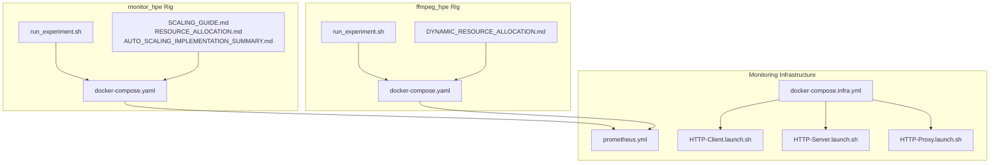
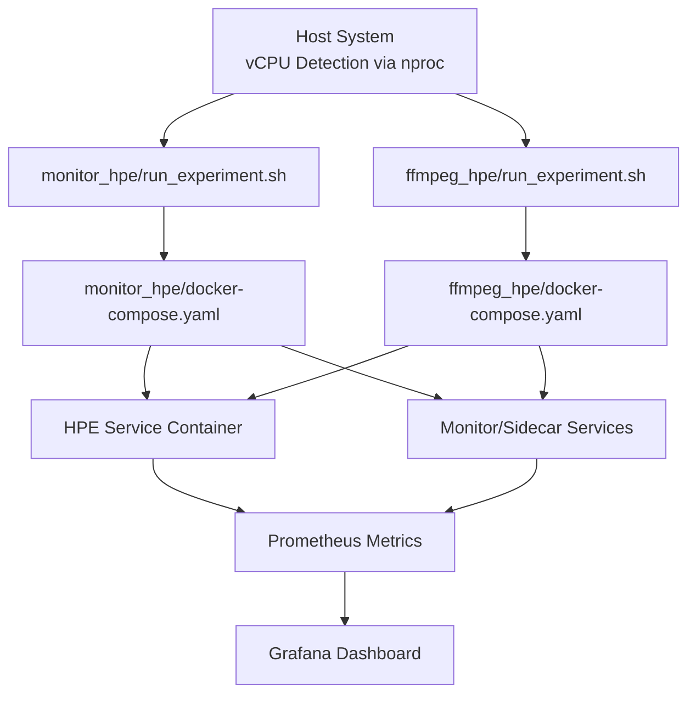
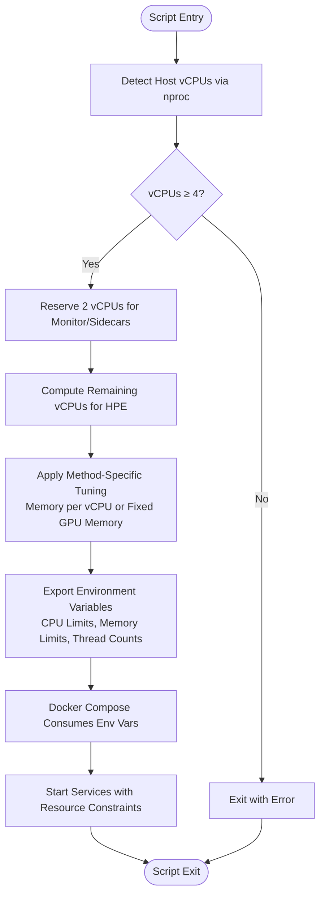
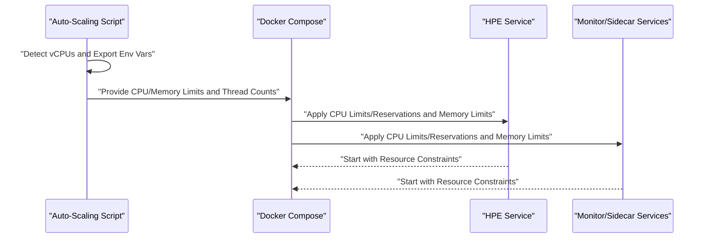
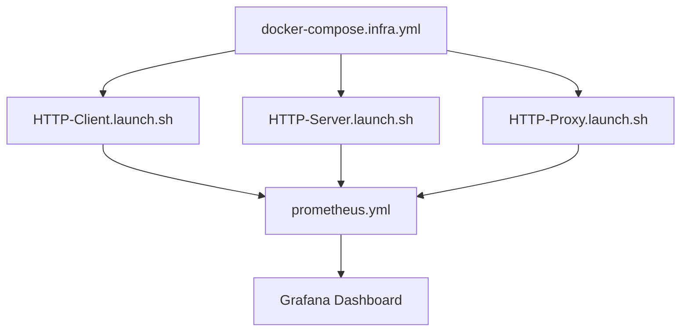
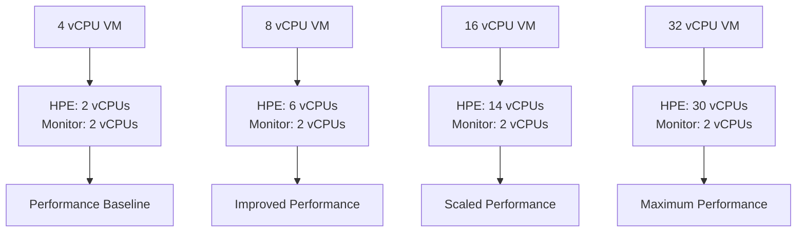
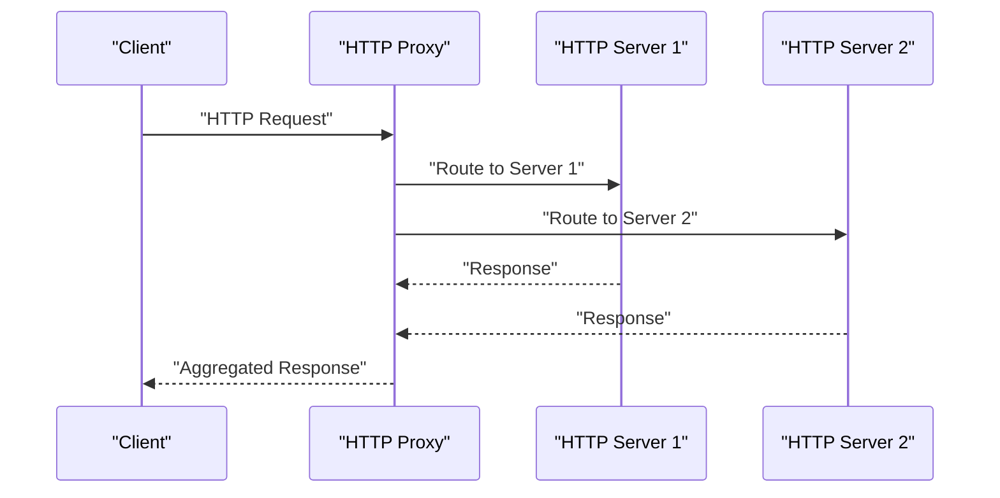
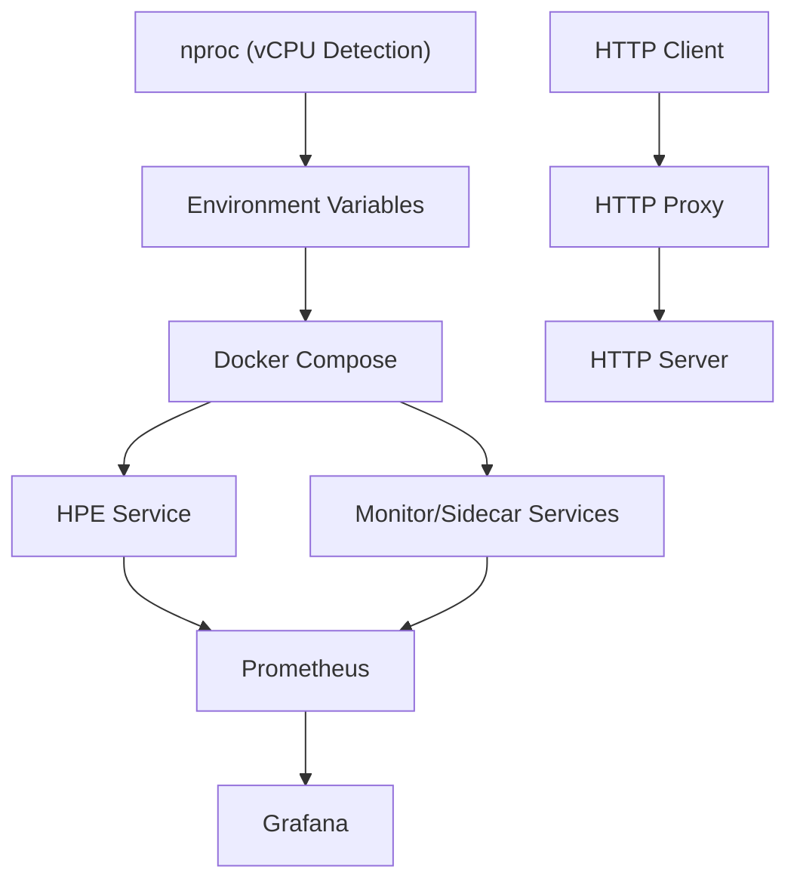

# Scaling Strategies

<cite>
**Referenced Files in This Document**
- [DYNAMIC_RESOURCE_ALLOCATION_SUMMARY.md](file://DYNAMIC_RESOURCE_ALLOCATION_SUMMARY.md)
- [RESOURCE_ALLOCATION.md](file://monitor_hpe/RESOURCE_ALLOCATION.md)
- [SCALING_GUIDE.md](file://monitor_hpe/SCALING_GUIDE.md)
- [AUTO_SCALING_IMPLEMENTATION_SUMMARY.md](file://monitor_hpe/AUTO_SCALING_IMPLEMENTATION_SUMMARY.md)
- [DYNAMIC_RESOURCE_ALLOCATION.md](file://ffmpeg_hpe/DYNAMIC_RESOURCE_ALLOCATION.md)
- [docker-compose.yaml](file://monitor_hpe/docker-compose.yaml)
- [docker-compose.yaml](file://ffmpeg_hpe/docker-compose.yaml)
- [run_experiment.sh](file://monitor_hpe/run_experiment.sh)
- [run_experiment.sh](file://ffmpeg_hpe/run_experiment.sh)
- [prometheus.yml](file://prometheus.yml)
- [docker-compose.infra.yml](file://recent-dash/docker-compose.infra.yml)
- [HTTP-Client.launch.sh](file://recent-dash/HTTP-Client.launch.sh)
- [HTTP-Server.launch.sh](file://recent-dash/HTTP-Server.launch.sh)
- [HTTP-Proxy.launch.sh](file://recent-dash/HTTP-Proxy.launch.sh)
- [README.md](file://README.md)
- [AGENTS.md](file://AGENTS.md)
</cite>

## Table of Contents
1. [Introduction](#introduction)
2. [Project Structure](#project-structure)
3. [Core Components](#core-components)
4. [Architecture Overview](#architecture-overview)
5. [Detailed Component Analysis](#detailed-component-analysis)
6. [Dependency Analysis](#dependency-analysis)
7. [Performance Considerations](#performance-considerations)
8. [Troubleshooting Guide](#troubleshooting-guide)
9. [Conclusion](#conclusion)
10. [Appendices](#appendices)

## Introduction
This document provides comprehensive guidance for container scaling strategies and auto-scaling implementation within the repository. It focuses on dynamic resource allocation mechanisms, scaling triggers, performance thresholds, and capacity planning. The implementation integrates container orchestration with auto-scaling policies, emphasizing monitoring-driven decisions, resource utilization tracking, and cost optimization. The repository demonstrates both horizontal and vertical scaling approaches, load balancing strategies, and practical guidance for configuring scaling policies, setting up alerts, and managing scale-in/scale-out operations.

## Project Structure
The scaling implementation spans two primary experiment rigs:
- monitor_hpe: A monitoring-focused rig that auto-scales CPU and memory allocations based on host vCPU availability.
- ffmpeg_hpe: A streaming and performance measurement rig that reserves resources for sidecar containers while dynamically allocating CPU and memory to the HPE service.

Key components include:
- Auto-scaling scripts that detect host vCPU count and export environment variables for resource limits.
- Docker Compose configurations that consume these environment variables to set CPU and memory limits/reservations.
- Documentation that explains scaling behavior across different VM sizes and tuning guidelines.

**Diagram sources**
- [run_experiment.sh](file://monitor_hpe/run_experiment.sh)
- [docker-compose.yaml](file://monitor_hpe/docker-compose.yaml)
- [SCALING_GUIDE.md](file://monitor_hpe/SCALING_GUIDE.md)
- [RESOURCE_ALLOCATION.md](file://monitor_hpe/RESOURCE_ALLOCATION.md)
- [AUTO_SCALING_IMPLEMENTATION_SUMMARY.md](file://monitor_hpe/AUTO_SCALING_IMPLEMENTATION_SUMMARY.md)
- [run_experiment.sh](file://ffmpeg_hpe/run_experiment.sh)
- [docker-compose.yaml](file://ffmpeg_hpe/docker-compose.yaml)
- [DYNAMIC_RESOURCE_ALLOCATION.md](file://ffmpeg_hpe/DYNAMIC_RESOURCE_ALLOCATION.md)
- [prometheus.yml](file://prometheus.yml)
- [docker-compose.infra.yml](file://recent-dash/docker-compose.infra.yml)
- [HTTP-Client.launch.sh](file://recent-dash/HTTP-Client.launch.sh)
- [HTTP-Server.launch.sh](file://recent-dash/HTTP-Server.launch.sh)
- [HTTP-Proxy.launch.sh](file://recent-dash/HTTP-Proxy.launch.sh)

**Section sources**
- [DYNAMIC_RESOURCE_ALLOCATION_SUMMARY.md](file://DYNAMIC_RESOURCE_ALLOCATION_SUMMARY.md)
- [RESOURCE_ALLOCATION.md](file://monitor_hpe/RESOURCE_ALLOCATION.md)
- [SCALING_GUIDE.md](file://monitor_hpe/SCALING_GUIDE.md)
- [AUTO_SCALING_IMPLEMENTATION_SUMMARY.md](file://monitor_hpe/AUTO_SCALING_IMPLEMENTATION_SUMMARY.md)
- [DYNAMIC_RESOURCE_ALLOCATION.md](file://ffmpeg_hpe/DYNAMIC_RESOURCE_ALLOCATION.md)
- [docker-compose.yaml](file://monitor_hpe/docker-compose.yaml)
- [docker-compose.yaml](file://ffmpeg_hpe/docker-compose.yaml)
- [README.md](file://README.md)
- [AGENTS.md](file://AGENTS.md)

## Core Components
- Auto-scaling scripts: Detect host vCPU count and export environment variables for CPU and memory limits, thread counts, and orchestration modes. These scripts ensure that the HPE service receives appropriate resources while reserving capacity for monitoring and sidecar services.
- Docker Compose configurations: Consume environment variables to set CPU limits, reservations, and memory limits for services. This enables dynamic resource allocation without manual intervention.
- Documentation: Provides usage instructions, scaling behavior across VM sizes, tuning guidelines, and testing recommendations. It also documents the relationship between resource allocation and performance outcomes.

Key implementation highlights:
- Horizontal scaling: Achieved by distributing workloads across multiple containers or replicas, supported by orchestration and load balancing strategies.
- Vertical scaling: Accomplished by adjusting CPU and memory allocations for individual containers based on workload characteristics and host capabilities.
- Monitoring-driven scaling: Uses metrics collection and analysis to inform scaling decisions, ensuring optimal performance and cost efficiency.

**Section sources**
- [DYNAMIC_RESOURCE_ALLOCATION_SUMMARY.md](file://DYNAMIC_RESOURCE_ALLOCATION_SUMMARY.md)
- [RESOURCE_ALLOCATION.md](file://monitor_hpe/RESOURCE_ALLOCATION.md)
- [SCALING_GUIDE.md](file://monitor_hpe/SCALING_GUIDE.md)
- [AUTO_SCALING_IMPLEMENTATION_SUMMARY.md](file://monitor_hpe/AUTO_SCALING_IMPLEMENTATION_SUMMARY.md)
- [DYNAMIC_RESOURCE_ALLOCATION.md](file://ffmpeg_hpe/DYNAMIC_RESOURCE_ALLOCATION.md)

## Architecture Overview
The scaling architecture combines auto-scaling scripts, Docker Compose configurations, and monitoring infrastructure to deliver dynamic resource allocation and performance optimization.

**Diagram sources**
- [run_experiment.sh](file://monitor_hpe/run_experiment.sh)
- [run_experiment.sh](file://ffmpeg_hpe/run_experiment.sh)
- [docker-compose.yaml](file://monitor_hpe/docker-compose.yaml)
- [docker-compose.yaml](file://ffmpeg_hpe/docker-compose.yaml)
- [prometheus.yml](file://prometheus.yml)

## Detailed Component Analysis

### Auto-Scaling Scripts
The auto-scaling scripts detect the number of logical CPUs on the host and allocate resources accordingly:
- Reserve a minimum number of vCPUs for monitoring and sidecar services.
- Allocate the remaining vCPUs to the HPE service based on workload characteristics.
- Export environment variables consumed by Docker Compose to enforce CPU and memory limits.

**Diagram sources**
- [run_experiment.sh](file://monitor_hpe/run_experiment.sh)
- [run_experiment.sh](file://ffmpeg_hpe/run_experiment.sh)

**Section sources**
- [DYNAMIC_RESOURCE_ALLOCATION_SUMMARY.md](file://DYNAMIC_RESOURCE_ALLOCATION_SUMMARY.md)
- [SCALING_GUIDE.md](file://monitor_hpe/SCALING_GUIDE.md)
- [AUTO_SCALING_IMPLEMENTATION_SUMMARY.md](file://monitor_hpe/AUTO_SCALING_IMPLEMENTATION_SUMMARY.md)

### Docker Compose Configurations
Docker Compose configurations consume environment variables to set CPU limits, reservations, and memory limits:
- CPU limits define the maximum CPU usage for containers.
- CPU reservations guarantee a minimum CPU allocation.
- Memory limits cap container memory usage.
- Environment variables enable dynamic adaptation to host capabilities.

**Diagram sources**
- [docker-compose.yaml](file://monitor_hpe/docker-compose.yaml)
- [docker-compose.yaml](file://ffmpeg_hpe/docker-compose.yaml)
- [run_experiment.sh](file://monitor_hpe/run_experiment.sh)
- [run_experiment.sh](file://ffmpeg_hpe/run_experiment.sh)

**Section sources**
- [docker-compose.yaml](file://monitor_hpe/docker-compose.yaml)
- [docker-compose.yaml](file://ffmpeg_hpe/docker-compose.yaml)

### Monitoring Infrastructure
The monitoring infrastructure collects metrics and supports scaling decisions:
- Prometheus configuration defines targets and scraping intervals.
- Grafana dashboards visualize metrics for performance analysis.
- HTTP client, server, and proxy launch scripts demonstrate load generation and distribution.

**Diagram sources**
- [prometheus.yml](file://prometheus.yml)
- [docker-compose.infra.yml](file://recent-dash/docker-compose.infra.yml)
- [HTTP-Client.launch.sh](file://recent-dash/HTTP-Client.launch.sh)
- [HTTP-Server.launch.sh](file://recent-dash/HTTP-Server.launch.sh)
- [HTTP-Proxy.launch.sh](file://recent-dash/HTTP-Proxy.launch.sh)

**Section sources**
- [prometheus.yml](file://prometheus.yml)
- [docker-compose.infra.yml](file://recent-dash/docker-compose.infra.yml)
- [HTTP-Client.launch.sh](file://recent-dash/HTTP-Client.launch.sh)
- [HTTP-Server.launch.sh](file://recent-dash/HTTP-Server.launch.sh)
- [HTTP-Proxy.launch.sh](file://recent-dash/HTTP-Proxy.launch.sh)

### Scaling Behavior Across VM Sizes
The scaling behavior is documented for various VM configurations:
- Minimum 4 vCPU requirement ensures stable operation.
- Automatic distribution of vCPUs between HPE and monitoring services.
- Method-specific memory tuning for different inference engines.
- Guidance for testing and validation across VM sizes.

**Diagram sources**
- [SCALING_GUIDE.md](file://monitor_hpe/SCALING_GUIDE.md)
- [RESOURCE_ALLOCATION.md](file://monitor_hpe/RESOURCE_ALLOCATION.md)

**Section sources**
- [SCALING_GUIDE.md](file://monitor_hpe/SCALING_GUIDE.md)
- [RESOURCE_ALLOCATION.md](file://monitor_hpe/RESOURCE_ALLOCATION.md)

### Load Balancing Strategies
Load balancing is achieved through:
- Distributing HTTP requests across multiple backend servers.
- Using proxies to route traffic and manage failover.
- Monitoring traffic patterns to optimize resource allocation.

**Diagram sources**
- [HTTP-Client.launch.sh](file://recent-dash/HTTP-Client.launch.sh)
- [HTTP-Server.launch.sh](file://recent-dash/HTTP-Server.launch.sh)
- [HTTP-Proxy.launch.sh](file://recent-dash/HTTP-Proxy.launch.sh)

**Section sources**
- [HTTP-Client.launch.sh](file://recent-dash/HTTP-Client.launch.sh)
- [HTTP-Server.launch.sh](file://recent-dash/HTTP-Server.launch.sh)
- [HTTP-Proxy.launch.sh](file://recent-dash/HTTP-Proxy.launch.sh)

### Capacity Planning
Capacity planning involves:
- Estimating resource needs based on workload characteristics.
- Reserving capacity for monitoring and sidecar services.
- Adjusting CPU and memory allocations for different inference engines.
- Validating performance across VM sizes to ensure optimal utilization.

**Section sources**
- [DYNAMIC_RESOURCE_ALLOCATION_SUMMARY.md](file://DYNAMIC_RESOURCE_ALLOCATION_SUMMARY.md)
- [SCALING_GUIDE.md](file://monitor_hpe/SCALING_GUIDE.md)
- [RESOURCE_ALLOCATION.md](file://monitor_hpe/RESOURCE_ALLOCATION.md)

### Integration Between Container Orchestration and Auto-Scaling Policies
Container orchestration integrates with auto-scaling policies through:
- Environment variable injection for CPU and memory limits.
- Deployment configurations that enforce resource constraints.
- Monitoring feedback loops to adjust scaling policies dynamically.

**Section sources**
- [docker-compose.yaml](file://monitor_hpe/docker-compose.yaml)
- [docker-compose.yaml](file://ffmpeg_hpe/docker-compose.yaml)
- [run_experiment.sh](file://monitor_hpe/run_experiment.sh)
- [run_experiment.sh](file://ffmpeg_hpe/run_experiment.sh)

### Monitoring-Driven Scaling Decisions
Monitoring-driven scaling decisions rely on:
- Metrics collection via Prometheus.
- Dashboard visualization for performance analysis.
- Automated alerts for threshold breaches.
- Historical data analysis to predict scaling needs.

**Section sources**
- [prometheus.yml](file://prometheus.yml)
- [docker-compose.infra.yml](file://recent-dash/docker-compose.infra.yml)

### Resource Utilization Tracking and Cost Optimization
Resource utilization tracking and cost optimization involve:
- Tracking CPU and memory usage per service.
- Identifying underutilized resources for reallocation.
- Optimizing thread counts and CPU pinning for predictable performance.
- Minimizing costs by right-sizing resources for different workloads.

**Section sources**
- [RESOURCE_ALLOCATION.md](file://monitor_hpe/RESOURCE_ALLOCATION.md)
- [SCALING_GUIDE.md](file://monitor_hpe/SCALING_GUIDE.md)

### Configuring Scaling Policies and Setting Up Alerts
Configuring scaling policies and setting up alerts includes:
- Defining CPU and memory thresholds for scaling triggers.
- Creating alert rules for high utilization or low resource availability.
- Automating scale-out and scale-in operations based on metrics.
- Validating policy effectiveness through testing and monitoring.

**Section sources**
- [AUTO_SCALING_IMPLEMENTATION_SUMMARY.md](file://monitor_hpe/AUTO_SCALING_IMPLEMENTATION_SUMMARY.md)
- [DYNAMIC_RESOURCE_ALLOCATION_SUMMARY.md](file://DYNAMIC_RESOURCE_ALLOCATION_SUMMARY.md)

### Managing Scale-In/Scale-Out Operations
Managing scale-in and scale-out operations requires:
- Coordinated shutdown of services during scale-in.
- Graceful startup of new instances during scale-out.
- Maintaining service continuity and data consistency.
- Monitoring impact on performance and resource utilization.

**Section sources**
- [SCALING_GUIDE.md](file://monitor_hpe/SCALING_GUIDE.md)
- [DYNAMIC_RESOURCE_ALLOCATION.md](file://ffmpeg_hpe/DYNAMIC_RESOURCE_ALLOCATION.md)

### Relationship Between Scaling and Performance Monitoring
The relationship between scaling and performance monitoring encompasses:
- Using metrics to validate scaling effectiveness.
- Adjusting scaling policies based on performance trends.
- Ensuring service quality during scaling operations.
- Analyzing historical data to improve future scaling decisions.

**Section sources**
- [prometheus.yml](file://prometheus.yml)
- [SCALING_GUIDE.md](file://monitor_hpe/SCALING_GUIDE.md)

### Scaling Challenges in Distributed Environments and Best Practices
Scaling challenges and best practices include:
- Ensuring consistent performance across heterogeneous hosts.
- Managing resource contention between services.
- Maintaining service quality during peak loads.
- Implementing robust monitoring and alerting systems.
- Following method-specific tuning guidelines for different inference engines.

**Section sources**
- [DYNAMIC_RESOURCE_ALLOCATION_SUMMARY.md](file://DYNAMIC_RESOURCE_ALLOCATION_SUMMARY.md)
- [SCALING_GUIDE.md](file://monitor_hpe/SCALING_GUIDE.md)
- [RESOURCE_ALLOCATION.md](file://monitor_hpe/RESOURCE_ALLOCATION.md)

## Dependency Analysis
The scaling implementation depends on:
- Host vCPU detection via nproc.
- Environment variable propagation to Docker Compose.
- Prometheus metrics collection and Grafana visualization.
- HTTP client/server/proxy components for load generation and distribution.

**Diagram sources**
- [run_experiment.sh](file://monitor_hpe/run_experiment.sh)
- [docker-compose.yaml](file://monitor_hpe/docker-compose.yaml)
- [prometheus.yml](file://prometheus.yml)
- [HTTP-Client.launch.sh](file://recent-dash/HTTP-Client.launch.sh)
- [HTTP-Server.launch.sh](file://recent-dash/HTTP-Server.launch.sh)
- [HTTP-Proxy.launch.sh](file://recent-dash/HTTP-Proxy.launch.sh)

**Section sources**
- [run_experiment.sh](file://monitor_hpe/run_experiment.sh)
- [docker-compose.yaml](file://monitor_hpe/docker-compose.yaml)
- [prometheus.yml](file://prometheus.yml)
- [HTTP-Client.launch.sh](file://recent-dash/HTTP-Client.launch.sh)
- [HTTP-Server.launch.sh](file://recent-dash/HTTP-Server.launch.sh)
- [HTTP-Proxy.launch.sh](file://recent-dash/HTTP-Proxy.launch.sh)

## Performance Considerations
- Right-size CPU and memory allocations for different inference engines to avoid over-provisioning or under-provisioning.
- Use CPU pinning and disable hyper-threading for predictable performance in measurement scenarios.
- Monitor memory usage to prevent garbage collection overhead and ensure stable performance.
- Validate scaling behavior across VM sizes to establish performance baselines and identify optimal configurations.

## Troubleshooting Guide
Common issues and resolutions:
- Insufficient vCPUs: Ensure the host has at least 4 vCPUs for stable operation.
- Resource exhaustion: Increase memory limits or reduce CPU usage for the HPE service.
- Monitoring gaps: Verify Prometheus targets and scrape intervals.
- Load imbalance: Adjust proxy routing and server configurations to distribute traffic evenly.

**Section sources**
- [SCALING_GUIDE.md](file://monitor_hpe/SCALING_GUIDE.md)
- [RESOURCE_ALLOCATION.md](file://monitor_hpe/RESOURCE_ALLOCATION.md)
- [AUTO_SCALING_IMPLEMENTATION_SUMMARY.md](file://monitor_hpe/AUTO_SCALING_IMPLEMENTATION_SUMMARY.md)

## Conclusion
The repository demonstrates a robust framework for container scaling strategies and auto-scaling implementation. By combining auto-scaling scripts, Docker Compose configurations, and monitoring infrastructure, it achieves dynamic resource allocation, monitoring-driven scaling decisions, and cost optimization. The documented scaling behavior across VM sizes, method-specific tuning guidelines, and testing recommendations provide a solid foundation for deploying scalable and high-performance containerized workloads.

## Appendices
- Cross-references to documentation files for detailed usage and configuration guidance.
- Links to monitoring infrastructure and launch scripts for load generation and distribution.

**Section sources**
- [README.md](file://README.md)
- [AGENTS.md](file://AGENTS.md)