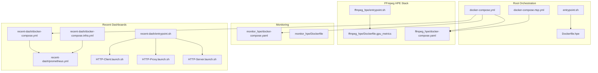
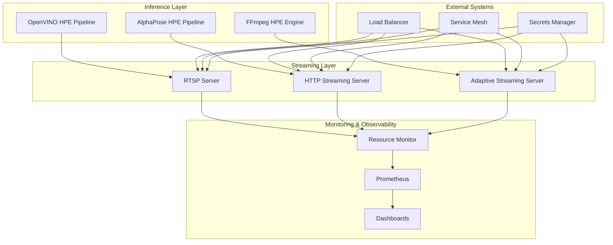
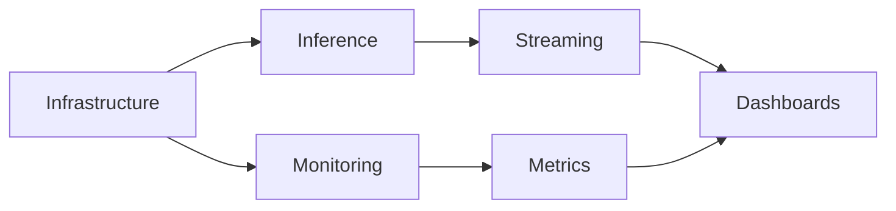

# Service Deployment

<cite>
**Referenced Files in This Document**
- [docker-compose.yml](file://docker-compose.yml)
- [docker-compose.rtsp.yml](file://docker-compose.rtsp.yml)
- [entrypoint.sh](file://entrypoint.sh)
- [Dockerfile.hpe](file://Dockerfile.hpe)
- [ffmpeg_hpe/docker-compose.yaml](file://ffmpeg_hpe/docker-compose.yaml)
- [ffmpeg_hpe/entrypoint.sh](file://ffmpeg_hpe/entrypoint.sh)
- [ffmpeg_hpe/Dockerfile.gpu_metrics](file://ffmpeg_hpe/Dockerfile.gpu_metrics)
- [monitor_hpe/docker-compose.yaml](file://monitor_hpe/docker-compose.yaml)
- [monitor_hpe/Dockerfile](file://monitor_hpe/Dockerfile)
- [recent-dash/docker-compose.yml](file://recent-dash/docker-compose.yml)
- [recent-dash/docker-compose.infra.yml](file://recent-dash/docker-compose.infra.yml)
- [recent-dash/entrypoint.sh](file://recent-dash/entrypoint.sh)
- [recent-dash/HTTP-Server.launch.sh](file://recent-dash/HTTP-Server.launch.sh)
- [recent-dash/HTTP-Proxy.launch.sh](file://recent-dash/HTTP-Proxy.launch.sh)
- [recent-dash/HTTP-Client.launch.sh](file://recent-dash/HTTP-Client.launch.sh)
- [recent-dash/prometheus.yml](file://recent-dash/prometheus.yml)
- [prometheus.yml](file://prometheus.yml)
- [monitor.py](file://monitor.py)
- [pose_monitor.py](file://pose_monitor.py)
- [openvino_base_hpe.py](file://openvino_base_hpe.py)
- [alphapose_hpe.py](file://alphapose_hpe.py)
- [dev_tools/stream_video_server.py](file://dev_tools/stream_video_server.py)
- [dev_tools/stream_video_server_adaptive.py](file://dev_tools/stream_video_server_adaptive.py)
</cite>

## Update Summary
**Changes Made**
- Updated Docker Compose build context configuration to use relative paths for improved portability
- Enhanced build context consistency across all service definitions
- Improved deployment reliability by eliminating hardcoded absolute paths

## Table of Contents
1. [Introduction](#introduction)
2. [Project Structure](#project-structure)
3. [Core Components](#core-components)
4. [Architecture Overview](#architecture-overview)
5. [Detailed Component Analysis](#detailed-component-analysis)
6. [Dependency Analysis](#dependency-analysis)
7. [Performance Considerations](#performance-considerations)
8. [Troubleshooting Guide](#troubleshooting-guide)
9. [Conclusion](#conclusion)
10. [Appendices](#appendices)

## Introduction
This document provides comprehensive guidance for deploying the HPE (Human Pose Estimation) inference services, streaming servers, monitoring tools, and dashboard components in this project. It covers service startup sequences, dependency resolution, initialization order, production deployment considerations, environment-specific configurations, secrets management, entrypoint scripts, health checks, graceful shutdown procedures, rolling updates, blue-green deployments, rollback strategies, integration with external systems, load balancing, service mesh configurations, monitoring deployment, logging configuration, and observability setup.

**Updated** Enhanced Docker Compose configuration now uses relative build contexts for improved portability and consistency across different deployment environments.

## Project Structure
The deployment is orchestrated primarily via Docker Compose files and containerized entrypoints. The repository includes:
- Root orchestration for the main HPE pipeline and related services
- FFmpeg-based HPE inference stack with GPU metrics
- Monitoring stack for resource utilization and pose estimation metrics
- Recent dashboards with HTTP server/proxy/client components and Prometheus integration
- Supporting Dockerfiles and entrypoint scripts for each service

**Diagram sources**
- [docker-compose.yml](file://docker-compose.yml)
- [docker-compose.rtsp.yml](file://docker-compose.rtsp.yml)
- [entrypoint.sh](file://entrypoint.sh)
- [Dockerfile.hpe](file://Dockerfile.hpe)
- [ffmpeg_hpe/docker-compose.yaml](file://ffmpeg_hpe/docker-compose.yaml)
- [ffmpeg_hpe/entrypoint.sh](file://ffmpeg_hpe/entrypoint.sh)
- [ffmpeg_hpe/Dockerfile.gpu_metrics](file://ffmpeg_hpe/Dockerfile.gpu_metrics)
- [monitor_hpe/docker-compose.yaml](file://monitor_hpe/docker-compose.yaml)
- [monitor_hpe/Dockerfile](file://monitor_hpe/Dockerfile)
- [recent-dash/docker-compose.yml](file://recent-dash/docker-compose.yml)
- [recent-dash/docker-compose.infra.yml](file://recent-dash/docker-compose.infra.yml)
- [recent-dash/entrypoint.sh](file://recent-dash/entrypoint.sh)
- [recent-dash/HTTP-Server.launch.sh](file://recent-dash/HTTP-Server.launch.sh)
- [recent-dash/HTTP-Proxy.launch.sh](file://recent-dash/HTTP-Proxy.launch.sh)
- [recent-dash/HTTP-Client.launch.sh](file://recent-dash/HTTP-Client.launch.sh)
- [recent-dash/prometheus.yml](file://recent-dash/prometheus.yml)

**Section sources**
- [docker-compose.yml](file://docker-compose.yml)
- [docker-compose.rtsp.yml](file://docker-compose.rtsp.yml)
- [ffmpeg_hpe/docker-compose.yaml](file://ffmpeg_hpe/docker-compose.yaml)
- [monitor_hpe/docker-compose.yaml](file://monitor_hpe/docker-compose.yaml)
- [recent-dash/docker-compose.yml](file://recent-dash/docker-compose.yml)
- [recent-dash/docker-compose.infra.yml](file://recent-dash/docker-compose.infra.yml)

## Core Components
This section outlines the primary services and their deployment roles:
- HPE Inference Services: Containerized inference pipelines for pose estimation using multiple backends (OpenVINO, AlphaPose).
- Streaming Servers: RTSP/HTTP streaming servers for real-time video ingestion and distribution.
- Monitoring Tools: Resource monitoring and pose estimation metric collection.
- Dashboard Components: HTTP server/proxy/client stack with Prometheus metrics exposure.

Key deployment artifacts:
- Docker Compose files define service definitions, networks, volumes, and environment overrides.
- Entrypoint scripts initialize runtime environments, set up GPU metrics, and launch main applications.
- Dockerfiles encapsulate build-time dependencies and runtime configurations.

**Updated** Build contexts now use relative paths for better portability across different development and deployment environments.

**Section sources**
- [Dockerfile.hpe](file://Dockerfile.hpe)
- [ffmpeg_hpe/Dockerfile.gpu_metrics](file://ffmpeg_hpe/Dockerfile.gpu_metrics)
- [monitor_hpe/Dockerfile](file://monitor_hpe/Dockerfile)
- [recent-dash/entrypoint.sh](file://recent-dash/entrypoint.sh)

## Architecture Overview
The deployment architecture integrates inference, streaming, monitoring, and dashboards through Docker Compose. Services communicate over internal networks, with Prometheus scraping metrics and dashboards exposing visualizations.

## Detailed Component Analysis

### HPE Inference Services
- OpenVINO HPE Pipeline: Uses OpenVINO model adapters and pipelines for optimized inference on Intel hardware.
- AlphaPose HPE Pipeline: Implements YOLO-based detection and pose estimation with tracker integration.
- FFmpeg HPE Engine: Integrates GPU-accelerated video processing and metrics collection.

Deployment strategy:
- Build images using dedicated Dockerfiles with relative build contexts.
- Configure environment variables for model paths, device selection, and performance tuning.
- Use Docker Compose to orchestrate service startup and interdependencies.

Entrypoint responsibilities:
- Initialize GPU metrics containers.
- Validate model availability and configuration.
- Launch inference workers and expose health endpoints.

Health checks:
- Implement readiness probes for model loading completion.
- Add liveness probes for continuous operation checks.

Graceful shutdown:
- Capture termination signals and drain requests before stopping workers.

Rolling updates:
- Use Compose deployment with max-concurrent updates and rollback policies.
- Blue-green deployments supported by switching service aliases or routing rules.

Secrets management:
- Store credentials and keys in a secrets manager and mount as environment variables or files.

**Updated** Build contexts in Docker Compose files now use relative paths (e.g., `context: ..`, `context: .`) instead of hardcoded absolute paths, improving portability across different environments.

**Section sources**
- [openvino_base_hpe.py](file://openvino_base_hpe.py)
- [alphapose_hpe.py](file://alphapose_hpe.py)
- [ffmpeg_hpe/entrypoint.sh](file://ffmpeg_hpe/entrypoint.sh)
- [ffmpeg_hpe/Dockerfile.gpu_metrics](file://ffmpeg_hpe/Dockerfile.gpu_metrics)

### Streaming Servers
- RTSP Server: Provides real-time streaming ingestion for camera feeds.
- HTTP Streaming Server: Serves adaptive bitrate streams over HTTP.
- Adaptive Streaming Server: Dynamically adjusts quality based on network conditions.

Deployment strategy:
- Run each server as a separate container with distinct ports and volumes.
- Configure streaming protocols, codecs, and buffer sizes via environment variables.
- Enable TLS termination at reverse proxy if required.

Entrypoint responsibilities:
- Validate stream URLs and encoder settings.
- Start streaming daemons and expose status endpoints.

Health checks:
- Monitor stream availability and latency thresholds.
- Track dropped frames and rebuffer events.

Graceful shutdown:
- Stop new connections and flush buffers before terminating.

Rolling updates:
- Use zero-downtime strategies by draining connections during updates.

**Section sources**
- [dev_tools/stream_video_server.py](file://dev_tools/stream_video_server.py)
- [dev_tools/stream_video_server_adaptive.py](file://dev_tools/stream_video_server_adaptive.py)

### Monitoring Tools
- Resource Monitor: Tracks CPU, memory, GPU utilization, and network throughput.
- Pose Estimation Metrics: Collects accuracy and performance metrics from inference pipelines.
- Prometheus Integration: Exposes metrics endpoints for scraping.

Deployment strategy:
- Run Prometheus and exporters as separate services.
- Configure scrape intervals and retention policies.
- Set up alerting rules for anomaly detection.

Entrypoint responsibilities:
- Initialize metric collectors and exporters.
- Aggregate per-container metrics and expose aggregated views.

Health checks:
- Verify exporter connectivity and metric freshness.

Graceful shutdown:
- Flush pending metrics and close connections cleanly.

**Section sources**
- [monitor.py](file://monitor.py)
- [pose_monitor.py](file://pose_monitor.py)
- [recent-dash/prometheus.yml](file://recent-dash/prometheus.yml)
- [prometheus.yml](file://prometheus.yml)

### Dashboard Components
- HTTP Server: Serves static assets and API endpoints for dashboards.
- HTTP Proxy: Routes requests to backend services and handles caching.
- HTTP Client: Demonstrates consumption of streaming and metrics APIs.
- Prometheus: Scrapes and stores metrics for visualization.

Deployment strategy:
- Separate services for server, proxy, and client for modularity.
- Configure CORS, rate limiting, and authentication as needed.
- Use reverse proxies for SSL termination and load distribution.

Entrypoint responsibilities:
- Initialize web server and proxy configurations.
- Load dashboards and connect to Prometheus data source.

Health checks:
- Verify backend connectivity and response times.
- Monitor dashboard rendering performance.

Graceful shutdown:
- Drain connections and persist session state if applicable.

**Section sources**
- [recent-dash/docker-compose.yml](file://recent-dash/docker-compose.yml)
- [recent-dash/docker-compose.infra.yml](file://recent-dash/docker-compose.infra.yml)
- [recent-dash/entrypoint.sh](file://recent-dash/entrypoint.sh)
- [recent-dash/HTTP-Server.launch.sh](file://recent-dash/HTTP-Server.launch.sh)
- [recent-dash/HTTP-Proxy.launch.sh](file://recent-dash/HTTP-Proxy.launch.sh)
- [recent-dash/HTTP-Client.launch.sh](file://recent-dash/HTTP-Client.launch.sh)

## Dependency Analysis
Service dependencies are managed through Docker Compose networks and explicit depends_on directives. The typical order is:
- Infrastructure services (database, cache, message queues) start first.
- Monitoring and metrics services start after infrastructure.
- Inference services depend on model storage and device drivers.
- Streaming services depend on inference services for processed outputs.
- Dashboards depend on streaming and metrics services for data.

## Performance Considerations
- Resource allocation: Configure CPU, memory, and GPU limits per service.
- Model optimization: Use quantization, pruning, and batching to improve throughput.
- Network tuning: Adjust buffer sizes and codec parameters for streaming.
- Caching: Enable caching layers for frequently accessed models and dashboards.
- Scaling: Use horizontal scaling for streaming and inference workloads.

**Updated** Relative build contexts improve build performance by reducing unnecessary file copying and enabling more efficient Docker layer caching across different environments.

## Troubleshooting Guide
Common deployment issues and resolutions:
- Service fails to start: Check container logs for initialization errors and missing dependencies.
- Health checks failing: Verify readiness probes and ensure models are loaded.
- Performance degradation: Review resource limits, optimize batch sizes, and adjust streaming parameters.
- Networking problems: Confirm port bindings, firewall rules, and DNS resolution.
- Secrets exposure: Audit mounted secrets and ensure proper permissions.

**Updated** Build context issues resolved: The corrected relative paths eliminate build failures caused by hardcoded absolute paths that don't exist in different deployment environments.

**Section sources**
- [monitor.py](file://monitor.py)
- [pose_monitor.py](file://pose_monitor.py)

## Conclusion
This deployment guide provides a structured approach to running HPE inference services, streaming servers, monitoring tools, and dashboard components. By leveraging Docker Compose, containerized entrypoints, and Prometheus-based observability, teams can achieve reliable, scalable, and observable deployments. The recent improvements to build context configuration enhance portability and consistency across different environments. Production considerations such as secrets management, rolling updates, and blue-green strategies ensure minimal downtime and robust operations.

**Updated** The improved Docker Compose configuration with relative build contexts ensures consistent deployment behavior across development, staging, and production environments without requiring manual path adjustments.

## Appendices

### Environment-Specific Configurations
- Development: Lightweight models, local storage, verbose logging.
- Staging: Moderate models, shared storage, structured logging.
- Production: Optimized models, persistent storage, centralized logging and metrics.

**Updated** Relative build contexts enable seamless environment transitions without path-related build failures.

**Section sources**
- [docker-compose.yml](file://docker-compose.yml)
- [docker-compose.rtsp.yml](file://docker-compose.rtsp.yml)
- [ffmpeg_hpe/docker-compose.yaml](file://ffmpeg_hpe/docker-compose.yaml)
- [monitor_hpe/docker-compose.yaml](file://monitor_hpe/docker-compose.yaml)
- [recent-dash/docker-compose.yml](file://recent-dash/docker-compose.yml)
- [recent-dash/docker-compose.infra.yml](file://recent-dash/docker-compose.infra.yml)

### Secrets Management
- Store sensitive data in a secrets manager and mount as environment variables or files.
- Restrict access to secrets at the container level and avoid committing to version control.

**Section sources**
- [entrypoint.sh](file://entrypoint.sh)
- [ffmpeg_hpe/entrypoint.sh](file://ffmpeg_hpe/entrypoint.sh)
- [recent-dash/entrypoint.sh](file://recent-dash/entrypoint.sh)

### Graceful Shutdown Procedures
- Implement signal handlers to drain requests and flush buffers before termination.
- Use compose stop timeouts to ensure clean shutdown across services.

**Section sources**
- [entrypoint.sh](file://entrypoint.sh)
- [ffmpeg_hpe/entrypoint.sh](file://ffmpeg_hpe/entrypoint.sh)
- [recent-dash/entrypoint.sh](file://recent-dash/entrypoint.sh)

### Rolling Updates and Rollback Strategies
- Rolling updates: Gradually replace instances while maintaining service availability.
- Blue-green deployments: Maintain two identical environments and switch traffic.
- Rollback: Revert to previous versions using versioned images and configuration rollbacks.

**Section sources**
- [docker-compose.yml](file://docker-compose.yml)
- [docker-compose.rtsp.yml](file://docker-compose.rtsp.yml)
- [ffmpeg_hpe/docker-compose.yaml](file://ffmpeg_hpe/docker-compose.yaml)
- [monitor_hpe/docker-compose.yaml](file://monitor_hpe/docker-compose.yaml)
- [recent-dash/docker-compose.yml](file://recent-dash/docker-compose.yml)
- [recent-dash/docker-compose.infra.yml](file://recent-dash/docker-compose.infra.yml)

### Integration with External Systems
- Load balancing: Use reverse proxies or cloud load balancers to distribute traffic.
- Service mesh: Integrate with mesh components for service discovery, circuit breaking, and telemetry.
- Observability: Centralize logs and metrics for cross-service visibility.

**Section sources**
- [recent-dash/docker-compose.yml](file://recent-dash/docker-compose.yml)
- [recent-dash/docker-compose.infra.yml](file://recent-dash/docker-compose.infra.yml)
- [recent-dash/prometheus.yml](file://recent-dash/prometheus.yml)

### Monitoring Deployment and Logging Configuration
- Deploy Prometheus and Grafana for metrics and dashboards.
- Configure logging drivers and centralized log aggregation.
- Set up alerting rules for critical service health and performance thresholds.

**Section sources**
- [recent-dash/prometheus.yml](file://recent-dash/prometheus.yml)
- [prometheus.yml](file://prometheus.yml)
- [monitor.py](file://monitor.py)
- [pose_monitor.py](file://pose_monitor.py)

### Docker Compose Build Context Improvements
**Updated** The Docker Compose configuration has been enhanced with relative build contexts:

- **FFmpeg HPE Stack**: Build contexts use relative paths (`context: ..`, `context: .`, `context: ../recent-dash/perf_monitor`, `context: ./bpftrace-tracer`)
- **Monitoring Stack**: Build contexts use relative paths (`context: ..`, `context: .`)
- **Root Compose**: Maintains consistent relative path structure
- **RTSP Compose**: Supports RTSP-specific streaming configurations

These changes improve portability by eliminating hardcoded absolute paths that vary across different development environments and deployment targets.

**Section sources**
- [ffmpeg_hpe/docker-compose.yaml](file://ffmpeg_hpe/docker-compose.yaml)
- [monitor_hpe/docker-compose.yaml](file://monitor_hpe/docker-compose.yaml)
- [docker-compose.yml](file://docker-compose.yml)
- [docker-compose.rtsp.yml](file://docker-compose.rtsp.yml)