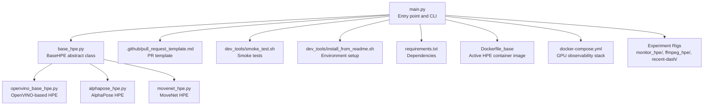
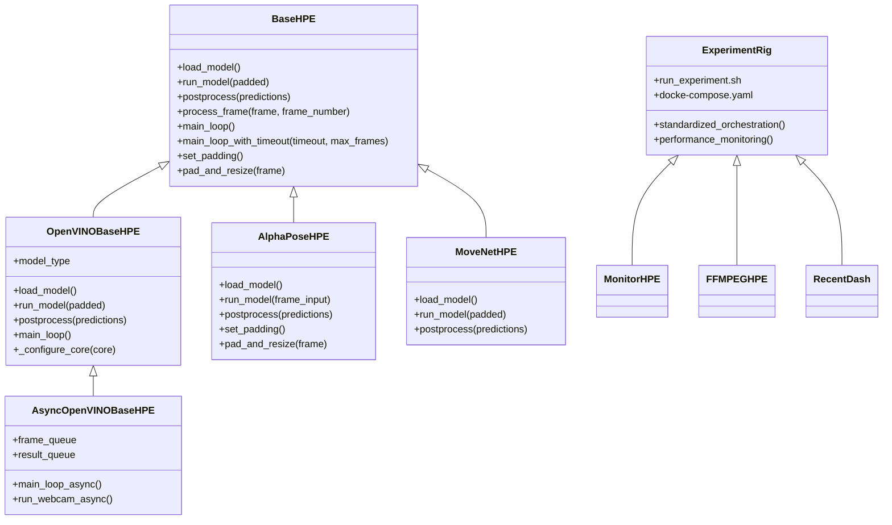
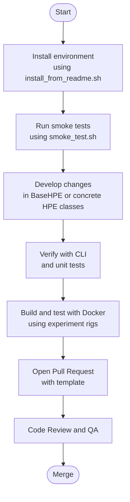
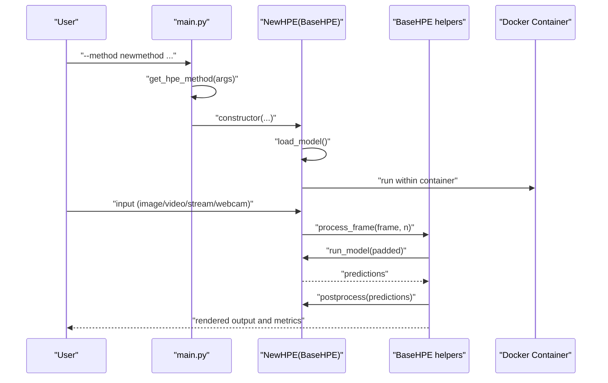

# Contributing Guidelines

<cite>
**Referenced Files in This Document**
- [README.md](file://README.md)
- [main.py](file://main.py)
- [base_hpe.py](file://base_hpe.py)
- [openvino_base_hpe.py](file://openvino_base_hpe.py)
- [alphapose_hpe.py](file://alphapose_hpe.py)
- [movenet_hpe.py](file://movenet_hpe.py)
- [.github/pull_request_template.md](file://.github/pull_request_template.md)
- [dev_tools/smoke_test.sh](file://dev_tools/smoke_test.sh)
- [dev_tools/install_from_readme.sh](file://dev_tools/install_from_readme.sh)
- [requirements.txt](file://requirements.txt)
- [AGENTS.md](file://AGENTS.md)
- [Dockerfile_base](file://Dockerfile_base)
- [docker-compose.yml](file://docker-compose.yml)
- [monitor_hpe/run_experiment.sh](file://monitor_hpe/run_experiment.sh)
- [ffmpeg_hpe/run_experiment.sh](file://ffmpeg_hpe/run_experiment.sh)
- [recent-dash/run_experiment.sh](file://recent-dash/run_experiment.sh)
- [monitor_hpe/docker-compose.yaml](file://monitor_hpe/docker-compose.yaml)
- [ffmpeg_hpe/docker-compose.yaml](file://ffmpeg_hpe/docker-compose.yaml)
- [rtsp-ipcam/Dockerfile](file://rtsp-ipcam/Dockerfile)
- [optimizations/optimized_main.py](file://optimizations/optimized_main.py)
- [dev_tools/README.md](file://dev_tools/README.md)
</cite>

## Update Summary
**Changes Made**
- Enhanced Docker and experiment rig infrastructure documentation
- Added detailed branch-specific guidance for performance measurement workflows
- Expanded Docker image usage and container orchestration procedures
- Updated experiment rig conventions and standardized execution patterns
- Integrated new performance monitoring and measurement tooling

## Table of Contents
1. [Introduction](#introduction)
2. [Project Structure](#project-structure)
3. [Core Components](#core-components)
4. [Architecture Overview](#architecture-overview)
5. [Development Workflow](#development-workflow)
6. [Code Contribution Process](#code-contribution-process)
7. [Coding Standards](#coding-standards)
8. [Testing Requirements](#testing-requirements)
9. [Documentation Expectations](#documentation-expectations)
10. [Pull Request Process](#pull-request-process)
11. [Code Review Procedures](#code-review-procedures)
12. [Quality Assurance Practices](#quality-assurance-practices)
13. [Adding New HPE Methods](#adding-new-hpe-methods)
14. [Extending Existing Functionality](#extending-existing-functionality)
15. [Experiment Rigs and Performance Measurement](#experiment-rigs-and-performance-measurement)
16. [Docker Infrastructure and Container Management](#docker-infrastructure-and-container-management)
17. [Performance Monitoring and Data Collection](#performance-monitoring-and-data-collection)
18. [Issue Reporting and Feature Requests](#issue-reporting-and-feature-requests)
19. [Community Participation](#community-participation)
20. [Troubleshooting Guide](#troubleshooting-guide)
21. [Conclusion](#conclusion)

## Introduction
This document provides comprehensive contributing guidelines for the Human Pose Estimation (HPE) framework. It covers the development workflow, code contribution processes, community standards, coding standards, testing requirements, documentation expectations, pull request procedures, quality assurance practices, and guidance for adding new HPE methods or extending existing functionality. The framework now includes advanced Docker-based experiment rigs for performance measurement and containerized monitoring infrastructure.

**Updated** Enhanced from generic boilerplate to branch-specific guidance with detailed conventions for new experiment rigs and Docker image usage.

## Project Structure
The HPE framework is organized around a shared base abstraction and multiple concrete HPE implementations, augmented with comprehensive Docker infrastructure for performance measurement. The main entry point orchestrates method selection and execution, while specialized HPE classes encapsulate model loading, preprocessing, inference, and postprocessing logic. Development tools and scripts support environment setup, smoke testing, and continuous integration readiness, with dedicated experiment rigs for performance benchmarking.

**Diagram sources**
- [main.py:1-99](file://main.py#L1-L99)
- [base_hpe.py:1-546](file://base_hpe.py#L1-L546)
- [openvino_base_hpe.py:1-653](file://openvino_base_hpe.py#L1-L653)
- [alphapose_hpe.py:1-334](file://alphapose_hpe.py#L1-L334)
- [movenet_hpe.py:1-111](file://movenet_hpe.py#L1-L111)
- [.github/pull_request_template.md:1-30](file://.github/pull_request_template.md#L1-L30)
- [dev_tools/smoke_test.sh:1-42](file://dev_tools/smoke_test.sh#L1-L42)
- [dev_tools/install_from_readme.sh:1-39](file://dev_tools/install_from_readme.sh#L1-L39)
- [requirements.txt:1-100](file://requirements.txt#L1-L100)
- [Dockerfile_base:1-84](file://Dockerfile_base#L1-L84)
- [docker-compose.yml:1-30](file://docker-compose.yml#L1-L30)

**Section sources**
- [README.md:1-125](file://README.md#L1-L125)
- [main.py:1-99](file://main.py#L1-L99)
- [AGENTS.md:1-217](file://AGENTS.md#L1-L217)

## Core Components
- BaseHPE: Defines the abstract interface for HPE implementations, including input handling, preprocessing, inference orchestration, postprocessing, and output generation. It supports image, directory, video, HTTP stream, and webcam inputs, with optional JSON/COCO CSV exports and video/image saving.
- OpenVINO-based HPE: Implements OpenVINO model loading, configuration, preprocessing, inference, and postprocessing for multiple architectures (OpenPose, HigherHRNet, EfficientHRNet variants). Includes CPU performance tuning and async processing capabilities.
- AlphaPose HPE: Integrates AlphaPose models with configurable detector and pose estimation pipelines, GPU/CPU device selection, and multiprocessing support.
- MoveNet HPE: Uses OpenVINO runtime to load and run MoveNet models, with CPU-only support and standardized postprocessing.
- **Updated** Experiment Rigs: Three specialized Docker-based experiment rigs (monitor_hpe, ffmpeg_hpe, recent-dash) for comprehensive performance measurement and monitoring.

**Section sources**
- [base_hpe.py:36-546](file://base_hpe.py#L36-L546)
- [openvino_base_hpe.py:55-653](file://openvino_base_hpe.py#L55-L653)
- [alphapose_hpe.py:33-334](file://alphapose_hpe.py#L33-L334)
- [movenet_hpe.py:12-111](file://movenet_hpe.py#L12-L111)
- [AGENTS.md:74-95](file://AGENTS.md#L74-L95)

## Architecture Overview
The framework follows a layered architecture with enhanced Docker infrastructure for performance measurement:
- Entry point: Parses CLI arguments and selects the appropriate HPE implementation.
- Abstraction layer: BaseHPE defines common behavior for input handling, timing, rendering, and output.
- Implementation layer: Concrete HPE classes implement model-specific loading, preprocessing, inference, and postprocessing.
- Utility layer: Shared visualization, evaluation, and video handling utilities.
- **Updated** Container layer: Docker-based experiment rigs with standardized orchestration and monitoring.

**Diagram sources**
- [base_hpe.py:36-546](file://base_hpe.py#L36-L546)
- [openvino_base_hpe.py:55-653](file://openvino_base_hpe.py#L55-L653)
- [alphapose_hpe.py:33-334](file://alphapose_hpe.py#L33-L334)
- [movenet_hpe.py:12-111](file://movenet_hpe.py#L12-L111)
- [monitor_hpe/run_experiment.sh:1-138](file://monitor_hpe/run_experiment.sh#L1-L138)
- [ffmpeg_hpe/run_experiment.sh:1-251](file://ffmpeg_hpe/run_experiment.sh#L1-L251)
- [recent-dash/run_experiment.sh:1-286](file://recent-dash/run_experiment.sh#L1-L286)

## Development Workflow
- Environment setup: Use the provided installer script to recreate the documented environment, ensuring Python 3.8.10, PyTorch 2.4.1, and required dependencies are installed.
- Local testing: Run smoke tests to validate basic functionality across methods and devices.
- Experimentation: Use the development utilities to stream video feeds and test end-to-end pipelines.
- **Updated** Docker-based testing: Leverage experiment rigs for comprehensive performance measurement and monitoring.

**Diagram sources**
- [dev_tools/install_from_readme.sh:1-39](file://dev_tools/install_from_readme.sh#L1-L39)
- [dev_tools/smoke_test.sh:1-42](file://dev_tools/smoke_test.sh#L1-L42)
- [.github/pull_request_template.md:1-30](file://.github/pull_request_template.md#L1-L30)
- [AGENTS.md:129-133](file://AGENTS.md#L129-L133)

**Section sources**
- [README.md:71-125](file://README.md#L71-L125)
- [dev_tools/install_from_readme.sh:1-39](file://dev_tools/install_from_readme.sh#L1-L39)
- [dev_tools/smoke_test.sh:1-42](file://dev_tools/smoke_test.sh#L1-L42)
- [AGENTS.md:152-186](file://AGENTS.md#L152-L186)

## Code Contribution Process
- Fork and branch: Create a feature branch from the latest main branch.
- Implement changes: Follow coding standards and ensure backward compatibility where applicable.
- Test locally: Run smoke tests and validate with various inputs (image, directory, video, stream, webcam).
- **Updated** Docker validation: Test changes within the experiment rig infrastructure.
- Commit messages: Use clear, descriptive messages explaining the change and its motivation.
- Submit PR: Fill out the pull request template with summary, changes, test steps, and evidence.

**Section sources**
- [.github/pull_request_template.md:1-30](file://.github/pull_request_template.md#L1-L30)
- [AGENTS.md:107-118](file://AGENTS.md#L107-L118)

## Coding Standards
- Python style: Adhere to PEP 8 and maintain readable, consistent formatting.
- Type hints: Prefer explicit type hints for function signatures and class attributes.
- Docstrings: Provide docstrings for modules, classes, and functions explaining purpose, parameters, and return values.
- Logging: Use structured logging for errors, warnings, and informational messages.
- Imports: Group standard library, third-party, and local imports; avoid wildcard imports.
- Error handling: Handle exceptions gracefully, provide meaningful error messages, and avoid silent failures.
- Performance: Minimize redundant computations; leverage GPU acceleration where available; avoid unnecessary conversions.
- **Updated** Docker compatibility: Ensure code changes are compatible with containerized execution environments.

[No sources needed since this section provides general guidance]

## Testing Requirements
- Smoke tests: Validate end-to-end execution across methods and devices using the provided script.
- Unit tests: Extend unit tests for new functionality; ensure coverage of preprocessing, inference, and postprocessing paths.
- Integration tests: Test full pipelines for image, directory, video, HTTP stream, and webcam inputs.
- Performance tests: Measure inference time, FPS, and throughput; document any regressions.
- Environment verification: Confirm compatibility with documented dependencies and versions.
- **Updated** Docker testing: Validate containerized execution and experiment rig functionality.

**Section sources**
- [dev_tools/smoke_test.sh:1-42](file://dev_tools/smoke_test.sh#L1-L42)
- [requirements.txt:1-100](file://requirements.txt#L1-L100)
- [AGENTS.md:175-180](file://AGENTS.md#L175-L180)

## Documentation Expectations
- Inline documentation: Document public APIs, class methods, and complex logic with clear comments.
- README updates: Update installation, usage, and environment sections when dependencies or workflows change.
- Examples: Provide runnable examples demonstrating new features or method additions.
- Diagrams: Include architecture and flow diagrams for significant changes to aid understanding.
- **Updated** Docker documentation: Document container configurations, experiment rig usage, and performance measurement procedures.

**Section sources**
- [README.md:1-125](file://README.md#L1-L125)
- [AGENTS.md:1-217](file://AGENTS.md#L1-L217)

## Pull Request Process
- Template compliance: Complete the PR template with summary, changes, test steps, and evidence.
- Self-review: Ensure code adheres to standards, is well-tested, and maintains backward compatibility.
- CI checks: Address any failing checks or linting issues.
- Review: Engage constructively during code review; address feedback promptly.
- **Updated** Docker validation: Include experiment rig testing results and performance measurements.

**Section sources**
- [.github/pull_request_template.md:1-30](file://.github/pull_request_template.md#L1-L30)

## Code Review Procedures
- Scope: Reviewer focuses on correctness, performance, maintainability, and adherence to standards.
- Feedback: Provide actionable, respectful feedback; request changes where necessary.
- Approval: Changes require approval before merging; critical changes may require multiple reviewers.
- **Updated** Infrastructure review: Reviewers should validate Docker configurations and experiment rig functionality.

[No sources needed since this section provides general guidance]

## Quality Assurance Practices
- Static analysis: Run linters and formatters consistently across the codebase.
- Profiling: Profile inference loops to identify bottlenecks; optimize hot paths.
- Compatibility: Verify GPU/CPU behavior and ensure graceful fallbacks when hardware accelerators are unavailable.
- Metrics: Track and report performance metrics (FPS, latency, throughput) alongside functional correctness.
- **Updated** Container validation: Ensure Docker images build correctly and experiment rigs execute as expected.

[No sources needed since this section provides general guidance]

## Adding New HPE Methods
To add a new HPE method:
1. Create a new HPE class inheriting from BaseHPE.
2. Implement load_model, run_model, and postprocess according to the method's requirements.
3. Define skeleton connections (LINES_BODY) for visualization.
4. Integrate with the method selection map in the entry point.
5. Add smoke tests and update documentation.
6. Ensure environment setup and dependencies are documented.
7. **Updated** Docker compatibility: Test method within experiment rig infrastructure.

**Diagram sources**
- [main.py:64-94](file://main.py#L64-L94)
- [base_hpe.py:207-546](file://base_hpe.py#L207-L546)
- [Dockerfile_base:1-84](file://Dockerfile_base#L1-L84)

**Section sources**
- [base_hpe.py:36-546](file://base_hpe.py#L36-L546)
- [main.py:64-94](file://main.py#L64-L94)
- [AGENTS.md:107-112](file://AGENTS.md#L107-L112)

## Extending Existing Functionality
- Enhance BaseHPE: Add new input types, metrics, or output formats while preserving backward compatibility.
- Improve OpenVINO integration: Add new model configurations, tune performance settings, or introduce async pipelines.
- Extend AlphaPose: Support additional detectors or pose estimation backends; improve multiprocessing and memory management.
- MoveNet enhancements: Add support for additional models or refine postprocessing logic.
- **Updated** Experiment rig extensions: Add new monitoring capabilities or performance measurement tools.

**Section sources**
- [openvino_base_hpe.py:22-53](file://openvino_base_hpe.py#L22-L53)
- [alphapose_hpe.py:69-125](file://alphapose_hpe.py#L69-L125)
- [movenet_hpe.py:58-111](file://movenet_hpe.py#L58-L111)
- [AGENTS.md:113-118](file://AGENTS.md#L113-L118)

## Experiment Rigs and Performance Measurement
The framework includes three specialized Docker-based experiment rigs for comprehensive performance measurement:

### Monitor HPE Rig
- Purpose: Baseline CPU monitoring without streaming server
- Lifecycle: Cleanup → Start HPE container → Monitor CPU metrics → Collect results
- Output: CPU utilization metrics and performance data

### FFMPEG HPE Rig  
- Purpose: Full monitoring stack with H.264 streaming and performance measurement
- Features: GPU metrics, network tracing, performance monitoring, container orchestration
- Output: Comprehensive performance metrics, GPU utilization, network bandwidth analysis

### Recent-DASH Rig
- Purpose: DASH/HTTP caching experiment infrastructure
- Features: HTTP proxy caching, client-server architecture, performance analysis
- Output: Cache effectiveness metrics and streaming performance data

**Section sources**
- [AGENTS.md:42-95](file://AGENTS.md#L42-L95)
- [monitor_hpe/run_experiment.sh:1-138](file://monitor_hpe/run_experiment.sh#L1-L138)
- [ffmpeg_hpe/run_experiment.sh:1-251](file://ffmpeg_hpe/run_experiment.sh#L1-L251)
- [recent-dash/run_experiment.sh:1-286](file://recent-dash/run_experiment.sh#L1-L286)

## Docker Infrastructure and Container Management
The framework utilizes a sophisticated Docker-based infrastructure for performance measurement:

### Active Container Image
- Dockerfile_base: Primary HPE container image with PyTorch, OpenVINO, and all dependencies
- Pre-configured with hardware acceleration support and model downloads
- Used by all experiment rigs as the base HPE execution environment

### GPU Observability Stack
- DCGM exporter for GPU metrics collection
- Prometheus for time-series metric storage
- Grafana for dashboard visualization
- Automated container orchestration and monitoring

### Container Orchestration Patterns
- Standardized experiment lifecycle across all rigs
- Health checks and dependency management
- Resource limits and isolation
- Volume mounting for data persistence

**Section sources**
- [Dockerfile_base:1-84](file://Dockerfile_base#L1-L84)
- [docker-compose.yml:1-30](file://docker-compose.yml#L1-L30)
- [monitor_hpe/docker-compose.yaml:1-52](file://monitor_hpe/docker-compose.yaml#L1-L52)
- [ffmpeg_hpe/docker-compose.yaml:1-204](file://ffmpeg_hpe/docker-compose.yaml#L1-L204)

## Performance Monitoring and Data Collection
Comprehensive performance measurement infrastructure enables detailed analysis of HPE execution:

### Monitoring Capabilities
- CPU utilization tracking with PID-based monitoring
- GPU metrics via NVIDIA DCGM integration
- Network bandwidth measurement and analysis
- Memory usage and resource consumption tracking
- Frame rate and throughput monitoring

### Data Collection Process
- Automated timestamped result directories
- Structured CSV output for analysis
- Log aggregation and debugging information
- Visualization generation for performance trends

### Experiment Standardization
- Consistent experiment lifecycle across all rigs
- Automated cleanup and resource management
- Standardized output formats and naming conventions
- Performance regression detection and reporting

**Section sources**
- [AGENTS.md:129-149](file://AGENTS.md#L129-L149)
- [monitor_hpe/run_experiment.sh:80-137](file://monitor_hpe/run_experiment.sh#L80-L137)
- [ffmpeg_hpe/run_experiment.sh:184-251](file://ffmpeg_hpe/run_experiment.sh#L184-L251)
- [recent-dash/run_experiment.sh:155-200](file://recent-dash/run_experiment.sh#L155-L200)

## Issue Reporting and Feature Requests
- Issues: Provide clear problem statements, reproduction steps, expected vs. actual behavior, and environment details.
- Feature requests: Describe the use case, proposed solution, and potential impact on the ecosystem.
- Discussions: Use GitHub Discussions for design proposals, architecture questions, and community feedback.
- **Updated** Docker-related issues: Include container logs, experiment rig outputs, and performance metrics when reporting containerization problems.

[No sources needed since this section provides general guidance]

## Community Participation
- Be respectful and inclusive in all interactions.
- Participate in code reviews and discussions constructively.
- Help onboard new contributors by answering questions and sharing knowledge.
- Follow project policies and adhere to community guidelines.
- **Updated** Infrastructure contributions: Help improve Docker configurations, experiment rigs, and performance measurement tools.

[No sources needed since this section provides general guidance]

## Troubleshooting Guide
Common issues and resolutions:
- Environment mismatch: Re-run the environment installer script to align with documented dependencies.
- Missing models: Download required pretrained models and place them in the correct locations as described in the README.
- Video decoding failures: Ensure FFmpeg backend is available for HTTP streams; verify device drivers and GPU support.
- Performance regressions: Profile inference loops, adjust OpenVINO settings, and validate with smoke tests.
- **Updated** Docker issues: Check container health, verify GPU driver installation, and validate experiment rig configurations.
- **Updated** Performance measurement failures: Review monitoring container logs, verify DCGM exporter connectivity, and check Prometheus data collection.

**Section sources**
- [README.md:21-94](file://README.md#L21-L94)
- [dev_tools/install_from_readme.sh:1-39](file://dev_tools/install_from_readme.sh#L1-L39)
- [dev_tools/smoke_test.sh:1-42](file://dev_tools/smoke_test.sh#L1-L42)
- [AGENTS.md:189-204](file://AGENTS.md#L189-L204)

## Conclusion
These contributing guidelines aim to streamline collaboration, ensure code quality, and accelerate innovation in the Human Pose Estimation framework. The enhanced Docker infrastructure and experiment rigs provide comprehensive performance measurement capabilities, enabling detailed analysis of HPE execution across different hardware configurations. By following the development workflow, coding standards, testing requirements, and contribution processes outlined above, contributors can effectively add new methods, extend functionality, and maintain a robust, performant, and user-friendly codebase with advanced containerized experimentation capabilities.