# Abstract Base Class Design

<cite>
**Referenced Files in This Document**
- [base_hpe.py](file://base_hpe.py)
- [openvino_base_hpe.py](file://openvino_base_hpe.py)
- [movenet_hpe.py](file://movenet_hpe.py)
- [alphapose_hpe.py](file://alphapose_hpe.py)
- [main.py](file://main.py)
- [utils/visualizer.py](file://utils/visualizer.py)
</cite>

## Table of Contents
1. [Introduction](#introduction)
2. [Project Structure](#project-structure)
3. [Core Components](#core-components)
4. [Architecture Overview](#architecture-overview)
5. [Detailed Component Analysis](#detailed-component-analysis)
6. [Dependency Analysis](#dependency-analysis)
7. [Performance Considerations](#performance-considerations)
8. [Troubleshooting Guide](#troubleshooting-guide)
9. [Conclusion](#conclusion)

## Introduction
This document explains the abstract base class design for Human Pose Estimation (HPE) implementations. The BaseHPE abstract class defines a unified interface that enables polymorphic behavior across different HPE algorithms. It standardizes input handling (images, videos, directories, webcams), video processing pipelines (with hardware acceleration via PyNvCodec and OpenCV fallback), frame processing workflows, timing and performance tracking, padding systems for aspect ratio preservation, and a consistent output generation mechanism.

## Project Structure
The HPE system centers around a shared BaseHPE abstract class that child classes extend. The main entry point selects among multiple HPE implementations and delegates execution to the chosen subclass. Supporting utilities provide visualization and evaluation outputs.

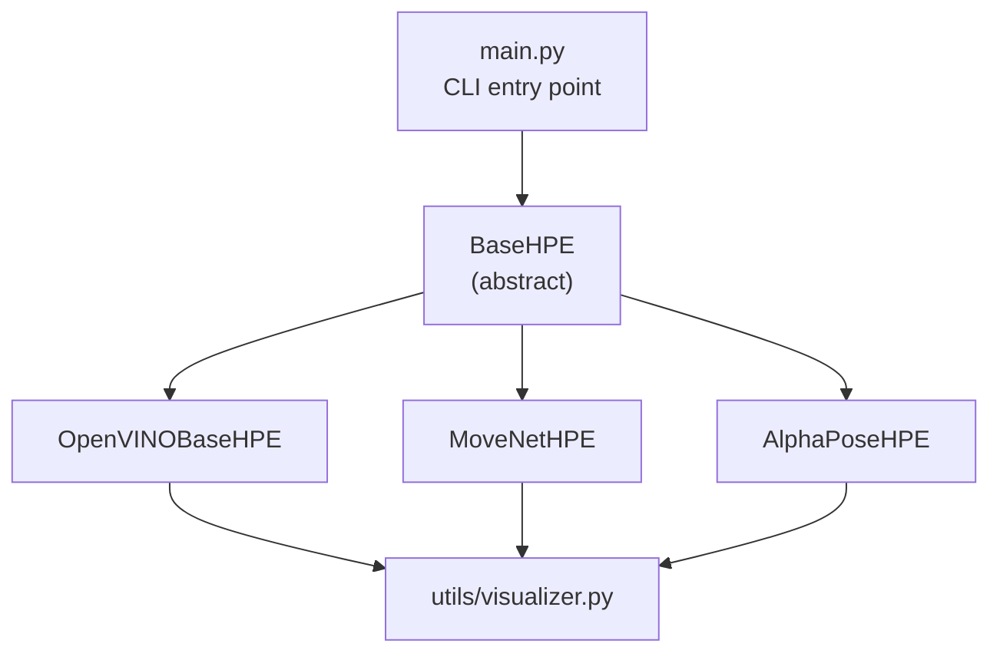

**Diagram sources**
- [main.py:22-99](file://main.py#L22-L99)
- [base_hpe.py:36-546](file://base_hpe.py#L36-L546)
- [openvino_base_hpe.py:55-653](file://openvino_base_hpe.py#L55-L653)
- [movenet_hpe.py:12-111](file://movenet_hpe.py#L12-L111)
- [alphapose_hpe.py:33-334](file://alphapose_hpe.py#L33-L334)
- [utils/visualizer.py:4-49](file://utils/visualizer.py#L4-L49)

**Section sources**
- [main.py:22-99](file://main.py#L22-L99)
- [base_hpe.py:36-546](file://base_hpe.py#L36-L546)

## Core Components
- BaseHPE (abstract): Defines the common interface and shared logic for all HPE implementations.
- OpenVINOBaseHPE: Implements OpenVINO-based HPE with configurable performance settings and async variants.
- MoveNetHPE: Implements a lightweight MoveNet model with CPU-only inference.
- AlphaPoseHPE: Implements a multi-person pose estimation pipeline with detection and pose stages.

Key shared capabilities:
- Unified input handling for images, videos, directories, and webcams.
- Video processing pipeline with PyNvCodec (GPU) and OpenCV fallback.
- Frame processing workflow: input capture → preprocessing (padding/resizing) → inference → postprocessing → visualization and output.
- Timing and performance tracking using deques for moving averages.
- Padding system to maintain aspect ratios during model input preparation.
- Consistent output generation (rendered frames, JSON, CSV, video).

**Section sources**
- [base_hpe.py:36-546](file://base_hpe.py#L36-L546)
- [openvino_base_hpe.py:55-653](file://openvino_base_hpe.py#L55-L653)
- [movenet_hpe.py:12-111](file://movenet_hpe.py#L12-L111)
- [alphapose_hpe.py:33-334](file://alphapose_hpe.py#L33-L334)

## Architecture Overview
The BaseHPE class orchestrates the end-to-end pipeline. Child classes implement abstract methods and optional specialized initialization hooks. The main loop selects the appropriate processing path based on input type and hardware availability.

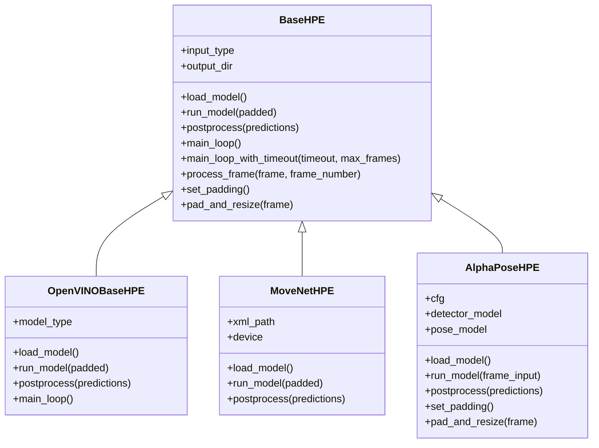

**Diagram sources**
- [base_hpe.py:36-546](file://base_hpe.py#L36-L546)
- [openvino_base_hpe.py:55-653](file://openvino_base_hpe.py#L55-L653)
- [movenet_hpe.py:12-111](file://movenet_hpe.py#L12-L111)
- [alphapose_hpe.py:33-334](file://alphapose_hpe.py#L33-L334)

## Detailed Component Analysis

### BaseHPE Abstract Class
BaseHPE defines the common interface and shared infrastructure:
- Abstract methods: load_model, run_model, postprocess.
- Initialization parameters: input_src, output_dir, enable_json, enable_csv, measurement_interval_ms, save_image, save_video, score_thresh, show_scores, show_bounding_box, pd_w, pd_h, gpu_id.
- Input type detection: directory, video (files/HTTP streams), image, webcam.
- Video pipeline: PyNvCodec (NV12 surfaces → RGB → PyTorch tensors) and OpenCV fallback.
- Frame processing workflow: preprocessing → inference → postprocessing → visualization and output.
- Timing and performance tracking: deques for moving average computation and FPS calculation.
- Padding system: maintains aspect ratio by padding to the target model input size.

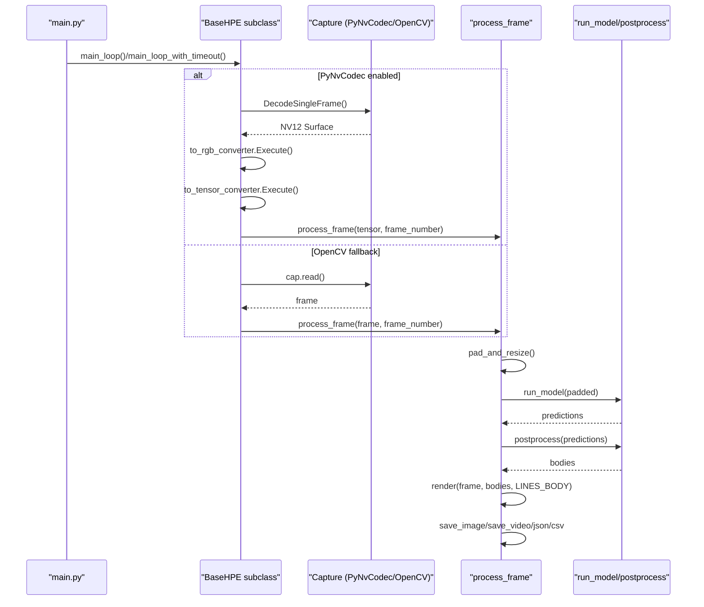

**Diagram sources**
- [base_hpe.py:207-282](file://base_hpe.py#L207-L282)
- [base_hpe.py:283-404](file://base_hpe.py#L283-L404)
- [base_hpe.py:405-519](file://base_hpe.py#L405-L519)

**Section sources**
- [base_hpe.py:36-546](file://base_hpe.py#L36-L546)

### Initialization Parameters and Input Type Handling
- input_src: Supports directories, video files (.mp4/.avi/.mov), HTTP streams, images (.jpg/.png), and webcam indices.
- Output configuration: Creates output_dir and ensures it exists when JSON/CSV/image/video saving is enabled.
- Input type detection logic: Determines whether the input is a directory, video, image, or webcam and sets internal state accordingly.
- Dimension handling: Sets img_w/img_h and defaults for HTTP streams when PyNvCodec is unavailable.

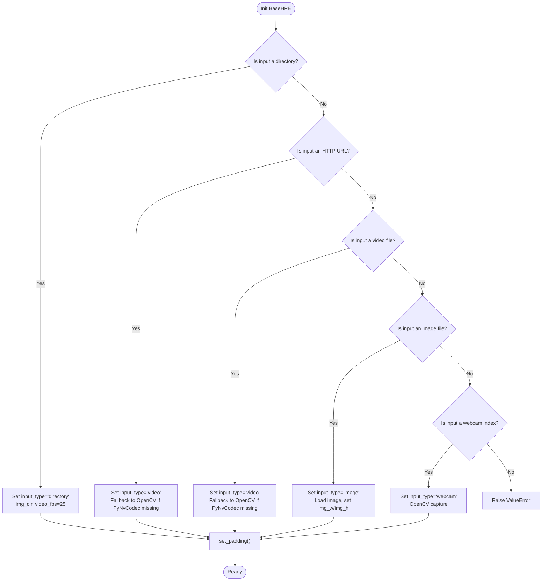

**Diagram sources**
- [base_hpe.py:90-157](file://base_hpe.py#L90-L157)

**Section sources**
- [base_hpe.py:90-157](file://base_hpe.py#L90-L157)

### Video Processing Pipeline: PyNvCodec vs OpenCV
- PyNvCodec path: Uses NV12 surfaces decoded on GPU, converts to RGB, then to PyTorch tensors on GPU, minimizing CPU/GPU transfers.
- OpenCV fallback: Uses cv2.VideoCapture for video files and HTTP streams, with FFmpeg backend for HTTP streams to reduce latency.
- Streaming URL handling: Specialized logic for HTTP streams, including dimension defaults and delayed initialization.

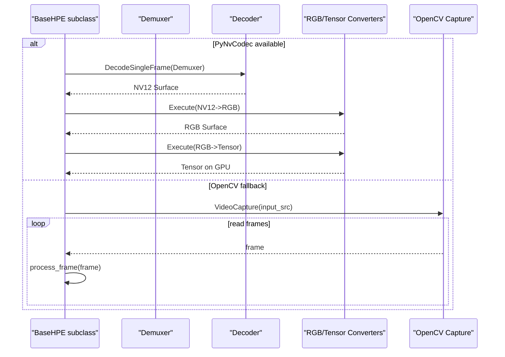

**Diagram sources**
- [base_hpe.py:241-276](file://base_hpe.py#L241-L276)
- [base_hpe.py:354-395](file://base_hpe.py#L354-L395)
- [openvino_base_hpe.py:94-151](file://openvino_base_hpe.py#L94-L151)

**Section sources**
- [base_hpe.py:241-276](file://base_hpe.py#L241-L276)
- [base_hpe.py:354-395](file://base_hpe.py#L354-L395)
- [openvino_base_hpe.py:94-151](file://openvino_base_hpe.py#L94-L151)

### Frame Processing Workflow
- process_frame orchestrates the end-to-end pipeline:
  - Converts GPU tensors to CPU NumPy arrays for OpenCV operations.
  - Applies padding and resizing to match model input.
  - Calls run_model for inference.
  - Handles diverse prediction formats (PAFs/heatmaps, direct poses).
  - Computes timing metrics and FPS using deques for moving averages.
  - Renders skeletons and bounding boxes, and saves outputs.

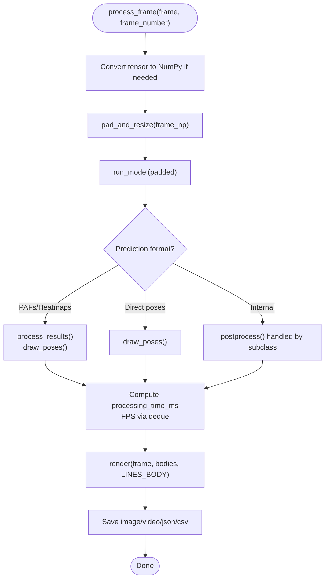

**Diagram sources**
- [base_hpe.py:405-519](file://base_hpe.py#L405-L519)

**Section sources**
- [base_hpe.py:405-519](file://base_hpe.py#L405-L519)

### Timing and Performance Tracking
- Deque-based moving average: Tracks processing times for the last N frames (default 200).
- FPS calculation: Mean processing time yields instantaneous FPS.
- Console and frame overlay: Prints inference time and FPS; draws FPS on the frame.
- Enhanced main loop: Adds timeout and max frames checks for HTTP streams and video files.

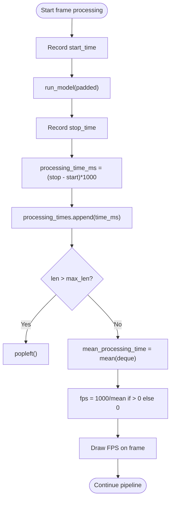

**Diagram sources**
- [base_hpe.py:451-467](file://base_hpe.py#L451-L467)
- [base_hpe.py:283-404](file://base_hpe.py#L283-L404)

**Section sources**
- [base_hpe.py:451-467](file://base_hpe.py#L451-L467)
- [base_hpe.py:283-404](file://base_hpe.py#L283-L404)

### Padding System for Aspect Ratio Maintenance
- Padding namedtuple stores original padding and padded dimensions.
- set_padding computes padding to match model input aspect ratio, adding extra pixels to bottom or right.
- pad_and_resize applies constant border padding and resizes to model input size.
- AlphaPoseHPE overrides padding and resizing to preserve original resolution.

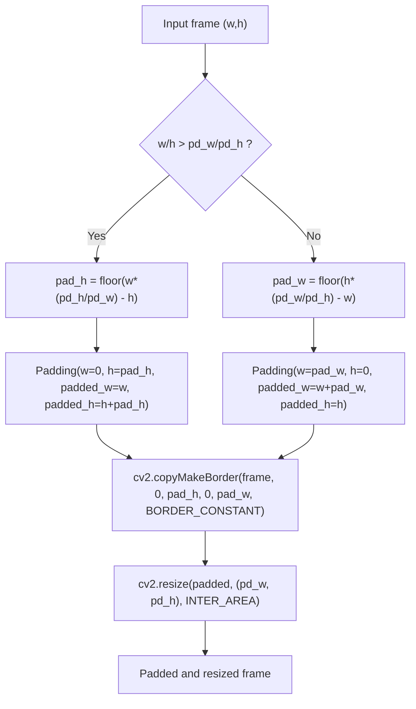

**Diagram sources**
- [base_hpe.py:528-545](file://base_hpe.py#L528-L545)
- [alphapose_hpe.py:326-334](file://alphapose_hpe.py#L326-L334)

**Section sources**
- [base_hpe.py:528-545](file://base_hpe.py#L528-L545)
- [alphapose_hpe.py:326-334](file://alphapose_hpe.py#L326-L334)

### Unified Interface Design and Polymorphism
- Abstract methods enforce consistent behavior across implementations:
  - load_model: initializes model(s) and adapters.
  - run_model: performs inference on preprocessed input.
  - postprocess: converts raw outputs to standardized Body objects.
- Child classes customize behavior while adhering to the same interface:
  - OpenVINOBaseHPE: OpenVINO adapters, configurable performance modes, async variant.
  - MoveNetHPE: CPU-only inference with minimal preprocessing.
  - AlphaPoseHPE: Multi-stage pipeline with detection and pose estimation.

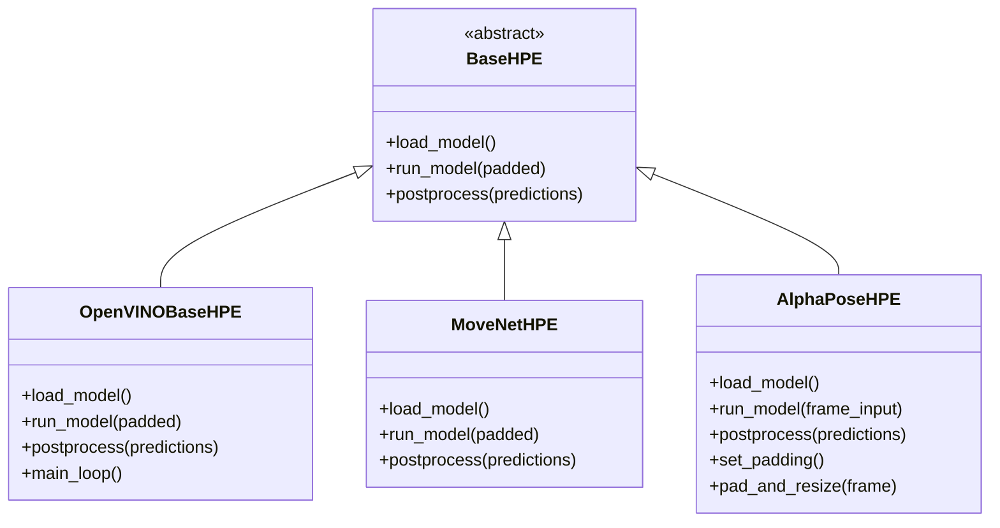

**Diagram sources**
- [base_hpe.py:177-276](file://base_hpe.py#L177-L276)
- [openvino_base_hpe.py:183-276](file://openvino_base_hpe.py#L183-L276)
- [movenet_hpe.py:58-111](file://movenet_hpe.py#L58-L111)
- [alphapose_hpe.py:69-334](file://alphapose_hpe.py#L69-L334)

**Section sources**
- [base_hpe.py:177-276](file://base_hpe.py#L177-L276)
- [openvino_base_hpe.py:183-276](file://openvino_base_hpe.py#L183-L276)
- [movenet_hpe.py:58-111](file://movenet_hpe.py#L58-L111)
- [alphapose_hpe.py:69-334](file://alphapose_hpe.py#L69-L334)

### Implementation-Specific Details

#### OpenVINOBaseHPE
- Model configurations: multiple architectures with input sizes and GPU support flags.
- Performance tuning: OpenVINO core properties for threads, streams, CPU pinning, and hyper-threading.
- Async variant: separate queues and thread pools for frame capture, processing, and display.
- Streaming URL handling: delayed capture initialization and dimension updates.

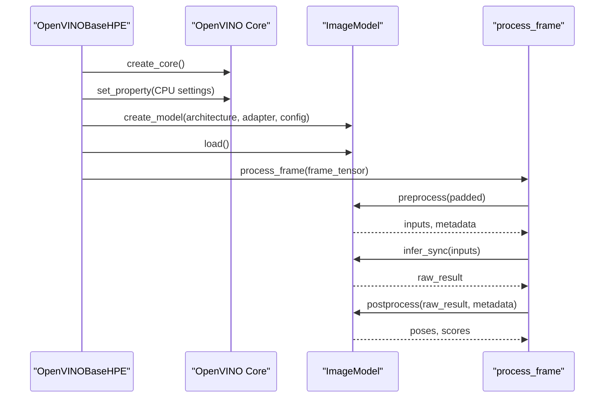

**Diagram sources**
- [openvino_base_hpe.py:183-276](file://openvino_base_hpe.py#L183-L276)
- [openvino_base_hpe.py:316-395](file://openvino_base_hpe.py#L316-L395)

**Section sources**
- [openvino_base_hpe.py:183-276](file://openvino_base_hpe.py#L183-L276)
- [openvino_base_hpe.py:316-395](file://openvino_base_hpe.py#L316-L395)

#### MoveNetHPE
- CPU-only inference with OpenVINO runtime.
- Minimal preprocessing: converts BGR to RGB, transposes, and normalizes.
- Postprocessing: extracts keypoints and bounding boxes from model outputs.

**Section sources**
- [movenet_hpe.py:58-111](file://movenet_hpe.py#L58-L111)

#### AlphaPoseHPE
- Multi-stage pipeline: detection loader for images/directories, detector for video/webcam, pose model for estimation.
- GPU-accelerated cropping and resizing for pose inputs.
- Overrides padding and resizing to preserve original resolution.

**Section sources**
- [alphapose_hpe.py:69-334](file://alphapose_hpe.py#L69-L334)

## Dependency Analysis
- BaseHPE depends on OpenCV for video capture and visualization, and optionally PyNvCodec for hardware-accelerated decoding.
- Child classes depend on their respective model frameworks (OpenVINO, PyTorch, AlphaPose).
- Visualization and evaluation utilities are shared across implementations.

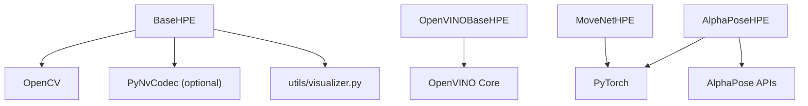

**Diagram sources**
- [base_hpe.py:10-17](file://base_hpe.py#L10-L17)
- [openvino_base_hpe.py:15-20](file://openvino_base_hpe.py#L15-L20)
- [movenet_hpe.py:3-7](file://movenet_hpe.py#L3-L7)
- [alphapose_hpe.py:12-22](file://alphapose_hpe.py#L12-L22)
- [utils/visualizer.py:4-49](file://utils/visualizer.py#L4-L49)

**Section sources**
- [base_hpe.py:10-17](file://base_hpe.py#L10-L17)
- [openvino_base_hpe.py:15-20](file://openvino_base_hpe.py#L15-L20)
- [movenet_hpe.py:3-7](file://movenet_hpe.py#L3-L7)
- [alphapose_hpe.py:12-22](file://alphapose_hpe.py#L12-L22)
- [utils/visualizer.py:4-49](file://utils/visualizer.py#L4-L49)

## Performance Considerations
- Prefer PyNvCodec for video decoding to minimize CPU overhead and leverage GPU.
- Use OpenCV with FFmpeg backend for HTTP streams to reduce latency.
- Tune OpenVINO settings (threads, streams, CPU pinning, hyper-threading) for optimal throughput or latency.
- Limit frame buffer sizes in async pipelines to prevent latency buildup.
- Monitor FPS using deque-based moving averages and adjust model/device settings accordingly.

## Troubleshooting Guide
- PyNvCodec not found: The code gracefully falls back to OpenCV; ensure hardware acceleration is not required or install PyNvCodec.
- HTTP stream issues: Use FFmpeg backend for OpenCV capture; verify stream accessibility and set default dimensions if needed.
- Timeout and max frames: Use main_loop_with_timeout for HTTP streams and long-running video processing.
- Webcam capture errors: Verify device index and permissions; ensure OpenCV backend supports the device.
- Output validation: Image inputs cannot produce video outputs; ensure save_video is disabled for images.

**Section sources**
- [base_hpe.py:97-117](file://base_hpe.py#L97-L117)
- [base_hpe.py:181-205](file://base_hpe.py#L181-L205)
- [base_hpe.py:283-404](file://base_hpe.py#L283-L404)
- [openvino_base_hpe.py:104-151](file://openvino_base_hpe.py#L104-L151)

## Conclusion
The BaseHPE abstract class establishes a robust, extensible foundation for HPE implementations. By enforcing a consistent interface and shared infrastructure—input handling, video pipelines, frame processing, timing, padding, and output generation—it enables seamless switching between different algorithms while preserving a unified developer and user experience. Child classes extend this foundation to integrate diverse model frameworks and performance characteristics, ensuring flexibility and scalability across varied deployment scenarios.