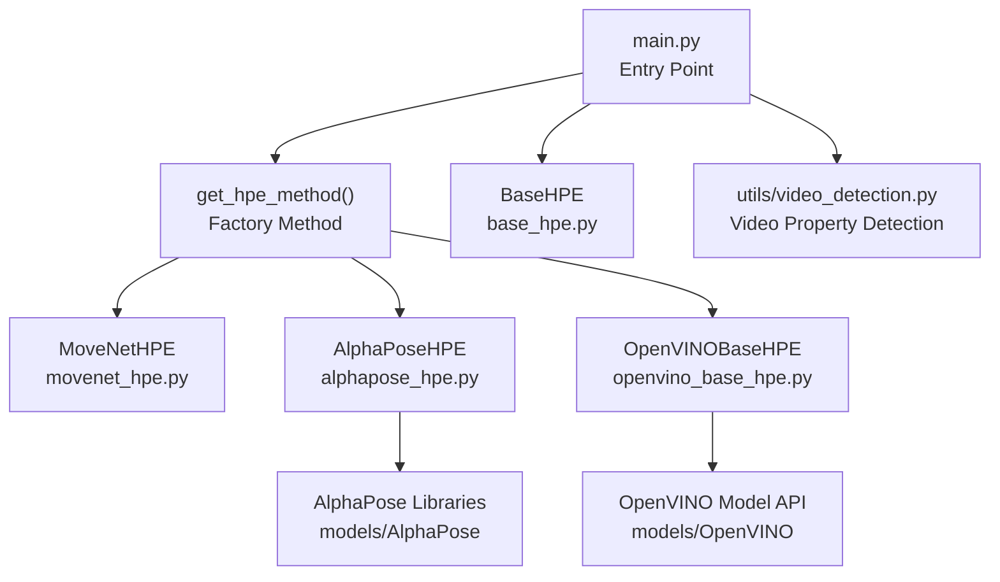
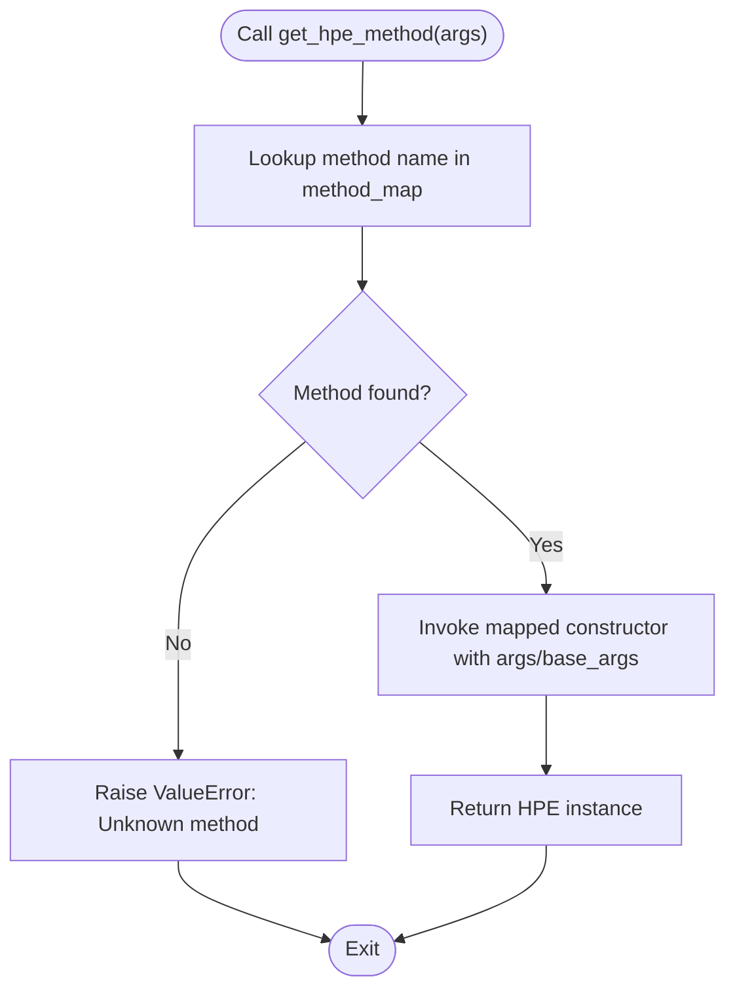
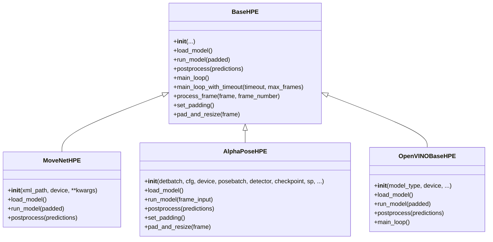
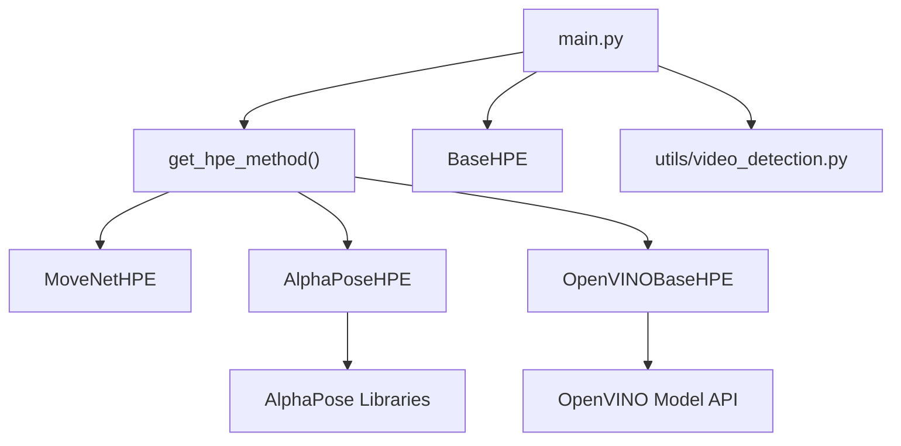

# Backend Factory Pattern

<cite>
**Referenced Files in This Document**
- [main.py](file://main.py)
- [base_hpe.py](file://base_hpe.py)
- [openvino_base_hpe.py](file://openvino_base_hpe.py)
- [alphapose_hpe.py](file://alphapose_hpe.py)
- [movenet_hpe.py](file://movenet_hpe.py)
- [video_detection.py](file://utils/video_detection.py)
</cite>

## Table of Contents
1. [Introduction](#introduction)
2. [Project Structure](#project-structure)
3. [Core Components](#core-components)
4. [Architecture Overview](#architecture-overview)
5. [Detailed Component Analysis](#detailed-component-analysis)
6. [Dependency Analysis](#dependency-analysis)
7. [Performance Considerations](#performance-considerations)
8. [Troubleshooting Guide](#troubleshooting-guide)
9. [Conclusion](#conclusion)

## Introduction
This document explains the backend factory pattern implementation that dynamically selects and instantiates Human Pose Estimation (HPE) backends at runtime. The factory logic in the main entry point maps user-specified method names to concrete backend classes, ensuring a consistent interface across different implementations. It also documents how to register new backends, pass parameters from the factory to backend constructors, enforce consistent interfaces, and handle errors for unsupported backend types. Finally, it covers selection criteria based on model type, hardware capabilities, and performance requirements, along with extensibility benefits for a pluggable architecture.

## Project Structure
The HPE system is organized around a shared base class and multiple backend implementations. The main entry point orchestrates argument parsing, factory selection, and execution loops. Utility modules provide cross-cutting concerns like video property detection and structured logging.



**Diagram sources**
- [main.py:207-227](file://main.py#L207-L227)
- [movenet_hpe.py:12-31](file://movenet_hpe.py#L12-L31)
- [alphapose_hpe.py:33-66](file://alphapose_hpe.py#L33-L66)
- [openvino_base_hpe.py:56-94](file://openvino_base_hpe.py#L56-L94)
- [base_hpe.py:98-197](file://base_hpe.py#L98-L197)
- [video_detection.py](file://utils/video_detection.py)

**Section sources**
- [main.py:207-227](file://main.py#L207-L227)
- [base_hpe.py:98-197](file://base_hpe.py#L98-L197)

## Core Components
- Factory method: Centralized mapping of method names to backend constructors.
- Base class: Defines the common interface and shared behavior for all backends.
- Backends: Specialized implementations for MoveNet, AlphaPose, and OpenVINO variants.
- Parameter forwarding: A helper function supplies common parameters to backends.

Key responsibilities:
- Factory validates method names and raises explicit errors for unknown methods.
- Backends inherit from the base class and implement required abstract methods.
- Shared parameters (input source, output directory, export flags, etc.) are forwarded consistently.

**Section sources**
- [main.py:207-237](file://main.py#L207-L237)
- [base_hpe.py:198-200](file://base_hpe.py#L198-L200)
- [base_hpe.py:654-660](file://base_hpe.py#L654-L660)

## Architecture Overview
The factory pattern decouples client code from backend instantiation. The main entry point parses arguments, delegates selection to the factory, and runs a unified processing loop. Backends share a common interface defined by the base class, enabling consistent behavior regardless of the underlying implementation.

```mermaid
sequenceDiagram
    participant CLI as "CLI"
    participant Main as "main()"
    participant Factory as "get_hpe_method()"
    participant Backend as "Concrete Backend"
    participant Loop as "BaseHPE.main_loop_with_timeout"
    
    CLI->>Main: "--method X --input Y ..."
    Main->>Factory: "args"
    Factory->>Factory: "validate method name"
    Factory->>Backend: "construct with mapped params"
    Backend-->>Factory: "instance"
    Factory-->>Main: "HPE instance"
    Main->>Loop: "start processing"
    Loop->>Backend: "load_model()"
    Loop->>Backend: "process_frame(...)"
    Backend-->>Loop: "results"
    Loop-->>Main: "completion"
```

**Diagram sources**
- [main.py:51-188](file://main.py#L51-L188)
- [main.py:207-227](file://main.py#L207-L227)
- [base_hpe.py:250-330](file://base_hpe.py#L250-L330)

## Detailed Component Analysis

### Factory Method Logic
The factory method maintains a mapping from method names to lambda constructors. Each lambda receives the parsed arguments and forwards them to the appropriate backend constructor. A helper function aggregates common parameters and passes them as keyword arguments. Unknown method names trigger a clear error.

Selection highlights:
- MoveNet: Uses device and base parameters.
- AlphaPose: Adds detbatch and base parameters.
- OpenVINO variants: Adds model_type and device; variant-specific logic is encapsulated in the backend.



**Diagram sources**
- [main.py:207-227](file://main.py#L207-L227)
- [main.py:228-237](file://main.py#L228-L237)

**Section sources**
- [main.py:207-227](file://main.py#L207-L227)
- [main.py:228-237](file://main.py#L228-L237)

### Backend Registration Mechanism
Registration is centralized in the factory mapping. To add a new backend:
1. Create a new backend class inheriting from the base class.
2. Implement required abstract methods (model loading, inference, and postprocessing).
3. Add an entry in the factory mapping that constructs the backend with desired parameters.
4. Optionally add a new choice to the argument parser if exposing a new method name.

Benefits:
- No client code changes required when adding backends.
- Consistent parameter forwarding and interface enforcement.
- Clear separation between selection logic and backend implementations.

**Section sources**
- [main.py:207-216](file://main.py#L207-L216)
- [base_hpe.py:198-200](file://base_hpe.py#L198-L200)
- [base_hpe.py:654-660](file://base_hpe.py#L654-L660)

### Consistent Interfaces Across Implementations
All backends inherit from the base class and implement:
- Model loading: Backend-specific model initialization and configuration.
- Inference: Preprocess input, run model, and return predictions.
- Postprocessing: Convert predictions to standardized body/keypoint structures.

Shared behavior includes:
- Input handling for images, directories, videos, and streams.
- Optional hardware acceleration paths (e.g., PyNvCodec).
- Unified processing loop with timeout and frame limits.
- Export capabilities for JSON/COCO and CSV metrics.



**Diagram sources**
- [base_hpe.py:98-197](file://base_hpe.py#L98-L197)
- [movenet_hpe.py:12-31](file://movenet_hpe.py#L12-L31)
- [alphapose_hpe.py:33-66](file://alphapose_hpe.py#L33-L66)
- [openvino_base_hpe.py:56-94](file://openvino_base_hpe.py#L56-L94)

**Section sources**
- [base_hpe.py:98-197](file://base_hpe.py#L98-L197)
- [movenet_hpe.py:58-111](file://movenet_hpe.py#L58-L111)
- [alphapose_hpe.py:69-341](file://alphapose_hpe.py#L69-L341)
- [openvino_base_hpe.py:191-330](file://openvino_base_hpe.py#L191-L330)

### Backend Selection Criteria
Selection is driven by user input and backend capabilities:
- Model type: Determines architecture and input requirements.
- Hardware: Some backends restrict GPU usage; others fall back to CPU.
- Performance: Backends expose tunable parameters (threads, streams, mode) to balance latency vs throughput.

Examples:
- MoveNet: Explicitly falls back to CPU if GPU is requested.
- OpenVINO variants: Enforce GPU support per model; otherwise switch to CPU.
- AlphaPose: Supports GPU/CPU based on device mapping.

**Section sources**
- [movenet_hpe.py:28-31](file://movenet_hpe.py#L28-L31)
- [openvino_base_hpe.py:88-91](file://openvino_base_hpe.py#L88-L91)
- [alphapose_hpe.py:28-31](file://alphapose_hpe.py#L28-L31)

### Parameter Passing Between Factory and Backend Constructors
The factory forwards a consolidated dictionary of common parameters to all backends. This ensures consistent configuration across implementations without duplicating argument parsing logic.

Common parameters include:
- Input source path
- Output directory
- Export flags (JSON, CSV)
- Measurement interval
- Save image/video toggles

Backends may add their own specialized parameters (e.g., detbatch for AlphaPose, model_type for OpenVINO).

**Section sources**
- [main.py:228-237](file://main.py#L228-L237)
- [main.py:209-215](file://main.py#L209-L215)
- [alphapose_hpe.py:41-52](file://alphapose_hpe.py#L41-L52)
- [openvino_base_hpe.py:65-94](file://openvino_base_hpe.py#L65-L94)

### Error Handling for Unsupported Backend Types
The factory validates the method name against the mapping and raises a clear error for unknown values. This prevents silent failures and guides users toward supported options.

**Section sources**
- [main.py:218-222](file://main.py#L218-L222)

### Extensibility Benefits and Pluggable Architecture
The factory pattern enables:
- Adding new backends without modifying client code.
- Centralized parameter management and validation.
- Uniform processing loops and output formats.
- Easy experimentation with different models and configurations.

Best practices for extension:
- Keep backend constructors minimal and focused.
- Encapsulate model-specific logic within the backend.
- Use environment variables for performance tuning (as seen in OpenVINO).
- Document supported devices and constraints.

**Section sources**
- [main.py:207-216](file://main.py#L207-L216)
- [openvino_base_hpe.py:154-190](file://openvino_base_hpe.py#L154-L190)

## Dependency Analysis
The system exhibits clean layering:
- Entry point depends on backends and utilities.
- Backends depend on the base class and external libraries.
- Utilities provide cross-cutting concerns.



**Diagram sources**
- [main.py:207-227](file://main.py#L207-L227)
- [openvino_base_hpe.py:16-18](file://openvino_base_hpe.py#L16-L18)
- [alphapose_hpe.py:13-22](file://alphapose_hpe.py#L13-L22)

**Section sources**
- [main.py:207-227](file://main.py#L207-L227)
- [openvino_base_hpe.py:16-18](file://openvino_base_hpe.py#L16-L18)
- [alphapose_hpe.py:13-22](file://alphapose_hpe.py#L13-L22)

## Performance Considerations
- Device selection: Backends validate device compatibility and adjust accordingly.
- Tuning knobs: OpenVINO exposes threads, streams, and performance mode via environment variables.
- Streaming optimization: Backends leverage FFmpeg for low-latency HTTP/RTSP streams.
- Batch sizes: Some backends expose batch parameters to balance throughput and memory usage.

[No sources needed since this section provides general guidance]

## Troubleshooting Guide
Common issues and resolutions:
- Unknown method: Verify the method name matches supported choices and is present in the factory mapping.
- Unsupported device: Some backends restrict GPU usage; ensure device selection aligns with backend capabilities.
- Stream initialization failures: Confirm FFmpeg backend support and buffer settings for HTTP/RTSP.
- Missing libraries: Import errors indicate missing dependencies for specific backends (e.g., AlphaPose).

**Section sources**
- [main.py:218-222](file://main.py#L218-L222)
- [movenet_hpe.py:28-31](file://movenet_hpe.py#L28-L31)
- [openvino_base_hpe.py:154-190](file://openvino_base_hpe.py#L154-L190)
- [alphapose_hpe.py:20-22](file://alphapose_hpe.py#L20-L22)

## Conclusion
The factory pattern in this codebase provides a robust, extensible foundation for selecting and instantiating HPE backends. By centralizing selection logic, enforcing a consistent interface, and supporting flexible parameter forwarding, the system enables easy addition of new backends and reliable operation across diverse hardware and performance requirements.