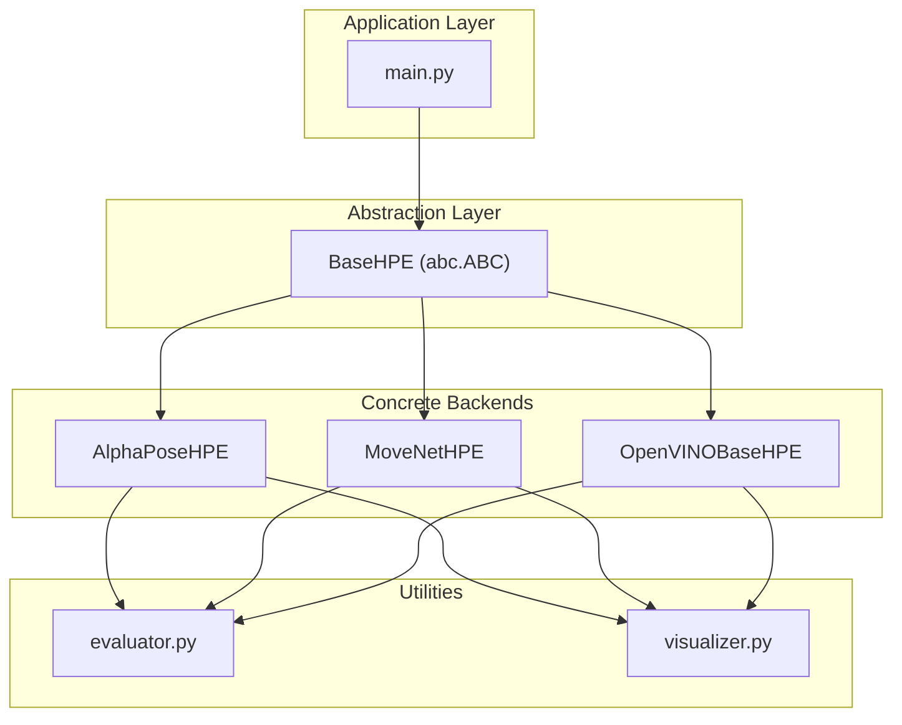
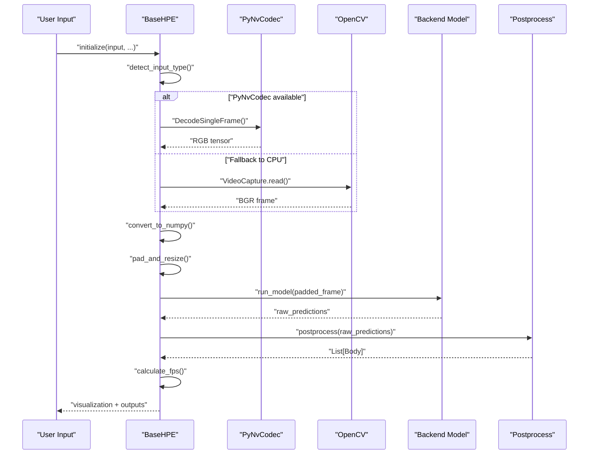
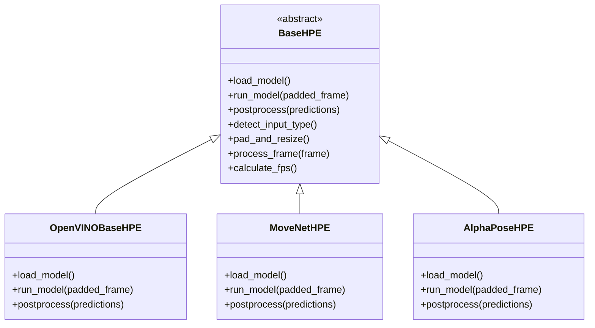
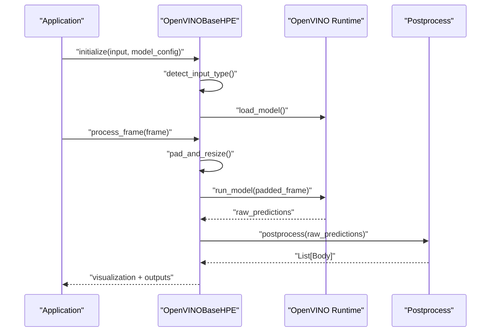
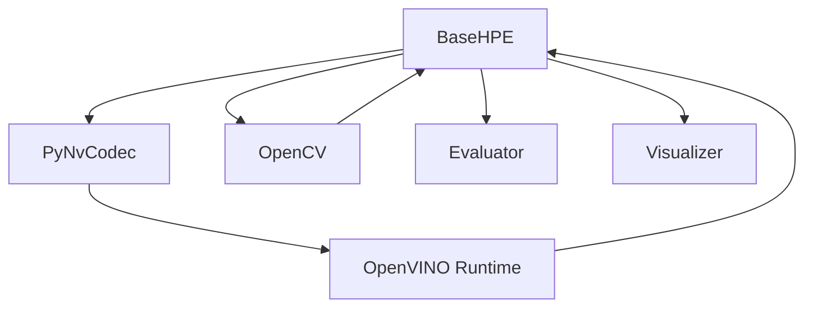

# BaseHPE Abstraction Layer

<cite>
**Referenced Files in This Document**
- [base_hpe.py](file://base_hpe.py)
- [openvino_base_hpe.py](file://openvino_base_hpe.py)
- [movenet_hpe.py](file://movenet_hpe.py)
- [alphapose_hpe.py](file://alphapose_hpe.py)
- [hpe-methods.md](file://docs/hpe-methods.md)
- [ONBOARDING.md](file://ONBOARDING.md)
- [project-architecture-diagram.md](file://docs/project-architecture-diagram.md)
</cite>

## Table of Contents
1. [Introduction](#introduction)
2. [Project Structure](#project-structure)
3. [Core Components](#core-components)
4. [Architecture Overview](#architecture-overview)
5. [Detailed Component Analysis](#detailed-component-analysis)
6. [Dependency Analysis](#dependency-analysis)
7. [Performance Considerations](#performance-considerations)
8. [Troubleshooting Guide](#troubleshooting-guide)
9. [Conclusion](#conclusion)

## Introduction
This document provides comprehensive technical documentation for the BaseHPE abstract class that serves as the foundational abstraction layer for all Human Pose Estimation (HPE) backend implementations in the project. BaseHPE defines a unified interface and shared infrastructure for video/image input handling, GPU-accelerated decoding via PyNvCodec, CPU fallback through OpenCV, frame preprocessing (padding and resizing), model inference orchestration, and standardized output generation compatible with COCO-style pose detection.

The design follows the Abstract Base Class (ABC) pattern, ensuring that all concrete HPE backends implement three essential methods: load_model(), run_model(), and postprocess(). This guarantees a consistent developer experience and runtime behavior across diverse backends such as AlphaPose, MoveNet, and various OpenVINO-based implementations.

## Project Structure
The BaseHPE abstraction integrates with the broader HPE ecosystem through a clear separation of concerns:
- BaseHPE orchestrates input routing, decoding, preprocessing, timing, and output persistence.
- Concrete backends implement model-specific loading, inference, and postprocessing logic.
- Utilities handle visualization, evaluation, and benchmarking.

**Diagram sources**
- [project-architecture-diagram.md:95-106](file://docs/project-architecture-diagram.md#L95-L106)
- [base_hpe.py](file://base_hpe.py)

**Section sources**
- [project-architecture-diagram.md:95-106](file://docs/project-architecture-diagram.md#L95-L106)

## Core Components
BaseHPE establishes a robust foundation with the following core responsibilities and attributes:

- Input Type Handling
  - Supports four input modes: image, directory, video, and webcam.
  - Automatic detection logic routes inputs based on URL patterns, file extensions, numeric identifiers, and directory presence.
  - Provides a unified processing loop across all input types.

- Video Capture Abstraction
  - GPU-accelerated path using PyNvCodec for NV12 surfaces, RGB conversion, and tensor preparation.
  - CPU fallback path using OpenCV VideoCapture for broad compatibility.
  - Seamless switching between GPU and CPU paths depending on availability and input characteristics.

- Frame Processing Pipeline
  - Converts tensors to NumPy arrays when necessary.
  - Applies consistent padding and resizing to match model input dimensions.
  - Executes timed model inference and postprocessing to produce Body objects.
  - Computes FPS over a sliding window of recent timings.
  - Optionally saves visualizations and structured outputs (CSV/JSON).

- Standardized Output Format
  - Produces COCO-compatible pose detections with standardized body object structures.
  - Enables downstream evaluation and visualization workflows.

- Abstract Method Contracts
  - load_model(): Initialize and prepare the backend model (weights, compilation, device placement).
  - run_model(padded_frame): Perform single-frame inference and return raw predictions.
  - postprocess(predictions): Transform raw predictions into a list of Body objects.

**Section sources**
- [hpe-methods.md:30-78](file://docs/hpe-methods.md#L30-L78)
- [base_hpe.py](file://base_hpe.py)

## Architecture Overview
The BaseHPE architecture enforces a strict separation between input handling and model-specific logic. The main control flow is:

**Diagram sources**
- [hpe-methods.md:48-67](file://docs/hpe-methods.md#L48-L67)
- [base_hpe.py](file://base_hpe.py)

## Detailed Component Analysis

### BaseHPE Abstract Class Design Pattern
BaseHPE leverages Python's abc.ABC to define an immutable contract that concrete backends must fulfill. This ensures:
- Consistent initialization parameters and runtime behavior.
- Uniform input handling and output formatting.
- Predictable performance measurement and visualization hooks.

Key design benefits:
- Enforces implementation of load_model(), run_model(), and postprocess().
- Centralizes video decoding logic and fallback mechanisms.
- Provides reusable preprocessing and postprocessing scaffolding.

**Section sources**
- [hpe-methods.md:30-38](file://docs/hpe-methods.md#L30-L38)
- [base_hpe.py](file://base_hpe.py)

### Input Type Detection and Routing
BaseHPE automatically detects input types using the following precedence:
1. Stream URL: If the input starts with "http", treat as a video stream and attempt GPU decoding via PyNvCodec, falling back to OpenCV if unavailable.
2. Video file: If the input ends with common video extensions, treat as a video file.
3. Image file: If the input ends with common image extensions, treat as a single image.
4. Webcam index: If the input is numeric, treat as a webcam index.
5. Directory: Otherwise, treat as a directory of images.

This logic ensures seamless operation across diverse deployment scenarios while maintaining a consistent processing pipeline.

**Section sources**
- [hpe-methods.md:41-46](file://docs/hpe-methods.md#L41-L46)
- [base_hpe.py](file://base_hpe.py)

### Video Capture Abstraction: PyNvCodec vs OpenCV
- PyNvCodec (GPU path):
  - Decodes frames to NV12 surfaces for GPU memory efficiency.
  - Performs RGB conversion and tensor preparation on the GPU.
  - Integrates with backend-specific inference paths requiring GPU tensors.

- OpenCV fallback (CPU path):
  - Uses VideoCapture to read frames as NumPy arrays in BGR format.
  - Suitable for environments without GPU decode support or when GPU decoding fails.

Both paths converge into a unified preprocessing stage and model inference routine, ensuring identical output semantics regardless of the underlying capture mechanism.

**Section sources**
- [hpe-methods.md:48-58](file://docs/hpe-methods.md#L48-L58)
- [base_hpe.py](file://base_hpe.py)

### Padding and Resizing Logic
To maintain model input consistency:
- Computes padding based on the aspect ratio comparison between the input frame and the model’s expected input dimensions.
- Adds padding to the right and bottom only, simplifying subsequent depadding and reducing computational overhead.
- Caches padding metadata to avoid recomputation across frames.

This approach ensures that resized frames preserve spatial relationships while fitting the model’s fixed input grid.

**Section sources**
- [hpe-methods.md:69-73](file://docs/hpe-methods.md#L69-L73)
- [base_hpe.py](file://base_hpe.py)

### Frame Processing Pipeline
The pipeline coordinates all stages from input capture to output generation:
1. Convert tensors to NumPy arrays when necessary.
2. Apply padding and resizing to match model input dimensions.
3. Execute timed model inference via run_model().
4. Transform raw predictions into Body objects using postprocess().
5. Compute instantaneous and moving average FPS using stored timing samples.
6. Render FPS overlays and optional visualizations.
7. Persist outputs to CSV/JSON if configured.
8. Draw keypoints and skeletons when saving images or videos.

This pipeline is repeated for each frame, providing a smooth and consistent processing experience across all backends.

**Section sources**
- [hpe-methods.md:59-67](file://docs/hpe-methods.md#L59-L67)
- [base_hpe.py](file://base_hpe.py)

### Standardized Output Format (COCO-Compatible)
Outputs are produced in a standardized format suitable for COCO-compatible pose detection:
- Each Body object encapsulates detected persons with keypoints and scores.
- Coordinates are normalized or scaled appropriately for downstream evaluation and visualization.
- Structured outputs enable integration with external tools and benchmark suites.

**Section sources**
- [hpe-methods.md:74-78](file://docs/hpe-methods.md#L74-L78)
- [base_hpe.py](file://base_hpe.py)

### Concrete Backend Implementations
Several concrete backends inherit from BaseHPE and implement the required abstract methods:

- OpenVINO-based Backends (OpenVINOBaseHPE)
  - Implements load_model() to initialize OpenVINO adapters and pipelines.
  - Implements run_model() to execute inference on padded frames using OpenVINO runtime.
  - Implements postprocess() to convert heatmaps/embeddings into Body objects.

- MoveNet Backend (MoveNetHPE)
  - Implements load_model() tailored for MoveNet models.
  - Implements run_model() and postprocess() optimized for single-stage bottom-up pose estimation.

- AlphaPose Backend (AlphaPoseHPE)
  - Implements load_model() for two-stage top-down processing (detector + pose estimator).
  - Implements run_model() and postprocess() to handle person ROI extraction and keypoint localization.

These implementations demonstrate how BaseHPE’s abstraction enables diverse model architectures while preserving a uniform interface and processing pipeline.

**Section sources**
- [openvino_base_hpe.py:1-20](file://openvino_base_hpe.py#L1-L20)
- [movenet_hpe.py](file://movenet_hpe.py)
- [alphapose_hpe.py](file://alphapose_hpe.py)
- [hpe-methods.md:10-28](file://docs/hpe-methods.md#L10-L28)

### Class Relationships and Inheritance

**Diagram sources**
- [hpe-methods.md:10-28](file://docs/hpe-methods.md#L10-L28)
- [base_hpe.py](file://base_hpe.py)
- [openvino_base_hpe.py:1-20](file://openvino_base_hpe.py#L1-L20)
- [movenet_hpe.py](file://movenet_hpe.py)
- [alphapose_hpe.py](file://alphapose_hpe.py)

### Example Implementation Flow: OpenVINOBaseHPE

**Diagram sources**
- [openvino_base_hpe.py:1-20](file://openvino_base_hpe.py#L1-L20)
- [hpe-methods.md:74-78](file://docs/hpe-methods.md#L74-L78)

## Dependency Analysis
BaseHPE interacts with several subsystems and external libraries:
- Input handling depends on PyNvCodec for GPU decoding and OpenCV for CPU fallback.
- Model backends rely on framework-specific adapters (e.g., OpenVINO) and runtime environments.
- Output generation integrates with evaluation utilities and visualization tools.

**Diagram sources**
- [hpe-methods.md:48-58](file://docs/hpe-methods.md#L48-L58)
- [base_hpe.py](file://base_hpe.py)

**Section sources**
- [hpe-methods.md:48-58](file://docs/hpe-methods.md#L48-L58)
- [base_hpe.py](file://base_hpe.py)

## Performance Considerations
- GPU decoding via PyNvCodec reduces CPU load and accelerates frame processing for supported hardware.
- Sliding window FPS calculation enables real-time performance monitoring.
- Padding and resizing are computed once per frame and cached to minimize overhead.
- Backends can optimize inference by batching or leveraging model-specific acceleration paths.

[No sources needed since this section provides general guidance]

## Troubleshooting Guide
Common issues and resolutions:
- GPU decode failures: Verify PyNvCodec availability and driver support; BaseHPE automatically falls back to OpenCV.
- Inconsistent frame sizes: Ensure padding logic aligns with model input dimensions; recompute padding if resolution changes.
- Slow inference: Profile run_model() and consider backend-specific optimizations (e.g., OpenVINO tuning).
- Output format mismatches: Confirm postprocess() produces COCO-compatible Body objects for downstream tools.

**Section sources**
- [hpe-methods.md:48-67](file://docs/hpe-methods.md#L48-L67)
- [base_hpe.py](file://base_hpe.py)

## Conclusion
BaseHPE provides a robust, extensible abstraction layer that unifies diverse HPE backends behind a consistent interface. By enforcing abstract method contracts, centralizing input handling and preprocessing, and standardizing output formats, it enables rapid development and deployment of new pose estimation methods while maintaining predictable performance and interoperability.