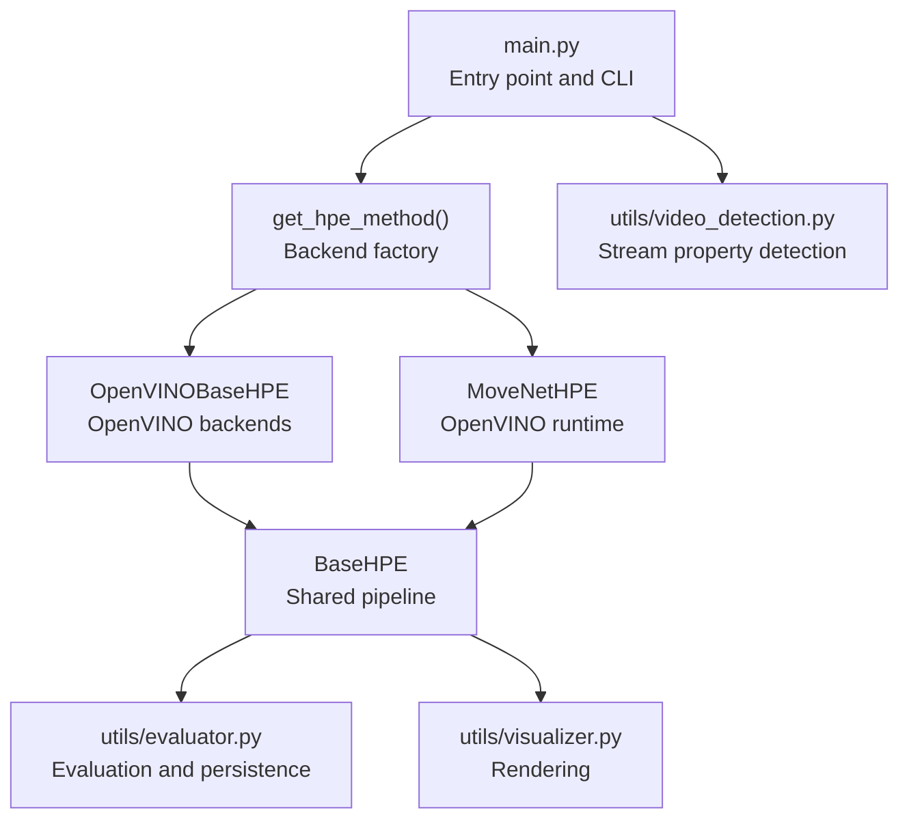
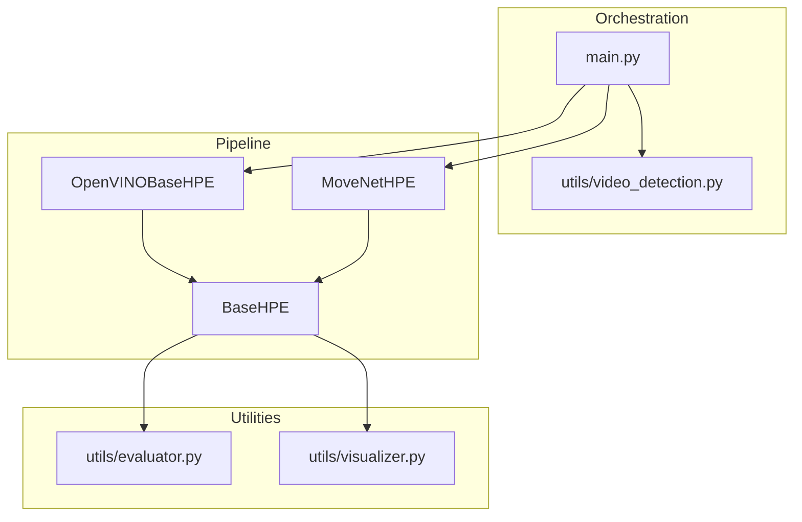
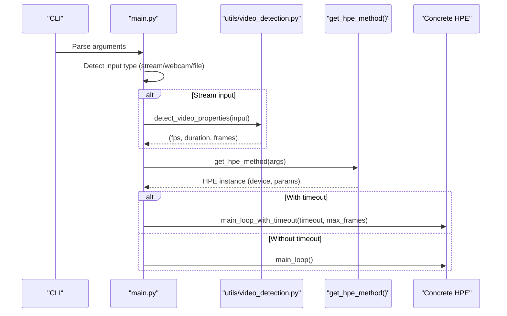
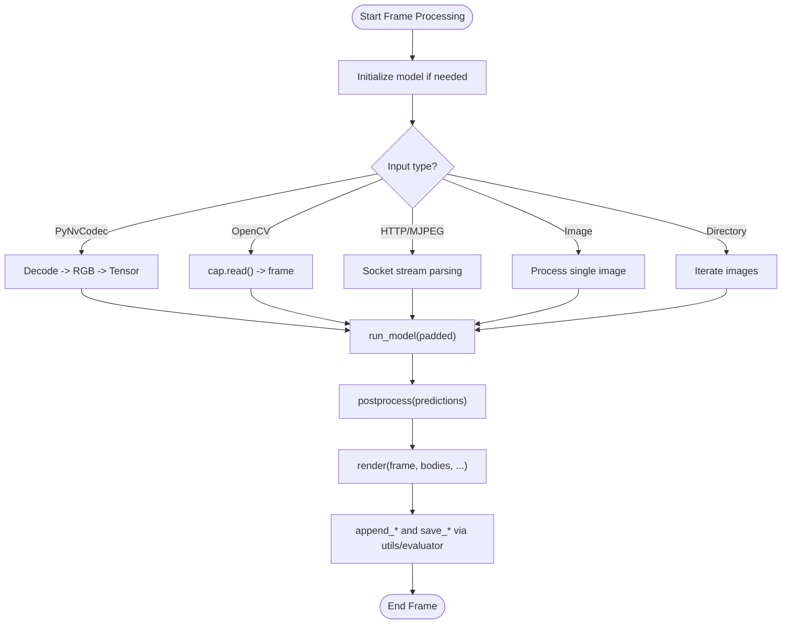
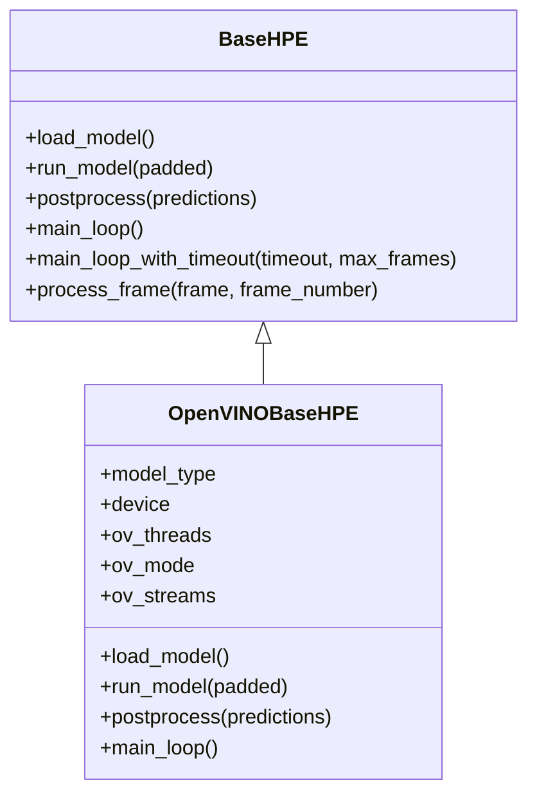
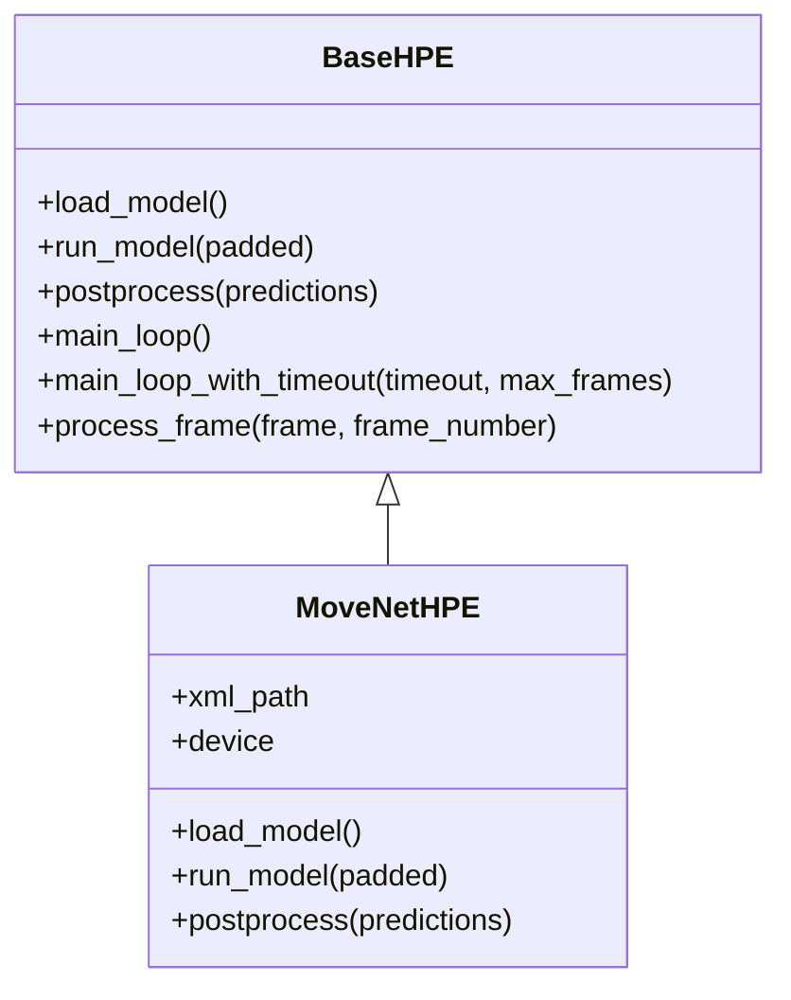
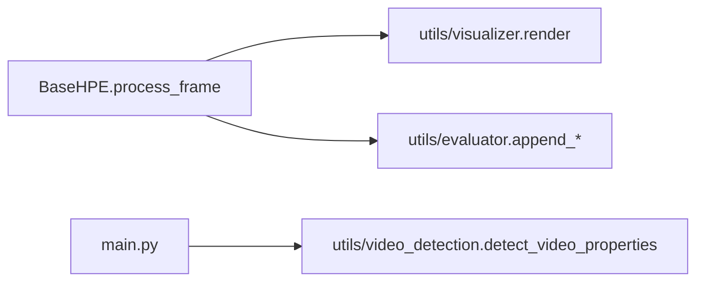
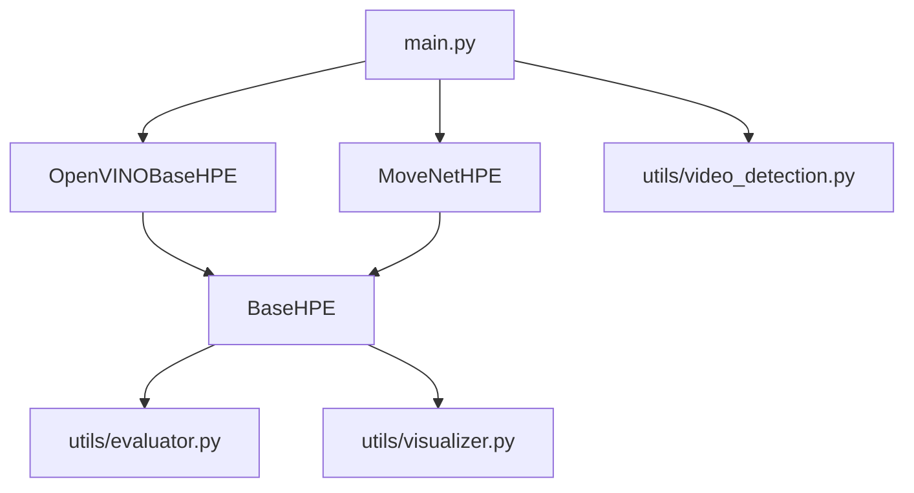

# Component Interactions

<cite>
**Referenced Files in This Document**
- [main.py](file://main.py)
- [base_hpe.py](file://base_hpe.py)
- [openvino_base_hpe.py](file://openvino_base_hpe.py)
- [movenet_hpe.py](file://movenet_hpe.py)
- [utils/visualizer.py](file://utils/visualizer.py)
- [utils/evaluator.py](file://utils/evaluator.py)
- [utils/video_detection.py](file://utils/video_detection.py)
</cite>

## Table of Contents
1. [Introduction](#introduction)
2. [Project Structure](#project-structure)
3. [Core Components](#core-components)
4. [Architecture Overview](#architecture-overview)
5. [Detailed Component Analysis](#detailed-component-analysis)
6. [Dependency Analysis](#dependency-analysis)
7. [Performance Considerations](#performance-considerations)
8. [Troubleshooting Guide](#troubleshooting-guide)
9. [Conclusion](#conclusion)

## Introduction
This document explains the interaction patterns among core components in the HPE system architecture. It focuses on how the entry point orchestrates backend selection and execution, how the BaseHPE abstract class communicates with concrete implementations, and how the utility modules integrate for visualization and evaluation. It also covers dependency injection patterns, callback-like mechanisms, event-driven interactions, data exchange protocols, parameter passing, state management across component boundaries, and lifecycle management. Sequence and flow diagrams illustrate typical execution flows, error propagation, and decoupling strategies that enable modular development and testing.

## Project Structure
The system is organized around a small set of cohesive modules:
- Entry point and orchestration: main.py
- Abstract base and shared pipeline: base_hpe.py
- Concrete backends: openvino_base_hpe.py, movenet_hpe.py
- Utilities: utils/visualizer.py, utils/evaluator.py, utils/video_detection.py

**Diagram sources**
- [main.py:207-237](file://main.py#L207-L237)
- [openvino_base_hpe.py:56-94](file://openvino_base_hpe.py#L56-L94)
- [movenet_hpe.py:12-27](file://movenet_hpe.py#L12-L27)
- [base_hpe.py:98-196](file://base_hpe.py#L98-L196)
- [utils/evaluator.py:1-114](file://utils/evaluator.py#L1-L114)
- [utils/visualizer.py:1-53](file://utils/visualizer.py#L1-L53)
- [utils/video_detection.py:42-220](file://utils/video_detection.py#L42-L220)

**Section sources**
- [main.py:190-205](file://main.py#L190-L205)
- [main.py:207-237](file://main.py#L207-L237)
- [base_hpe.py:98-196](file://base_hpe.py#L98-L196)

## Core Components
- main.py: Provides CLI, logging, structured event logging, input detection (stream vs file vs webcam), and backend selection via a factory. It delegates execution to the selected HPE backend’s main loop.
- BaseHPE: Abstract base class defining the shared pipeline (input initialization, decoding/capture, preprocessing, inference, postprocessing, rendering, persistence). Concrete backends override model loading and inference specifics.
- OpenVINOBaseHPE: Concrete backend implementing OpenVINO-based models (OpenPose, HigherHRNet, EfficientHRNet variants). Handles device selection, model configuration, and OpenVINO-specific performance tuning.
- MoveNetHPE: Concrete backend implementing MoveNet using OpenVINO runtime APIs. Manages model loading, preprocessing, inference, and postprocessing tailored to MoveNet outputs.
- utils/visualizer.py: Rendering utility that draws skeletons and bounding boxes onto frames.
- utils/evaluator.py: Evaluation and persistence utility that aggregates COCO-format results and CSV metrics, including throughput measurements.
- utils/video_detection.py: Utility to auto-detect video properties (FPS, duration, frame count) for HTTP/RTSP streams and local files.

**Section sources**
- [main.py:51-188](file://main.py#L51-L188)
- [base_hpe.py:98-675](file://base_hpe.py#L98-L675)
- [openvino_base_hpe.py:56-412](file://openvino_base_hpe.py#L56-L412)
- [movenet_hpe.py:12-111](file://movenet_hpe.py#L12-L111)
- [utils/visualizer.py:4-53](file://utils/visualizer.py#L4-L53)
- [utils/evaluator.py:11-114](file://utils/evaluator.py#L11-L114)
- [utils/video_detection.py:42-220](file://utils/video_detection.py#L42-L220)

## Architecture Overview
The system follows a layered architecture:
- Orchestration layer: main.py parses CLI, detects input type, selects backend, and invokes the main loop.
- Backend abstraction: BaseHPE defines the processing pipeline and common state (input type, dimensions, padding, timers).
- Concrete backends: OpenVINOBaseHPE and MoveNetHPE implement model-specific loading and inference.
- Utilities: Evaluator persists results; Visualizer renders overlays; Video detection supports stream property autodetection.

**Diagram sources**
- [main.py:51-188](file://main.py#L51-L188)
- [base_hpe.py:98-675](file://base_hpe.py#L98-L675)
- [openvino_base_hpe.py:56-412](file://openvino_base_hpe.py#L56-L412)
- [movenet_hpe.py:12-111](file://movenet_hpe.py#L12-L111)
- [utils/evaluator.py:11-114](file://utils/evaluator.py#L11-L114)
- [utils/visualizer.py:4-53](file://utils/visualizer.py#L4-L53)
- [utils/video_detection.py:42-220](file://utils/video_detection.py#L42-L220)

## Detailed Component Analysis

### Orchestration and Backend Selection (main.py)
- CLI parsing and logging: Defines arguments for method selection, input source, device, timeouts, and export options. Configures file and console logging and structured event logging.
- Input detection: Determines whether input is a URL stream, webcam, or file.
- Stream property autodetection: Uses utils/video_detection to fetch FPS, duration, and frame count for HTTP/RTSP streams, enabling intelligent timeout and frame limits.
- Backend factory: Maps method names to concrete HPE constructors, injecting device and shared parameters.
- Execution delegation: Invokes the selected backend’s main loop (with or without timeout) and logs session lifecycle events.

**Diagram sources**
- [main.py:51-188](file://main.py#L51-L188)
- [main.py:207-237](file://main.py#L207-L237)
- [utils/video_detection.py:42-220](file://utils/video_detection.py#L42-L220)

**Section sources**
- [main.py:51-188](file://main.py#L51-L188)
- [main.py:207-237](file://main.py#L207-L237)

### BaseHPE Pipeline and Shared Contracts
- Initialization: Sets input type, dimensions, padding, output directories, and flags for saving images/videos and exporting JSON/CSV. Supports directory, image, video, and webcam inputs.
- Video capture: Chooses PyNvCodec when available and implemented, otherwise falls back to OpenCV/FFmpeg. Handles HTTP/RTSP streams with reduced buffer sizes for low latency.
- Main loops: Two modes:
  - main_loop: Processes frames indefinitely or for a directory/image.
  - main_loop_with_timeout: Adds timeout and max-frames checks, plus robustness for HTTP/MJPEG sockets and stream read failures.
- Frame processing: Converts tensors to numpy, pads/resizes, runs inference, postprocesses, renders, and persists results.
- Postprocessing and rendering: Delegates to backend-specific logic; uses utils/visualizer for overlay drawing; writes images or video frames.
- Persistence: Aggregates COCO-format results and CSV metrics via utils/evaluator.

**Diagram sources**
- [base_hpe.py:250-549](file://base_hpe.py#L250-L549)
- [base_hpe.py:550-653](file://base_hpe.py#L550-L653)
- [utils/visualizer.py:4-53](file://utils/visualizer.py#L4-L53)
- [utils/evaluator.py:35-114](file://utils/evaluator.py#L35-L114)

**Section sources**
- [base_hpe.py:98-196](file://base_hpe.py#L98-L196)
- [base_hpe.py:250-549](file://base_hpe.py#L250-L549)
- [base_hpe.py:550-653](file://base_hpe.py#L550-L653)

### OpenVINOBaseHPE Implementation
- Model selection: Uses a configuration map keyed by model type to locate XML models and input sizes.
- Device and performance tuning: Reads environment variables for thread count, performance mode, streams, CPU pinning, and hyper-threading; applies OpenVINO properties to the core.
- Video capture: Initializes OpenCV with FFmpeg backend for streams and sets buffer size for low latency.
- Model loading: Creates adapter, reads network, prints input/output shapes, constructs ImageModel with appropriate configuration, loads the model, and logs layer information.
- Inference: Preprocesses input, runs inference synchronously, and postprocesses outputs into pose/score pairs.
- Postprocessing: Converts normalized keypoints to original image coordinates, computes bounding boxes, and creates Body objects.

**Diagram sources**
- [base_hpe.py:98-675](file://base_hpe.py#L98-L675)
- [openvino_base_hpe.py:56-412](file://openvino_base_hpe.py#L56-L412)

**Section sources**
- [openvino_base_hpe.py:23-54](file://openvino_base_hpe.py#L23-L54)
- [openvino_base_hpe.py:65-94](file://openvino_base_hpe.py#L65-L94)
- [openvino_base_hpe.py:191-262](file://openvino_base_hpe.py#L191-L262)
- [openvino_base_hpe.py:263-282](file://openvino_base_hpe.py#L263-L282)
- [openvino_base_hpe.py:284-322](file://openvino_base_hpe.py#L284-L322)

### MoveNetHPE Implementation
- Model configuration: Defaults to a specific XML model path and enforces CPU-only for this backend.
- Video capture: Similar to OpenVINOBaseHPE, with FFmpeg backend for streams and buffer size tuning.
- Model loading: Uses OpenVINO runtime Core to read the model, prints input/output details, and compiles for the chosen device.
- Inference: Preprocesses frame to expected layout and runs inference via a new request.
- Postprocessing: Parses MoveNet outputs into bodies with bounding boxes and keypoints, converts to original image coordinates using padding.

**Diagram sources**
- [base_hpe.py:98-675](file://base_hpe.py#L98-L675)
- [movenet_hpe.py:12-111](file://movenet_hpe.py#L12-L111)

**Section sources**
- [movenet_hpe.py:20-57](file://movenet_hpe.py#L20-L57)
- [movenet_hpe.py:58-86](file://movenet_hpe.py#L58-L86)
- [movenet_hpe.py:87-111](file://movenet_hpe.py#L87-L111)

### Utility Module Integration
- Visualization: Renders skeletons and bounding boxes onto frames using predefined body lines and per-keypoint thresholds.
- Evaluation: Aggregates COCO-format results and CSV entries per frame, and measures transmitted data volume per millisecond interval.
- Video property detection: Attempts to fetch streamer-provided converted properties for HTTP streams; falls back to OpenCV detection for local files.

**Diagram sources**
- [base_hpe.py:639-653](file://base_hpe.py#L639-L653)
- [utils/visualizer.py:4-53](file://utils/visualizer.py#L4-L53)
- [utils/evaluator.py:35-114](file://utils/evaluator.py#L35-L114)
- [utils/video_detection.py:42-220](file://utils/video_detection.py#L42-L220)

**Section sources**
- [utils/visualizer.py:4-53](file://utils/visualizer.py#L4-L53)
- [utils/evaluator.py:11-114](file://utils/evaluator.py#L11-L114)
- [utils/video_detection.py:42-220](file://utils/video_detection.py#L42-L220)

## Dependency Analysis
- main.py depends on concrete HPE backends and utility modules for input detection and logging.
- BaseHPE depends on OpenCV, PyNvCodec (optional), and utility modules for rendering and evaluation.
- OpenVINOBaseHPE depends on OpenVINO model API and adapters; MoveNetHPE depends on OpenVINO runtime.
- Utilities are stateless and called by BaseHPE for rendering and evaluation.

**Diagram sources**
- [main.py:51-188](file://main.py#L51-L188)
- [base_hpe.py:98-196](file://base_hpe.py#L98-L196)
- [openvino_base_hpe.py:56-94](file://openvino_base_hpe.py#L56-L94)
- [movenet_hpe.py:12-27](file://movenet_hpe.py#L12-L27)
- [utils/evaluator.py:11-114](file://utils/evaluator.py#L11-L114)
- [utils/visualizer.py:4-53](file://utils/visualizer.py#L4-L53)
- [utils/video_detection.py:42-220](file://utils/video_detection.py#L42-L220)

**Section sources**
- [main.py:51-188](file://main.py#L51-L188)
- [base_hpe.py:98-196](file://base_hpe.py#L98-L196)

## Performance Considerations
- Latency-sensitive streams: OpenCV CAP_FFMPEG backend with minimal buffer size reduces latency for HTTP/RTSP.
- Throughput vs latency: OpenVINO performance mode and thread/stream settings can be tuned via environment variables.
- GPU/CPU fallback: Some models are GPU-only; the backends enforce CPU fallback when necessary.
- Robustness: HTTP/MJPEG fallback includes frame-skipping logic and failure thresholds to maintain stability under network variability.

[No sources needed since this section provides general guidance]

## Troubleshooting Guide
- Stream property detection failures: When utils/video_detection fails, main.py falls back to user-provided timeout and max_frames and logs structured events.
- Stream read failures: BaseHPE’s HTTP/MJPEG loop retries up to a threshold and logs decode failures.
- PyNvCodec errors: BaseHPE catches exceptions during decoding and exits the loop gracefully.
- Logging: Structured logs are written for session lifecycle and configuration changes to aid debugging.

**Section sources**
- [main.py:76-149](file://main.py#L76-L149)
- [base_hpe.py:442-540](file://base_hpe.py#L442-L540)
- [base_hpe.py:306-309](file://base_hpe.py#L306-L309)

## Conclusion
The HPE system achieves modularity and testability through a clean separation of concerns:
- main.py orchestrates input detection, stream property autodetection, and backend selection.
- BaseHPE encapsulates the shared pipeline, enabling consistent behavior across backends.
- Concrete backends implement model-specific loading and inference, adhering to shared contracts.
- Utilities provide decoupled rendering and evaluation, supporting reproducible results and monitoring.
This design enables straightforward substitution of backends, incremental feature additions, and robust operation across diverse input sources and environments.