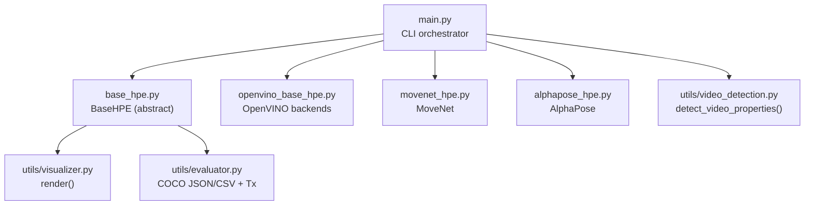
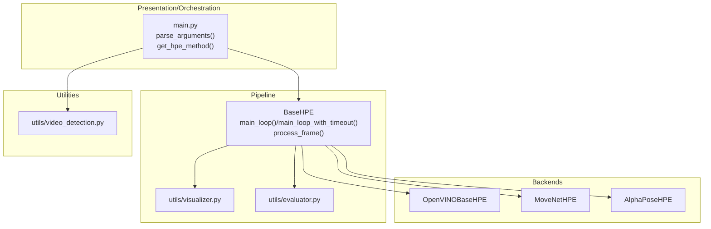
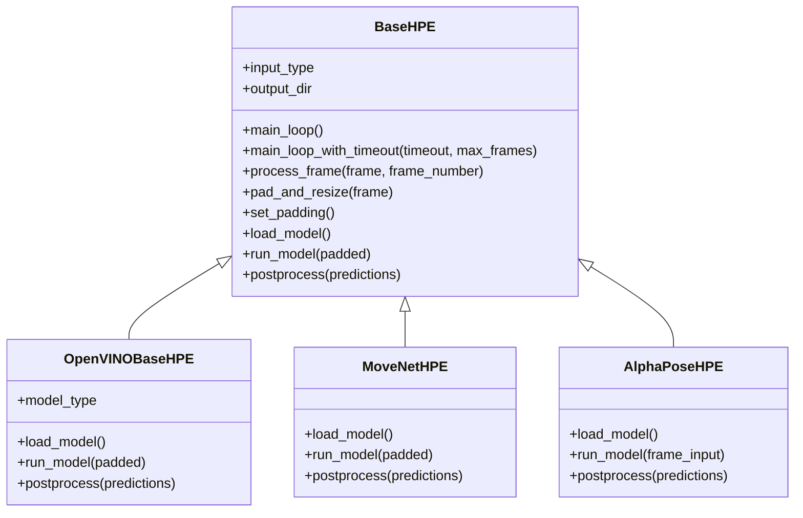
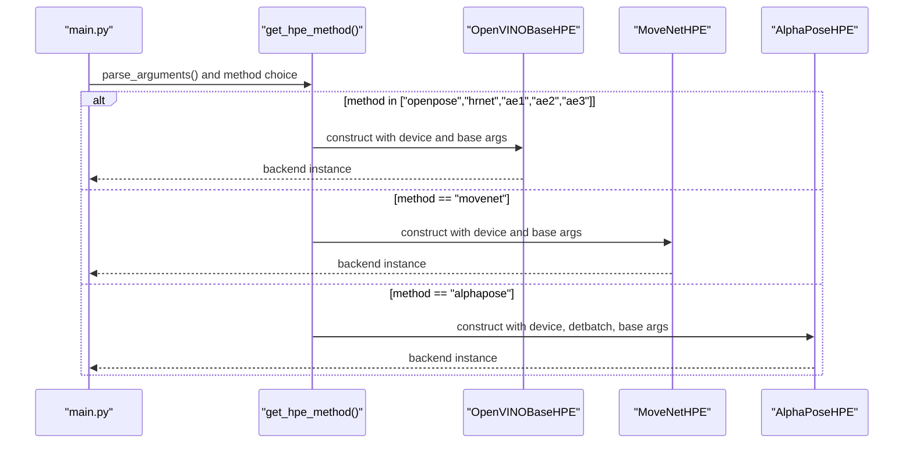
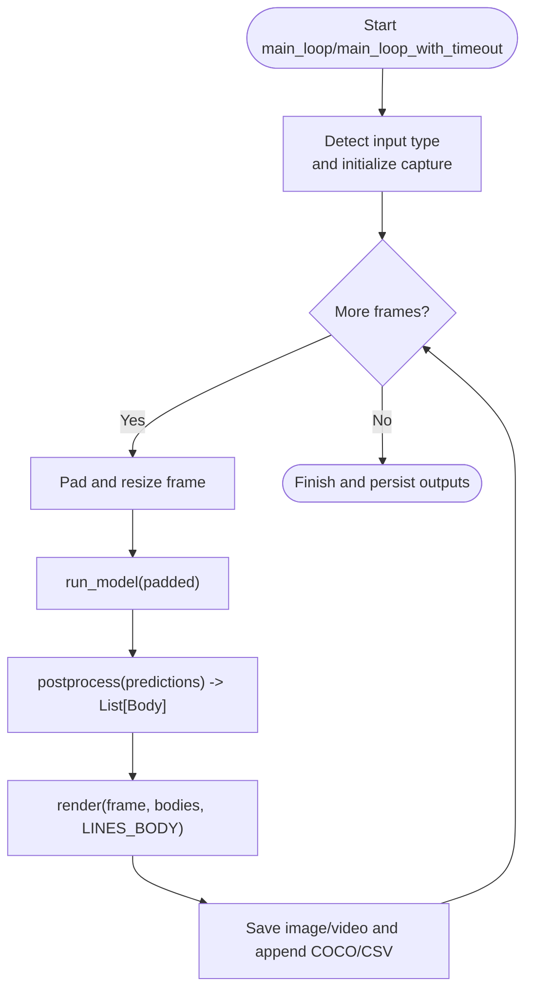
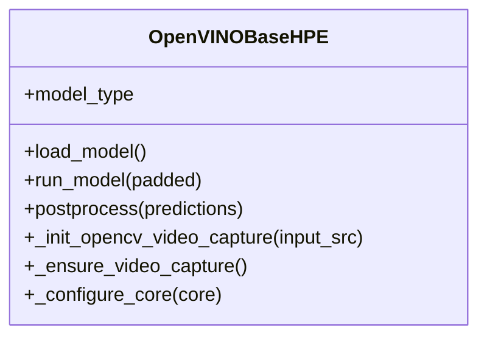
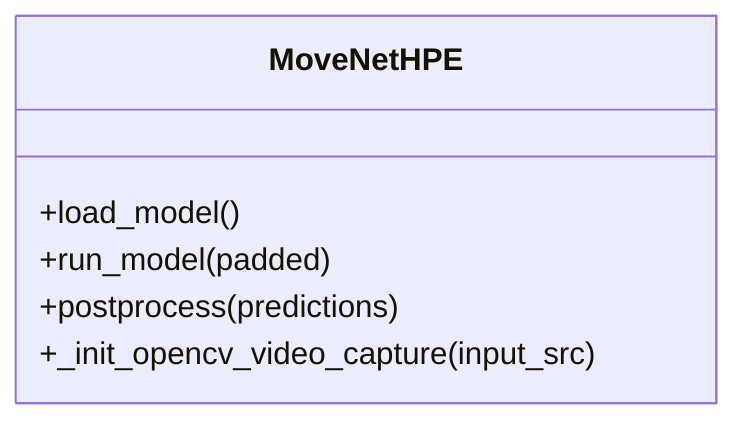
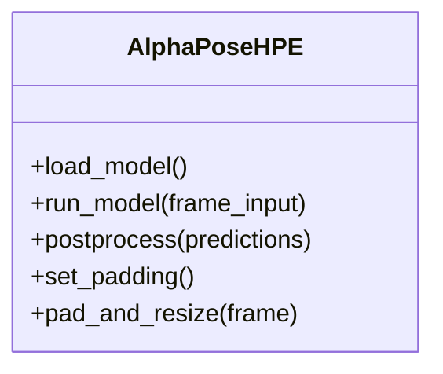
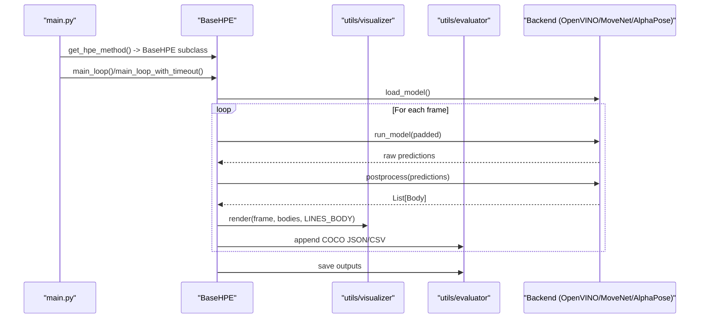
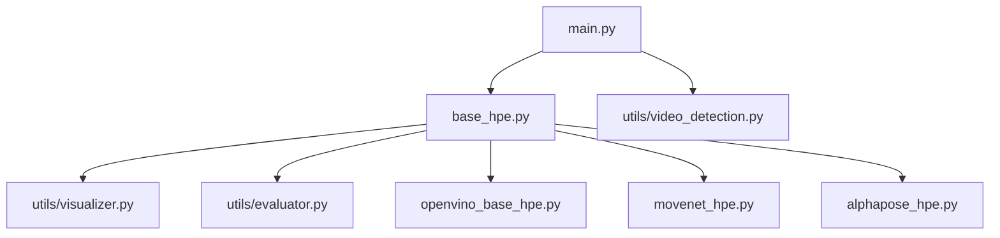

# Core Architecture

<cite>
**Referenced Files in This Document**
- [main.py](file://main.py)
- [base_hpe.py](file://base_hpe.py)
- [openvino_base_hpe.py](file://openvino_base_hpe.py)
- [movenet_hpe.py](file://movenet_hpe.py)
- [alphapose_hpe.py](file://alphapose_hpe.py)
- [utils/video_detection.py](file://utils/video_detection.py)
- [utils/visualizer.py](file://utils/visualizer.py)
- [utils/evaluator.py](file://utils/evaluator.py)
- [README.md](file://README.md)
</cite>

## Table of Contents
1. [Introduction](#introduction)
2. [Project Structure](#project-structure)
3. [Core Components](#core-components)
4. [Architecture Overview](#architecture-overview)
5. [Detailed Component Analysis](#detailed-component-analysis)
6. [Dependency Analysis](#dependency-analysis)
7. [Performance Considerations](#performance-considerations)
8. [Troubleshooting Guide](#troubleshooting-guide)
9. [Conclusion](#conclusion)
10. [Appendices](#appendices)

## Introduction
This document describes the core architecture of the Human Pose Estimation (HPE) system. It focuses on the high-level design patterns, including the BaseHPE abstract class pattern, the factory method for backend selection, and the pipeline architecture for video processing. It documents the component interactions between the main orchestrator, backend implementations, and utility modules, and explains the data flow from input detection through model inference to output generation. It also outlines the modular design that enables pluggable backends while maintaining consistent interfaces, system boundaries, integration patterns, and extensibility points for adding new HPE methods.

## Project Structure
The HPE system is organized around a small set of core modules:
- Orchestrator: main.py
- Abstract base class: base_hpe.py
- Backend implementations: openvino_base_hpe.py, movenet_hpe.py, alphapose_hpe.py
- Utilities: utils/visualizer.py, utils/evaluator.py, utils/video_detection.py
- Documentation: README.md

**Diagram sources**
- [main.py:51-242](file://main.py#L51-L242)
- [base_hpe.py:98-675](file://base_hpe.py#L98-L675)
- [openvino_base_hpe.py:56-412](file://openvino_base_hpe.py#L56-L412)
- [movenet_hpe.py:12-111](file://movenet_hpe.py#L12-L111)
- [alphapose_hpe.py:33-341](file://alphapose_hpe.py#L33-L341)
- [utils/visualizer.py:4-53](file://utils/visualizer.py#L4-L53)
- [utils/evaluator.py:11-114](file://utils/evaluator.py#L11-L114)
- [utils/video_detection.py:42-221](file://utils/video_detection.py#L42-L221)

**Section sources**
- [README.md:20-44](file://README.md#L20-L44)
- [main.py:190-242](file://main.py#L190-L242)

## Core Components
- BaseHPE (abstract): Provides shared input detection, video capture initialization, padding/resizing, main loops, inference timing, rendering, and output accumulation. Backends implement load_model(), run_model(), and postprocess().
- OpenVINO backends: OpenVINOBaseHPE supports OpenPose, HigherHRNet, and EfficientHRNet variants, with configurable CPU performance settings and robust video capture fallbacks.
- MoveNet: MoveNetHPE implements a CPU-only OpenVINO runtime pipeline for multipose MoveNet.
- AlphaPose: AlphaPoseHPE integrates a YOLO detector and a PyTorch pose model, with GPU acceleration and custom preprocessing.
- Utilities:
  - utils/visualizer.py: Draws skeletons and bounding boxes onto frames.
  - utils/evaluator.py: Serializes results to COCO-format JSON/CSV and measures transmitted data volume per interval.
  - utils/video_detection.py: Detects video properties for HTTP/RTSP streams and local files.

**Section sources**
- [base_hpe.py:98-675](file://base_hpe.py#L98-L675)
- [openvino_base_hpe.py:56-412](file://openvino_base_hpe.py#L56-L412)
- [movenet_hpe.py:12-111](file://movenet_hpe.py#L12-L111)
- [alphapose_hpe.py:33-341](file://alphapose_hpe.py#L33-L341)
- [utils/visualizer.py:4-53](file://utils/visualizer.py#L4-L53)
- [utils/evaluator.py:11-114](file://utils/evaluator.py#L11-L114)
- [utils/video_detection.py:42-221](file://utils/video_detection.py#L42-L221)

## Architecture Overview
The system follows a layered architecture:
- Presentation/Orchestration Layer: main.py parses CLI arguments, selects a backend via a factory method, and drives the processing loop.
- Pipeline Layer: BaseHPE encapsulates the end-to-end pipeline: input detection, frame acquisition, preprocessing, inference, postprocessing, rendering, and output writing.
- Backend Layer: Concrete backends implement model loading, inference, and postprocessing tailored to their frameworks (OpenVINO, PyTorch).
- Utility Layer: Rendering and evaluation utilities are reused across backends.

**Diagram sources**
- [main.py:51-242](file://main.py#L51-L242)
- [base_hpe.py:250-675](file://base_hpe.py#L250-L675)
- [openvino_base_hpe.py:56-412](file://openvino_base_hpe.py#L56-L412)
- [movenet_hpe.py:12-111](file://movenet_hpe.py#L12-L111)
- [alphapose_hpe.py:33-341](file://alphapose_hpe.py#L33-L341)
- [utils/visualizer.py:4-53](file://utils/visualizer.py#L4-L53)
- [utils/evaluator.py:11-114](file://utils/evaluator.py#L11-L114)
- [utils/video_detection.py:42-221](file://utils/video_detection.py#L42-L221)

## Detailed Component Analysis

### BaseHPE Abstract Class Pattern
BaseHPE defines a common contract and shared pipeline:
- Input detection and initialization: Supports image, directory, video file, webcam, and HTTP/RTSP streams. Initializes video capture via OpenCV or PyNvCodec when available.
- Preprocessing: Normalizes frames to model input sizes via padding and resizing.
- Pipeline orchestration: main_loop() and main_loop_with_timeout() iterate frames, time processing, and coordinate inference and rendering.
- Rendering and output: Uses utils/visualizer.py to draw skeletons and bounding boxes; writes annotated images/videos and accumulates COCO-format JSON/CSV via utils/evaluator.py.
- Extensibility: Backends implement load_model(), run_model(), and postprocess().

**Diagram sources**
- [base_hpe.py:98-675](file://base_hpe.py#L98-L675)
- [openvino_base_hpe.py:56-412](file://openvino_base_hpe.py#L56-L412)
- [movenet_hpe.py:12-111](file://movenet_hpe.py#L12-L111)
- [alphapose_hpe.py:33-341](file://alphapose_hpe.py#L33-L341)

**Section sources**
- [base_hpe.py:98-675](file://base_hpe.py#L98-L675)

### Factory Method for Backend Selection
The orchestrator constructs the appropriate backend instance based on the selected method. The factory maps method names to backend constructors and passes shared arguments (input source, output directory, flags for JSON/CSV/image/video saving, measurement interval).

**Diagram sources**
- [main.py:207-237](file://main.py#L207-L237)
- [openvino_base_hpe.py:65-94](file://openvino_base_hpe.py#L65-L94)
- [movenet_hpe.py:20-31](file://movenet_hpe.py#L20-L31)
- [alphapose_hpe.py:41-66](file://alphapose_hpe.py#L41-L66)

**Section sources**
- [main.py:207-237](file://main.py#L207-L237)

### Pipeline Architecture for Video Processing
The pipeline is consistent across backends:
- Input detection: Determine whether input is image, directory, video file, webcam, or stream.
- Capture and decode: Use OpenCV or PyNvCodec when available; fallback to MJPEG socket parsing for HTTP streams.
- Preprocess: Pad and resize frames to model input dimensions.
- Inference: Backend-specific run_model() returns raw predictions.
- Postprocess: Convert raw predictions to Body objects with keypoints and bounding boxes.
- Render and save: Draw skeletons and optionally write images/videos and COCO-format outputs.

**Diagram sources**
- [base_hpe.py:250-675](file://base_hpe.py#L250-L675)
- [utils/visualizer.py:4-53](file://utils/visualizer.py#L4-L53)
- [utils/evaluator.py:35-114](file://utils/evaluator.py#L35-L114)

**Section sources**
- [base_hpe.py:250-675](file://base_hpe.py#L250-L675)

### OpenVINO Backends
OpenVINOBaseHPE centralizes OpenVINO model loading, CPU performance tuning, and postprocessing. It supports multiple architectures with different input sizes and GPU support policies. It ensures video capture initialization for streams and provides robust fallbacks.

**Diagram sources**
- [openvino_base_hpe.py:56-412](file://openvino_base_hpe.py#L56-L412)

**Section sources**
- [openvino_base_hpe.py:56-412](file://openvino_base_hpe.py#L56-L412)

### MoveNet Backend
MoveNetHPE implements a CPU-only pipeline using the OpenVINO Runtime. It initializes video capture for streams and files, loads the model, performs preprocessing, inference, and postprocessing to produce Body objects.

**Diagram sources**
- [movenet_hpe.py:12-111](file://movenet_hpe.py#L12-L111)

**Section sources**
- [movenet_hpe.py:12-111](file://movenet_hpe.py#L12-L111)

### AlphaPose Backend
AlphaPoseHPE integrates a YOLO detector and a PyTorch pose model. It supports GPU acceleration, batching, and custom preprocessing. It overrides padding behavior to avoid altering input resolution and handles both image/directory and video/webcam/stream inputs.

**Diagram sources**
- [alphapose_hpe.py:33-341](file://alphapose_hpe.py#L33-L341)

**Section sources**
- [alphapose_hpe.py:33-341](file://alphapose_hpe.py#L33-L341)

### Data Flow: From Input to Output
The end-to-end flow is standardized across backends:
- Input detection: utils/video_detection.py can auto-detect video properties for HTTP/RTSP streams and local files.
- Capture: BaseHPE initializes OpenCV or PyNvCodec capture depending on input type and availability.
- Preprocess: pad_and_resize normalizes frames to model input size.
- Inference: run_model executes backend-specific inference.
- Postprocess: postprocess converts raw outputs to Body objects.
- Rendering and persistence: utils/visualizer draws skeletons; utils/evaluator accumulates COCO-format JSON/CSV and measures Tx bandwidth.

**Diagram sources**
- [main.py:51-242](file://main.py#L51-L242)
- [base_hpe.py:250-675](file://base_hpe.py#L250-L675)
- [utils/visualizer.py:4-53](file://utils/visualizer.py#L4-L53)
- [utils/evaluator.py:35-114](file://utils/evaluator.py#L35-L114)
- [openvino_base_hpe.py:191-282](file://openvino_base_hpe.py#L191-L282)
- [movenet_hpe.py:58-111](file://movenet_hpe.py#L58-L111)
- [alphapose_hpe.py:69-341](file://alphapose_hpe.py#L69-L341)

**Section sources**
- [base_hpe.py:250-675](file://base_hpe.py#L250-L675)
- [utils/video_detection.py:42-221](file://utils/video_detection.py#L42-L221)

## Dependency Analysis
- main.py depends on BaseHPE subclasses and utility modules for logging, structured events, and video property detection.
- BaseHPE depends on OpenCV, PyTorch (when applicable), and utility modules for rendering and evaluation.
- Backends depend on their respective frameworks (OpenVINO Runtime or PyTorch) and model APIs.
- Utilities are shared across backends and are decoupled from backend specifics.

**Diagram sources**
- [main.py:10-14](file://main.py#L10-L14)
- [base_hpe.py:22-24](file://base_hpe.py#L22-L24)
- [openvino_base_hpe.py:16-21](file://openvino_base_hpe.py#L16-L21)
- [movenet_hpe.py:3-7](file://movenet_hpe.py#L3-L7)
- [alphapose_hpe.py:7](file://alphapose_hpe.py#L7-L22)

**Section sources**
- [main.py:10-14](file://main.py#L10-L14)
- [base_hpe.py:22-24](file://base_hpe.py#L22-L24)
- [openvino_base_hpe.py:16-21](file://openvino_base_hpe.py#L16-L21)
- [movenet_hpe.py:3-7](file://movenet_hpe.py#L3-L7)
- [alphapose_hpe.py:7](file://alphapose_hpe.py#L7-L22)

## Performance Considerations
- CPU tuning for OpenVINO backends: OpenVINOBaseHPE configures performance mode, threads, streams, CPU pinning, and hyper-threading via environment variables and constructor parameters.
- Stream handling: For HTTP/RTSP streams, BaseHPE provides timeouts and max frame limits; OpenCV FFmpeg backend is preferred for lower latency; PyNvCodec is used when available for hardware-accelerated decoding.
- Throughput vs latency: Performance mode can be tuned via environment variables to balance throughput and latency.
- Output serialization: COCO JSON/CSV and Tx measurements are accumulated incrementally and persisted at the end of sessions.

[No sources needed since this section provides general guidance]

## Troubleshooting Guide
- Video property detection: utils/video_detection.py attempts to fetch streamer video info, probe source files, and fall back to OpenCV. Failures are logged and can be mitigated by providing explicit timeout and max_frames.
- Stream errors: BaseHPE’s main_loop_with_timeout includes robustness for HTTP streams, including skipping old frames, decoding retries, and termination checks.
- Logging: Structured logging is written to files for machine parsing and console output for human readability.
- Device selection: Some backends restrict device usage (e.g., MoveNet and certain OpenVINO models); the code falls back to CPU when GPU is unsupported.

**Section sources**
- [utils/video_detection.py:42-221](file://utils/video_detection.py#L42-L221)
- [base_hpe.py:331-549](file://base_hpe.py#L331-L549)
- [main.py:31-49](file://main.py#L31-L49)

## Conclusion
The HPE system employs a clean separation of concerns: a shared BaseHPE pipeline with pluggable backends, a factory-driven backend selection, and reusable utilities for rendering and evaluation. The architecture supports diverse input sources, robust stream handling, and consistent output formats. Extensibility is achieved by implementing the minimal contract defined by BaseHPE, enabling straightforward addition of new HPE methods.

[No sources needed since this section summarizes without analyzing specific files]

## Appendices

### System Boundaries and Integration Patterns
- Orchestration boundary: main.py is the single entry point for CLI-driven runs.
- Pipeline boundary: BaseHPE encapsulates the processing loop and output persistence.
- Backend boundary: Each backend manages its own model loading and inference specifics.
- Utility boundary: Rendering and evaluation are cross-cutting concerns integrated via function calls.

**Section sources**
- [README.md:45-62](file://README.md#L45-L62)
- [main.py:51-242](file://main.py#L51-L242)
- [base_hpe.py:250-675](file://base_hpe.py#L250-L675)