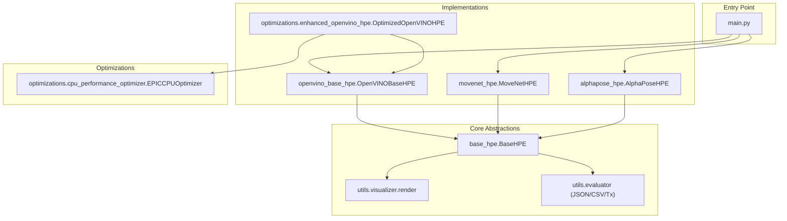
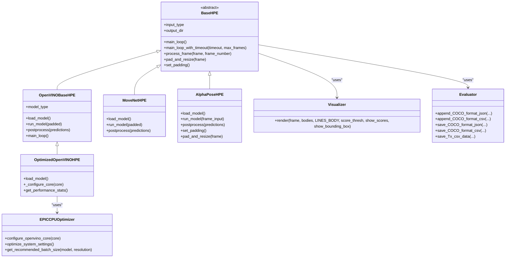
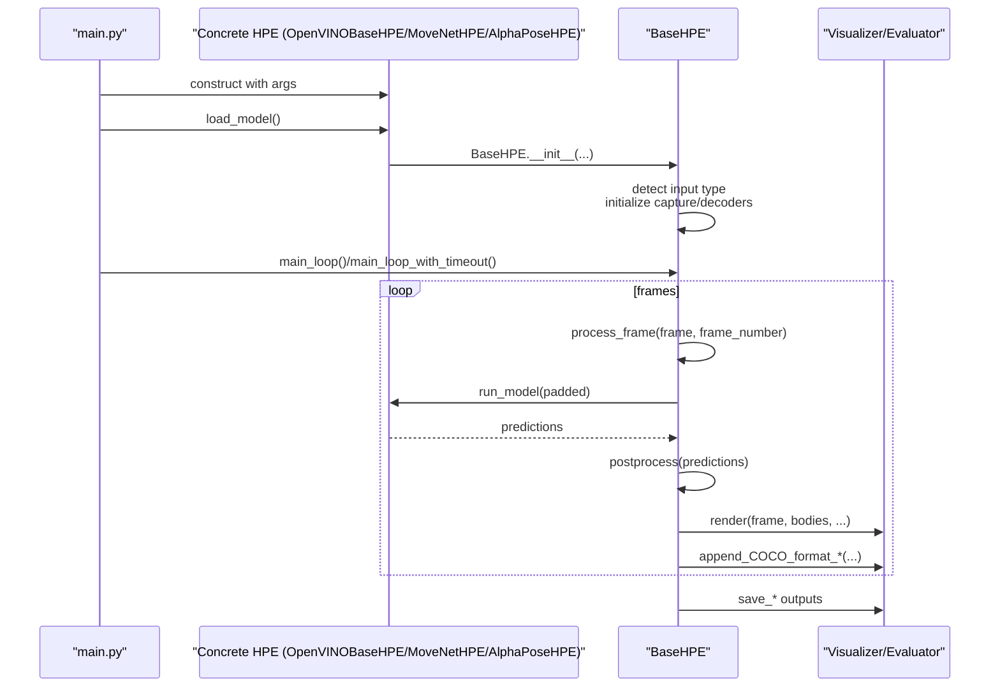
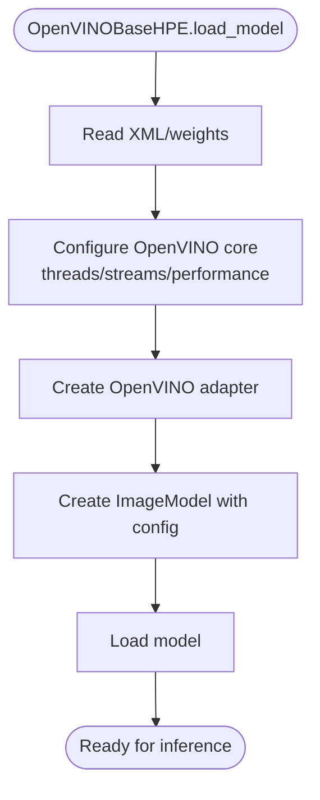
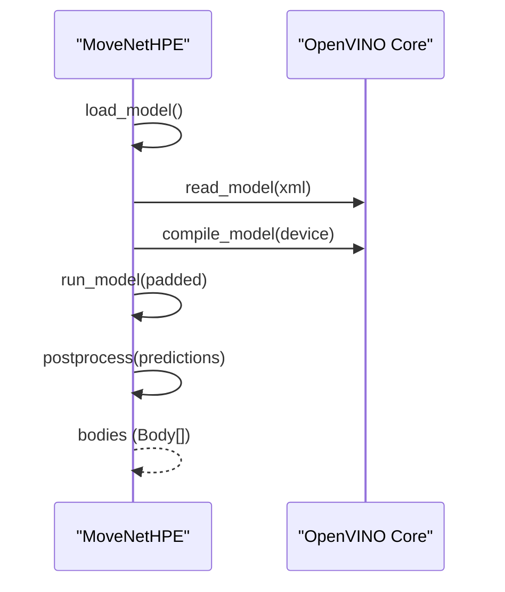
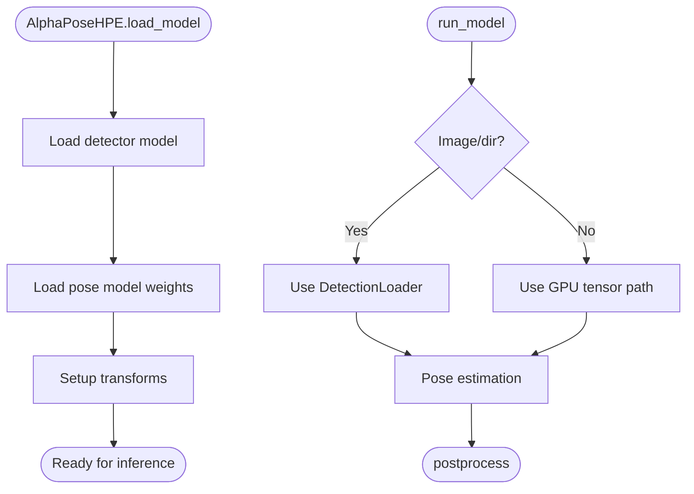
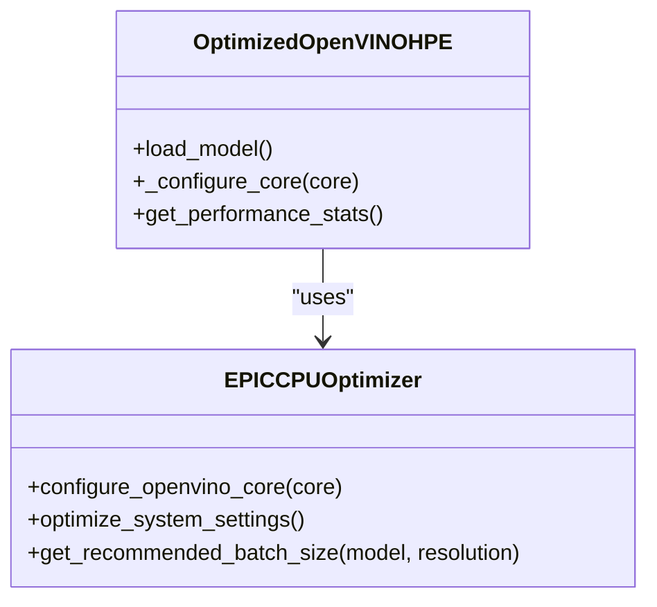
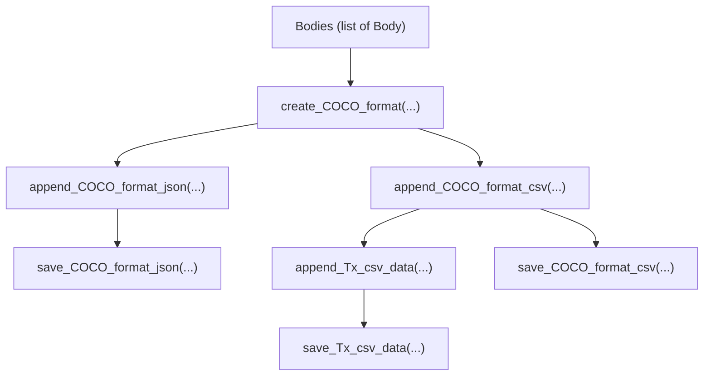
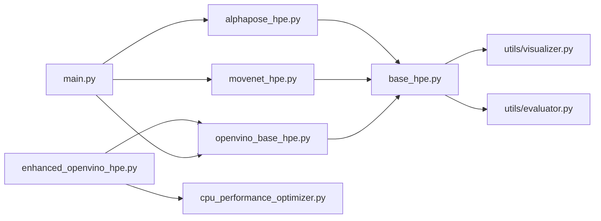

# Core Architecture

<cite>
**Referenced Files in This Document**
- [base_hpe.py](file://base_hpe.py)
- [openvino_base_hpe.py](file://openvino_base_hpe.py)
- [movenet_hpe.py](file://movenet_hpe.py)
- [alphapose_hpe.py](file://alphapose_hpe.py)
- [main.py](file://main.py)
- [utils/visualizer.py](file://utils/visualizer.py)
- [utils/evaluator.py](file://utils/evaluator.py)
- [optimizations/enhanced_openvino_hpe.py](file://optimizations/enhanced_openvino_hpe.py)
- [optimizations/cpu_performance_optimizer.py](file://optimizations/cpu_performance_optimizer.py)
</cite>

## Table of Contents
1. [Introduction](#introduction)
2. [Project Structure](#project-structure)
3. [Core Components](#core-components)
4. [Architecture Overview](#architecture-overview)
5. [Detailed Component Analysis](#detailed-component-analysis)
6. [Dependency Analysis](#dependency-analysis)
7. [Performance Considerations](#performance-considerations)
8. [Troubleshooting Guide](#troubleshooting-guide)
9. [Conclusion](#conclusion)

## Introduction
This document describes the core architecture of the Human Pose Estimation (HPE) framework. It focuses on the abstract BaseHPE class design pattern that enables polymorphic behavior across different HPE implementations, the unified interface that allows switching between AlphaPose, OpenPose, HigherHRNet, EfficientHRNet, and MoveNet methods, and the modular design that separates model-specific logic from common functionality. It also documents the evaluation and visualization utilities and their role in the overall architecture.

## Project Structure
The HPE framework is organized around a shared base class and multiple specialized implementations. The main entry point selects the desired method and orchestrates the processing loop. Utilities provide visualization and evaluation outputs.

**Diagram sources**
- [main.py:22-99](file://main.py#L22-L99)
- [base_hpe.py:36-546](file://base_hpe.py#L36-L546)
- [openvino_base_hpe.py:55-653](file://openvino_base_hpe.py#L55-L653)
- [movenet_hpe.py:12-111](file://movenet_hpe.py#L12-L111)
- [alphapose_hpe.py:33-334](file://alphapose_hpe.py#L33-L334)
- [utils/visualizer.py:4-49](file://utils/visualizer.py#L4-L49)
- [utils/evaluator.py:11-114](file://utils/evaluator.py#L11-L114)
- [optimizations/enhanced_openvino_hpe.py:25-333](file://optimizations/enhanced_openvino_hpe.py#L25-L333)
- [optimizations/cpu_performance_optimizer.py:34-539](file://optimizations/cpu_performance_optimizer.py#L34-L539)

**Section sources**
- [main.py:22-99](file://main.py#L22-L99)
- [base_hpe.py:36-546](file://base_hpe.py#L36-L546)

## Core Components
- BaseHPE: An abstract base class that defines the unified interface for all HPE implementations. It encapsulates common input handling, preprocessing, inference orchestration, postprocessing, visualization, and evaluation. It also manages hardware acceleration paths (PyNvCodec vs. OpenCV) and timing metrics.
- OpenVINOBaseHPE: A concrete implementation that integrates with OpenVINO’s model API and pipelines. It supports multiple architectures (OpenPose, HigherHRNet, EfficientHRNet variants) and exposes configurable performance settings.
- MoveNetHPE: A lightweight implementation leveraging OpenVINO for MoveNet multipose models with a fixed input size.
- AlphaPoseHPE: A PyTorch-based implementation integrating AlphaPose’s detector and pose estimation components, with GPU acceleration and optional multiprocessing.
- OptimizedOpenVINOHPE: An extension of OpenVINOBaseHPE that applies CPU-specific optimizations for high-core-count systems, including NUMA-aware configuration and workload-specific tuning.
- EPICCPUOptimizer: A utility that detects CPU capabilities and calculates optimal OpenVINO configurations for throughput or latency modes.
- Utilities:
  - visualizer.render: Draws skeletons and optional bounding boxes and scores onto frames.
  - evaluator: Aggregates pose results into COCO-compatible JSON/CSV and computes transmitted data volume metrics.

**Section sources**
- [base_hpe.py:36-546](file://base_hpe.py#L36-L546)
- [openvino_base_hpe.py:55-653](file://openvino_base_hpe.py#L55-L653)
- [movenet_hpe.py:12-111](file://movenet_hpe.py#L12-L111)
- [alphapose_hpe.py:33-334](file://alphapose_hpe.py#L33-L334)
- [optimizations/enhanced_openvino_hpe.py:25-333](file://optimizations/enhanced_openvino_hpe.py#L25-L333)
- [optimizations/cpu_performance_optimizer.py:34-539](file://optimizations/cpu_performance_optimizer.py#L34-L539)
- [utils/visualizer.py:4-49](file://utils/visualizer.py#L4-L49)
- [utils/evaluator.py:11-114](file://utils/evaluator.py#L11-L114)

## Architecture Overview
The framework follows a layered design:
- Entry point (main.py) selects the HPE method and constructs the appropriate implementation.
- Each implementation inherits from BaseHPE and overrides model-specific methods (load_model, run_model, postprocess).
- BaseHPE centralizes:
  - Input source detection (image, directory, video, HTTP stream, webcam).
  - Hardware acceleration selection (PyNvCodec GPU decoding or OpenCV CPU decoding).
  - Preprocessing (padding and resizing) and postprocessing (keypoint scaling and bounding box computation).
  - Inference orchestration and timing.
  - Visualization and evaluation outputs.

**Diagram sources**
- [base_hpe.py:36-546](file://base_hpe.py#L36-L546)
- [openvino_base_hpe.py:55-653](file://openvino_base_hpe.py#L55-L653)
- [movenet_hpe.py:12-111](file://movenet_hpe.py#L12-L111)
- [alphapose_hpe.py:33-334](file://alphapose_hpe.py#L33-L334)
- [optimizations/enhanced_openvino_hpe.py:25-333](file://optimizations/enhanced_openvino_hpe.py#L25-L333)
- [optimizations/cpu_performance_optimizer.py:34-539](file://optimizations/cpu_performance_optimizer.py#L34-L539)
- [utils/visualizer.py:4-49](file://utils/visualizer.py#L4-L49)
- [utils/evaluator.py:11-114](file://utils/evaluator.py#L11-L114)

## Detailed Component Analysis

### BaseHPE: Abstract Design Pattern and Polymorphism
BaseHPE defines a common contract for all HPE implementations:
- Unified constructor parameters for input source, output configuration, and visualization toggles.
- Input detection logic supporting images, directories, videos, HTTP streams, and webcams.
- Hardware acceleration paths:
  - PyNvCodec GPU decoding with NV12 to RGB conversion and tensor conversion.
  - OpenCV CPU decoding with configurable backend for HTTP streams.
- Centralized preprocessing and postprocessing:
  - Padding and resizing to a target model input size.
  - Postprocessing that converts normalized keypoints to original image coordinates and computes bounding boxes.
- Inference orchestration:
  - process_frame measures inference time, draws FPS, and renders results.
  - Supports both dictionary outputs (PAFs/heatmaps) and direct pose arrays.
- Evaluation and visualization:
  - Aggregates COCO-format results and writes JSON/CSV.
  - Renders skeletons and optional bounding boxes and scores.

Polymorphism is achieved by requiring subclasses to implement:
- load_model: Model initialization and adapter creation.
- run_model: Preprocess, run inference, and return predictions.
- postprocess: Convert raw outputs to standardized Body objects.

**Diagram sources**
- [main.py:22-99](file://main.py#L22-L99)
- [base_hpe.py:207-519](file://base_hpe.py#L207-L519)
- [openvino_base_hpe.py:183-276](file://openvino_base_hpe.py#L183-L276)
- [movenet_hpe.py:58-111](file://movenet_hpe.py#L58-L111)
- [alphapose_hpe.py:69-294](file://alphapose_hpe.py#L69-L294)
- [utils/visualizer.py:4-49](file://utils/visualizer.py#L4-L49)
- [utils/evaluator.py:35-114](file://utils/evaluator.py#L35-L114)

**Section sources**
- [base_hpe.py:36-546](file://base_hpe.py#L36-L546)

### OpenVINOBaseHPE: Unified Interface for OpenVINO Models
OpenVINOBaseHPE provides a unified interface for OpenVINO-based models:
- Model registry with input sizes and architecture types for OpenPose, HigherHRNet, and EfficientHRNet variants.
- Device selection with GPU support checks and fallback to CPU.
- OpenVINO core configuration with performance hints, threading, CPU pinning, and hyper-threading controls.
- Preprocess/postprocess integration with ImageModel and adapter APIs.
- Streaming URL handling with dynamic capture initialization and fallbacks.

**Diagram sources**
- [openvino_base_hpe.py:183-260](file://openvino_base_hpe.py#L183-L260)

**Section sources**
- [openvino_base_hpe.py:55-653](file://openvino_base_hpe.py#L55-L653)

### MoveNetHPE: Lightweight OpenVINO Implementation
MoveNetHPE targets MoveNet multipose models:
- Fixed input size (256x256) and GPU fallback to CPU.
- Minimal preprocessing pipeline converting to RGB and NHWC layout.
- Postprocess extracts keypoints, bounding boxes, and scores, scaling to original image coordinates.

**Diagram sources**
- [movenet_hpe.py:58-111](file://movenet_hpe.py#L58-L111)

**Section sources**
- [movenet_hpe.py:12-111](file://movenet_hpe.py#L12-L111)

### AlphaPoseHPE: PyTorch-Based Implementation
AlphaPoseHPE integrates AlphaPose’s detector and pose estimation:
- Loads detector and pose models from the AlphaPose ecosystem.
- Handles image/directory inputs via a dedicated loader and video/webcam inputs via BaseHPE.
- Performs GPU-accelerated detection and pose estimation with optional flipping and heatmap-to-coordinate conversion.
- Overrides padding/resizing to preserve original resolution.

**Diagram sources**
- [alphapose_hpe.py:69-334](file://alphapose_hpe.py#L69-L334)

**Section sources**
- [alphapose_hpe.py:33-334](file://alphapose_hpe.py#L33-L334)

### OptimizedOpenVINOHPE and EPICCPUOptimizer: CPU Performance Tuning
OptimizedOpenVINOHPE extends OpenVINOBaseHPE with CPU-specific optimizations:
- Detects CPU capabilities and calculates optimal thread counts, streams, and performance hints.
- Applies NUMA-aware configuration and workload-specific tuning.
- Provides factory functions and benchmark utilities.

**Diagram sources**
- [optimizations/enhanced_openvino_hpe.py:25-333](file://optimizations/enhanced_openvino_hpe.py#L25-L333)
- [optimizations/cpu_performance_optimizer.py:34-539](file://optimizations/cpu_performance_optimizer.py#L34-L539)

**Section sources**
- [optimizations/enhanced_openvino_hpe.py:25-333](file://optimizations/enhanced_openvino_hpe.py#L25-L333)
- [optimizations/cpu_performance_optimizer.py:34-539](file://optimizations/cpu_performance_optimizer.py#L34-L539)

### Visualization and Evaluation Utilities
- visualizer.render: Draws skeleton lines and keypoint circles, optionally showing scores and bounding boxes.
- evaluator: Aggregates results into COCO-format JSON/CSV and computes transmitted data volume per millisecond interval.

**Diagram sources**
- [utils/visualizer.py:4-49](file://utils/visualizer.py#L4-L49)
- [utils/evaluator.py:11-114](file://utils/evaluator.py#L11-L114)

**Section sources**
- [utils/visualizer.py:4-49](file://utils/visualizer.py#L4-L49)
- [utils/evaluator.py:11-114](file://utils/evaluator.py#L11-L114)

## Dependency Analysis
The framework exhibits clean separation of concerns:
- Entry point depends on concrete implementations and utilities.
- Implementations depend on BaseHPE and model-specific libraries.
- Optimizations depend on OpenVINOBaseHPE and CPU capability detection.
- Utilities are standalone and consumed by BaseHPE.

**Diagram sources**
- [main.py:22-99](file://main.py#L22-L99)
- [base_hpe.py:36-546](file://base_hpe.py#L36-L546)
- [openvino_base_hpe.py:55-653](file://openvino_base_hpe.py#L55-L653)
- [movenet_hpe.py:12-111](file://movenet_hpe.py#L12-L111)
- [alphapose_hpe.py:33-334](file://alphapose_hpe.py#L33-L334)
- [optimizations/enhanced_openvino_hpe.py:25-333](file://optimizations/enhanced_openvino_hpe.py#L25-L333)
- [optimizations/cpu_performance_optimizer.py:34-539](file://optimizations/cpu_performance_optimizer.py#L34-L539)
- [utils/visualizer.py:4-49](file://utils/visualizer.py#L4-L49)
- [utils/evaluator.py:11-114](file://utils/evaluator.py#L11-L114)

**Section sources**
- [main.py:22-99](file://main.py#L22-L99)
- [base_hpe.py:36-546](file://base_hpe.py#L36-L546)

## Performance Considerations
- Hardware acceleration:
  - PyNvCodec GPU decoding reduces CPU overhead for video streams and files.
  - OpenCV fallback ensures broad compatibility when GPU decoding is unavailable.
- OpenVINO tuning:
  - Performance hints (LATENCY/THROUGHPUT), thread counts, and streams can be configured via environment variables or constructor parameters.
  - OptimizedOpenVINOHPE automatically selects optimal settings for EPIC-class CPUs.
- Throughput vs. latency:
  - Higher thread counts and multiple streams improve throughput but may increase latency.
  - For real-time applications, LATENCY mode with fewer streams often yields better responsiveness.
- Batch sizing:
  - EPICCPUOptimizer estimates batch sizes considering memory and CPU constraints.

[No sources needed since this section provides general guidance]

## Troubleshooting Guide
- PyNvCodec not available:
  - The framework falls back to OpenCV and prints warnings. Verify GPU drivers and PyNvCodec installation.
- Unsupported input types:
  - Ensure input paths are images, videos, or HTTP streams. Webcam indices must be numeric.
- Streaming URL issues:
  - Use FFmpeg backend for HTTP streams. Some URLs require buffering adjustments.
- GPU device selection:
  - MoveNet does not support GPU; the implementation forces CPU fallback.
  - OpenVINO models may fall back to CPU if GPU is unsupported.
- Timeout and frame limits:
  - main.py supports timeouts and max frame counts for HTTP streams and videos.

**Section sources**
- [base_hpe.py:97-157](file://base_hpe.py#L97-L157)
- [openvino_base_hpe.py:87-90](file://openvino_base_hpe.py#L87-L90)
- [movenet_hpe.py:28-31](file://movenet_hpe.py#L28-L31)
- [main.py:30-45](file://main.py#L30-L45)

## Conclusion
The HPE framework achieves a clean, extensible architecture through the BaseHPE abstraction and a unified interface across diverse implementations. By separating model-specific logic from common functionality—preprocessing, inference orchestration, postprocessing, visualization, and evaluation—the system supports easy addition of new methods and deployment flexibility across CPU and GPU environments. Optimizations tailored for high-core-count systems further enhance performance, enabling practical real-time deployments.