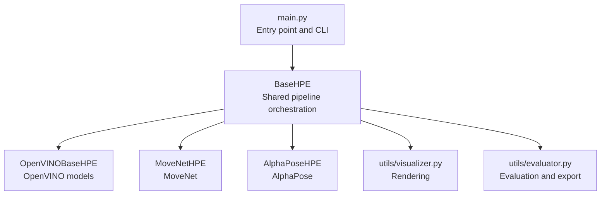
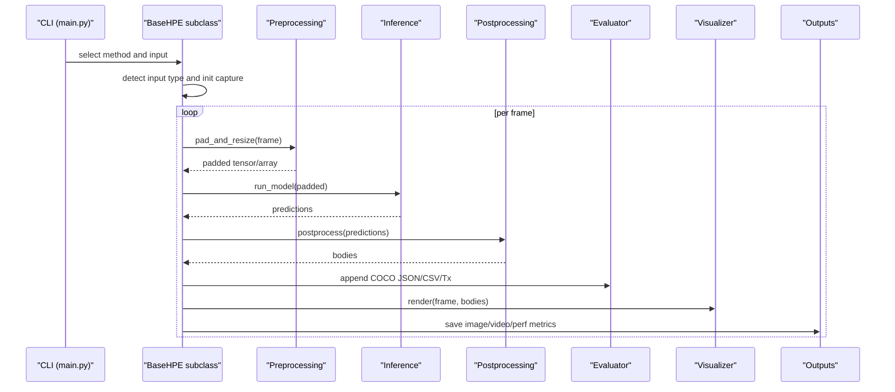
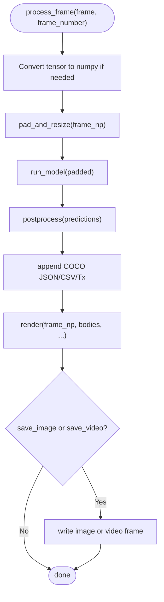
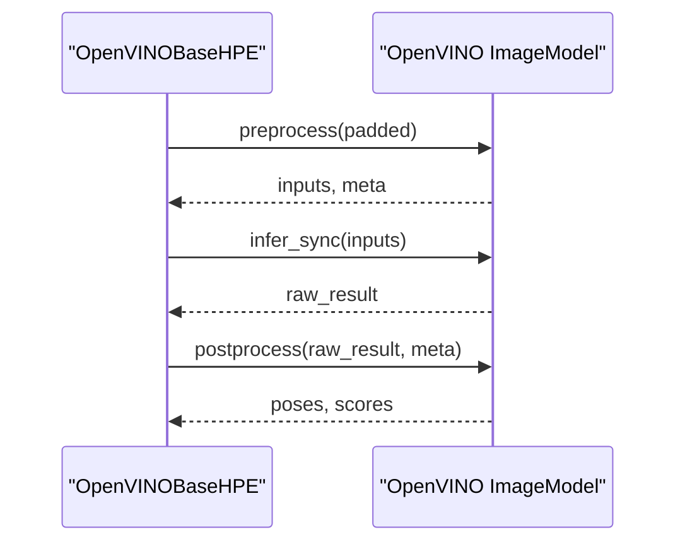
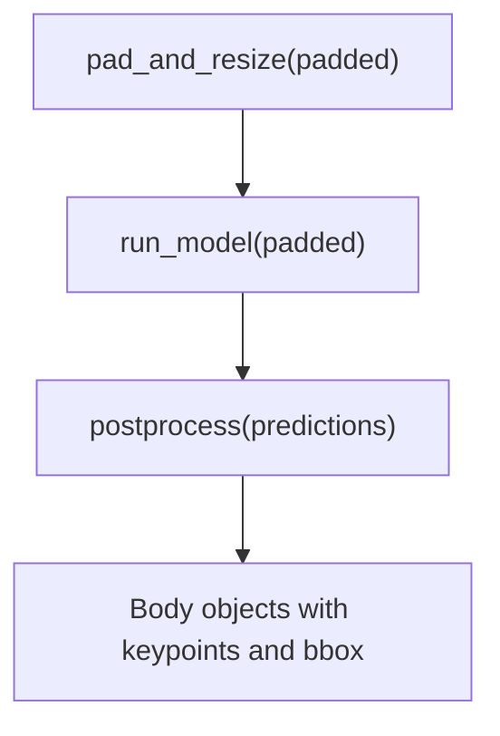
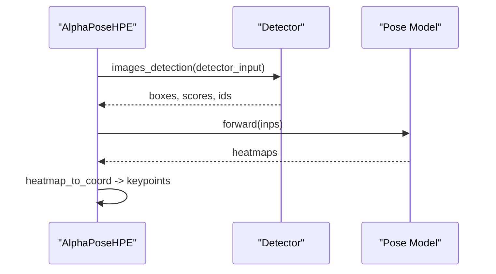
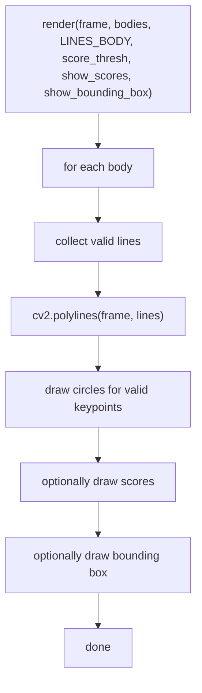
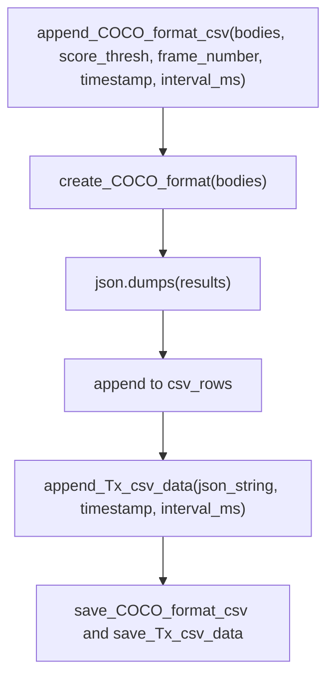
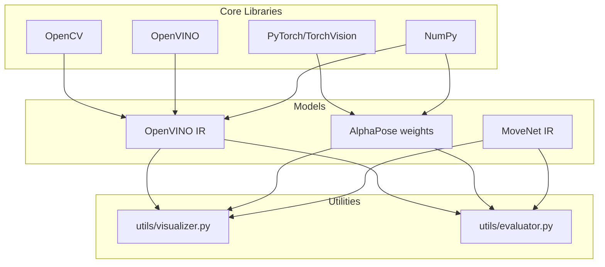

# Data Flow and Processing Pipeline

<cite>
**Referenced Files in This Document**
- [main.py](file://main.py)
- [base_hpe.py](file://base_hpe.py)
- [openvino_base_hpe.py](file://openvino_base_hpe.py)
- [movenet_hpe.py](file://movenet_hpe.py)
- [alphapose_hpe.py](file://alphapose_hpe.py)
- [utils/visualizer.py](file://utils/visualizer.py)
- [utils/evaluator.py](file://utils/evaluator.py)
- [requirements.txt](file://requirements.txt)
</cite>

## Table of Contents
1. [Introduction](#introduction)
2. [Project Structure](#project-structure)
3. [Core Components](#core-components)
4. [Architecture Overview](#architecture-overview)
5. [Detailed Component Analysis](#detailed-component-analysis)
6. [Dependency Analysis](#dependency-analysis)
7. [Performance Considerations](#performance-considerations)
8. [Troubleshooting Guide](#troubleshooting-guide)
9. [Conclusion](#conclusion)

## Introduction
This document explains the end-to-end data flow and processing pipeline for human pose estimation across multiple model backends. It covers input capture, preprocessing (aspect ratio preservation via padding and resizing), inference, postprocessing, evaluation, visualization, and output handling. It also documents real-time and batch processing modes, performance tracking, and export formats.

## Project Structure
The system is organized around a shared base class that orchestrates input handling, preprocessing, inference, postprocessing, and output generation. Concrete implementations exist for different backends:
- OpenVINO-based models (including OpenPose and HRNet variants)
- MoveNet
- AlphaPose

**Diagram sources**
- [main.py:22-99](file://main.py#L22-L99)
- [base_hpe.py:36-546](file://base_hpe.py#L36-L546)
- [openvino_base_hpe.py:55-653](file://openvino_base_hpe.py#L55-L653)
- [movenet_hpe.py:12-111](file://movenet_hpe.py#L12-L111)
- [alphapose_hpe.py:33-334](file://alphapose_hpe.py#L33-L334)
- [utils/visualizer.py:4-49](file://utils/visualizer.py#L4-L49)
- [utils/evaluator.py:11-114](file://utils/evaluator.py#L11-L114)

**Section sources**
- [main.py:22-99](file://main.py#L22-L99)
- [base_hpe.py:36-546](file://base_hpe.py#L36-L546)

## Core Components
- BaseHPE: Abstract base class defining the shared pipeline, input detection, preprocessing, timing, postprocessing hook, and output handling.
- OpenVINOBaseHPE: Implements OpenVINO model loading, preprocessing, inference, and postprocessing for OpenPose and HRNet variants.
- MoveNetHPE: Implements MoveNet model loading and inference with OpenVINO runtime.
- AlphaPoseHPE: Implements AlphaPose with integrated detector and pose estimation, including GPU-accelerated preprocessing and batching.
- utils.visualizer: Renders pose skeletons and optional confidence scores and bounding boxes.
- utils.evaluator: Converts raw detections to COCO format JSON and CSV, and tracks transmission metrics.

**Section sources**
- [base_hpe.py:36-546](file://base_hpe.py#L36-L546)
- [openvino_base_hpe.py:55-653](file://openvino_base_hpe.py#L55-L653)
- [movenet_hpe.py:12-111](file://movenet_hpe.py#L12-L111)
- [alphapose_hpe.py:33-334](file://alphapose_hpe.py#L33-L334)
- [utils/visualizer.py:4-49](file://utils/visualizer.py#L4-L49)
- [utils/evaluator.py:11-114](file://utils/evaluator.py#L11-L114)

## Architecture Overview
The pipeline follows a consistent flow across backends:
1. Input detection: image, directory, video file, HTTP stream, or webcam.
2. Preprocessing: aspect ratio preservation via padding and resizing (when applicable).
3. Inference: model-specific preprocessing, inference, and postprocessing.
4. Postprocessing: conversion to standardized Body objects with keypoints and bounding boxes.
5. Evaluation: COCO JSON and CSV export, plus per-interval transmission metrics.
6. Visualization: rendering skeletons, scores, and optional bounding boxes.
7. Output: saving images, videos, and performance metrics.

**Diagram sources**
- [main.py:22-99](file://main.py#L22-L99)
- [base_hpe.py:207-519](file://base_hpe.py#L207-L519)
- [openvino_base_hpe.py:262-314](file://openvino_base_hpe.py#L262-L314)
- [movenet_hpe.py:83-110](file://movenet_hpe.py#L83-L110)
- [alphapose_hpe.py:126-293](file://alphapose_hpe.py#L126-L293)
- [utils/visualizer.py:4-49](file://utils/visualizer.py#L4-L49)
- [utils/evaluator.py:35-114](file://utils/evaluator.py#L35-L114)

## Detailed Component Analysis

### BaseHPE: Shared Pipeline Orchestration
- Input detection: Supports image, directory, video file, HTTP stream, and webcam. Initializes capture via OpenCV or PyNvCodec when available.
- Preprocessing: Aspect ratio preservation via padding and resizing. Padding is applied to bottom/right to preserve aspect ratio.
- Inference: Abstract hooks for subclasses to implement model-specific preprocessing, inference, and postprocessing.
- Timing: Tracks processing time per frame and calculates FPS over a sliding window.
- Output: Saves images, videos, and writes COCO JSON/CSV and Tx metrics.

**Diagram sources**
- [base_hpe.py:405-519](file://base_hpe.py#L405-L519)

**Section sources**
- [base_hpe.py:36-546](file://base_hpe.py#L36-L546)

### OpenVINOBaseHPE: OpenVINO Models
- Model selection: Supports OpenPose and HRNet variants with configurable input sizes and device selection.
- Loading: Reads IR, configures OpenVINO core with performance hints, CPU pinning, and hyper-threading.
- Preprocessing: Uses model’s ImageModel preprocess to align with target size and aspect ratio.
- Inference: Synchronous inference via infer_sync and postprocess to extract poses and scores.
- Postprocessing: Converts normalized keypoints to original image coordinates, computes bounding boxes, and filters by threshold.

**Diagram sources**
- [openvino_base_hpe.py:183-276](file://openvino_base_hpe.py#L183-L276)

**Section sources**
- [openvino_base_hpe.py:55-653](file://openvino_base_hpe.py#L55-L653)

### MoveNetHPE: MoveNet with OpenVINO Runtime
- Device constraint: MoveNet is CPU-only in this implementation.
- Loading: Reads OpenVINO IR, prints input/output shapes, and compiles the model.
- Preprocessing: Converts BGR to RGB, transposes to CHW, and normalizes to float32.
- Inference: Runs inference via compiled model and extracts pose outputs.
- Postprocessing: Decodes pose outputs, applies padding scaling, and constructs Body objects.

**Diagram sources**
- [movenet_hpe.py:83-110](file://movenet_hpe.py#L83-L110)

**Section sources**
- [movenet_hpe.py:12-111](file://movenet_hpe.py#L12-L111)

### AlphaPoseHPE: Integrated Detector and Pose Estimation
- Device mapping: Maps device to GPU/CPU indices.
- Loading: Loads detector and pose models, sets multiprocessing sharing strategy.
- Preprocessing: For image/directory inputs, uses DetectionLoader; for video/webcam/stream with PyNvCodec, performs GPU-accelerated cropping and resizing.
- Inference: Performs detection and pose estimation in batches, with optional flipping augmentation.
- Postprocessing: Converts heatmap coordinates to normalized keypoints, rescales to padded dimensions, and constructs Body objects.

**Diagram sources**
- [alphapose_hpe.py:126-293](file://alphapose_hpe.py#L126-L293)

**Section sources**
- [alphapose_hpe.py:33-334](file://alphapose_hpe.py#L33-L334)

### Visualization System
- Rendering: Draws skeleton lines, keypoint circles, optional scores, and bounding boxes.
- Thresholding: Only draws connections and keypoints above the score threshold.
- Color coding: Different colors for different keypoints and lines.

**Diagram sources**
- [utils/visualizer.py:4-49](file://utils/visualizer.py#L4-L49)

**Section sources**
- [utils/visualizer.py:4-49](file://utils/visualizer.py#L4-L49)

### Evaluation Pipeline: COCO JSON and CSV Export
- COCO conversion: Converts Body objects to COCO keypoints format with visibility flags.
- JSON export: Aggregates results and writes a single JSON file.
- CSV export: Writes frame number, timestamp, and JSON payload per row.
- Transmission metrics: Computes per-interval byte counts for transmitted JSON payloads.

**Diagram sources**
- [utils/evaluator.py:35-114](file://utils/evaluator.py#L35-L114)

**Section sources**
- [utils/evaluator.py:11-114](file://utils/evaluator.py#L11-L114)

### Output Handling: Images, Videos, and Metrics
- Image saving: Writes annotated frames to JPEG files.
- Video saving: Writes annotated frames to AVI using MJPG codec.
- Metrics: FPS and processing time are printed and stored for performance tracking.

**Section sources**
- [base_hpe.py:501-519](file://base_hpe.py#L501-L519)

## Dependency Analysis
- OpenCV: Used for video capture, frame conversion, and rendering.
- OpenVINO: Used for model loading, preprocessing, inference, and postprocessing.
- PyTorch/TorchVision: Used by AlphaPose for GPU-accelerated preprocessing and inference.
- NumPy: Used throughout for array operations and coordinate transformations.
- COCO utilities: Used for evaluation and JSON/CSV exports.

**Diagram sources**
- [requirements.txt:56-91](file://requirements.txt#L56-L91)
- [openvino_base_hpe.py:183-276](file://openvino_base_hpe.py#L183-L276)
- [movenet_hpe.py:58-86](file://movenet_hpe.py#L58-L86)
- [alphapose_hpe.py:99-111](file://alphapose_hpe.py#L99-L111)
- [utils/visualizer.py:4-49](file://utils/visualizer.py#L4-L49)
- [utils/evaluator.py:11-114](file://utils/evaluator.py#L11-L114)

**Section sources**
- [requirements.txt:56-91](file://requirements.txt#L56-L91)

## Performance Considerations
- Real-time processing:
  - HTTP streams: Uses FFmpeg backend and reduced buffer size to minimize latency.
  - PyNvCodec: Enables hardware-accelerated decoding and conversion to tensors on GPU.
  - OpenCV fallback: Provides reliable decoding when PyNvCodec is unavailable.
- Throughput vs latency:
  - OpenVINO core configuration supports throughput and latency modes with tunable CPU threads, streams, CPU pinning, and hyper-threading.
- Batch processing:
  - AlphaPose supports configurable detection and pose batch sizes for GPU utilization.
- Timing and FPS:
  - Sliding window average of processing times for FPS calculation and console reporting.
- Memory and I/O:
  - Video writing uses MJPG codec; ensure sufficient disk bandwidth for high FPS.

[No sources needed since this section provides general guidance]

## Troubleshooting Guide
- PyNvCodec not available:
  - Falls back to OpenCV for video decoding; prints warnings and sets default dimensions for HTTP streams.
- Unsupported input:
  - Raises errors for invalid or unsupported input sources.
- Stream timeouts and frame limits:
  - Enhanced main loops support timeout and maximum frame count for HTTP streams.
- Frame read failures:
  - OpenCV fallback includes retries and failure thresholds for robustness.
- Device constraints:
  - MoveNet is CPU-only; OpenPose and HRNet variants may be GPU-only depending on model configuration.

**Section sources**
- [base_hpe.py:94-157](file://base_hpe.py#L94-L157)
- [openvino_base_hpe.py:87-90](file://openvino_base_hpe.py#L87-L90)
- [movenet_hpe.py:28-31](file://movenet_hpe.py#L28-L31)
- [base_hpe.py:283-397](file://base_hpe.py#L283-L397)

## Conclusion
The system provides a modular, extensible pipeline for human pose estimation across multiple backends. It emphasizes robust input handling, efficient preprocessing and inference, standardized postprocessing, comprehensive evaluation, and flexible visualization and output options. Real-time and batch modes are supported, with performance tuning exposed through environment variables and CLI arguments.