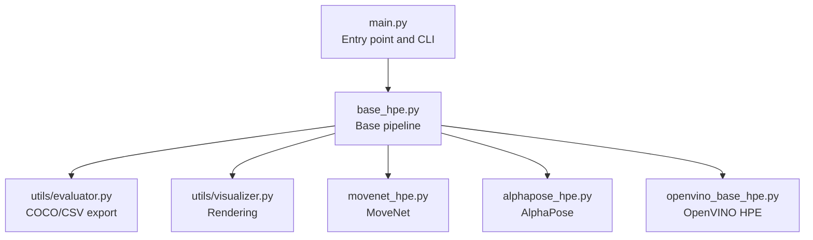
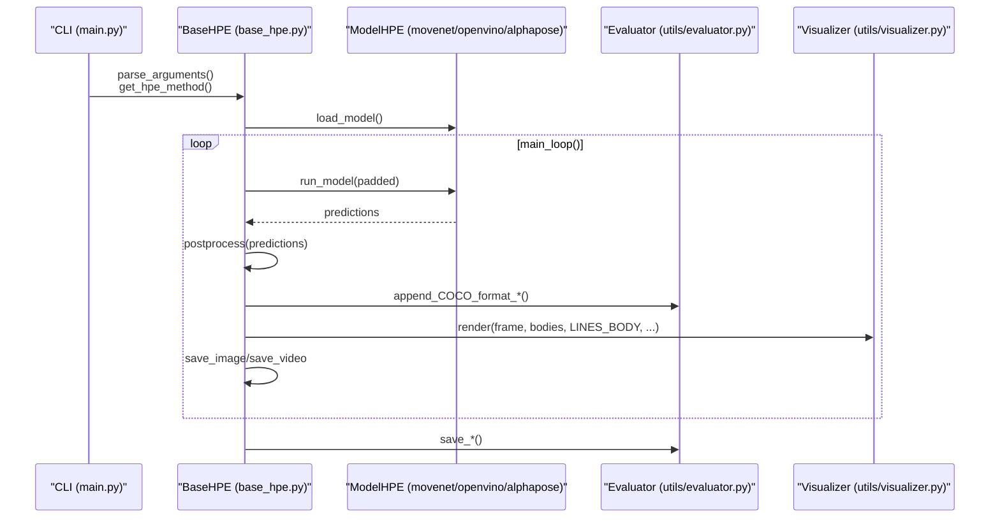
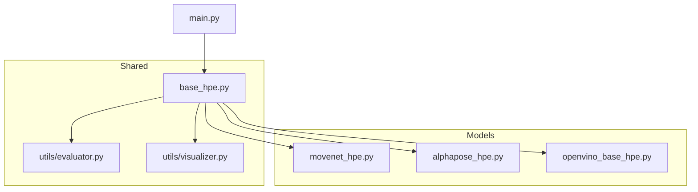

# Evaluation and Visualization System

<cite>
**Referenced Files in This Document**
- [main.py](file://main.py)
- [base_hpe.py](file://base_hpe.py)
- [utils/evaluator.py](file://utils/evaluator.py)
- [utils/visualizer.py](file://utils/visualizer.py)
- [movenet_hpe.py](file://movenet_hpe.py)
- [alphapose_hpe.py](file://alphapose_hpe.py)
- [openvino_base_hpe.py](file://openvino_base_hpe.py)
</cite>

## Table of Contents
1. [Introduction](#introduction)
2. [Project Structure](#project-structure)
3. [Core Components](#core-components)
4. [Architecture Overview](#architecture-overview)
5. [Detailed Component Analysis](#detailed-component-analysis)
6. [Dependency Analysis](#dependency-analysis)
7. [Performance Considerations](#performance-considerations)
8. [Troubleshooting Guide](#troubleshooting-guide)
9. [Conclusion](#conclusion)

## Introduction
This document describes the evaluation and visualization system used to transform pose detections into standardized formats and render visual outputs. It covers:
- Conversion of pose detections into COCO format JSON and CSV structures
- Output generation for processed frames, videos, and evaluation metrics
- Visualization pipeline for skeletons, confidence scores, and bounding boxes
- Coordinate transformation between normalized and pixel coordinates
- Performance monitoring integration for processing times and FPS metrics

## Project Structure
The evaluation and visualization system spans several modules:
- Entry point and orchestration: main.py
- Base pipeline and shared utilities: base_hpe.py
- Evaluation utilities: utils/evaluator.py
- Visualization utilities: utils/visualizer.py
- Model-specific implementations: movenet_hpe.py, alphapose_hpe.py, openvino_base_hpe.py

**Diagram sources**
- [main.py:1-99](file://main.py#L1-L99)
- [base_hpe.py:1-546](file://base_hpe.py#L1-L546)
- [utils/evaluator.py:1-114](file://utils/evaluator.py#L1-L114)
- [utils/visualizer.py:1-49](file://utils/visualizer.py#L1-L49)
- [movenet_hpe.py:1-111](file://movenet_hpe.py#L1-L111)
- [alphapose_hpe.py:1-334](file://alphapose_hpe.py#L1-L334)
- [openvino_base_hpe.py:1-653](file://openvino_base_hpe.py#L1-L653)

**Section sources**
- [main.py:1-99](file://main.py#L1-L99)
- [base_hpe.py:1-546](file://base_hpe.py#L1-L546)

## Core Components
- Evaluation utilities: COCO JSON and CSV export, bandwidth measurement per millisecond
- Visualization utilities: skeleton rendering, confidence score overlay, bounding boxes
- Rendering pipeline: configurable drawing settings and pose format handling
- Output generation: saving frames, videos, and evaluation metrics
- Coordinate transformation: normalized to pixel conversions and padding handling
- Performance monitoring: processing time tracking and FPS computation

**Section sources**
- [utils/evaluator.py:1-114](file://utils/evaluator.py#L1-L114)
- [utils/visualizer.py:1-49](file://utils/visualizer.py#L1-L49)
- [base_hpe.py:161-519](file://base_hpe.py#L161-L519)

## Architecture Overview
The system integrates model-specific inference with a unified evaluation and visualization pipeline. The base class orchestrates input handling, preprocessing, inference, postprocessing, evaluation export, and visualization. Model-specific classes define pose format and skeleton connections.

**Diagram sources**
- [main.py:22-99](file://main.py#L22-L99)
- [base_hpe.py:207-519](file://base_hpe.py#L207-L519)
- [utils/evaluator.py:35-114](file://utils/evaluator.py#L35-L114)
- [utils/visualizer.py:4-49](file://utils/visualizer.py#L4-L49)

## Detailed Component Analysis

### Evaluation Utilities: COCO JSON and CSV Export
The evaluator module converts pose detections into COCO-compatible structures and CSV records, and measures transmitted data volume per millisecond interval.

Key functions and roles:
- create_COCO_format: builds COCO entries with keypoints, visibility flags, and scores
- append_COCO_format_json/csv: accumulates results and writes JSON/CSV outputs
- append_Tx_csv_data: aggregates JSON payload sizes per millisecond interval
- save_COCO_format_json/csv/Tx: persists evaluation artifacts

Coordinate and visibility handling:
- Keypoints are serialized as [x, y, v] triplets
- Visibility flag v is determined by thresholding per-keypoint scores
- Global body score is included for each detection

Bandwidth measurement:
- Timestamps are grouped into intervals based on measurement_interval_ms
- JSON payloads are accumulated per interval and written to CSV with byte counts

Output generation:
- JSON: complete COCO results
- CSV: per-frame records with JSON string payloads
- Tx CSV: per-millisecond byte counts for transmission profiling

**Section sources**
- [utils/evaluator.py:11-114](file://utils/evaluator.py#L11-L114)

### Visualization System: Skeletons, Scores, and Bounding Boxes
The visualizer renders pose skeletons, optional confidence scores, and bounding boxes onto frames. It operates on a list of body objects with keypoints and scores.

Rendering pipeline:
- Skeleton lines: drawn only when both endpoints exceed the score threshold
- Keypoints: circles colored by joint index parity and identity
- Confidence overlays: optional numeric scores near joints
- Bounding boxes: optional rectangles around detected persons

Drawing configuration:
- score_thresh: minimum score to render skeleton and keypoint
- show_scores: toggle score text overlay
- show_bounding_box: toggle bounding box rendering

**Section sources**
- [utils/visualizer.py:4-49](file://utils/visualizer.py#L4-L49)

### Rendering Pipeline: Pose Formats and Drawing Configurations
The rendering pipeline is integrated into the base processing loop and adapts to different pose formats returned by models.

Pipeline stages:
- Inference: model-specific run_model returns either pafs/heatmaps or direct poses
- Postprocessing: base.postprocess constructs Body objects with pixel and normalized coordinates
- Rendering: render draws skeletons and optional overlays
- Output: frames saved as images or encoded into a video

Drawing configurations:
- LINES_BODY: skeleton topology per model
- score_thresh: filtering threshold for visibility
- show_scores/show_bounding_box: toggles for overlays

**Section sources**
- [base_hpe.py:405-519](file://base_hpe.py#L405-L519)

### Output Generation: Frames, Videos, and Metrics
The base pipeline manages saving processed frames and videos, and triggers evaluation exports upon completion.

Saving mechanisms:
- Images: saved individually when enabled
- Video: encoded using VideoWriter with configured codec and FPS
- Evaluation metrics: JSON and CSV exports, plus Tx CSV for bandwidth profiling

Completion handling:
- At loop end, save_COCO_format_json/csv and save_Tx_csv_data are invoked

**Section sources**
- [base_hpe.py:277-404](file://base_hpe.py#L277-L404)

### Coordinate Transformation: Normalized to Pixel Coordinates
Models operate on different input sizes and padding strategies. The system maintains both normalized and pixel coordinates for evaluation and visualization.

Normalization and padding:
- Body stores keypoints_norm (0..1) and keypoints (pixel)
- Padding is computed to preserve aspect ratio, applied to input frames
- Postprocessing scales normalized coordinates to padded dimensions and then to original image dimensions

MoveNet specifics:
- Outputs are scaled by padded dimensions and then mapped to original image
- Bounding boxes are computed from scaled coordinates

AlphaPose specifics:
- No padding/resizing for AlphaPose inputs
- Normalized coordinates are rescaled to padded dimensions during postprocessing

OpenVINO specifics:
- Uses model-specific scaling and padding modes
- Postprocessing reconstructs pixel coordinates from normalized model outputs

**Section sources**
- [base_hpe.py:19-34](file://base_hpe.py#L19-L34)
- [movenet_hpe.py:88-111](file://movenet_hpe.py#L88-L111)
- [alphapose_hpe.py:295-334](file://alphapose_hpe.py#L295-L334)
- [openvino_base_hpe.py:278-314](file://openvino_base_hpe.py#L278-L314)

### Performance Monitoring: Processing Times and FPS Metrics
The pipeline tracks processing times and computes instantaneous and average FPS metrics.

Tracking mechanism:
- Timing starts before inference and stops after postprocessing
- Processing durations are appended to a sliding window deque
- Mean processing time is used to derive FPS

Visualization:
- FPS and inference time are overlaid on frames
- Console output displays periodic updates

**Section sources**
- [base_hpe.py:405-484](file://base_hpe.py#L405-L484)

## Dependency Analysis
The evaluation and visualization system exhibits clear separation of concerns with low coupling between model implementations and shared utilities.

**Diagram sources**
- [base_hpe.py:16-17](file://base_hpe.py#L16-L17)
- [utils/evaluator.py:1-2](file://utils/evaluator.py#L1-L2)
- [utils/visualizer.py:1-2](file://utils/visualizer.py#L1-L2)
- [movenet_hpe.py:7](file://movenet_hpe.py#L7)
- [alphapose_hpe.py:7](file://alphapose_hpe.py#L7)
- [openvino_base_hpe.py:12-13](file://openvino_base_hpe.py#L12-L13)

**Section sources**
- [base_hpe.py:16-17](file://base_hpe.py#L16-L17)
- [utils/evaluator.py:1-2](file://utils/evaluator.py#L1-L2)
- [utils/visualizer.py:1-2](file://utils/visualizer.py#L1-L2)

## Performance Considerations
- Sliding window averaging: Using a fixed-size deque for processing times ensures responsiveness to recent performance trends.
- Rendering overhead: Rendering skeletons and text adds CPU cost; toggling show_scores and show_bounding_box can reduce overhead.
- Bandwidth profiling: Tx CSV aggregation groups JSON payloads by millisecond intervals; adjust measurement_interval_ms for desired granularity.
- Model-specific optimizations: MoveNet and OpenVINO implementations include device selection and model-specific scaling to minimize overhead.

[No sources needed since this section provides general guidance]

## Troubleshooting Guide
Common issues and resolutions:
- Missing LINES_BODY: Ensure child classes define skeleton topology; otherwise rendering is skipped with a warning.
- Empty or invalid detections: Postprocessing filters by score thresholds; verify score_thresh and model confidence outputs.
- Video output errors: Confirm output_dir exists and VideoWriter initialization succeeds; check codec and FPS settings.
- Stream timeouts: For HTTP streams, ensure timeout and max_frames parameters are set appropriately; verify stream availability.
- Coordinate mismatches: Verify padding and scaling logic aligns with model input requirements; check normalized vs pixel conversions.

**Section sources**
- [base_hpe.py:501-519](file://base_hpe.py#L501-L519)
- [base_hpe.py:316-395](file://base_hpe.py#L316-L395)

## Conclusion
The evaluation and visualization system provides a robust framework for transforming pose detections into standardized formats, rendering visual outputs, and profiling performance. Its modular design enables easy integration of new models while maintaining consistent evaluation and visualization behavior. By leveraging normalized-to-pixel coordinate transformations and configurable rendering settings, the system supports diverse deployment scenarios and performance monitoring needs.