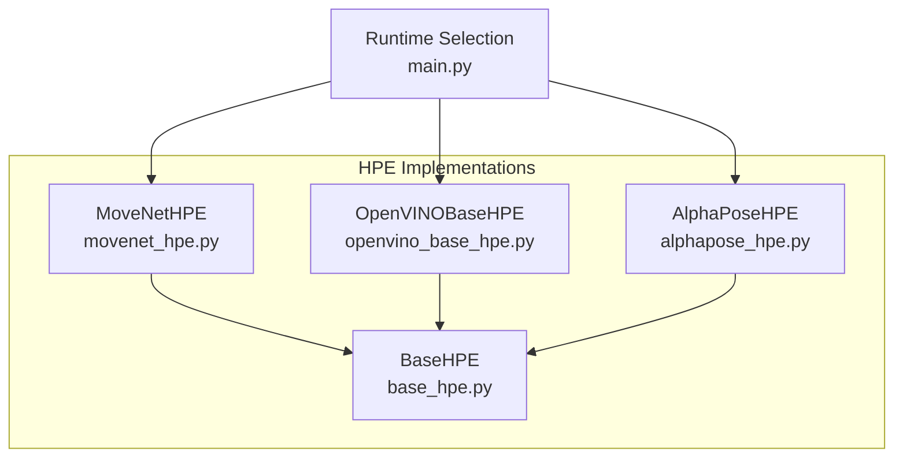
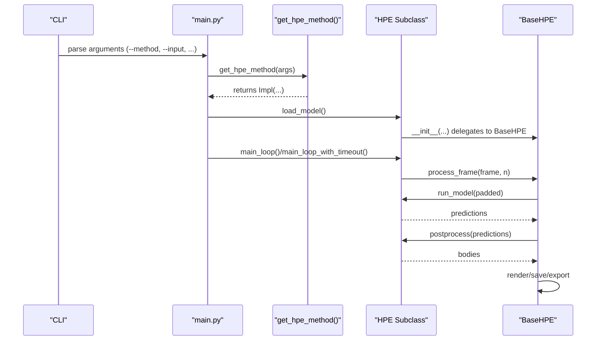
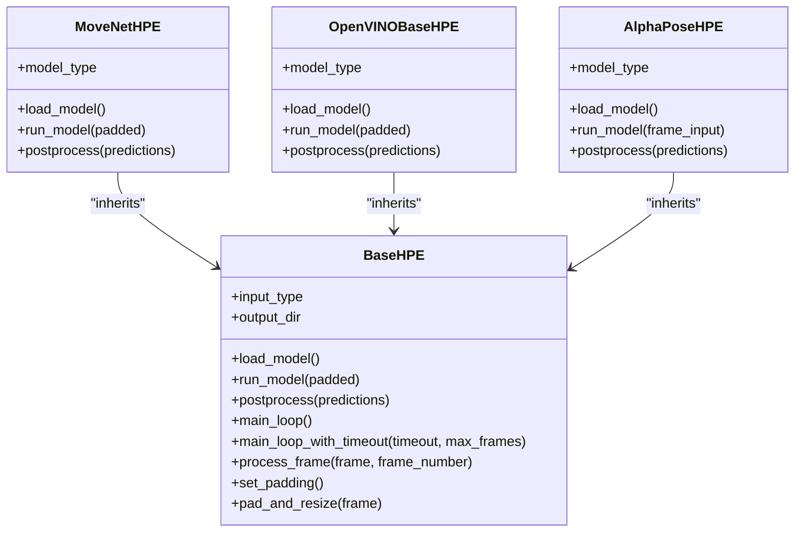
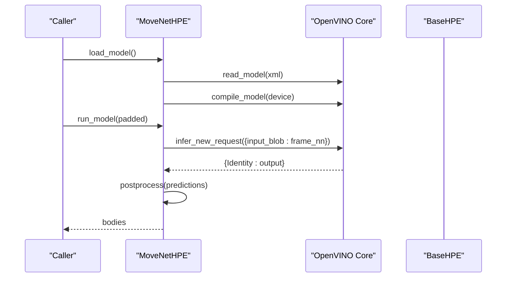
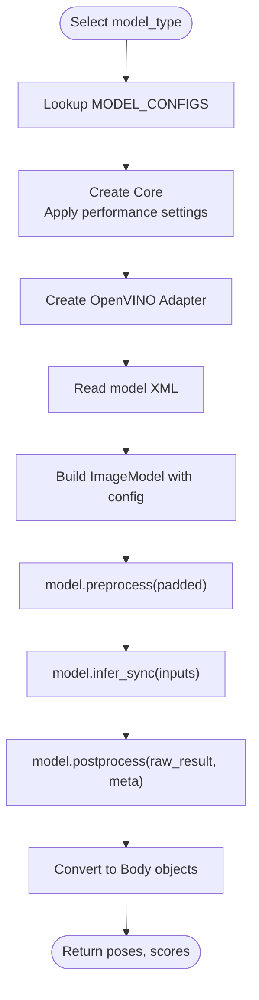
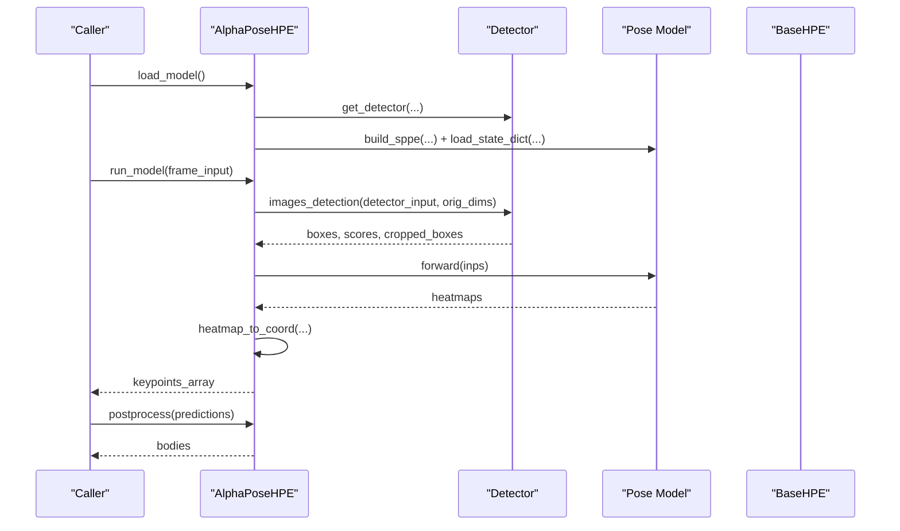
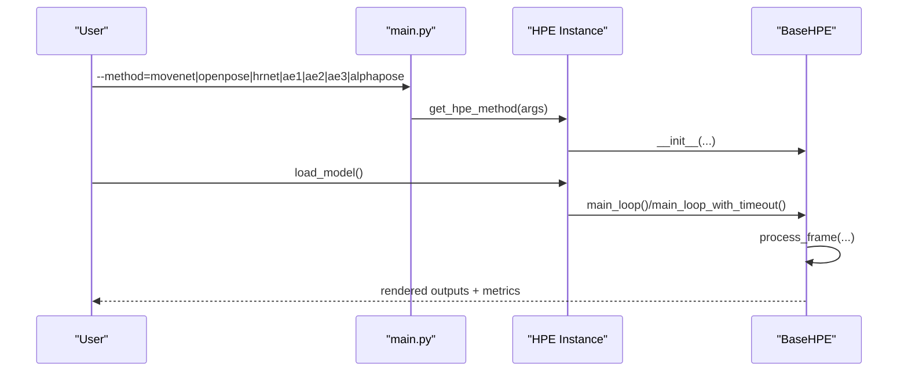
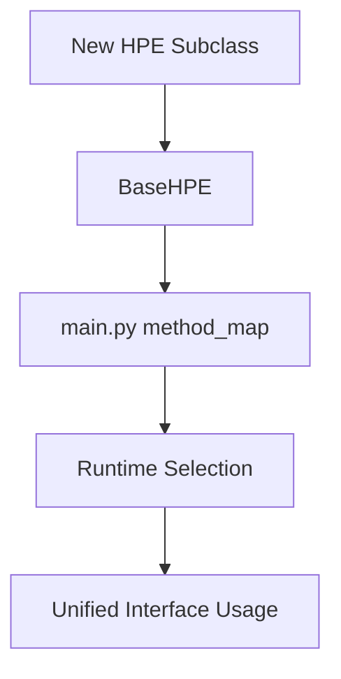
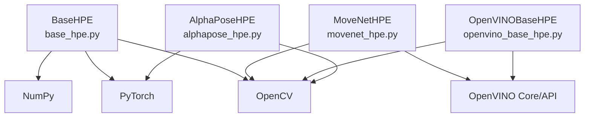

# Model Implementation Patterns

<cite>
**Referenced Files in This Document**
- [base_hpe.py](file://base_hpe.py)
- [movenet_hpe.py](file://movenet_hpe.py)
- [openvino_base_hpe.py](file://openvino_base_hpe.py)
- [alphapose_hpe.py](file://alphapose_hpe.py)
- [main.py](file://main.py)
</cite>

## Table of Contents
1. [Introduction](#introduction)
2. [Project Structure](#project-structure)
3. [Core Components](#core-components)
4. [Architecture Overview](#architecture-overview)
5. [Detailed Component Analysis](#detailed-component-analysis)
6. [Dependency Analysis](#dependency-analysis)
7. [Performance Considerations](#performance-considerations)
8. [Troubleshooting Guide](#troubleshooting-guide)
9. [Conclusion](#conclusion)

## Introduction
This document explains the model implementation patterns used across Human Pose Estimation (HPE) implementations in this codebase. It focuses on how different HPE implementations inherit from a shared BaseHPE abstraction and override abstract methods to provide specific functionality. It documents the strategy pattern enabling runtime selection among AlphaPose, OpenPose, HigherHRNet, EfficientHRNet variants, and MoveNet. It also details differences in model loading, preprocessing, inference execution, and postprocessing across implementations, and how each subclass adapts to model-specific data formats, tensor shapes, and output processing. Finally, it demonstrates how the unified interface enables seamless switching between algorithms without changing client code and outlines the extensibility mechanism for adding new HPE implementations.

## Project Structure
The HPE implementations live alongside a shared base class and a main entry that selects the desired algorithm at runtime.

**Diagram sources**
- [base_hpe.py:36-546](file://base_hpe.py#L36-L546)
- [movenet_hpe.py:12-111](file://movenet_hpe.py#L12-L111)
- [openvino_base_hpe.py:55-653](file://openvino_base_hpe.py#L55-L653)
- [alphapose_hpe.py:33-334](file://alphapose_hpe.py#L33-L334)
- [main.py:64-94](file://main.py#L64-L94)

**Section sources**
- [main.py:64-94](file://main.py#L64-L94)
- [base_hpe.py:36-546](file://base_hpe.py#L36-L546)

## Core Components
- BaseHPE: Defines the unified interface and shared orchestration logic for input handling, preprocessing, inference, postprocessing, rendering, and saving outputs. It declares abstract methods for model loading, inference, and postprocessing, ensuring all subclasses implement them consistently.
- MoveNetHPE: Implements OpenVINO-based multipose MoveNet with fixed 256x256 input and a dedicated postprocessor that decodes per-person keypoints, bounding boxes, and scores from a flattened tensor.
- OpenVINOBaseHPE: Provides a strategy for selecting among multiple OpenVINO models (OpenPose, HigherHRNet, EfficientHRNet variants) via a configuration map. It centralizes model loading, preprocessing, inference, and postprocessing using the OpenVINO Model API.
- AlphaPoseHPE: Integrates the AlphaPose stack (detector + pose model) with custom preprocessing and postprocessing tailored to AlphaPose’s heatmap-to-coordinate conversion and optional detector integration.

Key shared capabilities:
- Unified input handling supporting images, directories, videos, HTTP streams, and webcams.
- Consistent preprocessing pipeline (padding and resizing) with model-specific overrides.
- Shared postprocessing and rendering pipeline that converts model outputs into standardized Body objects.
- Optional JSON/COCO export and CSV metrics collection.

**Section sources**
- [base_hpe.py:36-546](file://base_hpe.py#L36-L546)
- [movenet_hpe.py:12-111](file://movenet_hpe.py#L12-L111)
- [openvino_base_hpe.py:55-653](file://openvino_base_hpe.py#L55-L653)
- [alphapose_hpe.py:33-334](file://alphapose_hpe.py#L33-L334)

## Architecture Overview
The runtime selection strategy maps a method identifier to a constructor that instantiates the appropriate HPE subclass. The chosen subclass inherits BaseHPE and overrides abstract methods to implement model-specific behavior.

**Diagram sources**
- [main.py:22-46](file://main.py#L22-L46)
- [main.py:64-94](file://main.py#L64-L94)
- [base_hpe.py:207-519](file://base_hpe.py#L207-L519)

## Detailed Component Analysis

### BaseHPE: Strategy Abstraction and Orchestration
- Responsibilities:
  - Input detection and initialization (image, directory, video, HTTP stream, webcam).
  - Video/Webcam fallback using OpenCV or hardware-accelerated decoding via PyNvCodec when available.
  - Unified preprocessing: padding and resizing to a target model shape.
  - Inference orchestration: calls subclass-implemented run_model and postprocess.
  - Rendering and saving outputs (images/videos) and exporting metrics (JSON/COCO/CSV).
- Abstract methods enforced by subclasses:
  - load_model: initialize model(s) and internal state.
  - run_model: accept preprocessed input and return model-specific predictions.
  - postprocess: convert predictions to standardized Body objects.

**Diagram sources**
- [base_hpe.py:36-546](file://base_hpe.py#L36-L546)
- [movenet_hpe.py:12-111](file://movenet_hpe.py#L12-L111)
- [openvino_base_hpe.py:55-653](file://openvino_base_hpe.py#L55-L653)
- [alphapose_hpe.py:33-334](file://alphapose_hpe.py#L33-L334)

**Section sources**
- [base_hpe.py:36-546](file://base_hpe.py#L36-L546)

### MoveNetHPE: OpenVINO Multipose MoveNet
- Strategy pattern usage:
  - Runtime selection via method identifier mapped to MoveNetHPE.
- Model loading:
  - Reads OpenVINO XML and compiles the model for CPU/GPU.
  - Logs input/output blob shapes and sets model-specific dimensions.
- Preprocessing:
  - Converts BGR to RGB, transposes to CHW, casts to float32, adds batch dimension.
- Inference:
  - Executes inference using the compiled network and returns a dictionary-like result.
- Postprocessing:
  - Decodes per-person keypoints, bounding boxes, and scores from a flattened tensor.
  - Rescales coordinates to padded image dimensions and normalizes to original image.
- Rendering:
  - Uses predefined body skeleton connections for drawing.

**Diagram sources**
- [movenet_hpe.py:58-111](file://movenet_hpe.py#L58-L111)
- [base_hpe.py:405-519](file://base_hpe.py#L405-L519)

**Section sources**
- [movenet_hpe.py:12-111](file://movenet_hpe.py#L12-L111)

### OpenVINOBaseHPE: Strategy for Multiple OpenVINO Models
- Strategy pattern usage:
  - Runtime selection via method identifiers mapped to OpenVINOBaseHPE with a specific model_type.
  - Centralized MODEL_CONFIGS defines supported architectures, input sizes, and GPU support.
- Model loading:
  - Creates OpenVINO Core, applies performance hints (latency/throughput), CPU pinning, and hyper-threading.
  - Builds an OpenVINO model adapter and loads the selected model via the Model API.
- Preprocessing:
  - Delegates to model.preprocess to align with the model’s expected input format and aspect ratio.
- Inference:
  - Runs inference via model.infer_sync and retrieves poses and scores.
- Postprocessing:
  - Converts normalized keypoints to original image coordinates, computes bounding boxes, and creates Body objects.
- Rendering:
  - Uses shared skeleton connections for drawing.

**Diagram sources**
- [openvino_base_hpe.py:22-53](file://openvino_base_hpe.py#L22-L53)
- [openvino_base_hpe.py:183-277](file://openvino_base_hpe.py#L183-L277)
- [openvino_base_hpe.py:278-314](file://openvino_base_hpe.py#L278-L314)

**Section sources**
- [openvino_base_hpe.py:55-653](file://openvino_base_hpe.py#L55-L653)

### AlphaPoseHPE: Integrated Detector + Pose Model
- Strategy pattern usage:
  - Runtime selection via method identifier mapped to AlphaPoseHPE.
- Model loading:
  - Loads a detector (e.g., YOLO) and a pose model (SPPE) with optional multiprocessing sharing strategy.
  - Supports both image/directory inputs (via a dedicated loader) and video/webcam/stream inputs.
- Preprocessing:
  - Overrides padding/resizing to preserve original resolution (no padding).
  - Performs GPU-accelerated detection and cropping/resizing for the pose model.
- Inference:
  - Performs detection on the input, extracts human detections, crops and normalizes regions, and runs pose estimation.
  - Aggregates heatmaps and converts them to coordinate-space using a heatmap-to-coord function.
- Postprocessing:
  - Filters low-confidence keypoints, computes bounding boxes in normalized coordinates, rescales to padded dimensions, and builds Body objects.

**Diagram sources**
- [alphapose_hpe.py:69-334](file://alphapose_hpe.py#L69-L334)
- [base_hpe.py:405-519](file://base_hpe.py#L405-L519)

**Section sources**
- [alphapose_hpe.py:33-334](file://alphapose_hpe.py#L33-L334)

### Unified Interface and Seamless Switching
- The main entry maps method identifiers to constructors for each HPE implementation.
- After construction, the caller invokes load_model and then main_loop or main_loop_with_timeout.
- The BaseHPE orchestrates input handling, preprocessing, inference, postprocessing, rendering, and saving—abstracting away model-specific differences.

**Diagram sources**
- [main.py:22-46](file://main.py#L22-L46)
- [main.py:64-94](file://main.py#L64-L94)
- [base_hpe.py:207-519](file://base_hpe.py#L207-L519)

**Section sources**
- [main.py:64-94](file://main.py#L64-L94)
- [base_hpe.py:207-519](file://base_hpe.py#L207-L519)

### Extensibility Mechanism
To add a new HPE implementation:
- Create a new subclass of BaseHPE.
- Implement load_model to initialize model(s) and internal state.
- Implement run_model to accept preprocessed input and return model-specific predictions.
- Implement postprocess to convert predictions to standardized Body objects.
- Optionally override set_padding and pad_and_resize if the model does not require padding/resizing.
- Register the new implementation in the runtime selection map in main.py to enable runtime selection.

**Diagram sources**
- [base_hpe.py:36-546](file://base_hpe.py#L36-L546)
- [main.py:64-94](file://main.py#L64-L94)

**Section sources**
- [base_hpe.py:36-546](file://base_hpe.py#L36-L546)
- [main.py:64-94](file://main.py#L64-L94)

## Dependency Analysis
- BaseHPE depends on OpenCV, PyTorch, NumPy, and visualization/evaluation utilities.
- MoveNetHPE depends on OpenVINO runtime and uses OpenCV for preprocessing.
- OpenVINOBaseHPE depends on the OpenVINO Model API and integrates performance tuning.
- AlphaPoseHPE depends on the AlphaPose library stack and PyTorch/TorchVision for transforms and GPU operations.

**Diagram sources**
- [base_hpe.py:1-18](file://base_hpe.py#L1-L18)
- [movenet_hpe.py:3-7](file://movenet_hpe.py#L3-L7)
- [openvino_base_hpe.py:15-20](file://openvino_base_hpe.py#L15-L20)
- [alphapose_hpe.py:1-7](file://alphapose_hpe.py#L1-L7)

**Section sources**
- [base_hpe.py:1-18](file://base_hpe.py#L1-L18)
- [movenet_hpe.py:3-7](file://movenet_hpe.py#L3-L7)
- [openvino_base_hpe.py:15-20](file://openvino_base_hpe.py#L15-L20)
- [alphapose_hpe.py:1-7](file://alphapose_hpe.py#L1-L7)

## Performance Considerations
- MoveNetHPE:
  - Fixed 256x256 input; lightweight postprocessing decodes per-person outputs.
  - GPU acceleration via OpenVINO; CPU fallback is supported but flagged.
- OpenVINOBaseHPE:
  - Configurable performance mode (latency/throughput), CPU threads, streams, CPU pinning, and hyper-threading.
  - Uses the OpenVINO Model API for optimized preprocessing and inference.
- AlphaPoseHPE:
  - GPU-accelerated detection and cropping; supports multi-GPU via DataParallel.
  - Heatmap-to-coordinate conversion performed on CPU; consider offloading if feasible.

[No sources needed since this section provides general guidance]

## Troubleshooting Guide
- MoveNetHPE:
  - If GPU is requested but not supported by the model, the implementation falls back to CPU and prints an informational message.
- OpenVINOBaseHPE:
  - For HTTP streams, ensure FFmpeg backend is available; the implementation initializes video capture lazily for streaming URLs.
  - If model loading fails, verify the XML path and device compatibility.
- AlphaPoseHPE:
  - If multiprocessing sharing strategy is disabled, ensure compatible sharing strategy is configured.
  - If detection yields no humans, confirm detector input size and normalization match the model expectations.

**Section sources**
- [movenet_hpe.py:28-31](file://movenet_hpe.py#L28-L31)
- [openvino_base_hpe.py:133-151](file://openvino_base_hpe.py#L133-L151)
- [openvino_base_hpe.py:183-260](file://openvino_base_hpe.py#L183-L260)
- [alphapose_hpe.py:57-66](file://alphapose_hpe.py#L57-L66)

## Conclusion
The HPE implementations leverage a clean inheritance pattern from BaseHPE to enforce a consistent interface while allowing each algorithm to specialize in model loading, preprocessing, inference, and postprocessing. The runtime selection strategy in main.py enables seamless switching between AlphaPose, OpenPose, HigherHRNet, EfficientHRNet variants, and MoveNet without altering client code. The documented differences in model-specific data formats, tensor shapes, and output processing illustrate how each subclass adapts to its underlying framework. The extensibility mechanism further simplifies adding new HPE implementations by adhering to the shared abstract methods and integrating into the selection map.