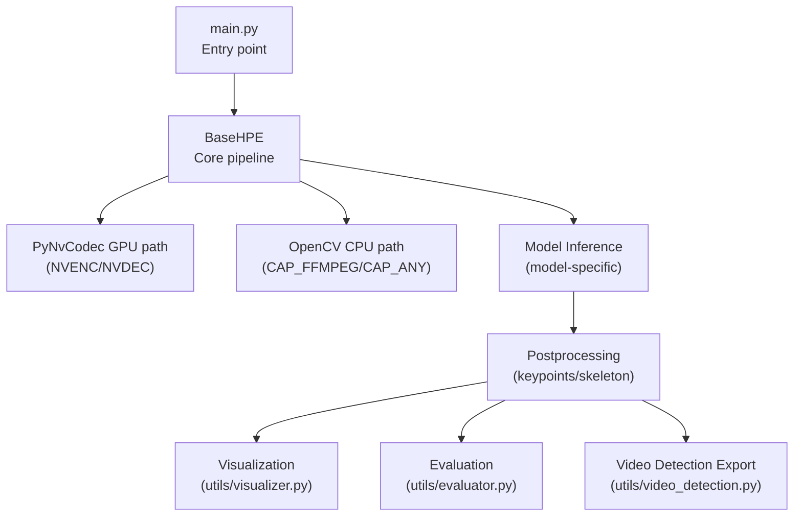
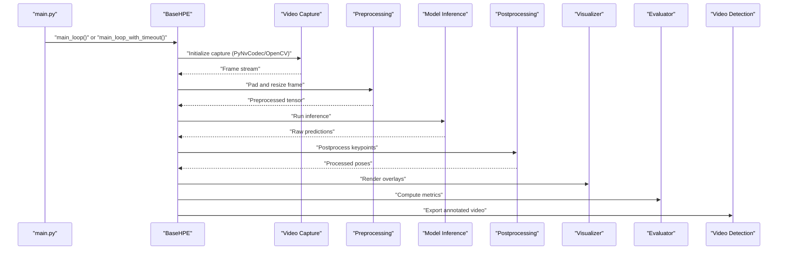
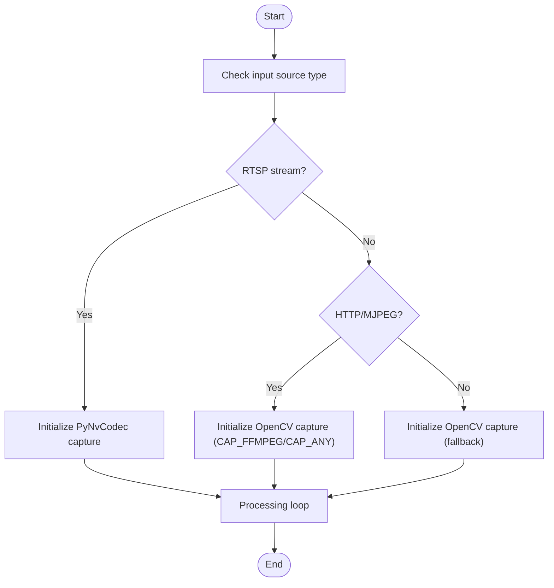
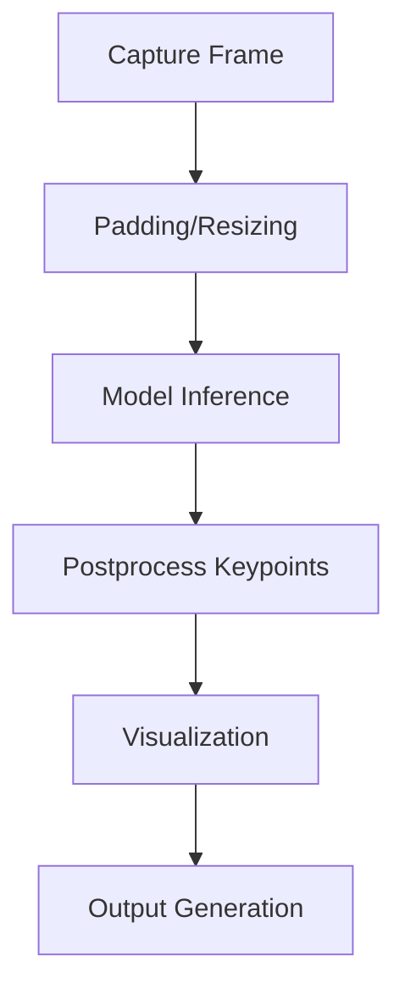
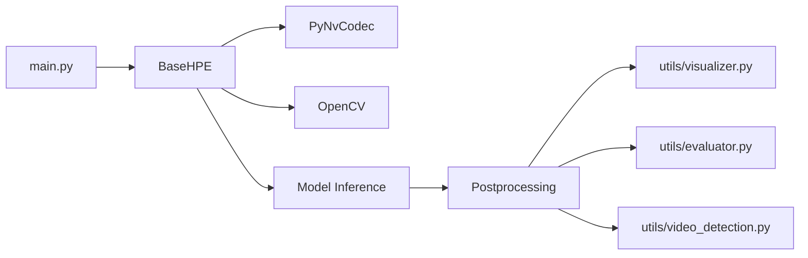

# Pipeline Architecture

<cite>
**Referenced Files in This Document**
- [base_hpe.py](file://base_hpe.py)
- [main.py](file://main.py)
- [openvino_base_hpe.py](file://openvino_base_hpe.py)
- [utils/visualizer.py](file://utils/visualizer.py)
- [utils/evaluator.py](file://utils/evaluator.py)
- [utils/video_detection.py](file://utils/video_detection.py)
</cite>

## Table of Contents
1. [Introduction](#introduction)
2. [Project Structure](#project-structure)
3. [Core Components](#core-components)
4. [Architecture Overview](#architecture-overview)
5. [Detailed Component Analysis](#detailed-component-analysis)
6. [Dependency Analysis](#dependency-analysis)
7. [Performance Considerations](#performance-considerations)
8. [Troubleshooting Guide](#troubleshooting-guide)
9. [Conclusion](#conclusion)

## Introduction
This document describes the video processing pipeline architecture that orchestrates data flow from input sources through model inference to output generation. It focuses on the BaseHPE main processing loops, the dual-path GPU-accelerated and CPU fallback execution modes, and the integrated utility modules for visualization, evaluation, and result export. The goal is to provide a clear understanding of how raw input is transformed through capture, preprocessing, inference, postprocessing, and rendering.

## Project Structure
The pipeline spans several modules:
- Core orchestration and processing loops in BaseHPE
- Model-specific implementations (e.g., OpenVINO variant)
- Utility modules for visualization, evaluation, and video detection
- Application entry point that selects processing mode and invokes the loops

**Diagram sources**
- [main.py](file://main.py)
- [base_hpe.py](file://base_hpe.py)
- [openvino_base_hpe.py](file://openvino_base_hpe.py)
- [utils/visualizer.py](file://utils/visualizer.py)
- [utils/evaluator.py](file://utils/evaluator.py)
- [utils/video_detection.py](file://utils/video_detection.py)

**Section sources**
- [main.py](file://main.py)
- [base_hpe.py](file://base_hpe.py)

## Core Components
- BaseHPE: Defines the abstract base class with two primary processing loops:
  - main_loop(): Processes complete video files or persistent streams without timeout constraints
  - main_loop_with_timeout(timeout_seconds, max_frames): Supports bounded execution for live or testing scenarios
- Dual-path execution:
  - GPU-accelerated via PyNvCodec (NVENC/NVDEC) for RTSP and video files
  - CPU fallback via OpenCV with FFmpeg backend for MJPEG-over-HTTP and general compatibility
- Model inference and postprocessing: Implemented in model-specific subclasses (e.g., OpenVINO variant)
- Utilities: Visualization, evaluation, and video export helpers

Key responsibilities:
- Input capture abstraction and initialization
- Frame preprocessing (padding, resizing)
- Inference execution and result retrieval
- Pose postprocessing and visualization
- Structured logging and session lifecycle management

**Section sources**
- [base_hpe.py](file://base_hpe.py)
- [openvino_base_hpe.py](file://openvino_base_hpe.py)

## Architecture Overview
The pipeline follows a staged flow: input capture → preprocessing → inference → postprocessing → visualization/evaluation/export. The BaseHPE class centralizes control and delegates model-specific inference to subclasses. The dual-path architecture ensures robustness across diverse input sources and hardware configurations.

**Diagram sources**
- [main.py](file://main.py)
- [base_hpe.py](file://base_hpe.py)
- [openvino_base_hpe.py](file://openvino_base_hpe.py)
- [utils/visualizer.py](file://utils/visualizer.py)
- [utils/evaluator.py](file://utils/evaluator.py)
- [utils/video_detection.py](file://utils/video_detection.py)

## Detailed Component Analysis

### BaseHPE Main Loops
- main_loop():
  - Designed for complete video processing or continuous streaming without timeout
  - Orchestrates capture initialization, frame acquisition, preprocessing, inference, postprocessing, and output rendering
  - Suitable for offline processing and long-running streams
- main_loop_with_timeout(timeout_seconds, max_frames):
  - Adds bounded execution semantics for live scenarios or controlled experiments
  - Limits total runtime and/or frame count to prevent unbounded processing
  - Integrates structured logging for session start/end and input metadata

Operational flow highlights:
- Input selection and capture initialization
- Frame acquisition loop with error handling
- Preprocessing pipeline (padding/resizing)
- Inference invocation and result retrieval
- Postprocessing and visualization
- Session logging and resource cleanup

**Section sources**
- [base_hpe.py](file://base_hpe.py)
- [main.py](file://main.py)

### Dual-Path Execution Architecture
The pipeline supports two execution paths to maximize compatibility and performance:

1) PyNvCodec GPU-accelerated path:
- Uses NVENC/NVDEC for efficient decoding/encoding
- Handles RTSP streams and video files with hardware acceleration
- Preferred for high-throughput scenarios and reduced CPU utilization

2) OpenCV CPU fallback path:
- Uses OpenCV with FFmpeg backend (CAP_FFMPEG) or generic capture (CAP_ANY)
- Handles MJPEG-over-HTTP and general-purpose video sources
- Ensures broad compatibility when GPU acceleration is unavailable

Fallback guardrails:
- Explicit checks ensure RTSP streams are not routed to HTTP/MJPEG fallback
- Runtime errors guide diagnostics when initialization fails

**Diagram sources**
- [base_hpe.py](file://base_hpe.py)

**Section sources**
- [base_hpe.py](file://base_hpe.py)

### Frame Processing Pipeline
The frame processing stages are orchestrated within the main loops:

1) Video capture abstraction:
- Initializes the appropriate capture backend based on input type
- Provides a unified interface for frame acquisition across GPU and CPU paths

2) Frame preprocessing:
- Applies padding and resizing to normalize input dimensions
- Ensures tensor format alignment with model expectations

3) Model inference:
- Executes the model-specific inference routine
- Returns raw predictions suitable for postprocessing

4) Pose postprocessing:
- Converts raw model outputs to pose keypoints and skeleton structures
- Performs optional NMS or refinement steps depending on the model

5) Visualization rendering:
- Draws pose overlays, bounding boxes, and optional annotations
- Integrates with the visualization utility module

**Diagram sources**
- [base_hpe.py](file://base_hpe.py)
- [openvino_base_hpe.py](file://openvino_base_hpe.py)
- [utils/visualizer.py](file://utils/visualizer.py)

**Section sources**
- [base_hpe.py](file://base_hpe.py)
- [openvino_base_hpe.py](file://openvino_base_hpe.py)

### Integration with Utility Modules
The pipeline integrates with utility modules for:
- Visualization: Renders pose overlays and annotations onto frames
- Evaluation: Computes metrics against ground truth or evaluates quality
- Video detection export: Writes processed frames to output video with annotations

These integrations occur after postprocessing and before session termination, ensuring results are persisted and visualized consistently.

**Section sources**
- [utils/visualizer.py](file://utils/visualizer.py)
- [utils/evaluator.py](file://utils/evaluator.py)
- [utils/video_detection.py](file://utils/video_detection.py)

## Dependency Analysis
The pipeline exhibits layered dependencies:
- Entry point depends on BaseHPE to select and invoke the appropriate processing loop
- BaseHPE depends on capture backends (PyNvCodec or OpenCV) and delegates inference to model-specific subclasses
- Postprocessing and visualization depend on utility modules
- Evaluation and export depend on utility modules and model outputs

**Diagram sources**
- [main.py](file://main.py)
- [base_hpe.py](file://base_hpe.py)
- [openvino_base_hpe.py](file://openvino_base_hpe.py)
- [utils/visualizer.py](file://utils/visualizer.py)
- [utils/evaluator.py](file://utils/evaluator.py)
- [utils/video_detection.py](file://utils/video_detection.py)

**Section sources**
- [main.py](file://main.py)
- [base_hpe.py](file://base_hpe.py)

## Performance Considerations
- Prefer GPU-accelerated PyNvCodec path for RTSP and video files to minimize CPU load and increase throughput
- Use main_loop_with_timeout for live scenarios to bound resource consumption
- Ensure proper buffering and frame sizing to avoid repeated rescaling overhead
- Monitor bitrate and frame statistics during development to tune capture parameters

## Troubleshooting Guide
Common issues and resolutions:
- RTSP streams falling back to HTTP/MJPEG: Indicates PyNvCodec or OpenCV FFmpeg backend initialization failure. Verify hardware availability and backend support.
- Non-HTTP sources reaching fallback path: Suggests OpenCV capture initialization problems. Confirm device permissions and driver availability.
- Camera warm-up failures: Allow time for camera stabilization before frame acquisition; retry frame reads if initial attempts fail.

**Section sources**
- [base_hpe.py](file://base_hpe.py)
- [simple_test.py](file://simple_test.py)

## Conclusion
The pipeline architecture centers on BaseHPE’s dual-path execution model and robust main loops, enabling seamless operation across diverse input sources and hardware configurations. By separating concerns into capture, preprocessing, inference, postprocessing, and output generation, the system achieves modularity, maintainability, and extensibility. Integration with visualization, evaluation, and export utilities completes the end-to-end workflow from raw input to actionable results.