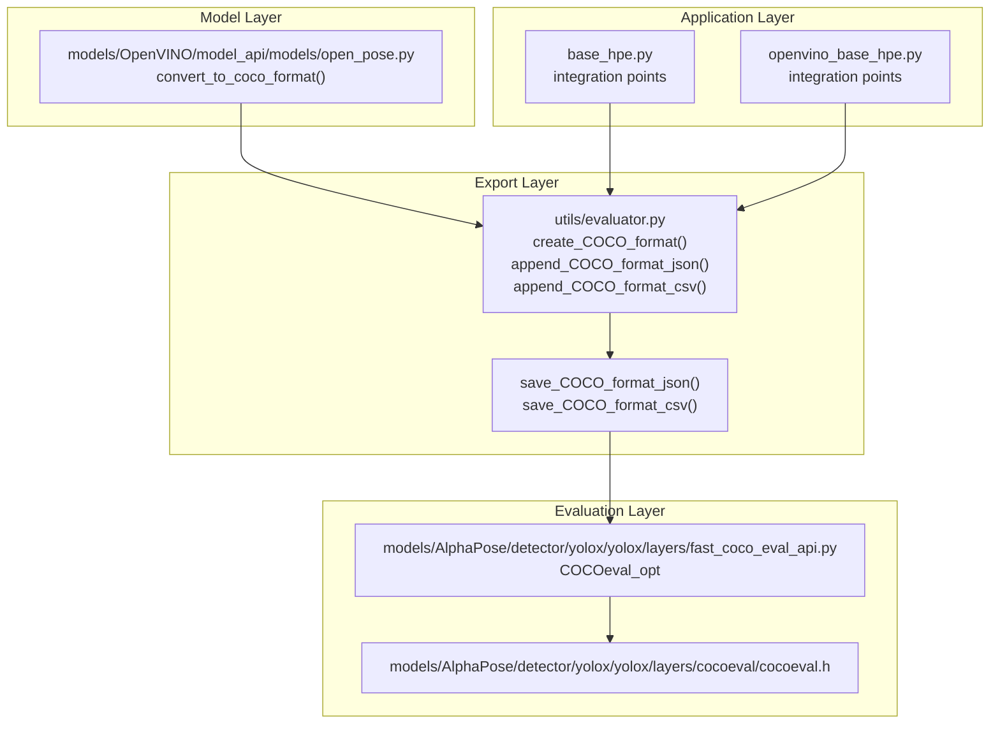
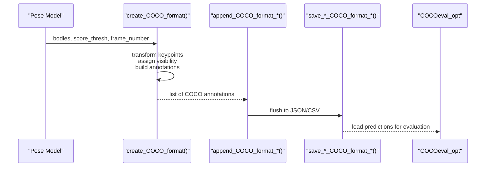
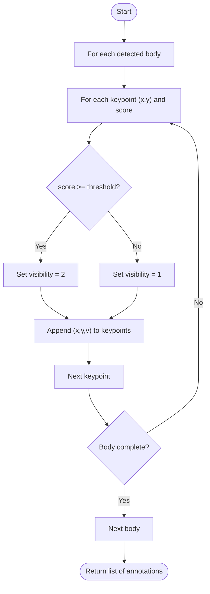
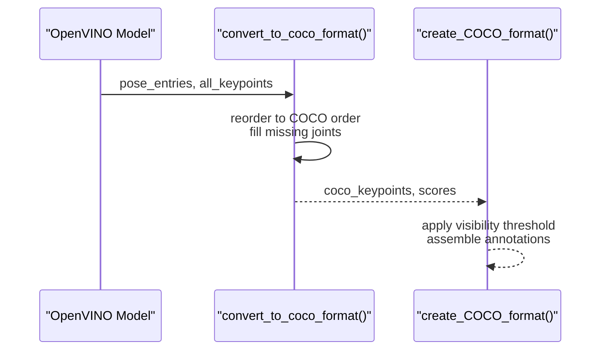
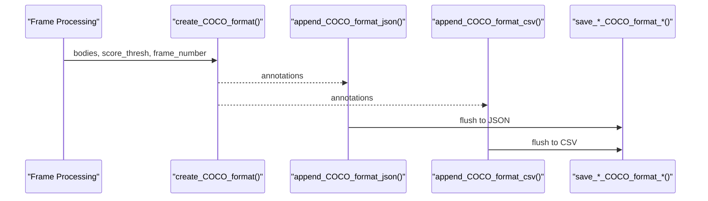
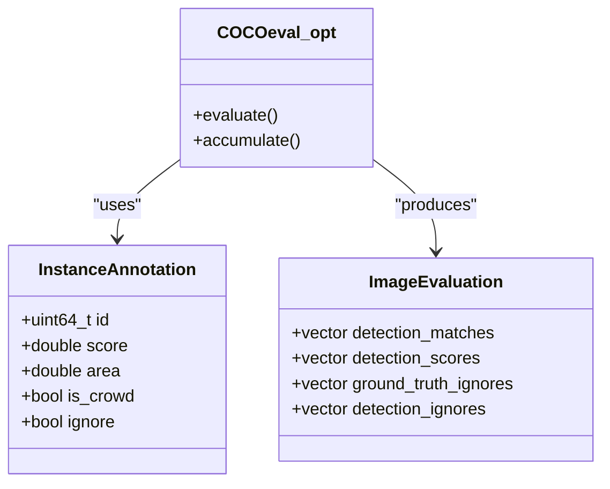
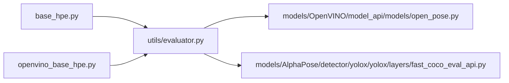

# COCO Format Export

<cite>
**Referenced Files in This Document**
- [evaluator.py](file://utils/evaluator.py)
- [open_pose.py](file://models/OpenVINO/model_api/models/open_pose.py)
- [fast_coco_eval_api.py](file://models/AlphaPose/detector/yolox/yolox/layers/fast_coco_eval_api.py)
- [cocoeval.h](file://models/AlphaPose/detector/yolox/yolox/layers/cocoeval/cocoeval.h)
- [base_hpe.py](file://base_hpe.py)
- [openvino_base_hpe.py](file://openvino_base_hpe.py)
</cite>

## Table of Contents
1. [Introduction](#introduction)
2. [Project Structure](#project-structure)
3. [Core Components](#core-components)
4. [Architecture Overview](#architecture-overview)
5. [Detailed Component Analysis](#detailed-component-analysis)
6. [Dependency Analysis](#dependency-analysis)
7. [Performance Considerations](#performance-considerations)
8. [Troubleshooting Guide](#troubleshooting-guide)
9. [Conclusion](#conclusion)

## Introduction
This document explains the COCO format export functionality used to serialize detected human poses into the COCO keypoint annotation schema. It focuses on:
- Converting detected body keypoints into COCO annotations with frame numbers, category IDs, keypoints arrays, and confidence scores
- Transforming keypoint coordinates and assigning visibility states according to a configurable score threshold
- Serializing results to JSON and CSV formats for downstream analysis and evaluation
- Integrating with standard COCO evaluation tools

## Project Structure
The COCO export pipeline spans several modules:
- A central exporter that transforms pose detections into COCO annotations and writes them to JSON or CSV
- Pose models that produce detections compatible with the exporter
- Evaluation utilities that consume COCO-formatted predictions for benchmarking

**Diagram sources**
- [evaluator.py:11-101](file://utils/evaluator.py#L11-L101)
- [open_pose.py:374-396](file://models/OpenVINO/model_api/models/open_pose.py#L374-L396)
- [fast_coco_eval_api.py:17-152](file://models/AlphaPose/detector/yolox/yolox/layers/fast_coco_eval_api.py#L17-L152)
- [cocoeval.h:12-98](file://models/AlphaPose/detector/yolox/yolox/layers/cocoeval/cocoeval.h#L12-L98)
- [base_hpe.py:22](file://base_hpe.py#L22)
- [openvino_base_hpe.py:405-408](file://openvino_base_hpe.py#L405-L408)

**Section sources**
- [evaluator.py:11-101](file://utils/evaluator.py#L11-L101)
- [open_pose.py:374-396](file://models/OpenVINO/model_api/models/open_pose.py#L374-L396)
- [fast_coco_eval_api.py:17-152](file://models/AlphaPose/detector/yolox/yolox/layers/fast_coco_eval_api.py#L17-L152)
- [cocoeval.h:12-98](file://models/AlphaPose/detector/yolox/yolox/layers/cocoeval/cocoeval.h#L12-L98)
- [base_hpe.py:22](file://base_hpe.py#L22)
- [openvino_base_hpe.py:405-408](file://openvino_base_hpe.py#L405-L408)

## Core Components
- create_COCO_format: Converts a list of detected bodies into COCO keypoint annotations with visibility encoded by a score threshold. Each body becomes one annotation with:
  - frame_number: integer frame index
  - category_id: person category ID
  - keypoints: flattened array of 17 joints × (x, y, v) triplets
  - score: detection confidence
- append_COCO_format_json: Aggregates COCO annotations into an in-memory list for later JSON serialization
- append_COCO_format_csv: Aggregates COCO annotations into CSV rows with frame_number, timestamp, and a JSON string column
- save_COCO_format_json: Writes the aggregated COCO annotations to a JSON file
- save_COCO_format_csv: Writes the aggregated CSV rows to a CSV file

Keypoint visibility encoding:
- NOT_LABELED: joint not labeled (not used in current implementation)
- LABELED_NOT_VISIBLE: joint present but below threshold
- LABELED_VISIBLE: joint present and above threshold

**Section sources**
- [evaluator.py:11-34](file://utils/evaluator.py#L11-L34)
- [evaluator.py:35-46](file://utils/evaluator.py#L35-L46)
- [evaluator.py:86-101](file://utils/evaluator.py#L86-L101)

## Architecture Overview
The export pipeline integrates pose detection outputs with COCO serialization and evaluation.

**Diagram sources**
- [evaluator.py:11-34](file://utils/evaluator.py#L11-L34)
- [evaluator.py:35-46](file://utils/evaluator.py#L35-L46)
- [evaluator.py:86-101](file://utils/evaluator.py#L86-L101)
- [fast_coco_eval_api.py:17-152](file://models/AlphaPose/detector/yolox/yolox/layers/fast_coco_eval_api.py#L17-L152)

## Detailed Component Analysis

### COCO Annotation Structure
Each annotation object includes:
- frame_number: integer indicating the frame index
- category_id: integer category identifier (person)
- keypoints: array of length 17 × 3 = 51 containing x, y, v triplets
- score: detection confidence score

Visibility state encoding:
- v = 0: not labeled (not used in current implementation)
- v = 1: labeled but not visible (score < threshold)
- v = 2: labeled and visible (score ≥ threshold)

Coordinate transformation:
- Keypoints are passed through unchanged from the model’s internal representation
- The exporter expects normalized or pixel-space coordinates consistent with the model output

Threshold filtering:
- Joints with individual keypoint scores below the threshold are marked as not visible
- The annotation-level score reflects the model’s person-level confidence

JSON serialization:
- Annotations are written as a list to a JSON file
- CSV serialization wraps the JSON list as a single cell per row

**Section sources**
- [evaluator.py:11-34](file://utils/evaluator.py#L11-L34)
- [evaluator.py:35-46](file://utils/evaluator.py#L35-L46)
- [evaluator.py:86-101](file://utils/evaluator.py#L86-L101)

### Example: Person Detection with 17 Keypoints
A typical COCO annotation entry for a person detection looks like:
- frame_number: integer frame index
- category_id: 1 (person)
- keypoints: [x1, y1, v1, x2, y2, v2, ..., x17, y17, v17]
- score: float confidence

This structure aligns with the COCO keypoint specification and is compatible with standard evaluation APIs.

**Section sources**
- [evaluator.py:26-31](file://utils/evaluator.py#L26-L31)

### Score Threshold Filtering Mechanism
The visibility state is determined per-keypoint:
- If keypoint_score ≥ score_thresh → v = 2 (visible)
- Else → v = 1 (not visible)

This mechanism ensures that low-confidence joints are still included in the annotation but marked appropriately.

**Diagram sources**
- [evaluator.py:20-33](file://utils/evaluator.py#L20-L33)

**Section sources**
- [evaluator.py:20-33](file://utils/evaluator.py#L20-L33)

### Integration with Pose Models
Some models produce COCO-compatible keypoints directly. For example, the OpenVINO model includes a conversion routine that reorders detected keypoints to the COCO skeleton and fills missing joints with zero coordinates and scores.

**Diagram sources**
- [open_pose.py:374-396](file://models/OpenVINO/model_api/models/open_pose.py#L374-L396)
- [evaluator.py:11-34](file://utils/evaluator.py#L11-L34)

**Section sources**
- [open_pose.py:374-396](file://models/OpenVINO/model_api/models/open_pose.py#L374-L396)

### Serialization to JSON and CSV
- JSON mode: append_COCO_format_json aggregates annotations; save_COCO_format_json writes them to a file
- CSV mode: append_COCO_format_csv converts the current frame’s annotations to JSON and records frame_number, timestamp, and the JSON string

**Diagram sources**
- [evaluator.py:35-46](file://utils/evaluator.py#L35-L46)
- [evaluator.py:86-101](file://utils/evaluator.py#L86-L101)

**Section sources**
- [evaluator.py:35-46](file://utils/evaluator.py#L35-L46)
- [evaluator.py:86-101](file://utils/evaluator.py#L86-L101)

### Integration with Standard COCO Evaluation Tools
Predictions serialized in COCO format can be evaluated using the COCO API. The repository includes an optimized COCO evaluation wrapper that accelerates evaluation by offloading parts of the computation to C++.

**Diagram sources**
- [fast_coco_eval_api.py:17-152](file://models/AlphaPose/detector/yolox/yolox/layers/fast_coco_eval_api.py#L17-L152)
- [cocoeval.h:14-48](file://models/AlphaPose/detector/yolox/yolox/layers/cocoeval/cocoeval.h#L14-L48)

**Section sources**
- [fast_coco_eval_api.py:17-152](file://models/AlphaPose/detector/yolox/yolox/layers/fast_coco_eval_api.py#L17-L152)
- [cocoeval.h:14-48](file://models/AlphaPose/detector/yolox/yolox/layers/cocoeval/cocoeval.h#L14-L48)

## Dependency Analysis
- Application modules import the exporter to integrate COCO serialization into their workflows
- The exporter depends on the model’s output format to ensure compatible coordinate and score semantics
- Evaluation utilities depend on the COCO format to compute metrics

**Diagram sources**
- [base_hpe.py:22](file://base_hpe.py#L22)
- [openvino_base_hpe.py:405-408](file://openvino_base_hpe.py#L405-L408)
- [evaluator.py:11-34](file://utils/evaluator.py#L11-L34)
- [open_pose.py:374-396](file://models/OpenVINO/model_api/models/open_pose.py#L374-L396)
- [fast_coco_eval_api.py:17-152](file://models/AlphaPose/detector/yolox/yolox/layers/fast_coco_eval_api.py#L17-L152)

**Section sources**
- [base_hpe.py:22](file://base_hpe.py#L22)
- [openvino_base_hpe.py:405-408](file://openvino_base_hpe.py#L405-L408)
- [evaluator.py:11-34](file://utils/evaluator.py#L11-L34)
- [open_pose.py:374-396](file://models/OpenVINO/model_api/models/open_pose.py#L374-L396)
- [fast_coco_eval_api.py:17-152](file://models/AlphaPose/detector/yolox/yolox/layers/fast_coco_eval_api.py#L17-L152)

## Performance Considerations
- Prefer CSV mode for streaming or batch workflows where JSON parsing overhead needs to be minimized
- Use the optimized COCO evaluation wrapper to accelerate metric computation on large datasets
- Keep the score threshold tuned to balance precision and recall for your deployment scenario

## Troubleshooting Guide
- Visibility states not as expected: Verify the score threshold and ensure model outputs per-keypoint scores consistently
- Coordinate mismatches: Confirm that the model’s coordinate system (normalized vs. pixels) matches the expectations of the downstream evaluation pipeline
- JSON/CSV output issues: Ensure the exporter is invoked per frame and that saving functions are called after aggregation completes

**Section sources**
- [evaluator.py:11-34](file://utils/evaluator.py#L11-L34)
- [evaluator.py:86-101](file://utils/evaluator.py#L86-L101)

## Conclusion
The COCO export functionality provides a robust bridge between pose detection outputs and standard evaluation tooling. By transforming keypoints into the COCO schema, applying threshold-based visibility encoding, and supporting both JSON and CSV serialization, it enables seamless integration into batch processing workflows and downstream analysis pipelines.