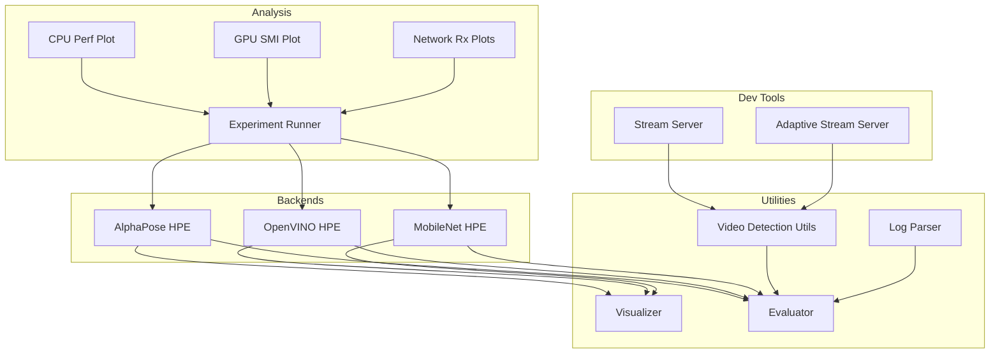
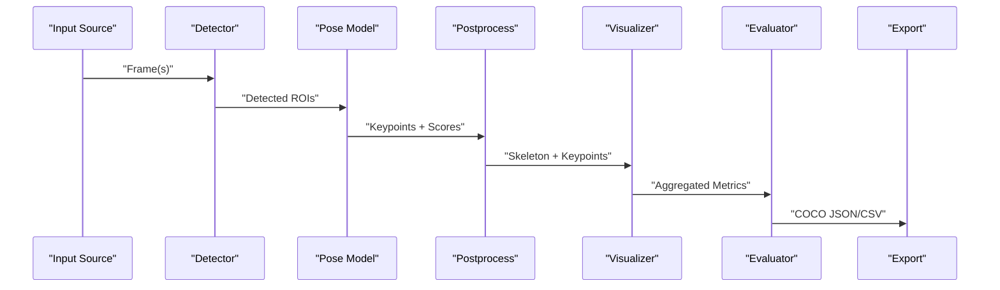
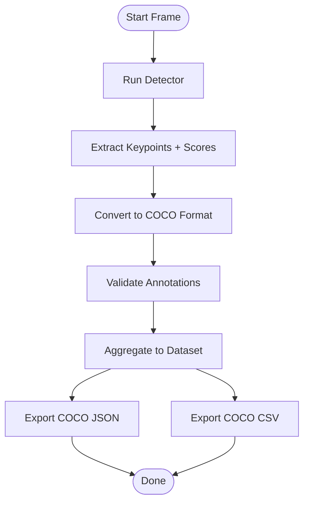
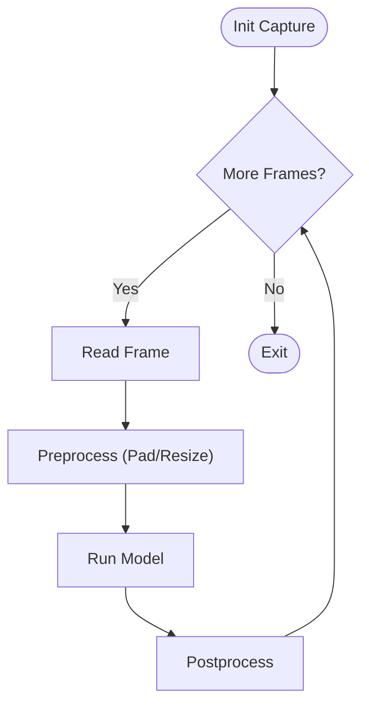
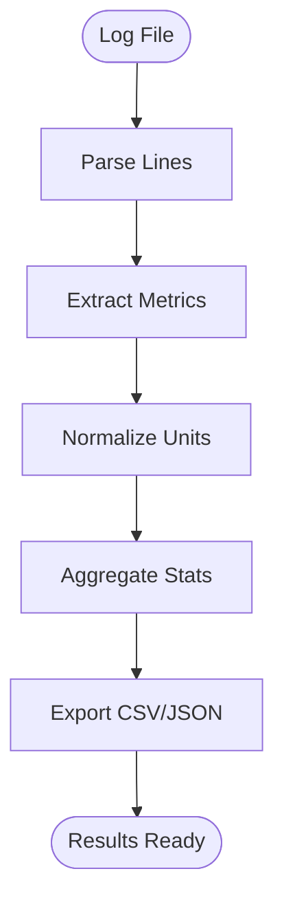
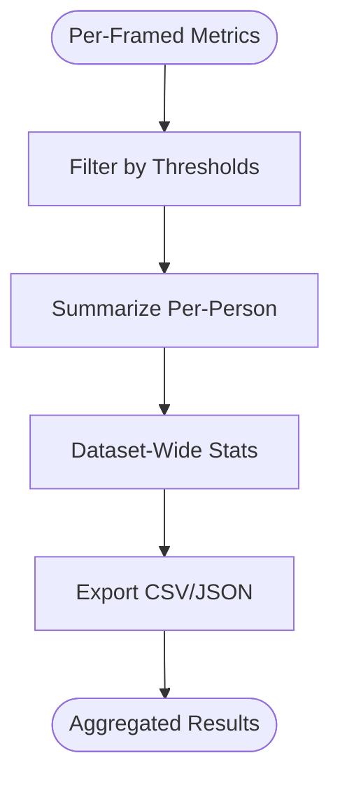
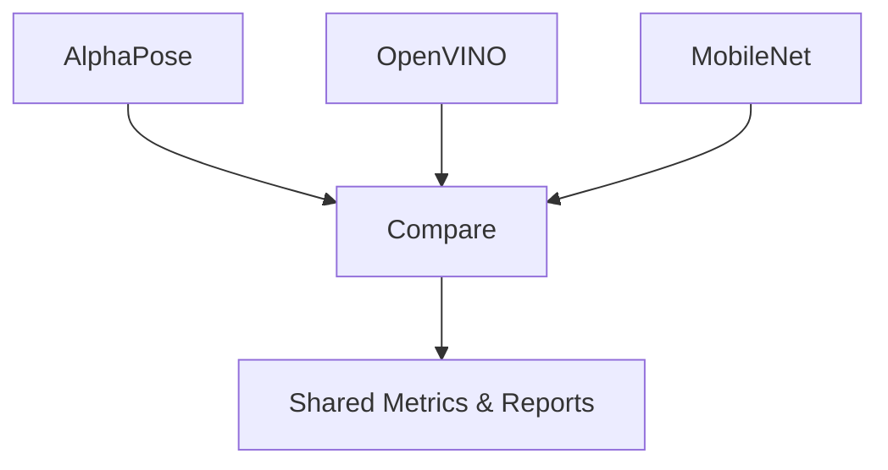
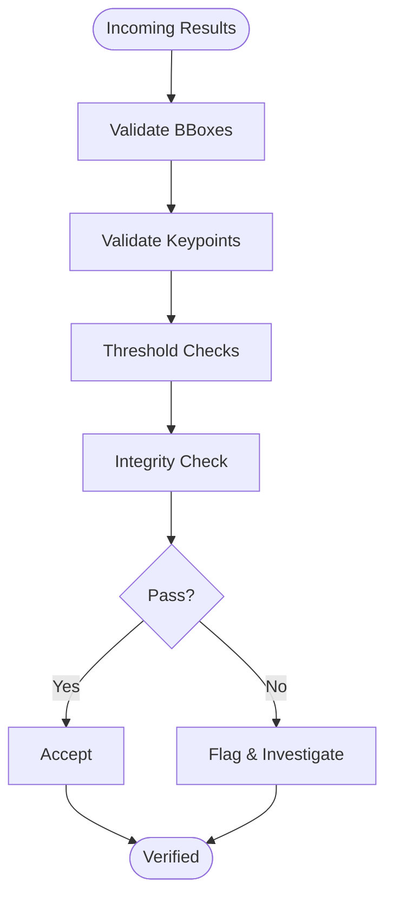
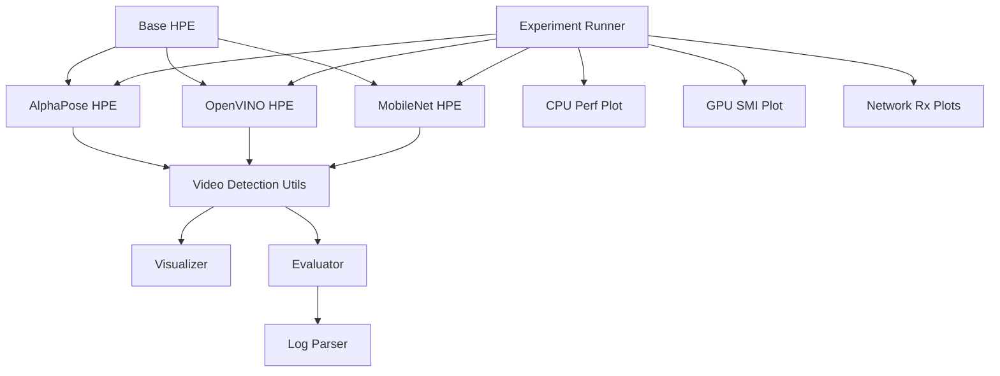
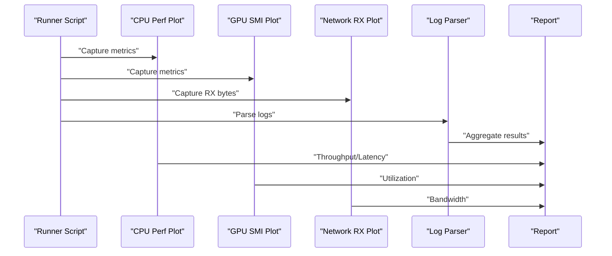

# Data Processing and Analysis

<cite>
**Referenced Files in This Document**
- [main.py](file://main.py)
- [base_hpe.py](file://base_hpe.py)
- [alphapose_hpe.py](file://alphapose_hpe.py)
- [openvino_base_hpe.py](file://openvino_base_hpe.py)
- [movenet_hpe.py](file://movenet_hpe.py)
- [video_detection.py](file://utils/video_detection.py)
- [visualizer.py](file://utils/visualizer.py)
- [evaluator.py](file://utils/evaluator.py)
- [log_parser.py](file://utils/log_parser.py)
- [open_pose.py](file://models/OpenVINO/model_api/models/open_pose.py)
- [coco_det.py](file://models/AlphaPose/alphapose/datasets/coco_det.py)
- [halpe_68_noface.py](file://models/AlphaPose/alphapose/datasets/halpe_68_noface.py)
- [plot_perf_metrics.py](file://Measure_plot_cpu_perf/plot_perf_metrics.py)
- [plot_smi_output.py](file://Measure_gpu_dcgm/plot_smi_output.py)
- [plot_graph.py](file://ffmpeg_hpe/plot_graph.py)
- [plot_rx_bytes.py](file://ffmpeg_hpe/plot_rx_bytes.py)
- [plot_rx_bytes_trimmed_reset.py](file://ffmpeg_hpe/plot_rx_bytes_trimmed_reset.py)
- [run_experiment.sh](file://ffmpeg_hpe/run_experiment.sh)
- [run_nvidia_dcgm.sh](file://Measure_gpu_dcgm/run_nvidia_dcgm.sh)
- [run_perf_plot.sh](file://Measure_plot_cpu_perf/run_perf_plot.sh)
- [stream_video_server.py](file://dev_tools/stream_video_server.py)
- [stream_video_server_adaptive.py](file://dev_tools/stream_video_server_adaptive.py)
- [test_hpe_regressions.py](file://tests/test_hpe_regressions.py)
</cite>

## Table of Contents
1. [Introduction](#introduction)
2. [Project Structure](#project-structure)
3. [Core Components](#core-components)
4. [Architecture Overview](#architecture-overview)
5. [Detailed Component Analysis](#detailed-component-analysis)
6. [Dependency Analysis](#dependency-analysis)
7. [Performance Considerations](#performance-considerations)
8. [Troubleshooting Guide](#troubleshooting-guide)
9. [Conclusion](#conclusion)
10. [Appendices](#appendices)

## Introduction
This document describes the data processing and analysis capabilities of the Human Pose Estimation (HPE) system. It covers:
- COCO format export for keypoints and bounding boxes, including JSON/CSV serialization and annotation structures
- Visualization tools for rendering skeletons and keypoint overlays on frames
- Video detection utilities for processing video streams and batch workflows
- Log parsing for performance metrics and experiment results
- Statistical analysis, result aggregation, and export formats
- Evaluation metrics calculation, benchmarking interpretation, and comparative analysis across HPE backends
- Data validation, quality assurance, and result verification procedures

## Project Structure
The repository organizes HPE backends, utilities, and analysis scripts across distinct areas:
- Backends: AlphaPose, OpenVINO, and MobileNet-based HPE implementations
- Utilities: video detection, visualization, evaluation, and log parsing
- Analysis and plotting: CPU/GPU performance plots, network traffic plots, and experiment orchestration
- Dev tools: streaming servers for testing and adaptive streaming
- Tests: regression checks for pose estimation stability



**Section sources**
- [main.py](file://main.py)
- [base_hpe.py](file://base_hpe.py)
- [alphapose_hpe.py](file://alphapose_hpe.py)
- [openvino_base_hpe.py](file://openvino_base_hpe.py)
- [movenet_hpe.py](file://movenet_hpe.py)
- [video_detection.py](file://utils/video_detection.py)
- [visualizer.py](file://utils/visualizer.py)
- [evaluator.py](file://utils/evaluator.py)
- [log_parser.py](file://utils/log_parser.py)
- [plot_perf_metrics.py](file://Measure_plot_cpu_perf/plot_perf_metrics.py)
- [plot_smi_output.py](file://Measure_gpu_dcgm/plot_smi_output.py)
- [plot_graph.py](file://ffmpeg_hpe/plot_graph.py)
- [plot_rx_bytes.py](file://ffmpeg_hpe/plot_rx_bytes.py)
- [plot_rx_bytes_trimmed_reset.py](file://ffmpeg_hpe/plot_rx_bytes_trimmed_reset.py)
- [run_experiment.sh](file://ffmpeg_hpe/run_experiment.sh)
- [run_nvidia_dcgm.sh](file://Measure_gpu_dcgm/run_nvidia_dcgm.sh)
- [run_perf_plot.sh](file://Measure_plot_cpu_perf/run_perf_plot.sh)
- [stream_video_server.py](file://dev_tools/stream_video_server.py)
- [stream_video_server_adaptive.py](file://dev_tools/stream_video_server_adaptive.py)

## Core Components
- Backend HPE implementations:
  - AlphaPose HPE: end-to-end pipeline with detector and pose model
  - OpenVINO HPE: optimized inference pipeline with COCO conversion
  - MobileNet HPE: lightweight inference for mobile targets
- Video detection utilities: frame processing, batching, and stream handling
- Visualization: skeleton rendering and keypoint overlay on frames
- Evaluation: metrics computation and result aggregation
- Log parsing: extraction of performance and experiment metadata
- Analysis and plotting: CPU/GPU metrics and network traffic visualization
- Streaming servers: local RTSP-like servers for testing

**Section sources**
- [base_hpe.py](file://base_hpe.py)
- [alphapose_hpe.py](file://alphapose_hpe.py)
- [openvino_base_hpe.py](file://openvino_base_hpe.py)
- [movenet_hpe.py](file://movenet_hpe.py)
- [video_detection.py](file://utils/video_detection.py)
- [visualizer.py](file://utils/visualizer.py)
- [evaluator.py](file://utils/evaluator.py)
- [log_parser.py](file://utils/log_parser.py)

## Architecture Overview
The system integrates backend HPE models with a unified processing pipeline. Data flows from input sources (files, streams) through detection/postprocessing, visualization, and evaluation, with optional export to COCO JSON/CSV.



**Diagram sources**
- [base_hpe.py](file://base_hpe.py)
- [alphapose_hpe.py](file://alphapose_hpe.py)
- [openvino_base_hpe.py](file://openvino_base_hpe.py)
- [movenet_hpe.py](file://movenet_hpe.py)
- [visualizer.py](file://utils/visualizer.py)
- [evaluator.py](file://utils/evaluator.py)

## Detailed Component Analysis

### COCO Export and Annotation Structures
- AlphaPose dataset utilities define COCO-compatible structures for detection and whole-body annotations, including bounding boxes and keypoints.
- OpenVINO HPE converts internal pose entries to COCO format with standardized joint ordering and confidence scores.
- Export formats:
  - JSON: COCO-style annotations with images, annotations, categories, and keypoints arrays
  - CSV: tabular representation of per-person keypoints and bounding boxes

Implementation highlights:
- COCO detection dataset loader and keypoint handling
- OpenVINO pose conversion to COCO format with reordering and confidence scaling
- Aggregation of per-frame results into COCO dataset structure



**Diagram sources**
- [coco_det.py](file://models/AlphaPose/alphapose/datasets/coco_det.py)
- [halpe_68_noface.py](file://models/AlphaPose/alphapose/datasets/halpe_68_noface.py)
- [open_pose.py](file://models/OpenVINO/model_api/models/open_pose.py)

**Section sources**
- [coco_det.py](file://models/AlphaPose/alphapose/datasets/coco_det.py)
- [halpe_68_noface.py](file://models/AlphaPose/alphapose/datasets/halpe_68_noface.py)
- [open_pose.py](file://models/OpenVINO/model_api/models/open_pose.py)

### Visualization Tools: Skeletons and Keypoint Overlays
- Visualizer renders skeletons and keypoint overlays on frames, enabling quick inspection of pose outputs.
- Integration points:
  - Base HPE class invokes visualization during processing loops
  - Backend-specific postprocessors supply keypoints and scores

```mermaid
sequenceDiagram
participant LOOP as "Main Loop"
participant PROC as "Postprocess"
participant VIS as "Visualizer"
participant DISP as "Display/Save"
LOOP->>PROC : "predictions"
PROC->>VIS : "keypoints, scores"
VIS->>DISP : "frame with overlays"
DISP-->>LOOP : "processed frame"
```

**Diagram sources**
- [base_hpe.py](file://base_hpe.py)
- [visualizer.py](file://utils/visualizer.py)

**Section sources**
- [base_hpe.py](file://base_hpe.py)
- [visualizer.py](file://utils/visualizer.py)

### Video Detection Utilities: Streams and Batch Workflows
- Unified video detection utilities handle initialization, frame processing, batching, and loop control.
- Features:
  - Stream vs file input detection
  - Timeout and frame limits
  - Padding/resizing for consistent model input
  - Batch processing and async pipelines (backend-dependent)



**Diagram sources**
- [base_hpe.py](file://base_hpe.py)
- [video_detection.py](file://utils/video_detection.py)

**Section sources**
- [base_hpe.py](file://base_hpe.py)
- [video_detection.py](file://utils/video_detection.py)

### Log Parsing and Experiment Results Extraction
- Log parser extracts performance metrics and experiment metadata from structured logs.
- Typical outputs:
  - Throughput, latency, memory usage
  - Backend-specific stats (OpenVINO, AlphaPose)
  - Environment and configuration flags



**Diagram sources**
- [log_parser.py](file://utils/log_parser.py)

**Section sources**
- [log_parser.py](file://utils/log_parser.py)

### Statistical Analysis, Aggregation, and Export Formats
- Evaluator computes per-frame and aggregate metrics (e.g., PCK, AUC, mAP).
- Aggregation methods:
  - Per-person averages
  - Dataset-wide summaries
  - Confidence thresholds and filtering
- Export formats:
  - CSV for spreadsheets and dashboards
  - JSON for programmatic consumption



**Diagram sources**
- [evaluator.py](file://utils/evaluator.py)

**Section sources**
- [evaluator.py](file://utils/evaluator.py)

### Evaluation Metrics and Benchmarking Interpretation
- Metrics:
  - Keypoint detection accuracy (PCK, PCKh)
  - Pose grouping quality (person scores)
  - Speed and throughput (frames/sec)
- Benchmarking:
  - Compare backends under identical conditions
  - Interpret trade-offs between accuracy and latency
  - Use aggregated CSV/JSON for comparative analysis


[No sources needed since this diagram shows conceptual workflow, not actual code structure]

**Section sources**
- [evaluator.py](file://utils/evaluator.py)

### Comparative Analysis Between HPE Backends
- Backends:
  - AlphaPose: flexible, research-grade
  - OpenVINO: optimized inference
  - MobileNet: lightweight
- Comparison criteria:
  - Accuracy (COCO metrics)
  - Latency and throughput
  - Resource usage (CPU/GPU)
  - Ease of deployment



[No sources needed since this diagram shows conceptual workflow, not actual code structure]

**Section sources**
- [alphapose_hpe.py](file://alphapose_hpe.py)
- [openvino_base_hpe.py](file://openvino_base_hpe.py)
- [movenet_hpe.py](file://movenet_hpe.py)

### Data Validation, Quality Assurance, and Result Verification
- Validation steps:
  - Bounding box sanity checks
  - Keypoint score thresholds
  - Coordinate normalization and clipping
- QA:
  - Regression tests for pose estimation
  - Consistency checks across frames
  - Export integrity (COCO JSON/CSV validity)
- Verification:
  - Manual inspection via visualizer
  - Automated checks via evaluator



**Diagram sources**
- [evaluator.py](file://utils/evaluator.py)
- [test_hpe_regressions.py](file://tests/test_hpe_regressions.py)

**Section sources**
- [evaluator.py](file://utils/evaluator.py)
- [test_hpe_regressions.py](file://tests/test_hpe_regressions.py)

## Dependency Analysis
The system exhibits layered dependencies: backends depend on shared video detection and visualization utilities, while evaluation and logging tie everything together.



**Diagram sources**
- [base_hpe.py](file://base_hpe.py)
- [alphapose_hpe.py](file://alphapose_hpe.py)
- [openvino_base_hpe.py](file://openvino_base_hpe.py)
- [movenet_hpe.py](file://movenet_hpe.py)
- [video_detection.py](file://utils/video_detection.py)
- [visualizer.py](file://utils/visualizer.py)
- [evaluator.py](file://utils/evaluator.py)
- [log_parser.py](file://utils/log_parser.py)
- [run_experiment.sh](file://ffmpeg_hpe/run_experiment.sh)
- [plot_perf_metrics.py](file://Measure_plot_cpu_perf/plot_perf_metrics.py)
- [plot_smi_output.py](file://Measure_gpu_dcgm/plot_smi_output.py)
- [plot_rx_bytes.py](file://ffmpeg_hpe/plot_rx_bytes.py)
- [plot_rx_bytes_trimmed_reset.py](file://ffmpeg_hpe/plot_rx_bytes_trimmed_reset.py)

**Section sources**
- [base_hpe.py](file://base_hpe.py)
- [video_detection.py](file://utils/video_detection.py)
- [visualizer.py](file://utils/visualizer.py)
- [evaluator.py](file://utils/evaluator.py)
- [log_parser.py](file://utils/log_parser.py)
- [run_experiment.sh](file://ffmpeg_hpe/run_experiment.sh)

## Performance Considerations
- Throughput and latency:
  - Use batch processing where supported
  - Optimize preprocessing (padding/resizing) and postprocessing
- GPU/CPU utilization:
  - Monitor via SMI and perf plots
  - Tune backend configurations (OpenVINO, AlphaPose)
- Network traffic:
  - Observe RX byte plots for streaming workloads
- Experiment orchestration:
  - Automate runs and collect metrics systematically

[No sources needed since this section provides general guidance]

## Troubleshooting Guide
Common issues and remedies:
- Inference failures:
  - Verify model paths and backend adapters
  - Check input shape and preprocessing alignment
- Visualization anomalies:
  - Confirm keypoint indices and COCO ordering
  - Inspect score thresholds and normalization
- Export errors:
  - Validate COCO JSON schema compliance
  - Ensure CSV column counts match expectations
- Streaming problems:
  - Test with local stream servers
  - Validate RTSP-like endpoints and codecs

**Section sources**
- [base_hpe.py](file://base_hpe.py)
- [visualizer.py](file://utils/visualizer.py)
- [evaluator.py](file://utils/evaluator.py)
- [log_parser.py](file://utils/log_parser.py)
- [stream_video_server.py](file://dev_tools/stream_video_server.py)
- [stream_video_server_adaptive.py](file://dev_tools/stream_video_server_adaptive.py)

## Conclusion
The system provides a robust pipeline for HPE data processing and analysis, from raw frames to validated COCO exports and performance insights. By leveraging backend-specific strengths, unified utilities, and comprehensive evaluation/logging, teams can reliably compare methods, interpret benchmarks, and ensure result quality.

[No sources needed since this section summarizes without analyzing specific files]

## Appendices

### Appendix A: End-to-End Experiment Workflow
- Orchestrate experiments with the runner script
- Collect CPU/GPU metrics and network RX plots
- Parse logs and export aggregated results



**Diagram sources**
- [run_experiment.sh](file://ffmpeg_hpe/run_experiment.sh)
- [plot_perf_metrics.py](file://Measure_plot_cpu_perf/plot_perf_metrics.py)
- [plot_smi_output.py](file://Measure_gpu_dcgm/plot_smi_output.py)
- [plot_rx_bytes.py](file://ffmpeg_hpe/plot_rx_bytes.py)
- [plot_rx_bytes_trimmed_reset.py](file://ffmpeg_hpe/plot_rx_bytes_trimmed_reset.py)
- [log_parser.py](file://utils/log_parser.py)