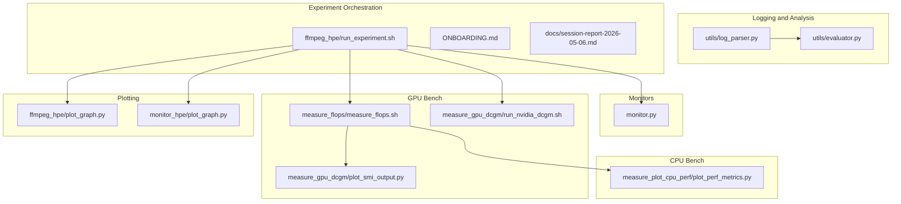
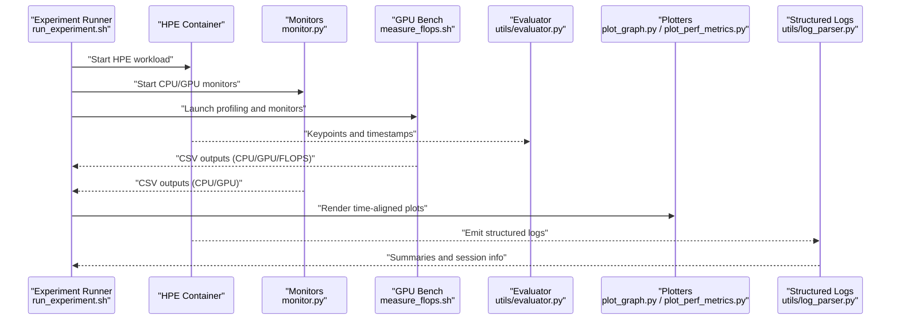
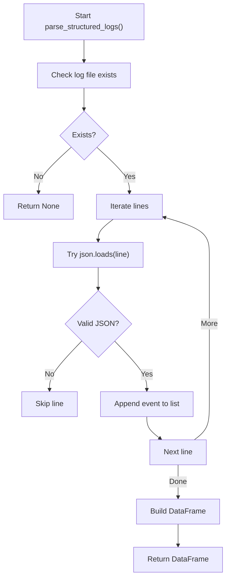
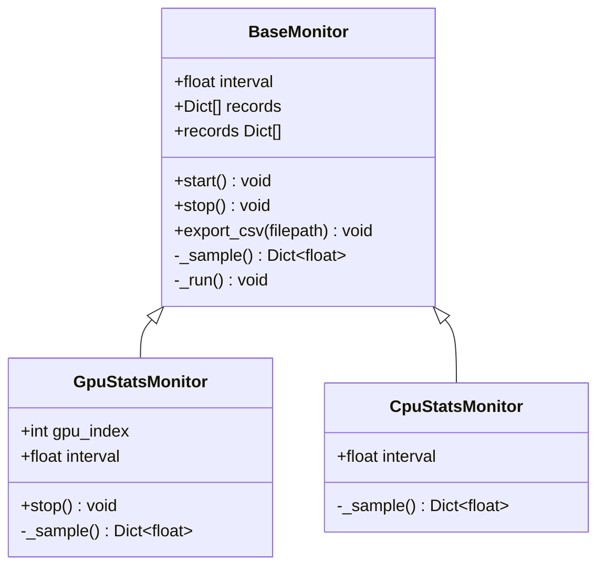
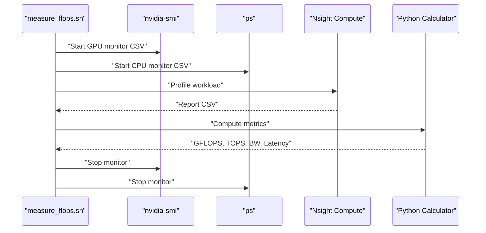
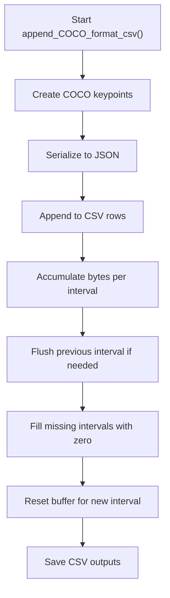
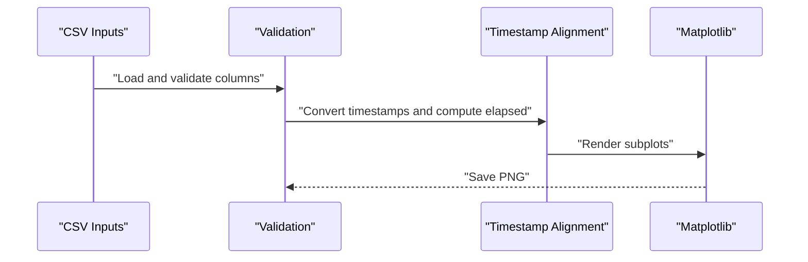
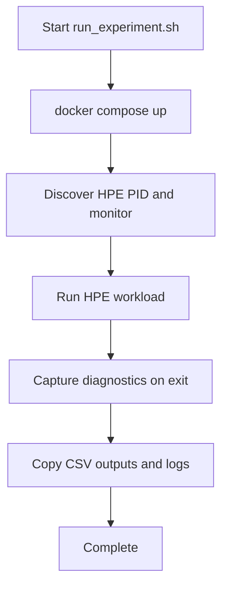
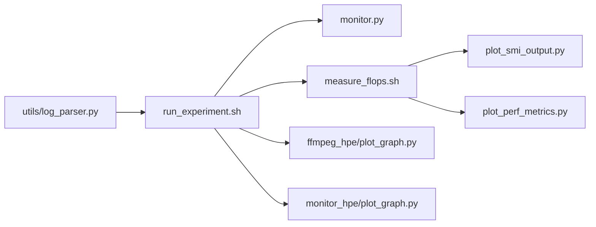

# Log Parsing and Analysis

<cite>
**Referenced Files in This Document**
- [utils/log_parser.py](file://utils/log_parser.py)
- [utils/evaluator.py](file://utils/evaluator.py)
- [monitor.py](file://monitor.py)
- [measure_flops/measure_flops.sh](file://measure_flops/measure_flops.sh)
- [measure_gpu_dcgm/run_nvidia_dcgm.sh](file://measure_gpu_dcgm/run_nvidia_dcgm.sh)
- [measure_gpu_dcgm/plot_smi_output.py](file://measure_gpu_dcgm/plot_smi_output.py)
- [measure_plot_cpu_perf/plot_perf_metrics.py](file://measure_plot_cpu_perf/plot_perf_metrics.py)
- [ffmpeg_hpe/plot_graph.py](file://ffmpeg_hpe/plot_graph.py)
- [monitor_hpe/plot_graph.py](file://monitor_hpe/plot_graph.py)
- [ffmpeg_hpe/run_experiment.sh](file://ffmpeg_hpe/run_experiment.sh)
- [ONBOARDING.md](file://ONBOARDING.md)
- [docs/session-report-2026-05-06.md](file://docs/session-report-2026-05-06.md)
</cite>

## Table of Contents
1. [Introduction](#introduction)
2. [Project Structure](#project-structure)
3. [Core Components](#core-components)
4. [Architecture Overview](#architecture-overview)
5. [Detailed Component Analysis](#detailed-component-analysis)
6. [Dependency Analysis](#dependency-analysis)
7. [Performance Considerations](#performance-considerations)
8. [Troubleshooting Guide](#troubleshooting-guide)
9. [Conclusion](#conclusion)
10. [Appendices](#appendices)

## Introduction
This document explains the log parsing and analysis capabilities used to extract performance metrics and experiment results across CPU, GPU, network, and inference workloads. It covers:
- Structured log parsing for performance summaries, sessions, and video properties
- Timing data, memory usage, and throughput extraction
- Patterns for CPU utilization, GPU metrics, network bandwidth, and inference latency
- Aggregation methods for averages, variances, and statistical summaries
- Integration with experiment orchestration for automated result collection
- Examples of parsed log formats and extracted metric structures
- Error handling for malformed entries and missing data
- Benchmark interpretation and comparative analysis across HPE backends and configurations

## Project Structure
The repository organizes performance instrumentation and analysis across several modules:
- Logging and analysis utilities for structured logs and evaluation artifacts
- Threaded monitors for CPU/GPU metrics with CSV export
- Scripts for FLOPS and GPU metrics collection via NVIDIA tools
- Plotting utilities for time-series visualization
- Experiment orchestration scripts that collect CSV outputs and logs

**Diagram sources**
- [utils/log_parser.py:1-155](file://utils/log_parser.py#L1-L155)
- [utils/evaluator.py:1-114](file://utils/evaluator.py#L1-L114)
- [monitor.py:1-171](file://monitor.py#L1-L171)
- [measure_flops/measure_flops.sh:1-128](file://measure_flops/measure_flops.sh#L1-L128)
- [measure_gpu_dcgm/run_nvidia_dcgm.sh:1-29](file://measure_gpu_dcgm/run_nvidia_dcgm.sh#L1-L29)
- [measure_gpu_dcgm/plot_smi_output.py:1-106](file://measure_gpu_dcgm/plot_smi_output.py#L1-L106)
- [measure_plot_cpu_perf/plot_perf_metrics.py:1-146](file://measure_plot_cpu_perf/plot_perf_metrics.py#L1-L146)
- [ffmpeg_hpe/plot_graph.py:1-104](file://ffmpeg_hpe/plot_graph.py#L1-L104)
- [monitor_hpe/plot_graph.py:1-66](file://monitor_hpe/plot_graph.py#L1-L66)
- [ffmpeg_hpe/run_experiment.sh:332-405](file://ffmpeg_hpe/run_experiment.sh#L332-L405)
- [ONBOARDING.md:647-677](file://ONBOARDING.md#L647-L677)
- [docs/session-report-2026-05-06.md:229-253](file://docs/session-report-2026-05-06.md#L229-L253)

**Section sources**
- [ONBOARDING.md:647-677](file://ONBOARDING.md#L647-L677)

## Core Components
- Structured log parser: Reads newline-delimited JSON logs, filters event types, prints summaries, and exports flattened CSV for downstream analysis.
- Threaded monitors: Background sampling of CPU and GPU metrics with CSV export for time-aligned analysis.
- FLOPS and GPU metrics pipeline: Starts GPU/CPU monitors, profiles kernels, computes GFLOPS/TOPS/BW/Latency, and generates elapsed-time CSVs for plotting.
- Evaluation helpers: COCO-format keypoint serialization and per-interval bandwidth accumulation for throughput analysis.
- Plotting utilities: Time-aligned visualization of CPU/GPU/network metrics with robust input validation and error reporting.

**Section sources**
- [utils/log_parser.py:12-155](file://utils/log_parser.py#L12-L155)
- [monitor.py:32-171](file://monitor.py#L32-L171)
- [measure_flops/measure_flops.sh:17-128](file://measure_flops/measure_flops.sh#L17-L128)
- [utils/evaluator.py:11-114](file://utils/evaluator.py#L11-L114)
- [measure_gpu_dcgm/plot_smi_output.py:13-106](file://measure_gpu_dcgm/plot_smi_output.py#L13-L106)
- [measure_plot_cpu_perf/plot_perf_metrics.py:16-146](file://measure_plot_cpu_perf/plot_perf_metrics.py#L16-L146)
- [ffmpeg_hpe/plot_graph.py:9-104](file://ffmpeg_hpe/plot_graph.py#L9-L104)
- [monitor_hpe/plot_graph.py:10-66](file://monitor_hpe/plot_graph.py#L10-L66)

## Architecture Overview
The system integrates experiment orchestration with instrumentation and post-processing:
- Experiment runner starts HPE, monitors, and tracers; collects CSV outputs and logs
- Monitors continuously sample CPU/GPU metrics and export CSVs
- FLOPS pipeline launches profiling and computes derived metrics
- Plotting utilities consume CSVs to produce time-aligned visualizations
- Log parser ingests structured logs for performance summaries and session metadata

**Diagram sources**
- [ffmpeg_hpe/run_experiment.sh:332-405](file://ffmpeg_hpe/run_experiment.sh#L332-L405)
- [monitor.py:109-171](file://monitor.py#L109-L171)
- [measure_flops/measure_flops.sh:17-128](file://measure_flops/measure_flops.sh#L17-L128)
- [utils/evaluator.py:11-114](file://utils/evaluator.py#L11-L114)
- [ffmpeg_hpe/plot_graph.py:9-104](file://ffmpeg_hpe/plot_graph.py#L9-L104)
- [measure_plot_cpu_perf/plot_perf_metrics.py:16-146](file://measure_plot_cpu_perf/plot_perf_metrics.py#L16-L146)
- [utils/log_parser.py:12-155](file://utils/log_parser.py#L12-L155)

## Detailed Component Analysis

### Structured Log Parser
- Parses newline-delimited JSON logs into a DataFrame
- Filters and prints performance summaries, session events, and video property detections
- Exports flattened CSV for downstream analytics

**Diagram sources**
- [utils/log_parser.py:12-33](file://utils/log_parser.py#L12-L33)

Key extraction patterns:
- Performance summary fields: model_type, input_source, total_frames, fps_avg, inference_time_avg, timestamp
- Session events: method, input, device, timeout, max_frames, timestamp
- Video properties: input_url, fps, duration, total_frames, timestamp

Statistical summaries:
- Average FPS and inference time computed from aggregated performance events
- Optional flattened CSV export for external analysis

**Section sources**
- [utils/log_parser.py:12-155](file://utils/log_parser.py#L12-L155)

### Threaded Monitors (CPU/GPU)
- BaseMonitor manages background sampling with configurable intervals
- GpuStatsMonitor samples GPU utilization and memory via NVML
- CpuStatsMonitor samples CPU percent and memory via psutil
- CSV export supports time-aligned analysis with external plotting tools

**Diagram sources**
- [monitor.py:32-171](file://monitor.py#L32-L171)

Metrics and units:
- GPU: timestamp, gpu_util_percent, gpu_mem_used_MB, gpu_mem_total_MB
- CPU: timestamp, cpu_percent, ram_used_MB, ram_total_MB

**Section sources**
- [monitor.py:32-171](file://monitor.py#L32-L171)

### FLOPS and GPU Metrics Pipeline
- Launches GPU/CPU monitors and runs profiling with Nsight Compute
- Computes GFLOPS, TOPS, bandwidth, and warp latency
- Generates elapsed-time CSVs for plotting

**Diagram sources**
- [measure_flops/measure_flops.sh:17-128](file://measure_flops/measure_flops.sh#L17-L128)

Derived metrics:
- Measured GFLOPS, TOPS, Bandwidth (GB/s), Average Warp Latency
- Elapsed-time CSVs for aligned plotting

**Section sources**
- [measure_flops/measure_flops.sh:17-128](file://measure_flops/measure_flops.sh#L17-L128)

### Evaluation Helpers (Throughput and COCO Export)
- Converts detected poses to COCO keypoints with visibility flags
- Accumulates JSON output per millisecond interval to estimate bandwidth
- Saves COCO JSON and CSV, and per-millisecond byte counts

**Diagram sources**
- [utils/evaluator.py:35-114](file://utils/evaluator.py#L35-L114)

**Section sources**
- [utils/evaluator.py:11-114](file://utils/evaluator.py#L11-L114)

### Plotting Utilities
- ffmpeg_hpe/plot_graph.py: Validates CSVs, aligns timestamps, plots CPU%, memory (MB), and RX bytes
- monitor_hpe/plot_graph.py: Plots CPU% and memory (MB) over datetime timestamps
- measure_gpu_dcgm/plot_smi_output.py: Plots GPU utilization, memory utilization, temperature, power, and P-state transitions

**Diagram sources**
- [ffmpeg_hpe/plot_graph.py:9-104](file://ffmpeg_hpe/plot_graph.py#L9-L104)
- [monitor_hpe/plot_graph.py:10-66](file://monitor_hpe/plot_graph.py#L10-L66)
- [measure_gpu_dcgm/plot_smi_output.py:13-106](file://measure_gpu_dcgm/plot_smi_output.py#L13-L106)

**Section sources**
- [ffmpeg_hpe/plot_graph.py:9-104](file://ffmpeg_hpe/plot_graph.py#L9-L104)
- [monitor_hpe/plot_graph.py:10-66](file://monitor_hpe/plot_graph.py#L10-L66)
- [measure_gpu_dcgm/plot_smi_output.py:13-106](file://measure_gpu_dcgm/plot_smi_output.py#L13-L106)

### Experiment Orchestration Integration
- run_experiment.sh orchestrates container lifecycle, PID discovery, diagnostics capture, and CSV collection
- ONBOARDING.md documents expected directory structure and CSV schemas
- session-report-2026-05-06.md highlights fixes for PID parsing, exit code logging, and container naming

**Diagram sources**
- [ffmpeg_hpe/run_experiment.sh:332-405](file://ffmpeg_hpe/run_experiment.sh#L332-L405)
- [ONBOARDING.md:647-677](file://ONBOARDING.md#L647-L677)
- [docs/session-report-2026-05-06.md:229-253](file://docs/session-report-2026-05-06.md#L229-L253)

**Section sources**
- [ffmpeg_hpe/run_experiment.sh:332-405](file://ffmpeg_hpe/run_experiment.sh#L332-L405)
- [ONBOARDING.md:647-677](file://ONBOARDING.md#L647-L677)
- [docs/session-report-2026-05-06.md:229-253](file://docs/session-report-2026-05-06.md#L229-L253)

## Dependency Analysis
- Experiment runner depends on monitor.py for CPU/GPU metrics and measure_flops.sh for profiling outputs
- Plotting utilities depend on CSV schemas documented in ONBOARDING.md
- Log parser consumes structured logs emitted during experiments

**Diagram sources**
- [ffmpeg_hpe/run_experiment.sh:332-405](file://ffmpeg_hpe/run_experiment.sh#L332-L405)
- [monitor.py:109-171](file://monitor.py#L109-L171)
- [measure_flops/measure_flops.sh:17-128](file://measure_flops/measure_flops.sh#L17-L128)
- [measure_gpu_dcgm/plot_smi_output.py:13-106](file://measure_gpu_dcgm/plot_smi_output.py#L13-L106)
- [measure_plot_cpu_perf/plot_perf_metrics.py:16-146](file://measure_plot_cpu_perf/plot_perf_metrics.py#L16-L146)
- [ffmpeg_hpe/plot_graph.py:9-104](file://ffmpeg_hpe/plot_graph.py#L9-L104)
- [monitor_hpe/plot_graph.py:10-66](file://monitor_hpe/plot_graph.py#L10-L66)
- [utils/log_parser.py:12-155](file://utils/log_parser.py#L12-L155)

**Section sources**
- [ONBOARDING.md:647-677](file://ONBOARDING.md#L647-L677)

## Performance Considerations
- Sampling intervals: Tune monitor.py intervals to balance overhead and resolution
- CSV alignment: Use elapsed timestamps or shared timestamps to align CPU/GPU/network series
- Derived metrics: Compute GFLOPS/TOPS/BW/Latency only when profiling data is present
- Plotting: Validate column presence and numeric conversion to avoid misalignment

[No sources needed since this section provides general guidance]

## Troubleshooting Guide
Common issues and resolutions:
- Missing or malformed structured logs: log parser skips invalid JSON lines and reports “No valid events found”
- Empty CSVs or missing columns: plotting utilities validate required columns and exit with explicit errors
- PID discovery failures: run_experiment.sh logs warnings when HPE PID cannot be found
- Non-zero exit codes: run_experiment.sh writes exit code to hpe_exit.log for diagnosis
- Container naming and defaults: session-report-2026-05-06.md documents fixes for container_name and VIDEO_FILE defaults

**Section sources**
- [utils/log_parser.py:14-29](file://utils/log_parser.py#L14-L29)
- [ffmpeg_hpe/plot_graph.py:11-26](file://ffmpeg_hpe/plot_graph.py#L11-L26)
- [monitor_hpe/plot_graph.py:11-16](file://monitor_hpe/plot_graph.py#L11-L16)
- [ffmpeg_hpe/run_experiment.sh:347-350](file://ffmpeg_hpe/run_experiment.sh#L347-L350)
- [ffmpeg_hpe/run_experiment.sh:377-382](file://ffmpeg_hpe/run_experiment.sh#L377-L382)
- [docs/session-report-2026-05-06.md:229-253](file://docs/session-report-2026-05-06.md#L229-L253)

## Conclusion
The repository provides a cohesive pipeline for collecting, parsing, and visualizing performance metrics across CPU, GPU, and network domains. Structured logs enable high-level performance summaries, while CSV outputs from monitors and profiling tools support detailed time-aligned analysis. Automated experiment orchestration ensures consistent data collection and facilitates comparative benchmarking across HPE backends and configurations.

[No sources needed since this section summarizes without analyzing specific files]

## Appendices

### Parsed Log Formats and Metric Structures
- Structured logs: event_type and data payload; performance_summary includes fps_avg, inference_time_avg, and totals
- Sessions: session_start/session_end with method, input, device, timeout, max_frames
- Video properties: fps, duration, total_frames, input_url
- CSV schemas (from ONBOARDING.md):
  - pid_metrics.csv: timestamp, pid, cpu_percent, mem_rss_kb, tx_bytes, rx_bytes
  - network_stats.csv: timestamp, pid, interface, bytes, sent
  - gpu_metrics.csv: timestamp, gpu_id, gpu_utilization, mem_utilization, temperature, power_usage
  - hpe_video_rx.csv: timestamp_ms, rx_bytes
  - hpe_video_tx.csv: timestamp_ms, tx_bytes

**Section sources**
- [ONBOARDING.md:647-677](file://ONBOARDING.md#L647-L677)