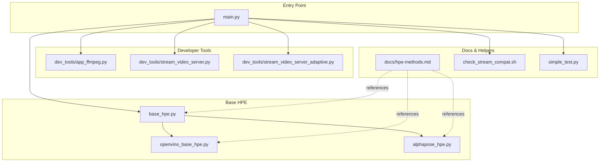
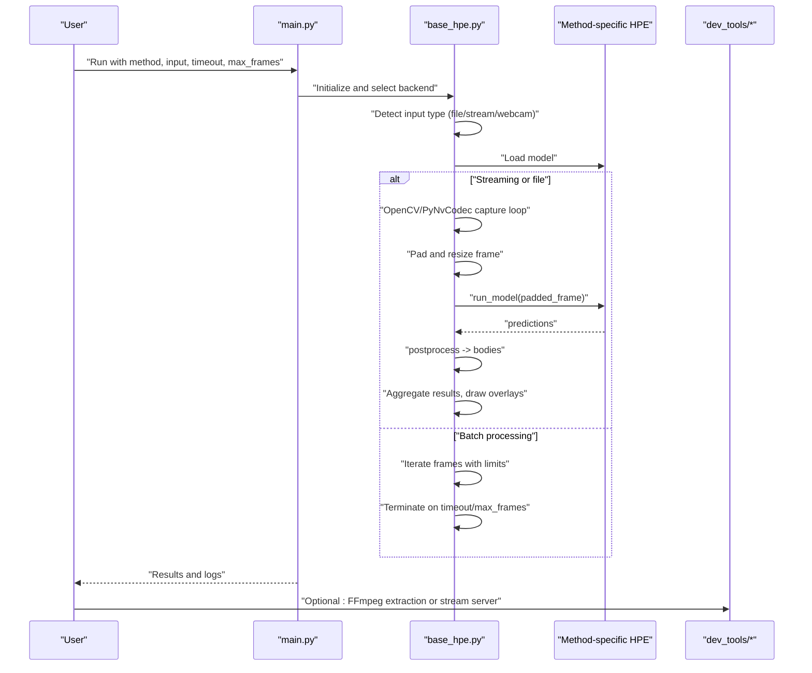
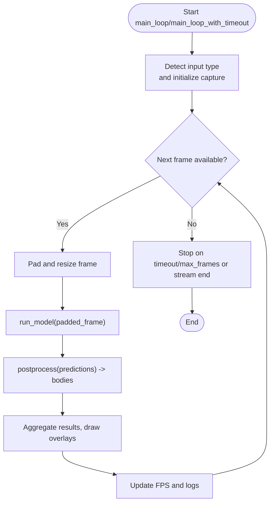
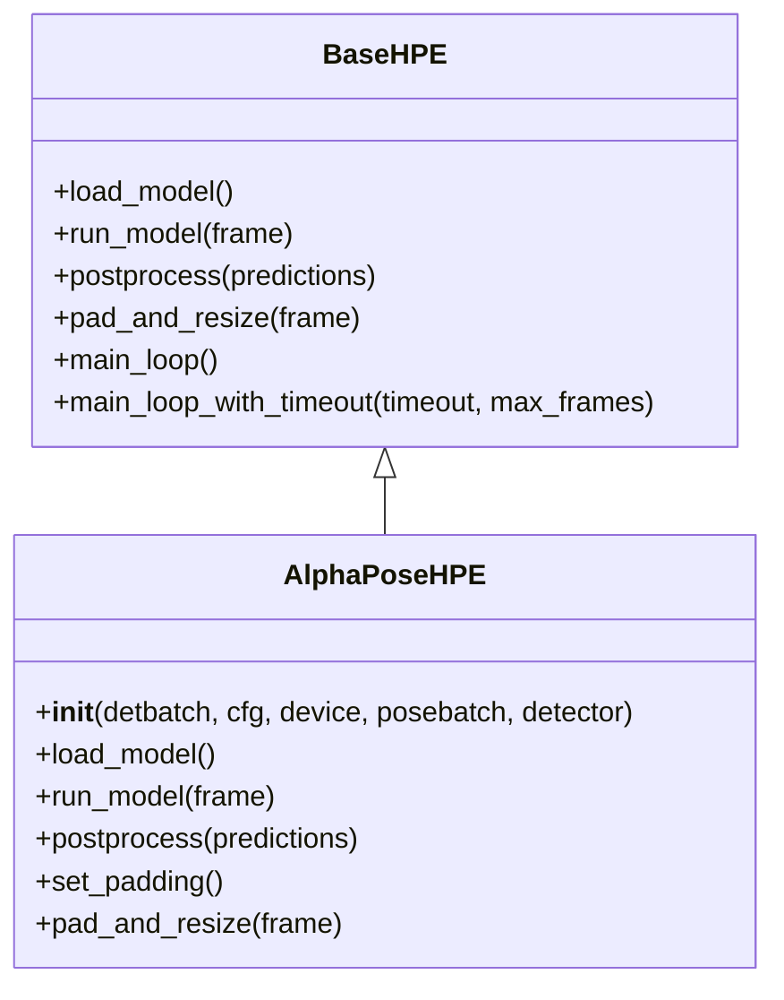
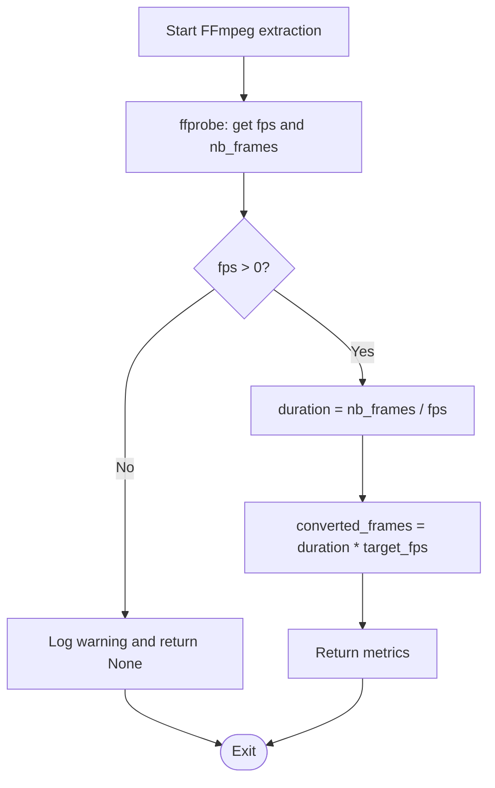
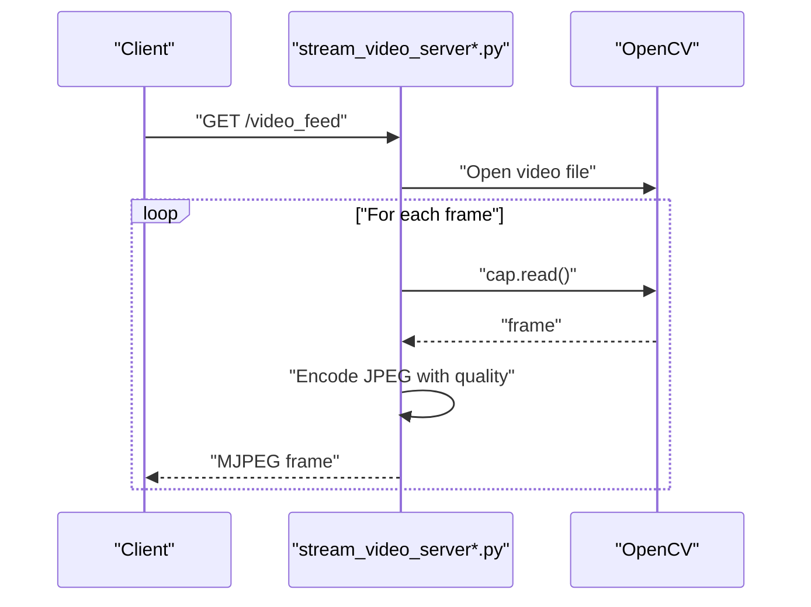
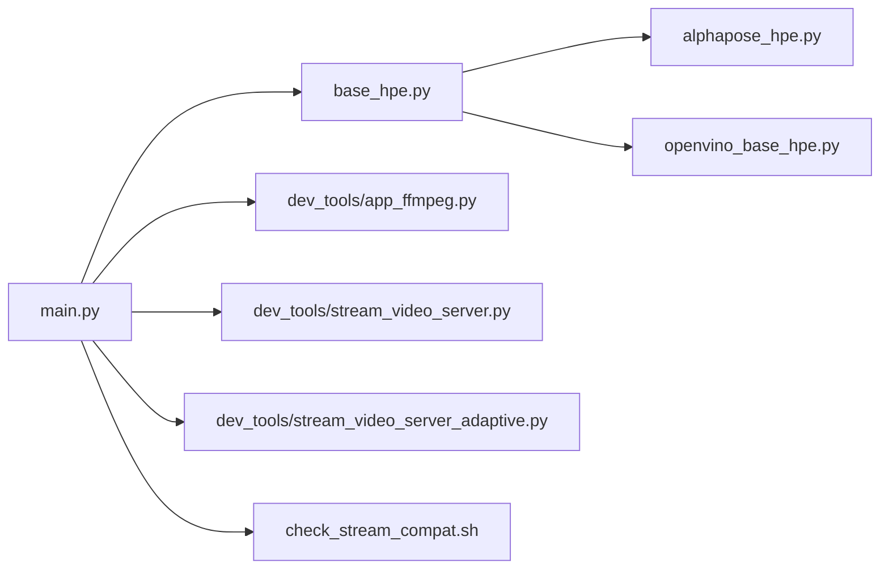
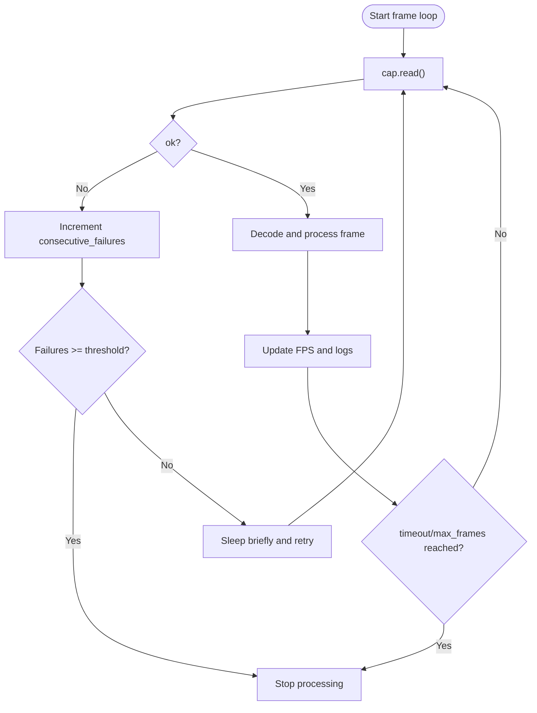

# Video Processing Utilities

<cite>
**Referenced Files in This Document**
- [base_hpe.py](file://base_hpe.py)
- [alphapose_hpe.py](file://alphapose_hpe.py)
- [openvino_base_hpe.py](file://openvino_base_hpe.py)
- [main.py](file://main.py)
- [dev_tools/app_ffmpeg.py](file://dev_tools/app_ffmpeg.py)
- [dev_tools/stream_video_server.py](file://dev_tools/stream_video_server.py)
- [dev_tools/stream_video_server_adaptive.py](file://dev_tools/stream_video_server_adaptive.py)
- [docs/hpe-methods.md](file://docs/hpe-methods.md)
- [README.md](file://README.md)
- [check_stream_compat.sh](file://check_stream_compat.sh)
- [simple_test.py](file://simple_test.py)
</cite>

## Table of Contents
1. [Introduction](#introduction)
2. [Project Structure](#project-structure)
3. [Core Components](#core-components)
4. [Architecture Overview](#architecture-overview)
5. [Detailed Component Analysis](#detailed-component-analysis)
6. [Dependency Analysis](#dependency-analysis)
7. [Performance Considerations](#performance-considerations)
8. [Troubleshooting Guide](#troubleshooting-guide)
9. [Conclusion](#conclusion)
10. [Appendices](#appendices)

## Introduction
This document describes the video processing utilities for batch processing and stream analysis, focusing on frame extraction and processing pipelines, frame rate conversion, resolution scaling, and temporal sampling. It explains batch workflows for long video sequences, memory management during extended processing, integration with Human Pose Estimation (HPE) backends for real-time analysis and result aggregation, and robust handling of video metadata, timestamps, and synchronization across processing stages. Practical examples cover processing different video formats and resolutions, along with performance optimization techniques and parallel processing capabilities. Error handling strategies address corrupted video files and processing interruptions.

## Project Structure
The repository organizes video processing utilities across several modules:
- Base HPE framework: generic pipeline for video capture, preprocessing, inference, and postprocessing
- Method-specific HPE implementations: AlphaPose and OpenVINO-based pipelines
- Developer tools: FFmpeg-based utilities for frame extraction and stream servers for testing
- Documentation: method descriptions and compatibility checks
- Example scripts: end-to-end processing and stream testing

**Diagram sources**
- [main.py](file://main.py)
- [base_hpe.py](file://base_hpe.py)
- [alphapose_hpe.py](file://alphapose_hpe.py)
- [openvino_base_hpe.py](file://openvino_base_hpe.py)
- [dev_tools/app_ffmpeg.py](file://dev_tools/app_ffmpeg.py)
- [dev_tools/stream_video_server.py](file://dev_tools/stream_video_server.py)
- [dev_tools/stream_video_server_adaptive.py](file://dev_tools/stream_video_server_adaptive.py)
- [docs/hpe-methods.md](file://docs/hpe-methods.md)
- [check_stream_compat.sh](file://check_stream_compat.sh)
- [simple_test.py](file://simple_test.py)

**Section sources**
- [README.md:194-235](file://README.md#L194-L235)
- [docs/hpe-methods.md:41-89](file://docs/hpe-methods.md#L41-L89)

## Core Components
- Base HPE pipeline: initializes video capture (file, stream, webcam), manages main loops with timeouts and frame limits, performs padding/resizing, runs inference, and aggregates results
- AlphaPose HPE: two-stage top-down pipeline with person detection and pose estimation
- OpenVINO HPE: optimized inference backend with async pipelines and model adapters
- Developer tools: FFmpeg-based frame extraction and stream servers for testing and validation
- Stream compatibility checker: validates codec, resolution, FPS, pixel format, and HTTP accessibility

Key responsibilities:
- Frame extraction and preprocessing: padding, resizing, tensor conversion
- Inference orchestration: model loading, timed execution, postprocessing
- Batch processing: configurable timeouts, max frames, and termination conditions
- Real-time streaming: MJPEG streaming server and adaptive scaling
- Metadata and synchronization: timestamps, frame indices, and FPS calculation

**Section sources**
- [base_hpe.py:102-249](file://base_hpe.py#L102-L249)
- [base_hpe.py:249-330](file://base_hpe.py#L249-L330)
- [base_hpe.py:549-669](file://base_hpe.py#L549-L669)
- [alphapose_hpe.py:40-125](file://alphapose_hpe.py#L40-L125)
- [openvino_base_hpe.py](file://openvino_base_hpe.py)
- [dev_tools/app_ffmpeg.py:39-61](file://dev_tools/app_ffmpeg.py#L39-L61)
- [dev_tools/stream_video_server.py](file://dev_tools/stream_video_server.py)
- [dev_tools/stream_video_server_adaptive.py:71-130](file://dev_tools/stream_video_server_adaptive.py#L71-L130)
- [check_stream_compat.sh:1-54](file://check_stream_compat.sh#L1-L54)

## Architecture Overview
The system supports both batch and streaming workflows. The base HPE class orchestrates video capture and processing loops, delegating model-specific inference to subclasses. Developer tools enable offline frame extraction and online streaming for validation.

**Diagram sources**
- [main.py:170-188](file://main.py#L170-L188)
- [base_hpe.py:249-330](file://base_hpe.py#L249-L330)
- [base_hpe.py:549-669](file://base_hpe.py#L549-L669)
- [dev_tools/app_ffmpeg.py:39-61](file://dev_tools/app_ffmpeg.py#L39-L61)
- [dev_tools/stream_video_server.py](file://dev_tools/stream_video_server.py)

## Detailed Component Analysis

### Base HPE Pipeline
The base class encapsulates the core processing loop, input detection, and result aggregation. It supports:
- Input type detection: HTTP stream, video file, single image, webcam index, directory of images
- Capture initialization: PyNvCodec GPU decoding or OpenCV CPU fallback
- Frame processing: padding/resizing, tensor conversion, inference timing, postprocessing, overlays, and result logging
- Batch controls: timeout-based termination and max frame limits with graceful exit

**Diagram sources**
- [base_hpe.py:249-330](file://base_hpe.py#L249-L330)
- [base_hpe.py:549-669](file://base_hpe.py#L549-L669)

**Section sources**
- [base_hpe.py:102-249](file://base_hpe.py#L102-L249)
- [base_hpe.py:249-330](file://base_hpe.py#L249-L330)
- [base_hpe.py:418-533](file://base_hpe.py#L418-L533)
- [base_hpe.py:549-669](file://base_hpe.py#L549-L669)

### AlphaPose HPE
AlphaPose implements a two-stage top-down pipeline:
- Stage 1: Person detection using YOLO-based detectors
- Stage 2: Pose estimation using a ResNet backbone with fixed input dimensions

Key features:
- Configurable detection and pose batches
- Padding/resizing to model input dimensions
- Keypoint extraction and body object creation

**Diagram sources**
- [base_hpe.py:102-249](file://base_hpe.py#L102-L249)
- [alphapose_hpe.py:40-125](file://alphapose_hpe.py#L40-L125)
- [alphapose_hpe.py:294-338](file://alphapose_hpe.py#L294-L338)

**Section sources**
- [alphapose_hpe.py:40-125](file://alphapose_hpe.py#L40-L125)
- [alphapose_hpe.py:294-338](file://alphapose_hpe.py#L294-L338)
- [docs/hpe-methods.md:79-89](file://docs/hpe-methods.md#L79-L89)

### OpenVINO HPE
OpenVINO backend provides optimized inference with:
- Model adapters and async pipelines
- Efficient GPU/CPU utilization
- Scalable batch processing

Integration pattern mirrors the base class but leverages OpenVINO’s runtime optimizations.

**Section sources**
- [openvino_base_hpe.py](file://openvino_base_hpe.py)

### Developer Tools: FFmpeg Frame Extraction
The FFmpeg utility extracts frames from video files and computes conversion metrics:
- Determines original FPS and total frames
- Calculates duration and converted frame counts for target FPS
- Parses JPEG markers to extract complete frames from FFmpeg output

**Diagram sources**
- [dev_tools/app_ffmpeg.py:39-61](file://dev_tools/app_ffmpeg.py#L39-L61)
- [dev_tools/app_ffmpeg.py:120-148](file://dev_tools/app_ffmpeg.py#L120-L148)

**Section sources**
- [dev_tools/app_ffmpeg.py:39-61](file://dev_tools/app_ffmpeg.py#L39-L61)
- [dev_tools/app_ffmpeg.py:120-148](file://dev_tools/app_ffmpeg.py#L120-L148)

### Stream Servers for Testing
Two stream servers support real-time testing:
- Basic MJPEG server: serves a static video feed via HTTP endpoint
- Adaptive server: detects video info, adapts JPEG quality and resolution, and downsamples HD streams

**Diagram sources**
- [dev_tools/stream_video_server.py](file://dev_tools/stream_video_server.py)
- [dev_tools/stream_video_server_adaptive.py:71-130](file://dev_tools/stream_video_server_adaptive.py#L71-L130)

**Section sources**
- [dev_tools/stream_video_server.py](file://dev_tools/stream_video_server.py)
- [dev_tools/stream_video_server_adaptive.py:71-130](file://dev_tools/stream_video_server_adaptive.py#L71-L130)

### Stream Compatibility Checker
The compatibility script validates:
- Codec (H.264 recommended)
- Resolution bounds (min/max constraints)
- FPS range (10–60 recommended)
- Pixel format (yuv420p recommended)
- HTTP accessibility (status 200)

**Section sources**
- [check_stream_compat.sh:1-54](file://check_stream_compat.sh#L1-L54)

## Dependency Analysis
The system exhibits layered dependencies:
- Entry point depends on base HPE and developer tools
- Base HPE depends on method-specific implementations
- Method-specific implementations depend on model libraries (AlphaPose, OpenVINO)
- Developer tools depend on FFmpeg and OpenCV

**Diagram sources**
- [main.py](file://main.py)
- [base_hpe.py](file://base_hpe.py)
- [alphapose_hpe.py](file://alphapose_hpe.py)
- [openvino_base_hpe.py](file://openvino_base_hpe.py)
- [dev_tools/app_ffmpeg.py](file://dev_tools/app_ffmpeg.py)
- [dev_tools/stream_video_server.py](file://dev_tools/stream_video_server.py)
- [dev_tools/stream_video_server_adaptive.py](file://dev_tools/stream_video_server_adaptive.py)
- [check_stream_compat.sh](file://check_stream_compat.sh)

**Section sources**
- [main.py:170-188](file://main.py#L170-L188)
- [base_hpe.py:102-249](file://base_hpe.py#L102-L249)

## Performance Considerations
- GPU decoding: PyNvCodec reduces CPU load for video decoding; fallback to OpenCV for unsupported streams
- Batch processing: configurable timeouts and max frames prevent unbounded memory growth
- Adaptive streaming: resolution scaling and JPEG quality tuning improve throughput for HD content
- Inference timing: FPS calculation based on recent timings enables dynamic adjustments
- Parallel processing: OpenVINO async pipelines and multi-stage AlphaPose batching increase throughput

Practical tips:
- Prefer H.264 with yuv420p pixel format for broad compatibility
- Downscale high-resolution streams when latency is critical
- Use batch sizes aligned with GPU memory capacity
- Monitor FPS and adjust target FPS for temporal sampling

**Section sources**
- [docs/hpe-methods.md:41-89](file://docs/hpe-methods.md#L41-L89)
- [dev_tools/stream_video_server_adaptive.py:101-106](file://dev_tools/stream_video_server_adaptive.py#L101-L106)
- [simple_test.py:209-236](file://simple_test.py#L209-L236)

## Troubleshooting Guide
Common issues and remedies:
- Corrupted or inaccessible video files: stream ends with repeated read failures; the base loop stops after a threshold of consecutive failures
- Stream interruptions: automatic retries with small delays; terminates on persistent decode errors
- Timeout and frame limits: explicit controls to stop processing after a configured duration or frame count
- Webcam access: test script attempts multiple reads and reports success/failure
- HTTP stream compatibility: use the compatibility checker to validate codec, resolution, FPS, and HTTP status

**Diagram sources**
- [base_hpe.py:418-533](file://base_hpe.py#L418-L533)

**Section sources**
- [base_hpe.py:418-533](file://base_hpe.py#L418-L533)
- [simple_test.py:79-112](file://simple_test.py#L79-L112)
- [check_stream_compat.sh:1-54](file://check_stream_compat.sh#L1-L54)

## Conclusion
The video processing utilities provide a robust foundation for batch and streaming video analysis. The base HPE pipeline integrates seamlessly with method-specific backends, supports adaptive streaming, and offers strong error handling and performance controls. By leveraging developer tools for frame extraction and stream validation, users can efficiently process diverse video formats and resolutions while maintaining synchronization and memory efficiency.

## Appendices

### Processing Examples
- Batch processing a video file: run the main entry point with a file path; configure timeout and max frames to manage memory
- Real-time stream analysis: use the MJPEG server to emulate IP camera feeds; run HPE against the HTTP endpoint
- Temporal sampling: compute target FPS using the FFmpeg utility and apply conversion metrics to derive sampled frame counts
- Resolution scaling: use the adaptive stream server to downscale HD streams and tune JPEG quality for improved throughput

**Section sources**
- [README.md:194-207](file://README.md#L194-L207)
- [dev_tools/app_ffmpeg.py:39-61](file://dev_tools/app_ffmpeg.py#L39-L61)
- [dev_tools/stream_video_server_adaptive.py:101-106](file://dev_tools/stream_video_server_adaptive.py#L101-L106)