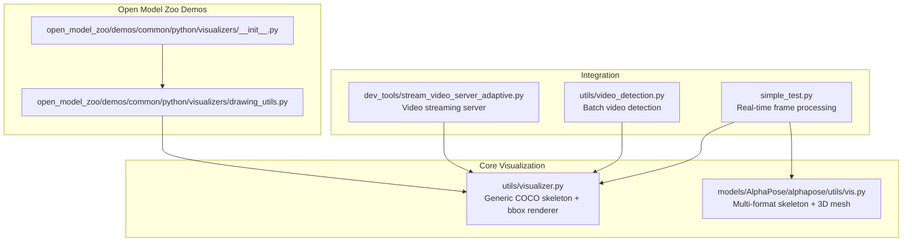
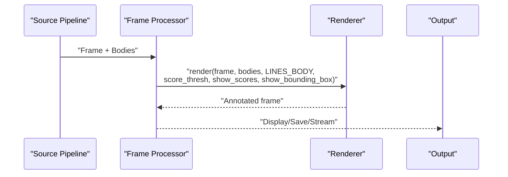
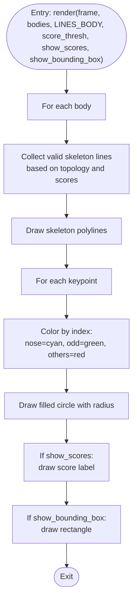
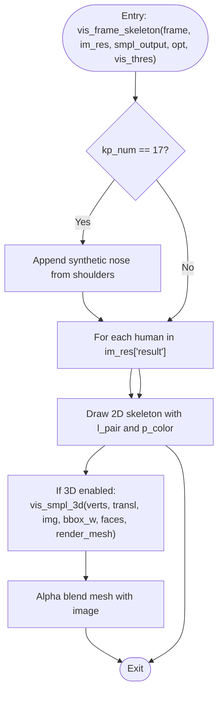
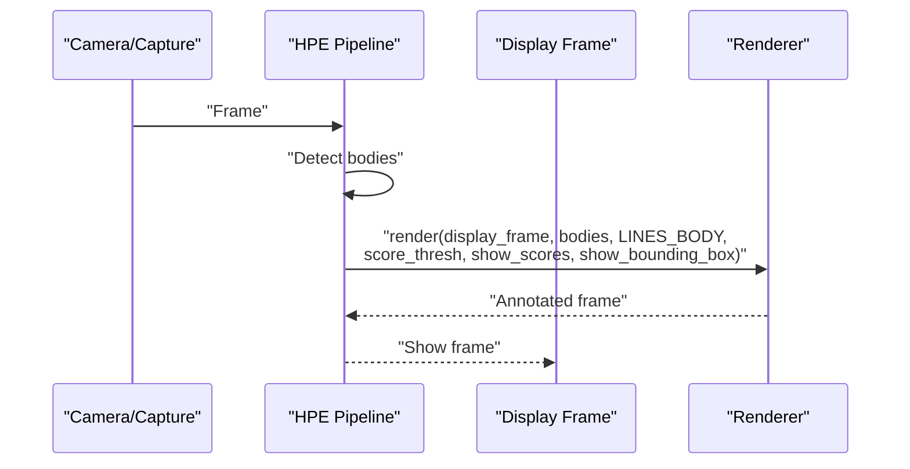
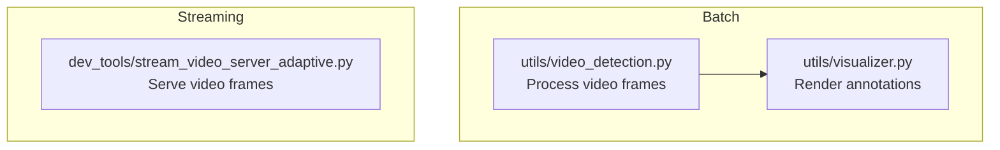
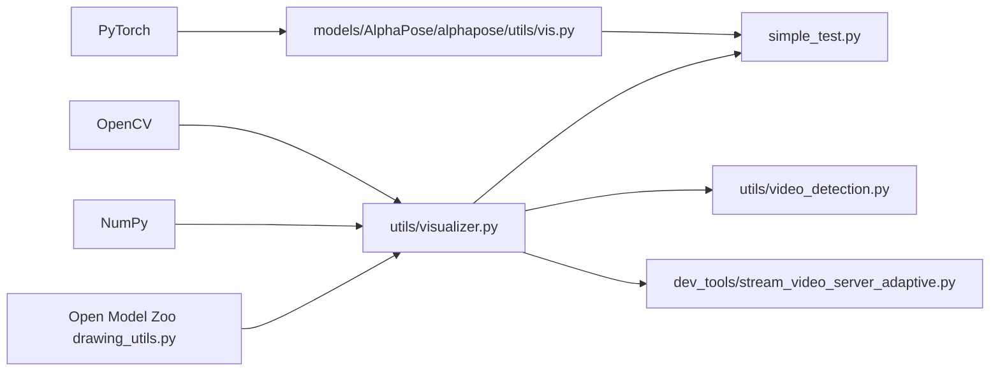

# Visualization Tools

<cite>
**Referenced Files in This Document**
- [visualizer.py](file://utils/visualizer.py)
- [vis.py](file://models/AlphaPose/alphapose/utils/vis.py)
- [simple_test.py](file://simple_test.py)
- [video_detection.py](file://utils/video_detection.py)
- [stream_video_server_adaptive.py](file://dev_tools/stream_video_server_adaptive.py)
- [drawing_utils.py](file://open_model_zoo/demos/common/python/visualizers/drawing_utils.py)
- [__init__.py](file://open_model_zoo/demos/common/python/visualizers/__init__.py)
</cite>

## Table of Contents
1. [Introduction](#introduction)
2. [Project Structure](#project-structure)
3. [Core Components](#core-components)
4. [Architecture Overview](#architecture-overview)
5. [Detailed Component Analysis](#detailed-component-analysis)
6. [Dependency Analysis](#dependency-analysis)
7. [Performance Considerations](#performance-considerations)
8. [Troubleshooting Guide](#troubleshooting-guide)
9. [Conclusion](#conclusion)
10. [Appendices](#appendices)

## Introduction
This document describes the visualization tools used to render human pose estimation results. It focuses on:
- Skeleton drawing using COCO body topology to connect keypoints
- Keypoint overlay rendering with customizable point sizes, colors, and visibility indicators
- Bounding box visualization for detected persons with optional confidence score display
- Frame processing utilities for batch visualization workflows and video frame rendering
- Examples of generated visual outputs and customization options for styling, transparency, and label formatting
- Performance considerations for real-time and batch scenarios

## Project Structure
The visualization capabilities span several modules:
- A lightweight, generic visualizer for COCO-style skeletons and bounding boxes
- AlphaPose-specific visualization utilities supporting multiple pose formats and advanced rendering
- Example integration in a real-time pipeline
- Additional drawing utilities and visualizers from the Open Model Zoo demos

**Diagram sources**
- [visualizer.py:1-52](file://utils/visualizer.py#L1-L52)
- [vis.py:387-445](file://models/AlphaPose/alphapose/utils/vis.py#L387-L445)
- [simple_test.py:203-210](file://simple_test.py#L203-L210)
- [video_detection.py](file://utils/video_detection.py)
- [stream_video_server_adaptive.py:56-73](file://dev_tools/stream_video_server_adaptive.py#L56-L73)
- [drawing_utils.py](file://open_model_zoo/demos/common/python/visualizers/drawing_utils.py)
- [__init__.py](file://open_model_zoo/demos/common/python/visualizers/__init__.py)

**Section sources**
- [visualizer.py:1-52](file://utils/visualizer.py#L1-L52)
- [vis.py:387-445](file://models/AlphaPose/alphapose/utils/vis.py#L387-L445)
- [simple_test.py:203-210](file://simple_test.py#L203-L210)
- [video_detection.py](file://utils/video_detection.py)
- [stream_video_server_adaptive.py:56-73](file://dev_tools/stream_video_server_adaptive.py#L56-L73)
- [drawing_utils.py](file://open_model_zoo/demos/common/python/visualizers/drawing_utils.py)
- [__init__.py](file://open_model_zoo/demos/common/python/visualizers/__init__.py)

## Core Components
- Generic COCO-style visualizer:
  - Draws skeleton lines using predefined COCO body topology
  - Renders keypoints with distinct colors per joint index and optional score labels
  - Draws bounding boxes around detected persons
  - Configurable threshold for visibility and optional score display
- AlphaPose visualizer:
  - Supports multiple pose formats (COCO-17, HALPE-26, etc.) with dedicated joint connections and color palettes
  - Renders 3D mesh overlays with transparency blending
  - Handles visibility thresholds and dynamic line thickness based on keypoint scores
- Integration utilities:
  - Real-time frame processing hook for rendering
  - Batch video detection pipeline
  - Video streaming server for continuous visualization

Key customization points:
- Line thickness and color for skeletons
- Point radius and color per joint index
- Bounding box color and thickness
- Score label font scale and offset
- Transparency for 3D overlays

**Section sources**
- [visualizer.py:4-52](file://utils/visualizer.py#L4-L52)
- [vis.py:387-445](file://models/AlphaPose/alphapose/utils/vis.py#L387-L445)
- [vis.py:628-635](file://models/AlphaPose/alphapose/utils/vis.py#L628-L635)
- [simple_test.py:203-210](file://simple_test.py#L203-L210)

## Architecture Overview
The visualization pipeline integrates pose results into frames through a modular design:
- Pose results are passed to a renderer that applies topology-aware drawing
- Optional score-based filtering ensures only confident joints are drawn
- Bounding boxes annotate person regions
- Real-time or batch pipelines consume the renderer to produce annotated frames

**Diagram sources**
- [visualizer.py:4-52](file://utils/visualizer.py#L4-L52)
- [simple_test.py:203-210](file://simple_test.py#L203-L210)

## Detailed Component Analysis

### Generic COCO-Style Visualizer
Responsibilities:
- Build skeleton lines from COCO body topology
- Draw keypoints with color-coded by joint index
- Optionally draw bounding boxes and score labels
- Apply a visibility threshold to prune low-confidence joints

Processing logic:
- Iterate over bodies and topology-defined edges
- Validate keypoint existence and scores before drawing lines
- Draw polylines for skeleton segments
- Color-code keypoints based on index parity and special cases
- Optionally render score labels near keypoints
- Draw bounding boxes when enabled

**Diagram sources**
- [visualizer.py:4-52](file://utils/visualizer.py#L4-L52)

**Section sources**
- [visualizer.py:4-52](file://utils/visualizer.py#L4-L52)

### AlphaPose Multi-Format Visualizer
Capabilities:
- Supports COCO-17, HALPE-26, and other formats with dedicated joint pairings and color sets
- Dynamically adjusts line thickness based on keypoint score sums
- Adds synthetic nose joint for COCO-17 when missing
- Renders 3D SMPL meshes with alpha blending for transparency

Topology and coloring:
- Joint pairs are defined per format
- Per-joint and per-line colors are precomputed
- Visibility thresholds are applied to filter weak detections

3D mesh rendering:
- Projects 3D vertices to 2D using focal length derived from bounding box width
- Blends mesh color with the background using an alpha factor

**Diagram sources**
- [vis.py:441-445](file://models/AlphaPose/alphapose/utils/vis.py#L441-L445)
- [vis.py:628-635](file://models/AlphaPose/alphapose/utils/vis.py#L628-L635)
- [vis.py:600-625](file://models/AlphaPose/alphapose/utils/vis.py#L600-L625)

**Section sources**
- [vis.py:387-445](file://models/AlphaPose/alphapose/utils/vis.py#L387-L445)
- [vis.py:441-445](file://models/AlphaPose/alphapose/utils/vis.py#L441-L445)
- [vis.py:628-635](file://models/AlphaPose/alphapose/utils/vis.py#L628-L635)
- [vis.py:600-625](file://models/AlphaPose/alphapose/utils/vis.py#L600-L625)

### Integration in Real-Time Pipeline
The real-time integration demonstrates:
- Hooking into a frame-processing method to render poses
- Passing topology lines and configuration flags to the renderer
- Rendering only when bodies are present

**Diagram sources**
- [simple_test.py:203-210](file://simple_test.py#L203-L210)
- [visualizer.py:4-52](file://utils/visualizer.py#L4-L52)

**Section sources**
- [simple_test.py:203-210](file://simple_test.py#L203-L210)
- [visualizer.py:4-52](file://utils/visualizer.py#L4-L52)

### Batch Video Detection and Streaming
- Batch processing:
  - Video detection pipeline consumes frames and renders annotations
- Streaming:
  - Video streaming server generates frames and handles end-of-video visuals

**Diagram sources**
- [video_detection.py](file://utils/video_detection.py)
- [visualizer.py:1-52](file://utils/visualizer.py#L1-L52)
- [stream_video_server_adaptive.py:56-73](file://dev_tools/stream_video_server_adaptive.py#L56-L73)

**Section sources**
- [video_detection.py](file://utils/video_detection.py)
- [stream_video_server_adaptive.py:56-73](file://dev_tools/stream_video_server_adaptive.py#L56-L73)
- [visualizer.py:1-52](file://utils/visualizer.py#L1-L52)

### Open Model Zoo Drawing Utilities
- Shared drawing utilities and initialization for demo visualizers
- Provides reusable primitives for consistent visualization across demos

**Section sources**
- [drawing_utils.py](file://open_model_zoo/demos/common/python/visualizers/drawing_utils.py)
- [__init__.py](file://open_model_zoo/demos/common/python/visualizers/__init__.py)

## Dependency Analysis
- The generic visualizer depends on OpenCV for drawing primitives and NumPy for coordinate handling.
- The AlphaPose visualizer depends on PyTorch tensors for keypoint handling and optionally on 3D rendering utilities.
- Integration scripts depend on the visualizer modules to annotate frames.

**Diagram sources**
- [visualizer.py:1-52](file://utils/visualizer.py#L1-L52)
- [vis.py:441-445](file://models/AlphaPose/alphapose/utils/vis.py#L441-L445)
- [simple_test.py:203-210](file://simple_test.py#L203-L210)
- [video_detection.py](file://utils/video_detection.py)
- [stream_video_server_adaptive.py:56-73](file://dev_tools/stream_video_server_adaptive.py#L56-L73)
- [drawing_utils.py](file://open_model_zoo/demos/common/python/visualizers/drawing_utils.py)

**Section sources**
- [visualizer.py:1-52](file://utils/visualizer.py#L1-L52)
- [vis.py:441-445](file://models/AlphaPose/alphapose/utils/vis.py#L441-L445)
- [simple_test.py:203-210](file://simple_test.py#L203-L210)
- [video_detection.py](file://utils/video_detection.py)
- [stream_video_server_adaptive.py:56-73](file://dev_tools/stream_video_server_adaptive.py#L56-L73)
- [drawing_utils.py](file://open_model_zoo/demos/common/python/visualizers/drawing_utils.py)

## Performance Considerations
- Real-time rendering:
  - Prefer vectorized drawing operations and avoid per-pixel loops
  - Use appropriate line thickness and point radius to balance readability and speed
  - Filter low-confidence joints before drawing to reduce overdraw
- Batch processing:
  - Precompute topology and color arrays to minimize per-frame overhead
  - Use efficient image encoders for streaming outputs
- 3D mesh rendering:
  - Adjust alpha blending and mesh resolution to balance quality and throughput
  - Consider downsampling or skipping 3D rendering for constrained environments

[No sources needed since this section provides general guidance]

## Troubleshooting Guide
- No skeletons appear:
  - Verify that bodies contain keypoints and scores
  - Confirm that the visibility threshold is not set too high
- Incorrect joint connections:
  - Ensure the topology lines match the pose format (COCO-17 vs. HALPE-26)
- Keypoints not colored as expected:
  - Check the scoring and indexing logic for color assignment
- Bounding boxes missing:
  - Enable the bounding box flag and confirm xmin/ymin/xmax/ymax fields are populated
- 3D mesh not visible:
  - Confirm 3D rendering is enabled and focal length is computed from bounding box width
  - Verify alpha blending parameters and mesh faces are valid

**Section sources**
- [visualizer.py:4-52](file://utils/visualizer.py#L4-L52)
- [vis.py:387-445](file://models/AlphaPose/alphapose/utils/vis.py#L387-L445)
- [vis.py:600-625](file://models/AlphaPose/alphapose/utils/vis.py#L600-L625)

## Conclusion
The visualization tools provide a flexible, modular framework for rendering human pose estimation results. The generic COCO-style visualizer offers straightforward skeleton and bounding box rendering, while the AlphaPose visualizer extends support to multiple formats and 3D mesh overlays. Integration examples demonstrate real-time and batch rendering workflows, with clear customization points for styling and performance.

[No sources needed since this section summarizes without analyzing specific files]

## Appendices

### Customization Options Summary
- Skeleton:
  - Line thickness and color
  - Dynamic thickness based on keypoint scores
- Keypoints:
  - Point radius and color per joint index
  - Visibility threshold
- Bounding boxes:
  - Box color and thickness
- Labels:
  - Font scale and offset
- 3D Mesh:
  - Transparency via alpha blending
  - Focal length derived from bounding box width

**Section sources**
- [visualizer.py:4-52](file://utils/visualizer.py#L4-L52)
- [vis.py:600-625](file://models/AlphaPose/alphapose/utils/vis.py#L600-L625)