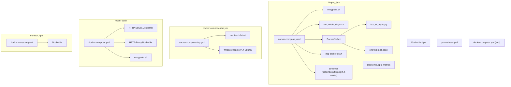
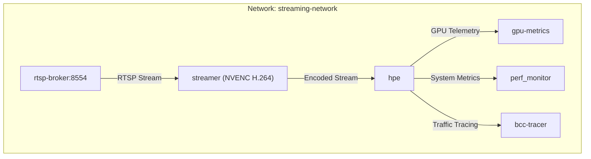
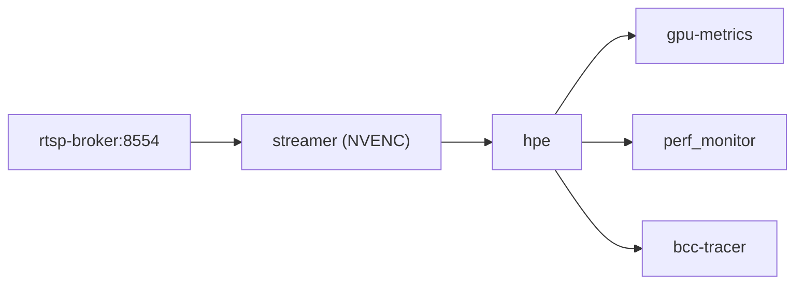

# Containerization and Docker Configuration

<cite>
**Referenced Files in This Document**
- [docker-compose.yaml](file://ffmpeg_hpe/docker-compose.yaml)
- [docker-compose.rtsp.yml](file://docker-compose.rtsp.yml)
- [Dockerfile.gpu_metrics](file://ffmpeg_hpe/Dockerfile.gpu_metrics)
- [entrypoint.sh](file://ffmpeg_hpe/entrypoint.sh)
- [run_nvidia_dcgm.sh](file://ffmpeg_hpe/run_nvidia_dcgm.sh)
- [Dockerfile.bcc](file://ffmpeg_hpe/bpftrace-tracer/Dockerfile.bcc)
- [bcc_rx_bytes.py](file://ffmpeg_hpe/bpftrace-tracer/bcc_rx_bytes.py)
- [entrypoint.sh](file://ffmpeg_hpe/bpftrace-tracer/entrypoint.sh)
- [docker-compose.yml](file://recent-dash/docker-compose.yml)
- [HTTP-Server.Dockerfile](file://recent-dash/HTTP-Server.Dockerfile)
- [HTTP-Proxy.Dockerfile](file://recent-dash/HTTP-Proxy.Dockerfile)
- [entrypoint.sh](file://recent-dash/entrypoint.sh)
- [docker-compose.yml](file://monitor_hpe/docker-compose.yaml)
- [Dockerfile](file://monitor_hpe/Dockerfile)
- [Dockerfile.hpe](file://Dockerfile.hpe)
- [prometheus.yml](file://prometheus.yml)
- [docker-compose.yml](file://docker-compose.yml)
</cite>

## Update Summary
**Changes Made**
- Updated RTSP streaming architecture with new MediaMTX broker and FFmpeg streamer services
- Replaced legacy HTTP H.264 streaming server with RTSP-based streaming pipeline
- Updated Docker Compose configuration to reflect new service dependencies and networking
- Revised component analysis to reflect RTSP broker (rtsp-broker:8554) and streamer service using jrottenberg/ffmpeg:4.4-nvidia
- Updated troubleshooting guidance to address RTSP-specific configurations

## Table of Contents
1. [Introduction](#introduction)
2. [Project Structure](#project-structure)
3. [Core Components](#core-components)
4. [Architecture Overview](#architecture-overview)
5. [Detailed Component Analysis](#detailed-component-analysis)
6. [Dependency Analysis](#dependency-analysis)
7. [Performance Considerations](#performance-considerations)
8. [Troubleshooting Guide](#troubleshooting-guide)
9. [Conclusion](#conclusion)
10. [Appendices](#appendices)

## Introduction
This document explains the containerization and Docker configuration used to orchestrate streaming, inference, and observability services. It covers:
- Docker Compose architecture for orchestrating multiple services including an RTSP broker, FFmpeg streamer, Human Pose Estimation (HPE) application, GPU metrics collector, performance monitor, and a BPF-based traffic tracer.
- Container networking, port mappings, and service dependencies.
- Dockerfile configuration for the HPE application, including base images, environment variables, and runtime dependencies.
- Entrypoint script functionality and container startup procedures.
- Best practices for container resource allocation, GPU passthrough, and production deployment considerations.
- Examples of scaling services and managing container lifecycles.

**Updated** The architecture has been restructured to use RTSP streaming instead of the legacy HTTP H.264 streaming server, providing improved reliability and performance for video streaming in containerized environments.

## Project Structure
The repository organizes containerization artifacts primarily under:
- ffmpeg_hpe: RTSP streaming pipeline, GPU metrics, and BPF tracer services
- docker-compose.rtsp.yml: Alternative RTSP streaming configuration
- recent-dash: HTTP server, proxy, and related containers for caching experiments
- monitor_hpe: monitoring utilities and PID tracking
- Root-level Dockerfiles and compose files for top-level services

**Diagram sources**
- [docker-compose.yaml](file://ffmpeg_hpe/docker-compose.yaml)
- [docker-compose.rtsp.yml](file://docker-compose.rtsp.yml)
- [Dockerfile.gpu_metrics](file://ffmpeg_hpe/Dockerfile.gpu_metrics)
- [entrypoint.sh](file://ffmpeg_hpe/entrypoint.sh)
- [run_nvidia_dcgm.sh](file://ffmpeg_hpe/run_nvidia_dcgm.sh)
- [Dockerfile.bcc](file://ffmpeg_hpe/bpftrace-tracer/Dockerfile.bcc)
- [bcc_rx_bytes.py](file://ffmpeg_hpe/bpftrace-tracer/bcc_rx_bytes.py)
- [entrypoint.sh](file://ffmpeg_hpe/bpftrace-tracer/entrypoint.sh)
- [docker-compose.yml](file://recent-dash/docker-compose.yml)
- [HTTP-Server.Dockerfile](file://recent-dash/HTTP-Server.Dockerfile)
- [HTTP-Proxy.Dockerfile](file://recent-dash/HTTP-Proxy.Dockerfile)
- [entrypoint.sh](file://recent-dash/entrypoint.sh)
- [docker-compose.yaml](file://monitor_hpe/docker-compose.yaml)
- [Dockerfile](file://monitor_hpe/Dockerfile)
- [Dockerfile.hpe](file://Dockerfile.hpe)

**Section sources**
- [docker-compose.yaml](file://ffmpeg_hpe/docker-compose.yaml)
- [docker-compose.rtsp.yml](file://docker-compose.rtsp.yml)
- [docker-compose.yml](file://recent-dash/docker-compose.yml)
- [docker-compose.yaml](file://monitor_hpe/docker-compose.yaml)

## Core Components
- RTSP Broker (mediamtx): Provides RTSP streaming infrastructure with HLS support for debugging.
- FFmpeg Streamer: Encodes and streams video using NVENC H.264 encoding with low-latency settings.
- HPE Application: Performs pose estimation on the RTSP stream; supports GPU acceleration and configurable device selection.
- GPU metrics collector: Gathers GPU utilization and telemetry periodically.
- Performance monitor: Monitors host-level processes and system resources.
- BPF tracer: Captures and logs network traffic related to the HPE pipeline using BCC/BPF.
- Recent-DASH services: HTTP server and proxy for caching experiments.

Key orchestration highlights:
- Services share a dedicated bridge network for isolated communication.
- Health checks ensure readiness before dependent services start.
- Resource limits and reservations are configured for predictable performance.
- GPU passthrough is enabled via NVIDIA runtime and environment variables.

**Updated** The streaming architecture now uses RTSP with MediaMTX as the broker and FFmpeg with NVENC encoding for improved streaming performance and reliability.

**Section sources**
- [docker-compose.yaml](file://ffmpeg_hpe/docker-compose.yaml)
- [docker-compose.rtsp.yml](file://docker-compose.rtsp.yml)
- [docker-compose.yml](file://recent-dash/docker-compose.yml)
- [docker-compose.yaml](file://monitor_hpe/docker-compose.yaml)

## Architecture Overview
The orchestration centers on a shared network and a strict startup order:
- rtsp-broker starts first and exposes RTSP (8554) and HLS (8888) ports.
- streamer depends on the broker and encodes video using NVENC with low-latency settings.
- hpe depends on both the broker and streamer being healthy and consumes the RTSP stream.
- gpu-metrics runs alongside hpe to collect GPU telemetry.
- perf_monitor and bcc-tracer operate independently but can observe the pipeline.

**Diagram sources**
- [docker-compose.yaml](file://ffmpeg_hpe/docker-compose.yaml)

**Section sources**
- [docker-compose.yaml](file://ffmpeg_hpe/docker-compose.yaml)

## Detailed Component Analysis

### RTSP Broker (MediaMTX)
- Purpose: Provide RTSP streaming infrastructure with HLS support for debugging.
- Networking: Exposes RTSP (8554) and HLS (8888) ports on the host.
- Configuration: Uses MediaMTX with debug logging and on-demand streaming.
- Resource limits: CPU and memory limits with reservations for controlled resource usage.
- Healthcheck: No healthcheck due to distroless container limitations.

Operational notes:
- Port 8554 is used for RTSP streaming to the HPE application.
- Port 8888 provides HLS access for debugging and monitoring.
- Readiness is enforced externally by the experiment runner.

**Section sources**
- [docker-compose.yaml](file://ffmpeg_hpe/docker-compose.yaml)

### FFmpeg Streamer (NVENC Encoding)
- Purpose: Encode and stream video using NVIDIA NVENC H.264 encoding with low-latency settings.
- Image: jrottenberg/ffmpeg:4.4-nvidia with NVIDIA runtime capabilities.
- GPU Passthrough: Uses NVIDIA runtime with compute, utility, and video capabilities.
- Encoding Settings: NVENC low-latency with preset p2 and tune ll for balanced latency.
- Transport: Forces RTP over TCP for consistent packet capture by BPF tracer.
- Volume: Mounts video directory for input files.
- Dependencies: Depends on rtsp-broker being started.

Encoding configuration highlights:
- Low-latency NVENC settings (-preset p2 -tune ll)
- TCP transport for reliable packet capture
- Infinite loop (-stream_loop -1) for repeatable experiments
- GPU reservation for guaranteed hardware access

**Section sources**
- [docker-compose.yaml](file://ffmpeg_hpe/docker-compose.yaml)

### HPE Application (Human Pose Estimation)
- Purpose: Consume the RTSP stream and perform pose estimation with optional OpenVINO and PyTorch backends.
- GPU Passthrough: Uses NVIDIA runtime and visible device configuration.
- Environment Variables: Controls input stream URL, device selection, timeouts, and buffer sizes.
- Shared Memory: Configured for large model requirements.
- Startup Command: Executes the main application with method, input, CSV output, and measurement interval parameters.
- Entrypoint Behavior: Conditionally starts GPU metrics in the background and executes the main command.

Runtime configuration highlights:
- Device selection and CUDA visibility are explicitly set.
- FFMPEG timeouts are increased to accommodate long streams.
- Healthcheck monitors the main process.
- RTSP transport forced to TCP via OPENCV_FFMPEG_CAPTURE_OPTIONS.

**Section sources**
- [docker-compose.yaml](file://ffmpeg_hpe/docker-compose.yaml)
- [entrypoint.sh](file://ffmpeg_hpe/entrypoint.sh)
- [Dockerfile.hpe](file://Dockerfile.hpe)

### GPU Metrics Collector
- Purpose: Periodically collect GPU telemetry (utilization, memory, temperature, power) and write to CSV.
- Image: NVIDIA CUDA base image with NVIDIA utilities.
- Execution: Runs a monitoring script that queries GPU statistics at a configurable interval.
- Output: Writes CSV data to a mounted output directory.

Operational notes:
- Supports duration-limited runs and graceful shutdown via signal handling.
- Designed to run in parallel with the HPE workload.

**Section sources**
- [Dockerfile.gpu_metrics](file://ffmpeg_hpe/Dockerfile.gpu_metrics)
- [run_nvidia_dcgm.sh](file://ffmpeg_hpe/run_nvidia_dcgm.sh)

### Performance Monitor
- Purpose: Observe host-level processes and system resources for the experiment.
- Privileges: Requires elevated capabilities and host PID namespace for accurate monitoring.
- Volumes: Mounts output and PID directories for artifact persistence and process tracking.

**Section sources**
- [docker-compose.yaml](file://ffmpeg_hpe/docker-compose.yaml)
- [docker-compose.yaml](file://monitor_hpe/docker-compose.yaml)
- [Dockerfile](file://monitor_hpe/Dockerfile)

### BPF Tracer (BCC-based)
- Purpose: Capture TCP RX bytes for the RTSP stream between the streamer and HPE.
- Image: Ubuntu-based with BCC built from source and Python dependencies.
- Execution: Detects the HPE listening port and attaches a raw socket filter to capture traffic on the default interface.
- Output: Writes per-timestamp RX deltas and cumulative byte counts to CSV.

Security and capabilities:
- Requires privileged mode and specific capabilities for kernel tracing.
- Shares the HPE service network namespace to simplify IP/port discovery.

**Section sources**
- [Dockerfile.bcc](file://ffmpeg_hpe/bpftrace-tracer/Dockerfile.bcc)
- [bcc_rx_bytes.py](file://ffmpeg_hpe/bpftrace-tracer/bcc_rx_bytes.py)
- [entrypoint.sh](file://ffmpeg_hpe/bpftrace-tracer/entrypoint.sh)
- [docker-compose.yaml](file://ffmpeg_hpe/docker-compose.yaml)

### Alternative RTSP Configuration
- Purpose: Alternative RTSP streaming setup using host networking for simplified deployment.
- Services: mediamtx (broker) and ffmpeg-streamer (encoder) with host networking.
- Configuration: Uses host networking for direct access to RTSP port 8554.
- Encoding: Direct video copying with TCP transport for reliable streaming.

**Section sources**
- [docker-compose.rtsp.yml](file://docker-compose.rtsp.yml)

### Recent-DASH Infrastructure (Alternative Orchestration)
- Purpose: HTTP server and proxy for caching experiments with configurable parameters.
- Services: http_server, http_proxy, http_client, perf_monitor, and a containerized BPF tracer.
- Networking: Host networking for the tracer; host PID sharing for process monitoring.
- Entrypoints: Launch scripts manage process lifecycle and PID tracking.

**Section sources**
- [docker-compose.yml](file://recent-dash/docker-compose.yml)
- [HTTP-Server.Dockerfile](file://recent-dash/HTTP-Server.Dockerfile)
- [HTTP-Proxy.Dockerfile](file://recent-dash/HTTP-Proxy.Dockerfile)
- [entrypoint.sh](file://recent-dash/entrypoint.sh)

## Dependency Analysis
Inter-service dependencies and startup order:
- rtsp-broker starts first and exposes RTSP/HLS services.
- streamer depends on rtsp-broker being started and encodes video files.
- hpe depends on both rtsp-broker and streamer being healthy.
- gpu-metrics and perf-monitor can start independently but benefit from the pipeline being active.
- bcc-tracer depends on the HPE container's network namespace and detects HPE's outbound connection to the broker.

**Diagram sources**
- [docker-compose.yaml](file://ffmpeg_hpe/docker-compose.yaml)

**Section sources**
- [docker-compose.yaml](file://ffmpeg_hpe/docker-compose.yaml)

## Performance Considerations
- Resource Allocation:
  - CPU and memory limits and reservations are defined per service to prevent noisy-neighbor effects.
  - HPE uses significant shared memory to support model inference.
- GPU Passthrough:
  - NVIDIA runtime and environment variables ensure the HPE container sees the correct GPU(s).
  - Device reservations are configured for guaranteed GPU access.
  - NVENC encoding provides hardware-accelerated H.264 encoding with low-latency settings.
- Observability:
  - Healthchecks provide early failure detection.
  - GPU metrics and BPF tracing offer deep insights into throughput and bottlenecks.
- FFMPEG Tuning:
  - Increased timeouts reduce premature failures on long streams.
  - NVENC low-latency settings (-preset p2 -tune ll) optimize for real-time streaming.
- Security Hardening:
  - Non-root users, read-only root filesystems, and temporary filesystems for /tmp improve isolation.

**Updated** The new RTSP architecture with NVENC encoding provides improved streaming performance and reduced CPU usage compared to software-based encoding.

**Section sources**
- [docker-compose.yaml](file://ffmpeg_hpe/docker-compose.yaml)
- [docker-compose.rtsp.yml](file://docker-compose.rtsp.yml)
- [docker-compose.yaml](file://monitor_hpe/docker-compose.yaml)

## Troubleshooting Guide
Common issues and remedies:
- HPE fails to start or exits quickly:
  - Verify the rtsp-broker is healthy and accessible on port 8554.
  - Confirm environment variables for input RTSP URL and device selection are correct.
  - Check GPU visibility and NVIDIA runtime configuration.
  - Verify RTSP stream is being produced by the streamer service.
- RTSP stream not available:
  - Check that rtsp-broker container is running and exposing ports 8554/8888.
  - Verify streamer service is encoding and publishing to rtsp://rtsp-broker:8554/stream.
  - Ensure video file exists in the mounted /data volume.
- GPU metrics container does not produce output:
  - Ensure NVIDIA drivers and utilities are present in the container.
  - Validate output directory permissions and mount points.
- BPF tracer cannot detect HPE port:
  - Confirm the tracer shares the HPE network namespace.
  - Verify the default interface is correctly detected and accessible.
  - Check that HPE establishes an outbound connection to the broker before the tracer starts.
- Port conflicts or accessibility:
  - Review port mappings and ensure host ports 8554/8888 are free.
  - Validate firewall and network policies in the environment.
- NVENC encoding issues:
  - Verify NVIDIA GPU is available and properly configured.
  - Check that jrottenberg/ffmpeg:4.4-nvidia image supports NVENC capabilities.
  - Ensure proper GPU reservations are configured.

**Updated** Troubleshooting guidance now addresses RTSP-specific issues including broker connectivity, streamer encoding problems, and NVENC configuration.

**Section sources**
- [docker-compose.yaml](file://ffmpeg_hpe/docker-compose.yaml)
- [run_nvidia_dcgm.sh](file://ffmpeg_hpe/run_nvidia_dcgm.sh)
- [entrypoint.sh](file://ffmpeg_hpe/bpftrace-tracer/entrypoint.sh)
- [docker-compose.rtsp.yml](file://docker-compose.rtsp.yml)

## Conclusion
The containerization setup provides a robust, observable, and scalable pipeline for RTSP streaming, inference, and monitoring. By leveraging Docker Compose, RTSP streaming with MediaMTX, NVENC encoding, GPU passthrough, and BPF-based tracing, teams can reproduce and operate the HPE experiment consistently across environments. The new RTSP architecture with hardware-accelerated encoding provides improved performance and reliability compared to the legacy HTTP streaming approach. Applying the best practices outlined here ensures predictable performance, improved security, and easier maintenance.

## Appendices

### Dockerfile Configuration for HPE Application
Highlights:
- Base image tailored for CUDA and PyTorch development.
- Manual compilation of FFmpeg with NVIDIA CUDA/NVENC/NPP support.
- Manual compilation of OpenCV 4.10.0 with CUDA and FFMPEG support.
- Installation of Python dependencies and optional OpenVINO with GPU support.
- Model downloads and extension builds during image build.
- Entrypoint and default CMD for flexible invocation.

**Section sources**
- [Dockerfile.hpe](file://Dockerfile.hpe)

### Container Networking and Port Mappings
- Bridge network: All services join a shared network for internal communication.
- Ports:
  - RTSP broker exposes RTSP (8554) and HLS (8888) ports.
  - Alternative RTSP configuration uses host networking on port 8554.
  - Recent-DASH services expose port 80 internally; client can publish externally if needed.
- DNS: Search domain configured for service discovery.

**Updated** Networking configuration now uses RTSP broker (8554) and HLS (8888) ports instead of the legacy HTTP streaming server.

**Section sources**
- [docker-compose.yaml](file://ffmpeg_hpe/docker-compose.yaml)
- [docker-compose.rtsp.yml](file://docker-compose.rtsp.yml)
- [docker-compose.yml](file://recent-dash/docker-compose.yml)

### Entrypoint Script Functionality
- Conditional GPU metrics launcher: Starts the GPU metrics script in the background when enabled.
- Argument forwarding: Executes the provided command or defaults to the main application.
- Graceful shutdown: Terminates background processes on SIGTERM.

**Section sources**
- [entrypoint.sh](file://ffmpeg_hpe/entrypoint.sh)

### Scaling and Lifecycle Management
- Scaling:
  - Duplicate the HPE service with different device assignments or separate instances for multiple inputs.
  - Scale the RTSP broker and streamer if bandwidth becomes a bottleneck.
- Lifecycle:
  - Use restart policies to maintain service uptime.
  - Healthchecks ensure automatic restarts on failure.
  - Graceful shutdown via signals allows cleanup of background processes.

**Updated** Scaling considerations now include RTSP broker and streamer services for handling increased streaming demands.

**Section sources**
- [docker-compose.yaml](file://ffmpeg_hpe/docker-compose.yaml)
- [docker-compose.rtsp.yml](file://docker-compose.rtsp.yml)

### Prometheus and Grafana Integration
- Prometheus configuration file is included at the repository root for scraping metrics.
- Grafana dashboards can be configured to visualize GPU and system metrics collected by the pipeline.

**Section sources**
- [prometheus.yml](file://prometheus.yml)
- [docker-compose.yml](file://docker-compose.yml)

### RTSP Streaming Architecture Migration
The repository has migrated from HTTP H.264 streaming to RTSP streaming for improved reliability and performance:

**Legacy Architecture:**
- h264-streaming-server: HTTP-based H.264 streaming over port 8089
- Direct HTTP stream consumption by HPE application

**Current Architecture:**
- rtsp-broker: RTSP streaming broker (bluenviron/mediamtx:latest)
- streamer: Hardware-accelerated NVENC encoding (jrottenberg/ffmpeg:4.4-nvidia)
- HPE application: RTSP stream consumption with TCP transport

**Migration Benefits:**
- Improved streaming reliability with RTSP protocol
- Hardware-accelerated encoding reduces CPU usage
- Better packet capture and monitoring capabilities
- Enhanced scalability and performance

**Section sources**
- [docker-compose.yaml](file://ffmpeg_hpe/docker-compose.yaml)
- [docker-compose.rtsp.yml](file://docker-compose.rtsp.yml)