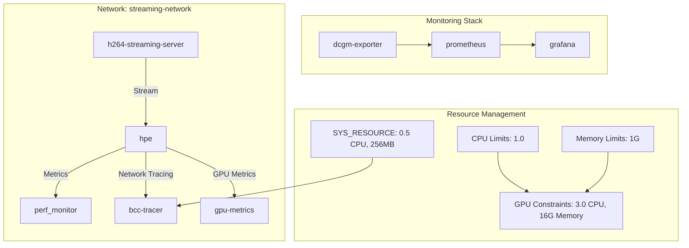
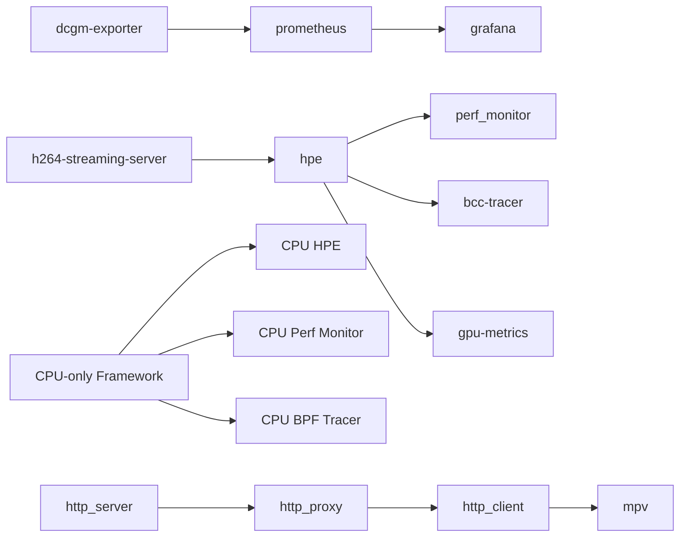

# Containerization and Docker Configuration

<cite>
**Referenced Files in This Document**
- [docker-compose.yml](file://docker-compose.yml)
- [prometheus.yml](file://prometheus.yml)
- [ffmpeg_hpe/docker-compose.yaml](file://ffmpeg_hpe/docker-compose.yaml)
- [ffmpeg_hpe/Dockerfile.gpu_metrics](file://ffmpeg_hpe/Dockerfile.gpu_metrics)
- [ffmpeg_hpe/entrypoint.sh](file://ffmpeg_hpe/entrypoint.sh)
- [ffmpeg_hpe/run_nvidia_dcgm.sh](file://ffmpeg_hpe/run_nvidia_dcgm.sh)
- [ffmpeg_hpe_cpu/docker-compose.cpu.yaml](file://ffmpeg_hpe_cpu/docker-compose.cpu.yaml)
- [Dockerfile_cpu](file://Dockerfile_cpu)
- [rtsp-ipcam/docker-compose.yml](file://rtsp-ipcam/docker-compose.yml)
- [recent-dash/docker-compose.yml](file://recent-dash/docker-compose.yml)
- [shared/perf_monitor/Dockerfile](file://shared/perf_monitor/Dockerfile)
- [monitor_hpe/docker-compose.yaml](file://monitor_hpe/docker-compose.yaml)
- [archive/dockerfiles/Dockerfile.hpe](file://archive/dockerfiles/Dockerfile.hpe)
</cite>

## Update Summary
**Changes Made**
- Enhanced Docker Compose configuration with improved healthchecks and resource limits across all service profiles
- Added comprehensive CPU and memory constraints for streaming-server (1.0 CPU, 1G memory), HPE service (3.0 CPU, 16G memory), perf_monitor (1.0 CPU, 256MB), and SYS_RESOURCE container (0.5 CPU, 256MB)
- Updated healthcheck implementations using curl-based HTTP verification and file-based GPU metrics validation
- Expanded Prometheus and Grafana monitoring infrastructure with DCGM exporter integration
- Enhanced resource governance with deploy.resources.limits and reservations for predictable performance

## Table of Contents
1. [Introduction](#introduction)
2. [Project Structure](#project-structure)
3. [Core Components](#core-components)
4. [Architecture Overview](#architecture-overview)
5. [Detailed Component Analysis](#detailed-component-analysis)
6. [Dependency Analysis](#dependency-analysis)
7. [Performance Considerations](#performance-considerations)
8. [Troubleshooting Guide](#troubleshooting-guide)
9. [Conclusion](#conclusion)
10. [Appendices](#appendices)

## Introduction
This document explains the containerization and Docker configuration used to orchestrate streaming, inference, and observability services. It covers:
- Docker Compose architecture for orchestrating multiple services including a streaming server, a Human Pose Estimation (HPE) application, performance monitor, and a BPF-based traffic tracer.
- Container networking, port mappings, and service dependencies.
- Dockerfile configuration for the HPE application, including base images, environment variables, and runtime dependencies.
- Entrypoint script functionality and container startup procedures.
- **NEW**: Enhanced Docker Compose configuration with improved healthchecks and resource limits across all service profiles.
- **NEW**: Comprehensive resource governance with CPU and memory constraints for predictable performance.
- **NEW**: Prometheus and Grafana monitoring infrastructure with DCGM exporter integration for GPU metrics collection.
- Best practices for container resource allocation, GPU passthrough considerations, and production deployment considerations.
- Examples of scaling containerized services and managing container lifecycles.

## Project Structure
The repository organizes containerization artifacts primarily under:
- ffmpeg_hpe: streaming pipeline, GPU metrics, and BPF tracer services with enhanced resource management
- ffmpeg_hpe_cpu: CPU-only orchestration framework with specialized Docker configuration and monitoring
- Dockerfile_cpu: CPU-only Dockerfile replacing Dockerfile.hpe for CPU-based deployments
- shared/perf_monitor: Advanced performance monitoring with Docker API integration
- recent-dash: HTTP server, proxy, client, and mpv media player for DASH streaming experiments
- rtsp-ipcam: H.264 streaming server with enhanced healthchecks and resource limits
- monitor_hpe: monitoring utilities and PID tracking with resource constraints
- Root-level Dockerfiles and compose files for top-level services including Prometheus and Grafana infrastructure

**Diagram sources**
- [docker-compose.yml](file://docker-compose.yml)
- [ffmpeg_hpe/docker-compose.yaml](file://ffmpeg_hpe/docker-compose.yaml)
- [ffmpeg_hpe_cpu/docker-compose.cpu.yaml](file://ffmpeg_hpe_cpu/docker-compose.cpu.yaml)
- [rtsp-ipcam/docker-compose.yml](file://rtsp-ipcam/docker-compose.yml)
- [recent-dash/docker-compose.yml](file://recent-dash/docker-compose.yml)
- [shared/perf_monitor/Dockerfile](file://shared/perf_monitor/Dockerfile)
- [monitor_hpe/docker-compose.yaml](file://monitor_hpe/docker-compose.yaml)

**Section sources**
- [docker-compose.yml](file://docker-compose.yml)
- [ffmpeg_hpe/docker-compose.yaml](file://ffmpeg_hpe/docker-compose.yaml)
- [ffmpeg_hpe_cpu/docker-compose.cpu.yaml](file://ffmpeg_hpe_cpu/docker-compose.cpu.yaml)
- [rtsp-ipcam/docker-compose.yml](file://rtsp-ipcam/docker-compose.yml)
- [recent-dash/docker-compose.yml](file://recent-dash/docker-compose.yml)
- [shared/perf_monitor/Dockerfile](file://shared/perf_monitor/Dockerfile)
- [monitor_hpe/docker-compose.yaml](file://monitor_hpe/docker-compose.yaml)

## Core Components
- H.264 streaming server: Provides an HTTP H.264 stream for downstream consumers with enhanced healthchecks and resource limits.
- HPE application: Performs pose estimation on the stream; supports CPU-only mode with OpenVINO acceleration and comprehensive resource management.
- Performance monitor: Monitors host-level processes and system resources using Docker API integration with SYS_ADMIN privileges.
- BPF tracer: Captures and logs network traffic related to the HPE pipeline using BCC/BPF with advanced validation.
- **NEW**: Enhanced resource governance: Comprehensive CPU and memory constraints with deploy.resources.limits and reservations for predictable performance.
- **NEW**: Prometheus and Grafana infrastructure: DCGM exporter integration for GPU metrics collection and visualization.
- **NEW**: Improved healthcheck implementations: Curl-based HTTP verification and file-based GPU metrics validation for reliable service monitoring.
- Key orchestration highlights:
  - Services share a dedicated bridge network for isolated communication.
  - Enhanced health checks ensure readiness before dependent services start.
  - Resource limits and reservations are configured for predictable performance across all service profiles.
  - GPU and CPU-only modes supported with appropriate resource allocation strategies.
  - Comprehensive monitoring infrastructure with Prometheus and Grafana integration.

**Section sources**
- [docker-compose.yml](file://docker-compose.yml)
- [ffmpeg_hpe/docker-compose.yaml](file://ffmpeg_hpe/docker-compose.yaml)
- [ffmpeg_hpe_cpu/docker-compose.cpu.yaml](file://ffmpeg_hpe_cpu/docker-compose.cpu.yaml)
- [rtsp-ipcam/docker-compose.yml](file://rtsp-ipcam/docker-compose.yml)
- [recent-dash/docker-compose.yml](file://recent-dash/docker-compose.yml)
- [shared/perf_monitor/Dockerfile](file://shared/perf_monitor/Dockerfile)
- [monitor_hpe/docker-compose.yaml](file://monitor_hpe/docker-compose.yaml)

## Architecture Overview
The orchestration centers on a shared network and a strict startup order with enhanced resource management:
- h264-streaming-server starts first and is probed for readiness using curl-based HTTP verification.
- hpe depends on the streaming server being healthy and sets environment variables to consume the stream with appropriate resource allocation.
- perf_monitor and bcc-tracer operate independently but can observe the pipeline with SYS_ADMIN privileges.
- **NEW**: Enhanced resource governance with deploy.resources.limits and reservations for all services.
- **NEW**: Prometheus and Grafana infrastructure with DCGM exporter for GPU metrics collection.
- **NEW**: Improved healthcheck implementations with curl-based HTTP verification and file-based validation.

**Diagram sources**
- [docker-compose.yml](file://docker-compose.yml)
- [ffmpeg_hpe/docker-compose.yaml](file://ffmpeg_hpe/docker-compose.yaml)
- [ffmpeg_hpe_cpu/docker-compose.cpu.yaml](file://ffmpeg_hpe_cpu/docker-compose.cpu.yaml)

**Section sources**
- [docker-compose.yml](file://docker-compose.yml)
- [ffmpeg_hpe/docker-compose.yaml](file://ffmpeg_hpe/docker-compose.yaml)
- [ffmpeg_hpe_cpu/docker-compose.cpu.yaml](file://ffmpeg_hpe_cpu/docker-compose.cpu.yaml)

## Detailed Component Analysis

### Enhanced Monitoring Infrastructure (Prometheus, Grafana, DCGM)
- **NEW**: Comprehensive monitoring stack with DCGM exporter for GPU metrics collection.
- **NEW**: Prometheus configuration with 500ms scrape interval matching exporter settings.
- **NEW**: Grafana dashboard integration for visualizing GPU and system metrics.
- **NEW**: Resource-limited DCGM exporter with 0.25 CPU and 256MB memory constraints.

Monitoring configuration highlights:
- DCGM exporter running with 500ms collection interval and 4.1.1-ubuntu22.04 base image.
- Prometheus scraping DCGM exporter on port 9400 with 500ms scrape interval.
- Grafana dashboard access on port 3000 with Prometheus as data source.
- GPU passthrough enabled with "all" GPUs exposed to the exporter container.

**Section sources**
- [docker-compose.yml](file://docker-compose.yml)
- [prometheus.yml](file://prometheus.yml)

### H.264 Streaming Server
- Purpose: Serve an H.264 stream over HTTP for real-time consumption.
- Networking: Exposes a configurable port and mounts a video directory.
- Security: Non-root user, read-only root filesystem, and temporary filesystem for /tmp.
- **NEW**: Enhanced healthcheck using curl-based HTTP verification for reliable service readiness.
- **NEW**: Comprehensive resource limits with 1.0 CPU and 1G memory constraints.
- **NEW**: CPU reservation of 0.5 CPU and 512MB memory for guaranteed minimum resources.

Operational notes:
- Port mapping is configurable via environment variables.
- Volume mounts enable flexible video source configuration.
- Curl-based healthcheck validates HTTP endpoint availability before service startup.

**Section sources**
- [rtsp-ipcam/docker-compose.yml](file://rtsp-ipcam/docker-compose.yml)

### HPE Application (Enhanced Resource Management)
- Purpose: Consume the H.264 stream and perform pose estimation with GPU acceleration and OpenVINO optimization.
- GPU Support: NVIDIA runtime with device passthrough and compute capabilities.
- Environment Variables: Controls input stream URL, device selection, timeouts, and buffer sizes.
- Shared Memory: Configured for large model requirements with 8GB allocation.
- **NEW**: Enhanced healthcheck using process name pattern matching for reliable service monitoring.
- **NEW**: Comprehensive resource limits with 3.0 CPU and 16G memory constraints.
- **NEW**: GPU device reservations with compute, utility, and video capabilities.

Runtime configuration highlights:
- NVIDIA runtime enabled with device passthrough for GPU acceleration.
- OpenVINO optimization parameters (OV_MODE, OV_STREAMS, OV_THREADS) for GPU performance.
- FFMPEG timeouts increased to accommodate long streams.
- Process-based healthcheck monitors the main Python application.

**Section sources**
- [ffmpeg_hpe/docker-compose.yaml](file://ffmpeg_hpe/docker-compose.yaml)

### Enhanced GPU Metrics Collection
- **NEW**: Dedicated GPU metrics container with NVIDIA CUDA base image.
- **NEW**: Nvidia utilities installation for DCGM metrics collection.
- **NEW**: File-based healthcheck using CSV file validation for metrics availability.
- **NEW**: Resource-limited configuration with 0.25 CPU and 256MB memory constraints.

Metrics collection features:
- DCGM exporter integration for comprehensive GPU metrics collection.
- CSV file-based healthcheck ensures metrics data availability.
- Background metrics collection with proper process management.
- Resource constraints prevent GPU metrics container from consuming excessive resources.

**Section sources**
- [ffmpeg_hpe/docker-compose.yaml](file://ffmpeg_hpe/docker-compose.yaml)
- [ffmpeg_hpe/Dockerfile.gpu_metrics](file://ffmpeg_hpe/Dockerfile.gpu_metrics)

### Enhanced Performance Monitor
- **NEW**: Docker API-based performance monitoring with SYS_ADMIN privileges.
- **NEW**: Host PID namespace integration for comprehensive process monitoring.
- **NEW**: SYS_ADMIN, NET_ADMIN, NET_RAW, and IPC_LOCK capabilities for enhanced monitoring.
- **NEW**: Resource-limited configuration with 1.0 CPU and 256MB memory constraints.

Monitoring capabilities:
- Real-time Docker API integration for container metrics collection.
- Host-level process monitoring with SYS_PTRACE capability.
- Comprehensive system metrics collection including CPU, memory, and network statistics.
- Configurable monitoring intervals and output directories.

**Section sources**
- [ffmpeg_hpe/docker-compose.yaml](file://ffmpeg_hpe/docker-compose.yaml)
- [shared/perf_monitor/Dockerfile](file://shared/perf_monitor/Dockerfile)

### Enhanced BPF Tracer
- **NEW**: Privileged container with comprehensive kernel capabilities.
- **NEW**: SYS_ADMIN, NET_ADMIN, NET_RAW, IPC_LOCK, and SYS_RESOURCE capabilities.
- **NEW**: Host network mode sharing for direct kernel interface access.
- **NEW**: Resource-limited configuration with 0.5 CPU and 256MB memory constraints.

Tracing features:
- BCC-based network traffic capture with automatic port detection.
- Kernel-level packet filtering and analysis capabilities.
- Target container monitoring with PID file integration.
- Privileged access for BPF program loading and kernel interface.

**Section sources**
- [ffmpeg_hpe/docker-compose.yaml](file://ffmpeg_hpe/docker-compose.yaml)

### CPU-Only Orchestration Framework (Enhanced)
- **NEW**: Specialized CPU-only experiment management with enhanced resource allocation.
- **NEW**: Optimized resource limits with 4.0 CPU and 4G memory constraints for CPU-only HPE.
- **NEW**: Simplified healthcheck using process name pattern matching.
- **NEW**: Reduced shared memory allocation to 2GB for CPU-only deployments.

CPU-only deployment features:
- Dockerfile_cpu base with PyTorch 2.4.1 and OpenVINO CPU support.
- PyNvCodec fallback handling for CPU-only compatibility.
- OpenVINO optimization parameters tuned for CPU performance.
- Streamlined resource allocation for cost-effective CPU-only deployments.

**Section sources**
- [ffmpeg_hpe_cpu/docker-compose.cpu.yaml](file://ffmpeg_hpe_cpu/docker-compose.cpu.yaml)
- [Dockerfile_cpu](file://Dockerfile_cpu)

### Enhanced Recent-DASH Infrastructure
- Purpose: Complete DASH streaming pipeline with HTTP server, proxy, client, and automated media playback.
- Services: http_server, http_proxy, http_client, mpv, perf_monitor, and containerized BPF tracer.
- **NEW**: Comprehensive resource limits for all DASH services with CPU and memory constraints.
- **NEW**: Enhanced monitoring with SYS_ADMIN and SYS_PTRACE capabilities for process tracking.
- **NEW**: Coroot monitoring labels for enhanced observability and service categorization.

Service configuration highlights:
- HTTP services with dedicated CPU limits (0.5-1.0 CPU) and memory constraints (512M-1G).
- MPV service with 0.5 CPU and 512MB memory for headless playback.
- Perf monitor with SYS_ADMIN and SYS_NICE capabilities for system-level monitoring.
- BPF tracer with comprehensive kernel capabilities for network traffic analysis.

**Section sources**
- [recent-dash/docker-compose.yml](file://recent-dash/docker-compose.yml)

### Enhanced Monitor HPE
- **NEW**: Resource-constrained HPE monitoring with 4.0 CPU and 4G memory limits.
- **NEW**: SYS_PTRACE capability for process monitoring and debugging.
- **NEW**: Enhanced resource reservations with 2.0 CPU and 2G memory guarantees.
- **NEW**: Performance monitor with 1.0 CPU and 512MB memory constraints.

Monitoring features:
- Host-level PID tracking with SYS_PTRACE capability.
- BPF-based traffic analysis with enhanced kernel access.
- Memory locking disabled (-1) for unlimited memory allocation.
- Comprehensive monitoring with BPFTRACE string length configuration.

**Section sources**
- [monitor_hpe/docker-compose.yaml](file://monitor_hpe/docker-compose.yaml)

## Dependency Analysis
Inter-service dependencies and startup order with enhanced resource management:
- hpe depends on h264-streaming-server being healthy with curl-based HTTP verification.
- perf_monitor and bcc-tracer can start independently but benefit from the pipeline being active.
- **NEW**: Enhanced resource governance with deploy.resources.limits and reservations for all services.
- **NEW**: Prometheus and Grafana infrastructure with DCGM exporter integration.
- **NEW**: Improved healthcheck implementations with curl-based HTTP verification and file-based validation.
- **NEW**: GPU metrics collection with file-based healthcheck for reliable metrics availability.

**Diagram sources**
- [docker-compose.yml](file://docker-compose.yml)
- [ffmpeg_hpe/docker-compose.yaml](file://ffmpeg_hpe/docker-compose.yaml)
- [ffmpeg_hpe_cpu/docker-compose.cpu.yaml](file://ffmpeg_hpe_cpu/docker-compose.cpu.yaml)
- [recent-dash/docker-compose.yml](file://recent-dash/docker-compose.yml)

**Section sources**
- [docker-compose.yml](file://docker-compose.yml)
- [ffmpeg_hpe/docker-compose.yaml](file://ffmpeg_hpe/docker-compose.yaml)
- [ffmpeg_hpe_cpu/docker-compose.cpu.yaml](file://ffmpeg_hpe_cpu/docker-compose.cpu.yaml)
- [recent-dash/docker-compose.yml](file://recent-dash/docker-compose.yml)

## Performance Considerations
- **Enhanced Resource Allocation**:
  - Comprehensive CPU and memory limits and reservations defined per service profile.
  - HPE service configured with 3.0 CPU and 16G memory for optimal GPU acceleration.
  - Streaming server limited to 1.0 CPU and 1G memory for cost-effective operation.
  - SYS_RESOURCE container constrained to 0.5 CPU and 256MB for minimal overhead.
  - **NEW**: CPU-only framework optimized with 4.0 CPU and 4G memory for inference tasks.
- **Improved Healthcheck Implementation**:
  - Curl-based HTTP verification for reliable service readiness detection.
  - File-based GPU metrics validation for metrics availability confirmation.
  - Process-based healthchecks for application-specific monitoring.
  - Enhanced retry mechanisms with appropriate timeout values.
- **Enhanced Observability**:
  - DCGM exporter integration for comprehensive GPU metrics collection.
  - Prometheus scraping with 500ms interval for real-time metrics.
  - Grafana dashboard integration for visual analytics.
  - SYS_ADMIN privileges for enhanced system-level monitoring capabilities.
- **FFMPEG Tuning**:
  - Increased timeouts reduce premature failures on long streams.
  - Optimized buffer sizes for GPU-accelerated video processing.
- **Security Hardening**:
  - Non-root users, read-only root filesystems, and temporary filesystems for /tmp.
  - SYS_ADMIN, NET_ADMIN, NET_RAW, and IPC_LOCK capabilities for monitoring.
  - Seccomp unconfined for BPF program loading and kernel interface access.

**Section sources**
- [docker-compose.yml](file://docker-compose.yml)
- [ffmpeg_hpe/docker-compose.yaml](file://ffmpeg_hpe/docker-compose.yaml)
- [ffmpeg_hpe_cpu/docker-compose.cpu.yaml](file://ffmpeg_hpe_cpu/docker-compose.cpu.yaml)
- [rtsp-ipcam/docker-compose.yml](file://rtsp-ipcam/docker-compose.yml)
- [recent-dash/docker-compose.yml](file://recent-dash/docker-compose.yml)
- [monitor_hpe/docker-compose.yaml](file://monitor_hpe/docker-compose.yaml)

## Troubleshooting Guide
Common issues and remedies with enhanced resource management:
- **Resource Constraint Issues**:
  - Verify CPU and memory limits are appropriate for workload requirements.
  - Check deploy.resources.limits and reservations for service-specific constraints.
  - Monitor resource utilization through Prometheus metrics and Grafana dashboards.
  - Adjust resource allocations based on performance monitoring results.
- **Healthcheck Failures**:
  - Verify curl-based HTTP verification endpoints are accessible.
  - Check file-based healthchecks for proper file creation and availability.
  - Review process-based healthchecks for application-specific monitoring.
  - Validate retry mechanisms and timeout values for service readiness.
- **GPU Metrics Collection Issues**:
  - Ensure DCGM exporter is running with proper GPU passthrough configuration.
  - Verify CSV file healthchecks for metrics data availability.
  - Check NVIDIA runtime configuration and device visibility.
  - Validate DCGM exporter port exposure and Prometheus scraping configuration.
- **Monitoring Infrastructure Problems**:
  - Verify SYS_ADMIN and SYS_PTRACE capabilities for process monitoring.
  - Check Prometheus configuration and target endpoint accessibility.
  - Validate Grafana dashboard connectivity and data source configuration.
  - Review resource constraints for monitoring containers.
- **Port Conflicts or Accessibility**:
  - Review port mappings and ensure host ports are free.
  - Validate firewall and network policies in the environment.
  - Check DCGM exporter port 9400 accessibility for Prometheus scraping.
  - Verify Prometheus web UI on port 9090 and Grafana on port 3000.

**Section sources**
- [docker-compose.yml](file://docker-compose.yml)
- [ffmpeg_hpe/docker-compose.yaml](file://ffmpeg_hpe/docker-compose.yaml)
- [ffmpeg_hpe_cpu/docker-compose.cpu.yaml](file://ffmpeg_hpe_cpu/docker-compose.cpu.yaml)
- [rtsp-ipcam/docker-compose.yml](file://rtsp-ipcam/docker-compose.yml)
- [recent-dash/docker-compose.yml](file://recent-dash/docker-compose.yml)
- [monitor_hpe/docker-compose.yaml](file://monitor_hpe/docker-compose.yaml)

## Conclusion
The containerization setup provides a robust, observable, and scalable pipeline for streaming, inference, and monitoring with enhanced resource management and comprehensive observability. By leveraging Docker Compose with improved healthchecks, resource limits, and Prometheus/Grafana integration, teams can achieve predictable performance and reliable operation across GPU and CPU-only deployments. **The enhanced Docker Compose configuration introduces comprehensive resource governance, improved healthcheck implementations, and integrated monitoring infrastructure that ensures reliable operation and optimal resource utilization for both GPU-accelerated and CPU-only streaming and inference workloads.**

## Appendices

### Enhanced Docker Compose Configuration Reference
**NEW**: Comprehensive resource governance and monitoring infrastructure for containerized streaming and inference workloads.

#### Enhanced Resource Limits and Reservations
- **Streaming Server**: 1.0 CPU, 1G memory with 0.5 CPU and 512MB reservations
- **HPE Service (GPU)**: 3.0 CPU, 16G memory with GPU device reservations
- **HPE Service (CPU-only)**: 4.0 CPU, 4G memory with optimized resource allocation
- **Perf Monitor**: 1.0 CPU, 256MB memory with SYS_ADMIN privileges
- **BPF Tracer**: 0.5 CPU, 256MB memory with comprehensive kernel capabilities
- **SYS_RESOURCE**: 0.5 CPU, 256MB memory for system resource monitoring

#### Enhanced Healthcheck Implementations
- **HTTP-based Healthchecks**: Curl verification for service readiness detection
- **Process-based Healthchecks**: Pattern matching for application-specific monitoring
- **File-based Healthchecks**: CSV validation for metrics availability confirmation
- **Retry Mechanisms**: Appropriate timeout values and retry counts for service stability

#### Monitoring Infrastructure
- **DCGM Exporter**: 0.25 CPU, 256MB memory with GPU metrics collection
- **Prometheus**: 500ms scrape interval with DCGM exporter integration
- **Grafana**: Dashboard access with Prometheus data source configuration
- **SYS_ADMIN Capabilities**: Enhanced system-level monitoring and process tracking

**Section sources**
- [docker-compose.yml](file://docker-compose.yml)
- [ffmpeg_hpe/docker-compose.yaml](file://ffmpeg_hpe/docker-compose.yaml)
- [ffmpeg_hpe_cpu/docker-compose.cpu.yaml](file://ffmpeg_hpe_cpu/docker-compose.cpu.yaml)
- [rtsp-ipcam/docker-compose.yml](file://rtsp-ipcam/docker-compose.yml)
- [recent-dash/docker-compose.yml](file://recent-dash/docker-compose.yml)
- [monitor_hpe/docker-compose.yaml](file://monitor_hpe/docker-compose.yaml)

### Enhanced Environment Variable Configuration Reference
**NEW**: Comprehensive environment variable configuration for enhanced resource management and monitoring.

#### Resource Management Variables
- `STREAMER_CPUS`: CPU allocation for streaming server (default: 1.0)
- `STREAMER_RESERVATION_CPUS`: CPU reservation for streaming server (default: 1.0)
- `HPE_CPUS`: CPU allocation for HPE container (default: 3.0 for GPU, 4.0 for CPU-only)
- `HPE_MEMORY_LIMIT`: Memory allocation for HPE container (default: 16G for GPU, 4G for CPU-only)
- `HPE_MEMORY_RESERVATION`: Memory reservation for HPE container (default: 12G)

#### Monitoring Variables
- `ENABLE_GPU_METRICS`: Toggle for GPU metrics collection (default: 0)
- `PERF_MONITOR_INTERVAL_SECONDS`: Monitoring interval for perf monitor (default: 0.5)
- `TRACE_INTERVAL_MS`: BPF tracing interval (default: 10)

#### Service-Specific Variables
- `DASH_SERVER_IP`: Static IP for HTTP server (default: 172.28.0.2)
- `DASH_PROXY_IP`: Static IP for HTTP proxy (default: 172.28.0.3)
- `DASH_CLIENT_IP`: Static IP for HTTP client (default: 172.28.0.4)
- `DASH_SUBNET`: Network subnet configuration (default: 172.28.0.0/24)

**Section sources**
- [ffmpeg_hpe/docker-compose.yaml](file://ffmpeg_hpe/docker-compose.yaml)
- [ffmpeg_hpe_cpu/docker-compose.cpu.yaml](file://ffmpeg_hpe_cpu/docker-compose.cpu.yaml)
- [rtsp-ipcam/docker-compose.yml](file://rtsp-ipcam/docker-compose.yml)
- [recent-dash/docker-compose.yml](file://recent-dash/docker-compose.yml)
- [monitor_hpe/docker-compose.yaml](file://monitor_hpe/docker-compose.yaml)

### Enhanced Entrypoint Script Functionality
- **NEW**: Enhanced GPU metrics collection with proper process management and cleanup.
- **NEW**: Argument forwarding with graceful process replacement using exec.
- **NEW**: Background metrics collection with signal handling for proper termination.
- **NEW**: Conditional GPU metrics startup based on ENABLE_GPU_METRICS environment variable.

Entrypoint features:
- Background DCGM metrics collection with proper PID management.
- Signal handling for graceful metrics collection termination.
- Process replacement using exec for proper signal propagation.
- Conditional startup based on environment variable configuration.

**Section sources**
- [ffmpeg_hpe/entrypoint.sh](file://ffmpeg_hpe/entrypoint.sh)
- [ffmpeg_hpe/run_nvidia_dcgm.sh](file://ffmpeg_hpe/run_nvidia_dcgm.sh)

### Enhanced Scaling and Lifecycle Management
- **NEW**: Comprehensive resource governance with deploy.resources.limits and reservations for predictable scaling.
- **NEW**: Enhanced healthcheck implementations for reliable service startup and monitoring.
- **NEW**: Integrated monitoring infrastructure with Prometheus and Grafana for operational visibility.
- **NEW**: GPU metrics collection with DCGM exporter for comprehensive system observability.

Scaling considerations:
- Duplicate HPE services with appropriate resource allocation for multi-input scenarios.
- Scale streaming servers independently based on bandwidth requirements.
- Utilize resource constraints for predictable performance in containerized environments.
- Monitor service health through enhanced healthcheck implementations.
- Leverage Prometheus metrics for dynamic scaling decisions and capacity planning.

**Section sources**
- [docker-compose.yml](file://docker-compose.yml)
- [ffmpeg_hpe/docker-compose.yaml](file://ffmpeg_hpe/docker-compose.yaml)
- [ffmpeg_hpe_cpu/docker-compose.cpu.yaml](file://ffmpeg_hpe_cpu/docker-compose.cpu.yaml)
- [recent-dash/docker-compose.yml](file://recent-dash/docker-compose.yml)
- [monitor_hpe/docker-compose.yaml](file://monitor_hpe/docker-compose.yaml)