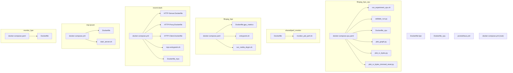
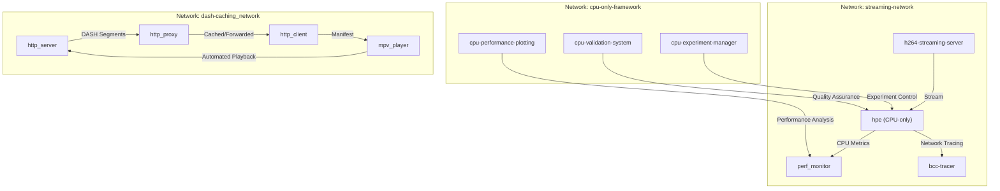
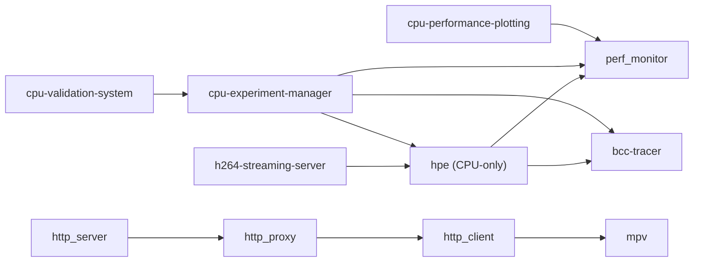

# Containerization and Docker Configuration

<cite>
**Referenced Files in This Document**
- [docker-compose.cpu.yaml](file://ffmpeg_hpe_cpu/docker-compose.cpu.yaml)
- [run_experiment_cpu.sh](file://ffmpeg_hpe_cpu/run_experiment_cpu.sh)
- [validate_run.py](file://ffmpeg_hpe_cpu/validate_run.py)
- [Dockerfile_cpu](file://Dockerfile_cpu)
- [plot_graph.py](file://ffmpeg_hpe_cpu/plot_graph.py)
- [plot_rx_bytes.py](file://ffmpeg_hpe_cpu/plot_rx_bytes.py)
- [plot_rx_bytes_trimmed_reset.py](file://ffmpeg_hpe_cpu/plot_rx_bytes_trimmed_reset.py)
- [Dockerfile](file://shared/perf_monitor/Dockerfile)
- [monitor_pid_perf.sh](file://shared/perf_monitor/monitor_pid_perf.sh)
- [docker-compose.yaml](file://ffmpeg_hpe/docker-compose.yaml)
- [Dockerfile.gpu_metrics](file://ffmpeg_hpe/Dockerfile.gpu_metrics)
- [entrypoint.sh](file://ffmpeg_hpe/entrypoint.sh)
- [run_nvidia_dcgm.sh](file://ffmpeg_hpe/run_nvidia_dcgm.sh)
- [docker-compose.yml](file://recent-dash/docker-compose.yml)
- [HTTP-Server.Dockerfile](file://recent-dash/HTTP-Server.Dockerfile)
- [HTTP-Proxy.Dockerfile](file://recent-dash/HTTP-Proxy.Dockerfile)
- [HTTP-Client.Dockerfile](file://recent-dash/HTTP-Client.Dockerfile)
- [entrypoint.sh](file://recent-dash/entrypoint.sh)
- [mpv-entrypoint.sh](file://recent-dash/mpv-entrypoint.sh)
- [Dockerfile_mpv](file://recent-dash/Dockerfile_mpv)
- [docker-compose.yml](file://rtsp-ipcam/docker-compose.yml)
- [Dockerfile](file://rtsp-ipcam/Dockerfile)
- [start_server.sh](file://rtsp-ipcam/start_server.sh)
- [Dockerfile](file://monitor_hpe/Dockerfile)
- [docker-compose.yaml](file://monitor_hpe/docker-compose.yaml)
- [Dockerfile.hpe](file://Dockerfile.hpe)
- [prometheus.yml](file://prometheus.yml)
- [docker-compose.yml](file://docker-compose.yml)
</cite>

## Update Summary
**Changes Made**
- Added comprehensive documentation for the new ffmpeg_hpe_cpu/ directory containing CPU-only Docker orchestration
- Updated Dockerfile references from Dockerfile.hpe to Dockerfile_cpu for CPU-only platform
- Documented the new CPU-only experiment platform with enhanced orchestration framework
- Added monitoring capabilities and validation tools specific to CPU-only deployments
- Updated container networking and service dependencies to support CPU-only architecture
- Enhanced performance monitoring with CPU-specific metrics collection

## Table of Contents
1. [Introduction](#introduction)
2. [Project Structure](#project-structure)
3. [Core Components](#core-components)
4. [Architecture Overview](#architecture-overview)
5. [Detailed Component Analysis](#detailed-component-analysis)
6. [Dependency Analysis](#dependency-analysis)
7. [Performance Considerations](#performance-considerations)
8. [Troubleshooting Guide](#troubleshooting-guide)
9. [Conclusion](#conclusion)
10. [Appendices](#appendices)

## Introduction
This document explains the containerization and Docker configuration used to orchestrate streaming, inference, and observability services. It covers:
- Docker Compose architecture for orchestrating multiple services including a streaming server, a Human Pose Estimation (HPE) application, performance monitor, and a BPF-based traffic tracer.
- Container networking, port mappings, and service dependencies.
- Dockerfile configuration for the HPE application, including base images, environment variables, and runtime dependencies.
- Entrypoint script functionality and container startup procedures.
- **NEW**: CPU-only Docker orchestration framework with ffmpeg_hpe_cpu/ directory for specialized CPU-based deployments.
- **NEW**: Enhanced Dockerfile_cpu configuration for CPU-only HPE containers with OpenVINO optimization.
- **NEW**: Comprehensive experiment validation system with automated quality assurance for CPU-only platforms.
- **NEW**: CPU-specific performance monitoring and plotting capabilities for resource analysis.
- Best practices for container resource allocation, GPU passthrough considerations, and production deployment considerations.
- Examples of scaling CPU-only services and managing container lifecycles.

## Project Structure
The repository organizes containerization artifacts primarily under:
- ffmpeg_hpe: streaming pipeline, GPU metrics, and BPF tracer services
- **NEW**: ffmpeg_hpe_cpu: CPU-only orchestration framework with specialized Docker configuration and monitoring
- **NEW**: Dockerfile_cpu: CPU-only Dockerfile replacing Dockerfile.hpe for CPU-based deployments
- **NEW**: shared/perf_monitor: Advanced performance monitoring with Docker API integration
- recent-dash: HTTP server, proxy, client, and mpv media player for DASH streaming experiments
- rtsp-ipcam: H.264 streaming server
- monitor_hpe: monitoring utilities and PID tracking
- Root-level Dockerfiles and compose files for top-level services

**Diagram sources**
- [docker-compose.cpu.yaml](file://ffmpeg_hpe_cpu/docker-compose.cpu.yaml)
- [run_experiment_cpu.sh](file://ffmpeg_hpe_cpu/run_experiment_cpu.sh)
- [validate_run.py](file://ffmpeg_hpe_cpu/validate_run.py)
- [Dockerfile_cpu](file://Dockerfile_cpu)
- [plot_graph.py](file://ffmpeg_hpe_cpu/plot_graph.py)
- [plot_rx_bytes.py](file://ffmpeg_hpe_cpu/plot_rx_bytes.py)
- [plot_rx_bytes_trimmed_reset.py](file://ffmpeg_hpe_cpu/plot_rx_bytes_trimmed_reset.py)
- [Dockerfile](file://shared/perf_monitor/Dockerfile)
- [monitor_pid_perf.sh](file://shared/perf_monitor/monitor_pid_perf.sh)
- [docker-compose.yaml](file://ffmpeg_hpe/docker-compose.yaml)
- [Dockerfile.gpu_metrics](file://ffmpeg_hpe/Dockerfile.gpu_metrics)
- [entrypoint.sh](file://ffmpeg_hpe/entrypoint.sh)
- [run_nvidia_dcgm.sh](file://ffmpeg_hpe/run_nvidia_dcgm.sh)
- [docker-compose.yml](file://recent-dash/docker-compose.yml)
- [HTTP-Server.Dockerfile](file://recent-dash/HTTP-Server.Dockerfile)
- [HTTP-Proxy.Dockerfile](file://recent-dash/HTTP-Proxy.Dockerfile)
- [HTTP-Client.Dockerfile](file://recent-dash/HTTP-Client.Dockerfile)
- [mpv-entrypoint.sh](file://recent-dash/mpv-entrypoint.sh)
- [Dockerfile_mpv](file://recent-dash/Dockerfile_mpv)
- [docker-compose.yml](file://rtsp-ipcam/docker-compose.yml)
- [Dockerfile](file://rtsp-ipcam/Dockerfile)
- [start_server.sh](file://rtsp-ipcam/start_server.sh)
- [Dockerfile](file://monitor_hpe/Dockerfile)
- [docker-compose.yaml](file://monitor_hpe/docker-compose.yaml)
- [Dockerfile.hpe](file://Dockerfile.hpe)

**Section sources**
- [docker-compose.cpu.yaml](file://ffmpeg_hpe_cpu/docker-compose.cpu.yaml)
- [docker-compose.yaml](file://ffmpeg_hpe/docker-compose.yaml)
- [docker-compose.yml](file://recent-dash/docker-compose.yml)
- [docker-compose.yml](file://rtsp-ipcam/docker-compose.yml)
- [docker-compose.yaml](file://monitor_hpe/docker-compose.yaml)

## Core Components
- H.264 streaming server: Provides an HTTP H.264 stream for downstream consumers.
- HPE application: Performs pose estimation on the stream; supports CPU-only mode with OpenVINO acceleration.
- Performance monitor: Monitors host-level processes and system resources using Docker API integration.
- BPF tracer: Captures and logs network traffic related to the HPE pipeline using BCC/BPF with advanced validation.
- **NEW**: CPU-only orchestration framework: Specialized experiment management with CPU-focused resource allocation and monitoring.
- **NEW**: Enhanced Dockerfile_cpu configuration: Optimized for CPU-only deployments with OpenVINO support and PyNvCodec fallback.
- **NEW**: Comprehensive experiment validation system: Automated quality assurance with CPU-specific performance metrics.
- **NEW**: CPU-specific plotting tools: Graph generation for CPU performance metrics and RX byte analysis.
- Key orchestration highlights:
  - Services share a dedicated bridge network for isolated communication.
  - Health checks ensure readiness before dependent services start.
  - Resource limits and reservations are configured for predictable CPU performance.
  - CPU-only mode eliminates GPU dependencies while maintaining inference capabilities.
  - **NEW**: Enhanced experiment orchestration with automated timing, diagnostics, and validation for CPU platforms.

**Section sources**
- [docker-compose.cpu.yaml](file://ffmpeg_hpe_cpu/docker-compose.cpu.yaml)
- [docker-compose.yaml](file://ffmpeg_hpe/docker-compose.yaml)
- [docker-compose.yml](file://rtsp-ipcam/docker-compose.yml)
- [docker-compose.yml](file://recent-dash/docker-compose.yml)
- [docker-compose.yaml](file://monitor_hpe/docker-compose.yaml)

## Architecture Overview
The orchestration centers on a shared network and a strict startup order:
- h264-streaming-server starts first and is probed for readiness.
- hpe depends on the streaming server being healthy and sets environment variables to consume the stream in CPU-only mode.
- perf_monitor and bcc-tracer operate independently but can observe the pipeline.
- **NEW**: CPU-only orchestration framework manages complete experiment lifecycle with validation.
- **NEW**: Advanced performance monitoring provides real-time container metrics via Docker API for CPU-focused deployments.

**Diagram sources**
- [docker-compose.cpu.yaml](file://ffmpeg_hpe_cpu/docker-compose.cpu.yaml)
- [docker-compose.yaml](file://ffmpeg_hpe/docker-compose.yaml)
- [docker-compose.yml](file://recent-dash/docker-compose.yml)

**Section sources**
- [docker-compose.cpu.yaml](file://ffmpeg_hpe_cpu/docker-compose.cpu.yaml)
- [docker-compose.yaml](file://ffmpeg_hpe/docker-compose.yaml)
- [docker-compose.yml](file://recent-dash/docker-compose.yml)

## Detailed Component Analysis

### CPU-Only Orchestration Framework (ffmpeg_hpe_cpu)
- **NEW**: Specialized CPU-only experiment management with automated lifecycle control.
- **NEW**: Enhanced timing and diagnostics collection for CPU performance analysis.
- **NEW**: Integrated validation system with automated quality checks and reporting.
- **NEW**: CPU-specific performance plotting tools for metrics visualization.
- **NEW**: Structured results organization with timestamped directories and comprehensive metadata.

Key features:
- Automated container startup and shutdown with precise timing measurements.
- Comprehensive diagnostics collection including container logs and system state.
- Integrated validation system with automated quality checks and reporting.
- CPU-specific performance metrics collection and analysis.
- Structured results organization with timestamped directories and comprehensive metadata.

**Section sources**
- [docker-compose.cpu.yaml](file://ffmpeg_hpe_cpu/docker-compose.cpu.yaml)
- [run_experiment_cpu.sh](file://ffmpeg_hpe_cpu/run_experiment_cpu.sh)
- [validate_run.py](file://ffmpeg_hpe_cpu/validate_run.py)

### H.264 Streaming Server
- Purpose: Serve an H.264 stream over HTTP for real-time consumption.
- Networking: Exposes a configurable port and mounts a video directory.
- Security: Non-root user, read-only root filesystem, and temporary filesystem for /tmp.
- Healthcheck: Validates HTTP endpoint availability.
- Resource limits: CPU/memory limits and reservations for controlled resource usage.

Operational notes:
- Port mapping is configurable via environment variables.
- Volume mounts enable flexible video source configuration.

**Section sources**
- [docker-compose.yml](file://rtsp-ipcam/docker-compose.yml)
- [Dockerfile](file://rtsp-ipcam/Dockerfile)
- [start_server.sh](file://rtsp-ipcam/start_server.sh)

### HPE Application (CPU-Only Mode)
- Purpose: Consume the H.264 stream and perform pose estimation with CPU-only mode and OpenVINO acceleration.
- CPU Optimization: Uses OpenVINO backends with configurable threading parameters.
- Environment Variables: Controls input stream URL, device selection (CPU), timeouts, and buffer sizes.
- Shared Memory: Configured for large model requirements.
- Startup Command: Executes the main application with method, input, CSV output, and measurement interval parameters.
- **NEW**: Dockerfile_cpu replaces Dockerfile.hpe for CPU-only deployments with PyNvCodec fallback.

Runtime configuration highlights:
- Device selection forced to CPU for this framework.
- OpenVINO optimization parameters (OV_MODE, OV_STREAMS, OV_THREADS) for CPU performance.
- FFMPEG timeouts are increased to accommodate long streams.
- Healthcheck monitors the main process.

**Section sources**
- [docker-compose.cpu.yaml](file://ffmpeg_hpe_cpu/docker-compose.cpu.yaml)
- [Dockerfile_cpu](file://Dockerfile_cpu)

### CPU-Only Dockerfile Configuration (Dockerfile_cpu)
- **NEW**: Ubuntu 22.04 base with comprehensive CPU optimization tools.
- **NEW**: PyTorch 2.4.1 with CUDA 12.1 development headers for compatibility.
- **NEW**: OpenVINO installation with CPU support for accelerated inference.
- **NEW**: PyNvCodec build skipped with graceful fallback to OpenCV for CPU-only operation.
- **NEW**: AlphaPose C/C++/Cython extensions built with nvcc availability for CPU compatibility.

Key features:
- CUDA development environment for extension compilation.
- OpenVINO with CPU acceleration support.
- PyNvCodec fallback handling for CPU-only deployments.
- Pre-downloaded model files for immediate inference capability.
- AlphaPose extension building with CPU-compatible paths.

**Section sources**
- [Dockerfile_cpu](file://Dockerfile_cpu)

### Enhanced Performance Monitor (CPU-Focused)
- **NEW**: Docker API-based performance monitoring with real-time metrics collection.
- **NEW**: Comprehensive CPU, memory, and PID tracking with Docker socket integration.
- **NEW**: Automatic container discovery and monitoring with configurable intervals.
- **NEW**: Structured CSV output with detailed performance metrics and container identification.
- **NEW**: CPU-specific plotting tools for performance analysis visualization.

Key features:
- Real-time Docker API integration for container metrics collection.
- Automatic target container discovery and monitoring.
- Comprehensive performance metrics including CPU percentage, memory usage, and active PIDs.
- Structured CSV output with timestamped entries and container metadata.
- Configurable monitoring intervals and output directories.
- **NEW**: Plotting capabilities for CPU performance metrics visualization.

**Section sources**
- [Dockerfile](file://shared/perf_monitor/Dockerfile)
- [monitor_pid_perf.sh](file://shared/perf_monitor/monitor_pid_perf.sh)

### CPU-Specific Performance Plotting Tools
- **NEW**: Comprehensive graph plotting for CPU performance metrics.
- **NEW**: RX byte analysis with trimming and reset capabilities for traffic visualization.
- **NEW**: Automated timestamp handling and unit detection for various CSV formats.
- **NEW**: Configurable output formats and styling for publication-ready plots.

Plotting capabilities:
- CPU usage over time with memory consumption overlay.
- RX byte traffic analysis with customizable trimming options.
- Timestamp normalization for consistent time series representation.
- Export to PNG format with appropriate sizing and styling.

**Section sources**
- [plot_graph.py](file://ffmpeg_hpe_cpu/plot_graph.py)
- [plot_rx_bytes.py](file://ffmpeg_hpe_cpu/plot_rx_bytes.py)
- [plot_rx_bytes_trimmed_reset.py](file://ffmpeg_hpe_cpu/plot_rx_bytes_trimmed_reset.py)

### Comprehensive Experiment Validation System (CPU-Only)
- **NEW**: Automated quality assurance with comprehensive data validation.
- **NEW**: Multi-level validation including exit codes, log parsing, and metric consistency.
- **NEW**: Detailed reporting with PASS/FAIL status and comprehensive metrics.
- **NEW**: CPU-specific validation criteria with performance and validation thresholds.

Validation levels:
- HPE container exit code validation (must be 0).
- Log parsing for processed frames and FFmpeg bytes read.
- JSON CSV validation for structural integrity and sequential frame numbering.
- TX CSV validation for payload byte consistency.
- Performance metrics validation with CPU and memory thresholds.
- **NEW**: CPU-only GPU metrics validation adapted for zero-GPU scenarios.

**Section sources**
- [validate_run.py](file://ffmpeg_hpe_cpu/validate_run.py)

### Recent-DASH Infrastructure (Alternative Orchestration)
- Purpose: Complete DASH streaming pipeline with HTTP server, proxy, client, and automated media playback.
- Services: http_server, http_proxy, http_client, mpv, perf_monitor, and a containerized BPF tracer.
- Networking: Dedicated bridge network with static IP assignments for predictable service discovery.
- **NEW**: Enhanced orchestration with automated DASH segment fetching and continuous playback capabilities.
- **NEW**: Environment variable-driven configuration for warmup delays, retry intervals, and playback timing.
- Entrypoints: Launch scripts manage process lifecycle and PID tracking.

**Section sources**
- [docker-compose.yml](file://recent-dash/docker-compose.yml)
- [HTTP-Server.Dockerfile](file://recent-dash/HTTP-Server.Dockerfile)
- [HTTP-Proxy.Dockerfile](file://recent-dash/HTTP-Proxy.Dockerfile)
- [HTTP-Client.Dockerfile](file://recent-dash/HTTP-Client.Dockerfile)
- [entrypoint.sh](file://recent-dash/entrypoint.sh)
- [mpv-entrypoint.sh](file://recent-dash/mpv-entrypoint.sh)
- [Dockerfile_mpv](file://recent-dash/Dockerfile_mpv)

### MPV Media Player Service (NEW)
- Purpose: Automated DASH streaming playback with continuous loop and intelligent error recovery.
- **NEW**: Built on Debian slim base with mpv and curl dependencies for reliable playback.
- **NEW**: Intelligent warmup mechanism that waits for DASH manifest availability before starting playback.
- **NEW**: Configurable retry delays, warmup periods, and start delays through environment variables.
- **NEW**: Continuous playback loop with automatic restart on failures and detailed logging.
- **NEW**: Minimal resource footprint with null video/audio outputs for headless operation.

Environment Variable Configuration:
- `DASH_PLAYER_URL`: URL of the DASH manifest (defaults to http://http_client/manifest.mpd)
- `DASH_PLAYER_WARMUP_SECONDS`: Warmup period before checking manifest availability (default: 30s)
- `DASH_PLAYER_RETRY_DELAY_SECONDS`: Delay between retry attempts (default: 1s)
- `DASH_PLAYER_START_DELAY_SECONDS`: Delay before starting mpv playback (default: 5s)

Operational Features:
- Manifest availability validation using curl with timeout constraints
- Infinite loop playback with automatic restart on process exit
- Comprehensive logging with last 40 lines captured on restart
- Null output devices for headless operation (no GUI required)
- DASH demuxer format specification for proper segment handling

**Section sources**
- [docker-compose.yml](file://recent-dash/docker-compose.yml)
- [mpv-entrypoint.sh](file://recent-dash/mpv-entrypoint.sh)
- [Dockerfile_mpv](file://recent-dash/Dockerfile_mpv)

### HTTP Server, Proxy, and Client Services (Enhanced)
- **HTTP Server**: Serves DASH video segments with configurable caching parameters and CDN-like behavior.
- **HTTP Proxy**: Implements caching logic with configurable algorithms and rate limiting parameters.
- **HTTP Client**: Acts as the DASH player frontend, exposing the manifest and handling proxy forwarding.
- **NEW**: Integrated volume mounting for segment management and automated asset provisioning.

Service Configuration Highlights:
- Multi-stage Docker builds for optimized image sizes
- Environment variable-driven configuration for all services
- Static IP assignments within the dedicated bridge network
- Resource limits and CPU/memory constraints for predictable performance
- Launch scripts handle domain resolution and service initialization

**Section sources**
- [HTTP-Server.Dockerfile](file://recent-dash/HTTP-Server.Dockerfile)
- [HTTP-Proxy.Dockerfile](file://recent-dash/HTTP-Proxy.Dockerfile)
- [HTTP-Client.Dockerfile](file://recent-dash/HTTP-Client.Dockerfile)
- [HTTP-Server.launch.sh](file://recent-dash/HTTP-Server.launch.sh)
- [HTTP-Proxy.launch.sh](file://recent-dash/HTTP-Proxy.launch.sh)
- [HTTP-Client.launch.sh](file://recent-dash/HTTP-Client.launch.sh)

## Dependency Analysis
Inter-service dependencies and startup order:
- hpe depends on h264-streaming-server being healthy.
- perf_monitor and bcc-tracer can start independently but benefit from the pipeline being active.
- **NEW**: CPU-only orchestration framework manages complete experiment lifecycle with validation.
- **NEW**: Performance monitor uses Docker API for real-time metrics collection.
- **NEW**: Validation system runs after experiment completion for quality assurance.
- **NEW**: CPU-specific plotting tools analyze performance metrics post-experiment.

**Diagram sources**
- [docker-compose.cpu.yaml](file://ffmpeg_hpe_cpu/docker-compose.cpu.yaml)
- [docker-compose.yaml](file://ffmpeg_hpe/docker-compose.yaml)
- [docker-compose.yml](file://recent-dash/docker-compose.yml)

**Section sources**
- [docker-compose.cpu.yaml](file://ffmpeg_hpe_cpu/docker-compose.cpu.yaml)
- [docker-compose.yaml](file://ffmpeg_hpe/docker-compose.yaml)
- [docker-compose.yml](file://recent-dash/docker-compose.yml)

## Performance Considerations
- Resource Allocation:
  - CPU and memory limits and reservations are defined per service to prevent noisy-neighbor effects.
  - HPE uses significant shared memory to support model inference.
  - **NEW**: CPU-only orchestration framework provides precise timing measurements for resource optimization.
  - **NEW**: Docker API-based performance monitoring offers real-time resource utilization insights for CPU platforms.
- **NEW**: CPU Optimization:
  - OpenVINO backends configured with optimal threading parameters (OV_MODE, OV_STREAMS, OV_THREADS).
  - CPU-specific environment variables (OMP_NUM_THREADS, MKL_NUM_THREADS, OPENBLAS_NUM_THREADS).
  - PyNvCodec fallback ensures compatibility without GPU dependencies.
- Observability:
  - Healthchecks provide early failure detection.
  - Performance monitoring offers deep insights into CPU utilization and bottlenecks.
  - **NEW**: Comprehensive validation system ensures data quality and experiment reliability.
  - **NEW**: CPU-specific plotting tools provide detailed performance analysis visualization.
- FFMPEG Tuning:
  - Increased timeouts reduce premature failures on long streams.
- Security Hardening:
  - Non-root users, read-only root filesystems, and temporary filesystems for /tmp improve isolation.
- **NEW**: Enhanced Experiment Management:
  - Structured results organization with timestamped directories.
  - Comprehensive diagnostics collection for troubleshooting.
  - Automated validation ensures experiment quality and reproducibility.
  - **NEW**: CPU-specific performance plotting for detailed resource analysis.

**Section sources**
- [docker-compose.cpu.yaml](file://ffmpeg_hpe_cpu/docker-compose.cpu.yaml)
- [docker-compose.yaml](file://ffmpeg_hpe/docker-compose.yaml)
- [docker-compose.yml](file://rtsp-ipcam/docker-compose.yml)
- [docker-compose.yaml](file://monitor_hpe/docker-compose.yaml)
- [docker-compose.yml](file://recent-dash/docker-compose.yml)

## Troubleshooting Guide
Common issues and remedies:
- HPE fails to start or exits quickly:
  - Verify the streaming server is healthy and reachable.
  - Confirm environment variables for input URL and device selection are correct.
  - **NEW**: Check CPU-only mode compatibility and OpenVINO backend configuration.
- **NEW**: CPU-only deployment issues:
  - Verify Dockerfile_cpu was built successfully with CPU optimization.
  - Check OpenVINO installation and threading parameters.
  - Review CPU-specific environment variables (OV_MODE, OV_STREAMS, OV_THREADS).
- **NEW**: Performance monitor Docker API errors:
  - Ensure Docker socket is properly mounted (/var/run/docker.sock).
  - Verify target container name matches the monitored container.
  - Check Docker API accessibility and permissions.
- **NEW**: Validation system failures:
  - Review validation report for specific check failures and metrics.
  - Verify required files exist in results directory (JSON, TX, perf).
  - Check threshold values and adjust validation criteria if needed.
- **NEW**: CPU-specific plotting issues:
  - Verify matplotlib and pandas installations in plotting containers.
  - Check CSV file formats and column headers for proper analysis.
  - Review timestamp formats and unit detection for accurate plotting.
- Port conflicts or accessibility:
  - Review port mappings and ensure host ports are free.
  - Validate firewall and network policies in the environment.
  - **NEW**: Check that the mpv service port is not conflicting with other services.

**Section sources**
- [docker-compose.cpu.yaml](file://ffmpeg_hpe_cpu/docker-compose.cpu.yaml)
- [run_experiment_cpu.sh](file://ffmpeg_hpe_cpu/run_experiment_cpu.sh)
- [validate_run.py](file://ffmpeg_hpe_cpu/validate_run.py)
- [docker-compose.yaml](file://ffmpeg_hpe/docker-compose.yaml)
- [run_nvidia_dcgm.sh](file://ffmpeg_hpe/run_nvidia_dcgm.sh)
- [docker-compose.yml](file://rtsp-ipcam/docker-compose.yml)
- [mpv-entrypoint.sh](file://recent-dash/mpv-entrypoint.sh)
- [docker-compose.yml](file://recent-dash/docker-compose.yml)

## Conclusion
The containerization setup provides a robust, observable, and scalable pipeline for streaming, inference, and monitoring. By leveraging Docker Compose, CPU-only optimization, and BPF-based tracing, teams can reproduce and operate the HPE experiment consistently across environments. **The addition of the enhanced ffmpeg_hpe_cpu framework introduces comprehensive CPU-only orchestration, specialized Docker configuration, advanced performance monitoring, and automated validation capabilities, providing a complete solution for CPU-focused scientific experimentation and quality assurance.** The CPU-only orchestration framework, combined with the comprehensive validation system and plotting tools, ensures reliable, reproducible, and high-quality experimental results for streaming and inference research on CPU-only platforms.

## Appendices

### Enhanced Dockerfile Configuration for ffmpeg_hpe_cpu
**NEW**: Comprehensive CPU-only orchestration framework with specialized Docker configuration.

#### CPU-Only Docker Compose Configuration
- Multi-service orchestration with precise resource allocation and dependency management.
- CPU-only HPE service with configurable device selection and OpenVINO optimization.
- Advanced BPF tracer with automatic port detection and traffic validation.
- Enhanced performance monitoring with Docker API integration.
- Structured results organization with timestamped directories and comprehensive metadata.

#### CPU-Only Dockerfile Features
- **NEW**: PyTorch 2.4.1 with CUDA 12.1 development headers for compatibility.
- **NEW**: OpenVINO installation with CPU support for accelerated inference.
- **NEW**: PyNvCodec build skipped with graceful fallback to OpenCV for CPU-only operation.
- **NEW**: AlphaPose C/C++/Cython extensions built with nvcc availability for CPU compatibility.

#### Performance Plotting Tools
- **NEW**: Comprehensive graph plotting for CPU performance metrics.
- **NEW**: RX byte analysis with trimming and reset capabilities for traffic visualization.
- **NEW**: Automated timestamp handling and unit detection for various CSV formats.
- **NEW**: Configurable output formats and styling for publication-ready plots.

**Section sources**
- [docker-compose.cpu.yaml](file://ffmpeg_hpe_cpu/docker-compose.cpu.yaml)
- [Dockerfile_cpu](file://Dockerfile_cpu)
- [plot_graph.py](file://ffmpeg_hpe_cpu/plot_graph.py)
- [plot_rx_bytes.py](file://ffmpeg_hpe_cpu/plot_rx_bytes.py)
- [plot_rx_bytes_trimmed_reset.py](file://ffmpeg_hpe_cpu/plot_rx_bytes_trimmed_reset.py)

### Enhanced Dockerfile Configuration for Recent-DASH Services
**NEW**: Multi-stage Docker builds for optimized image sizes and reduced attack surface.

#### HTTP Server Dockerfile
- Multi-stage build: Downloads and prepares DASH assets in first stage, copies only necessary files to final image.
- Asset preparation: Automatically clones the recent-dash-proposed-caching repository and extracts video segments.
- Launch script integration: Copies and configures the HTTP-Server.launch.sh script for service startup.
- Environment variables: Configurable service parameters including caching behavior and public folder locations.

#### HTTP Proxy Dockerfile  
- Multi-stage build: Separates asset preparation from runtime execution for security and optimization.
- Cache implementation: Integrates the proxy server with configurable caching algorithms and rate limiting.
- Parameter flexibility: Extensive environment variable support for tuning proxy behavior.
- Launch script automation: Handles domain resolution and parameter processing for reliable startup.

#### HTTP Client Dockerfile
- Multi-stage build: Optimizes for minimal runtime footprint while maintaining functionality.
- Manifest serving: Exposes DASH manifest files while routing segment requests through the proxy.
- Volume mounting: Supports external segment management through bind mounts.
- Launch script orchestration: Manages proxy domain resolution and service initialization.

#### MPV Dockerfile
- **NEW**: Lightweight Debian slim base with minimal dependencies (curl, mpv, ca-certificates).
- **NEW**: Dedicated entrypoint script for intelligent playback management.
- **NEW**: No complex build steps - pure runtime container focused on media playback.

**Section sources**
- [HTTP-Server.Dockerfile](file://recent-dash/HTTP-Server.Dockerfile)
- [HTTP-Proxy.Dockerfile](file://recent-dash/HTTP-Proxy.Dockerfile)
- [HTTP-Client.Dockerfile](file://recent-dash/HTTP-Client.Dockerfile)
- [Dockerfile_mpv](file://recent-dash/Dockerfile_mpv)

### Enhanced Experiment Management and Validation (CPU-Only)
**NEW**: Comprehensive experiment orchestration with automated quality assurance for CPU-only platforms.

#### CPU-Only Experiment Script Features
- **NEW**: Automated container lifecycle management with precise timing measurements.
- **NEW**: Comprehensive diagnostics collection including container logs and system state.
- **NEW**: Structured results organization with timestamped directories and metadata.
- **NEW**: Integrated validation system with automated quality checks and reporting.
- **NEW**: CPU-specific performance plotting tools for detailed analysis.

#### CPU-Only Validation System Capabilities
- **NEW**: Multi-level validation including exit codes, log parsing, and metric consistency.
- **NEW**: Detailed reporting with PASS/FAIL status and comprehensive metrics.
- **NEW**: Configurable thresholds for performance and validation criteria.
- **NEW**: Automated quality assurance for scientific experimentation on CPU platforms.

**Section sources**
- [run_experiment_cpu.sh](file://ffmpeg_hpe_cpu/run_experiment_cpu.sh)
- [validate_run.py](file://ffmpeg_hpe_cpu/validate_run.py)

### Container Networking and Port Mappings
- Bridge network: All services join a shared network for internal communication.
- **NEW**: Dedicated dash-caching network with static IP assignments for predictable service discovery.
- **NEW**: CPU-only framework uses service-level networking for precise dependency management.
- Ports:
  - Streaming server exposes a configurable port mapped to the host.
  - **NEW**: HTTP services use internal port 80 with configurable host port mapping.
  - **NEW**: mpv service runs without external port exposure (headless operation).
  - **NEW**: BPF tracer operates on host network with privileged access for traffic monitoring.
- DNS: Search domain configured for service discovery.
- **NEW**: Network isolation: CPU-only framework maintains service separation while enabling necessary communication.

**Section sources**
- [docker-compose.cpu.yaml](file://ffmpeg_hpe_cpu/docker-compose.cpu.yaml)
- [docker-compose.yaml](file://ffmpeg_hpe/docker-compose.yaml)
- [docker-compose.yml](file://rtsp-ipcam/docker-compose.yml)
- [docker-compose.yml](file://recent-dash/docker-compose.yml)

### Enhanced Entrypoint Script Functionality
- **NEW**: CPU-only orchestration framework with automated experiment management.
- **NEW**: Advanced timing and diagnostics collection for CPU performance analysis.
- **NEW**: Integrated validation system with automated quality assurance.
- **NEW**: CPU-specific environment variable configuration for OpenVINO optimization.
- **NEW**: Argument forwarding: Executes the provided command or defaults to the main application.
- **NEW**: Graceful shutdown: Terminates background processes on SIGTERM.
- **NEW**: mpv entrypoint script provides intelligent warmup, retry, and logging capabilities for DASH playback.

**Section sources**
- [entrypoint.sh](file://ffmpeg_hpe/entrypoint.sh)
- [mpv-entrypoint.sh](file://recent-dash/mpv-entrypoint.sh)
- [run_experiment_cpu.sh](file://ffmpeg_hpe_cpu/run_experiment_cpu.sh)

### Enhanced Scaling and Lifecycle Management
- **NEW**: CPU-only orchestration framework supports independent scaling of experiment components.
- **NEW**: Automated experiment lifecycle with precise timing and validation.
- **NEW**: Comprehensive diagnostics collection for troubleshooting and optimization.
- Scaling:
  - Duplicate the HPE service with different device assignments or separate instances for multiple inputs.
  - Scale the streaming server if bandwidth becomes a bottleneck.
  - **NEW**: Scale recent-dash services independently based on experiment requirements.
  - **NEW**: CPU-only framework supports parallel experiment execution with isolated results.
- Lifecycle:
  - Use restart policies to maintain service uptime.
  - Healthchecks ensure automatic restarts on failure.
  - Graceful shutdown via signals allows cleanup of background processes.
  - **NEW**: CPU-only framework uses "unless-stopped" policy for continuous playback during experiments.
  - **NEW**: Automated validation ensures experiment quality before cleanup.
  - **NEW**: Docker API monitoring provides real-time container metrics for dynamic scaling decisions.

**Section sources**
- [docker-compose.cpu.yaml](file://ffmpeg_hpe_cpu/docker-compose.cpu.yaml)
- [docker-compose.yaml](file://ffmpeg_hpe/docker-compose.yaml)
- [docker-compose.yml](file://rtsp-ipcam/docker-compose.yml)
- [docker-compose.yml](file://recent-dash/docker-compose.yml)

### Prometheus and Grafana Integration
- Prometheus configuration file is included at the repository root for scraping metrics.
- Grafana dashboards can be configured to visualize GPU and system metrics collected by the pipeline.
- **NEW**: Enhanced framework includes Docker API metrics for comprehensive container monitoring.
- **NEW**: Recent-dash services include Coroot monitoring labels for enhanced observability.
- **NEW**: CPU-only framework supports Prometheus scraping for CPU performance metrics.

**Section sources**
- [prometheus.yml](file://prometheus.yml)
- [docker-compose.yml](file://docker-compose.yml)
- [docker-compose.yml](file://recent-dash/docker-compose.yml)

### Enhanced Environment Variable Configuration Reference (NEW)
**NEW**: Comprehensive environment variable configuration for CPU-only orchestration framework and recent-dash services.

#### CPU-Only Framework Variables
- `VIDEO_FILE`: Path to video file for streaming (loaded from .env.cpu if not set)
- `STREAMER_CPUS`, `STREAMER_RESERVATION_CPUS`: CPU allocation for streaming server
- `HPE_CPUS`: CPU allocation for HPE container
- `OV_MODE`: OpenVINO optimization mode (latency, throughput, or count)
- `OV_STREAMS`: Number of OpenVINO streams for parallel processing
- `OV_THREADS`: Number of threads for OpenVINO inference
- `OMP_NUM_THREADS`, `MKL_NUM_THREADS`, `OPENBLAS_NUM_THREADS`: CPU threading parameters

#### Service-Level Variables
- `DASH_SERVER_IP`: Static IP assignment for http_server (default: 172.28.0.2)
- `DASH_PROXY_IP`: Static IP assignment for http_proxy (default: 172.28.0.3)  
- `DASH_CLIENT_IP`: Static IP assignment for http_client (default: 172.28.0.4)
- `DASH_SUBNET`: Network subnet configuration (default: 172.28.0.0/24)
- `HTTP_SERVER_CPU_LIMIT`, `HTTP_SERVER_MEMORY_LIMIT`: Resource limits for http_server
- `HTTP_PROXY_CPU_LIMIT`, `HTTP_PROXY_MEMORY_LIMIT`: Resource limits for http_proxy
- `HTTP_CLIENT_CPU_LIMIT`, `HTTP_CLIENT_MEMORY_LIMIT`: Resource limits for http_client
- `MPV_CPU_LIMIT`, `MPV_MEMORY_LIMIT`: Resource limits for mpv service

#### MPV Player Variables
- `DASH_PLAYER_URL`: DASH manifest URL (default: http://http_client/manifest.mpd)
- `DASH_PLAYER_WARMUP_SECONDS`: Warmup delay before manifest check (default: 30)
- `DASH_PLAYER_RETRY_DELAY_SECONDS`: Retry interval for manifest availability (default: 1)
- `DASH_PLAYER_START_DELAY_SECONDS`: Delay before starting mpv playback (default: 5)

#### Proxy Configuration Variables
- `SERVICE_ADDITIONAL_PARAMETERS`: Proxy algorithm and rate limiting parameters
- `HTTP_SERVER_DOMAIN`, `HTTP_SERVER_PORT`: Upstream server configuration
- `HTTP_PROXY_DOMAIN`, `HTTP_PROXY_PORT`: Downstream proxy configuration

#### Validation System Variables
- `RX_TOLERANCE_PERCENT`: Allowed BCC RX vs FFmpeg bytes-read delta (default: 2.0%)
- `MIN_AVG_CPU_PERCENT`: Minimum plausible average HPE container CPU percent (default: 1.0%)
- `MIN_MEMORY_MB`: Minimum plausible HPE container memory working set (default: 50.0MB)

**Section sources**
- [docker-compose.cpu.yaml](file://ffmpeg_hpe_cpu/docker-compose.cpu.yaml)
- [docker-compose.yaml](file://ffmpeg_hpe/docker-compose.yaml)
- [docker-compose.yml](file://recent-dash/docker-compose.yml)
- [mpv-entrypoint.sh](file://recent-dash/mpv-entrypoint.sh)
- [validate_run.py](file://ffmpeg_hpe_cpu/validate_run.py)
- [HTTP-Proxy.Dockerfile](file://recent-dash/HTTP-Proxy.Dockerfile)