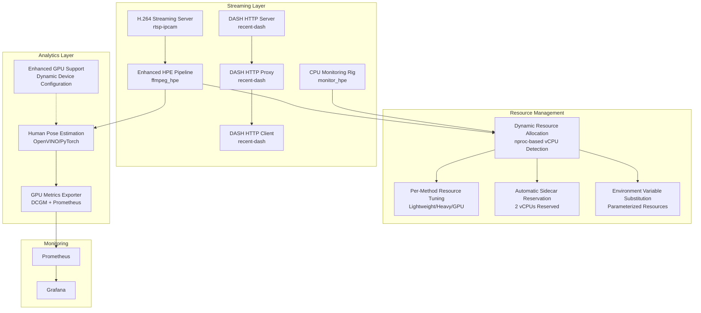
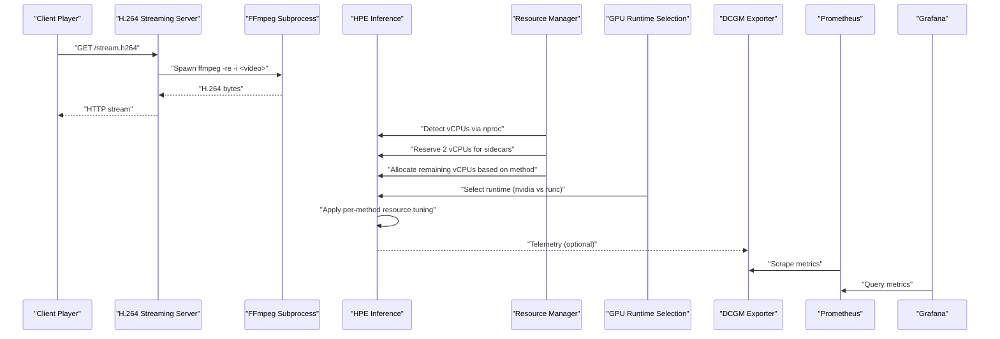
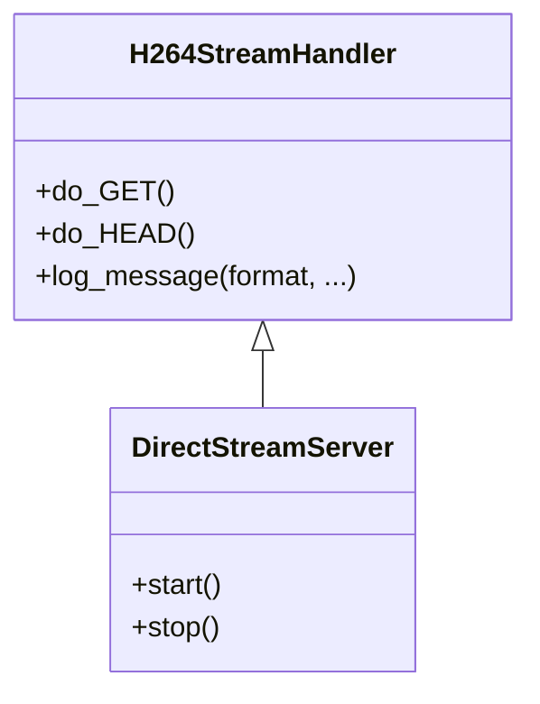
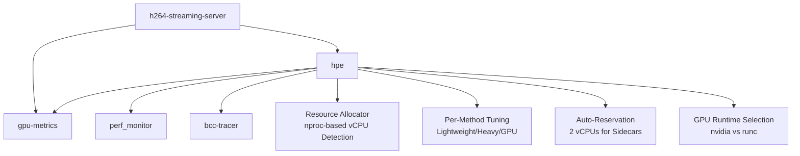
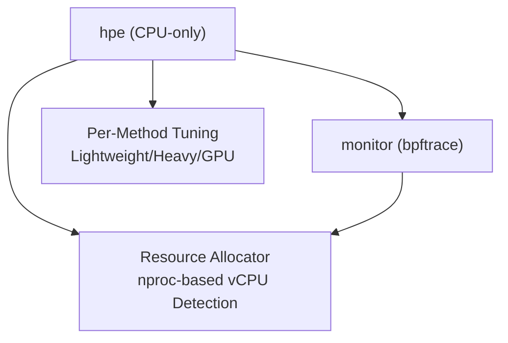
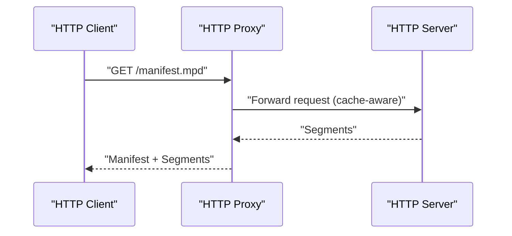
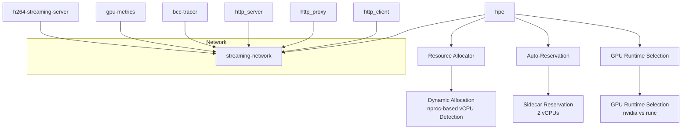

# Deployment Infrastructure

<cite>
**Referenced Files in This Document**
- [rtsp-ipcam/docker-compose.yml](file://rtsp-ipcam/docker-compose.yml)
- [rtsp-ipcam/Dockerfile](file://rtsp-ipcam/Dockerfile)
- [rtsp-ipcam/direct_stream_server.py](file://rtsp-ipcam/direct_stream_server.py)
- [rtsp-ipcam/start_server.sh](file://rtsp-ipcam/start_server.sh)
- [ffmpeg_hpe/docker-compose.yaml](file://ffmpeg_hpe/docker-compose.yaml)
- [ffmpeg_hpe/Dockerfile.gpu_metrics](file://ffmpeg_hpe/Dockerfile.gpu_metrics)
- [ffmpeg_hpe/run_experiment.sh](file://ffmpeg_hpe/run_experiment.sh)
- [ffmpeg_hpe/DYNAMIC_RESOURCE_ALLOCATION.md](file://ffmpeg_hpe/DYNAMIC_RESOURCE_ALLOCATION.md)
- [recent-dash/docker-compose.yml](file://recent-dash/docker-compose.yml)
- [recent-dash/HTTP-Server.Dockerfile](file://recent-dash/HTTP-Server.Dockerfile)
- [recent-dash/HTTP-Client.Dockerfile](file://recent-dash/HTTP-Client.Dockerfile)
- [recent-dash/HTTP-Proxy.Dockerfile](file://recent-dash/HTTP-Proxy.Dockerfile)
- [recent-dash/HTTP-Server.launch.sh](file://recent-dash/HTTP-Server.launch.sh)
- [recent-dash/HTTP-Proxy.launch.sh](file://recent-dash/HTTP-Proxy.launch.sh)
- [docker-compose.yml](file://docker-compose.yml)
- [prometheus.yml](file://prometheus.yml)
- [monitor_hpe/docker-compose.yaml](file://monitor_hpe/docker-compose.yaml)
- [monitor_hpe/run_experiment.sh](file://monitor_hpe/run_experiment.sh)
- [monitor_hpe/AUTO_SCALING_IMPLEMENTATION_SUMMARY.md](file://monitor_hpe/AUTO_SCALING_IMPLEMENTATION_SUMMARY.md)
- [monitor_hpe/RESOURCE_ALLOCATION.md](file://monitor_hpe/RESOURCE_ALLOCATION.md)
- [monitor_hpe/USAGE.md](file://monitor_hpe/USAGE.md)
- [monitor_hpe/SCALING_GUIDE.md](file://monitor_hpe/SCALING_GUIDE.md)
- [DYNAMIC_RESOURCE_ALLOCATION_SUMMARY.md](file://DYNAMIC_RESOURCE_ALLOCATION_SUMMARY.md)
</cite>

## Update Summary
**Changes Made**
- Added comprehensive dynamic resource allocation system with nproc-based vCPU detection
- Implemented automatic sidecar reservation (2 vCPUs reserved for monitoring services)
- Enhanced per-method resource tuning for different HPE algorithms (lightweight, heavy, GPU-bound)
- Updated docker-compose.yaml files with parameterized resource limits and environment variable substitution
- Added automated GPU runtime selection based on HPE method type
- Enhanced monitoring stack with automatic resource adaptation

## Table of Contents
1. [Introduction](#introduction)
2. [Project Structure](#project-structure)
3. [Core Components](#core-components)
4. [Architecture Overview](#architecture-overview)
5. [Detailed Component Analysis](#detailed-component-analysis)
6. [Dynamic Resource Allocation System](#dynamic-resource-allocation-system)
7. [Dependency Analysis](#dependency-analysis)
8. [Performance Considerations](#performance-considerations)
9. [Troubleshooting Guide](#troubleshooting-guide)
10. [Conclusion](#conclusion)
11. [Appendices](#appendices)

## Introduction
This document explains the deployment infrastructure and containerization strategies for real-time video streaming and analytics with intelligent resource management. It covers:
- Docker Compose configurations for orchestrating multiple services with dynamic resource allocation
- HTTP streaming server setup for H.264 delivery with enhanced debugging capabilities
- Container deployment patterns, networking, and volume mounting with automatic resource adaptation
- RTSP/IP camera emulation via HTTP streaming with intelligent GPU runtime selection
- Real-time video feed management and client connectivity with per-method optimization
- Production deployment considerations, scaling strategies, and infrastructure requirements
- Monitoring stack integration for GPU and system metrics with automatic resource allocation
- **New**: Dynamic resource allocation system with nproc-based vCPU detection and per-method tuning

## Project Structure
The repository organizes deployment artifacts by functional area with intelligent resource management:
- rtsp-ipcam: An HTTP-based H.264 streaming server with Docker and Docker Compose
- ffmpeg_hpe: Enhanced streaming server with dynamic resource allocation and per-method tuning
- monitor_hpe: CPU-only monitoring rig with automatic resource scaling and method-aware allocation
- recent-dash: DASH caching pipeline with HTTP server, proxy, and client containers
- Monitoring stack: Prometheus and Grafana with DCGM exporter for GPU telemetry



**Diagram sources**
- [rtsp-ipcam/docker-compose.yml:1-64](file://rtsp-ipcam/docker-compose.yml#L1-L64)
- [ffmpeg_hpe/docker-compose.yaml:1-239](file://ffmpeg_hpe/docker-compose.yaml#L1-L239)
- [monitor_hpe/docker-compose.yaml:1-60](file://monitor_hpe/docker-compose.yaml#L1-L60)
- [recent-dash/docker-compose.yml:1-103](file://recent-dash/docker-compose.yml#L1-L103)
- [docker-compose.yml:1-30](file://docker-compose.yml#L1-L30)

**Section sources**
- [rtsp-ipcam/docker-compose.yml:1-64](file://rtsp-ipcam/docker-compose.yml#L1-L64)
- [ffmpeg_hpe/docker-compose.yaml:1-239](file://ffmpeg_hpe/docker-compose.yaml#L1-L239)
- [monitor_hpe/docker-compose.yaml:1-60](file://monitor_hpe/docker-compose.yaml#L1-L60)
- [recent-dash/docker-compose.yml:1-103](file://recent-dash/docker-compose.yml#L1-L103)
- [docker-compose.yml:1-30](file://docker-compose.yml#L1-L30)

## Core Components
- H.264 Streaming Server (rtsp-ipcam): A Python HTTP server that uses FFmpeg to stream H.264 video over HTTP. It supports configurable port and video file path, with health checks and resource limits.
- Enhanced Human Pose Estimation Pipeline (ffmpeg_hpe): Composes the streaming server, HPE inference container with dynamic resource allocation, GPU metrics exporter, and optional BPF tracing with automatic GPU runtime selection.
- CPU Monitoring Rig (monitor_hpe): Standalone monitoring system with automatic resource scaling based on vCPU count and method type.
- DASH Caching Stack (recent-dash): Provides HTTP server, proxy, and client containers for DASH segment delivery and caching.
- Monitoring Stack: Prometheus scraping DCGM exporter, with Grafana for visualization.

Key deployment artifacts:
- Docker Compose files define services, networks, volumes, environment variables, and health checks with parameterized resource limits
- Dockerfiles build minimal images with non-root users, read-only filesystems, and tmpfs for temporary data
- Launch scripts configure service parameters and start binaries with automatic resource detection
- **Enhanced**: Dynamic resource allocation system with nproc-based vCPU detection and per-method tuning
- **Enhanced**: Automatic GPU runtime selection based on HPE method type (CPU-only vs GPU-bound)
- **Enhanced**: Parameterized resource limits with environment variable substitution for flexible deployment

**Section sources**
- [rtsp-ipcam/Dockerfile:1-40](file://rtsp-ipcam/Dockerfile#L1-L40)
- [rtsp-ipcam/direct_stream_server.py:1-200](file://rtsp-ipcam/direct_stream_server.py#L1-L200)
- [rtsp-ipcam/start_server.sh:1-32](file://rtsp-ipcam/start_server.sh#L1-L32)
- [ffmpeg_hpe/docker-compose.yaml:69-133](file://ffmpeg_hpe/docker-compose.yaml#L69-L133)
- [ffmpeg_hpe/Dockerfile.gpu_metrics:1-20](file://ffmpeg_hpe/Dockerfile.gpu_metrics#L1-L20)
- [ffmpeg_hpe/run_experiment.sh:63-126](file://ffmpeg_hpe/run_experiment.sh#L63-L126)
- [monitor_hpe/docker-compose.yaml:1-60](file://monitor_hpe/docker-compose.yaml#L1-L60)
- [monitor_hpe/run_experiment.sh:12-80](file://monitor_hpe/run_experiment.sh#L12-L80)
- [recent-dash/HTTP-Server.Dockerfile:1-59](file://recent-dash/HTTP-Server.Dockerfile#L1-L59)
- [recent-dash/HTTP-Client.Dockerfile:1-55](file://recent-dash/HTTP-Client.Dockerfile#L1-L55)
- [recent-dash/HTTP-Proxy.Dockerfile:1-49](file://recent-dash/HTTP-Proxy.Dockerfile#L1-L49)
- [docker-compose.yml:1-30](file://docker-compose.yml#L1-L30)

## Architecture Overview
The system integrates streaming, analytics, and observability with intelligent resource management:
- Streaming: A lightweight HTTP server emits H.264 via FFmpeg to clients (e.g., VLC, FFplay)
- Analytics: An HPE container with dynamic resource allocation consumes the stream, performs inference, and writes measurements with method-specific optimization
- Resource Management: Automatic vCPU detection reserves 2 vCPUs for sidecars and allocates the remainder to HPE based on method type
- Observability: Prometheus scrapes GPU metrics exported by DCGM exporter; Grafana visualizes dashboards
- Optional DASH caching: HTTP server, proxy, and client form a caching pipeline for segmented content
- **Enhanced**: Dynamic resource allocation with per-method tuning for optimal performance



**Diagram sources**
- [rtsp-ipcam/direct_stream_server.py:52-138](file://rtsp-ipcam/direct_stream_server.py#L52-L138)
- [ffmpeg_hpe/docker-compose.yaml:39-92](file://ffmpeg_hpe/docker-compose.yaml#L39-L92)
- [ffmpeg_hpe/docker-compose.yaml:69-133](file://ffmpeg_hpe/docker-compose.yaml#L69-L133)
- [ffmpeg_hpe/run_experiment.sh:63-126](file://ffmpeg_hpe/run_experiment.sh#L63-L126)
- [monitor_hpe/run_experiment.sh:12-80](file://monitor_hpe/run_experiment.sh#L12-L80)
- [docker-compose.yml:4-12](file://docker-compose.yml#L4-L12)
- [prometheus.yml:1-8](file://prometheus.yml#L1-L8)

**Section sources**
- [rtsp-ipcam/direct_stream_server.py:52-138](file://rtsp-ipcam/direct_stream_server.py#L52-L138)
- [ffmpeg_hpe/docker-compose.yaml:39-92](file://ffmpeg_hpe/docker-compose.yaml#L39-L92)
- [ffmpeg_hpe/docker-compose.yaml:69-133](file://ffmpeg_hpe/docker-compose.yaml#L69-L133)
- [ffmpeg_hpe/run_experiment.sh:63-126](file://ffmpeg_hpe/run_experiment.sh#L63-L126)
- [monitor_hpe/run_experiment.sh:12-80](file://monitor_hpe/run_experiment.sh#L12-L80)
- [docker-compose.yml:1-30](file://docker-compose.yml#L1-L30)
- [prometheus.yml:1-8](file://prometheus.yml#L1-L8)

## Detailed Component Analysis

### H.264 Streaming Server
- Purpose: Serve H.264 video over HTTP for playback in players like VLC and FFplay
- Implementation: Python HTTP server spawns FFmpeg to transcode and stream
- Configuration: Port, video file path, and environment variables; health checks via curl or TCP probe
- Security and isolation: Non-root user, read-only rootfs, tmpfs, and resource limits



**Diagram sources**
- [rtsp-ipcam/direct_stream_server.py:45-151](file://rtsp-ipcam/direct_stream_server.py#L45-L151)
- [rtsp-ipcam/direct_stream_server.py:156-200](file://rtsp-ipcam/direct_stream_server.py#L156-L200)

**Section sources**
- [rtsp-ipcam/direct_stream_server.py:1-200](file://rtsp-ipcam/direct_stream_server.py#L1-L200)
- [rtsp-ipcam/Dockerfile:1-40](file://rtsp-ipcam/Dockerfile#L1-L40)
- [rtsp-ipcam/start_server.sh:1-32](file://rtsp-ipcam/start_server.sh#L1-L32)
- [rtsp-ipcam/docker-compose.yml:1-64](file://rtsp-ipcam/docker-compose.yml#L1-L64)

### Enhanced Human Pose Estimation Pipeline
- Services:
  - h264-streaming-server: Streams H.264 to clients
  - hpe: Performs inference on the stream with dynamic resource allocation; GPU-enabled with automatic runtime selection and method-specific tuning
  - gpu-metrics: Scrapes GPU metrics with NVIDIA runtime support
  - perf_monitor: Host PID-based monitoring with elevated privileges
  - bcc-tracer: Optional kernel tracing for network traffic around the streamer
- Orchestration: Depends on streaming server health; uses a shared bridge network
- **Enhanced**: Dynamic resource allocation with nproc-based vCPU detection and automatic sidecar reservation
- **Enhanced**: Per-method resource tuning (lightweight OpenVINO: 1GB/vCPU, heavy: 1.5GB/vCPU, GPU: 8GB fixed)
- **Enhanced**: Automatic GPU runtime selection based on method type (CPU-only vs GPU-bound)



**Diagram sources**
- [ffmpeg_hpe/docker-compose.yaml:1-239](file://ffmpeg_hpe/docker-compose.yaml#L1-L239)
- [ffmpeg_hpe/run_experiment.sh:63-126](file://ffmpeg_hpe/run_experiment.sh#L63-L126)

**Section sources**
- [ffmpeg_hpe/docker-compose.yaml:1-239](file://ffmpeg_hpe/docker-compose.yaml#L1-L239)
- [ffmpeg_hpe/run_experiment.sh:63-126](file://ffmpeg_hpe/run_experiment.sh#L63-L126)

### CPU Monitoring Rig
- Services:
  - hpe: CPU-only HPE inference with automatic resource scaling
  - monitor: bpftrace-based monitoring with CPU/memory tracking
- Orchestration: Independent monitoring without external dependencies
- **Enhanced**: Automatic resource allocation with 2 vCPUs reserved for monitoring, remaining allocated to HPE
- **Enhanced**: Method-aware resource tuning with per-VM scaling



**Diagram sources**
- [monitor_hpe/docker-compose.yaml:1-60](file://monitor_hpe/docker-compose.yaml#L1-L60)
- [monitor_hpe/run_experiment.sh:12-80](file://monitor_hpe/run_experiment.sh#L12-L80)

**Section sources**
- [monitor_hpe/docker-compose.yaml:1-60](file://monitor_hpe/docker-compose.yaml#L1-L60)
- [monitor_hpe/run_experiment.sh:12-80](file://monitor_hpe/run_experiment.sh#L12-L80)

### DASH Caching Stack
- Services:
  - http_server: Serves pre-transcoded segments
  - http_proxy: Acts as a caching proxy between server and client
  - http_client: Delivers the manifest to clients
  - perf_monitor and bpftrace tracer: Optional performance and network tracing
- Networking: Uses Compose labels for monitoring integration



**Diagram sources**
- [recent-dash/docker-compose.yml:1-103](file://recent-dash/docker-compose.yml#L1-L103)
- [recent-dash/HTTP-Server.launch.sh:1-15](file://recent-dash/HTTP-Server.launch.sh#L1-L15)
- [recent-dash/HTTP-Proxy.launch.sh:1-20](file://recent-dash/HTTP-Proxy.launch.sh#L1-L20)

**Section sources**
- [recent-dash/docker-compose.yml:1-103](file://recent-dash/docker-compose.yml#L1-L103)
- [recent-dash/HTTP-Server.Dockerfile:1-59](file://recent-dash/HTTP-Server.Dockerfile#L1-L59)
- [recent-dash/HTTP-Client.Dockerfile:1-55](file://recent-dash/HTTP-Client.Dockerfile#L1-L55)
- [recent-dash/HTTP-Proxy.Dockerfile:1-49](file://recent-dash/HTTP-Proxy.Dockerfile#L1-L49)
- [recent-dash/HTTP-Server.launch.sh:1-15](file://recent-dash/HTTP-Server.launch.sh#L1-L15)
- [recent-dash/HTTP-Proxy.launch.sh:1-20](file://recent-dash/HTTP-Proxy.launch.sh#L1-L20)

### Monitoring Stack
- Prometheus scrapes DCGM exporter at a 500ms interval
- Grafana visualizes metrics exposed by Prometheus
- Optional per-container monitoring via labels and agents
- **Enhanced**: GPU metrics container with proper NVIDIA runtime configuration


**Diagram sources**
- [docker-compose.yml:1-30](file://docker-compose.yml#L1-L30)
- [prometheus.yml:1-8](file://prometheus.yml#L1-L8)

**Section sources**
- [docker-compose.yml:1-30](file://docker-compose.yml#L1-L30)
- [prometheus.yml:1-8](file://prometheus.yml#L1-L8)

## Dynamic Resource Allocation System

### Overview
The system now features a comprehensive dynamic resource allocation system that automatically detects available vCPUs and optimizes resource distribution based on the HPE method being tested. This eliminates the need for manual configuration across different VM sizes.

### Key Features
- **nproc-based vCPU Detection**: Automatically detects available CPU cores using the `nproc` command
- **Automatic Sidecar Reservation**: Reserves 2 vCPUs for monitoring services (streamer, perf_monitor, bcc-tracer, gpu-metrics)
- **Per-Method Resource Tuning**: Method-specific resource allocation for optimal performance
- **Environment Variable Substitution**: Parameterized resource limits in docker-compose.yaml
- **Automatic GPU Runtime Selection**: Runtime selection based on HPE method type

### Resource Allocation Strategy

#### Common Pattern (Both Rigs)
```
TOTAL_VCPUS=$(nproc)
RESERVED_VCPUS=2  # monitor_hpe: monitor; ffmpeg_hpe: sidecars
HPE_VCPUS=$((TOTAL_VCPUS - RESERVED_VCPUS))

case "$METHOD" in
  alphapose|openpose)
    OV_THREADS=$(( HPE_VCPUS < 4 ? HPE_VCPUS : 4 ))
    HPE_MEMORY_LIMIT="8G"
    ;;
  movenet|ae1|ae2|ae3)
    OV_THREADS=$HPE_VCPUS
    HPE_MEMORY_LIMIT="${HPE_VCPUS}G"  # 1GB per vCPU, min 4G
    ;;
  hrnet)
    OV_THREADS=$HPE_VCPUS
    HPE_MEMORY_LIMIT="$((HPE_VCPUS * 3 / 2))G"  # 1.5GB per vCPU, min 6G
    ;;
esac
```

#### Scaling Examples
| VM Size | HPE vCPUs | Monitor/Sidecars | OV_THREADS (movenet) | Memory (movenet) |
|---------|-----------|------------------|---------------------|------------------|
| 4 vCPU  | 2         | 2                | 2                   | 4G               |
| 8 vCPU  | 6         | 2                | 6                   | 6G               |
| 16 vCPU | 14        | 2                | 14                  | 14G              |
| 32 vCPU | 30        | 2                | 30                  | 30G              |

### Per-Method Resource Tuning

#### Lightweight OpenVINO Models (movenet, ae1, ae2, ae3)
- **CPU**: All allocated HPE vCPUs
- **Memory**: 1GB per vCPU, minimum 4GB
- **OV_THREADS**: All allocated HPE vCPUs
- **Device**: CPU

#### Heavy OpenVINO Models (hrnet)
- **CPU**: All allocated HPE vCPUs
- **Memory**: 1.5GB per vCPU, minimum 6GB
- **OV_THREADS**: All allocated HPE vCPUs
- **Device**: CPU

#### GPU-bound Models (alphapose, openpose)
- **CPU**: 4 vCPUs maximum (PyTorch/CUDA handles heavy lifting)
- **Memory**: 8GB fixed
- **OV_THREADS**: 4 (used for pre/post-processing)
- **Device**: GPU with automatic runtime selection

### Implementation Details

#### ffmpeg_hpe Integration
The ffmpeg_hpe rig implements the dynamic resource allocation in its `run_experiment.sh` script:

```bash
# Step 4b: Auto-detect available vCPUs and compute dynamic resource allocation.
# Sidecars (streamer 0.75, perf_monitor 0.25, bcc-tracer 0.5, gpu-metrics 0.1)
# consume ~1.6 CPUs at peak; we reserve 2 to give headroom and keep HPE
# measurements uncontaminated by scheduler contention.
TOTAL_VCPUS=$(nproc)
echo "[INFO] Detected $TOTAL_VCPUS vCPUs on this system"

SIDECAR_VCPUS=2
HPE_VCPUS=$((TOTAL_VCPUS - SIDECAR_VCPUS))
```

#### monitor_hpe Integration
The monitor_hpe rig implements similar functionality:

```bash
# Auto-detect available vCPUs
TOTAL_VCPUS=$(nproc)
echo "[INFO] Detected $TOTAL_VCPUS vCPUs on this system"

# Calculate resource allocation (reserve 2 vCPUs for monitoring, rest for HPE)
MONITOR_VCPUS=2
HPE_VCPUS=$((TOTAL_VCPUS - MONITOR_VCPUS))
```

#### Automatic GPU Runtime Selection
The system automatically selects the appropriate runtime based on the HPE method:

```bash
# GPU runtime: only alphapose and openpose actually use the GPU.
# For all other methods (movenet, ae1, ae2, ae3, hrnet) we set
# NVIDIA_VISIBLE_DEVICES=none so the NVIDIA container runtime is not required
# and the container can start on hosts without a GPU driver.
GPU_METHODS=("alphapose" "openpose")
HPE_RUNTIME="runc"
if [[ " ${GPU_METHODS[*]} " == *" $HPE_METHOD "* ]]; then
  export HPE_DEVICE="GPU"
  HPE_RUNTIME="nvidia"
  export NVIDIA_VISIBLE_DEVICES="${NVIDIA_VISIBLE_DEVICES:-all}"
else
  export NVIDIA_VISIBLE_DEVICES="none"
fi
export HPE_RUNTIME
```

**Section sources**
- [ffmpeg_hpe/run_experiment.sh:63-126](file://ffmpeg_hpe/run_experiment.sh#L63-L126)
- [ffmpeg_hpe/docker-compose.yaml:69-133](file://ffmpeg_hpe/docker-compose.yaml#L69-L133)
- [monitor_hpe/run_experiment.sh:12-80](file://monitor_hpe/run_experiment.sh#L12-L80)
- [monitor_hpe/docker-compose.yaml:1-60](file://monitor_hpe/docker-compose.yaml#L1-L60)
- [DYNAMIC_RESOURCE_ALLOCATION_SUMMARY.md:63-86](file://DYNAMIC_RESOURCE_ALLOCATION_SUMMARY.md#L63-L86)
- [ffmpeg_hpe/DYNAMIC_RESOURCE_ALLOCATION.md:21-54](file://ffmpeg_hpe/DYNAMIC_RESOURCE_ALLOCATION.md#L21-L54)

## Dependency Analysis
- Service dependencies:
  - HPE depends on the streaming server being healthy
  - DASH client depends on the proxy; proxy depends on the server
  - Monitoring depends on exporters and agents
  - **Enhanced**: HPE now depends on dynamic resource allocation and GPU runtime selection
- Shared network:
  - A dedicated bridge network isolates streaming services
- Resource allocation:
  - CPU/memory limits and reservations are defined per service with automatic detection
  - **Enhanced**: GPU devices are dynamically requested with proper driver capabilities
  - **Enhanced**: Automatic sidecar reservation ensures monitoring doesn't interfere with HPE



**Diagram sources**
- [ffmpeg_hpe/docker-compose.yaml:198-204](file://ffmpeg_hpe/docker-compose.yaml#L198-L204)
- [ffmpeg_hpe/docker-compose.yaml:209-217](file://ffmpeg_hpe/docker-compose.yaml#L209-L217)
- [rtsp-ipcam/docker-compose.yml:61-64](file://rtsp-ipcam/docker-compose.yml#L61-L64)
- [recent-dash/docker-compose.yml:1-103](file://recent-dash/docker-compose.yml#L1-L103)

**Section sources**
- [ffmpeg_hpe/docker-compose.yaml:82-85](file://ffmpeg_hpe/docker-compose.yaml#L82-L85)
- [ffmpeg_hpe/docker-compose.yaml:209-217](file://ffmpeg_hpe/docker-compose.yaml#L209-L217)
- [recent-dash/docker-compose.yml:24-26](file://recent-dash/docker-compose.yml#L24-L26)

## Performance Considerations
- Streaming server:
  - Health checks use TCP or HTTP probes to detect liveness
  - Resource limits prevent contention; read-only rootfs and tmpfs reduce attack surface
- HPE inference:
  - **Enhanced**: Dynamic resource allocation with nproc-based vCPU detection
  - **Enhanced**: Automatic sidecar reservation (2 vCPUs) ensures monitoring doesn't interfere
  - **Enhanced**: Per-method resource tuning for optimal performance (lightweight: 1GB/vCPU, heavy: 1.5GB/vCPU, GPU: 8GB fixed)
  - **Enhanced**: Automatic GPU runtime selection based on method type
  - **Enhanced**: Comprehensive debug logging for troubleshooting GPU and FFMPEG issues
- Monitoring:
  - Elevated privileges and host PID namespaces enable accurate process and network tracing
  - **Enhanced**: Automatic resource scaling with 2 vCPUs reserved for monitoring
- DASH caching:
  - Proxy parameters tuned for adaptive loading and caching policies

Recommendations:
- **Enhanced**: Configure NVIDIA_VISIBLE_DEVICES to select specific GPUs for HPE workloads
- **Enhanced**: Use CUDA_VISIBLE_DEVICES to map GPU devices to CUDA contexts
- **Enhanced**: Leverage automatic resource allocation for optimal performance across VM sizes
- Tune FFmpeg presets and tune for zero-latency streaming
- Adjust SHM size and GPU memory reservations based on model requirements
- Use separate networks per workload to isolate traffic and improve security
- Enable compression and optimize segment sizes for DASH delivery
- **Enhanced**: Monitor GPU utilization and adjust device allocation based on workload demands
- **Enhanced**: Use per-method resource tuning to maximize throughput for specific algorithms

**Section sources**
- [rtsp-ipcam/docker-compose.yml:20-37](file://rtsp-ipcam/docker-compose.yml#L20-L37)
- [ffmpeg_hpe/docker-compose.yaml:69-133](file://ffmpeg_hpe/docker-compose.yaml#L69-L133)
- [ffmpeg_hpe/run_experiment.sh:63-126](file://ffmpeg_hpe/run_experiment.sh#L63-L126)
- [monitor_hpe/run_experiment.sh:12-80](file://monitor_hpe/run_experiment.sh#L12-L80)
- [recent-dash/docker-compose.yml:16-32](file://recent-dash/docker-compose.yml#L16-L32)

## Troubleshooting Guide
Common issues and resolutions:
- Video file not found:
  - Verify mounted path inside the container and file existence
  - Confirm read-only mount permissions for the videos directory
- Client cannot connect:
  - Check port exposure and firewall rules
  - Validate health checks and service readiness
- HPE fails to start:
  - Ensure streaming server is healthy before starting HPE
  - **Enhanced**: Review GPU visibility with `NVIDIA_VISIBLE_DEVICES` and shared memory configuration
  - **Enhanced**: Check FFMPEG debug logs with `OPENCV_FFMPEG_DEBUG=1` for GPU initialization issues
  - **Enhanced**: Verify dynamic resource allocation output in run_experiment.sh logs
- Metrics missing:
  - Confirm DCGM exporter is running and Prometheus can reach it
  - Validate scrape intervals and targets
- **New**: Dynamic resource allocation issues:
  - Verify `nproc` command availability and correct vCPU detection
  - Check minimum 4 vCPU requirement enforced by scripts
  - Ensure proper environment variable export before docker compose
  - Validate per-method case block coverage for all supported methods
- **New**: GPU runtime selection problems:
  - Verify NVIDIA driver installation and version compatibility
  - Check `NVIDIA_DRIVER_CAPABILITIES` includes required capabilities (compute, utility, video)
  - Ensure proper GPU scheduling with `count: all` in devices section
  - Validate automatic runtime selection logic for CPU-only vs GPU-bound methods
- **New**: Resource allocation conflicts:
  - Check sidecar reservation (2 vCPUs) doesn't starve HPE
  - Verify per-method memory limits match available system RAM
  - Monitor docker stats to confirm resource limits are being applied

Operational tips:
- Use logs from the streaming server and HPE container to diagnose failures
- **Enhanced**: Enable comprehensive debug logging with `OPENCV_FFMPEG_DEBUG=1` and `OPENCV_LOG_LEVEL=DEBUG`
- **Enhanced**: Monitor dynamic resource allocation output in run_experiment.sh for debugging
- For DASH, confirm proxy forwarding and cache directory availability
- Validate environment variables passed via Compose files
- **Enhanced**: Monitor GPU utilization and adjust device allocation based on workload demands
- **Enhanced**: Use per-method resource tuning to optimize performance for specific algorithms

**Section sources**
- [rtsp-ipcam/direct_stream_server.py:60-63](file://rtsp-ipcam/direct_stream_server.py#L60-L63)
- [rtsp-ipcam/docker-compose.yml:20-24](file://rtsp-ipcam/docker-compose.yml#L20-L24)
- [ffmpeg_hpe/docker-compose.yaml:69-133](file://ffmpeg_hpe/docker-compose.yaml#L69-L133)
- [ffmpeg_hpe/run_experiment.sh:63-126](file://ffmpeg_hpe/run_experiment.sh#L63-L126)
- [monitor_hpe/run_experiment.sh:12-80](file://monitor_hpe/run_experiment.sh#L12-L80)
- [docker-compose.yml:14-22](file://docker-compose.yml#L14-L22)

## Conclusion
The deployment infrastructure combines a lightweight HTTP H.264 streaming server with GPU-accelerated analytics pipelines and a DASH caching stack, all orchestrated via Docker Compose with intelligent resource management. **Enhanced** with dynamic resource allocation system featuring nproc-based vCPU detection, automatic sidecar reservation, per-method resource tuning, and automatic GPU runtime selection, the system provides production-ready foundation with advanced resource optimization capabilities. The modular design enables scaling by adding more streaming servers, HPE workers, or DASH nodes behind load balancers while maintaining optimal resource utilization across different VM sizes and HPE methods.

## Appendices

### Container Networking and Volume Mounting
- Networks:
  - Dedicated bridge network for streaming services
- Volumes:
  - Read-only mounts for video assets
  - Read-write mounts for results and traces
- Ports:
  - Exposed ports mapped to localhost for local testing; adjust for production

**Section sources**
- [rtsp-ipcam/docker-compose.yml:11-19](file://rtsp-ipcam/docker-compose.yml#L11-L19)
- [ffmpeg_hpe/docker-compose.yaml:10-13](file://ffmpeg_hpe/docker-compose.yaml#L10-L13)
- [recent-dash/docker-compose.yml:56-58](file://recent-dash/docker-compose.yml#L56-L58)

### Production Deployment Checklist
- Security:
  - Run as non-root; enable read-only rootfs and tmpfs
  - Restrict privileges; disable new privileges
- Reliability:
  - Define health checks and restart policies
  - Use resource limits and reservations
- Observability:
  - Deploy Prometheus and Grafana
  - Integrate exporters for GPU and system metrics
  - **Enhanced**: Enable comprehensive debug logging for GPU and FFMPEG troubleshooting
- Scalability:
  - Horizontal scaling of streaming servers and HPE workers
  - Use load balancers for DASH manifests and proxies
- **New**: Dynamic Resource Management:
  - Ensure `nproc` command availability for automatic vCPU detection
  - Configure minimum 4 vCPU requirement for experiments
  - Set `CUDA_VISIBLE_DEVICES` for CUDA device mapping
  - Enable `NVIDIA_DRIVER_CAPABILITIES=compute,utility,video` for full driver support
  - Monitor GPU utilization and adjust allocation based on workload demands
  - Leverage per-method resource tuning for optimal performance
  - Use automatic GPU runtime selection for seamless CPU/GPU deployment

**Section sources**
- [rtsp-ipcam/Dockerfile:16-37](file://rtsp-ipcam/Dockerfile#L16-L37)
- [ffmpeg_hpe/docker-compose.yaml:69-133](file://ffmpeg_hpe/docker-compose.yaml#L69-L133)
- [ffmpeg_hpe/run_experiment.sh:63-126](file://ffmpeg_hpe/run_experiment.sh#L63-L126)
- [monitor_hpe/run_experiment.sh:12-80](file://monitor_hpe/run_experiment.sh#L12-L80)
- [docker-compose.yml:1-30](file://docker-compose.yml#L1-L30)

### Dynamic Resource Allocation Reference

#### ffmpeg_hpe Configuration
- **Resource Limits**: `${HPE_CPU_LIMIT:-2.0}` and `${HPE_MEMORY_LIMIT:-4G}`
- **Reservations**: `${HPE_CPU_RESERVATION:-2.0}`
- **Environment Variables**: `OV_THREADS`, `OV_MODE`, `OV_CPU_PINNING`, `OV_HYPER_THREADING`
- **GPU Runtime**: `${HPE_RUNTIME:-runc}` with automatic selection

#### monitor_hpe Configuration
- **Resource Limits**: `${HPE_CPU_LIMIT:-6.0}` and `${HPE_MEMORY_LIMIT:-6G}`
- **Reservations**: `${HPE_CPU_RESERVATION:-4.0}`
- **Environment Variables**: Same as ffmpeg_hpe
- **Monitoring**: Fixed 2 vCPUs reserved for monitoring service

#### Supported Methods and Resource Profiles
- **Lightweight Models**: movenet, ae1, ae2, ae3 (1GB/vCPU memory)
- **Heavy Models**: hrnet (1.5GB/vCPU memory)
- **GPU Models**: alphapose, openpose (8GB fixed memory, 4 vCPU max)

**Section sources**
- [ffmpeg_hpe/docker-compose.yaml:117-123](file://ffmpeg_hpe/docker-compose.yaml#L117-L123)
- [ffmpeg_hpe/docker-compose.yaml:96-99](file://ffmpeg_hpe/docker-compose.yaml#L96-L99)
- [monitor_hpe/docker-compose.yaml:27-31](file://monitor_hpe/docker-compose.yaml#L27-L31)
- [monitor_hpe/docker-compose.yaml:20-23](file://monitor_hpe/docker-compose.yaml#L20-L23)
- [DYNAMIC_RESOURCE_ALLOCATION_SUMMARY.md:134-144](file://DYNAMIC_RESOURCE_ALLOCATION_SUMMARY.md#L134-L144)