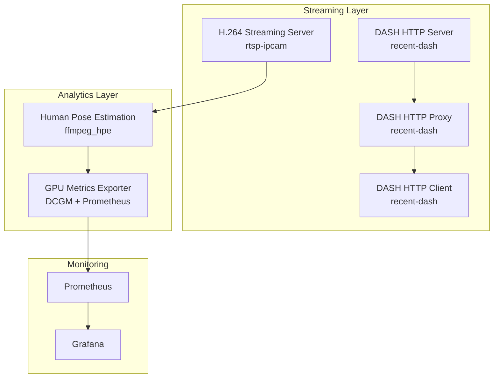
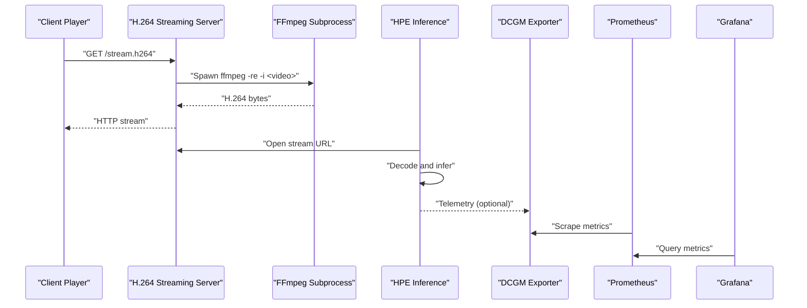
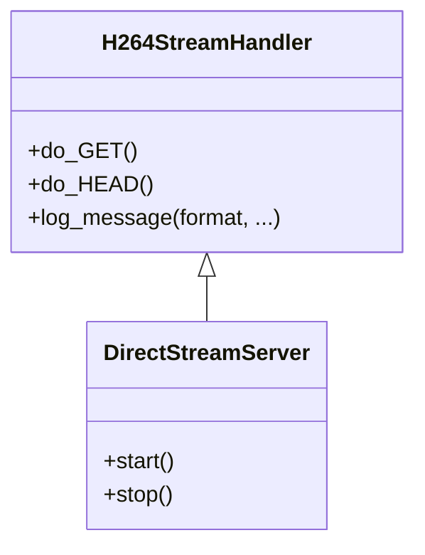
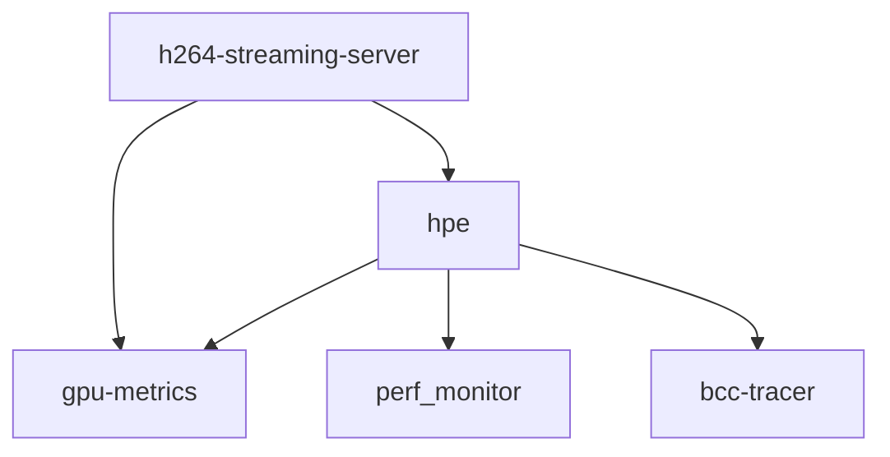
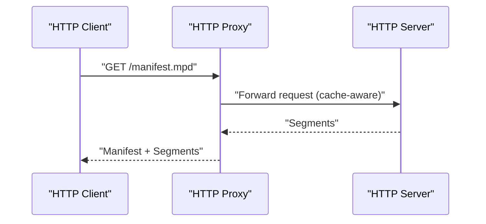
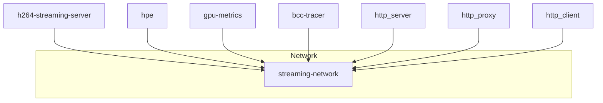

# Deployment Infrastructure

<cite>
**Referenced Files in This Document**
- [rtsp-ipcam/docker-compose.yml](file://rtsp-ipcam/docker-compose.yml)
- [rtsp-ipcam/Dockerfile](file://rtsp-ipcam/Dockerfile)
- [rtsp-ipcam/direct_stream_server.py](file://rtsp-ipcam/direct_stream_server.py)
- [rtsp-ipcam/start_server.sh](file://rtsp-ipcam/start_server.sh)
- [ffmpeg_hpe/docker-compose.yaml](file://ffmpeg_hpe/docker-compose.yaml)
- [recent-dash/docker-compose.yml](file://recent-dash/docker-compose.yml)
- [recent-dash/HTTP-Server.Dockerfile](file://recent-dash/HTTP-Server.Dockerfile)
- [recent-dash/HTTP-Client.Dockerfile](file://recent-dash/HTTP-Client.Dockerfile)
- [recent-dash/HTTP-Proxy.Dockerfile](file://recent-dash/HTTP-Proxy.Dockerfile)
- [recent-dash/HTTP-Server.launch.sh](file://recent-dash/HTTP-Server.launch.sh)
- [recent-dash/HTTP-Proxy.launch.sh](file://recent-dash/HTTP-Proxy.launch.sh)
- [docker-compose.yml](file://docker-compose.yml)
- [prometheus.yml](file://prometheus.yml)
- [monitor_hpe/docker-compose.yaml](file://monitor_hpe/docker-compose.yaml)
</cite>

## Table of Contents
1. [Introduction](#introduction)
2. [Project Structure](#project-structure)
3. [Core Components](#core-components)
4. [Architecture Overview](#architecture-overview)
5. [Detailed Component Analysis](#detailed-component-analysis)
6. [Dependency Analysis](#dependency-analysis)
7. [Performance Considerations](#performance-considerations)
8. [Troubleshooting Guide](#troubleshooting-guide)
9. [Conclusion](#conclusion)
10. [Appendices](#appendices)

## Introduction
This document explains the deployment infrastructure and containerization strategies for real-time video streaming and analytics. It covers:
- Docker Compose configurations for orchestrating multiple services
- HTTP streaming server setup for H.264 delivery
- Container deployment patterns, networking, and volume mounting
- RTSP/IP camera emulation via HTTP streaming
- Real-time video feed management and client connectivity
- Production deployment considerations, scaling strategies, and infrastructure requirements
- Monitoring stack integration for GPU and system metrics

## Project Structure
The repository organizes deployment artifacts by functional area:
- rtsp-ipcam: An HTTP-based H.264 streaming server with Docker and Docker Compose
- ffmpeg_hpe: Orchestrates the streaming server, human pose estimation (HPE) inference, GPU metrics, and optional BPF tracing
- recent-dash: DASH caching pipeline with HTTP server, proxy, and client containers
- Monitoring stack: Prometheus and Grafana with DCGM exporter for GPU telemetry

**Diagram sources**
- [rtsp-ipcam/docker-compose.yml:1-64](file://rtsp-ipcam/docker-compose.yml#L1-L64)
- [ffmpeg_hpe/docker-compose.yaml:1-201](file://ffmpeg_hpe/docker-compose.yaml#L1-L201)
- [recent-dash/docker-compose.yml:1-103](file://recent-dash/docker-compose.yml#L1-L103)
- [docker-compose.yml:1-30](file://docker-compose.yml#L1-L30)

**Section sources**
- [rtsp-ipcam/docker-compose.yml:1-64](file://rtsp-ipcam/docker-compose.yml#L1-L64)
- [ffmpeg_hpe/docker-compose.yaml:1-201](file://ffmpeg_hpe/docker-compose.yaml#L1-L201)
- [recent-dash/docker-compose.yml:1-103](file://recent-dash/docker-compose.yml#L1-L103)
- [docker-compose.yml:1-30](file://docker-compose.yml#L1-L30)

## Core Components
- H.264 Streaming Server (rtsp-ipcam): A Python HTTP server that uses FFmpeg to stream H.264 video over HTTP. It supports configurable port and video file path, with health checks and resource limits.
- Human Pose Estimation Pipeline (ffmpeg_hpe): Composes the streaming server, an HPE inference container (with GPU support), GPU metrics exporter, and optional BPF tracing.
- DASH Caching Stack (recent-dash): Provides HTTP server, proxy, and client containers for DASH segment delivery and caching.
- Monitoring Stack: Prometheus scraping DCGM exporter, with Grafana for visualization.

Key deployment artifacts:
- Docker Compose files define services, networks, volumes, environment variables, and health checks
- Dockerfiles build minimal images with non-root users, read-only filesystems, and tmpfs for temporary data
- Launch scripts configure service parameters and start binaries

**Section sources**
- [rtsp-ipcam/Dockerfile:1-40](file://rtsp-ipcam/Dockerfile#L1-L40)
- [rtsp-ipcam/direct_stream_server.py:1-304](file://rtsp-ipcam/direct_stream_server.py#L1-L304)
- [rtsp-ipcam/start_server.sh:1-32](file://rtsp-ipcam/start_server.sh#L1-L32)
- [ffmpeg_hpe/docker-compose.yaml:1-201](file://ffmpeg_hpe/docker-compose.yaml#L1-L201)
- [recent-dash/HTTP-Server.Dockerfile:1-59](file://recent-dash/HTTP-Server.Dockerfile#L1-L59)
- [recent-dash/HTTP-Client.Dockerfile:1-55](file://recent-dash/HTTP-Client.Dockerfile#L1-L55)
- [recent-dash/HTTP-Proxy.Dockerfile:1-49](file://recent-dash/HTTP-Proxy.Dockerfile#L1-L49)
- [docker-compose.yml:1-30](file://docker-compose.yml#L1-L30)

## Architecture Overview
The system integrates streaming, analytics, and observability:
- Streaming: A lightweight HTTP server emits H.264 via FFmpeg to clients (e.g., VLC, FFplay)
- Analytics: An HPE container consumes the stream, performs inference, and writes measurements
- Observability: Prometheus scrapes GPU metrics exported by DCGM exporter; Grafana visualizes dashboards
- Optional DASH caching: HTTP server, proxy, and client form a caching pipeline for segmented content

**Diagram sources**
- [rtsp-ipcam/direct_stream_server.py:52-138](file://rtsp-ipcam/direct_stream_server.py#L52-L138)
- [ffmpeg_hpe/docker-compose.yaml:39-92](file://ffmpeg_hpe/docker-compose.yaml#L39-L92)
- [docker-compose.yml:4-12](file://docker-compose.yml#L4-L12)
- [prometheus.yml:1-8](file://prometheus.yml#L1-L8)

**Section sources**
- [rtsp-ipcam/direct_stream_server.py:52-138](file://rtsp-ipcam/direct_stream_server.py#L52-L138)
- [ffmpeg_hpe/docker-compose.yaml:39-92](file://ffmpeg_hpe/docker-compose.yaml#L39-L92)
- [docker-compose.yml:1-30](file://docker-compose.yml#L1-L30)
- [prometheus.yml:1-8](file://prometheus.yml#L1-L8)

## Detailed Component Analysis

### H.264 Streaming Server
- Purpose: Serve H.264 video over HTTP for playback in players like VLC and FFplay
- Implementation: Python HTTP server spawns FFmpeg to transcode and stream
- Configuration: Port, video file path, and environment variables; health checks via curl or TCP probe
- Security and isolation: Non-root user, read-only rootfs, tmpfs, and resource limits

**Diagram sources**
- [rtsp-ipcam/direct_stream_server.py:45-151](file://rtsp-ipcam/direct_stream_server.py#L45-L151)
- [rtsp-ipcam/direct_stream_server.py:156-207](file://rtsp-ipcam/direct_stream_server.py#L156-L207)

**Section sources**
- [rtsp-ipcam/direct_stream_server.py:1-304](file://rtsp-ipcam/direct_stream_server.py#L1-L304)
- [rtsp-ipcam/Dockerfile:1-40](file://rtsp-ipcam/Dockerfile#L1-L40)
- [rtsp-ipcam/start_server.sh:1-32](file://rtsp-ipcam/start_server.sh#L1-L32)
- [rtsp-ipcam/docker-compose.yml:1-64](file://rtsp-ipcam/docker-compose.yml#L1-L64)

### Human Pose Estimation Pipeline
- Services:
  - h264-streaming-server: Streams H.264 to clients
  - hpe: Performs inference on the stream; GPU-enabled with shared memory sizing
  - gpu-metrics: Scrapes GPU metrics
  - perf_monitor: Host PID-based monitoring with elevated privileges
  - bcc-tracer: Optional kernel tracing for network traffic around the streamer
- Orchestration: Depends on streaming server health; uses a shared bridge network

**Diagram sources**
- [ffmpeg_hpe/docker-compose.yaml:1-201](file://ffmpeg_hpe/docker-compose.yaml#L1-L201)

**Section sources**
- [ffmpeg_hpe/docker-compose.yaml:1-201](file://ffmpeg_hpe/docker-compose.yaml#L1-L201)

### DASH Caching Stack
- Services:
  - http_server: Serves pre-transcoded segments
  - http_proxy: Acts as a caching proxy between server and client
  - http_client: Delivers the manifest to clients
  - perf_monitor and bpftrace tracer: Optional performance and network tracing
- Networking: Uses Compose labels for monitoring integration

**Diagram sources**
- [recent-dash/docker-compose.yml:1-103](file://recent-dash/docker-compose.yml#L1-L103)
- [recent-dash/HTTP-Server.launch.sh:1-15](file://recent-dash/HTTP-Server.launch.sh#L1-L15)
- [recent-dash/HTTP-Proxy.launch.sh:1-20](file://recent-dash/HTTP-Proxy.launch.sh#L1-L20)

**Section sources**
- [recent-dash/docker-compose.yml:1-103](file://recent-dash/docker-compose.yml#L1-L103)
- [recent-dash/HTTP-Server.Dockerfile:1-59](file://recent-dash/HTTP-Server.Dockerfile#L1-L59)
- [recent-dash/HTTP-Client.Dockerfile:1-55](file://recent-dash/HTTP-Client.Dockerfile#L1-L55)
- [recent-dash/HTTP-Proxy.Dockerfile:1-49](file://recent-dash/HTTP-Proxy.Dockerfile#L1-L49)
- [recent-dash/HTTP-Server.launch.sh:1-15](file://recent-dash/HTTP-Server.launch.sh#L1-L15)
- [recent-dash/HTTP-Proxy.launch.sh:1-20](file://recent-dash/HTTP-Proxy.launch.sh#L1-L20)

### Monitoring Stack
- Prometheus scrapes DCGM exporter at a 500ms interval
- Grafana visualizes metrics exposed by Prometheus
- Optional per-container monitoring via labels and agents

**Diagram sources**
- [docker-compose.yml:1-30](file://docker-compose.yml#L1-L30)
- [prometheus.yml:1-8](file://prometheus.yml#L1-L8)

**Section sources**
- [docker-compose.yml:1-30](file://docker-compose.yml#L1-L30)
- [prometheus.yml:1-8](file://prometheus.yml#L1-L8)

## Dependency Analysis
- Service dependencies:
  - HPE depends on the streaming server being healthy
  - DASH client depends on the proxy; proxy depends on the server
  - Monitoring depends on exporters and agents
- Shared network:
  - A dedicated bridge network isolates streaming services
- Resource allocation:
  - CPU/memory limits and reservations are defined per service
  - GPU devices are requested for inference and metrics containers

**Diagram sources**
- [ffmpeg_hpe/docker-compose.yaml:198-201](file://ffmpeg_hpe/docker-compose.yaml#L198-L201)
- [rtsp-ipcam/docker-compose.yml:61-64](file://rtsp-ipcam/docker-compose.yml#L61-L64)
- [recent-dash/docker-compose.yml:1-103](file://recent-dash/docker-compose.yml#L1-L103)

**Section sources**
- [ffmpeg_hpe/docker-compose.yaml:84-86](file://ffmpeg_hpe/docker-compose.yaml#L84-L86)
- [recent-dash/docker-compose.yml:24-26](file://recent-dash/docker-compose.yml#L24-L26)

## Performance Considerations
- Streaming server:
  - Health checks use TCP or HTTP probes to detect liveness
  - Resource limits prevent contention; read-only rootfs and tmpfs reduce attack surface
- HPE inference:
  - GPU runtime and device visibility configured; shared memory sized appropriately
  - Increased FFmpeg timeouts to handle long-running streams
- Monitoring:
  - Elevated privileges and host PID namespaces enable accurate process and network tracing
- DASH caching:
  - Proxy parameters tuned for adaptive loading and caching policies

Recommendations:
- Tune FFmpeg presets and tune for zero-latency streaming
- Adjust SHM size and GPU memory reservations based on model requirements
- Use separate networks per workload to isolate traffic and improve security
- Enable compression and optimize segment sizes for DASH delivery

**Section sources**
- [rtsp-ipcam/docker-compose.yml:20-37](file://rtsp-ipcam/docker-compose.yml#L20-L37)
- [ffmpeg_hpe/docker-compose.yaml:43-66](file://ffmpeg_hpe/docker-compose.yaml#L43-L66)
- [recent-dash/docker-compose.yml:16-32](file://recent-dash/docker-compose.yml#L16-L32)

## Troubleshooting Guide
Common issues and resolutions:
- Video file not found:
  - Verify mounted path inside the container and file existence
  - Confirm read-only mount permissions for the videos directory
- Client cannot connect:
  - Check port exposure and firewall rules
  - Validate health checks and service readiness
- HPE fails to start:
  - Ensure streaming server is healthy before starting HPE
  - Review GPU visibility and shared memory configuration
- Metrics missing:
  - Confirm DCGM exporter is running and Prometheus can reach it
  - Validate scrape intervals and targets

Operational tips:
- Use logs from the streaming server and HPE container to diagnose failures
- For DASH, confirm proxy forwarding and cache directory availability
- Validate environment variables passed via Compose files

**Section sources**
- [rtsp-ipcam/direct_stream_server.py:60-63](file://rtsp-ipcam/direct_stream_server.py#L60-L63)
- [rtsp-ipcam/docker-compose.yml:20-24](file://rtsp-ipcam/docker-compose.yml#L20-L24)
- [ffmpeg_hpe/docker-compose.yaml:84-86](file://ffmpeg_hpe/docker-compose.yaml#L84-L86)
- [docker-compose.yml:14-22](file://docker-compose.yml#L14-L22)

## Conclusion
The deployment infrastructure combines a lightweight HTTP H.264 streaming server with a GPU-accelerated analytics pipeline and a DASH caching stack, all orchestrated via Docker Compose. Security hardening, resource controls, and a monitoring stack round out a production-ready foundation. The modular design enables scaling by adding more streaming servers, HPE workers, or DASH nodes behind load balancers.

## Appendices

### Container Networking and Volume Mounting
- Networks:
  - Dedicated bridge network for streaming services
- Volumes:
  - Read-only mounts for video assets
  - Read-write mounts for results and traces
- Ports:
  - Exposed ports mapped to localhost for local testing; adjust for production

**Section sources**
- [rtsp-ipcam/docker-compose.yml:11-19](file://rtsp-ipcam/docker-compose.yml#L11-L19)
- [ffmpeg_hpe/docker-compose.yaml:10-13](file://ffmpeg_hpe/docker-compose.yaml#L10-L13)
- [recent-dash/docker-compose.yml:56-58](file://recent-dash/docker-compose.yml#L56-L58)

### Production Deployment Checklist
- Security:
  - Run as non-root; enable read-only rootfs and tmpfs
  - Restrict privileges; disable new privileges
- Reliability:
  - Define health checks and restart policies
  - Use resource limits and reservations
- Observability:
  - Deploy Prometheus and Grafana
  - Integrate exporters for GPU and system metrics
- Scalability:
  - Horizontal scaling of streaming servers and HPE workers
  - Use load balancers for DASH manifests and proxies

**Section sources**
- [rtsp-ipcam/Dockerfile:16-37](file://rtsp-ipcam/Dockerfile#L16-L37)
- [docker-compose.yml:1-30](file://docker-compose.yml#L1-L30)