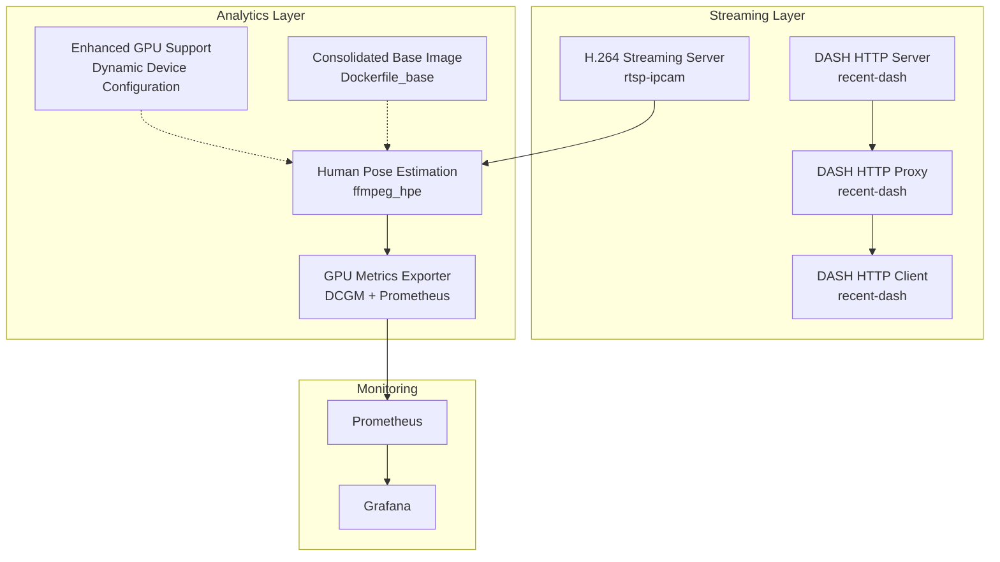
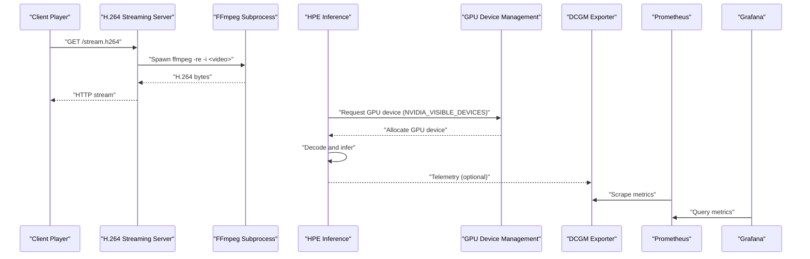
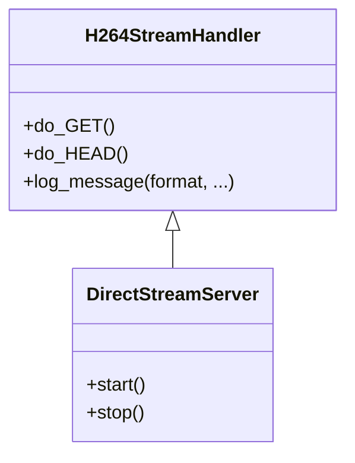
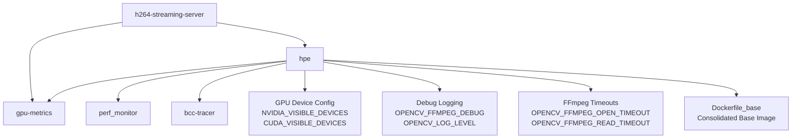
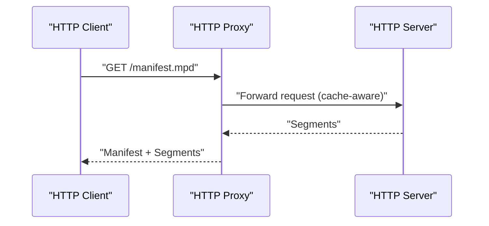
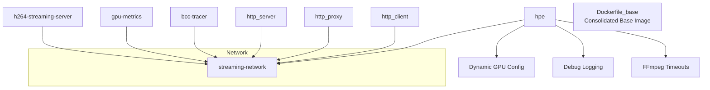

# Deployment Infrastructure

<cite>
**Referenced Files in This Document**
- [rtsp-ipcam/docker-compose.yml](file://rtsp-ipcam/docker-compose.yml)
- [rtsp-ipcam/Dockerfile](file://rtsp-ipcam/Dockerfile)
- [rtsp-ipcam/direct_stream_server.py](file://rtsp-ipcam/direct_stream_server.py)
- [rtsp-ipcam/start_server.sh](file://rtsp-ipcam/start_server.sh)
- [ffmpeg_hpe/docker-compose.yaml](file://ffmpeg_hpe/docker-compose.yaml)
- [ffmpeg_hpe/Dockerfile.gpu_metrics](file://ffmpeg_hpe/Dockerfile.gpu_metrics)
- [recent-dash/docker-compose.yml](file://recent-dash/docker-compose.yml)
- [recent-dash/HTTP-Server.Dockerfile](file://recent-dash/HTTP-Server.Dockerfile)
- [recent-dash/HTTP-Client.Dockerfile](file://recent-dash/HTTP-Client.Dockerfile)
- [recent-dash/HTTP-Proxy.Dockerfile](file://recent-dash/HTTP-Proxy.Dockerfile)
- [recent-dash/HTTP-Server.launch.sh](file://recent-dash/HTTP-Server.launch.sh)
- [recent-dash/HTTP-Proxy.launch.sh](file://recent-dash/HTTP-Proxy.launch.sh)
- [docker-compose.yml](file://docker-compose.yml)
- [prometheus.yml](file://prometheus.yml)
- [monitor_hpe/docker-compose.yaml](file://monitor_hpe/docker-compose.yaml)
- [Dockerfile_base](file://Dockerfile_base)
- [docs/docker-services.md](file://docs/docker-services.md)
</cite>

## Update Summary
**Changes Made**
- Updated Docker infrastructure cleanup through archival of stale Dockerfile variants under archive/dockerfiles/
- Consolidated Dockerfile variants with Dockerfile_base as the active base image
- Enhanced ffmpeg_hpe docker-compose.yaml with relative build contexts and improved service definitions
- Simplified Dockerfile management by removing redundant variants

## Table of Contents
1. [Introduction](#introduction)
2. [Project Structure](#project-structure)
3. [Core Components](#core-components)
4. [Architecture Overview](#architecture-overview)
5. [Detailed Component Analysis](#detailed-component-analysis)
6. [Dependency Analysis](#dependency-analysis)
7. [Performance Considerations](#performance-considerations)
8. [Troubleshooting Guide](#troubleshooting-guide)
9. [Conclusion](#conclusion)
10. [Appendices](#appendices)

## Introduction
This document explains the deployment infrastructure and containerization strategies for real-time video streaming and analytics. It covers:
- Docker Compose configurations for orchestrating multiple services with enhanced GPU device management
- HTTP streaming server setup for H.264 delivery with improved debugging capabilities
- Container deployment patterns, networking, and volume mounting
- RTSP/IP camera emulation via HTTP streaming
- Real-time video feed management and client connectivity
- Production deployment considerations, scaling strategies, and infrastructure requirements
- Monitoring stack integration for GPU and system metrics with enhanced NVIDIA driver support
- **Updated**: Simplified Dockerfile management through consolidation under Dockerfile_base

## Project Structure
The repository organizes deployment artifacts by functional area:
- rtsp-ipcam: An HTTP-based H.264 streaming server with Docker and Docker Compose
- ffmpeg_hpe: Orchestrates the streaming server, human pose estimation (HPE) inference, GPU metrics, and optional BPF tracing with enhanced GPU device configuration
- recent-dash: DASH caching pipeline with HTTP server, proxy, and client containers
- Monitoring stack: Prometheus and Grafana with DCGM exporter for GPU telemetry
- **Updated**: Docker infrastructure cleanup with archived stale Dockerfile variants

**Diagram sources**
- [rtsp-ipcam/docker-compose.yml:1-64](file://rtsp-ipcam/docker-compose.yml#L1-L64)
- [ffmpeg_hpe/docker-compose.yaml:1-204](file://ffmpeg_hpe/docker-compose.yaml#L1-L204)
- [recent-dash/docker-compose.yml:1-103](file://recent-dash/docker-compose.yml#L1-L103)
- [docker-compose.yml:1-30](file://docker-compose.yml#L1-L30)
- [Dockerfile_base](file://Dockerfile_base)

**Section sources**
- [rtsp-ipcam/docker-compose.yml:1-64](file://rtsp-ipcam/docker-compose.yml#L1-L64)
- [ffmpeg_hpe/docker-compose.yaml:1-204](file://ffmpeg_hpe/docker-compose.yaml#L1-L204)
- [recent-dash/docker-compose.yml:1-103](file://recent-dash/docker-compose.yml#L1-L103)
- [docker-compose.yml:1-30](file://docker-compose.yml#L1-L30)
- [Dockerfile_base](file://Dockerfile_base)

## Core Components
- H.264 Streaming Server (rtsp-ipcam): A Python HTTP server that uses FFmpeg to stream H.264 video over HTTP. It supports configurable port and video file path, with health checks and resource limits.
- Human Pose Estimation Pipeline (ffmpeg_hpe): Composes the streaming server, an HPE inference container (with enhanced GPU support), GPU metrics exporter, and optional BPF tracing.
- DASH Caching Stack (recent-dash): Provides HTTP server, proxy, and client containers for DASH segment delivery and caching.
- Monitoring Stack: Prometheus scraping DCGM exporter, with Grafana for visualization.
- **Updated**: Consolidated Docker infrastructure using Dockerfile_base as the primary base image, eliminating redundant Dockerfile variants

Key deployment artifacts:
- Docker Compose files define services, networks, volumes, environment variables, and health checks
- Dockerfiles build minimal images with non-root users, read-only filesystems, and tmpfs for temporary data
- Launch scripts configure service parameters and start binaries
- **Enhanced**: Dynamic GPU device configuration with NVIDIA_VISIBLE_DEVICES and CUDA_VISIBLE_DEVICES environment variables
- **Enhanced**: Improved OpenCV FFMPEG debug logging with comprehensive logging levels
- **Enhanced**: Enhanced NVIDIA driver capabilities with compute, utility, and video support
- **Updated**: Simplified Dockerfile management through consolidation under Dockerfile_base

**Section sources**
- [rtsp-ipcam/Dockerfile:1-40](file://rtsp-ipcam/Dockerfile#L1-L40)
- [rtsp-ipcam/direct_stream_server.py:1-200](file://rtsp-ipcam/direct_stream_server.py#L1-L200)
- [rtsp-ipcam/start_server.sh:1-32](file://rtsp-ipcam/start_server.sh#L1-L32)
- [ffmpeg_hpe/docker-compose.yaml:42-55](file://ffmpeg_hpe/docker-compose.yaml#L42-L55)
- [ffmpeg_hpe/Dockerfile.gpu_metrics:1-20](file://ffmpeg_hpe/Dockerfile.gpu_metrics#L1-L20)
- [recent-dash/HTTP-Server.Dockerfile:1-59](file://recent-dash/HTTP-Server.Dockerfile#L1-L59)
- [recent-dash/HTTP-Client.Dockerfile:1-55](file://recent-dash/HTTP-Client.Dockerfile#L1-L55)
- [recent-dash/HTTP-Proxy.Dockerfile:1-49](file://recent-dash/HTTP-Proxy.Dockerfile#L1-L49)
- [docker-compose.yml:1-30](file://docker-compose.yml#L1-L30)
- [Dockerfile_base](file://Dockerfile_base)

## Architecture Overview
The system integrates streaming, analytics, and observability with enhanced GPU device management:
- Streaming: A lightweight HTTP server emits H.264 via FFmpeg to clients (e.g., VLC, FFplay)
- Analytics: An HPE container consumes the stream, performs inference, and writes measurements with enhanced GPU device configuration
- Observability: Prometheus scrapes GPU metrics exported by DCGM exporter; Grafana visualizes dashboards
- Optional DASH caching: HTTP server, proxy, and client form a caching pipeline for segmented content
- **Enhanced**: Dynamic GPU device selection and NVIDIA driver capability management
- **Updated**: Simplified Docker infrastructure with consolidated base image management

**Diagram sources**
- [rtsp-ipcam/direct_stream_server.py:52-138](file://rtsp-ipcam/direct_stream_server.py#L52-L138)
- [ffmpeg_hpe/docker-compose.yaml:39-92](file://ffmpeg_hpe/docker-compose.yaml#L39-L92)
- [ffmpeg_hpe/docker-compose.yaml:42-55](file://ffmpeg_hpe/docker-compose.yaml#L42-L55)
- [docker-compose.yml:4-12](file://docker-compose.yml#L4-L12)
- [prometheus.yml:1-8](file://prometheus.yml#L1-L8)

**Section sources**
- [rtsp-ipcam/direct_stream_server.py:52-138](file://rtsp-ipcam/direct_stream_server.py#L52-L138)
- [ffmpeg_hpe/docker-compose.yaml:39-92](file://ffmpeg_hpe/docker-compose.yaml#L39-L92)
- [ffmpeg_hpe/docker-compose.yaml:42-55](file://ffmpeg_hpe/docker-compose.yaml#L42-L55)
- [docker-compose.yml:1-30](file://docker-compose.yml#L1-L30)
- [prometheus.yml:1-8](file://prometheus.yml#L1-L8)

## Detailed Component Analysis

### H.264 Streaming Server
- Purpose: Serve H.264 video over HTTP for playback in players like VLC and FFplay
- Implementation: Python HTTP server spawns FFmpeg to transcode and stream
- Configuration: Port, video file path, and environment variables; health checks via curl or TCP probe
- Security and isolation: Non-root user, read-only rootfs, tmpfs, and resource limits

**Diagram sources**
- [rtsp-ipcam/direct_stream_server.py:45-151](file://rtsp-ipcam/direct_stream_server.py#L45-L151)
- [rtsp-ipcam/direct_stream_server.py:156-200](file://rtsp-ipcam/direct_stream_server.py#L156-L200)

**Section sources**
- [rtsp-ipcam/direct_stream_server.py:1-200](file://rtsp-ipcam/direct_stream_server.py#L1-L200)
- [rtsp-ipcam/Dockerfile:1-40](file://rtsp-ipcam/Dockerfile#L1-L40)
- [rtsp-ipcam/start_server.sh:1-32](file://rtsp-ipcam/start_server.sh#L1-L32)
- [rtsp-ipcam/docker-compose.yml:1-64](file://rtsp-ipcam/docker-compose.yml#L1-L64)

### Human Pose Estimation Pipeline
- Services:
  - h264-streaming-server: Streams H.264 to clients
  - hpe: Performs inference on the stream; GPU-enabled with enhanced device configuration and shared memory sizing
  - gpu-metrics: Scrapes GPU metrics with NVIDIA runtime support
  - perf_monitor: Host PID-based monitoring with elevated privileges
  - bcc-tracer: Optional kernel tracing for network traffic around the streamer
- Orchestration: Depends on streaming server health; uses a shared bridge network
- **Enhanced**: Dynamic GPU device configuration with NVIDIA_VISIBLE_DEVICES and CUDA_VISIBLE_DEVICES environment variables
- **Enhanced**: Comprehensive OpenCV FFMPEG debug logging with OPENCV_FFMPEG_DEBUG=1 and OPENCV_LOG_LEVEL=DEBUG
- **Enhanced**: Extended FFmpeg timeouts for long-running streams (300 second open/read timeouts)
- **Updated**: Utilizes Dockerfile_base as the consolidated base image for simplified dependency management

**Diagram sources**
- [ffmpeg_hpe/docker-compose.yaml:1-204](file://ffmpeg_hpe/docker-compose.yaml#L1-L204)
- [Dockerfile_base](file://Dockerfile_base)

**Section sources**
- [ffmpeg_hpe/docker-compose.yaml:1-204](file://ffmpeg_hpe/docker-compose.yaml#L1-L204)
- [Dockerfile_base](file://Dockerfile_base)

### Enhanced GPU Device Configuration
**New Section** - The HPE service now includes comprehensive GPU device management:

- **Dynamic GPU Selection**: `NVIDIA_VISIBLE_DEVICES=${NVIDIA_VISIBLE_DEVICES:-all}` allows runtime selection of GPU devices
- **CUDA Device Mapping**: `CUDA_VISIBLE_DEVICES=${CUDA_VISIBLE_DEVICES:-0}` maps visible GPUs to CUDA devices
- **Driver Capabilities**: `NVIDIA_DRIVER_CAPABILITIES=compute,utility,video` enables full NVIDIA driver functionality
- **Resource Allocation**: Devices section with `count: all` and `capabilities: [gpu]` for automatic GPU scheduling
- **Runtime Support**: `runtime: nvidia` enables NVIDIA container runtime

**Section sources**
- [ffmpeg_hpe/docker-compose.yaml:42-55](file://ffmpeg_hpe/docker-compose.yaml#L42-L55)
- [ffmpeg_hpe/docker-compose.yaml:82-85](file://ffmpeg_hpe/docker-compose.yaml#L82-L85)

### Enhanced Debug Logging Configuration
**New Section** - Improved OpenCV FFMPEG debugging capabilities:

- **FFMPEG Debug Logging**: `OPENCV_FFMPEG_DEBUG=1` enables comprehensive FFMPEG debug output
- **OpenCV Log Level**: `OPENCV_LOG_LEVEL=DEBUG` sets OpenCV logging to debug level
- **Python Buffering**: `PYTHONUNBUFFERED=1` ensures immediate log output
- **Extended Timeouts**: `OPENCV_FFMPEG_OPEN_TIMEOUT=300000` and `OPENCV_FFMPEG_READ_TIMEOUT=300000` (300 seconds) for long-running streams
- **Memory Management**: `PYTORCH_CUDA_ALLOC_CONF=max_split_size_mb:32` optimizes CUDA memory allocation

**Section sources**
- [ffmpeg_hpe/docker-compose.yaml:48-51](file://ffmpeg_hpe/docker-compose.yaml#L48-L51)
- [ffmpeg_hpe/docker-compose.yaml:65-66](file://ffmpeg_hpe/docker-compose.yaml#L65-L66)

### DASH Caching Stack
- Services:
  - http_server: Serves pre-transcoded segments
  - http_proxy: Acts as a caching proxy between server and client
  - http_client: Delivers the manifest to clients
  - perf_monitor and bpftrace tracer: Optional performance and network tracing
- Networking: Uses Compose labels for monitoring integration

**Diagram sources**
- [recent-dash/docker-compose.yml:1-103](file://recent-dash/docker-compose.yml#L1-L103)
- [recent-dash/HTTP-Server.launch.sh:1-15](file://recent-dash/HTTP-Server.launch.sh#L1-L15)
- [recent-dash/HTTP-Proxy.launch.sh:1-20](file://recent-dash/HTTP-Proxy.launch.sh#L1-L20)

**Section sources**
- [recent-dash/docker-compose.yml:1-103](file://recent-dash/docker-compose.yml#L1-L103)
- [recent-dash/HTTP-Server.Dockerfile:1-59](file://recent-dash/HTTP-Server.Dockerfile#L1-L59)
- [recent-dash/HTTP-Client.Dockerfile:1-55](file://recent-dash/HTTP-Client.Dockerfile#L1-L55)
- [recent-dash/HTTP-Proxy.Dockerfile:1-49](file://recent-dash/HTTP-Proxy.Dockerfile#L1-L49)
- [recent-dash/HTTP-Server.launch.sh:1-15](file://recent-dash/HTTP-Server.launch.sh#L1-L15)
- [recent-dash/HTTP-Proxy.launch.sh:1-20](file://recent-dash/HTTP-Proxy.launch.sh#L1-L20)

### Monitoring Stack
- Prometheus scrapes DCGM exporter at a 500ms interval
- Grafana visualizes metrics exposed by Prometheus
- Optional per-container monitoring via labels and agents
- **Enhanced**: GPU metrics container with proper NVIDIA runtime configuration

**Diagram sources**
- [docker-compose.yml:1-30](file://docker-compose.yml#L1-L30)
- [prometheus.yml:1-8](file://prometheus.yml#L1-L8)

**Section sources**
- [docker-compose.yml:1-30](file://docker-compose.yml#L1-L30)
- [prometheus.yml:1-8](file://prometheus.yml#L1-L8)

### Docker Infrastructure Consolidation
**New Section** - Simplified Dockerfile management through consolidation:

- **Archived Stale Variants**: Dockerfile variants moved to `archive/dockerfiles/` directory for historical reference
- **Active Base Image**: `Dockerfile_base` serves as the primary base image for all HPE-related containers
- **Reduced Complexity**: Elimination of redundant Dockerfile variants reduces maintenance overhead
- **Standardized Build Process**: All services now inherit from the consolidated base image

**Section sources**
- [Dockerfile_base](file://Dockerfile_base)
- [docs/docker-services.md:11-46](file://docs/docker-services.md#L11-L46)

## Dependency Analysis
- Service dependencies:
  - HPE depends on the streaming server being healthy
  - DASH client depends on the proxy; proxy depends on the server
  - Monitoring depends on exporters and agents
  - **Enhanced**: HPE now depends on proper GPU device configuration
  - **Updated**: All services utilize Dockerfile_base for consistent base image management
- Shared network:
  - A dedicated bridge network isolates streaming services
- Resource allocation:
  - CPU/memory limits and reservations are defined per service
  - **Enhanced**: GPU devices are dynamically requested with proper driver capabilities
  - **Updated**: Simplified dependency chain through consolidated base image

**Diagram sources**
- [ffmpeg_hpe/docker-compose.yaml:198-204](file://ffmpeg_hpe/docker-compose.yaml#L198-L204)
- [rtsp-ipcam/docker-compose.yml:61-64](file://rtsp-ipcam/docker-compose.yml#L61-L64)
- [recent-dash/docker-compose.yml:1-103](file://recent-dash/docker-compose.yml#L1-L103)
- [Dockerfile_base](file://Dockerfile_base)

**Section sources**
- [ffmpeg_hpe/docker-compose.yaml:82-85](file://ffmpeg_hpe/docker-compose.yaml#L82-L85)
- [recent-dash/docker-compose.yml:24-26](file://recent-dash/docker-compose.yml#L24-L26)
- [Dockerfile_base](file://Dockerfile_base)

## Performance Considerations
- Streaming server:
  - Health checks use TCP or HTTP probes to detect liveness
  - Resource limits prevent contention; read-only rootfs and tmpfs reduce attack surface
- HPE inference:
  - **Enhanced**: GPU runtime and device visibility configured with dynamic GPU device selection
  - **Enhanced**: Shared memory sized appropriately with CUDA memory allocation optimization
  - **Enhanced**: Increased FFmpeg timeouts (300 seconds) to handle long-running streams
  - **Enhanced**: Comprehensive debug logging for troubleshooting GPU and FFMPEG issues
  - **Updated**: Consolidated base image improves build reproducibility and reduces layer complexity
- Monitoring:
  - Elevated privileges and host PID namespaces enable accurate process and network tracing
- DASH caching:
  - Proxy parameters tuned for adaptive loading and caching policies
- **Updated**: Docker infrastructure simplification reduces build times and improves reliability

Recommendations:
- **Enhanced**: Configure NVIDIA_VISIBLE_DEVICES to select specific GPUs for HPE workloads
- **Enhanced**: Use CUDA_VISIBLE_DEVICES to map GPU devices to CUDA contexts
- Tune FFmpeg presets and tune for zero-latency streaming
- Adjust SHM size and GPU memory reservations based on model requirements
- Use separate networks per workload to isolate traffic and improve security
- Enable compression and optimize segment sizes for DASH delivery
- **Enhanced**: Monitor GPU utilization and adjust device allocation based on workload demands
- **Updated**: Leverage Dockerfile_base for consistent builds across all services

**Section sources**
- [rtsp-ipcam/docker-compose.yml:20-37](file://rtsp-ipcam/docker-compose.yml#L20-L37)
- [ffmpeg_hpe/docker-compose.yaml:42-55](file://ffmpeg_hpe/docker-compose.yaml#L42-L55)
- [ffmpeg_hpe/docker-compose.yaml:65-66](file://ffmpeg_hpe/docker-compose.yaml#L65-L66)
- [recent-dash/docker-compose.yml:16-32](file://recent-dash/docker-compose.yml#L16-L32)
- [Dockerfile_base](file://Dockerfile_base)

## Troubleshooting Guide
Common issues and resolutions:
- Video file not found:
  - Verify mounted path inside the container and file existence
  - Confirm read-only mount permissions for the videos directory
- Client cannot connect:
  - Check port exposure and firewall rules
  - Validate health checks and service readiness
- HPE fails to start:
  - Ensure streaming server is healthy before starting HPE
  - **Enhanced**: Review GPU visibility with `NVIDIA_VISIBLE_DEVICES` and shared memory configuration
  - **Enhanced**: Check FFMPEG debug logs with `OPENCV_FFMPEG_DEBUG=1` for GPU initialization issues
- Metrics missing:
  - Confirm DCGM exporter is running and Prometheus can reach it
  - Validate scrape intervals and targets
- **New**: GPU device allocation issues:
  - Verify NVIDIA driver installation and version compatibility
  - Check `NVIDIA_DRIVER_CAPABILITIES` includes required capabilities (compute, utility, video)
  - Ensure proper GPU scheduling with `count: all` in devices section
- **New**: FFMPEG timeout errors:
  - Increase `OPENCV_FFMPEG_OPEN_TIMEOUT` and `OPENCV_FFMPEG_READ_TIMEOUT` values
  - Check network connectivity and stream source availability
  - Verify FFMPEG debug logs for codec and format issues
- **New**: Docker build issues:
  - Verify Dockerfile_base is accessible and not corrupted
  - Check for conflicts in archived Dockerfile variants
  - Ensure proper relative paths in docker-compose.yaml build contexts

Operational tips:
- Use logs from the streaming server and HPE container to diagnose failures
- **Enhanced**: Enable comprehensive debug logging with `OPENCV_FFMPEG_DEBUG=1` and `OPENCV_LOG_LEVEL=DEBUG`
- For DASH, confirm proxy forwarding and cache directory availability
- Validate environment variables passed via Compose files
- **Enhanced**: Monitor GPU utilization and adjust device allocation based on workload demands
- **Updated**: Verify Dockerfile_base integrity if experiencing build failures

**Section sources**
- [rtsp-ipcam/direct_stream_server.py:60-63](file://rtsp-ipcam/direct_stream_server.py#L60-L63)
- [rtsp-ipcam/docker-compose.yml:20-24](file://rtsp-ipcam/docker-compose.yml#L20-L24)
- [ffmpeg_hpe/docker-compose.yaml:42-55](file://ffmpeg_hpe/docker-compose.yaml#L42-L55)
- [ffmpeg_hpe/docker-compose.yaml:48-51](file://ffmpeg_hpe/docker-compose.yaml#L48-L51)
- [docker-compose.yml:14-22](file://docker-compose.yml#L14-L22)
- [Dockerfile_base](file://Dockerfile_base)

## Conclusion
The deployment infrastructure combines a lightweight HTTP H.264 streaming server with a GPU-accelerated analytics pipeline and a DASH caching stack, all orchestrated via Docker Compose. **Enhanced** with dynamic GPU device configuration, comprehensive debug logging, and improved NVIDIA driver support, the system provides production-ready foundation with advanced GPU management capabilities. **Updated** with Docker infrastructure consolidation through Dockerfile_base, the system now offers simplified maintenance and improved build reliability while maintaining optimal GPU resource utilization.

## Appendices

### Container Networking and Volume Mounting
- Networks:
  - Dedicated bridge network for streaming services
- Volumes:
  - Read-only mounts for video assets
  - Read-write mounts for results and traces
- Ports:
  - Exposed ports mapped to localhost for local testing; adjust for production

**Section sources**
- [rtsp-ipcam/docker-compose.yml:11-19](file://rtsp-ipcam/docker-compose.yml#L11-L19)
- [ffmpeg_hpe/docker-compose.yaml:10-13](file://ffmpeg_hpe/docker-compose.yaml#L10-L13)
- [recent-dash/docker-compose.yml:56-58](file://recent-dash/docker-compose.yml#L56-L58)

### Production Deployment Checklist
- Security:
  - Run as non-root; enable read-only rootfs and tmpfs
  - Restrict privileges; disable new privileges
- Reliability:
  - Define health checks and restart policies
  - Use resource limits and reservations
- Observability:
  - Deploy Prometheus and Grafana
  - Integrate exporters for GPU and system metrics
  - **Enhanced**: Enable comprehensive debug logging for GPU and FFMPEG troubleshooting
- Scalability:
  - Horizontal scaling of streaming servers and HPE workers
  - Use load balancers for DASH manifests and proxies
- **New**: GPU Resource Management:
  - Configure `NVIDIA_VISIBLE_DEVICES` for selective GPU allocation
  - Set `CUDA_VISIBLE_DEVICES` for CUDA device mapping
  - Enable `NVIDIA_DRIVER_CAPABILITIES=compute,utility,video` for full driver support
  - Monitor GPU utilization and adjust allocation based on workload demands
- **Updated**: Docker Infrastructure Management:
  - Ensure Dockerfile_base accessibility and integrity
  - Verify archived Dockerfile variants are properly stored
  - Validate relative build contexts in docker-compose.yaml
  - Monitor build times and resolve consolidation-related issues

**Section sources**
- [rtsp-ipcam/Dockerfile:16-37](file://rtsp-ipcam/Dockerfile#L16-L37)
- [ffmpeg_hpe/docker-compose.yaml:42-55](file://ffmpeg_hpe/docker-compose.yaml#L42-L55)
- [docker-compose.yml:1-30](file://docker-compose.yml#L1-L30)
- [Dockerfile_base](file://Dockerfile_base)