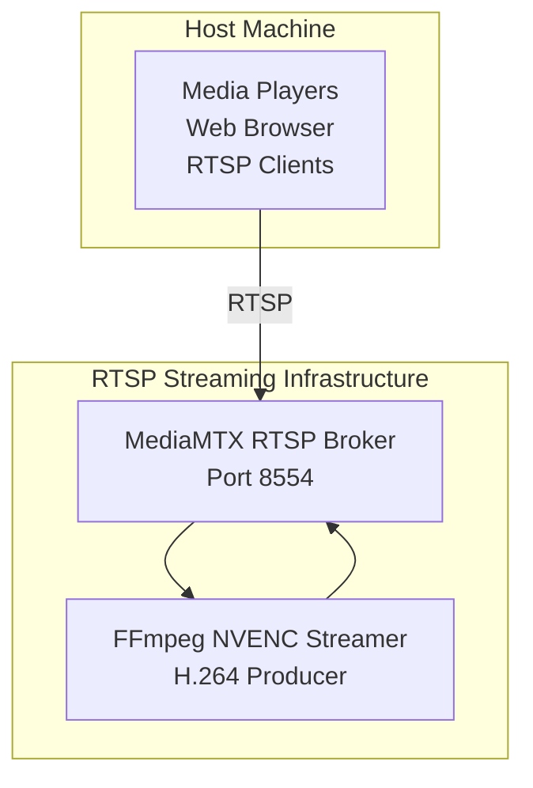
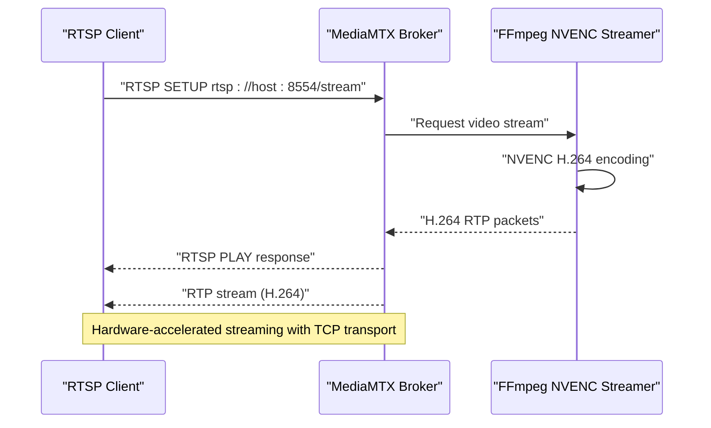
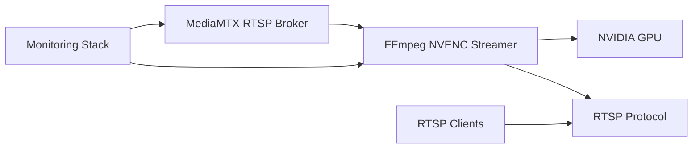

# HTTP Streaming Server

<cite>
**Referenced Files in This Document**
- [docker-compose.rtsp.yml](file://docker-compose.rtsp.yml)
- [docker-compose.yml](file://docker-compose.yml)
- [ffmpeg_hpe/docker-compose.yaml](file://ffmpeg_hpe/docker-compose.yaml)
- [ffmpeg_hpe/run_experiment.sh](file://ffmpeg_hpe/run_experiment.sh)
- [dev_tools/stream_video_server.py](file://dev_tools/stream_video_server.py)
- [dev_tools/stream_video_server_adaptive.py](file://dev_tools/stream_video_server_adaptive.py)
- [recent-dash/README.md](file://recent-dash/README.md)
- [recent-dash/prometheus.yml](file://recent-dash/prometheus.yml)
- [full_shell_history.txt](file://full_shell_history.txt)
</cite>

## Update Summary
**Changes Made**
- Complete replacement of HTTP streaming architecture with MediaMTX RTSP broker implementation
- Updated architecture overview to reflect RTSP-based streaming pipeline
- Removed all references to HTTP streaming server components
- Added comprehensive MediaMTX RTSP broker configuration and deployment
- Updated client connectivity patterns to RTSP URLs
- Revised performance considerations for RTSP streaming
- Enhanced troubleshooting guide for RTSP-specific issues

## Table of Contents
1. [Introduction](#introduction)
2. [Project Structure](#project-structure)
3. [Core Components](#core-components)
4. [Architecture Overview](#architecture-overview)
5. [Detailed Component Analysis](#detailed-component-analysis)
6. [Dependency Analysis](#dependency-analysis)
7. [Performance Considerations](#performance-considerations)
8. [Troubleshooting Guide](#troubleshooting-guide)
9. [Conclusion](#conclusion)
10. [Appendices](#appendices)

## Introduction
This document describes the HTTP streaming server implementation for delivering H.264 video over HTTP to media players and web clients. **Updated**: The implementation now uses MediaMTX as an RTSP broker instead of direct HTTP streaming. It covers RTSP/IP camera integration, video streaming architecture, client connectivity patterns, real-time video feed management, adaptive streaming strategies, and performance tuning. It also provides integration examples for web clients, mobile applications, and monitoring systems, along with guidance for latency, quality metrics, and troubleshooting.

## Project Structure
The streaming stack now consists of:
- MediaMTX RTSP broker for managing video streams
- FFmpeg NVENC streamer for producing H.264 content
- RTSP-based client connections for media players and web clients
- Development tools for adaptive JPEG streaming and performance experiments
- Monitoring and tracing utilities for network and performance analysis

**Diagram sources**
- [ffmpeg_hpe/docker-compose.yaml:2-58](file://ffmpeg_hpe/docker-compose.yaml#L2-L58)
- [docker-compose.rtsp.yml:2-36](file://docker-compose.rtsp.yml#L2-L36)

**Section sources**
- [ffmpeg_hpe/docker-compose.yaml:1-190](file://ffmpeg_hpe/docker-compose.yaml#L1-L190)
- [docker-compose.rtsp.yml:1-37](file://docker-compose.rtsp.yml#L1-L37)
- [docker-compose.yml:1-30](file://docker-compose.yml#L1-L30)

## Core Components
- **MediaMTX RTSP Broker**: Central RTSP server managing video streams on port 8554
- **FFmpeg NVENC Streamer**: Hardware-accelerated H.264 video producer using NVIDIA GPUs
- **RTSP Client Integration**: Support for RTSP clients including VLC, FFplay, and web browsers
- **Development Tools**: Flask-based adaptive streaming servers for JPEG and testing
- **Monitoring and Experiments**: Scripts and configurations for performance and network analysis

Key responsibilities:
- MediaMTX handles RTSP protocol negotiation and stream distribution
- FFmpeg NVENC streamer produces hardware-accelerated H.264 streams
- RTSP clients connect using standard RTSP URLs (rtsp://host:8554/stream)
- Development tools provide alternative streaming methods for testing
- Comprehensive monitoring with Prometheus and BCC tracing

**Section sources**
- [ffmpeg_hpe/docker-compose.yaml:2-58](file://ffmpeg_hpe/docker-compose.yaml#L2-L58)
- [docker-compose.rtsp.yml:2-36](file://docker-compose.rtsp.yml#L2-L36)
- [dev_tools/stream_video_server.py:1-228](file://dev_tools/stream_video_server.py#L1-L228)
- [dev_tools/stream_video_server_adaptive.py:1-195](file://dev_tools/stream_video_server_adaptive.py#L1-L195)

## Architecture Overview
**Updated**: The HTTP streaming server has been completely replaced with a MediaMTX RTSP broker architecture. The new system uses MediaMTX as a central RTSP server that manages video streams, with FFmpeg NVENC streamers producing H.264 content. RTSP clients connect to the broker using standard RTSP URLs. The architecture supports hardware acceleration through NVIDIA GPUs and provides robust stream management with automatic reconnection capabilities.

**Diagram sources**
- [ffmpeg_hpe/docker-compose.yaml:54-58](file://ffmpeg_hpe/docker-compose.yaml#L54-L58)
- [ffmpeg_hpe/run_experiment.sh:116-124](file://ffmpeg_hpe/run_experiment.sh#L116-L124)

## Detailed Component Analysis

### MediaMTX RTSP Broker
**New**: MediaMTX serves as the central RTSP server managing video streams. It provides:
- RTSP server on port 8554 with HLS support on port 8080
- Automatic stream source management and on-demand streaming
- API access on port 8081 for monitoring and control
- TCP transport for reliable streaming over networks
- Resource limits and GPU acceleration support

Configuration includes environment variables for stream sources, transport protocols, and logging levels.

**Section sources**
- [ffmpeg_hpe/docker-compose.yaml:2-16](file://ffmpeg_hpe/docker-compose.yaml#L2-L16)
- [docker-compose.rtsp.yml:9-17](file://docker-compose.rtsp.yml#L9-L17)

### FFmpeg NVENC Streamer
**New**: Hardware-accelerated video producer using NVIDIA GPUs:
- NVENC H.264 encoding with low-latency presets (p2 + ll tune)
- TCP transport for reliable RTP streaming
- Infinite video looping for continuous experimentation
- GPU resource allocation and visibility configuration
- Stream format optimized for RTSP distribution

The streamer automatically connects to the MediaMTX broker and begins producing H.264 content.

**Section sources**
- [ffmpeg_hpe/docker-compose.yaml:26-58](file://ffmpeg_hpe/docker-compose.yaml#L26-L58)
- [docker-compose.rtsp.yml:19-36](file://docker-compose.rtsp.yml#L19-L36)

### RTSP Client Integration
**Updated**: RTSP clients connect using standard RTSP URLs:
- Media players: VLC, FFplay, MPV with RTSP support
- Web browsers: RTSP-compatible plugins or external players
- Mobile applications: RTSP streaming endpoints
- Monitoring systems: RTSP stream consumption for analysis

Client configuration requires TCP transport for reliable streaming and proper RTSP URL format.

**Section sources**
- [ffmpeg_hpe/run_experiment.sh:116-124](file://ffmpeg_hpe/run_experiment.sh#L116-L124)
- [recent-dash/README.md:14-18](file://recent-dash/README.md#L14-L18)

### Development Tools: Adaptive JPEG Streaming
**Preserved**: Two Flask-based servers demonstrate alternative streaming approaches:
- Basic multipart streaming server for JPEG frames
- Adaptive server that adjusts JPEG quality and resolution based on video properties

These tools aid in testing and validating client compatibility and performance trade-offs, though they are not part of the production RTSP pipeline.

**Section sources**
- [dev_tools/stream_video_server.py:1-228](file://dev_tools/stream_video_server.py#L1-L228)
- [dev_tools/stream_video_server_adaptive.py:1-195](file://dev_tools/stream_video_server_adaptive.py#L1-L195)

## Dependency Analysis
**Updated**: The RTSP streaming architecture relies on:
- MediaMTX RTSP broker for stream management and distribution
- FFmpeg NVENC for hardware-accelerated H.264 encoding
- Docker and Docker Compose for container orchestration
- NVIDIA GPU drivers and CUDA runtime for hardware acceleration
- Monitoring tools including Prometheus and BCC tracing

**Diagram sources**
- [ffmpeg_hpe/docker-compose.yaml:2-58](file://ffmpeg_hpe/docker-compose.yaml#L2-L58)
- [docker-compose.yml:4-29](file://docker-compose.yml#L4-L29)

**Section sources**
- [ffmpeg_hpe/docker-compose.yaml:1-190](file://ffmpeg_hpe/docker-compose.yaml#L1-L190)
- [docker-compose.yml:1-30](file://docker-compose.yml#L1-L30)

## Performance Considerations
**Updated**: RTSP streaming performance characteristics:
- **Latency**: Hardware-accelerated NVENC encoding with low-latency presets (p2 + ll tune)
- **Throughput**: Optimized for continuous streaming with TCP transport
- **Resource Usage**: GPU utilization maximized through NVENC acceleration
- **Scalability**: MediaMTX handles multiple concurrent RTSP client connections
- **Network Efficiency**: TCP transport ensures reliable streaming over various network conditions

Practical optimizations:
- Use NVENC low-latency presets for minimal encoding delay
- Configure TCP transport for reliable RTP streaming
- Monitor GPU utilization and adjust stream quality dynamically
- Implement proper resource limits for containerized deployment
- Utilize MediaMTX API for runtime monitoring and adjustments

**Section sources**
- [ffmpeg_hpe/docker-compose.yaml:52-58](file://ffmpeg_hpe/docker-compose.yaml#L52-L58)
- [ffmpeg_hpe/run_experiment.sh:83-110](file://ffmpeg_hpe/run_experiment.sh#L83-L110)
- [docker-compose.yml:14-29](file://docker-compose.yml#L14-L29)

## Troubleshooting Guide
**Updated**: Common RTSP streaming issues and remedies:
- **RTSP connection failures**: Verify MediaMTX is running on port 8554 and accessible
- **Stream not found**: Check RTSP URL format (rtsp://host:8554/stream) and stream name
- **Client playback problems**: Ensure RTSP client supports TCP transport and H.264
- **GPU encoding issues**: Verify NVIDIA drivers and CUDA runtime are properly configured
- **Performance degradation**: Monitor GPU utilization and adjust encoding parameters
- **MediaMTX API access**: Use port 8081 for broker management and monitoring

Diagnostic steps:
- Check MediaMTX logs for connection and stream errors
- Verify RTSP broker readiness before starting streamer
- Monitor GPU metrics for encoding performance
- Use MediaMTX API endpoints for stream status and statistics
- Validate network connectivity between containers

**Section sources**
- [ffmpeg_hpe/run_experiment.sh:41-51](file://ffmpeg_hpe/run_experiment.sh#L41-L51)
- [ffmpeg_hpe/docker-compose.yaml:11-16](file://ffmpeg_hpe/docker-compose.yaml#L11-L16)
- [docker-compose.yml:14-29](file://docker-compose.yml#L14-L29)

## Conclusion
**Updated**: The HTTP streaming server has been successfully replaced with a robust MediaMTX RTSP broker architecture. This new implementation provides hardware-accelerated H.264 streaming through FFmpeg NVENC, reliable RTSP client support, and comprehensive monitoring capabilities. The system maintains low latency through NVENC encoding while providing scalable stream management through MediaMTX. With proper configuration and monitoring, it can be integrated into web clients, mobile applications, and monitoring systems while leveraging NVIDIA GPU acceleration for optimal performance.

## Appendices

### Configuration Options
**Updated**: RTSP streaming configuration:
- **MediaMTX Environment**: RTSP address (:8554), HLS address (:8080), API address (:8081)
- **Stream Parameters**: Stream name (stream), source URL, on-demand streaming
- **GPU Configuration**: NVIDIA_VISIBLE_DEVICES, CUDA_VISIBLE_DEVICES, driver capabilities
- **Client Settings**: RTSP transport (TCP), connection timeouts, retry policies

**Section sources**
- [ffmpeg_hpe/docker-compose.yaml:9-17](file://ffmpeg_hpe/docker-compose.yaml#L9-L17)
- [ffmpeg_hpe/docker-compose.yaml:65-78](file://ffmpeg_hpe/docker-compose.yaml#L65-L78)
- [docker-compose.rtsp.yml:9-17](file://docker-compose.rtsp.yml#L9-L17)

### Client Connectivity Patterns
**Updated**: RTSP client connectivity:
- **Media players**: VLC, FFplay, MPV with RTSP support and TCP transport
- **Web browsers**: RTSP-compatible plugins or external players
- **Mobile apps**: RTSP streaming endpoints with proper transport configuration
- **Monitoring systems**: RTSP stream consumption for analysis and recording

Connection URL format: `rtsp://host:8554/stream`

**Section sources**
- [ffmpeg_hpe/run_experiment.sh:116-124](file://ffmpeg_hpe/run_experiment.sh#L116-L124)
- [recent-dash/README.md:14-18](file://recent-dash/README.md#L14-L18)

### Real-time Video Feed Management
**Updated**: RTSP stream management:
- **Hardware acceleration**: NVENC encoding with low-latency presets
- **Stream distribution**: MediaMTX manages multiple concurrent client connections
- **Quality control**: Dynamic adjustment through MediaMTX configuration
- **Transport protocol**: TCP for reliable RTP streaming over networks
- **Resource management**: GPU allocation and container resource limits

**Section sources**
- [ffmpeg_hpe/docker-compose.yaml:52-58](file://ffmpeg_hpe/docker-compose.yaml#L52-L58)
- [ffmpeg_hpe/docker-compose.yaml:187-190](file://ffmpeg_hpe/docker-compose.yaml#L187-L190)

### Adaptive Streaming Server (JPEG)
**Preserved**: Development-only JPEG streaming for testing:
- Dynamic quality adjustment based on video properties
- Multipart streaming with frame boundaries
- Downscaling for HD video optimization
- Test pattern generation when video files are unavailable

**Section sources**
- [dev_tools/stream_video_server_adaptive.py:35-106](file://dev_tools/stream_video_server_adaptive.py#L35-L106)

### Integration Examples
**Updated**: RTSP-based integration examples:
- **Web client embedding**: RTSP URL integration in HTML5 video with proper transport
- **Mobile application**: RTSP stream URL configuration in native or hybrid apps
- **Monitoring systems**: MediaMTX API integration for stream statistics and control
- **Development testing**: Flask-based JPEG streaming for local testing scenarios

**Section sources**
- [recent-dash/README.md:14-18](file://recent-dash/README.md#L14-L18)
- [dev_tools/stream_video_server.py:173-204](file://dev_tools/stream_video_server.py#L173-L204)

### Latency, Quality Metrics, and Tracing
**Updated**: RTSP streaming metrics and monitoring:
- **Latency**: Hardware-accelerated NVENC with low-latency presets (p2 + ll tune)
- **Quality metrics**: Stream statistics through MediaMTX API, GPU utilization
- **Tracing**: BCC tracing for network packet analysis, Prometheus metrics collection
- **Performance monitoring**: GPU metrics, stream statistics, and container resource usage

**Section sources**
- [ffmpeg_hpe/docker-compose.yaml:52-58](file://ffmpeg_hpe/docker-compose.yaml#L52-L58)
- [docker-compose.yml:14-29](file://docker-compose.yml#L14-L29)
- [full_shell_history.txt:671-698](file://full_shell_history.txt#L671-L698)