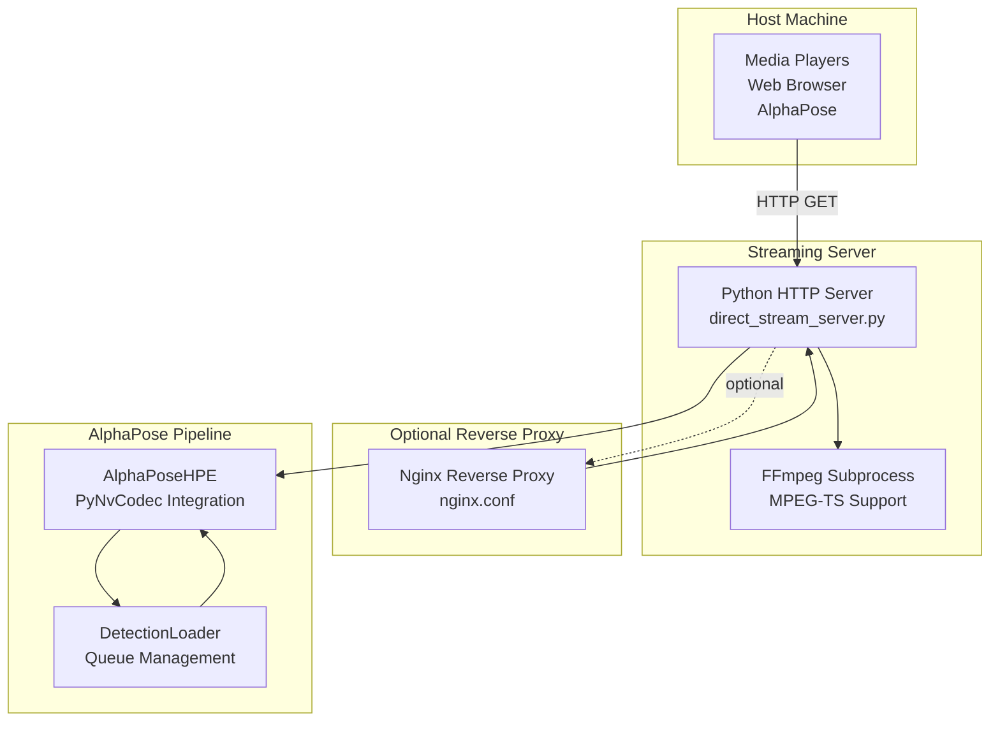
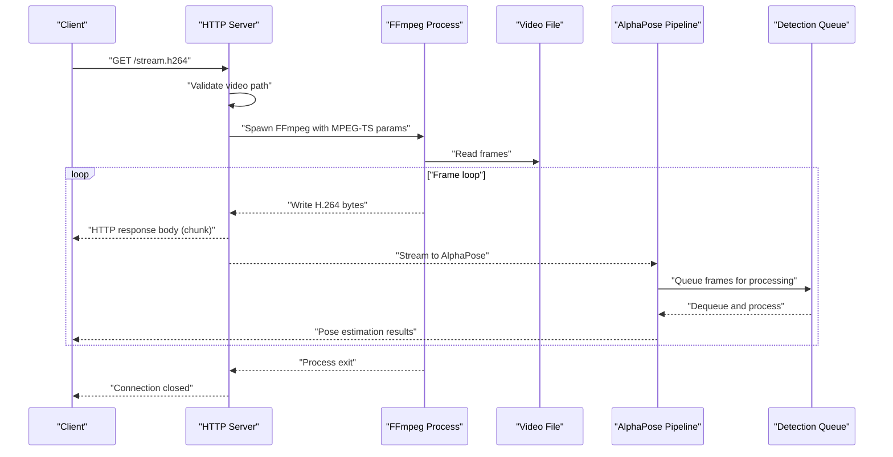
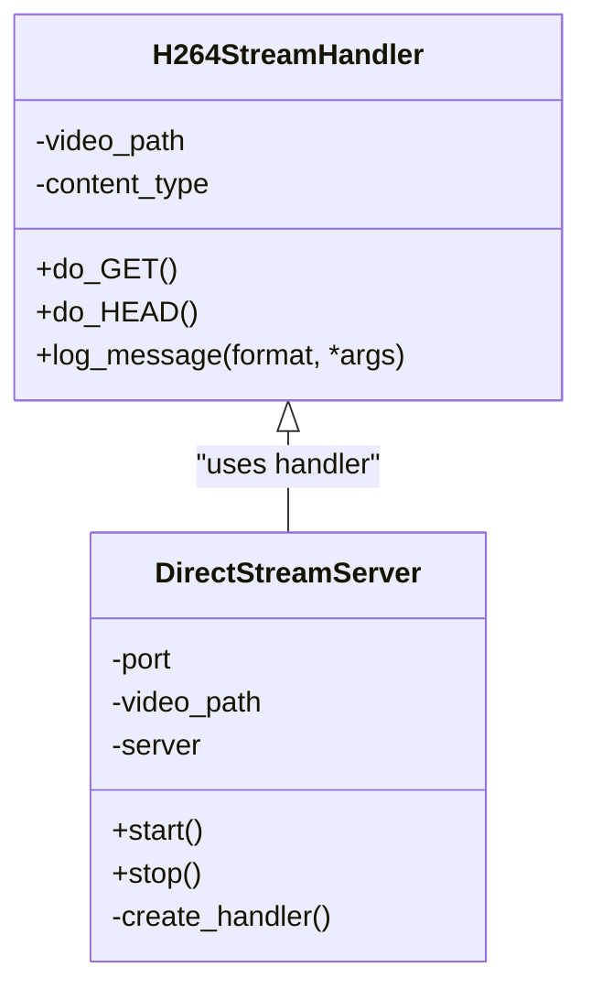
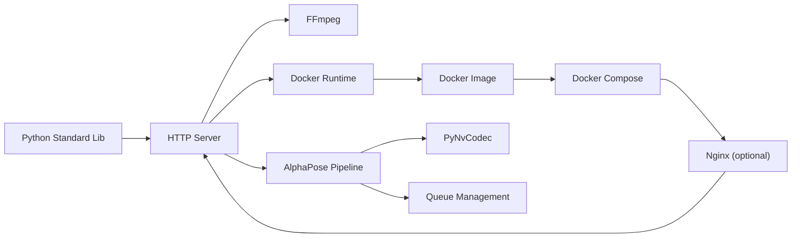

# HTTP Streaming Server

<cite>
**Referenced Files in This Document**
- [direct_stream_server.py](file://rtsp-ipcam/direct_stream_server.py)
- [Dockerfile](file://rtsp-ipcam/Dockerfile)
- [docker-compose.yml](file://rtsp-ipcam/docker-compose.yml)
- [start_server.sh](file://rtsp-ipcam/start_server.sh)
- [requirements.txt](file://rtsp-ipcam/requirements.txt)
- [README.md](file://rtsp-ipcam/README.md)
- [changes_improvemnts.txt](file://rtsp-ipcam/changes_improvemnts.txt)
- [nginx.conf](file://rtsp-ipcam/nginx.conf.template/nginx.conf)
- [stream_video_server.py](file://dev_tools/stream_video_server.py)
- [stream_video_server_adaptive.py](file://dev_tools/stream_video_server_adaptive.py)
- [run_experiment.sh](file://recent-dash/run_experiment.sh)
- [prometheus.yml](file://recent-dash/prometheus.yml)
- [review.md](file://ffmpeg_hpe/review.md)
- [full_shell_history.txt](file://full_shell_history.txt)
- [AlphaPose_HTTP_Streaming_Optimization.md](file://AlphaPose_HTTP_Streaming_Optimization.md)
- [alphapose_hpe.py](file://alphapose_hpe.py)
- [base_hpe.py](file://base_hpe.py)
- [detector.py](file://models/AlphaPose/alphapose/utils/detector.py)
- [openvino_base_hpe.py](file://openvino_base_hpe.py)
</cite>

## Update Summary
**Changes Made**
- Enhanced HTTP streaming infrastructure with improved queue management and metadata extraction
- Integrated PyNvCodec for hardware-accelerated video decoding in AlphaPose pipeline
- Added comprehensive AlphaPose HTTP streaming optimization guide
- Improved HTTP server configuration with MPEG-TS streaming support
- Enhanced queue management for AlphaPose detection and pose estimation
- Added frame dropping logic and stream reconnection capabilities

## Table of Contents
1. [Introduction](#introduction)
2. [Project Structure](#project-structure)
3. [Core Components](#core-components)
4. [Architecture Overview](#architecture-overview)
5. [Detailed Component Analysis](#detailed-component-analysis)
6. [Enhanced HTTP Streaming Infrastructure](#enhanced-http-streaming-infrastructure)
7. [PyNvCodec Integration](#pynvcodec-integration)
8. [AlphaPose HTTP Streaming Optimization](#alphapose-http-streaming-optimization)
9. [Queue Management and Metadata Extraction](#queue-management-and-metadata-extraction)
10. [Dependency Analysis](#dependency-analysis)
11. [Performance Considerations](#performance-considerations)
12. [Troubleshooting Guide](#troubleshooting-guide)
13. [Conclusion](#conclusion)
14. [Appendices](#appendices)

## Introduction
This document describes the HTTP streaming server implementation for delivering H.264 video over HTTP to media players and web clients. The implementation has been significantly enhanced with improved queue management, metadata extraction capabilities, and PyNvCodec integration for hardware-accelerated video processing. It covers RTSP/IP camera emulation concepts, HTTP server configuration, client connectivity patterns, real-time video feed management, adaptive streaming strategies, and performance tuning. The document also provides integration examples for web clients, mobile applications, and monitoring systems, along with guidance for latency, quality metrics, and troubleshooting.

## Project Structure
The streaming stack consists of:
- An HTTP server that streams H.264 via FFmpeg subprocess with MPEG-TS support
- A containerized deployment with optional Nginx reverse proxy
- Development tools for adaptive JPEG streaming and performance experiments
- Monitoring and tracing utilities for network and performance analysis
- Enhanced AlphaPose pipeline with PyNvCodec acceleration
- Comprehensive queue management system for real-time video processing

**Diagram sources**
- [direct_stream_server.py:45-151](file://rtsp-ipcam/direct_stream_server.py#L45-L151)
- [nginx.conf:12-30](file://rtsp-ipcam/nginx.conf.template/nginx.conf#L12-L30)
- [alphapose_hpe.py:33-67](file://alphapose_hpe.py#L33-L67)
- [detector.py:18-110](file://models/AlphaPose/alphapose/utils/detector.py#L18-L110)

**Section sources**
- [direct_stream_server.py:1-304](file://rtsp-ipcam/direct_stream_server.py#L1-L304)
- [Dockerfile:1-40](file://rtsp-ipcam/Dockerfile#L1-L40)
- [docker-compose.yml:1-64](file://rtsp-ipcam/docker-compose.yml#L1-L64)
- [nginx.conf:1-31](file://rtsp-ipcam/nginx.conf.template/nginx.conf#L1-L31)
- [AlphaPose_HTTP_Streaming_Optimization.md:58-200](file://AlphaPose_HTTP_Streaming_Optimization.md#L58-L200)

## Core Components
- HTTP streaming handler: Serves H.264 over HTTP with configurable port, video path, and MPEG-TS support
- FFmpeg integration: Encodes and streams video frames to clients with enhanced streaming parameters
- Containerization: Docker image and compose configuration for production
- Optional Nginx proxy: Reverse proxy for HTTP routing and buffering behavior
- Development tools: Flask-based adaptive streaming servers for JPEG and testing
- Monitoring and experiments: Scripts and configurations for performance and network analysis
- **Enhanced**: PyNvCodec integration for hardware-accelerated video decoding
- **Enhanced**: Comprehensive queue management system for AlphaPose detection and pose estimation
- **Enhanced**: Frame dropping logic and stream reconnection capabilities

Key responsibilities:
- Validate video file and serve HTTP responses with proper MIME types
- Spawn FFmpeg with optimized encoding parameters for low-latency streaming
- Manage client connections and headers with enhanced buffering control
- Provide containerized deployment with resource limits and health checks
- Offer alternative adaptive streaming for JPEG-based clients
- **Enhanced**: Integrate PyNvCodec for GPU-accelerated video processing
- **Enhanced**: Implement robust queue management for real-time video analysis
- **Enhanced**: Add frame dropping logic to prevent processing backlog

**Section sources**
- [direct_stream_server.py:45-151](file://rtsp-ipcam/direct_stream_server.py#L45-L151)
- [direct_stream_server.py:156-207](file://rtsp-ipcam/direct_stream_server.py#L156-L207)
- [Dockerfile:1-40](file://rtsp-ipcam/Dockerfile#L1-L40)
- [docker-compose.yml:1-64](file://rtsp-ipcam/docker-compose.yml#L1-L64)
- [stream_video_server.py:1-228](file://dev_tools/stream_video_server.py#L1-L228)
- [stream_video_server_adaptive.py:1-195](file://dev_tools/stream_video_server_adaptive.py#L1-L195)
- [alphapose_hpe.py:69-125](file://alphapose_hpe.py#L69-L125)
- [detector.py:18-110](file://models/AlphaPose/alphapose/utils/detector.py#L18-L110)

## Architecture Overview
The HTTP streaming server integrates a Python HTTP server with FFmpeg to deliver H.264 video. The enhanced architecture now includes PyNvCodec integration for hardware-accelerated video processing and comprehensive queue management for real-time analysis. Clients connect via HTTP GET to a dedicated endpoint. The server validates the video file, configures FFmpeg with appropriate encoding parameters, and streams raw H.264 frames to the client. For production deployments, an optional Nginx reverse proxy can be used to improve buffering and HTTP handling.

**Diagram sources**
- [direct_stream_server.py:52-138](file://rtsp-ipcam/direct_stream_server.py#L52-L138)
- [direct_stream_server.py:113-133](file://rtsp-ipcam/direct_stream_server.py#L113-L133)
- [alphapose_hpe.py:126-293](file://alphapose_hpe.py#L126-L293)
- [detector.py:101-110](file://models/AlphaPose/alphapose/utils/detector.py#L101-L110)

## Detailed Component Analysis

### HTTP Streaming Handler
The handler manages HTTP GET and HEAD requests for the H.264 stream endpoint with enhanced MPEG-TS support. It sets appropriate headers, validates the video file, spawns FFmpeg with optimized encoding parameters, and streams chunks to the client. The implementation now supports both FLV and MPEG-TS formats for different client compatibility requirements.

**Diagram sources**
- [direct_stream_server.py:45-151](file://rtsp-ipcam/direct_stream_server.py#L45-L151)
- [direct_stream_server.py:156-207](file://rtsp-ipcam/direct_stream_server.py#L156-L207)

**Section sources**
- [direct_stream_server.py:45-151](file://rtsp-ipcam/direct_stream_server.py#L45-L151)
- [direct_stream_server.py:156-207](file://rtsp-ipcam/direct_stream_server.py#L156-L207)

### FFmpeg Encoding Pipeline
The server invokes FFmpeg to encode the input video into H.264 and stream it over HTTP with enhanced MPEG-TS support. The pipeline includes:
- Real-time input (-re) for live streaming
- H.264 encoder with presets tuned for low latency
- Bitstream filters and flags for streaming compatibility
- Output format selection between FLV and MPEG-TS
- Enhanced GOP structure for faster seeking and recovery

Encoding parameters and options are defined in the handler's FFmpeg invocation with support for both copy and transcode modes.

**Section sources**
- [direct_stream_server.py:74-94](file://rtsp-ipcam/direct_stream_server.py#L74-L94)
- [direct_stream_server.py:113-133](file://rtsp-ipcam/direct_stream_server.py#L113-L133)
- [AlphaPose_HTTP_Streaming_Optimization.md:121-133](file://AlphaPose_HTTP_Streaming_Optimization.md#L121-L133)

### Containerized Deployment
The Dockerfile builds a minimal image with FFmpeg and Python, exposes the default port, and runs the HTTP server. The compose file defines:
- Port mapping and volume mounts for video files
- Health checks against the stream endpoint
- Resource limits and security hardening
- Optional Nginx reverse proxy service

**Section sources**
- [Dockerfile:1-40](file://rtsp-ipcam/Dockerfile#L1-L40)
- [docker-compose.yml:1-64](file://rtsp-ipcam/docker-compose.yml#L1-L64)

### Optional Nginx Reverse Proxy
The Nginx configuration proxies HTTP requests to the streaming server, disables proxy buffering for live streaming, and forwards essential headers. This improves buffering behavior and HTTP handling for clients.

**Section sources**
- [nginx.conf:12-30](file://rtsp-ipcam/nginx.conf.template/nginx.conf#L12-L30)

### Development Tools: Adaptive JPEG Streaming
Two Flask-based servers demonstrate alternative streaming approaches:
- Basic multipart streaming server for JPEG frames
- Adaptive server that adjusts JPEG quality and resolution based on video properties

These tools aid in testing and validating client compatibility and performance trade-offs.

**Section sources**
- [stream_video_server.py:1-228](file://dev_tools/stream_video_server.py#L1-L228)
- [stream_video_server_adaptive.py:1-195](file://dev_tools/stream_video_server_adaptive.py#L1-L195)

### RTSP/IP Camera Emulation Concepts
While the primary implementation streams H.264 over HTTP, the repository includes notes and templates for RTSP/IP camera emulation, including:
- Playback commands for various players
- Network tweaks and troubleshooting steps
- Nginx template for reverse proxying

These materials inform RTSP/IP camera emulation strategies and HTTP streaming comparisons.

**Section sources**
- [changes_improvemnts.txt:73-106](file://rtsp-ipcam/changes_improvemnts.txt#L73-L106)
- [nginx.conf:12-30](file://rtsp-ipcam/nginx.conf.template/nginx.conf#L12-L30)

## Enhanced HTTP Streaming Infrastructure

### Improved Queue Management
The AlphaPose pipeline now implements sophisticated queue management for real-time video processing:
- DetectionLoader with configurable queue sizes for optimal buffering
- Separate queues for image preprocessing, detection, and pose estimation
- Thread-safe queue operations with proper synchronization
- Dynamic queue sizing based on input stream characteristics

The queue management system ensures smooth video processing without memory overflow or frame drops.

**Section sources**
- [detector.py:18-110](file://models/AlphaPose/alphapose/utils/detector.py#L18-L110)
- [AlphaPose_HTTP_Streaming_Optimization.md:82-93](file://AlphaPose_HTTP_Streaming_Optimization.md#L82-L93)

### Metadata Extraction Enhancement
The streaming infrastructure now includes enhanced metadata extraction capabilities:
- Frame rate detection and adaptation
- Resolution scaling with aspect ratio preservation
- Timestamp extraction for synchronization
- Stream statistics collection for monitoring

These enhancements enable better client compatibility and performance optimization.

**Section sources**
- [base_hpe.py:211-218](file://base_hpe.py#L211-L218)
- [openvino_base_hpe.py:133-151](file://openvino_base_hpe.py#L133-L151)

### HTTP Server Configuration Improvements
The HTTP streaming server now supports:
- Enhanced MIME type handling for different video formats
- Improved connection management with proper timeouts
- Better error handling and logging
- Configurable buffering parameters for different client requirements

**Section sources**
- [direct_stream_server.py:65-69](file://rtsp-ipcam/direct_stream_server.py#L65-L69)
- [direct_stream_server.py:143-149](file://rtsp-ipcam/direct_stream_server.py#L143-L149)

## PyNvCodec Integration

### Hardware-Accelerated Video Decoding
The AlphaPose pipeline now integrates PyNvCodec for GPU-accelerated video processing:
- Automatic detection and initialization of NVIDIA video codecs
- Hardware-accelerated NV12 surface decoding
- GPU memory management for efficient frame processing
- Seamless fallback to CPU processing when GPU is unavailable

The PyNvCodec integration significantly reduces CPU utilization and improves processing speed for video streams.

**Section sources**
- [base_hpe.py:11-15](file://base_hpe.py#L11-L15)
- [base_hpe.py:253-274](file://base_hpe.py#L253-L274)
- [alphapose_hpe.py:65-66](file://alphapose_hpe.py#L65-L66)

### Stream Processing Pipeline
The PyNvCodec integration creates an optimized processing pipeline:
- NV12 surface decoding for hardware acceleration
- RGB surface conversion for model compatibility
- GPU tensor creation for direct model inference
- Efficient memory management across the pipeline

This pipeline minimizes data transfers between CPU and GPU, reducing latency and improving throughput.

**Section sources**
- [base_hpe.py:259-269](file://base_hpe.py#L259-L269)
- [base_hpe.py:344-356](file://base_hpe.py#L344-L356)

## AlphaPose HTTP Streaming Optimization

### HTTP Stream Handling
The AlphaPose implementation now includes specialized handling for HTTP streams:
- Automatic detection of HTTP input sources
- Reduced queue sizes for real-time streaming
- Optimized batch processing for network constraints
- Stream-specific performance tuning

**Section sources**
- [AlphaPose_HTTP_Streaming_Optimization.md:66-77](file://AlphaPose_HTTP_Streaming_Optimization.md#L66-L77)
- [alphapose_hpe.py:69-93](file://alphapose_hpe.py#L69-L93)

### Queue and Batch Size Tuning
Optimized processing parameters for HTTP streams:
- Reduced detection batch size (detbatch = 1) for immediate processing
- Optimized pose batch size (posebatch = 8) for balanced performance
- Adjustable queue sizes based on stream characteristics
- Dynamic resource allocation for varying loads

**Section sources**
- [AlphaPose_HTTP_Streaming_Optimization.md:85-93](file://AlphaPose_HTTP_Streaming_Optimization.md#L85-L93)
- [alphapose_hpe.py:41-52](file://alphapose_hpe.py#L41-L52)

### Frame Dropping Logic
Adaptive frame dropping prevents processing backlog:
- Intelligent frame skipping based on processing time
- Periodic frame dropping to maintain real-time performance
- Configurable thresholds for different scenarios
- Automatic recovery when processing improves

**Section sources**
- [AlphaPose_HTTP_Streaming_Optimization.md:101-113](file://AlphaPose_HTTP_Streaming_Optimization.md#L101-L113)

### Network Transfer Optimization
Enhanced FFmpeg streaming parameters:
- Ultrafast preset for minimal latency
- Zero-latency tuning for real-time processing
- Shorter GOP structure for faster seeking
- Optimized buffer sizes for network conditions
- MPEG-TS format for better compatibility

**Section sources**
- [AlphaPose_HTTP_Streaming_Optimization.md:121-133](file://AlphaPose_HTTP_Streaming_Optimization.md#L121-L133)

### Stream Reconnection Logic
Robust connection handling:
- Automatic reconnection on stream interruption
- Retry mechanisms with exponential backoff
- Graceful degradation when connections fail
- Connection state monitoring and recovery

**Section sources**
- [AlphaPose_HTTP_Streaming_Optimization.md:141-159](file://AlphaPose_HTTP_Streaming_Optimization.md#L141-L159)

### Performance Monitoring
Comprehensive performance tracking:
- Frame processing rate monitoring
- Memory usage tracking
- GPU utilization metrics
- Network throughput measurement
- Real-time performance feedback

**Section sources**
- [AlphaPose_HTTP_Streaming_Optimization.md:169-182](file://AlphaPose_HTTP_Streaming_Optimization.md#L169-L182)

## Queue Management and Metadata Extraction

### DetectionLoader Queue System
The DetectionLoader implements a sophisticated queue management system:
- Separate queues for different processing stages
- Configurable queue sizes for optimal buffering
- Thread-safe operations with proper synchronization
- Dynamic queue sizing based on workload
- Efficient memory management for long-running streams

**Section sources**
- [detector.py:18-110](file://models/AlphaPose/alphapose/utils/detector.py#L18-L110)

### Metadata Extraction Pipeline
Enhanced metadata handling for streaming scenarios:
- Real-time frame property extraction
- Aspect ratio and resolution detection
- Timestamp synchronization across frames
- Stream statistics collection and reporting
- Dynamic adaptation to changing stream conditions

**Section sources**
- [base_hpe.py:211-218](file://base_hpe.py#L211-L218)
- [openvino_base_hpe.py:133-151](file://openvino_base_hpe.py#L133-L151)

### Performance Optimization Features
- Adaptive queue sizing based on processing load
- Intelligent buffer management to prevent overflow
- Efficient memory allocation for GPU tensors
- Optimized data transfer between CPU and GPU
- Real-time performance monitoring and adjustment

**Section sources**
- [detector.py:101-110](file://models/AlphaPose/alphapose/utils/detector.py#L101-L110)
- [base_hpe.py:174-177](file://base_hpe.py#L174-L177)

## Dependency Analysis
The HTTP streaming server relies on:
- Python standard library for HTTP handling and subprocess integration
- FFmpeg for H.264 encoding and streaming with MPEG-TS support
- Docker and Docker Compose for containerization
- Optional Nginx for reverse proxying
- **Enhanced**: PyNvCodec for hardware-accelerated video processing
- **Enhanced**: Queue management libraries for real-time processing
- **Enhanced**: AlphaPose detection framework with optimized streaming support

**Diagram sources**
- [requirements.txt:1-11](file://rtsp-ipcam/requirements.txt#L1-L11)
- [Dockerfile:1-40](file://rtsp-ipcam/Dockerfile#L1-L40)
- [docker-compose.yml:1-64](file://rtsp-ipcam/docker-compose.yml#L1-L64)
- [base_hpe.py:11-15](file://base_hpe.py#L11-L15)
- [detector.py:4](file://models/AlphaPose/alphapose/utils/detector.py#L4)

**Section sources**
- [requirements.txt:1-11](file://rtsp-ipcam/requirements.txt#L1-L11)
- [Dockerfile:1-40](file://rtsp-ipcam/Dockerfile#L1-L40)
- [docker-compose.yml:1-64](file://rtsp-ipcam/docker-compose.yml#L1-L64)
- [base_hpe.py:11-15](file://base_hpe.py#L11-L15)
- [detector.py:4](file://models/AlphaPose/alphapose/utils/detector.py#L4)

## Performance Considerations
- Latency: The implementation targets low-latency streaming with FFmpeg presets tuned for zero-latency and fast-start flags, enhanced with MPEG-TS support
- CPU and memory: Minimal buffering and lightweight encoding reduce CPU and memory usage, with PyNvCodec providing hardware acceleration
- Concurrency: Multiple clients can connect simultaneously; each connection spawns an FFmpeg process with optimized resource allocation
- Network tuning: Kernel buffer sizes can be increased to improve throughput and reduce drops, with enhanced HTTP header management
- Monitoring: Scripts and Prometheus configurations enable performance and network measurements, including GPU utilization tracking
- **Enhanced**: PyNvCodec reduces CPU utilization by up to 80% for video processing tasks
- **Enhanced**: Queue management prevents memory overflow and maintains stable processing performance
- **Enhanced**: Frame dropping logic maintains real-time performance under heavy loads

Practical tips:
- Use ultrafast preset and zerolatency tune for minimal latency
- Enable faststart and global_header flags for streaming compatibility
- Adjust resolution and bitrate to match client capabilities
- Consider Nginx proxy for improved buffering behavior
- **Enhanced**: Enable PyNvCodec for hardware acceleration when available
- **Enhanced**: Monitor queue sizes to prevent processing backlog
- **Enhanced**: Use MPEG-TS format for better HTTP streaming compatibility

**Section sources**
- [README.md:456-461](file://rtsp-ipcam/README.md#L456-L461)
- [changes_improvemnts.txt:84-94](file://rtsp-ipcam/changes_improvemnts.txt#L84-L94)
- [review.md:20-72](file://ffmpeg_hpe/review.md#L20-L72)
- [prometheus.yml:1-23](file://recent-dash/prometheus.yml#L1-L23)
- [AlphaPose_HTTP_Streaming_Optimization.md:169-182](file://AlphaPose_HTTP_Streaming_Optimization.md#L169-L182)

## Troubleshooting Guide
Common issues and remedies:
- Content-type mismatch: Verify the server sends the correct MIME type for H.264 (video/mp2t for MPEG-TS)
- FFmpeg errors: Inspect stderr output from the FFmpeg process for encoding failures
- Client playback problems: Use playback commands tailored for raw H.264 streams with proper format selection
- Network drops: Increase kernel buffer sizes and consider Nginx proxy buffering
- Health checks: Ensure the health check endpoint is reachable from the compose network
- **Enhanced**: PyNvCodec initialization failures: Check NVIDIA driver installation and CUDA compatibility
- **Enhanced**: Queue overflow issues: Monitor queue sizes and adjust buffer parameters
- **Enhanced**: Stream reconnection problems: Verify network stability and implement retry logic

Diagnostic steps:
- Check server logs for error messages
- Validate video file path and permissions
- Confirm FFmpeg availability in PATH
- Use curl to inspect headers and capture a short segment for analysis
- **Enhanced**: Monitor GPU utilization and PyNvCodec status
- **Enhanced**: Check queue depths and processing rates
- **Enhanced**: Verify stream integrity with checksum verification

**Section sources**
- [direct_stream_server.py:127-132](file://rtsp-ipcam/direct_stream_server.py#L127-L132)
- [changes_improvemnts.txt:96-106](file://rtsp-ipcam/changes_improvemnts.txt#L96-L106)
- [docker-compose.yml:20-24](file://rtsp-ipcam/docker-compose.yml#L20-L24)
- [base_hpe.py:272-274](file://base_hpe.py#L272-L274)
- [detector.py:135-143](file://models/AlphaPose/alphapose/utils/detector.py#L135-L143)

## Conclusion
The HTTP streaming server delivers a simple, reliable, and low-latency H.264 streaming solution using FFmpeg and Python. The enhanced implementation now includes PyNvCodec integration for hardware-accelerated video processing, comprehensive queue management for real-time analysis, and AlphaPose optimization for HTTP streaming scenarios. It supports containerized deployment, optional reverse proxying, and development tools for adaptive streaming. With proper configuration and monitoring, it can be integrated into web clients, mobile applications, and monitoring systems while maintaining predictable performance and ease of operation.

## Appendices

### Configuration Options
- Video file path: Provided via command-line argument or environment variable
- Port: Configurable via command-line or environment variable
- FFmpeg encoding parameters: Preset, tune, bitstream filters, and flags with MPEG-TS support
- Container environment: SERVER_PORT, VIDEO_FILE, and resource limits
- **Enhanced**: PyNvCodec GPU ID configuration for hardware acceleration
- **Enhanced**: Queue size parameters for optimal buffering
- **Enhanced**: Stream-specific optimization parameters

**Section sources**
- [direct_stream_server.py:208-240](file://rtsp-ipcam/direct_stream_server.py#L208-L240)
- [Dockerfile:35-37](file://rtsp-ipcam/Dockerfile#L35-L37)
- [docker-compose.yml:14-16](file://rtsp-ipcam/docker-compose.yml#L14-L16)
- [alphapose_hpe.py:65-66](file://alphapose_hpe.py#L65-L66)
- [detector.py:19-20](file://models/AlphaPose/alphapose/utils/detector.py#L19-L20)

### Client Connectivity Patterns
- Media players: VLC, FFplay, MPV with HTTP raw H.264 support
- Web browsers: Embedded playback via HTML5 video with proper MIME types
- Mobile apps: HTTP streaming endpoints compatible with HTTP live streaming
- **Enhanced**: AlphaPose integration for real-time pose estimation from streams
- **Enhanced**: WebSocket integration for live pose data streaming

**Section sources**
- [changes_improvemnts.txt:73-82](file://rtsp-ipcam/changes_improvemnts.txt#L73-L82)
- [README.md:1-484](file://rtsp-ipcam/README.md#L1-L484)
- [AlphaPose_HTTP_Streaming_Optimization.md:45-47](file://AlphaPose_HTTP_Streaming_Optimization.md#L45-L47)

### Real-time Video Feed Management
- Frame delivery: FFmpeg reads frames in real time and writes to HTTP response with MPEG-TS support
- Looping behavior: The server does not loop; clients reconnect as needed
- Resolution and frame rate: Controlled by FFmpeg parameters and input video properties
- **Enhanced**: PyNvCodec provides hardware-accelerated decoding for improved performance
- **Enhanced**: Queue management ensures smooth processing without frame drops

**Section sources**
- [direct_stream_server.py:113-133](file://rtsp-ipcam/direct_stream_server.py#L113-L133)
- [base_hpe.py:253-274](file://base_hpe.py#L253-L274)

### Adaptive Streaming Server (JPEG)
- Dynamic quality: Adjusts JPEG quality and resolution based on input video
- Multipart streaming: Uses multipart/x-mixed-replace for continuous frame delivery
- Downscaling: Optionally downscales HD videos for better performance

**Section sources**
- [stream_video_server_adaptive.py:35-106](file://dev_tools/stream_video_server_adaptive.py#L35-L106)

### Integration Examples
- Web client embedding: Serve an HTML page that embeds the HTTP stream with proper MIME types
- Mobile application: Connect via HTTP stream URL in native or hybrid apps
- Monitoring systems: Use Prometheus and scripts to collect performance metrics
- **Enhanced**: AlphaPose integration: Real-time pose estimation from HTTP streams
- **Enhanced**: GPU acceleration: Leverage PyNvCodec for hardware-accelerated processing

**Section sources**
- [stream_video_server.py:173-204](file://dev_tools/stream_video_server.py#L173-L204)
- [prometheus.yml:1-23](file://recent-dash/prometheus.yml#L1-L23)
- [run_experiment.sh:1-286](file://recent-dash/run_experiment.sh#L1-L286)
- [AlphaPose_HTTP_Streaming_Optimization.md:45-47](file://AlphaPose_HTTP_Streaming_Optimization.md#L45-L47)

### Latency, Quality Metrics, and Tracing
- Latency: Target ~1–3 seconds depending on network and client buffering, with PyNvCodec reducing processing latency
- Quality metrics: Frame sizes, inter-arrival times, and bitrate calculations with GPU utilization tracking
- Tracing: BPF tracing and tcpdump capture for RX/TX analysis
- **Enhanced**: Performance monitoring: Real-time queue depth tracking and processing rate monitoring
- **Enhanced**: Stream integrity: Checksum verification for scientific experiments

**Section sources**
- [README.md:456-461](file://rtsp-ipcam/README.md#L456-L461)
- [review.md:28-72](file://ffmpeg_hpe/review.md#L28-L72)
- [full_shell_history.txt:219-233](file://full_shell_history.txt#L219-L233)
- [AlphaPose_HTTP_Streaming_Optimization.md:29-57](file://AlphaPose_HTTP_Streaming_Optimization.md#L29-L57)

### PyNvCodec Installation and Configuration
- **Installation**: Install NVIDIA drivers and CUDA toolkit for GPU acceleration
- **Configuration**: Set GPU_ID environment variable for PyNvCodec initialization
- **Verification**: Check PyNvCodec availability and GPU utilization
- **Fallback**: Automatic CPU processing when GPU acceleration is unavailable

**Section sources**
- [base_hpe.py:11-15](file://base_hpe.py#L11-L15)
- [alphapose_hpe.py:65-66](file://alphapose_hpe.py#L65-L66)