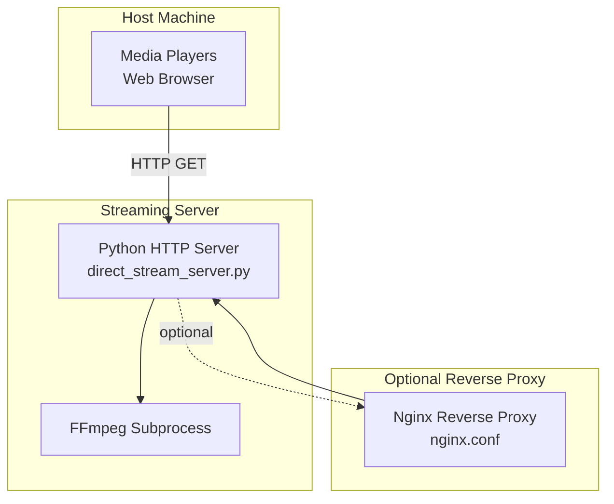
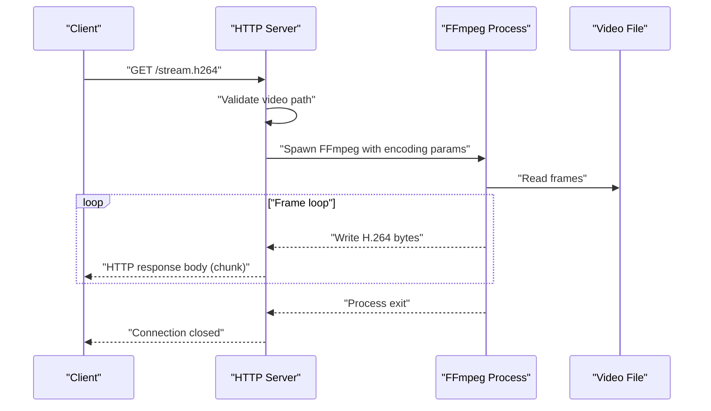
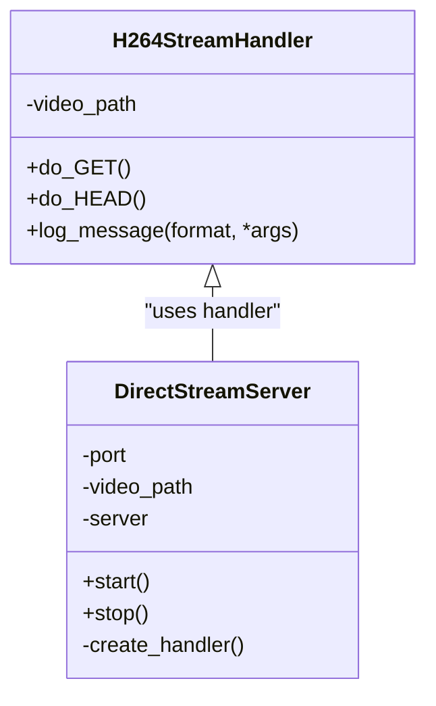
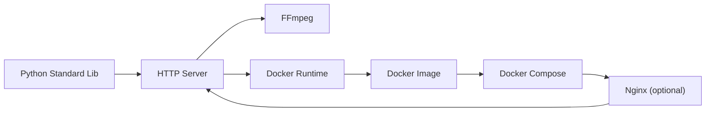

# HTTP Streaming Server

<cite>
**Referenced Files in This Document**
- [direct_stream_server.py](file://rtsp-ipcam/direct_stream_server.py)
- [Dockerfile](file://rtsp-ipcam/Dockerfile)
- [docker-compose.yml](file://rtsp-ipcam/docker-compose.yml)
- [start_server.sh](file://rtsp-ipcam/start_server.sh)
- [requirements.txt](file://rtsp-ipcam/requirements.txt)
- [README.md](file://rtsp-ipcam/README.md)
- [changes_improvemnts.txt](file://rtsp-ipcam/changes_improvemnts.txt)
- [nginx.conf](file://rtsp-ipcam/nginx.conf.template/nginx.conf)
- [stream_video_server.py](file://dev_tools/stream_video_server.py)
- [stream_video_server_adaptive.py](file://dev_tools/stream_video_server_adaptive.py)
- [run_experiment.sh](file://recent-dash/run_experiment.sh)
- [prometheus.yml](file://recent-dash/prometheus.yml)
- [review.md](file://ffmpeg_hpe/review.md)
- [full_shell_history.txt](file://full_shell_history.txt)
</cite>

## Table of Contents
1. [Introduction](#introduction)
2. [Project Structure](#project-structure)
3. [Core Components](#core-components)
4. [Architecture Overview](#architecture-overview)
5. [Detailed Component Analysis](#detailed-component-analysis)
6. [Dependency Analysis](#dependency-analysis)
7. [Performance Considerations](#performance-considerations)
8. [Troubleshooting Guide](#troubleshooting-guide)
9. [Conclusion](#conclusion)
10. [Appendices](#appendices)

## Introduction
This document describes the HTTP streaming server implementation for delivering H.264 video over HTTP to media players and web clients. It covers RTSP/IP camera emulation concepts, HTTP server configuration, client connectivity patterns, real-time video feed management, adaptive streaming strategies, and performance tuning. It also provides integration examples for web clients, mobile applications, and monitoring systems, along with guidance for latency, quality metrics, and troubleshooting.

## Project Structure
The streaming stack consists of:
- An HTTP server that streams H.264 via FFmpeg subprocess
- A containerized deployment with optional Nginx reverse proxy
- Development tools for adaptive JPEG streaming and performance experiments
- Monitoring and tracing utilities for network and performance analysis

**Diagram sources**
- [direct_stream_server.py:45-151](file://rtsp-ipcam/direct_stream_server.py#L45-L151)
- [nginx.conf:12-30](file://rtsp-ipcam/nginx.conf.template/nginx.conf#L12-L30)

**Section sources**
- [direct_stream_server.py:1-304](file://rtsp-ipcam/direct_stream_server.py#L1-L304)
- [Dockerfile:1-40](file://rtsp-ipcam/Dockerfile#L1-L40)
- [docker-compose.yml:1-64](file://rtsp-ipcam/docker-compose.yml#L1-L64)
- [nginx.conf:1-31](file://rtsp-ipcam/nginx.conf.template/nginx.conf#L1-L31)

## Core Components
- HTTP streaming handler: Serves H.264 over HTTP with configurable port and video path
- FFmpeg integration: Encodes and streams video frames to clients
- Containerization: Docker image and compose configuration for production
- Optional Nginx proxy: Reverse proxy for HTTP routing and buffering behavior
- Development tools: Flask-based adaptive streaming servers for JPEG and testing
- Monitoring and experiments: Scripts and configurations for performance and network analysis

Key responsibilities:
- Validate video file and serve HTTP responses
- Spawn FFmpeg to encode and stream H.264 frames
- Manage client connections and headers
- Provide containerized deployment with resource limits and health checks
- Offer alternative adaptive streaming for JPEG-based clients

**Section sources**
- [direct_stream_server.py:45-151](file://rtsp-ipcam/direct_stream_server.py#L45-L151)
- [direct_stream_server.py:156-207](file://rtsp-ipcam/direct_stream_server.py#L156-L207)
- [Dockerfile:1-40](file://rtsp-ipcam/Dockerfile#L1-L40)
- [docker-compose.yml:1-64](file://rtsp-ipcam/docker-compose.yml#L1-L64)
- [stream_video_server.py:1-228](file://dev_tools/stream_video_server.py#L1-L228)
- [stream_video_server_adaptive.py:1-195](file://dev_tools/stream_video_server_adaptive.py#L1-L195)

## Architecture Overview
The HTTP streaming server integrates a Python HTTP server with FFmpeg to deliver H.264 video. Clients connect via HTTP GET to a dedicated endpoint. The server validates the video file, configures FFmpeg with appropriate encoding parameters, and streams raw H.264 frames to the client. For production deployments, an optional Nginx reverse proxy can be used to improve buffering and HTTP handling.

**Diagram sources**
- [direct_stream_server.py:52-138](file://rtsp-ipcam/direct_stream_server.py#L52-L138)
- [direct_stream_server.py:113-133](file://rtsp-ipcam/direct_stream_server.py#L113-L133)

## Detailed Component Analysis

### HTTP Streaming Handler
The handler manages HTTP GET and HEAD requests for the H.264 stream endpoint. It sets appropriate headers, validates the video file, spawns FFmpeg with encoding parameters, and streams chunks to the client. It supports graceful shutdown and logging.

**Diagram sources**
- [direct_stream_server.py:45-151](file://rtsp-ipcam/direct_stream_server.py#L45-L151)
- [direct_stream_server.py:156-207](file://rtsp-ipcam/direct_stream_server.py#L156-L207)

**Section sources**
- [direct_stream_server.py:45-151](file://rtsp-ipcam/direct_stream_server.py#L45-L151)
- [direct_stream_server.py:156-207](file://rtsp-ipcam/direct_stream_server.py#L156-L207)

### FFmpeg Encoding Pipeline
The server invokes FFmpeg to encode the input video into H.264 and stream it over HTTP. The pipeline includes:
- Real-time input (-re)
- H.264 encoder with presets tuned for low latency
- Bitstream filters and flags for streaming compatibility
- Output format suitable for HTTP streaming

Encoding parameters and options are defined in the handler’s FFmpeg invocation.

**Section sources**
- [direct_stream_server.py:74-94](file://rtsp-ipcam/direct_stream_server.py#L74-L94)
- [changes_improvemnts.txt:44-71](file://rtsp-ipcam/changes_improvemnts.txt#L44-L71)

### Containerized Deployment
The Dockerfile builds a minimal image with FFmpeg and Python, exposes the default port, and runs the HTTP server. The compose file defines:
- Port mapping and volume mounts for video files
- Health checks against the stream endpoint
- Resource limits and security hardening
- Optional Nginx reverse proxy service

**Section sources**
- [Dockerfile:1-40](file://rtsp-ipcam/Dockerfile#L1-L40)
- [docker-compose.yml:1-64](file://rtsp-ipcam/docker-compose.yml#L1-L64)

### Optional Nginx Reverse Proxy
The Nginx configuration proxies HTTP requests to the streaming server, disables proxy buffering for live streaming, and forwards essential headers. This improves buffering behavior and HTTP handling for clients.

**Section sources**
- [nginx.conf:12-30](file://rtsp-ipcam/nginx.conf.template/nginx.conf#L12-L30)

### Development Tools: Adaptive JPEG Streaming
Two Flask-based servers demonstrate alternative streaming approaches:
- Basic multipart streaming server for JPEG frames
- Adaptive server that adjusts JPEG quality and resolution based on video properties

These tools aid in testing and validating client compatibility and performance trade-offs.

**Section sources**
- [stream_video_server.py:1-228](file://dev_tools/stream_video_server.py#L1-L228)
- [stream_video_server_adaptive.py:1-195](file://dev_tools/stream_video_server_adaptive.py#L1-L195)

### RTSP/IP Camera Emulation Concepts
While the primary implementation streams H.264 over HTTP, the repository includes notes and templates for RTSP/IP camera emulation, including:
- Playback commands for various players
- Network tweaks and troubleshooting steps
- Nginx template for reverse proxying

These materials inform RTSP/IP camera emulation strategies and HTTP streaming comparisons.

**Section sources**
- [changes_improvemnts.txt:73-106](file://rtsp-ipcam/changes_improvemnts.txt#L73-L106)
- [nginx.conf:12-30](file://rtsp-ipcam/nginx.conf.template/nginx.conf#L12-L30)

## Dependency Analysis
The HTTP streaming server relies on:
- Python standard library for HTTP handling and subprocess integration
- FFmpeg for H.264 encoding and streaming
- Docker and Docker Compose for containerization
- Optional Nginx for reverse proxying

**Diagram sources**
- [requirements.txt:1-11](file://rtsp-ipcam/requirements.txt#L1-L11)
- [Dockerfile:1-40](file://rtsp-ipcam/Dockerfile#L1-L40)
- [docker-compose.yml:1-64](file://rtsp-ipcam/docker-compose.yml#L1-L64)

**Section sources**
- [requirements.txt:1-11](file://rtsp-ipcam/requirements.txt#L1-L11)
- [Dockerfile:1-40](file://rtsp-ipcam/Dockerfile#L1-L40)
- [docker-compose.yml:1-64](file://rtsp-ipcam/docker-compose.yml#L1-L64)

## Performance Considerations
- Latency: The implementation targets low-latency streaming with FFmpeg presets tuned for zero-latency and fast-start flags.
- CPU and memory: Minimal buffering and lightweight encoding reduce CPU and memory usage.
- Concurrency: Multiple clients can connect simultaneously; each connection spawns an FFmpeg process.
- Network tuning: Kernel buffer sizes can be increased to improve throughput and reduce drops.
- Monitoring: Scripts and Prometheus configurations enable performance and network measurements.

Practical tips:
- Use ultrafast preset and zerolatency tune for minimal latency
- Enable faststart and global_header flags for streaming compatibility
- Adjust resolution and bitrate to match client capabilities
- Consider Nginx proxy for improved buffering behavior

**Section sources**
- [README.md:456-461](file://rtsp-ipcam/README.md#L456-L461)
- [changes_improvemnts.txt:84-94](file://rtsp-ipcam/changes_improvemnts.txt#L84-L94)
- [review.md:20-72](file://ffmpeg_hpe/review.md#L20-L72)
- [prometheus.yml:1-23](file://recent-dash/prometheus.yml#L1-L23)

## Troubleshooting Guide
Common issues and remedies:
- Content-type mismatch: Verify the server sends the correct MIME type for H.264
- FFmpeg errors: Inspect stderr output from the FFmpeg process for encoding failures
- Client playback problems: Use playback commands tailored for raw H.264 streams
- Network drops: Increase kernel buffer sizes and consider Nginx proxy buffering
- Health checks: Ensure the health check endpoint is reachable from the compose network

Diagnostic steps:
- Check server logs for error messages
- Validate video file path and permissions
- Confirm FFmpeg availability in PATH
- Use curl to inspect headers and capture a short segment for analysis

**Section sources**
- [direct_stream_server.py:127-132](file://rtsp-ipcam/direct_stream_server.py#L127-L132)
- [changes_improvemnts.txt:96-106](file://rtsp-ipcam/changes_improvemnts.txt#L96-L106)
- [docker-compose.yml:20-24](file://rtsp-ipcam/docker-compose.yml#L20-L24)

## Conclusion
The HTTP streaming server delivers a simple, reliable, and low-latency H.264 streaming solution using FFmpeg and Python. It supports containerized deployment, optional reverse proxying, and development tools for adaptive streaming. With proper configuration and monitoring, it can be integrated into web clients, mobile applications, and monitoring systems while maintaining predictable performance and ease of operation.

## Appendices

### Configuration Options
- Video file path: Provided via command-line argument or environment variable
- Port: Configurable via command-line or environment variable
- FFmpeg encoding parameters: Preset, tune, bitstream filters, and flags
- Container environment: SERVER_PORT, VIDEO_FILE, and resource limits

**Section sources**
- [direct_stream_server.py:208-240](file://rtsp-ipcam/direct_stream_server.py#L208-L240)
- [Dockerfile:35-37](file://rtsp-ipcam/Dockerfile#L35-L37)
- [docker-compose.yml:14-16](file://rtsp-ipcam/docker-compose.yml#L14-L16)

### Client Connectivity Patterns
- Media players: VLC, FFplay, MPV with HTTP raw H.264 support
- Web browsers: Embedded playback via HTML5 video
- Mobile apps: HTTP streaming endpoints compatible with HTTP live streaming

**Section sources**
- [changes_improvemnts.txt:73-82](file://rtsp-ipcam/changes_improvemnts.txt#L73-L82)
- [README.md:1-484](file://rtsp-ipcam/README.md#L1-L484)

### Real-time Video Feed Management
- Frame delivery: FFmpeg reads frames in real time and writes to HTTP response
- Looping behavior: The server does not loop; clients reconnect as needed
- Resolution and frame rate: Controlled by FFmpeg parameters and input video properties

**Section sources**
- [direct_stream_server.py:113-133](file://rtsp-ipcam/direct_stream_server.py#L113-L133)

### Adaptive Streaming Server (JPEG)
- Dynamic quality: Adjusts JPEG quality and resolution based on input video
- Multipart streaming: Uses multipart/x-mixed-replace for continuous frame delivery
- Downscaling: Optionally downscales HD videos for better performance

**Section sources**
- [stream_video_server_adaptive.py:35-106](file://dev_tools/stream_video_server_adaptive.py#L35-L106)

### Integration Examples
- Web client embedding: Serve an HTML page that embeds the HTTP stream
- Mobile application: Connect via HTTP stream URL in native or hybrid apps
- Monitoring systems: Use Prometheus and scripts to collect performance metrics

**Section sources**
- [stream_video_server.py:173-204](file://dev_tools/stream_video_server.py#L173-L204)
- [prometheus.yml:1-23](file://recent-dash/prometheus.yml#L1-L23)
- [run_experiment.sh:1-286](file://recent-dash/run_experiment.sh#L1-L286)

### Latency, Quality Metrics, and Tracing
- Latency: Target ~1–3 seconds depending on network and client buffering
- Quality metrics: Frame sizes, inter-arrival times, and bitrate calculations
- Tracing: BPF tracing and tcpdump capture for RX/TX analysis

**Section sources**
- [README.md:456-461](file://rtsp-ipcam/README.md#L456-L461)
- [review.md:28-72](file://ffmpeg_hpe/review.md#L28-L72)
- [full_shell_history.txt:219-233](file://full_shell_history.txt#L219-L233)