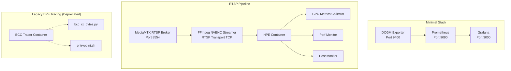
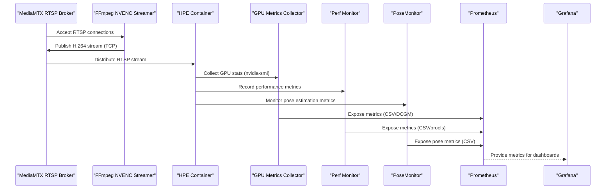
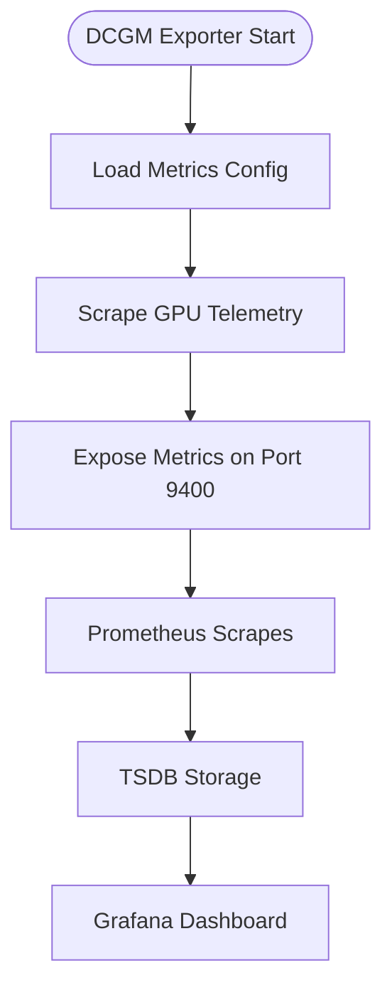
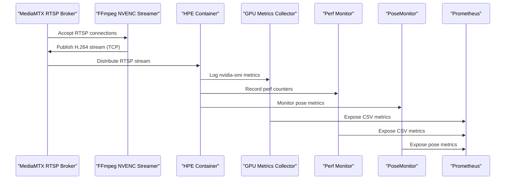
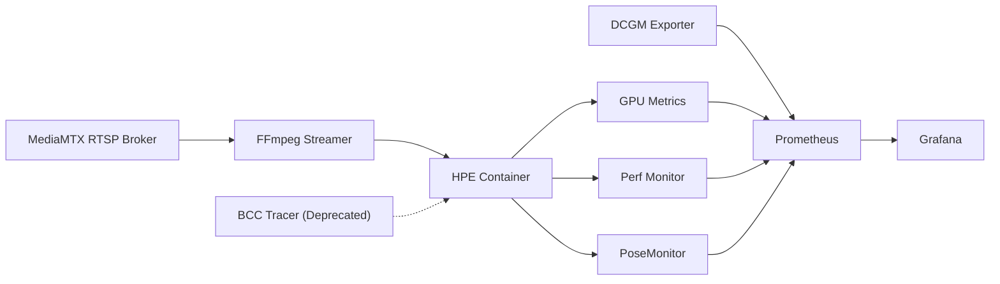

# Monitoring and Observability Stack

<cite>
**Referenced Files in This Document**
- [docker-compose.yml](file://docker-compose.yml)
- [docker-compose.rtsp.yml](file://docker-compose.rtsp.yml)
- [docker-compose.yaml](file://ffmpeg_hpe/docker-compose.yaml)
- [run_experiment.sh](file://ffmpeg_hpe/run_experiment.sh)
- [run_experiment_bcc.sh](file://ffmpeg_hpe/run_experiment_bcc.sh)
- [prometheus.yml](file://prometheus.yml)
- [pose_monitor.py](file://pose_monitor.py)
- [Dockerfile.bcc](file://ffmpeg_hpe/bpftrace-tracer/Dockerfile.bcc)
- [bcc_rx_bytes.py](file://ffmpeg_hpe/bpftrace-tracer/bcc_rx_bytes.py)
- [entrypoint.sh](file://ffmpeg_hpe/bpftrace-tracer/entrypoint.sh)
- [Report on RX TX traffic discrepancy.md](file://Report on RX TX traffic discrepancy.md)
</cite>

## Update Summary
**Changes Made**
- Updated to reflect the complete replacement of BPF tracing system with RTSP-based monitoring
- Removed deprecated BPF tracing components and documentation
- Updated architecture diagrams to show MediaMTX RTSP pipeline
- Revised monitoring configuration to use RTSP broker instead of HTTP streaming
- Updated troubleshooting guides to reflect new RTSP-based monitoring approach

## Table of Contents
1. [Introduction](#introduction)
2. [Project Structure](#project-structure)
3. [Core Components](#core-components)
4. [Architecture Overview](#architecture-overview)
5. [Detailed Component Analysis](#detailed-component-analysis)
6. [RTSP-Based Monitoring Implementation](#rtsp-based-monitoring-implementation)
7. [PoseMonitor Integration](#posemonitor-integration)
8. [Dependency Analysis](#dependency-analysis)
9. [Performance Considerations](#performance-considerations)
10. [Troubleshooting Guide](#troubleshooting-guide)
11. [Conclusion](#conclusion)

## Introduction
This document describes the monitoring and observability stack implemented in the repository. It covers Prometheus metrics collection configuration, Grafana dashboard setup, and DCGM exporter integration for GPU monitoring. It also explains time-series data collection, metric definitions, alerting mechanisms, service discovery, data retention policies, and performance metrics collection. Guidance is provided for configuring custom metrics, creating dashboards, setting up alert rules, and integrating Prometheus, Grafana, and the DCGM exporter for comprehensive system monitoring. The stack has been enhanced with RTSP-based monitoring using MediaMTX for improved reliability and comprehensive system monitoring and performance analysis.

## Project Structure
The monitoring stack spans multiple Docker Compose configurations and supporting scripts:
- Minimal Prometheus stack with DCGM exporter and Grafana
- Enhanced infrastructure stack with Coroot, ClickHouse, and Prometheus
- RTSP-based Human Pose Estimation pipeline with MediaMTX broker, GPU metrics, performance monitoring, and PoseMonitor for comprehensive system observability
- Utility containers for performance monitoring and RTSP stream analysis
- PoseMonitor integration for pose estimation metrics collection

**Diagram sources**
- [docker-compose.yml:4-30](file://docker-compose.yml#L4-L30)
- [docker-compose.rtsp.yml:2-37](file://docker-compose.rtsp.yml#L2-37)
- [docker-compose.yaml:1-190](file://ffmpeg_hpe/docker-compose.yaml#L1-L190)

**Section sources**
- [docker-compose.yml:1-30](file://docker-compose.yml#L1-L30)
- [docker-compose.rtsp.yml:1-37](file://docker-compose.rtsp.yml#L1-L37)
- [docker-compose.yaml:1-190](file://ffmpeg_hpe/docker-compose.yaml#L1-L190)

## Core Components
- DCGM Exporter: Exposes GPU metrics via Prometheus endpoint at port 9400.
- Prometheus: Scrapes exporters and stores time-series data with configurable intervals and retention.
- Grafana: Visualizes metrics from Prometheus with pre-configured dashboards.
- MediaMTX RTSP Broker: Provides reliable RTSP streaming with configurable transport protocols.
- FFmpeg NVENC Streamer: Produces H.264 video streams using NVIDIA NVENC encoding.
- HPE Container: Performs pose estimation with configurable methods and devices.
- GPU Metrics Collector: Logs nvidia-smi telemetry for offline analysis.
- Perf Monitor: Captures CPU and process metrics using Linux tools.
- PoseMonitor: Collects pose estimation performance metrics with configurable windowing.
- Legacy BPF Tracer: Deprecated component replaced by RTSP-based monitoring.

Key configuration highlights:
- Scraping interval: 500 ms for DCGM exporter and node/cluster agents.
- RTSP transport: TCP-based streaming for reliable packet delivery.
- GPU metrics CSV logging via nvidia-smi for offline analysis.
- PoseMonitor with configurable window size for performance metrics collection.
- RTSP broker with configurable source on demand and HLS support.

**Section sources**
- [prometheus.yml:1-8](file://prometheus.yml#L1-L8)
- [docker-compose.yml:4-30](file://docker-compose.yml#L4-L30)
- [docker-compose.rtsp.yml:10-17](file://docker-compose.rtsp.yml#L10-L17)
- [docker-compose.yaml:47-58](file://ffmpeg_hpe/docker-compose.yaml#L47-L58)
- [pose_monitor.py:1-170](file://pose_monitor.py#L1-L170)

## Architecture Overview
The monitoring architecture integrates Prometheus with exporters and Grafana for visualization. The RTSP-based pipeline replaces the legacy BPF tracing system with MediaMTX for improved reliability. The FFmpeg HPE pipeline augments the stack with GPU metrics, performance counters, and PoseMonitor for comprehensive end-to-end observability. RTSP-based monitoring provides better packet delivery guarantees compared to the previous BPF tracing approach.

**Diagram sources**
- [docker-compose.rtsp.yml:2-37](file://docker-compose.rtsp.yml#L2-37)
- [docker-compose.yaml:26-108](file://ffmpeg_hpe/docker-compose.yaml#L26-L108)
- [run_nvidia_dcgm.sh:1-29](file://Measure_gpu_dcgm/run_nvidia_dcgm.sh#L1-L29)
- [pose_monitor.py:1-170](file://pose_monitor.py#L1-L170)

## Detailed Component Analysis

### Prometheus Metrics Collection Configuration
- Job definition: DCGM exporter job scrapes target at dcgm-exporter:9400 with 500 ms interval.
- Global scrape interval: 500 ms; evaluation interval: 500 ms; scrape timeout: 200 ms.
- Additional jobs in the enhanced stack: node-agent, cluster-agent, and coroot.

Metric ingestion flow:
- DCGM exporter exposes GPU metrics on port 9400.
- Prometheus scrapes at configured intervals and persists time-series data.

Retention and storage:
- Enhanced stack configures Prometheus TSDB retention to 15 days and WAL compression.

**Section sources**
- [prometheus.yml:1-8](file://prometheus.yml#L1-L8)
- [docker-compose.yml:14-22](file://docker-compose.yml#L14-L22)

### Grafana Dashboard Setup
- Grafana service is exposed on port 3000 and depends on Prometheus.
- Dashboards can be created to visualize GPU utilization, power draw, temperature, throughput metrics, and pose estimation performance from Prometheus.

Best practices:
- Use consistent label naming and metric naming conventions.
- Group related panels by subsystem (CPU, GPU, Memory, Network, Pose).
- Enable templating for dynamic selection of hosts, GPUs, and experiments.

**Section sources**
- [docker-compose.yml:24-30](file://docker-compose.yml#L24-L30)

### DCGM Exporter Integration for GPU Monitoring
- DCGM exporter runs as a privileged container with SYS_ADMIN capability and binds GPU devices.
- Command-line arguments configure scrape frequency and metrics file.
- Prometheus job targets dcgm-exporter:9400.

Metrics collected:
- GPU utilization, memory utilization, temperature, power draw, and P-state.

**Diagram sources**
- [docker-compose.yml:4-12](file://docker-compose.yml#L4-L12)
- [prometheus.yml:5-8](file://prometheus.yml#L5-L8)

**Section sources**
- [docker-compose.yml:4-12](file://docker-compose.yml#L4-L12)
- [prometheus.yml:5-8](file://prometheus.yml#L5-L8)

### RTSP-Based Streaming Pipeline
The RTSP-based monitoring system uses MediaMTX as the streaming broker with the following components:

**MediaMTX RTSP Broker**
- Containerized RTSP server with configurable transport protocols
- Supports RTSP over TCP for reliable packet delivery
- Optional HLS streaming for debugging and analysis
- Configurable source on-demand for flexible stream management

**FFmpeg NVENC Streamer**
- Produces H.264 video streams using NVIDIA NVENC encoding
- Loops video files indefinitely for repeatable experiments
- Forces RTSP transport over TCP to ensure compatibility with monitoring
- Configurable encoding parameters for low-latency streaming

**HPE Container Integration**
- Consumes RTSP streams with OpenCV's FFmpeg backend
- Forces TCP transport to maintain monitoring compatibility
- Supports multiple pose estimation methods with GPU acceleration
- Generates comprehensive performance metrics

**Section sources**
- [docker-compose.rtsp.yml:2-37](file://docker-compose.rtsp.yml#L2-37)
- [docker-compose.yaml:26-108](file://ffmpeg_hpe/docker-compose.yaml#L26-L108)

### GPU Metrics Logging via nvidia-smi
- Dedicated GPU metrics collector writes CSV-formatted telemetry to a mounted volume.
- Header includes timestamp, P-state, power draw, GPU temperature, GPU/memory utilization, and memory totals.
- Logging loop runs every 500 ms and stops on user input.

Use cases:
- Offline analysis and correlation with inference performance.
- Debugging thermal throttling and memory pressure.

**Section sources**
- [run_nvidia_dcgm.sh:1-29](file://Measure_gpu_dcgm/run_nvidia_dcgm.sh#L1-L29)
- [Dockerfile.gpu_metrics:1-12](file://Measure_gpu_dcgm/Dockerfile.gpu_metrics#L1-L12)

### RTSP-Based HPE Pipeline Observability
- MediaMTX RTSP broker manages reliable stream distribution.
- FFmpeg NVENC streamer produces H.264 streams with configurable transport.
- HPE container consumes RTSP streams with GPU acceleration.
- GPU metrics collector logs nvidia-smi metrics during the experiment.
- Perf monitor captures CPU and process metrics using Linux tools.
- PoseMonitor collects pose estimation performance metrics with configurable windowing.

**Diagram sources**
- [docker-compose.rtsp.yml:2-37](file://docker-compose.rtsp.yml#L2-37)
- [docker-compose.yaml:26-108](file://ffmpeg_hpe/docker-compose.yaml#L26-L108)
- [run_nvidia_dcgm.sh:1-29](file://Measure_gpu_dcgm/run_nvidia_dcgm.sh#L1-L29)
- [pose_monitor.py:1-170](file://pose_monitor.py#L1-L170)

**Section sources**
- [docker-compose.rtsp.yml:2-37](file://docker-compose.rtsp.yml#L2-37)
- [docker-compose.yaml:26-108](file://ffmpeg_hpe/docker-compose.yaml#L26-L108)

## RTSP-Based Monitoring Implementation

### Overview and Architecture
The RTSP-based monitoring system provides a more reliable alternative to the previous BPF tracing approach. MediaMTX serves as a dedicated RTSP broker that ensures consistent stream delivery and enables accurate monitoring of video traffic characteristics.

**Updated** Complete replacement of BPF tracing system with RTSP-based monitoring using MediaMTX for improved reliability

### Why RTSP Instead of BPF
| Concern | RTSP Advantage |
|---------|----------------|
| **Reliability** | RTSP over TCP ensures ordered packet delivery |
| **Compatibility** | OpenCV's FFmpeg backend supports RTSP natively |
| **Monitoring** | RTSP streams can be monitored without kernel-level filters |
| **Debugging** | MediaMTX provides HLS streaming for debugging |
| **Scalability** | Centralized broker handles multiple consumers |

### MediaMTX Configuration
The MediaMTX RTSP broker provides:
- RTSP server on port 8554 with configurable transport
- Optional HLS streaming on port 8888 for debugging
- Source on-demand configuration for flexible stream management
- Configurable logging levels for troubleshooting

**Section sources**
- [docker-compose.rtsp.yml:9-17](file://docker-compose.rtsp.yml#L9-L17)

### RTSP Streamer Implementation
The FFmpeg NVENC streamer configuration ensures:
- H.264 encoding with NVENC for GPU acceleration
- Low-latency preset and tuning for real-time streaming
- RTSP transport over TCP for reliable delivery
- Infinite stream looping for repeatable experiments

**Section sources**
- [docker-compose.rtsp.yml:28-36](file://docker-compose.rtsp.yml#L28-L36)

### HPE Container RTSP Integration
The HPE container is configured to:
- Use RTSP URLs for video input instead of HTTP streaming
- Force OpenCV's FFmpeg backend to use TCP transport
- Support multiple pose estimation methods with GPU acceleration
- Generate comprehensive performance metrics

**Section sources**
- [docker-compose.yaml:75-78](file://ffmpeg_hpe/docker-compose.yaml#L75-L78)
- [docker-compose.yaml:107-108](file://ffmpeg_hpe/docker-compose.yaml#L107-L108)

### Experiment Automation with RTSP
The RTSP-based experiment runner provides:
- Sequential startup of RTSP broker, streamer, and HPE container
- Host-side port probing for RTSP broker readiness
- Automatic monitoring container startup
- Comprehensive result collection and cleanup

**Section sources**
- [run_experiment.sh:83-152](file://ffmpeg_hpe/run_experiment.sh#L83-L152)

### Legacy BPF Tracing Deprecation
The BPF tracing system has been completely deprecated:
- `run_experiment_bcc.sh` now serves as a hard-fail stub
- BPF tracer container configuration remains but is no longer used
- All monitoring now relies on RTSP-based approaches
- Migration path documented for backward compatibility

**Section sources**
- [run_experiment_bcc.sh:1-28](file://ffmpeg_hpe/run_experiment_bcc.sh#L1-L28)
- [docker-compose.yaml:157-186](file://ffmpeg_hpe/docker-compose.yaml#L157-L186)

## PoseMonitor Integration

### Pose Estimation Metrics Collection
The PoseMonitor class provides comprehensive performance monitoring for pose estimation systems:
- **FPS Tracking**: Real-time frames per second calculation with moving statistics
- **Inference Time Monitoring**: Latency measurement for pose estimation processing
- **Coordinate Analysis**: Center of mass calculation for tracked objects
- **Windowed Statistics**: Configurable sliding window for trend analysis

**Updated** Integrated PoseMonitor for pose estimation performance metrics collection

### Class Architecture and Features
The PoseMonitor implementation includes:
- **Deques for Moving Statistics**: Circular buffers for FPS, inference time, and coordinate tracking
- **CSV Logging**: Structured output with comprehensive statistical metrics
- **Real-time Processing**: 1-second intervals for periodic metric calculation
- **Confidence Filtering**: Keypoint validation using confidence thresholds

**Section sources**
- [pose_monitor.py:1-170](file://pose_monitor.py#L1-L170)

### Metric Calculation and Reporting
PoseMonitor calculates comprehensive statistics:
- **FPS Metrics**: Average, minimum, maximum, and standard deviation
- **Inference Time**: Processing latency with temporal analysis
- **Spatial Coordinates**: X/Y position tracking with statistical measures
- **Frame Counting**: Current second frame count and total processed frames

**Section sources**
- [pose_monitor.py:93-135](file://pose_monitor.py#L93-L135)

### Integration with RTSP Experiment Workflow
The PoseMonitor integrates seamlessly with the RTSP experiment automation:
- **Automatic Initialization**: CSV headers and file setup
- **Periodic Logging**: 1-second intervals for consistent data collection
- **Docker Volume Integration**: Results stored in shared experiment directories
- **Performance Baseline**: Statistical analysis for performance optimization

**Section sources**
- [pose_monitor.py:35-47](file://pose_monitor.py#L35-L47)
- [run_experiment.sh:255-263](file://ffmpeg_hpe/run_experiment.sh#L255-L263)

## Dependency Analysis
- DCGM Exporter depends on GPU drivers and SYS_ADMIN capability.
- Prometheus depends on DCGM Exporter and optionally Coroot/ClickHouse.
- Grafana depends on Prometheus.
- RTSP pipeline depends on MediaMTX broker, FFmpeg streamer, and HPE container.
- GPU metrics collector depends on NVIDIA runtime and shared network namespace.
- Perf monitor depends on host PID namespace and elevated privileges.
- PoseMonitor depends on CSV file system and statistical computation libraries.
- Legacy BPF tracer is deprecated and no longer part of the active monitoring stack.

**Diagram sources**
- [docker-compose.yml:4-30](file://docker-compose.yml#L4-L30)
- [docker-compose.rtsp.yml:2-37](file://docker-compose.rtsp.yml#L2-37)
- [docker-compose.yaml:26-108](file://ffmpeg_hpe/docker-compose.yaml#L26-L108)

**Section sources**
- [docker-compose.yml:4-30](file://docker-compose.yml#L4-L30)
- [docker-compose.rtsp.yml:2-37](file://docker-compose.rtsp.yml#L2-37)
- [docker-compose.yaml:26-108](file://ffmpeg_hpe/docker-compose.yaml#L26-L108)

## Performance Considerations
- Scraping cadence: 500 ms balances granularity and overhead; adjust based on hardware and storage capacity.
- RTSP transport: TCP-based streaming ensures reliable packet delivery but may introduce higher latency.
- GPU metrics logging: CSV writer flushes every 500 ms; consider log rotation and offloading to external systems for long runs.
- Container privileges: SYS_ADMIN, SYS_PTRACE, and privileged modes enable deep telemetry but increase attack surface; restrict access and audit usage.
- Resource limits: Constrain CPU and memory for monitoring containers to minimize interference with workloads.
- MediaMTX configuration: Tune broker resources for optimal RTSP stream handling.
- PoseMonitor performance: Windowed statistics provide real-time insights without significant computational overhead.

## Troubleshooting Guide
Common issues and resolutions:
- Prometheus cannot reach DCGM exporter:
  - Verify exporter container is healthy and port 9400 is exposed.
  - Confirm Prometheus job target matches the exporter service name and port.
- No GPU metrics in Grafana:
  - Check Prometheus targets for errors and confirm scrape interval alignment.
  - Validate DCGM exporter configuration and GPU visibility in the container.
- Grafana dashboards missing data:
  - Ensure Prometheus datasource is configured and reachable.
  - Verify metric names and label filters in dashboard queries.
- RTSP broker not accepting connections:
  - Verify MediaMTX container is running and port 8554 is exposed.
  - Check RTSP broker configuration and log levels.
  - Ensure streamer has `restart: on-failure` for resilience.
- HPE container cannot connect to RTSP stream:
  - Verify RTSP URL format and port 8554 accessibility.
  - Check OpenCV FFmpeg backend configuration for TCP transport.
  - Ensure HPE container has network access to RTSP broker.
- Streamer not producing video:
  - Verify video file path and permissions in volume mount.
  - Check FFmpeg encoding parameters and NVENC availability.
  - Ensure streamer container has GPU access if using NVENC.
- Perf monitor or monitoring containers failing:
  - Validate required capabilities and host PID namespace sharing.
  - Ensure kernel debugfs and module access are available inside containers.
- PoseMonitor data collection problems:
  - Validate CSV file permissions and directory accessibility.
  - Ensure sufficient disk space for metric logging.
  - Check for proper initialization of statistical data structures.
- Legacy BPF tracer issues (deprecated):
  - Script now serves as hard-fail stub - use RTSP-based monitoring instead.
  - Remove references to deprecated BPF components in custom configurations.

**Section sources**
- [docker-compose.yml:4-30](file://docker-compose.yml#L4-L30)
- [docker-compose.rtsp.yml:2-37](file://docker-compose.rtsp.yml#L2-37)
- [docker-compose.yaml:26-108](file://ffmpeg_hpe/docker-compose.yaml#L26-L108)
- [run_experiment.sh:28-52](file://ffmpeg_hpe/run_experiment.sh#L28-L52)
- [pose_monitor.py:35-47](file://pose_monitor.py#L35-L47)

## Conclusion
The repository implements a comprehensive monitoring and observability stack centered around Prometheus, Grafana, and DCGM exporter for GPU telemetry. The enhanced stack now uses RTSP-based monitoring with MediaMTX for improved reliability, replacing the previous BPF tracing system. The RTSP pipeline provides better packet delivery guarantees and easier debugging capabilities. The FFmpeg HPE pipeline integrates GPU metrics, performance counters, and pose estimation monitoring for end-to-end insights. By aligning scraping intervals, configuring RTSP transport protocols, leveraging the MediaMTX broker, and utilizing PoseMonitor analytics, teams can establish reliable monitoring, performance baselines, and effective troubleshooting workflows with improved precision in video streaming and pose estimation performance analysis.