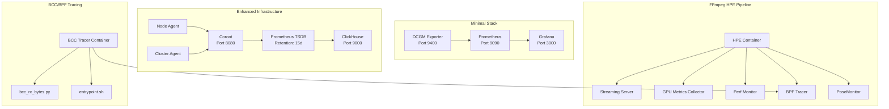
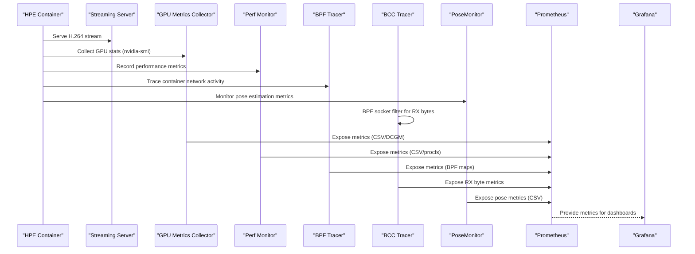
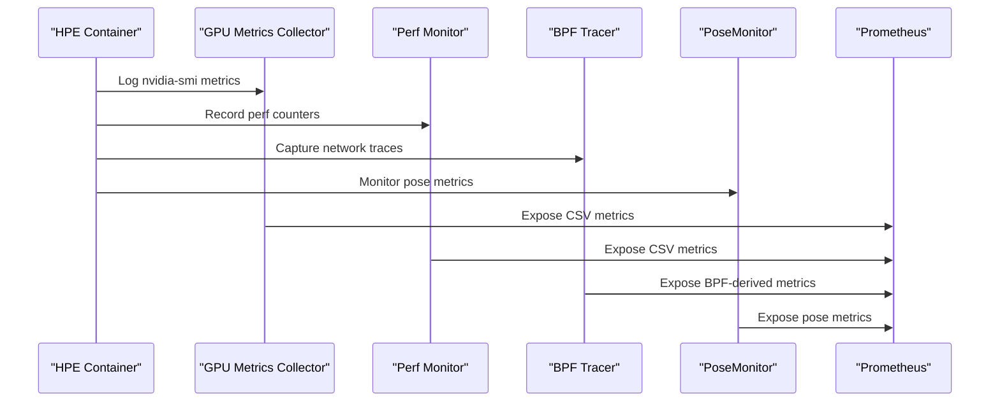
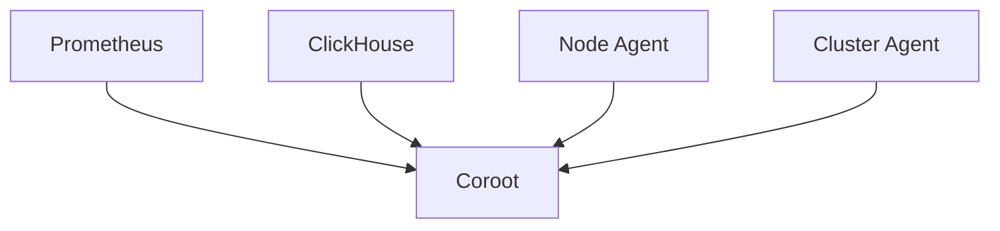
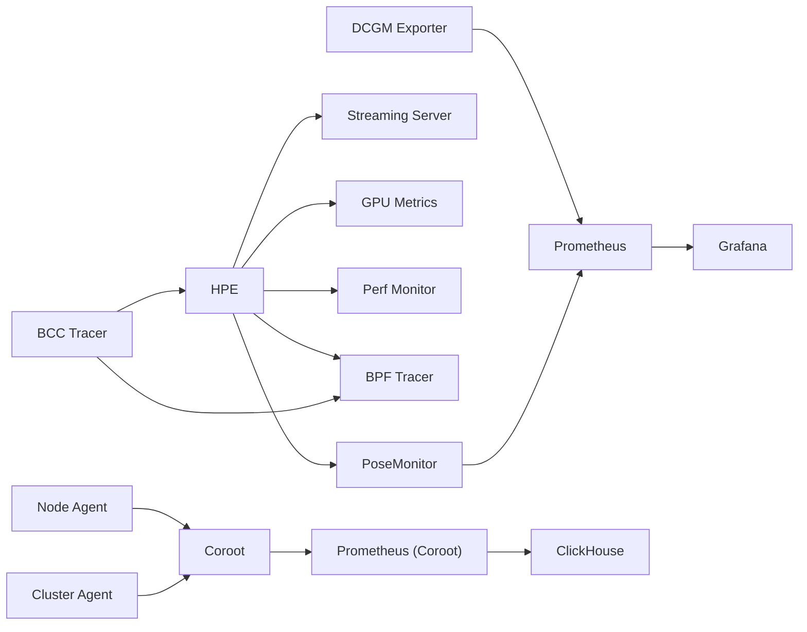

# Monitoring and Observability Stack

<cite>
**Referenced Files in This Document**
- [prometheus.yml](file://prometheus.yml)
- [docker-compose.yml](file://docker-compose.yml)
- [Dockerfile.gpu_metrics](file://Measure_gpu_dcgm/Dockerfile.gpu_metrics)
- [run_nvidia_dcgm.sh](file://Measure_gpu_dcgm/run_nvidia_dcgm.sh)
- [docker-compose.yaml](file://ffmpeg_hpe/docker-compose.yaml)
- [docker-compose.infra.yml](file://recent-dash/docker-compose.infra.yml)
- [prometheus.yml](file://recent-dash/prometheus.yml)
- [Dockerfile](file://recent-dash/perf_monitor/Dockerfile)
- [Dockerfile](file://recent-dash/bpftrace-tracer/Dockerfile)
- [bcc-bpf-tracing.md](file://docs/bcc-bpf-tracing.md)
- [bcc_rx_bytes.py](file://ffmpeg_hpe/bpftrace-tracer/bcc_rx_bytes.py)
- [entrypoint.sh](file://ffmpeg_hpe/bpftrace-tracer/entrypoint.sh)
- [Dockerfile.bcc](file://ffmpeg_hpe/bpftrace-tracer/Dockerfile.bcc)
- [run_experiment_bcc.sh](file://ffmpeg_hpe/run_experiment_bcc.sh)
- [pose_monitor.py](file://pose_monitor.py)
</cite>

## Update Summary
**Changes Made**
- Added comprehensive BCC/BPF network tracing documentation and implementation details
- Integrated PoseMonitor class for pose estimation performance metrics collection
- Enhanced monitoring capabilities with kernel-level network traffic analysis
- Expanded Docker Compose configuration to support BCC tracer container
- Added detailed troubleshooting guides for BCC/BPF tracing implementation

## Table of Contents
1. [Introduction](#introduction)
2. [Project Structure](#project-structure)
3. [Core Components](#core-components)
4. [Architecture Overview](#architecture-overview)
5. [Detailed Component Analysis](#detailed-component-analysis)
6. [BCC/BPF Network Tracing Implementation](#bccbpf-network-tracing-implementation)
7. [PoseMonitor Integration](#posemonitor-integration)
8. [Dependency Analysis](#dependency-analysis)
9. [Performance Considerations](#performance-considerations)
10. [Troubleshooting Guide](#troubleshooting-guide)
11. [Conclusion](#conclusion)

## Introduction
This document describes the monitoring and observability stack implemented in the repository. It covers Prometheus metrics collection configuration, Grafana dashboard setup, and DCGM exporter integration for GPU monitoring. It also explains time-series data collection, metric definitions, alerting mechanisms, service discovery, data retention policies, and performance metrics collection. Guidance is provided for configuring custom metrics, creating dashboards, setting up alert rules, and integrating Prometheus, Grafana, and the DCGM exporter for comprehensive system monitoring. The stack has been enhanced with BCC/BPF network tracing capabilities and PoseMonitor integration for comprehensive system monitoring and performance analysis.

## Project Structure
The monitoring stack spans multiple Docker Compose configurations and supporting scripts:
- Minimal Prometheus stack with DCGM exporter and Grafana
- Enhanced infrastructure stack with Coroot, ClickHouse, and Prometheus
- FFmpeg-based Human Pose Estimation pipeline with GPU metrics, performance monitoring, and BCC/BPF network tracing
- Utility containers for performance monitoring and BPF tracing
- PoseMonitor integration for pose estimation metrics collection

**Diagram sources**
- [docker-compose.yml:4-30](file://docker-compose.yml#L4-L30)
- [docker-compose.infra.yml:11-101](file://recent-dash/docker-compose.infra.yml#L11-L101)
- [docker-compose.yaml:1-201](file://ffmpeg_hpe/docker-compose.yaml#L1-L201)
- [bcc-bpf-tracing.md:23-53](file://docs/bcc-bpf-tracing.md#L23-L53)

**Section sources**
- [docker-compose.yml:1-30](file://docker-compose.yml#L1-L30)
- [docker-compose.infra.yml:1-101](file://recent-dash/docker-compose.infra.yml#L1-L101)
- [docker-compose.yaml:1-201](file://ffmpeg_hpe/docker-compose.yaml#L1-L201)

## Core Components
- DCGM Exporter: Exposes GPU metrics via Prometheus endpoint at port 9400.
- Prometheus: Scrapes exporters and stores time-series data with configurable intervals and retention.
- Grafana: Visualizes metrics from Prometheus with pre-configured dashboards.
- Coroot + ClickHouse: Alternative observability stack with distributed tracing, logs, and metrics.
- FFmpeg HPE Pipeline: Integrates GPU metrics, performance monitoring, BPF tracing, and PoseMonitor for end-to-end observability.
- Utility Containers: Perf monitor, BPF tracer, and PoseMonitor for comprehensive system insights.
- BCC/BPF Network Tracing: Kernel-level network traffic analysis for precise RX byte measurements.

Key configuration highlights:
- Scraping interval: 500 ms for DCGM exporter and node/cluster agents.
- Prometheus retention: 15 days in the enhanced stack.
- GPU metrics CSV logging via nvidia-smi for offline analysis.
- BCC tracer with 10ms granularity for network traffic analysis.
- PoseMonitor with configurable window size for performance metrics collection.

**Section sources**
- [prometheus.yml:1-8](file://prometheus.yml#L1-L8)
- [docker-compose.yml:4-30](file://docker-compose.yml#L4-L30)
- [docker-compose.infra.yml:66-82](file://recent-dash/docker-compose.infra.yml#L66-L82)
- [run_nvidia_dcgm.sh:1-29](file://Measure_gpu_dcgm/run_nvidia_dcgm.sh#L1-L29)
- [bcc-bpf-tracing.md:1-364](file://docs/bcc-bpf-tracing.md#L1-L364)
- [pose_monitor.py:1-170](file://pose_monitor.py#L1-L170)

## Architecture Overview
The monitoring architecture integrates Prometheus with exporters and Grafana for visualization. The enhanced infrastructure adds Coroot and ClickHouse for richer observability. The FFmpeg HPE pipeline augments the stack with GPU metrics, performance counters, BPF tracing, and PoseMonitor for comprehensive end-to-end observability. BCC/BPF tracing provides kernel-level network traffic analysis with minimal overhead.

**Diagram sources**
- [docker-compose.yaml:39-197](file://ffmpeg_hpe/docker-compose.yaml#L39-L197)
- [run_nvidia_dcgm.sh:1-29](file://Measure_gpu_dcgm/run_nvidia_dcgm.sh#L1-L29)
- [Dockerfile:1-28](file://recent-dash/perf_monitor/Dockerfile#L1-L28)
- [Dockerfile:1-22](file://recent-dash/bpftrace-tracer/Dockerfile#L1-L22)
- [bcc_rx_bytes.py:1-124](file://ffmpeg_hpe/bpftrace-tracer/bcc_rx_bytes.py#L1-L124)
- [pose_monitor.py:1-170](file://pose_monitor.py#L1-L170)

## Detailed Component Analysis

### Prometheus Metrics Collection Configuration
- Job definition: DCGM exporter job scrapes target at dcgm-exporter:9400 with 500 ms interval.
- Global scrape interval: 500 ms; evaluation interval: 500 ms; scrape timeout: 200 ms.
- Additional jobs in the enhanced stack: node-agent, cluster-agent, and coroot.

Metric ingestion flow:
- DCGM exporter exposes GPU metrics on port 9400.
- Prometheus scrapes at configured intervals and persists time-series data.

Retention and storage:
- Enhanced stack configures Prometheus TSDB retention to 15 days and WAL compression.

**Section sources**
- [prometheus.yml:1-8](file://prometheus.yml#L1-L8)
- [docker-compose.yml:14-22](file://docker-compose.yml#L14-L22)
- [docker-compose.infra.yml:66-82](file://recent-dash/docker-compose.infra.yml#L66-L82)

### Grafana Dashboard Setup
- Grafana service is exposed on port 3000 and depends on Prometheus.
- Dashboards can be created to visualize GPU utilization, power draw, temperature, throughput metrics, and pose estimation performance from Prometheus.

Best practices:
- Use consistent label naming and metric naming conventions.
- Group related panels by subsystem (CPU, GPU, Memory, Network, Pose).
- Enable templating for dynamic selection of hosts, GPUs, and experiments.

**Section sources**
- [docker-compose.yml:24-30](file://docker-compose.yml#L24-L30)

### DCGM Exporter Integration for GPU Monitoring
- DCGM exporter runs as a privileged container with SYS_ADMIN capability and binds GPU devices.
- Command-line arguments configure scrape frequency and metrics file.
- Prometheus job targets dcgm-exporter:9400.

Metrics collected:
- GPU utilization, memory utilization, temperature, power draw, and P-state.

**Diagram sources**
- [docker-compose.yml:4-12](file://docker-compose.yml#L4-L12)
- [prometheus.yml:5-8](file://prometheus.yml#L5-L8)

**Section sources**
- [docker-compose.yml:4-12](file://docker-compose.yml#L4-L12)
- [prometheus.yml:5-8](file://prometheus.yml#L5-L8)

### GPU Metrics Logging via nvidia-smi
- Dedicated GPU metrics collector writes CSV-formatted telemetry to a mounted volume.
- Header includes timestamp, P-state, power draw, GPU temperature, GPU/memory utilization, and memory totals.
- Logging loop runs every 500 ms and stops on user input.

Use cases:
- Offline analysis and correlation with inference performance.
- Debugging thermal throttling and memory pressure.

**Section sources**
- [run_nvidia_dcgm.sh:1-29](file://Measure_gpu_dcgm/run_nvidia_dcgm.sh#L1-L29)
- [Dockerfile.gpu_metrics:1-12](file://Measure_gpu_dcgm/Dockerfile.gpu_metrics#L1-L12)

### FFmpeg HPE Pipeline Observability
- HPE container streams video frames and performs pose estimation with GPU acceleration.
- GPU metrics collector logs nvidia-smi metrics during the experiment.
- Perf monitor captures CPU and process metrics using Linux tools.
- BPF tracer traces container network activity for bandwidth and packet analysis.
- PoseMonitor collects pose estimation performance metrics with configurable windowing.

**Diagram sources**
- [docker-compose.yaml:39-197](file://ffmpeg_hpe/docker-compose.yaml#L39-L197)
- [run_nvidia_dcgm.sh:1-29](file://Measure_gpu_dcgm/run_nvidia_dcgm.sh#L1-L29)
- [Dockerfile:1-28](file://recent-dash/perf_monitor/Dockerfile#L1-L28)
- [Dockerfile:1-22](file://recent-dash/bpftrace-tracer/Dockerfile#L1-L22)
- [pose_monitor.py:1-170](file://pose_monitor.py#L1-L170)

**Section sources**
- [docker-compose.yaml:39-197](file://ffmpeg_hpe/docker-compose.yaml#L39-L197)

### Coroot + ClickHouse Observability Stack
- Coroot provides distributed tracing, logs, and metrics with a web UI on port 8080.
- Node and cluster agents collect system and Kubernetes metrics respectively.
- Prometheus is bootstrapped with Coroot and configured with 15-day retention.
- ClickHouse stores logs and metrics with persistent volumes.

**Diagram sources**
- [docker-compose.infra.yml:11-101](file://recent-dash/docker-compose.infra.yml#L11-L101)

**Section sources**
- [docker-compose.infra.yml:11-101](file://recent-dash/docker-compose.infra.yml#L11-L101)

## BCC/BPF Network Tracing Implementation

### Overview and Architecture
The BCC/BPF network tracing system provides kernel-level network traffic analysis for measuring RX (received) bytes during HPE experiments. This implementation uses eBPF (Extended Berkeley Packet Filter) via the BCC (BPF Compiler Collection) Python library to achieve minimal overhead and precise traffic measurement.

**Updated** Added comprehensive BCC/BPF network tracing implementation with kernel-level precision

### Why BPF Instead of tcpdump
| Concern | BPF Advantage |
|---------|---------------|
| **Overhead** | BPF programs run in kernel space — no context switches per packet |
| **Filtering** | C-like programs compiled to BPF bytecode filter at kernel level |
| **Granularity** | Can filter by exact source/destination port |
| **I/O** | Only counts bytes; does not store packet data |
| **Precision** | Aggregates in-kernel, reads periodically (10 ms) from userspace |

### BCC Python Program Implementation
The core BCC program (`bcc_rx_bytes.py`) implements a socket filter that:
- Parses Ethernet, IP, and TCP headers
- Filters for IPv4 TCP traffic only
- Accumulates packet lengths in a BPF hash map
- Provides 10ms sampling intervals for RX byte counting

**Section sources**
- [bcc-bpf-tracing.md:57-126](file://docs/bcc-bpf-tracing.md#L57-L126)
- [bcc_rx_bytes.py:1-124](file://ffmpeg_hpe/bpftrace-tracer/bcc_rx_bytes.py#L1-L124)

### Dynamic Port Detection Mechanism
The `entrypoint.sh` script automates port detection by:
- Resolving streaming server hostname to IP address
- Identifying the network interface from default route
- Waiting for HPE to establish TCP connection to port 8089
- Extracting HPE's dynamic source port for accurate filtering

**Section sources**
- [bcc-bpf-tracing.md:143-175](file://docs/bcc-bpf-tracing.md#L143-L175)
- [entrypoint.sh:1-48](file://ffmpeg_hpe/bpftrace-tracer/entrypoint.sh#L1-L48)

### Container Configuration and Privileges
The BCC tracer container requires extensive privileges:
- `privileged: true` for BPF program loading
- `SYS_ADMIN`, `NET_ADMIN`, `NET_RAW` for kernel-level operations
- `IPC_LOCK` for BPF map memory management
- Shared network namespace with HPE container for traffic visibility

**Section sources**
- [bcc-bpf-tracing.md:178-218](file://docs/bcc-bpf-tracing.md#L178-L218)
- [docker-compose.yaml:169-200](file://ffmpeg_hpe/docker-compose.yaml#L169-L200)

### Output and Data Collection
The tracer generates CSV output with columns:
- `timestamp_ms`: Milliseconds since epoch
- `rx_video_bytes_delta`: RX bytes in 10ms interval
- `rx_video_bytes_current`: Cumulative RX bytes
- `rx_video_bytes_prev`: Previous cumulative value
- `dt_ms`: Actual elapsed time since last sample

**Section sources**
- [bcc-bpf-tracing.md:129-140](file://docs/bcc-bpf-tracing.md#L129-L140)

## PoseMonitor Integration

### Pose Estimation Metrics Collection
The PoseMonitor class provides comprehensive performance monitoring for pose estimation systems:
- **FPS Tracking**: Real-time frames per second calculation with moving statistics
- **Inference Time Monitoring**: Latency measurement for pose estimation processing
- **Coordinate Analysis**: Center of mass calculation for tracked objects
- **Windowed Statistics**: Configurable sliding window for trend analysis

**Updated** Integrated PoseMonitor for pose estimation performance metrics collection

### Class Architecture and Features
The PoseMonitor implementation includes:
- **Deques for Moving Statistics**: Circular buffers for FPS, inference time, and coordinate tracking
- **CSV Logging**: Structured output with comprehensive statistical metrics
- **Real-time Processing**: 1-second intervals for periodic metric calculation
- **Confidence Filtering**: Keypoint validation using confidence thresholds

**Section sources**
- [pose_monitor.py:1-170](file://pose_monitor.py#L1-L170)

### Metric Calculation and Reporting
PoseMonitor calculates comprehensive statistics:
- **FPS Metrics**: Average, minimum, maximum, and standard deviation
- **Inference Time**: Processing latency with temporal analysis
- **Spatial Coordinates**: X/Y position tracking with statistical measures
- **Frame Counting**: Current second frame count and total processed frames

**Section sources**
- [pose_monitor.py:93-135](file://pose_monitor.py#L93-L135)

### Integration with Experiment Workflow
The PoseMonitor integrates seamlessly with the experiment automation:
- **Automatic Initialization**: CSV headers and file setup
- **Periodic Logging**: 1-second intervals for consistent data collection
- **Docker Volume Integration**: Results stored in shared experiment directories
- **Performance Baseline**: Statistical analysis for performance optimization

**Section sources**
- [pose_monitor.py:35-47](file://pose_monitor.py#L35-L47)
- [run_experiment_bcc.sh:236-246](file://ffmpeg_hpe/run_experiment_bcc.sh#L236-L246)

## Dependency Analysis
- DCGM Exporter depends on GPU drivers and SYS_ADMIN capability.
- Prometheus depends on DCGM Exporter and optionally Coroot/ClickHouse.
- Grafana depends on Prometheus.
- FFmpeg HPE pipeline depends on streaming server, GPU metrics collector, perf monitor, BPF tracer, and PoseMonitor.
- BCC tracer depends on kernel BPF support, shared network namespace, and elevated privileges.
- PoseMonitor depends on CSV file system and statistical computation libraries.

**Diagram sources**
- [docker-compose.yml:4-30](file://docker-compose.yml#L4-L30)
- [docker-compose.yaml:39-197](file://ffmpeg_hpe/docker-compose.yaml#L39-L197)
- [docker-compose.infra.yml:11-101](file://recent-dash/docker-compose.infra.yml#L11-L101)

**Section sources**
- [docker-compose.yml:4-30](file://docker-compose.yml#L4-L30)
- [docker-compose.yaml:39-197](file://ffmpeg_hpe/docker-compose.yaml#L39-L197)
- [docker-compose.infra.yml:11-101](file://recent-dash/docker-compose.infra.yml#L11-L101)

## Performance Considerations
- Scraping cadence: 500 ms balances granularity and overhead; adjust based on hardware and storage capacity.
- Retention policy: 15 days TSDB retention in the enhanced stack; ensure disk space and backup strategies.
- GPU metrics logging: CSV writer flushes every 500 ms; consider log rotation and offloading to external systems for long runs.
- Container privileges: SYS_ADMIN, SYS_PTRACE, and privileged modes enable deep telemetry but increase attack surface; restrict access and audit usage.
- Resource limits: Constrain CPU and memory for monitoring containers to minimize interference with workloads.
- BCC tracer overhead: Minimal kernel-level operation with 10ms sampling interval for network traffic analysis.
- PoseMonitor performance: Windowed statistics provide real-time insights without significant computational overhead.

## Troubleshooting Guide
Common issues and resolutions:
- Prometheus cannot reach DCGM exporter:
  - Verify exporter container is healthy and port 9400 is exposed.
  - Confirm Prometheus job target matches the exporter service name and port.
- No GPU metrics in Grafana:
  - Check Prometheus targets for errors and confirm scrape interval alignment.
  - Validate DCGM exporter configuration and GPU visibility in the container.
- Grafana dashboards missing data:
  - Ensure Prometheus datasource is configured and reachable.
  - Verify metric names and label filters in dashboard queries.
- Coroot not ingesting metrics:
  - Confirm Prometheus bootstrap URL and credentials.
  - Check ClickHouse connectivity and volume mounts.
- Perf monitor or BPF tracer failing:
  - Validate required capabilities and host PID namespace sharing.
  - Ensure kernel debugfs and module access are available inside containers.
- BCC tracer initialization failures:
  - Verify kernel BPF support and required configuration options.
  - Check for missing kernel headers and debugfs access.
  - Ensure proper privilege escalation and seccomp settings.
- Dynamic port detection issues:
  - Confirm HPE container establishes connection before tracer starts.
  - Verify network namespace sharing between containers.
  - Check for firewall rules blocking tracer access.
- PoseMonitor data collection problems:
  - Validate CSV file permissions and directory accessibility.
  - Ensure sufficient disk space for metric logging.
  - Check for proper initialization of statistical data structures.

**Section sources**
- [docker-compose.yml:4-30](file://docker-compose.yml#L4-L30)
- [docker-compose.infra.yml:66-82](file://recent-dash/docker-compose.infra.yml#L66-L82)
- [run_nvidia_dcgm.sh:1-29](file://Measure_gpu_dcgm/run_nvidia_dcgm.sh#L1-L29)
- [bcc-bpf-tracing.md:300-353](file://docs/bcc-bpf-tracing.md#L300-L353)
- [pose_monitor.py:35-47](file://pose_monitor.py#L35-L47)

## Conclusion
The repository implements a comprehensive monitoring and observability stack centered around Prometheus, Grafana, and DCGM exporter for GPU telemetry. The enhanced stack now includes BCC/BPF network tracing for kernel-level traffic analysis and PoseMonitor integration for pose estimation performance metrics. The enhanced Coroot + ClickHouse stack extends observability with distributed tracing and logs. The FFmpeg HPE pipeline integrates GPU metrics, performance counters, BPF tracing, and pose estimation monitoring for end-to-end insights. By aligning scraping intervals, configuring retention, leveraging advanced BCC tracing capabilities, and utilizing PoseMonitor analytics, teams can establish reliable monitoring, performance baselines, and effective troubleshooting workflows with unprecedented precision in network and pose estimation performance analysis.