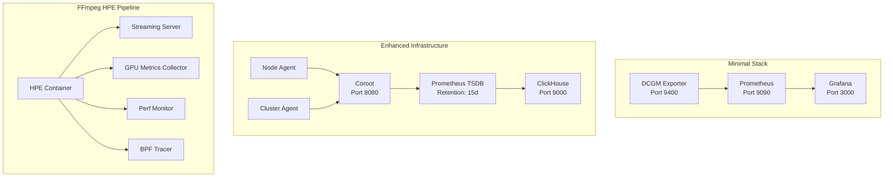
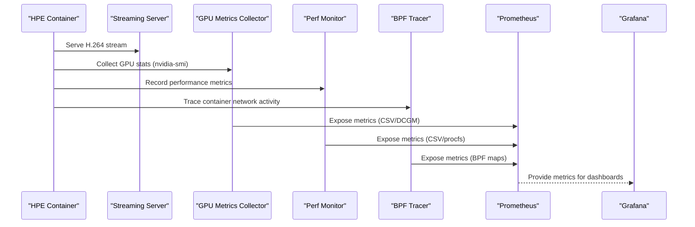
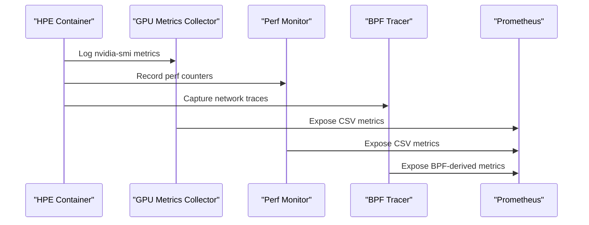
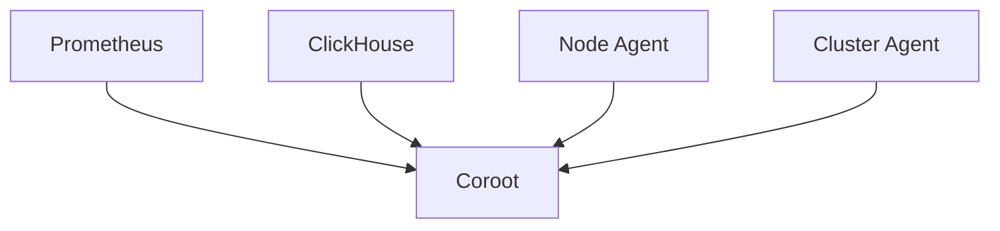
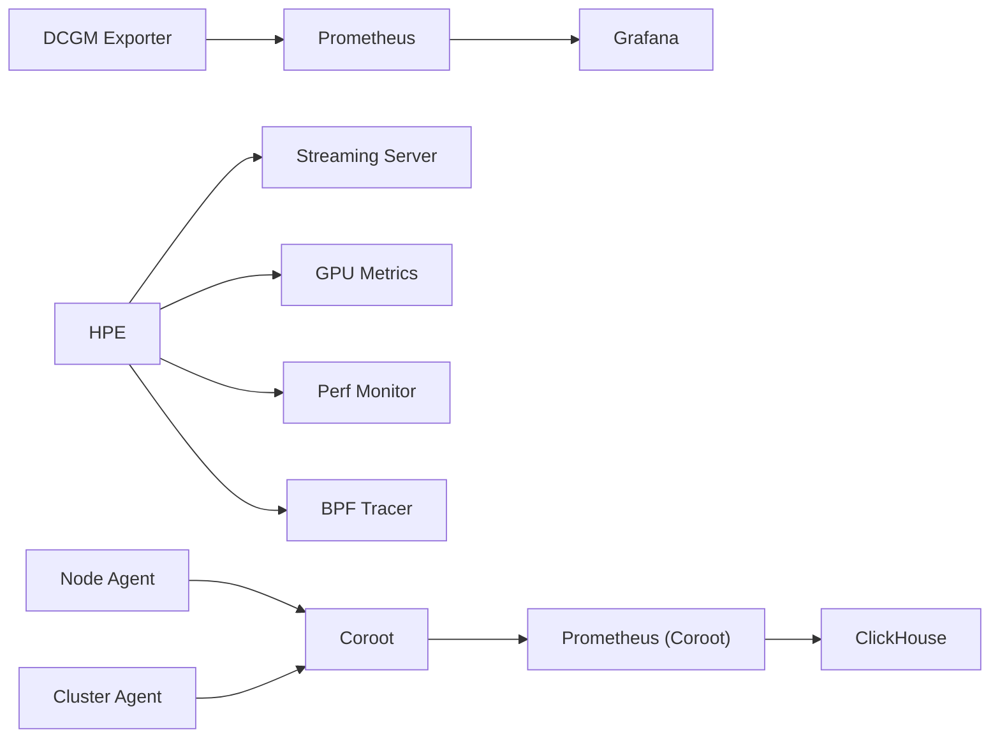

# Monitoring and Observability Stack

<cite>
**Referenced Files in This Document**
- [prometheus.yml](file://prometheus.yml)
- [docker-compose.yml](file://docker-compose.yml)
- [Dockerfile.gpu_metrics](file://Measure_gpu_dcgm/Dockerfile.gpu_metrics)
- [run_nvidia_dcgm.sh](file://Measure_gpu_dcgm/run_nvidia_dcgm.sh)
- [docker-compose.yaml](file://ffmpeg_hpe/docker-compose.yaml)
- [docker-compose.infra.yml](file://recent-dash/docker-compose.infra.yml)
- [prometheus.yml](file://recent-dash/prometheus.yml)
- [Dockerfile](file://recent-dash/perf_monitor/Dockerfile)
- [Dockerfile](file://recent-dash/bpftrace-tracer/Dockerfile)
</cite>

## Table of Contents
1. [Introduction](#introduction)
2. [Project Structure](#project-structure)
3. [Core Components](#core-components)
4. [Architecture Overview](#architecture-overview)
5. [Detailed Component Analysis](#detailed-component-analysis)
6. [Dependency Analysis](#dependency-analysis)
7. [Performance Considerations](#performance-considerations)
8. [Troubleshooting Guide](#troubleshooting-guide)
9. [Conclusion](#conclusion)

## Introduction
This document describes the monitoring and observability stack implemented in the repository. It covers Prometheus metrics collection configuration, Grafana dashboard setup, and DCGM exporter integration for GPU monitoring. It also explains time-series data collection, metric definitions, alerting mechanisms, service discovery, data retention policies, and performance metrics collection. Guidance is provided for configuring custom metrics, creating dashboards, setting up alert rules, and integrating Prometheus, Grafana, and the DCGM exporter for comprehensive system monitoring. Finally, it includes practical steps for establishing monitoring alerts, performance baselines, and troubleshooting monitoring issues.

## Project Structure
The monitoring stack spans multiple Docker Compose configurations and supporting scripts:
- Minimal Prometheus stack with DCGM exporter and Grafana
- Enhanced infrastructure stack with Coroot, ClickHouse, and Prometheus
- FFmpeg-based Human Pose Estimation pipeline with GPU metrics and performance monitoring
- Utility containers for performance and BPF tracing

**Diagram sources**
- [docker-compose.yml:4-30](file://docker-compose.yml#L4-L30)
- [docker-compose.infra.yml:11-101](file://recent-dash/docker-compose.infra.yml#L11-L101)
- [docker-compose.yaml:1-201](file://ffmpeg_hpe/docker-compose.yaml#L1-L201)

**Section sources**
- [docker-compose.yml:1-30](file://docker-compose.yml#L1-L30)
- [docker-compose.infra.yml:1-101](file://recent-dash/docker-compose.infra.yml#L1-L101)
- [docker-compose.yaml:1-201](file://ffmpeg_hpe/docker-compose.yaml#L1-L201)

## Core Components
- DCGM Exporter: Exposes GPU metrics via Prometheus endpoint at port 9400.
- Prometheus: Scrapes exporters and stores time-series data with configurable intervals and retention.
- Grafana: Visualizes metrics from Prometheus with pre-configured dashboards.
- Coroot + ClickHouse: Alternative observability stack with distributed tracing, logs, and metrics.
- FFmpeg HPE Pipeline: Integrates GPU metrics, performance monitoring, and BPF tracing for end-to-end observability.
- Utility Containers: Perf monitor and BPF tracer for low-level system and network insights.

Key configuration highlights:
- Scraping interval: 500 ms for DCGM exporter and node/cluster agents.
- Prometheus retention: 15 days in the enhanced stack.
- GPU metrics CSV logging via nvidia-smi for offline analysis.

**Section sources**
- [prometheus.yml:1-8](file://prometheus.yml#L1-L8)
- [docker-compose.yml:4-30](file://docker-compose.yml#L4-L30)
- [docker-compose.infra.yml:66-82](file://recent-dash/docker-compose.infra.yml#L66-L82)
- [run_nvidia_dcgm.sh:1-29](file://Measure_gpu_dcgm/run_nvidia_dcgm.sh#L1-L29)

## Architecture Overview
The monitoring architecture integrates Prometheus with exporters and Grafana for visualization. The enhanced infrastructure adds Coroot and ClickHouse for richer observability. The FFmpeg HPE pipeline augments the stack with GPU metrics, performance counters, and BPF-based network tracing.

**Diagram sources**
- [docker-compose.yaml:39-197](file://ffmpeg_hpe/docker-compose.yaml#L39-L197)
- [run_nvidia_dcgm.sh:1-29](file://Measure_gpu_dcgm/run_nvidia_dcgm.sh#L1-L29)
- [Dockerfile:1-28](file://recent-dash/perf_monitor/Dockerfile#L1-L28)
- [Dockerfile:1-22](file://recent-dash/bpftrace-tracer/Dockerfile#L1-L22)

## Detailed Component Analysis

### Prometheus Metrics Collection Configuration
- Job definition: DCGM exporter job scrapes target at dcgm-exporter:9400 with 500 ms interval.
- Global scrape interval: 500 ms; evaluation interval: 500 ms; scrape timeout: 200 ms.
- Additional jobs in the enhanced stack: node-agent, cluster-agent, and coroot.

Metric ingestion flow:
- DCGM exporter exposes GPU metrics on port 9400.
- Prometheus scrapes at configured intervals and persists time-series data.

Retention and storage:
- Enhanced stack configures Prometheus TSDB retention to 15 days and WAL compression.

**Section sources**
- [prometheus.yml:1-8](file://prometheus.yml#L1-L8)
- [docker-compose.yml:14-22](file://docker-compose.yml#L14-L22)
- [docker-compose.infra.yml:66-82](file://recent-dash/docker-compose.infra.yml#L66-L82)

### Grafana Dashboard Setup
- Grafana service is exposed on port 3000 and depends on Prometheus.
- Dashboards can be created to visualize GPU utilization, power draw, temperature, and throughput metrics from Prometheus.

Best practices:
- Use consistent label naming and metric naming conventions.
- Group related panels by subsystem (CPU, GPU, Memory, Network).
- Enable templating for dynamic selection of hosts, GPUs, and experiments.

**Section sources**
- [docker-compose.yml:24-30](file://docker-compose.yml#L24-L30)

### DCGM Exporter Integration for GPU Monitoring
- DCGM exporter runs as a privileged container with SYS_ADMIN capability and binds GPU devices.
- Command-line arguments configure scrape frequency and metrics file.
- Prometheus job targets dcgm-exporter:9400.

Metrics collected:
- GPU utilization, memory utilization, temperature, power draw, and P-state.

**Diagram sources**
- [docker-compose.yml:4-12](file://docker-compose.yml#L4-L12)
- [prometheus.yml:5-8](file://prometheus.yml#L5-L8)

**Section sources**
- [docker-compose.yml:4-12](file://docker-compose.yml#L4-L12)
- [prometheus.yml:5-8](file://prometheus.yml#L5-L8)

### GPU Metrics Logging via nvidia-smi
- Dedicated GPU metrics collector writes CSV-formatted telemetry to a mounted volume.
- Header includes timestamp, P-state, power draw, GPU temperature, GPU/memory utilization, and memory totals.
- Logging loop runs every 500 ms and stops on user input.

Use cases:
- Offline analysis and correlation with inference performance.
- Debugging thermal throttling and memory pressure.

**Section sources**
- [run_nvidia_dcgm.sh:1-29](file://Measure_gpu_dcgm/run_nvidia_dcgm.sh#L1-L29)
- [Dockerfile.gpu_metrics:1-12](file://Measure_gpu_dcgm/Dockerfile.gpu_metrics#L1-L12)

### FFmpeg HPE Pipeline Observability
- HPE container streams video frames and performs pose estimation with GPU acceleration.
- GPU metrics collector logs nvidia-smi metrics during the experiment.
- Perf monitor captures CPU and process metrics using Linux tools.
- BPF tracer traces container network activity for bandwidth and packet analysis.

**Diagram sources**
- [docker-compose.yaml:39-197](file://ffmpeg_hpe/docker-compose.yaml#L39-L197)
- [run_nvidia_dcgm.sh:1-29](file://Measure_gpu_dcgm/run_nvidia_dcgm.sh#L1-L29)
- [Dockerfile:1-28](file://recent-dash/perf_monitor/Dockerfile#L1-L28)
- [Dockerfile:1-22](file://recent-dash/bpftrace-tracer/Dockerfile#L1-L22)

**Section sources**
- [docker-compose.yaml:39-197](file://ffmpeg_hpe/docker-compose.yaml#L39-L197)

### Coroot + ClickHouse Observability Stack
- Coroot provides distributed tracing, logs, and metrics with a web UI on port 8080.
- Node and cluster agents collect system and Kubernetes metrics respectively.
- Prometheus is bootstrapped with Coroot and configured with 15-day retention.
- ClickHouse stores logs and metrics with persistent volumes.

**Diagram sources**
- [docker-compose.infra.yml:11-101](file://recent-dash/docker-compose.infra.yml#L11-L101)

**Section sources**
- [docker-compose.infra.yml:11-101](file://recent-dash/docker-compose.infra.yml#L11-L101)

## Dependency Analysis
- DCGM Exporter depends on GPU drivers and SYS_ADMIN capability.
- Prometheus depends on DCGM Exporter and optionally Coroot/ClickHouse.
- Grafana depends on Prometheus.
- FFmpeg HPE pipeline depends on streaming server, GPU metrics collector, perf monitor, and BPF tracer.
- Coroot stack depends on Prometheus and ClickHouse.

**Diagram sources**
- [docker-compose.yml:4-30](file://docker-compose.yml#L4-L30)
- [docker-compose.yaml:39-197](file://ffmpeg_hpe/docker-compose.yaml#L39-L197)
- [docker-compose.infra.yml:11-101](file://recent-dash/docker-compose.infra.yml#L11-L101)

**Section sources**
- [docker-compose.yml:4-30](file://docker-compose.yml#L4-L30)
- [docker-compose.yaml:39-197](file://ffmpeg_hpe/docker-compose.yaml#L39-L197)
- [docker-compose.infra.yml:11-101](file://recent-dash/docker-compose.infra.yml#L11-L101)

## Performance Considerations
- Scraping cadence: 500 ms balances granularity and overhead; adjust based on hardware and storage capacity.
- Retention policy: 15 days TSDB retention in the enhanced stack; ensure disk space and backup strategies.
- GPU metrics logging: CSV writer flushes every 500 ms; consider log rotation and offloading to external systems for long runs.
- Container privileges: SYS_ADMIN, SYS_PTRACE, and privileged modes enable deep telemetry but increase attack surface; restrict access and audit usage.
- Resource limits: Constrain CPU and memory for monitoring containers to minimize interference with workloads.

[No sources needed since this section provides general guidance]

## Troubleshooting Guide
Common issues and resolutions:
- Prometheus cannot reach DCGM exporter:
  - Verify exporter container is healthy and port 9400 is exposed.
  - Confirm Prometheus job target matches the exporter service name and port.
- No GPU metrics in Grafana:
  - Check Prometheus targets for errors and confirm scrape interval alignment.
  - Validate DCGM exporter configuration and GPU visibility in the container.
- Grafana dashboards missing data:
  - Ensure Prometheus datasource is configured and reachable.
  - Verify metric names and label filters in dashboard queries.
- Coroot not ingesting metrics:
  - Confirm Prometheus bootstrap URL and credentials.
  - Check ClickHouse connectivity and volume mounts.
- Perf monitor or BPF tracer failing:
  - Validate required capabilities and host PID namespace sharing.
  - Ensure kernel debugfs and module access are available inside containers.
- Long-running experiments:
  - Monitor disk usage for CSV logs and TSDB data.
  - Rotate logs and prune old data to prevent out-of-space conditions.

**Section sources**
- [docker-compose.yml:4-30](file://docker-compose.yml#L4-L30)
- [docker-compose.infra.yml:66-82](file://recent-dash/docker-compose.infra.yml#L66-L82)
- [run_nvidia_dcgm.sh:1-29](file://Measure_gpu_dcgm/run_nvidia_dcgm.sh#L1-L29)

## Conclusion
The repository implements a comprehensive monitoring and observability stack centered around Prometheus, Grafana, and DCGM exporter for GPU telemetry. The enhanced Coroot + ClickHouse stack extends observability with distributed tracing and logs. The FFmpeg HPE pipeline integrates GPU metrics, performance counters, and BPF tracing for end-to-end insights. By aligning scraping intervals, configuring retention, and leveraging dashboards and alerting, teams can establish reliable monitoring, performance baselines, and effective troubleshooting workflows.