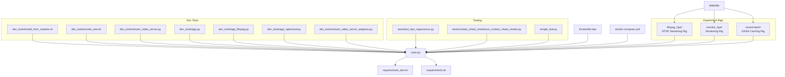
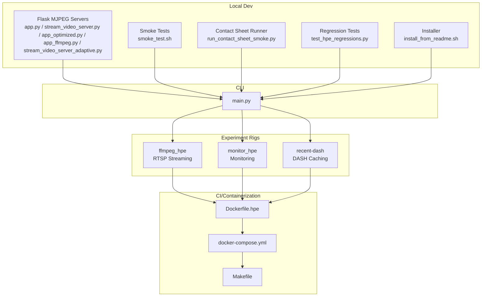
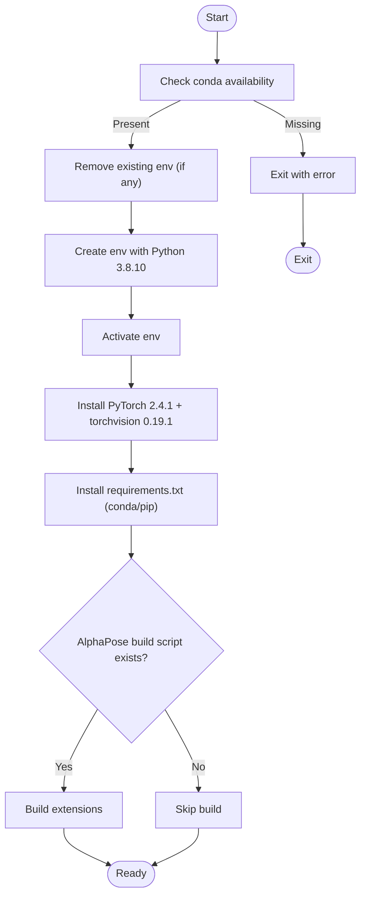
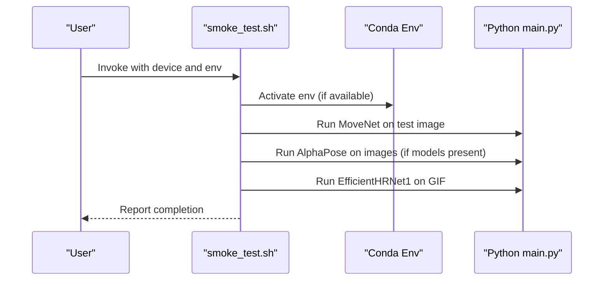
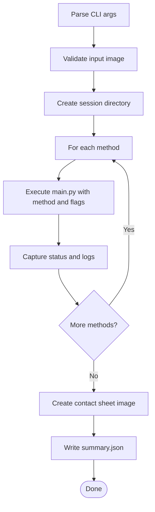
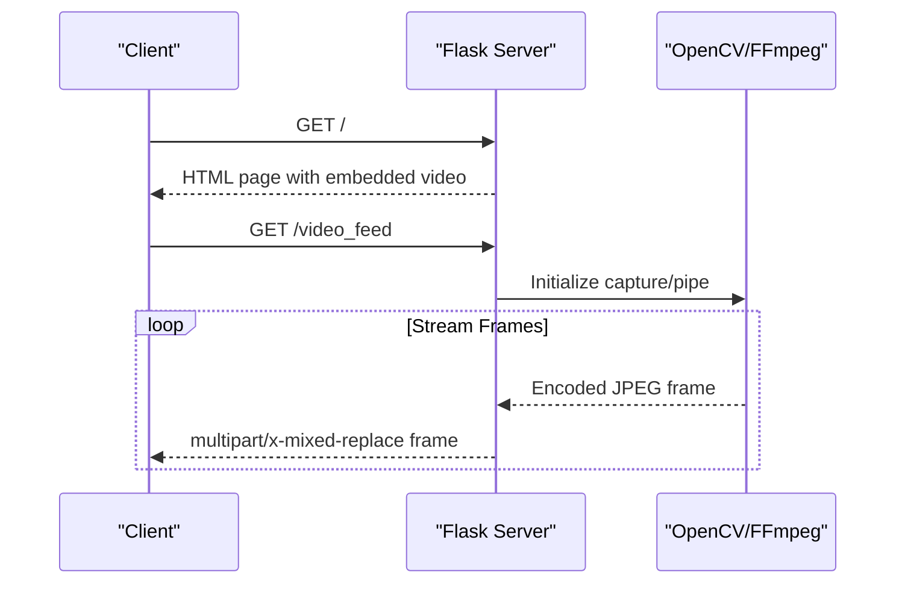
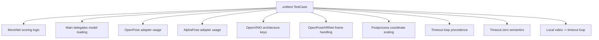
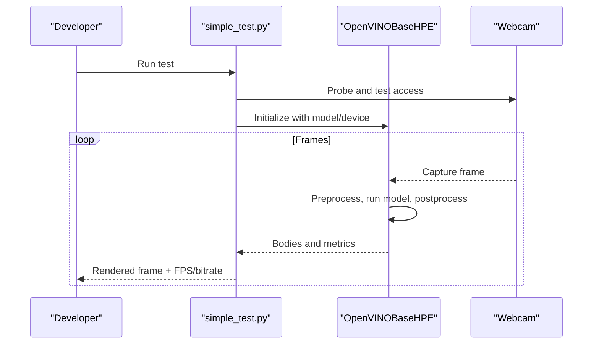
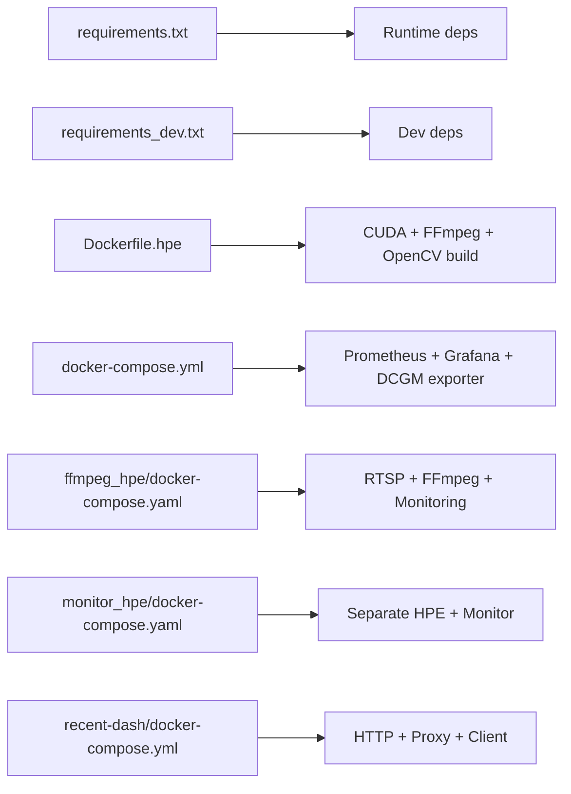

# Development Tools

<cite>
**Referenced Files in This Document**
- [dev_tools/README.md](file://dev_tools/README.md)
- [dev_tools/install_from_readme.sh](file://dev_tools/install_from_readme.sh)
- [dev_tools/smoke_test.sh](file://dev_tools/smoke_test.sh)
- [dev_tools/stream_video_server.py](file://dev_tools/stream_video_server.py)
- [dev_tools/app.py](file://dev_tools/app.py)
- [dev_tools/app_ffmpeg.py](file://dev_tools/app_ffmpeg.py)
- [dev_tools/app_optimized.py](file://dev_tools/app_optimized.py)
- [dev_tools/stream_video_server_adaptive.py](file://dev_tools/stream_video_server_adaptive.py)
- [tests/test_hpe_regressions.py](file://tests/test_hpe_regressions.py)
- [tests/contact_sheet_smoke/run_contact_sheet_smoke.py](file://tests/contact_sheet_smoke/run_contact_sheet_smoke.py)
- [simple_test.py](file://simple_test.py)
- [main.py](file://main.py)
- [requirements_dev.txt](file://requirements_dev.txt)
- [requirements.txt](file://requirements.txt)
- [Dockerfile.hpe](file://Dockerfile.hpe)
- [docker-compose.yml](file://docker-compose.yml)
- [Makefile](file://Makefile)
- [ONBOARDING.md](file://ONBOARDING.md)
- [ffmpeg_hpe/run_experiment.sh](file://ffmpeg_hpe/run_experiment.sh)
- [monitor_hpe/run_experiment.sh](file://monitor_hpe/run_experiment.sh)
- [recent-dash/run_experiment.sh](file://recent-dash/run_experiment.sh)
- [ffmpeg_hpe/docker-compose.yaml](file://ffmpeg_hpe/docker-compose.yaml)
- [monitor_hpe/docker-compose.yaml](file://monitor_hpe/docker-compose.yaml)
- [recent-dash/docker-compose.yml](file://recent-dash/docker-compose.yml)
</cite>

## Update Summary
**Changes Made**
- Added comprehensive documentation for the new unified Makefile system
- Documented the three experiment rig architectures: ffmpeg_hpe, monitor_hpe, and recent-dash
- Updated Makefile targets documentation with detailed experiment control
- Enhanced architecture overview to reflect the three distinct experiment rigs
- Added Docker Compose integration details for each rig
- Updated troubleshooting guide with rig-specific considerations

## Table of Contents
1. [Introduction](#introduction)
2. [Project Structure](#project-structure)
3. [Core Components](#core-components)
4. [Architecture Overview](#architecture-overview)
5. [Detailed Component Analysis](#detailed-component-analysis)
6. [Dependency Analysis](#dependency-analysis)
7. [Performance Considerations](#performance-considerations)
8. [Troubleshooting Guide](#troubleshooting-guide)
9. [Conclusion](#conclusion)
10. [Appendices](#appendices)

## Introduction
This document describes the development and testing tools for rapid environment setup, local video streaming for testing, smoke and regression testing, and developer utilities for debugging and performance analysis. It covers:
- Installation and environment setup scripts
- Flask-based video streaming servers for local development
- Comprehensive testing framework (smoke tests, unit tests, regression tests)
- Unified Makefile control over three experiment rigs: ffmpeg_hpe, monitor_hpe, and recent-dash
- Debugging and profiling utilities
- Guidance for extending the testing framework and integrating with CI pipelines
- Code quality and contribution standards

## Project Structure
The development tools live primarily under the dev_tools directory and integrate with the broader testing and benchmarking infrastructure, now unified under a common Makefile system:
- dev_tools: Flask-based local video streaming servers and smoke test harness
- tests: Regression tests and contact sheet smoke test runner
- simple_test.py: Developer-focused synchronous webcam test for OpenVINO HPE
- main.py: CLI entrypoint for HPE methods and timeout/frame controls
- requirements files: Environment dependencies for dev and runtime
- Docker and docker-compose: GPU metrics stack and CI-friendly base images
- Makefile: Unified convenience targets for building and running experiments across all three rigs
- ffmpeg_hpe: RTSP streaming experiment rig with MediaMTX broker and FFmpeg NVENC
- monitor_hpe: Monitoring-focused experiment rig with separate HPE and monitoring containers
- recent-dash: DASH caching experiment rig with HTTP server, proxy, and client

**Diagram sources**
- [dev_tools/install_from_readme.sh:1-39](file://dev_tools/install_from_readme.sh#L1-L39)
- [dev_tools/smoke_test.sh:1-42](file://dev_tools/smoke_test.sh#L1-L42)
- [dev_tools/stream_video_server.py:1-228](file://dev_tools/stream_video_server.py#L1-L228)
- [dev_tools/app.py:1-140](file://dev_tools/app.py#L1-L140)
- [dev_tools/app_ffmpeg.py:1-268](file://dev_tools/app_ffmpeg.py#L1-L268)
- [dev_tools/app_optimized.py:1-97](file://dev_tools/app_optimized.py#L1-L97)
- [dev_tools/stream_video_server_adaptive.py:1-195](file://dev_tools/stream_video_server_adaptive.py#L1-L195)
- [tests/test_hpe_regressions.py:1-103](file://tests/test_hpe_regressions.py#L1-L103)
- [tests/contact_sheet_smoke/run_contact_sheet_smoke.py:1-210](file://tests/contact_sheet_smoke/run_contact_sheet_smoke.py#L1-L210)
- [simple_test.py:1-288](file://simple_test.py#L1-L288)
- [main.py:1-242](file://main.py#L1-L242)
- [requirements_dev.txt:1-81](file://requirements_dev.txt#L1-L81)
- [requirements.txt:1-100](file://requirements.txt#L1-L100)
- [Dockerfile.hpe:1-122](file://Dockerfile.hpe#L1-L122)
- [docker-compose.yml:1-30](file://docker-compose.yml#L1-L30)
- [Makefile:1-121](file://Makefile#L1-L121)
- [ffmpeg_hpe/docker-compose.yaml:1-241](file://ffmpeg_hpe/docker-compose.yaml#L1-L241)
- [monitor_hpe/docker-compose.yaml:1-60](file://monitor_hpe/docker-compose.yaml#L1-L60)
- [recent-dash/docker-compose.yml:1-135](file://recent-dash/docker-compose.yml#L1-L135)

**Section sources**
- [dev_tools/README.md:1-102](file://dev_tools/README.md#L1-L102)
- [ONBOARDING.md:1-800](file://ONBOARDING.md#L1-L800)

## Core Components
- Installation and environment setup:
  - Conda-based installer aligns with README environment (Python 3.8.10, pinned PyTorch/torchvision, requirements.txt).
  - Optional AlphaPose build steps are integrated.
- Smoke tests:
  - Automated smoke tests for multiple HPE methods on images and GIF/video.
  - Supports device selection and environment activation.
- Contact sheet smoke tests:
  - Batch-run multiple HPE methods on a single image, produce a visual contact sheet and per-method logs.
- Flask video streaming servers:
  - Multiple variants: pure OpenCV MJPEG server, optimized OpenCV server, FFmpeg-based server, adaptive bitrate server.
  - Designed for local testing of IP-stream-based HPE input.
- Regression tests:
  - Source-code assertions validating method routing, model adapter usage, timeouts, and post-processing logic.
- Developer utilities:
  - Synchronous webcam test for OpenVINO HPE with real-time FPS/bitrate metrics and visualization.
- **Unified Makefile Control**:
  - **ffmpeg_hpe**: RTSP streaming experiments with MediaMTX broker, FFmpeg NVENC streamer, and HPE inference
  - **monitor_hpe**: Separate HPE and monitoring container experiments
  - **recent-dash**: DASH caching experiments with HTTP server, proxy, and client
  - Convenience targets for building and running experiments across all rigs

**Section sources**
- [dev_tools/install_from_readme.sh:1-39](file://dev_tools/install_from_readme.sh#L1-L39)
- [dev_tools/smoke_test.sh:1-42](file://dev_tools/smoke_test.sh#L1-L42)
- [tests/contact_sheet_smoke/run_contact_sheet_smoke.py:1-210](file://tests/contact_sheet_smoke/run_contact_sheet_smoke.py#L1-L210)
- [dev_tools/stream_video_server.py:1-228](file://dev_tools/stream_video_server.py#L1-L228)
- [dev_tools/app.py:1-140](file://dev_tools/app.py#L1-L140)
- [dev_tools/app_ffmpeg.py:1-268](file://dev_tools/app_ffmpeg.py#L1-L268)
- [dev_tools/app_optimized.py:1-97](file://dev_tools/app_optimized.py#L1-L97)
- [dev_tools/stream_video_server_adaptive.py:1-195](file://dev_tools/stream_video_server_adaptive.py#L1-L195)
- [tests/test_hpe_regressions.py:1-103](file://tests/test_hpe_regressions.py#L1-L103)
- [simple_test.py:1-288](file://simple_test.py#L1-L288)
- [Makefile:1-121](file://Makefile#L1-L121)

## Architecture Overview
The development toolchain centers on a CLI entrypoint that orchestrates HPE methods and integrates with local and containerized testing stacks. The Flask servers provide MJPEG streams for manual and automated testing. The new unified Makefile system provides convenient control over three distinct experiment rigs:

**ffmpeg_hpe**: RTSP streaming rig with MediaMTX broker, FFmpeg NVENC streamer, and comprehensive monitoring
**monitor_hpe**: Separate HPE and monitoring container architecture for focused performance analysis  
**recent-dash**: DASH caching experiment rig with HTTP server, proxy, and client for CDN simulation

**Diagram sources**
- [dev_tools/app.py:1-140](file://dev_tools/app.py#L1-L140)
- [dev_tools/stream_video_server.py:1-228](file://dev_tools/stream_video_server.py#L1-L228)
- [dev_tools/app_optimized.py:1-97](file://dev_tools/app_optimized.py#L1-L97)
- [dev_tools/app_ffmpeg.py:1-268](file://dev_tools/app_ffmpeg.py#L1-L268)
- [dev_tools/stream_video_server_adaptive.py:1-195](file://dev_tools/stream_video_server_adaptive.py#L1-L195)
- [dev_tools/smoke_test.sh:1-42](file://dev_tools/smoke_test.sh#L1-L42)
- [tests/contact_sheet_smoke/run_contact_sheet_smoke.py:1-210](file://tests/contact_sheet_smoke/run_contact_sheet_smoke.py#L1-L210)
- [tests/test_hpe_regressions.py:1-103](file://tests/test_hpe_regressions.py#L1-L103)
- [dev_tools/install_from_readme.sh:1-39](file://dev_tools/install_from_readme.sh#L1-L39)
- [main.py:1-242](file://main.py#L1-L242)
- [Dockerfile.hpe:1-122](file://Dockerfile.hpe#L1-L122)
- [docker-compose.yml:1-30](file://docker-compose.yml#L1-L30)
- [Makefile:1-121](file://Makefile#L1-L121)
- [ffmpeg_hpe/docker-compose.yaml:1-241](file://ffmpeg_hpe/docker-compose.yaml#L1-L241)
- [monitor_hpe/docker-compose.yaml:1-60](file://monitor_hpe/docker-compose.yaml#L1-L60)
- [recent-dash/docker-compose.yml:1-135](file://recent-dash/docker-compose.yml#L1-L135)

## Detailed Component Analysis

### Installation and Environment Setup
- Purpose: Recreate the environment as documented in README.md with Python 3.8.10, pinned PyTorch/torchvision, and requirements.txt.
- Behavior:
  - Validates conda presence, removes/recreates environment, activates it.
  - Installs PyTorch and torchvision from the PyTorch channel.
  - Installs dependencies from requirements.txt, falling back to pip if needed.
  - Optionally builds AlphaPose extensions if present.
- Usage: Pass environment name as argument; defaults to "hpe".

**Diagram sources**
- [dev_tools/install_from_readme.sh:1-39](file://dev_tools/install_from_readme.sh#L1-L39)

**Section sources**
- [dev_tools/install_from_readme.sh:1-39](file://dev_tools/install_from_readme.sh#L1-L39)

### Smoke Tests
- Purpose: Quick verification of HPE methods on CPU/GPU using sample images and GIF/video.
- Behavior:
  - Accepts device and environment name arguments.
  - Activates conda environment if available.
  - Executes MoveNet on a single image, AlphaPose on an image directory (if models present), and EfficientHRNet1 on a GIF.
  - Skips AlphaPose smoke test if models are missing.
- Usage: Run with optional device and environment name.

**Diagram sources**
- [dev_tools/smoke_test.sh:1-42](file://dev_tools/smoke_test.sh#L1-L42)
- [main.py:1-242](file://main.py#L1-L242)

**Section sources**
- [dev_tools/smoke_test.sh:1-42](file://dev_tools/smoke_test.sh#L1-L42)

### Contact Sheet Smoke Tests
- Purpose: Batch-run multiple HPE methods on a single image, produce per-method outputs, and assemble a visual contact sheet.
- Behavior:
  - Parses arguments for input image, methods, device, output root, session name, per-model timeout, and failure tolerance.
  - Invokes main.py for each method with save_image enabled.
  - Creates a contact sheet image and a JSON summary.
  - Allows continuing even if some methods fail when configured.
- Usage: Run with desired flags; outputs timestamped session directory with contact sheet and summary.

**Diagram sources**
- [tests/contact_sheet_smoke/run_contact_sheet_smoke.py:1-210](file://tests/contact_sheet_smoke/run_contact_sheet_smoke.py#L1-L210)

**Section sources**
- [tests/contact_sheet_smoke/run_contact_sheet_smoke.py:1-210](file://tests/contact_sheet_smoke/run_contact_sheet_smoke.py#L1-L210)

### Flask Video Streaming Servers
- Purpose: Provide MJPEG HTTP streams for local testing of HPE methods that consume IP-stream inputs.
- Variants:
  - app.py: Basic MJPEG server with HEAD handling and no looping.
  - stream_video_server.py: Development-only server with debug info, test pattern fallback, and configurable video path.
  - app_optimized.py: Optimized generator with per-frame timing and HEAD support.
  - app_ffmpeg.py: FFmpeg-based MJPEG generator with metadata injection and video info endpoint.
  - stream_video_server_adaptive.py: Adaptive bitrate server with JPEG quality scaling and end frame.
- Usage: Set VIDEO_PATH environment variable or pass --video; run server and connect via browser or HPE client.

**Diagram sources**
- [dev_tools/app.py:1-140](file://dev_tools/app.py#L1-L140)
- [dev_tools/stream_video_server.py:1-228](file://dev_tools/stream_video_server.py#L1-L228)
- [dev_tools/app_optimized.py:1-97](file://dev_tools/app_optimized.py#L1-L97)
- [dev_tools/app_ffmpeg.py:1-268](file://dev_tools/app_ffmpeg.py#L1-L268)
- [dev_tools/stream_video_server_adaptive.py:1-195](file://dev_tools/stream_video_server_adaptive.py#L1-L195)

**Section sources**
- [dev_tools/app.py:1-140](file://dev_tools/app.py#L1-L140)
- [dev_tools/stream_video_server.py:1-228](file://dev_tools/stream_video_server.py#L1-L228)
- [dev_tools/app_optimized.py:1-97](file://dev_tools/app_optimized.py#L1-L97)
- [dev_tools/app_ffmpeg.py:1-268](file://dev_tools/app_ffmpeg.py#L1-L268)
- [dev_tools/stream_video_server_adaptive.py:1-195](file://dev_tools/stream_video_server_adaptive.py#L1-L195)

### Regression Tests
- Purpose: Source-based regression tests ensuring correctness of method routing, model adapters, and processing logic.
- Coverage:
  - MoveNet filters by instance score and avoids certain internal constructs.
  - Main delegates model loading to the processing loop.
  - OpenPose route uses OpenVINO model adapter.
  - AlphaPose route uses AlphaPose adapter with detection batch.
  - OpenVINO configuration maintains architecture keys.
  - OpenPose and HigherHRNet use original frame for preprocessing and manage current frame state.
  - Timeout loop prioritizes OpenCV capture over HTTP fallback and supports zero timeout semantics.
  - Main routes local video to timeout loop when applicable.
- Execution: Run via unittest discovery.

**Diagram sources**
- [tests/test_hpe_regressions.py:1-103](file://tests/test_hpe_regressions.py#L1-L103)

**Section sources**
- [tests/test_hpe_regressions.py:1-103](file://tests/test_hpe_regressions.py#L1-L103)

### Developer Utility: Synchronous Webcam Test
- Purpose: Validate OpenVINO HPE with a webcam in a simplified synchronous loop, displaying real-time metrics and rendering.
- Features:
  - Lists available cameras, tests camera access with retries.
  - Overrides process_frame to render poses, compute FPS, and estimate bitrate.
  - Displays frames with pose annotations and timing info.
  - Graceful shutdown on user input.
- Usage: Adjust model type, device, and input source; run to test webcam path end-to-end.

**Diagram sources**
- [simple_test.py:1-288](file://simple_test.py#L1-L288)

**Section sources**
- [simple_test.py:1-288](file://simple_test.py#L1-L288)

### Unified Makefile Control System
- Purpose: Provide unified control over three experiment rigs with convenience targets for building and running experiments.
- ffmpeg_hpe targets:
  - `make ffmpeg-movenet`, `make ffmpeg-alphapose`, `make ffmpeg-openpose`, `make ffmpeg-hrnet`, `make ffmpeg-ae1`, `make ffmpeg-ae2`, `make ffmpeg-ae3` - Run specific HPE methods on RTSP streaming rig
  - `make ffmpeg-build`, `make ffmpeg-build-hpe`, `make ffmpeg-build-perf`, `make ffmpeg-build-bcc`, `make ffmpeg-build-gpu` - Build specific services in ffmpeg_hpe
- monitor_hpe targets:
  - `make monitor-movenet`, `make monitor-alphapose`, `make monitor-openpose`, `make monitor-hrnet`, `make monitor-ae1`, `make monitor-ae2`, `make monitor-ae3` - Run specific HPE methods on monitoring rig
  - `make monitor-build`, `make monitor-build-hpe`, `make monitor-build-monitor` - Build specific services in monitor_hpe
- recent-dash targets:
  - `make dash-experiment`, `make http-server`, `make http-proxy`, `make http-client` - Run DASH caching experiments
  - `make dash-build`, `make dash-build-perf`, `make dash-build-trace` - Build specific services in recent-dash
- Convenience targets:
  - `make build-all` - Build all services in both ffmpeg_hpe and monitor_hpe
  - `make help` - Display all available targets with descriptions

**Updated** Added comprehensive Makefile control system documentation covering all three experiment rigs

**Section sources**
- [Makefile:1-121](file://Makefile#L1-L121)

## Dependency Analysis
- Runtime dependencies:
  - PyTorch 2.4.1, torchvision 0.19.1, OpenCV 4.10.0.84, Flask 3.0.3, OpenVINO 2024.4.0, NumPy 1.24.4, pandas 2.0.3, matplotlib 3.7.5, seaborn 0.13.2, psutil 7.0.0, requests 2.32.3, scipy 1.10.1, tqdm 4.67.0, and others.
- Development dependencies:
  - absl-py, beautifulsoup4, blinker, cachetools, certifi, click, contourpy, Cython 3.0.11, easydict, fastjsonschema, filelock, fonttools, fsspec, gdown, h5py, idna, importlib-metadata, itsdangerous, Jinja2, kiwisolver, Markdown, MarkupSafe, mpmath, networkx, onnx 1.15.0, pillow 10.4.0, protobuf 3.20.3, pyparsing, PySocks, python-dateutil, pytz, PyYAML 6.0.2, soupsieve, sympy 1.13.3, tabulate 0.9.0, typing-extensions, tzdata, urllib3, werkzeug 3.0.6, wrapt, yacs 0.18, zipp.
- Docker and GPU metrics:
  - Dockerfile.hpe builds a CUDA-enabled image with FFmpeg and OpenCV compiled with CUDA and FFmpeg support.
  - docker-compose.yml defines GPU metrics stack (DCGM exporter, Prometheus, Grafana).
- **Experiment Rig Dependencies**:
  - ffmpeg_hpe: MediaMTX RTSP broker, FFmpeg NVENC encoder, BCC tracer, GPU metrics collector
  - monitor_hpe: Separate HPE and monitoring containers with PID tracking
  - recent-dash: HTTP server, proxy, client, and network tracing infrastructure

**Diagram sources**
- [requirements.txt:1-100](file://requirements.txt#L1-L100)
- [requirements_dev.txt:1-81](file://requirements_dev.txt#L1-L81)
- [Dockerfile.hpe:1-122](file://Dockerfile.hpe#L1-L122)
- [docker-compose.yml:1-30](file://docker-compose.yml#L1-L30)
- [ffmpeg_hpe/docker-compose.yaml:1-241](file://ffmpeg_hpe/docker-compose.yaml#L1-L241)
- [monitor_hpe/docker-compose.yaml:1-60](file://monitor_hpe/docker-compose.yaml#L1-L60)
- [recent-dash/docker-compose.yml:1-135](file://recent-dash/docker-compose.yml#L1-L135)

**Section sources**
- [requirements.txt:1-100](file://requirements.txt#L1-L100)
- [requirements_dev.txt:1-81](file://requirements_dev.txt#L1-L81)
- [Dockerfile.hpe:1-122](file://Dockerfile.hpe#L1-L122)
- [docker-compose.yml:1-30](file://docker-compose.yml#L1-L30)

## Performance Considerations
- OpenCV threading:
  - main.py sets OpenCV thread count to 1 to reduce contention in single-process inference.
- Frame timing:
  - app_optimized.py and stream_video_server.py implement per-frame timing to match video FPS.
- FFmpeg-based streaming:
  - app_ffmpeg.py leverages FFmpeg for MJPEG generation and metadata injection, offloading transcoding to a dedicated process.
- GPU metrics stack:
  - docker-compose.yml runs Prometheus and Grafana with DCGM exporter for GPU telemetry.
- Containerization:
  - Dockerfile.hpe compiles FFmpeg and OpenCV with CUDA and FFmpeg support for optimal performance.
- **Experiment Rig Performance**:
  - ffmpeg_hpe: RTSP streaming with MediaMTX broker and FFmpeg NVENC encoder for low-latency streaming
  - monitor_hpe: Separate monitoring container with PID tracking for focused performance analysis
  - recent-dash: Network tracing and performance monitoring for CDN simulation

**Section sources**
- [main.py:1-242](file://main.py#L1-L242)
- [dev_tools/app_optimized.py:1-97](file://dev_tools/app_optimized.py#L1-L97)
- [dev_tools/stream_video_server.py:1-228](file://dev_tools/stream_video_server.py#L1-L228)
- [dev_tools/app_ffmpeg.py:1-268](file://dev_tools/app_ffmpeg.py#L1-L268)
- [docker-compose.yml:1-30](file://docker-compose.yml#L1-L30)
- [Dockerfile.hpe:1-122](file://Dockerfile.hpe#L1-L122)

## Troubleshooting Guide
- Conda environment issues:
  - Installer requires conda; ensure it is installed and on PATH. It removes and recreates the environment with Python 3.8.10.
- Missing AlphaPose models:
  - smoke_test.sh skips AlphaPose smoke test if pretrained models are absent; contact sheet smoke test similarly handles missing models gracefully.
- Flask server video path:
  - stream_video_server.py falls back to a test pattern when the video file is not found; verify VIDEO_PATH or --video argument.
- FFmpeg availability:
  - app_ffmpeg.py checks for ffmpeg and logs warnings if unavailable; ensure FFmpeg is installed and in PATH.
- GPU metrics:
  - docker-compose.yml requires nvidia-container-toolkit and proper driver persistence; verify with nvidia-smi and enable persistence if needed.
- WebRTC/RTSP compatibility:
  - Use check_stream_compat.sh to validate stream compatibility before running experiments.
- **Experiment Rig Specific Issues**:
  - ffmpeg_hpe: RTSP broker readiness, MediaMTX port 8554 connectivity, FFmpeg NVENC encoding issues
  - monitor_hpe: Separate container PID tracking, monitoring container resource allocation
  - recent-dash: HTTP server/proxy/client connectivity, network interface tracing configuration

**Section sources**
- [dev_tools/install_from_readme.sh:1-39](file://dev_tools/install_from_readme.sh#L1-L39)
- [dev_tools/smoke_test.sh:1-42](file://dev_tools/smoke_test.sh#L1-L42)
- [dev_tools/stream_video_server.py:1-228](file://dev_tools/stream_video_server.py#L1-L228)
- [dev_tools/app_ffmpeg.py:1-268](file://dev_tools/app_ffmpeg.py#L1-L268)
- [docker-compose.yml:1-30](file://docker-compose.yml#L1-L30)
- [ONBOARDING.md:220-233](file://ONBOARDING.md#L220-L233)

## Conclusion
The development and testing toolkit provides a robust foundation for local and CI-driven validation of HPE pipelines. The installer ensures repeatable environments, the Flask servers enable realistic IP-stream testing, and the comprehensive suite of smoke and regression tests guards against regressions. The new unified Makefile system provides convenient control over three distinct experiment rigs: ffmpeg_hpe for RTSP streaming, monitor_hpe for focused monitoring, and recent-dash for DASH caching experiments. The developer utilities streamline debugging and performance analysis, while the Docker and compose configurations support scalable GPU metrics collection across all rig types.

## Appendices

### Extending the Testing Framework
- Adding new smoke tests:
  - Extend the contact sheet runner to include new methods; ensure main.py supports the new method flag.
  - Add per-method timeout and output directories as needed.
- Adding regression tests:
  - Add new unittest.TestCase methods that assert on source code or runtime behavior.
  - Use targeted string checks or AST-based introspection to validate method routing and model adapter usage.
- Integrating with CI:
  - Use Makefile convenience targets to build and run experiments across all three rigs.
  - Leverage docker-compose.yml for GPU metrics stack in CI runners with GPUs.
- **Adding New Experiment Rigs**:
  - Create new directory with run_experiment.sh and docker-compose.yml
  - Add Makefile targets following existing patterns
  - Implement experiment-specific monitoring and data collection

**Section sources**
- [tests/contact_sheet_smoke/run_contact_sheet_smoke.py:1-210](file://tests/contact_sheet_smoke/run_contact_sheet_smoke.py#L1-L210)
- [tests/test_hpe_regressions.py:1-103](file://tests/test_hpe_regressions.py#L1-L103)
- [Makefile:1-121](file://Makefile#L1-L121)
- [docker-compose.yml:1-30](file://docker-compose.yml#L1-L30)

### Debugging and Profiling Techniques
- OpenCV debug output:
  - Enable OpenCV debug logging to inspect camera and video pipeline behavior.
- Real-time metrics:
  - simple_test.py demonstrates FPS computation and bitrate estimation for webcam input.
- Containerized monitoring:
  - Prometheus and Grafana with DCGM exporter provide GPU telemetry; verify persistence mode for stable measurements.
- **Experiment Rig Debugging**:
  - ffmpeg_hpe: RTSP stream verification, MediaMTX logs, FFmpeg NVENC encoding diagnostics
  - monitor_hpe: Separate container PID tracking, monitoring metrics analysis
  - recent-dash: HTTP server/proxy/client logs, network tracing verification

**Section sources**
- [simple_test.py:1-288](file://simple_test.py#L1-L288)
- [docker-compose.yml:1-30](file://docker-compose.yml#L1-L30)
- [ONBOARDING.md:220-233](file://ONBOARDING.md#L220-L233)

### Development Workflow Optimization
- Rapid environment setup:
  - Use install_from_readme.sh to recreate the documented environment quickly.
- Local stream testing:
  - Start a Flask server with stream_video_server.py and point HPE to the MJPEG endpoint.
- Batch smoke testing:
  - Use run_contact_sheet_smoke.py to validate multiple methods in one go and generate a visual report.
- CI integration:
  - Use Makefile targets to build images and run experiments across all three rigs; ensure cleanup between runs.
- **Experiment Rig Selection**:
  - Choose ffmpeg_hpe for RTSP streaming experiments with MediaMTX broker
  - Choose monitor_hpe for focused performance monitoring scenarios
  - Choose recent-dash for DASH caching and CDN simulation experiments

**Section sources**
- [dev_tools/install_from_readme.sh:1-39](file://dev_tools/install_from_readme.sh#L1-L39)
- [dev_tools/stream_video_server.py:1-228](file://dev_tools/stream_video_server.py#L1-L228)
- [tests/contact_sheet_smoke/run_contact_sheet_smoke.py:1-210](file://tests/contact_sheet_smoke/run_contact_sheet_smoke.py#L1-L210)
- [Makefile:1-121](file://Makefile#L1-L121)

### Code Quality and Contribution Standards
- Environment alignment:
  - Align development environments with requirements.txt and requirements_dev.txt.
- Testing coverage:
  - Maintain regression tests for critical logic and expand smoke tests for new methods.
- Documentation and onboarding:
  - Follow ONBOARDING.md for setup, hardware prerequisites, and experiment execution.
- **Experiment Rig Standards**:
  - Follow established patterns for run_experiment.sh and docker-compose.yml structure
  - Implement proper resource allocation and monitoring for each rig type
  - Ensure consistent logging and data collection across all experiment rigs

**Section sources**
- [requirements.txt:1-100](file://requirements.txt#L1-L100)
- [requirements_dev.txt:1-81](file://requirements_dev.txt#L1-L81)
- [ONBOARDING.md:1-800](file://ONBOARDING.md#L1-L800)