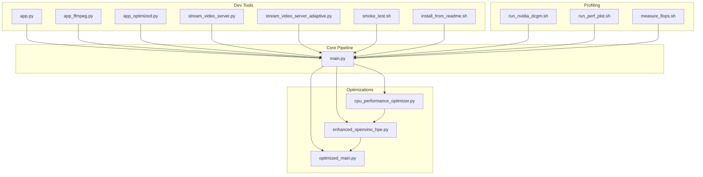
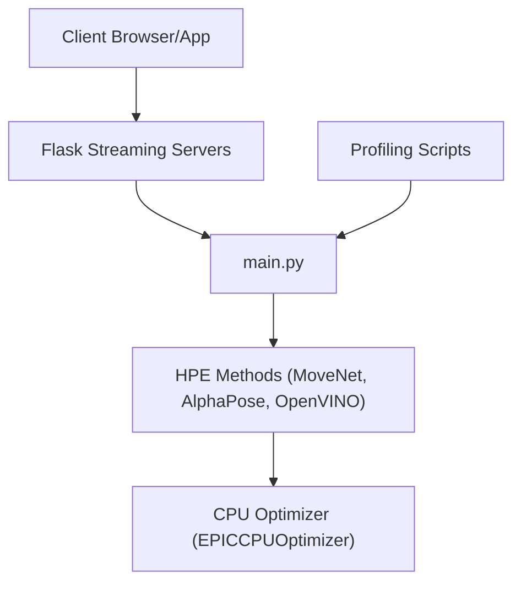
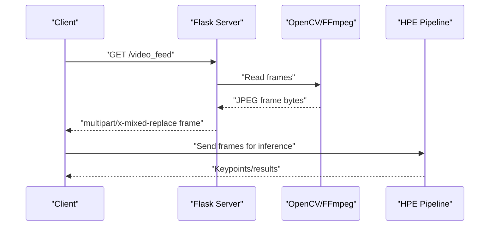
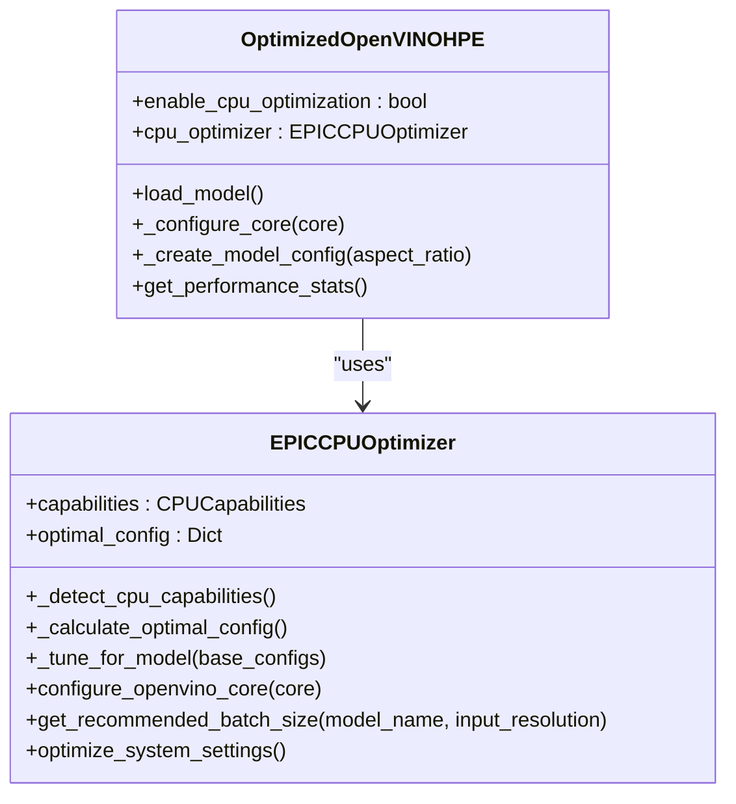
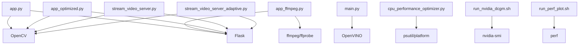

# Development Tools

<cite>
**Referenced Files in This Document**
- [README.md](file://dev_tools/README.md)
- [smoke_test.sh](file://dev_tools/smoke_test.sh)
- [install_from_readme.sh](file://dev_tools/install_from_readme.sh)
- [app.py](file://dev_tools/app.py)
- [app_ffmpeg.py](file://dev_tools/app_ffmpeg.py)
- [app_optimized.py](file://dev_tools/app_optimized.py)
- [stream_video_server.py](file://dev_tools/stream_video_server.py)
- [stream_video_server_adaptive.py](file://dev_tools/stream_video_server_adaptive.py)
- [main.py](file://main.py)
- [cpu_performance_optimizer.py](file://optimizations/cpu_performance_optimizer.py)
- [enhanced_openvino_hpe.py](file://optimizations/enhanced_openvino_hpe.py)
- [optimized_main.py](file://optimizations/optimized_main.py)
- [run_nvidia_dcgm.sh](file://Measure_gpu_dcgm/run_nvidia_dcgm.sh)
- [run_perf_plot.sh](file://Measure_plot_cpu_perf/run_perf_plot.sh)
- [measure_flops.sh](file://Measure_Flops/measure_flops.sh)
</cite>

## Table of Contents
1. [Introduction](#introduction)
2. [Project Structure](#project-structure)
3. [Core Components](#core-components)
4. [Architecture Overview](#architecture-overview)
5. [Detailed Component Analysis](#detailed-component-analysis)
6. [Dependency Analysis](#dependency-analysis)
7. [Performance Considerations](#performance-considerations)
8. [Troubleshooting Guide](#troubleshooting-guide)
9. [Conclusion](#conclusion)
10. [Appendices](#appendices)

## Introduction
This document describes the development and testing utilities for the Human Pose Estimation (HPE) framework. It covers:
- Smoke testing procedures to validate end-to-end functionality
- Model validation tools and performance profiling applications
- Development servers for testing video streaming, adaptive streaming, and optimization validation
- Testing methodologies, validation scripts, and debugging tools
- Guidance on extending the framework, adding new HPE methods, and maintaining code quality

## Project Structure
The development tools are organized under the dev_tools directory and integrate with the main HPE pipeline and optimization modules. Key areas:
- Development servers for MJPEG and adaptive streaming
- Validation and smoke testing scripts
- Performance profiling and monitoring utilities
- Optimized OpenVINO HPE integration

**Diagram sources**
- [app.py:1-140](file://dev_tools/app.py#L1-L140)
- [app_ffmpeg.py:1-204](file://dev_tools/app_ffmpeg.py#L1-L204)
- [app_optimized.py:1-97](file://dev_tools/app_optimized.py#L1-L97)
- [stream_video_server.py:1-228](file://dev_tools/stream_video_server.py#L1-L228)
- [stream_video_server_adaptive.py:1-195](file://dev_tools/stream_video_server_adaptive.py#L1-L195)
- [smoke_test.sh:1-42](file://dev_tools/smoke_test.sh#L1-L42)
- [install_from_readme.sh:1-39](file://dev_tools/install_from_readme.sh#L1-L39)
- [main.py:1-99](file://main.py#L1-L99)
- [cpu_performance_optimizer.py:1-539](file://optimizations/cpu_performance_optimizer.py#L1-L539)
- [enhanced_openvino_hpe.py:1-333](file://optimizations/enhanced_openvino_hpe.py#L1-L333)
- [optimized_main.py:1-257](file://optimizations/optimized_main.py#L1-L257)
- [run_nvidia_dcgm.sh:1-29](file://Measure_gpu_dcgm/run_nvidia_dcgm.sh#L1-L29)
- [run_perf_plot.sh:1-25](file://Measure_plot_cpu_perf/run_perf_plot.sh#L1-L25)
- [measure_flops.sh](file://Measure_Flops/measure_flops.sh)

**Section sources**
- [README.md:1-102](file://dev_tools/README.md#L1-L102)
- [main.py:1-99](file://main.py#L1-L99)

## Core Components
- Development servers for MJPEG streaming:
  - app.py: Basic MJPEG server with OpenCV and Flask
  - app_ffmpeg.py: MJPEG server using ffmpeg for frame extraction
  - app_optimized.py: Optimized streaming with precise frame timing
  - stream_video_server.py: Development-only server with test patterns and debug info
  - stream_video_server_adaptive.py: Adaptive server with JPEG quality and optional downscaling
- Validation and smoke testing:
  - smoke_test.sh: Automated smoke tests across multiple HPE methods
  - install_from_readme.sh: Environment setup aligned with README
- Performance profiling:
  - run_nvidia_dcgm.sh: GPU metrics logging via nvidia-smi
  - run_perf_plot.sh: CPU perf metrics collection and plotting
  - measure_flops.sh: FLOPs measurement utility
- Optimized OpenVINO HPE:
  - cpu_performance_optimizer.py: EPIC CPU optimizer with NUMA-aware tuning
  - enhanced_openvino_hpe.py: Enhanced OpenVINO HPE with CPU optimization
  - optimized_main.py: CLI wrapper enabling CPU optimization and benchmarking

**Section sources**
- [app.py:1-140](file://dev_tools/app.py#L1-L140)
- [app_ffmpeg.py:1-204](file://dev_tools/app_ffmpeg.py#L1-L204)
- [app_optimized.py:1-97](file://dev_tools/app_optimized.py#L1-L97)
- [stream_video_server.py:1-228](file://dev_tools/stream_video_server.py#L1-L228)
- [stream_video_server_adaptive.py:1-195](file://dev_tools/stream_video_server_adaptive.py#L1-L195)
- [smoke_test.sh:1-42](file://dev_tools/smoke_test.sh#L1-L42)
- [install_from_readme.sh:1-39](file://dev_tools/install_from_readme.sh#L1-L39)
- [run_nvidia_dcgm.sh:1-29](file://Measure_gpu_dcgm/run_nvidia_dcgm.sh#L1-L29)
- [run_perf_plot.sh:1-25](file://Measure_plot_cpu_perf/run_perf_plot.sh#L1-L25)
- [measure_flops.sh](file://Measure_Flops/measure_flops.sh)
- [cpu_performance_optimizer.py:1-539](file://optimizations/cpu_performance_optimizer.py#L1-L539)
- [enhanced_openvino_hpe.py:1-333](file://optimizations/enhanced_openvino_hpe.py#L1-L333)
- [optimized_main.py:1-257](file://optimizations/optimized_main.py#L1-L257)

## Architecture Overview
The development tools integrate with the main HPE pipeline and provide:
- Streaming endpoints for validating HPE inference on live or recorded video
- CLI-driven smoke tests to validate model loading and inference
- CPU/GPU optimization modules for OpenVINO-based HPE
- Profiling utilities for GPU and CPU performance

**Diagram sources**
- [main.py:1-99](file://main.py#L1-L99)
- [cpu_performance_optimizer.py:1-539](file://optimizations/cpu_performance_optimizer.py#L1-L539)
- [run_nvidia_dcgm.sh:1-29](file://Measure_gpu_dcgm/run_nvidia_dcgm.sh#L1-L29)
- [run_perf_plot.sh:1-25](file://Measure_plot_cpu_perf/run_perf_plot.sh#L1-L25)

## Detailed Component Analysis

### Development Servers for Video Streaming
These servers simulate IP camera feeds and validate HPE inference on MJPEG streams.

**Diagram sources**
- [app.py:45-102](file://dev_tools/app.py#L45-L102)
- [app_ffmpeg.py:69-169](file://dev_tools/app_ffmpeg.py#L69-L169)
- [app_optimized.py:19-76](file://dev_tools/app_optimized.py#L19-L76)

Key behaviors:
- app.py: Reads frames, encodes JPEG, yields multipart frames, logs initialization and errors
- app_ffmpeg.py: Uses ffmpeg to extract MJPEG frames, scales resolution, logs video details via ffprobe
- app_optimized.py: Precise frame timing using time.perf_counter and sleep to match FPS
- stream_video_server.py: Development-only server with test pattern fallback and debug info
- stream_video_server_adaptive.py: Adaptive JPEG quality and optional downscaling for HD

Validation steps:
- Start server and navigate to root or /video_feed
- Verify MJPEG stream in browser or VLC
- Confirm frame rate and resolution match expectations
- Use HEAD requests to probe headers without payload

**Section sources**
- [app.py:1-140](file://dev_tools/app.py#L1-L140)
- [app_ffmpeg.py:1-204](file://dev_tools/app_ffmpeg.py#L1-L204)
- [app_optimized.py:1-97](file://dev_tools/app_optimized.py#L1-L97)
- [stream_video_server.py:1-228](file://dev_tools/stream_video_server.py#L1-L228)
- [stream_video_server_adaptive.py:1-195](file://dev_tools/stream_video_server_adaptive.py#L1-L195)

### Model Validation and Smoke Testing
Automated smoke tests validate end-to-end inference across multiple HPE methods.

**Diagram sources**
- [smoke_test.sh:23-41](file://dev_tools/smoke_test.sh#L23-L41)

Execution:
- Ensure environment is prepared using install_from_readme.sh
- Run smoke_test.sh with optional device and environment name
- Validate outputs (saved images/videos, JSON/CSV exports if enabled)

**Section sources**
- [smoke_test.sh:1-42](file://dev_tools/smoke_test.sh#L1-L42)
- [install_from_readme.sh:1-39](file://dev_tools/install_from_readme.sh#L1-L39)

### Performance Profiling Applications
GPU and CPU profiling utilities collect runtime metrics for performance analysis.

**Diagram sources**
- [run_nvidia_dcgm.sh:1-29](file://Measure_gpu_dcgm/run_nvidia_dcgm.sh#L1-L29)
- [run_perf_plot.sh:1-25](file://Measure_plot_cpu_perf/run_perf_plot.sh#L1-L25)

Usage:
- GPU: Launch run_nvidia_dcgm.sh; metrics written to CSV; stop on user input
- CPU: Ensure PIDs file exists; run run_perf_plot.sh to collect and plot perf metrics

**Section sources**
- [run_nvidia_dcgm.sh:1-29](file://Measure_gpu_dcgm/run_nvidia_dcgm.sh#L1-L29)
- [run_perf_plot.sh:1-25](file://Measure_plot_cpu_perf/run_perf_plot.sh#L1-L25)
- [measure_flops.sh](file://Measure_Flops/measure_flops.sh)

### Optimized OpenVINO HPE
Intelligent CPU optimization for EPIC processors improves throughput and latency.

**Diagram sources**
- [cpu_performance_optimizer.py:20-539](file://optimizations/cpu_performance_optimizer.py#L20-L539)
- [enhanced_openvino_hpe.py:25-333](file://optimizations/enhanced_openvino_hpe.py#L25-L333)

Key features:
- EPICCPUOptimizer detects CPU capabilities and calculates optimal OpenVINO configuration
- OptimizedOpenVINOHPE integrates CPU optimization into OpenVINO HPE loading and model creation
- optimized_main.py provides CLI toggles to enable CPU optimization and run benchmarks

**Section sources**
- [cpu_performance_optimizer.py:1-539](file://optimizations/cpu_performance_optimizer.py#L1-L539)
- [enhanced_openvino_hpe.py:1-333](file://optimizations/enhanced_openvino_hpe.py#L1-L333)
- [optimized_main.py:1-257](file://optimizations/optimized_main.py#L1-L257)

## Dependency Analysis
The development tools depend on:
- Flask and OpenCV for MJPEG streaming
- ffmpeg/ffprobe for frame extraction and metadata logging
- OpenVINO for optimized HPE inference
- psutil and platform for CPU capability detection
- NVIDIA DCGM and perf for profiling

**Diagram sources**
- [app.py:1-140](file://dev_tools/app.py#L1-L140)
- [app_ffmpeg.py:1-204](file://dev_tools/app_ffmpeg.py#L1-L204)
- [app_optimized.py:1-97](file://dev_tools/app_optimized.py#L1-L97)
- [stream_video_server.py:1-228](file://dev_tools/stream_video_server.py#L1-L228)
- [stream_video_server_adaptive.py:1-195](file://dev_tools/stream_video_server_adaptive.py#L1-L195)
- [main.py:1-99](file://main.py#L1-L99)
- [cpu_performance_optimizer.py:1-539](file://optimizations/cpu_performance_optimizer.py#L1-L539)
- [run_nvidia_dcgm.sh:1-29](file://Measure_gpu_dcgm/run_nvidia_dcgm.sh#L1-L29)
- [run_perf_plot.sh:1-25](file://Measure_plot_cpu_perf/run_perf_plot.sh#L1-L25)

**Section sources**
- [main.py:1-99](file://main.py#L1-L99)
- [cpu_performance_optimizer.py:1-539](file://optimizations/cpu_performance_optimizer.py#L1-L539)

## Performance Considerations
- Streaming servers:
  - app_ffmpeg.py leverages ffmpeg for robust MJPEG extraction and scaling
  - app_optimized.py ensures frame timing matches video FPS precisely
  - stream_video_server_adaptive.py balances quality and performance with JPEG quality and optional downscaling
- CPU optimization:
  - EPICCPUOptimizer applies NUMA-aware thread allocation, memory bandwidth optimization, and workload-specific tuning
  - OptimizedOpenVINOHPE integrates optimized configuration into OpenVINO model loading
- Profiling:
  - Use run_nvidia_dcgm.sh for GPU utilization and temperature metrics
  - Use run_perf_plot.sh for CPU perf metrics collection and visualization

[No sources needed since this section provides general guidance]

## Troubleshooting Guide
Common issues and resolutions:
- Video not found or cannot open:
  - stream_video_server.py and stream_video_server_adaptive.py fall back to test patterns and log warnings
  - app.py logs absolute path and existence checks; ensure VIDEO_PATH is correct
- FFmpeg not found:
  - app_ffmpeg.py logs missing ffmpeg and skips detailed logging; install ffmpeg and ensure it is in PATH
- Inference performance:
  - Use optimized_main.py with --enable-cpu-opt to apply EPIC CPU optimizations
  - Run benchmarks with --benchmark to compare standard vs optimized FPS
- GPU metrics:
  - run_nvidia_dcgm.sh writes CSV; verify permissions and output directory
- CPU metrics:
  - run_perf_plot.sh reads PIDs from file; ensure PID file exists and processes are running

**Section sources**
- [stream_video_server.py:108-132](file://dev_tools/stream_video_server.py#L108-L132)
- [stream_video_server_adaptive.py:59-79](file://dev_tools/stream_video_server_adaptive.py#L59-L79)
- [app.py:12-21](file://dev_tools/app.py#L12-L21)
- [app_ffmpeg.py:54-66](file://dev_tools/app_ffmpeg.py#L54-L66)
- [optimized_main.py:201-246](file://optimizations/optimized_main.py#L201-L246)
- [run_nvidia_dcgm.sh:1-29](file://Measure_gpu_dcgm/run_nvidia_dcgm.sh#L1-L29)
- [run_perf_plot.sh:1-25](file://Measure_plot_cpu_perf/run_perf_plot.sh#L1-L25)

## Conclusion
The development tools provide a comprehensive toolkit for validating and optimizing HPE inference:
- Streaming servers enable end-to-end testing of MJPEG-based inputs
- Smoke tests automate validation across multiple HPE methods
- CPU/GPU profiling utilities support performance analysis
- Optimized OpenVINO HPE delivers significant performance gains on EPIC processors

[No sources needed since this section summarizes without analyzing specific files]

## Appendices

### Development Workflow and Quality Assurance
- Environment setup:
  - Use install_from_readme.sh to create and populate the environment
- Smoke testing:
  - Run smoke_test.sh to validate MoveNet, AlphaPose, and EfficientHRNet1
- Streaming validation:
  - Start any development server and verify MJPEG output in browser/VLC
- Optimization validation:
  - Use optimized_main.py with --enable-cpu-opt and --benchmark to assess improvements
- Profiling:
  - Collect GPU metrics with run_nvidia_dcgm.sh and CPU metrics with run_perf_plot.sh

**Section sources**
- [install_from_readme.sh:1-39](file://dev_tools/install_from_readme.sh#L1-L39)
- [smoke_test.sh:1-42](file://dev_tools/smoke_test.sh#L1-L42)
- [optimized_main.py:1-257](file://optimizations/optimized_main.py#L1-L257)
- [run_nvidia_dcgm.sh:1-29](file://Measure_gpu_dcgm/run_nvidia_dcgm.sh#L1-L29)
- [run_perf_plot.sh:1-25](file://Measure_plot_cpu_perf/run_perf_plot.sh#L1-L25)

### Extending the Framework and Adding New HPE Methods
- Add new HPE method:
  - Implement a new HPE class similar to existing ones and register it in main.py
  - Ensure CLI argument parsing supports the new method
- Streaming validation:
  - Use development servers to validate MJPEG input for the new method
- Optimization:
  - Integrate CPU optimization via OptimizedOpenVINOHPE if applicable
- Testing:
  - Extend smoke_test.sh to include the new method in automated validation

**Section sources**
- [main.py:64-94](file://main.py#L64-L94)
- [enhanced_openvino_hpe.py:25-66](file://optimizations/enhanced_openvino_hpe.py#L25-L66)