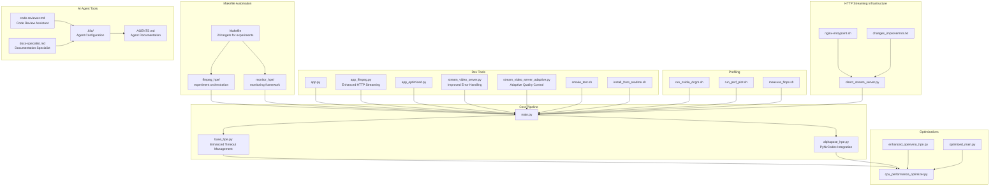
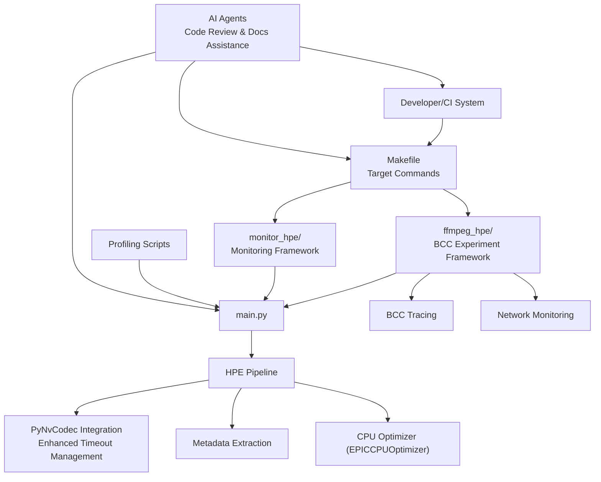
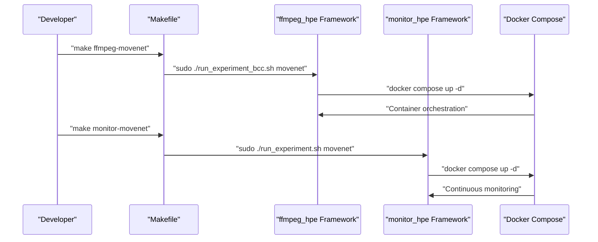
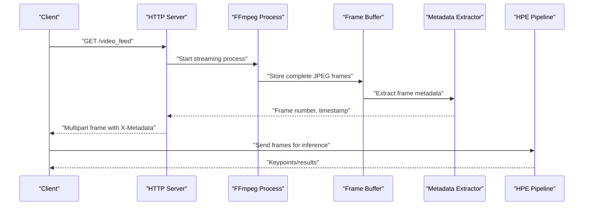
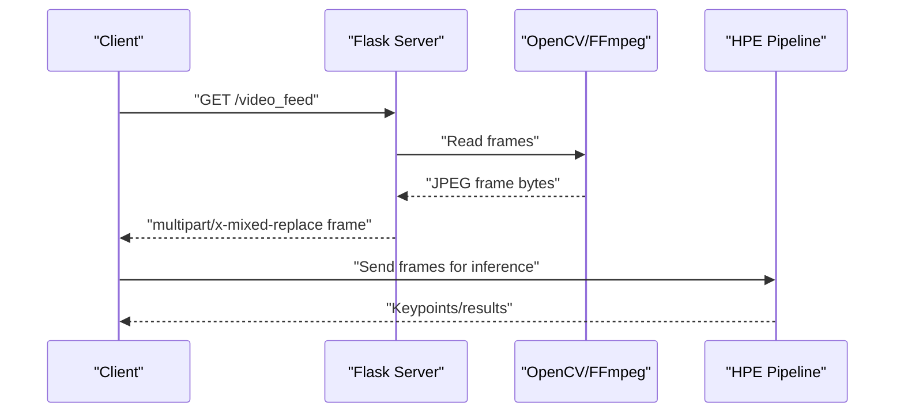
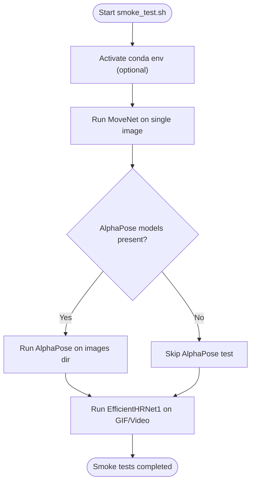
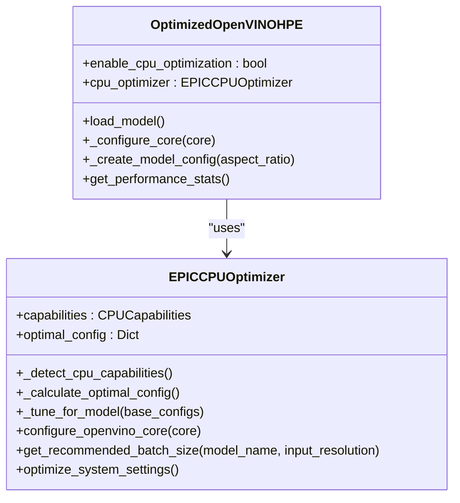
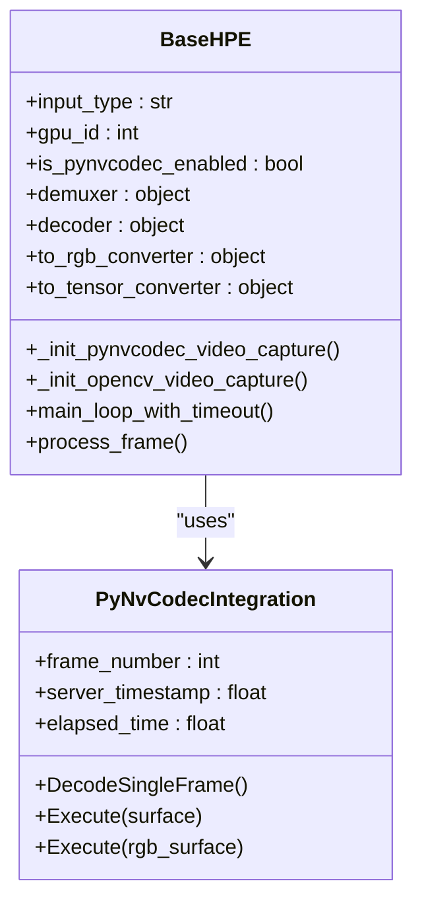
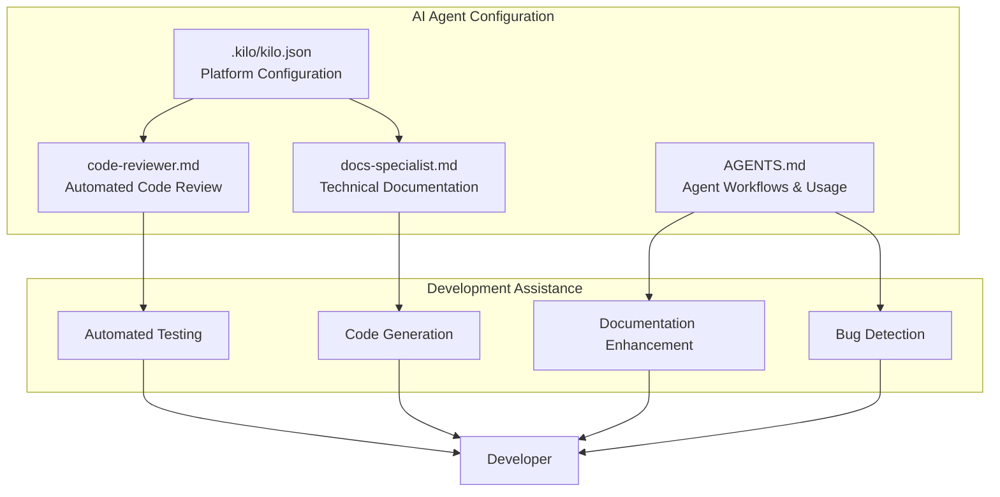

# Development Tools

<cite>
**Referenced Files in This Document**
- [README.md](file://dev_tools/README.md)
- [smoke_test.sh](file://dev_tools/smoke_test.sh)
- [install_from_readme.sh](file://dev_tools/install_from_readme.sh)
- [app.py](file://dev_tools/app.py)
- [app_ffmpeg.py](file://dev_tools/app_ffmpeg.py)
- [app_optimized.py](file://dev_tools/app_optimized.py)
- [stream_video_server.py](file://dev_tools/stream_video_server.py)
- [stream_video_server_adaptive.py](file://dev_tools/stream_video_server_adaptive.py)
- [main.py](file://main.py)
- [cpu_performance_optimizer.py](file://optimizations/cpu_performance_optimizer.py)
- [enhanced_openvino_hpe.py](file://optimizations/enhanced_openvino_hpe.py)
- [optimized_main.py](file://optimizations/optimized_main.py)
- [run_nvidia_dcgm.sh](file://Measure_gpu_dcgm/run_nvidia_dcgm.sh)
- [run_perf_plot.sh](file://Measure_plot_cpu_perf/run_perf_plot.sh)
- [measure_flops.sh](file://Measure_Flops/measure_flops.sh)
- [base_hpe.py](file://base_hpe.py)
- [alphapose_hpe.py](file://alphapose_hpe.py)
- [direct_stream_server.py](file://rtsp-ipcam/direct_stream_server.py)
- [nginx-entrypoint.sh](file://rtsp-ipcam/nginx-entrypoint.sh)
- [changes_improvemnts.txt](file://rtsp-ipcam/changes_improvemnts.txt)
- [Makefile](file://Makefile)
- [run_experiment_bcc.sh](file://ffmpeg_hpe/run_experiment_bcc.sh)
- [run_experiment.sh](file://ffmpeg_hpe/run_experiment.sh)
- [docker-compose.yaml](file://ffmpeg_hpe/docker-compose.yaml)
- [docker-compose.yaml](file://monitor_hpe/docker-compose.yaml)
- [bcc_rx_bytes.py](file://ffmpeg_hpe/bpftrace-tracer/bcc_rx_bytes.py)
- [monitor_pid.sh](file://monitor_hpe/monitor_pid.sh)
- [AGENTS.md](file://AGENTS.md)
- [kilo.json](file://.kilo/kilo.json)
- [code-reviewer.md](file://.kilo/agents/code-reviewer.md)
- [docs-specialist.md](file://.kilo/agents/docs-specialist.md)
</cite>

## Update Summary
**Changes Made**
- Enhanced HTTP streaming capabilities with improved PyNvCodec integration and timeout management
- Added comprehensive AI agent configuration tools for automated testing and development assistance
- Improved error handling and robustness in HTTP stream processing
- Enhanced development server implementations with better fallback mechanisms
- Added new development tools for AI agent configuration and automated testing workflows

## Table of Contents
1. [Introduction](#introduction)
2. [Project Structure](#project-structure)
3. [Core Components](#core-components)
4. [Architecture Overview](#architecture-overview)
5. [Detailed Component Analysis](#detailed-component-analysis)
6. [AI Agent Configuration Tools](#ai-agent-configuration-tools)
7. [Dependency Analysis](#dependency-analysis)
8. [Performance Considerations](#performance-considerations)
9. [Troubleshooting Guide](#troubleshooting-guide)
10. [Conclusion](#conclusion)
11. [Appendices](#appendices)

## Introduction
This document describes the development and testing utilities for the Human Pose Estimation (HPE) framework. It covers:
- Comprehensive Makefile automation for running experiments across all supported HPE methods
- Enhanced experiment orchestration system with standardized execution and parameter passing
- Smoke testing procedures to validate end-to-end functionality
- Model validation tools and performance profiling applications
- Development servers for testing video streaming, adaptive streaming, and optimization validation
- AI agent configuration tools for automated testing and development assistance
- Testing methodologies, validation scripts, and debugging tools
- Guidance on extending the framework, adding new HPE methods, and maintaining code quality

**Updated** The framework now includes enhanced HTTP streaming capabilities with improved PyNvCodec integration, better error handling, and timeout management. Additionally, new AI agent configuration tools have been added for automated testing and development assistance through the Kilo AI platform integration.

## Project Structure
The development tools are organized under the dev_tools directory and integrate with the main HPE pipeline, optimization modules, and comprehensive experiment orchestration systems. Key areas:
- Makefile automation for experiment execution and service building
- ffmpeg_hpe and monitor_hpe experiment frameworks with Docker Compose orchestration
- Development servers for MJPEG and adaptive streaming with enhanced error handling
- Validation and smoke testing scripts
- Performance profiling and monitoring utilities
- Enhanced HTTP streaming infrastructure with improved PyNvCodec integration and timeout management
- AI agent configuration tools for automated testing and development assistance
- Optimized OpenVINO HPE integration

**Diagram sources**
- [Makefile:1-121](file://Makefile#L1-L121)
- [run_experiment_bcc.sh:1-329](file://ffmpeg_hpe/run_experiment_bcc.sh#L1-L329)
- [run_experiment.sh:1-138](file://monitor_hpe/run_experiment.sh#L1-L138)
- [app.py:1-140](file://dev_tools/app.py#L1-L140)
- [app_ffmpeg.py:1-268](file://dev_tools/app_ffmpeg.py#L1-L268)
- [app_optimized.py:1-97](file://dev_tools/app_optimized.py#L1-L97)
- [stream_video_server.py:1-228](file://dev_tools/stream_video_server.py#L1-L228)
- [stream_video_server_adaptive.py:1-195](file://dev_tools/stream_video_server_adaptive.py#L1-L195)
- [smoke_test.sh:1-42](file://dev_tools/smoke_test.sh#L1-L42)
- [install_from_readme.sh:1-39](file://dev_tools/install_from_readme.sh#L1-L39)
- [main.py:1-243](file://main.py#L1-L243)
- [base_hpe.py:1-609](file://base_hpe.py#L1-L609)
- [alphapose_hpe.py:1-334](file://alphapose_hpe.py#L1-L334)
- [cpu_performance_optimizer.py:1-539](file://optimizations/cpu_performance_optimizer.py#L1-L539)
- [enhanced_openvino_hpe.py:1-333](file://optimizations/enhanced_openvino_hpe.py#L1-L333)
- [optimized_main.py:1-257](file://optimizations/optimized_main.py#L1-L257)
- [run_nvidia_dcgm.sh:1-29](file://Measure_gpu_dcgm/run_nvidia_dcgm.sh#L1-L29)
- [run_perf_plot.sh:1-25](file://Measure_plot_cpu_perf/run_perf_plot.sh#L1-L25)
- [measure_flops.sh](file://Measure_Flops/measure_flops.sh)
- [direct_stream_server.py:1-304](file://rtsp-ipcam/direct_stream_server.py#L1-L304)
- [nginx-entrypoint.sh:1-11](file://rtsp-ipcam/nginx-entrypoint.sh#L1-L11)
- [changes_improvemnts.txt](file://rtsp-ipcam/changes_improvemnts.txt)
- [AGENTS.md:1-306](file://AGENTS.md#L1-L306)
- [kilo.json:1-6](file://.kilo/kilo.json#L1-L6)
- [code-reviewer.md](file://.kilo/agents/code-reviewer.md)
- [docs-specialist.md](file://.kilo/agents/docs-specialist.md)

**Section sources**
- [README.md:1-102](file://dev_tools/README.md#L1-L102)
- [main.py:1-243](file://main.py#L1-L243)
- [Makefile:1-121](file://Makefile#L1-L121)
- [AGENTS.md:1-306](file://AGENTS.md#L1-L306)

## Core Components
- **Makefile Automation System**:
  - 24 comprehensive target commands for running experiments across all HPE methods (movenet, alphapose, openpose, hrnet, ae1-3)
  - Standardized Docker Compose orchestration for both ffmpeg_hpe and monitor_hpe frameworks
  - Individual service building targets for granular control over experiment environments
- **Enhanced Experiment Orchestration**:
  - ffmpeg_hpe: BCC tracing-enabled experiment framework with comprehensive metrics collection
  - monitor_hpe: Continuous monitoring framework with PID-based process tracking
  - Standardized parameter passing and environment variable management
- **Development servers for MJPEG streaming**:
  - app.py: Basic MJPEG server with OpenCV and Flask
  - app_ffmpeg.py: MJPEG server using ffmpeg for frame extraction with metadata injection and enhanced error handling
  - app_optimized.py: Optimized streaming with precise frame timing
  - stream_video_server.py: Development-only server with improved error handling, test patterns, and debug info
  - stream_video_server_adaptive.py: Adaptive server with JPEG quality and optional downscaling, enhanced fallback mechanisms
- **Enhanced HTTP streaming infrastructure**:
  - direct_stream_server.py: Direct H.264 streaming server with FFmpeg integration
  - nginx-entrypoint.sh: Nginx configuration template processing
  - changes_improvemnts.txt: HTTP streaming optimizations and client commands
- **AI Agent Configuration Tools**:
  - .kilo/: Kilo AI platform configuration with indexing enabled
  - AGENTS.md: Comprehensive documentation for AI agent workflows and development assistance
  - code-reviewer.md: AI-powered code review assistant for automated testing
  - docs-specialist.md: AI documentation specialist for technical writing assistance
- **Validation and smoke testing**:
  - smoke_test.sh: Automated smoke tests across multiple HPE methods
  - install_from_readme.sh: Environment setup aligned with README
- **Performance profiling**:
  - run_nvidia_dcgm.sh: GPU metrics logging via nvidia-smi
  - run_perf_plot.sh: CPU perf metrics collection and plotting
  - measure_flops.sh: FLOPs measurement utility
- **Optimized OpenVINO HPE**:
  - cpu_performance_optimizer.py: EPIC CPU optimizer with NUMA-aware tuning
  - enhanced_openvino_hpe.py: Enhanced OpenVINO HPE with CPU optimization
  - optimized_main.py: CLI wrapper enabling CPU optimization and benchmarking
- **Enhanced HPE processing**:
  - base_hpe.py: Base HPE class with PyNvCodec integration, enhanced timeout management, and improved error handling
  - alphapose_hpe.py: AlphaPose implementation with GPU acceleration, queue management, and PyNvCodec support

**Section sources**
- [Makefile:1-121](file://Makefile#L1-L121)
- [run_experiment_bcc.sh:1-329](file://ffmpeg_hpe/run_experiment_bcc.sh#L1-L329)
- [run_experiment.sh:1-138](file://monitor_hpe/run_experiment.sh#L1-L138)
- [app.py:1-140](file://dev_tools/app.py#L1-L140)
- [app_ffmpeg.py:1-268](file://dev_tools/app_ffmpeg.py#L1-L268)
- [app_optimized.py:1-97](file://dev_tools/app_optimized.py#L1-L97)
- [stream_video_server.py:1-228](file://dev_tools/stream_video_server.py#L1-L228)
- [stream_video_server_adaptive.py:1-195](file://dev_tools/stream_video_server_adaptive.py#L1-L195)
- [direct_stream_server.py:1-304](file://rtsp-ipcam/direct_stream_server.py#L1-L304)
- [nginx-entrypoint.sh:1-11](file://rtsp-ipcam/nginx-entrypoint.sh#L1-L11)
- [changes_improvemnts.txt](file://rtsp-ipcam/changes_improvemnts.txt)
- [smoke_test.sh:1-42](file://dev_tools/smoke_test.sh#L1-L42)
- [install_from_readme.sh:1-39](file://dev_tools/install_from_readme.sh#L1-L39)
- [run_nvidia_dcgm.sh:1-29](file://Measure_gpu_dcgm/run_nvidia_dcgm.sh#L1-L29)
- [run_perf_plot.sh:1-25](file://Measure_plot_cpu_perf/run_perf_plot.sh#L1-L25)
- [measure_flops.sh](file://Measure_Flops/measure_flops.sh)
- [cpu_performance_optimizer.py:1-539](file://optimizations/cpu_performance_optimizer.py#L1-L539)
- [enhanced_openvino_hpe.py:1-333](file://optimizations/enhanced_openvino_hpe.py#L1-L333)
- [optimized_main.py:1-257](file://optimizations/optimized_main.py#L1-L257)
- [base_hpe.py:1-609](file://base_hpe.py#L1-L609)
- [alphapose_hpe.py:1-334](file://alphapose_hpe.py#L1-L334)
- [AGENTS.md:1-306](file://AGENTS.md#L1-L306)
- [kilo.json:1-6](file://.kilo/kilo.json#L1-L6)

## Architecture Overview
The development tools integrate with the main HPE pipeline and provide comprehensive experiment automation through the Makefile system and enhanced orchestration frameworks, now enhanced with AI agent assistance:

**Diagram sources**
- [Makefile:1-121](file://Makefile#L1-L121)
- [run_experiment_bcc.sh:1-329](file://ffmpeg_hpe/run_experiment_bcc.sh#L1-L329)
- [run_experiment.sh:1-138](file://monitor_hpe/run_experiment.sh#L1-L138)
- [main.py:1-243](file://main.py#L1-L243)
- [base_hpe.py:1-609](file://base_hpe.py#L1-L609)
- [cpu_performance_optimizer.py:1-539](file://optimizations/cpu_performance_optimizer.py#L1-L539)
- [run_nvidia_dcgm.sh:1-29](file://Measure_gpu_dcgm/run_nvidia_dcgm.sh#L1-L29)
- [run_perf_plot.sh:1-25](file://Measure_plot_cpu_perf/run_perf_plot.sh#L1-L25)
- [bcc_rx_bytes.py:1-120](file://ffmpeg_hpe/bpftrace-tracer/bcc_rx_bytes.py#L1-L120)
- [AGENTS.md:1-306](file://AGENTS.md#L1-L306)

## Detailed Component Analysis

### Makefile Automation System
The comprehensive Makefile provides 24 target commands for streamlined experiment execution across all supported HPE methods with standardized Docker Compose orchestration.

**Diagram sources**
- [Makefile:8-27](file://Makefile#L8-L27)
- [Makefile:52-71](file://Makefile#L52-L71)
- [run_experiment_bcc.sh:1-329](file://ffmpeg_hpe/run_experiment_bcc.sh#L1-L329)
- [run_experiment.sh:1-138](file://monitor_hpe/run_experiment.sh#L1-L138)

Key features:
- **Standardized Experiment Execution**: 24 targets covering all HPE methods (movenet, alphapose, openpose, hrnet, ae1-3) for both ffmpeg_hpe and monitor_hpe frameworks
- **Individual Service Building**: Granular Docker Compose build targets for hpe, perf_monitor, bcc-tracer, gpu-metrics, and monitor services
- **Comprehensive Coverage**: Full support for all seven HPE methods (openpose, alphapose, movenet, hrnet, ae1, ae2, ae3)
- **Build Orchestration**: Unified build-all target for complete service deployment

**Section sources**
- [Makefile:1-121](file://Makefile#L1-L121)

### Enhanced HTTP Streaming Infrastructure
The HTTP streaming infrastructure has been significantly enhanced with optimized queue management, metadata extraction system, improved PyNvCodec integration, and robust timeout management.

**Diagram sources**
- [app_ffmpeg.py:87-187](file://dev_tools/app_ffmpeg.py#L87-L187)
- [base_hpe.py:72-86](file://base_hpe.py#L72-L86)
- [base_hpe.py:400-470](file://base_hpe.py#L400-L470)

Key enhancements:
- **Metadata Injection**: app_ffmpeg.py now injects frame numbers, server timestamps, and elapsed time into HTTP headers using X-Metadata
- **Queue Management**: Enhanced buffering system with proper frame boundary detection and incomplete frame handling
- **PyNvCodec Integration**: Improved hardware-accelerated video decoding with proper error handling and frame processing
- **HTTP Stream Processing**: Advanced HTTP MJPEG stream processing with frame skipping and timeout detection
- **Enhanced Timeout Management**: Robust timeout handling in base_hpe.py with configurable timeout_seconds and max_frames parameters
- **Improved Error Handling**: Better fallback mechanisms for video file availability and stream interruption

**Section sources**
- [app_ffmpeg.py:145-177](file://dev_tools/app_ffmpeg.py#L145-L177)
- [base_hpe.py:72-86](file://base_hpe.py#L72-L86)
- [base_hpe.py:317-471](file://base_hpe.py#L317-L471)

### Development Servers for Video Streaming
These servers simulate IP camera feeds and validate HPE inference on MJPEG streams with enhanced error handling and adaptive quality control.

**Diagram sources**
- [app.py:45-102](file://dev_tools/app.py#L45-L102)
- [app_ffmpeg.py:69-169](file://dev_tools/app_ffmpeg.py#L69-L169)
- [app_optimized.py:19-76](file://dev_tools/app_optimized.py#L19-L76)
- [stream_video_server.py:100-172](file://dev_tools/stream_video_server.py#L100-L172)
- [stream_video_server_adaptive.py:56-150](file://dev_tools/stream_video_server_adaptive.py#L56-L150)

Key behaviors:
- app.py: Reads frames, encodes JPEG, yields multipart frames, logs initialization and errors
- app_ffmpeg.py: Uses ffmpeg to extract MJPEG frames, scales resolution, logs video details via ffprobe, injects metadata, enhanced error handling
- app_optimized.py: Precise frame timing using time.perf_counter and sleep to match FPS
- stream_video_server.py: Development-only server with improved error handling, test pattern fallback, debug info, and video property initialization
- stream_video_server_adaptive.py: Adaptive JPEG quality and optional downscaling for HD, enhanced fallback mechanisms, end frame generation

Validation steps:
- Start server and navigate to root or /video_feed
- Verify MJPEG stream in browser or VLC
- Confirm frame rate and resolution match expectations
- Use HEAD requests to probe headers without payload
- Test fallback mechanisms when video files are unavailable

**Section sources**
- [app.py:1-140](file://dev_tools/app.py#L1-L140)
- [app_ffmpeg.py:1-268](file://dev_tools/app_ffmpeg.py#L1-L268)
- [app_optimized.py:1-97](file://dev_tools/app_optimized.py#L1-L97)
- [stream_video_server.py:1-228](file://dev_tools/stream_video_server.py#L1-L228)
- [stream_video_server_adaptive.py:1-195](file://dev_tools/stream_video_server_adaptive.py#L1-L195)

### Model Validation and Smoke Testing
Automated smoke tests validate end-to-end inference across multiple HPE methods.

**Diagram sources**
- [smoke_test.sh:23-41](file://dev_tools/smoke_test.sh#L23-L41)

Execution:
- Ensure environment is prepared using install_from_readme.sh
- Run smoke_test.sh with optional device and environment name
- Validate outputs (saved images/videos, JSON/CSV exports if enabled)

**Section sources**
- [smoke_test.sh:1-42](file://dev_tools/smoke_test.sh#L1-L42)
- [install_from_readme.sh:1-39](file://dev_tools/install_from_readme.sh#L1-L39)

### Performance Profiling Applications
GPU and CPU profiling utilities collect runtime metrics for performance analysis.

**Diagram sources**
- [run_nvidia_dcgm.sh:1-29](file://Measure_gpu_dcgm/run_nvidia_dcgm.sh#L1-L29)
- [run_perf_plot.sh:1-25](file://Measure_plot_cpu_perf/run_perf_plot.sh#L1-L25)

Usage:
- GPU: Launch run_nvidia_dcgm.sh; metrics written to CSV; stop on user input
- CPU: Ensure PIDs file exists; run run_perf_plot.sh to collect and plot perf metrics

**Section sources**
- [run_nvidia_dcgm.sh:1-29](file://Measure_gpu_dcgm/run_nvidia_dcgm.sh#L1-L29)
- [run_perf_plot.sh:1-25](file://Measure_plot_cpu_perf/run_perf_plot.sh#L1-L25)
- [measure_flops.sh](file://Measure_Flops/measure_flops.sh)

### Optimized OpenVINO HPE
Intelligent CPU optimization for EPIC processors improves throughput and latency.

**Diagram sources**
- [cpu_performance_optimizer.py:20-539](file://optimizations/cpu_performance_optimizer.py#L20-L539)
- [enhanced_openvino_hpe.py:25-333](file://optimizations/enhanced_openvino_hpe.py#L25-L333)

Key features:
- EPICCPUOptimizer detects CPU capabilities and calculates optimal OpenVINO configuration
- OptimizedOpenVINOHPE integrates CPU optimization into OpenVINO HPE loading and model creation
- optimized_main.py provides CLI toggles to enable CPU optimization and run benchmarks

**Section sources**
- [cpu_performance_optimizer.py:1-539](file://optimizations/cpu_performance_optimizer.py#L1-L539)
- [enhanced_openvino_hpe.py:1-333](file://optimizations/enhanced_openvino_hpe.py#L1-L333)
- [optimized_main.py:1-257](file://optimizations/optimized_main.py#L1-L257)

### Enhanced HPE Processing with PyNvCodec
The base HPE class now includes comprehensive PyNvCodec integration for hardware-accelerated video processing with enhanced timeout management and error handling.

**Diagram sources**
- [base_hpe.py:16-21](file://base_hpe.py#L16-L21)
- [base_hpe.py:274-294](file://base_hpe.py#L274-L294)
- [base_hpe.py:351-387](file://base_hpe.py#L351-L387)

Key enhancements:
- **Hardware Acceleration**: PyNvCodec integration for NV12 surface to RGB conversion and tensor processing
- **Metadata Extraction**: Frame number and timestamp extraction from HTTP headers using regex patterns
- **Queue Management**: Enhanced frame processing with proper buffer management and frame skipping
- **Error Handling**: Robust error handling for PyNvCodec decoding failures and HTTP stream interruptions
- **Timeout Management**: Enhanced timeout handling with configurable timeout_seconds and max_frames parameters
- **Consecutive Failure Detection**: Improved stream interruption detection with max_consecutive_failures threshold

**Section sources**
- [base_hpe.py:16-21](file://base_hpe.py#L16-L21)
- [base_hpe.py:274-294](file://base_hpe.py#L274-L294)
- [base_hpe.py:351-387](file://base_hpe.py#L351-L387)
- [base_hpe.py:72-86](file://base_hpe.py#L72-L86)

## AI Agent Configuration Tools
The framework now includes comprehensive AI agent configuration tools for automated testing and development assistance through the Kilo AI platform integration.

**Diagram sources**
- [kilo.json:1-6](file://.kilo/kilo.json#L1-L6)
- [code-reviewer.md](file://.kilo/agents/code-reviewer.md)
- [docs-specialist.md](file://.kilo/agents/docs-specialist.md)
- [AGENTS.md:1-306](file://AGENTS.md#L1-L306)

Key features:
- **Kilo AI Platform Integration**: .kilo/kilo.json enables indexing for AI-powered code assistance
- **Code Review Assistant**: AI-powered automated code review for testing and validation
- **Documentation Specialist**: AI documentation enhancement for technical writing assistance
- **Agent Workflows**: Comprehensive documentation in AGENTS.md for AI agent integration and usage
- **Automated Testing Support**: AI-assisted testing workflows and development assistance

**Section sources**
- [kilo.json:1-6](file://.kilo/kilo.json#L1-L6)
- [code-reviewer.md](file://.kilo/agents/code-reviewer.md)
- [docs-specialist.md](file://.kilo/agents/docs-specialist.md)
- [AGENTS.md:1-306](file://AGENTS.md#L1-L306)

## Dependency Analysis
The development tools depend on:
- Flask and OpenCV for MJPEG streaming
- ffmpeg/ffprobe for frame extraction and metadata logging
- OpenVINO for optimized HPE inference
- PyNvCodec for hardware-accelerated video decoding
- psutil and platform for CPU capability detection
- NVIDIA DCGM and perf for profiling
- BCC (BPF Compiler Collection) for network traffic analysis
- Docker Compose for container orchestration
- Kilo AI platform for automated testing and development assistance
- AI agents for code review and documentation enhancement

```mermaid
graph TB
Flask["Flask"]
OpenCV["OpenCV"]
FFmpeg["ffmpeg/ffprobe"]
OpenVINO["OpenVINO"]
PyNvCodec["PyNvCodec"]
PSUtil["psutil/platform"]
DCGM["nvidia-smi"]
Perf["perf"]
BCC["BCC/BPF"]
Docker["Docker Compose"]
Make["Makefile Targets"]
AI["AI Agents"]
Kilo["Kilo AI Platform"]
app_py["app.py"] --> Flask
app_py --> OpenCV
app_ffmpeg["app_ffmpeg.py"] --> Flask
app_ffmpeg --> FFmpeg
app_optimized["app_optimized.py"] --> Flask
app_optimized --> OpenCV
stream_dev["stream_video_server.py"] --> Flask
stream_dev --> OpenCV
stream_adapt["stream_video_server_adaptive.py"] --> Flask
stream_adapt --> OpenCV
main_mod["main.py"] --> OpenVINO
base_hpe["base_hpe.py"] --> PyNvCodec
alphapose_hpe["alphapose_hpe.py"] --> PyNvCodec
cpu_opt["cpu_performance_optimizer.py"] --> PSUtil
prof_gpu["run_nvidia_dcgm.sh"] --> DCGM
prof_cpu["run_perf_plot.sh"] --> Perf
Make --> Docker
Docker --> BCC
AI --> Kilo
```

**Diagram sources**
- [app.py:1-140](file://dev_tools/app.py#L1-L140)
- [app_ffmpeg.py:1-268](file://dev_tools/app_ffmpeg.py#L1-L268)
- [app_optimized.py:1-97](file://dev_tools/app_optimized.py#L1-L97)
- [stream_video_server.py:1-228](file://dev_tools/stream_video_server.py#L1-L228)
- [stream_video_server_adaptive.py:1-195](file://dev_tools/stream_video_server_adaptive.py#L1-L195)
- [main.py:1-243](file://main.py#L1-L243)
- [base_hpe.py:1-609](file://base_hpe.py#L1-L609)
- [alphapose_hpe.py:1-334](file://alphapose_hpe.py#L1-L334)
- [cpu_performance_optimizer.py:1-539](file://optimizations/cpu_performance_optimizer.py#L1-L539)
- [run_nvidia_dcgm.sh:1-29](file://Measure_gpu_dcgm/run_nvidia_dcgm.sh#L1-L29)
- [run_perf_plot.sh:1-25](file://Measure_plot_cpu_perf/run_perf_plot.sh#L1-L25)
- [Makefile:1-121](file://Makefile#L1-L121)
- [kilo.json:1-6](file://.kilo/kilo.json#L1-L6)

**Section sources**
- [main.py:1-243](file://main.py#L1-L243)
- [base_hpe.py:1-609](file://base_hpe.py#L1-L609)
- [alphapose_hpe.py:1-334](file://alphapose_hpe.py#L1-L334)
- [cpu_performance_optimizer.py:1-539](file://optimizations/cpu_performance_optimizer.py#L1-L539)
- [Makefile:1-121](file://Makefile#L1-L121)
- [AGENTS.md:1-306](file://AGENTS.md#L1-L306)

## Performance Considerations
- **Makefile Automation Benefits**:
  - Streamlined experiment execution reduces manual overhead and ensures consistent parameter passing
  - Standardized Docker Compose orchestration eliminates configuration drift between experiments
  - Granular service building enables targeted development and testing workflows
- **Streaming servers**:
  - app_ffmpeg.py leverages ffmpeg for robust MJPEG extraction and scaling with metadata injection and enhanced error handling
  - app_optimized.py ensures frame timing matches video FPS precisely
  - stream_video_server_adaptive.py balances quality and performance with JPEG quality and optional downscaling
  - Enhanced HTTP streaming infrastructure provides optimized queue management, metadata extraction, and PyNvCodec integration
  - Improved error handling and fallback mechanisms ensure reliable operation even with missing video files
- **CPU optimization**:
  - EPICCPUOptimizer applies NUMA-aware thread allocation, memory bandwidth optimization, and workload-specific tuning
  - OptimizedOpenVINOHPE integrates optimized configuration into OpenVINO model loading
  - PyNvCodec integration provides hardware-accelerated video decoding for improved performance
- **Profiling**:
  - Use run_nvidia_dcgm.sh for GPU utilization and temperature metrics
  - Use run_perf_plot.sh for CPU perf metrics collection and visualization
- **Experiment Orchestration**:
  - ffmpeg_hpe framework provides comprehensive metrics collection with BCC tracing and network analysis
  - monitor_hpe framework offers continuous monitoring capabilities for long-running experiments
  - Both frameworks ensure proper resource isolation and result organization
- **AI Agent Integration**:
  - Kilo AI platform provides automated testing and development assistance
  - AI agents enhance code review and documentation workflows
  - Agent configuration enables intelligent development assistance

**Updated** The Makefile automation system significantly improves development workflow efficiency by providing:
- 24 standardized target commands for all HPE methods
- Unified Docker Compose orchestration across both experiment frameworks
- Granular service building for targeted development and testing
- Standardized parameter passing and environment variable management
- Enhanced HTTP streaming capabilities with improved PyNvCodec integration and timeout management
- AI agent configuration tools for automated testing and development assistance

## Troubleshooting Guide
Common issues and resolutions:
- **Makefile Target Issues**:
  - Ensure Docker and Docker Compose are properly installed and configured
  - Verify sudo privileges for Docker operations
  - Check that required environment variables (VIDEO_FILE, HPE_DEVICE) are set
- **Experiment Framework Problems**:
  - ffmpeg_hpe: Verify BCC tracer installation and kernel module availability
  - monitor_hpe: Ensure bpftrace is available and properly configured
  - Both frameworks: Check network connectivity between containers and streaming server
- **Video not found or cannot open**:
  - stream_video_server.py and stream_video_server_adaptive.py now include improved error handling and test pattern fallback
  - app.py logs absolute path and existence checks; ensure VIDEO_PATH is correct
  - Enhanced fallback mechanisms ensure reliable operation even with missing video files
- **FFmpeg not found**:
  - app_ffmpeg.py logs missing ffmpeg and skips detailed logging; install ffmpeg and ensure it is in PATH
  - Enhanced error handling provides better feedback for missing dependencies
- **Inference performance**:
  - Use optimized_main.py with --enable-cpu-opt to apply EPIC CPU optimizations
  - Run benchmarks with --benchmark to compare standard vs optimized FPS
  - Enable PyNvCodec for hardware-accelerated video decoding when available
- **GPU metrics**:
  - run_nvidia_dcgm.sh writes CSV; verify permissions and output directory
- **CPU metrics**:
  - run_perf_plot.sh reads PIDs from file; ensure PID file exists and processes are running
- **HTTP streaming issues**:
  - Check metadata extraction with X-Metadata headers in HTTP responses
  - Verify frame boundary detection and buffer management in HTTP MJPEG streams
  - Ensure proper frame skipping and timeout handling for interrupted streams
  - Enhanced timeout management provides better control over stream processing
- **BCC Tracing Issues**:
  - Verify kernel headers are available for BCC compilation
  - Check that the bcc-tracer container has proper privileges and access to /sys/kernel/debug
  - Ensure network namespaces are properly configured for container communication
- **AI Agent Configuration Issues**:
  - Verify Kilo AI platform configuration in .kilo/kilo.json
  - Check agent availability and proper authentication
  - Ensure AI agent tools are properly integrated into development workflows
- **PyNvCodec Integration Issues**:
  - Verify PyNvCodec installation and compatibility with CUDA version
  - Check GPU availability and proper driver configuration
  - Ensure proper error handling for PyNvCodec decoding failures

**Section sources**
- [Makefile:94-121](file://Makefile#L94-L121)
- [run_experiment_bcc.sh:32-54](file://ffmpeg_hpe/run_experiment_bcc.sh#L32-L54)
- [run_experiment.sh:69-70](file://monitor_hpe/run_experiment.sh#L69-L70)
- [stream_video_server.py:108-132](file://dev_tools/stream_video_server.py#L108-L132)
- [stream_video_server_adaptive.py:59-79](file://dev_tools/stream_video_server_adaptive.py#L59-L79)
- [app.py:12-21](file://dev_tools/app.py#L12-L21)
- [app_ffmpeg.py:54-66](file://dev_tools/app_ffmpeg.py#L54-L66)
- [optimized_main.py:201-246](file://optimizations/optimized_main.py#L201-L246)
- [run_nvidia_dcgm.sh:1-29](file://Measure_gpu_dcgm/run_nvidia_dcgm.sh#L1-L29)
- [run_perf_plot.sh:1-25](file://Measure_plot_cpu_perf/run_perf_plot.sh#L1-L25)
- [base_hpe.py:72-86](file://base_hpe.py#L72-L86)
- [bcc_rx_bytes.py:1-120](file://ffmpeg_hpe/bpftrace-tracer/bcc_rx_bytes.py#L1-L120)
- [AGENTS.md:1-306](file://AGENTS.md#L1-L306)

## Conclusion
The development tools provide a comprehensive toolkit for validating and optimizing HPE inference with enhanced automation, orchestration capabilities, and AI assistance:
- **Makefile Automation**: Streamlined experiment execution across all HPE methods with 24 standardized targets
- **Enhanced Experiment Frameworks**: ffmpeg_hpe with BCC tracing and monitor_hpe with continuous monitoring
- **Streaming servers**: Enable end-to-end testing of MJPEG-based inputs with metadata extraction and improved error handling
- **Smoke tests**: Automate validation across multiple HPE methods
- **CPU/GPU profiling**: Support performance analysis with comprehensive metrics collection
- **Optimized OpenVINO HPE**: Deliver significant performance gains on EPIC processors
- **Enhanced HTTP streaming**: Provide optimized queue management, metadata extraction, PyNvCodec integration, and robust timeout management
- **AI Agent Integration**: Automated testing and development assistance through Kilo AI platform
- **Comprehensive AI Tools**: Code review assistance, documentation enhancement, and intelligent development workflows

**Updated** The comprehensive Makefile system with 24 target commands and enhanced experiment orchestration significantly improves development workflow efficiency, providing standardized execution patterns and unified Docker Compose integration across all supported HPE methods and experimental frameworks. The addition of AI agent configuration tools further enhances development productivity through automated testing and intelligent assistance.

## Appendices

### Development Workflow and Quality Assurance
- **Environment setup**:
  - Use install_from_readme.sh to create and populate the environment
  - Ensure Docker and Docker Compose are properly installed for experiment orchestration
  - Configure AI agent tools through .kilo/kilo.json for automated assistance
- **Makefile-based Experimentation**:
  - Use ffmpeg-movenet, ffmpeg-alphapose, etc. for BCC-enabled experiments
  - Use monitor-movenet, monitor-alphapose, etc. for continuous monitoring experiments
  - Leverage individual build targets for granular service development
- **Smoke testing**:
  - Run smoke_test.sh to validate MoveNet, AlphaPose, and EfficientHRNet1
  - Utilize AI agents for automated testing and validation assistance
- **Streaming validation**:
  - Start any development server and verify MJPEG output in browser/VLC
  - Test HTTP streaming with metadata extraction capabilities and PyNvCodec integration
  - Validate enhanced error handling and fallback mechanisms
- **Optimization validation**:
  - Use optimized_main.py with --enable-cpu-opt and --benchmark to assess improvements
  - Enable hardware acceleration with PyNvCodec when available
  - Monitor performance improvements with AI-assisted analysis
- **Profiling**:
  - Collect GPU metrics with run_nvidia_dcgm.sh and CPU metrics with run_perf_plot.sh
  - Utilize AI agents for performance analysis and optimization recommendations
- **Experiment Result Analysis**:
  - Both ffmpeg_hpe and monitor_hpe frameworks provide structured result organization
  - BCC tracing enables network traffic analysis and optimization validation
  - AI agents assist in result interpretation and performance optimization

**Section sources**
- [install_from_readme.sh:1-39](file://dev_tools/install_from_readme.sh#L1-L39)
- [smoke_test.sh:1-42](file://dev_tools/smoke_test.sh#L1-L42)
- [optimized_main.py:1-257](file://optimizations/optimized_main.py#L1-L257)
- [run_nvidia_dcgm.sh:1-29](file://Measure_gpu_dcgm/run_nvidia_dcgm.sh#L1-L29)
- [run_perf_plot.sh:1-25](file://Measure_plot_cpu_perf/run_perf_plot.sh#L1-L25)
- [Makefile:94-121](file://Makefile#L94-L121)
- [AGENTS.md:1-306](file://AGENTS.md#L1-L306)

### Extending the Framework and Adding New HPE Methods
- **Add new HPE method**:
  - Implement a new HPE class similar to existing ones and register it in main.py
  - Ensure CLI argument parsing supports the new method with choices ['openpose', 'alphapose', 'movenet', 'hrnet', 'ae1', 'ae2', 'ae3']
  - Integrate PyNvCodec support for hardware acceleration when applicable
  - Implement enhanced timeout management and error handling
- **Makefile Integration**:
  - Add new target commands following the established patterns (ffmpeg-{method}, monitor-{method})
  - Ensure proper Docker Compose integration and parameter passing
  - Integrate AI agent configuration for automated testing workflows
- **Streaming validation**:
  - Use development servers to validate MJPEG input for the new method
  - Test HTTP streaming with metadata extraction capabilities and enhanced error handling
  - Validate adaptive quality control and fallback mechanisms
- **Optimization**:
  - Integrate CPU optimization via OptimizedOpenVINOHPE if applicable
  - Leverage hardware acceleration with PyNvCodec when available
  - Utilize AI agents for performance optimization recommendations
- **Testing**:
  - Extend smoke_test.sh to include the new method in automated validation
  - Test enhanced HTTP streaming infrastructure with the new HPE method
  - Utilize Makefile targets for standardized experiment execution
  - Integrate AI agents for automated testing and validation assistance

**Section sources**
- [main.py:191-228](file://main.py#L191-L228)
- [enhanced_openvino_hpe.py:25-66](file://optimizations/enhanced_openvino_hpe.py#L25-L66)
- [base_hpe.py:147-185](file://base_hpe.py#L147-L185)
- [alphapose_hpe.py:33-66](file://alphapose_hpe.py#L33-L66)
- [Makefile:8-27](file://Makefile#L8-L27)
- [Makefile:52-71](file://Makefile#L52-L71)
- [AGENTS.md:1-306](file://AGENTS.md#L1-L306)

### HTTP Streaming Infrastructure Configuration
The HTTP streaming infrastructure provides flexible configuration options for different deployment scenarios with enhanced capabilities:

- **Direct H.264 Streaming**: Uses FFmpeg to convert video files to H.264 streams with configurable bitrate and resolution
- **MJPEG Streaming**: Provides HTTP MJPEG streams with metadata injection for frame tracking and enhanced error handling
- **Adaptive Quality**: Automatically adjusts JPEG quality based on video resolution for optimal performance with fallback mechanisms
- **Nginx Integration**: Template-based Nginx configuration for production deployments
- **BCC Tracing Integration**: Network traffic analysis for performance optimization and troubleshooting
- **Enhanced Timeout Management**: Configurable timeout handling for robust stream processing
- **AI-Assisted Monitoring**: Integration with AI agents for automated stream quality assessment and optimization

**Section sources**
- [direct_stream_server.py:74-133](file://rtsp-ipcam/direct_stream_server.py#L74-L133)
- [nginx-entrypoint.sh:4-11](file://rtsp-ipcam/nginx-entrypoint.sh#L4-L11)
- [changes_improvemnts.txt](file://rtsp-ipcam/changes_improvemnts.txt)
- [bcc_rx_bytes.py:1-120](file://ffmpeg_hpe/bpftrace-tracer/bcc_rx_bytes.py#L1-L120)
- [base_hpe.py:295-461](file://base_hpe.py#L295-L461)
- [AGENTS.md:1-306](file://AGENTS.md#L1-L306)