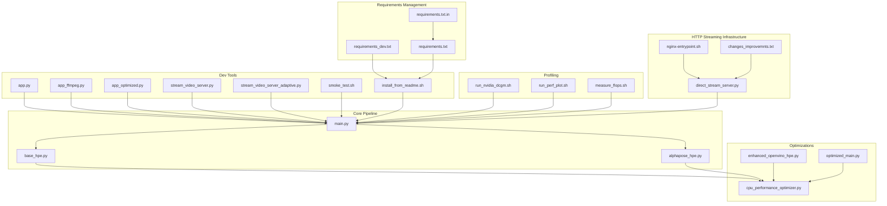
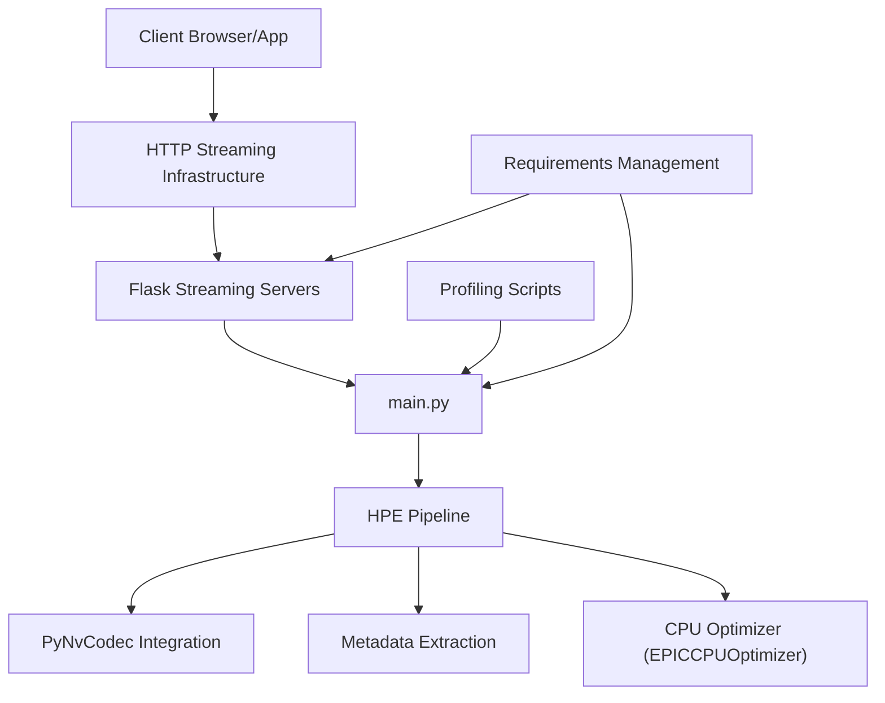
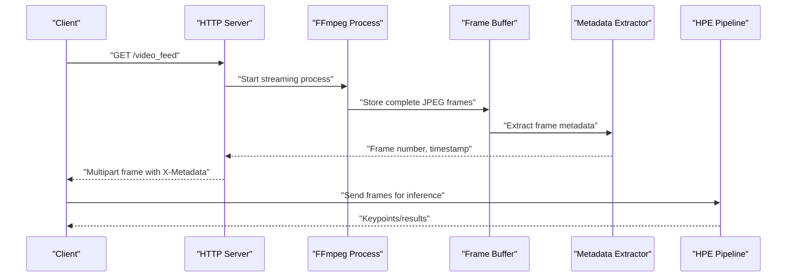
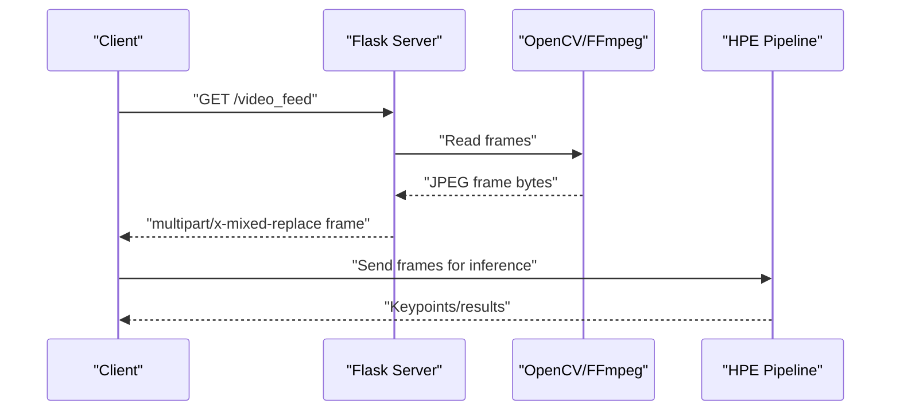
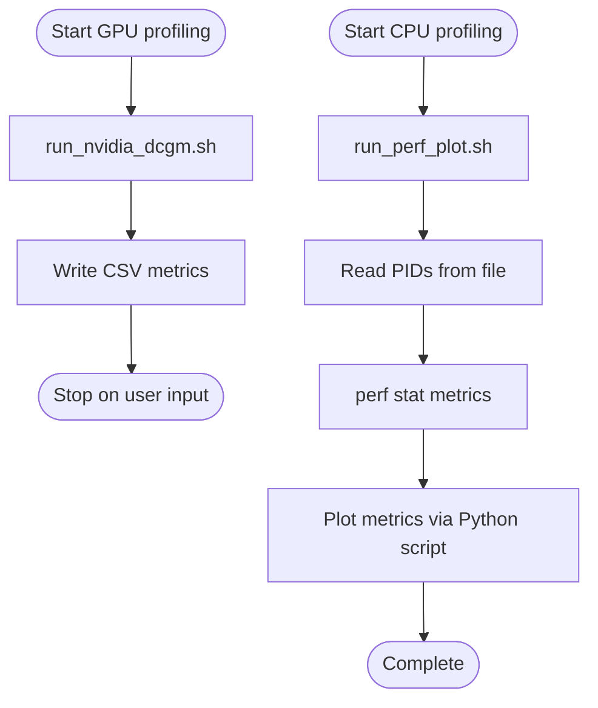
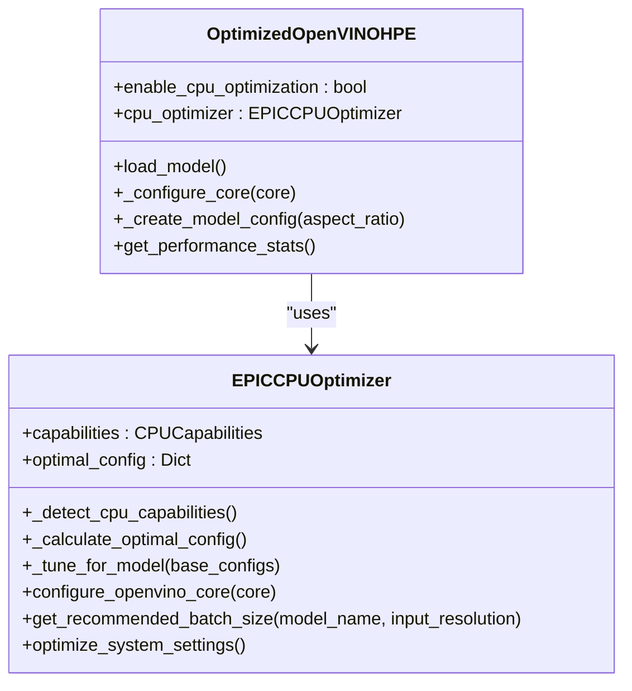
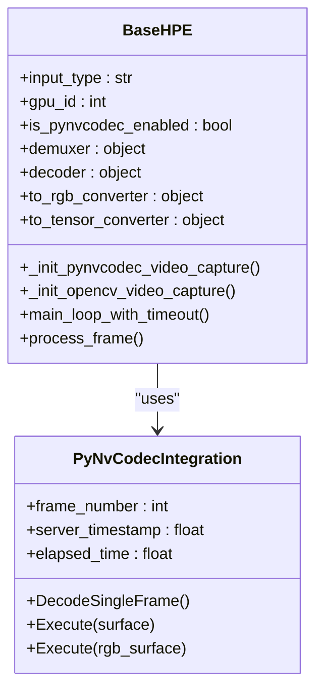
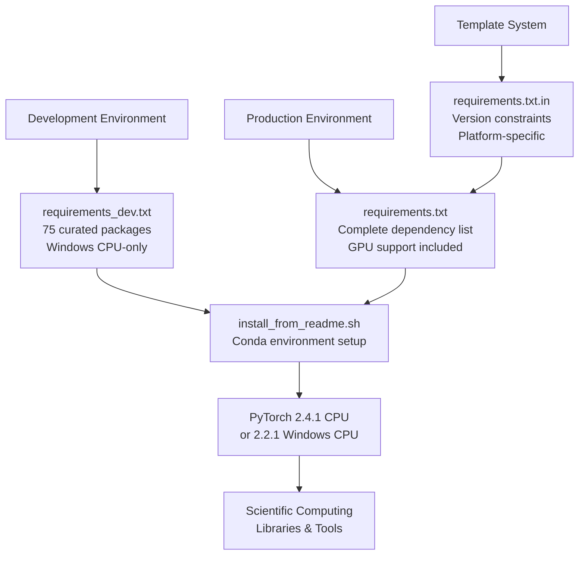
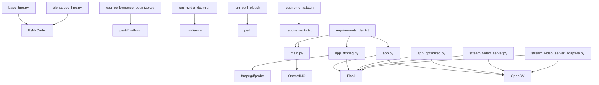

# Development Tools

<cite>
**Referenced Files in This Document**
- [README.md](file://dev_tools/README.md)
- [requirements_dev.txt](file://requirements_dev.txt)
- [requirements.txt](file://requirements.txt)
- [requirements.txt.in](file://requirements.txt.in)
- [install_from_readme.sh](file://dev_tools/install_from_readme.sh)
- [smoke_test.sh](file://dev_tools/smoke_test.sh)
- [app.py](file://dev_tools/app.py)
- [app_ffmpeg.py](file://dev_tools/app_ffmpeg.py)
- [app_optimized.py](file://dev_tools/app_optimized.py)
- [stream_video_server.py](file://dev_tools/stream_video_server.py)
- [stream_video_server_adaptive.py](file://dev_tools/stream_video_server_adaptive.py)
- [main.py](file://main.py)
- [cpu_performance_optimizer.py](file://optimizations/cpu_performance_optimizer.py)
- [enhanced_openvino_hpe.py](file://optimizations/enhanced_openvino_hpe.py)
- [optimized_main.py](file://optimizations/optimized_main.py)
- [run_nvidia_dcgm.sh](file://Measure_gpu_dcgm/run_nvidia_dcgm.sh)
- [run_perf_plot.sh](file://Measure_plot_cpu_perf/run_perf_plot.sh)
- [measure_flops.sh](file://Measure_Flops/measure_flops.sh)
- [base_hpe.py](file://base_hpe.py)
- [alphapose_hpe.py](file://alphapose_hpe.py)
- [direct_stream_server.py](file://rtsp-ipcam/direct_stream_server.py)
- [nginx-entrypoint.sh](file://rtsp-ipcam/nginx-entrypoint.sh)
- [changes_improvemnts.txt](file://rtsp-ipcam/changes_improvemnts.txt)
</cite>

## Update Summary
**Changes Made**
- Updated development environment setup to focus on essential tools, scientific computing libraries, and CPU-only PyTorch installation
- Added requirements_dev.txt with 75 carefully curated packages for Windows-based development without GPU requirements
- Removed references to legacy PowerShell build scripts and Windows-specific development tools
- Enhanced development server implementations for testing video streaming, adaptive streaming capabilities, and optimization validation
- Updated model validation tools and performance profiling applications to align with new requirements structure

## Table of Contents
1. [Introduction](#introduction)
2. [Project Structure](#project-structure)
3. [Core Components](#core-components)
4. [Architecture Overview](#architecture-overview)
5. [Detailed Component Analysis](#detailed-component-analysis)
6. [Dependency Analysis](#dependency-analysis)
7. [Performance Considerations](#performance-considerations)
8. [Troubleshooting Guide](#troubleshooting-guide)
9. [Conclusion](#conclusion)
10. [Appendices](#appendices)

## Introduction
This document describes the development and testing utilities for the Human Pose Estimation (HPE) framework. It covers:
- Smoke testing procedures to validate end-to-end functionality
- Model validation tools and performance profiling applications
- Development servers for testing video streaming, adaptive streaming, and optimization validation
- Testing methodologies, validation scripts, and debugging tools
- Guidance on extending the framework, adding new HPE methods, and maintaining code quality

**Updated** Development environment setup now focuses on essential tools, scientific computing libraries, and CPU-only PyTorch installation for Windows-based development without GPU requirements. The requirements structure has been streamlined with requirements_dev.txt providing curated packages for development.

## Project Structure
The development tools are organized under the dev_tools directory and integrate with the main HPE pipeline and optimization modules. Key areas:
- Development servers for MJPEG and adaptive streaming
- Validation and smoke testing scripts
- Performance profiling and monitoring utilities
- Optimized OpenVINO HPE integration
- HTTP streaming infrastructure with enhanced metadata extraction

**Diagram sources**
- [app.py:1-140](file://dev_tools/app.py#L1-L140)
- [app_ffmpeg.py:1-268](file://dev_tools/app_ffmpeg.py#L1-L268)
- [app_optimized.py:1-97](file://dev_tools/app_optimized.py#L1-L97)
- [stream_video_server.py:1-228](file://dev_tools/stream_video_server.py#L1-L228)
- [stream_video_server_adaptive.py:1-195](file://dev_tools/stream_video_server_adaptive.py#L1-L195)
- [smoke_test.sh:1-42](file://dev_tools/smoke_test.sh#L1-L42)
- [install_from_readme.sh:1-39](file://dev_tools/install_from_readme.sh#L1-L39)
- [main.py:1-242](file://main.py#L1-L242)
- [base_hpe.py:1-630](file://base_hpe.py#L1-L630)
- [alphapose_hpe.py:1-334](file://alphapose_hpe.py#L1-L334)
- [cpu_performance_optimizer.py:1-539](file://optimizations/cpu_performance_optimizer.py#L1-L539)
- [enhanced_openvino_hpe.py:1-333](file://optimizations/enhanced_openvino_hpe.py#L1-L333)
- [optimized_main.py:1-257](file://optimizations/optimized_main.py#L1-L257)
- [run_nvidia_dcgm.sh:1-29](file://Measure_gpu_dcgm/run_nvidia_dcgm.sh#L1-L29)
- [run_perf_plot.sh:1-25](file://Measure_plot_cpu_perf/run_perf_plot.sh#L1-L25)
- [measure_flops.sh](file://Measure_Flops/measure_flops.sh)
- [requirements_dev.txt:1-76](file://requirements_dev.txt#L1-L76)
- [requirements.txt:1-100](file://requirements.txt#L1-L100)
- [requirements.txt.in:1-78](file://requirements.txt.in#L1-L78)
- [direct_stream_server.py:1-304](file://rtsp-ipcam/direct_stream_server.py#L1-L304)
- [nginx-entrypoint.sh:1-11](file://rtsp-ipcam/nginx-entrypoint.sh#L1-L11)
- [changes_improvemnts.txt](file://rtsp-ipcam/changes_improvemnts.txt)

**Section sources**
- [README.md:1-102](file://dev_tools/README.md#L1-L102)
- [main.py:1-242](file://main.py#L1-L242)

## Core Components
- Development servers for MJPEG streaming:
  - app.py: Basic MJPEG server with OpenCV and Flask
  - app_ffmpeg.py: MJPEG server using ffmpeg for frame extraction with metadata injection
  - app_optimized.py: Optimized streaming with precise frame timing
  - stream_video_server.py: Development-only server with test patterns and debug info
  - stream_video_server_adaptive.py: Adaptive server with JPEG quality and optional downscaling
- HTTP streaming infrastructure:
  - direct_stream_server.py: Direct H.264 streaming server with FFmpeg integration
  - nginx-entrypoint.sh: Nginx configuration template processing
  - changes_improvemnts.txt: HTTP streaming optimizations and client commands
- Validation and smoke testing:
  - smoke_test.sh: Automated smoke tests across multiple HPE methods
  - install_from_readme.sh: Environment setup aligned with README using conda and curated requirements
- Performance profiling:
  - run_nvidia_dcgm.sh: GPU metrics logging via nvidia-smi
  - run_perf_plot.sh: CPU perf metrics collection and plotting
  - measure_flops.sh: FLOPs measurement utility
- Optimized OpenVINO HPE:
  - cpu_performance_optimizer.py: EPIC CPU optimizer with NUMA-aware tuning
  - enhanced_openvino_hpe.py: Enhanced OpenVINO HPE with CPU optimization
  - optimized_main.py: CLI wrapper enabling CPU optimization and benchmarking
- Enhanced HPE processing:
  - base_hpe.py: Base HPE class with PyNvCodec integration and metadata extraction
  - alphapose_hpe.py: AlphaPose implementation with GPU acceleration and queue management
- Requirements management:
  - requirements_dev.txt: 75 carefully curated packages for Windows-based development without GPU requirements
  - requirements.txt: Complete dependency list with GPU support
  - requirements.txt.in: Template with version constraints and platform-specific requirements

**Section sources**
- [app.py:1-140](file://dev_tools/app.py#L1-L140)
- [app_ffmpeg.py:1-268](file://dev_tools/app_ffmpeg.py#L1-L268)
- [app_optimized.py:1-97](file://dev_tools/app_optimized.py#L1-L97)
- [stream_video_server.py:1-228](file://dev_tools/stream_video_server.py#L1-L228)
- [stream_video_server_adaptive.py:1-195](file://dev_tools/stream_video_server_adaptive.py#L1-L195)
- [direct_stream_server.py:1-304](file://rtsp-ipcam/direct_stream_server.py#L1-L304)
- [nginx-entrypoint.sh:1-11](file://rtsp-ipcam/nginx-entrypoint.sh#L1-L11)
- [changes_improvemnts.txt](file://rtsp-ipcam/changes_improvemnts.txt)
- [smoke_test.sh:1-42](file://dev_tools/smoke_test.sh#L1-L42)
- [install_from_readme.sh:1-39](file://dev_tools/install_from_readme.sh#L1-L39)
- [run_nvidia_dcgm.sh:1-29](file://Measure_gpu_dcgm/run_nvidia_dcgm.sh#L1-L29)
- [run_perf_plot.sh:1-25](file://Measure_plot_cpu_perf/run_perf_plot.sh#L1-L25)
- [measure_flops.sh](file://Measure_Flops/measure_flops.sh)
- [cpu_performance_optimizer.py:1-539](file://optimizations/cpu_performance_optimizer.py#L1-L539)
- [enhanced_openvino_hpe.py:1-333](file://optimizations/enhanced_openvino_hpe.py#L1-L333)
- [optimized_main.py:1-257](file://optimizations/optimized_main.py#L1-L257)
- [base_hpe.py:1-630](file://base_hpe.py#L1-L630)
- [alphapose_hpe.py:1-334](file://alphapose_hpe.py#L1-L334)
- [requirements_dev.txt:1-76](file://requirements_dev.txt#L1-L76)
- [requirements.txt:1-100](file://requirements.txt#L1-L100)
- [requirements.txt.in:1-78](file://requirements.txt.in#L1-L78)

## Architecture Overview
The development tools integrate with the main HPE pipeline and provide:
- Streaming endpoints for validating HPE inference on live or recorded video
- CLI-driven smoke tests to validate model loading and inference
- CPU/GPU optimization modules for OpenVINO-based HPE
- Profiling utilities for GPU and CPU performance
- Enhanced HTTP streaming infrastructure with metadata extraction and queue management
- Streamlined requirements management for development environments

**Diagram sources**
- [main.py:1-242](file://main.py#L1-L242)
- [base_hpe.py:1-630](file://base_hpe.py#L1-L630)
- [cpu_performance_optimizer.py:1-539](file://optimizations/cpu_performance_optimizer.py#L1-L539)
- [run_nvidia_dcgm.sh:1-29](file://Measure_gpu_dcgm/run_nvidia_dcgm.sh#L1-L29)
- [run_perf_plot.sh:1-25](file://Measure_plot_cpu_perf/run_perf_plot.sh#L1-L25)
- [direct_stream_server.py:1-304](file://rtsp-ipcam/direct_stream_server.py#L1-L304)
- [requirements_dev.txt:1-76](file://requirements_dev.txt#L1-L76)

## Detailed Component Analysis

### Enhanced HTTP Streaming Infrastructure
The HTTP streaming infrastructure has been significantly enhanced with optimized queue management, metadata extraction system, and improved PyNvCodec integration.

**Diagram sources**
- [app_ffmpeg.py:87-187](file://dev_tools/app_ffmpeg.py#L87-L187)
- [base_hpe.py:72-86](file://base_hpe.py#L72-L86)
- [base_hpe.py:400-470](file://base_hpe.py#L400-L470)

Key enhancements:
- **Metadata Injection**: app_ffmpeg.py now injects frame numbers, server timestamps, and elapsed time into HTTP headers using X-Metadata
- **Queue Management**: Enhanced buffering system with proper frame boundary detection and incomplete frame handling
- **PyNvCodec Integration**: Improved hardware-accelerated video decoding with proper error handling and frame processing
- **HTTP Stream Processing**: Advanced HTTP MJPEG stream processing with frame skipping and timeout detection

**Section sources**
- [app_ffmpeg.py:145-177](file://dev_tools/app_ffmpeg.py#L145-L177)
- [base_hpe.py:72-86](file://base_hpe.py#L72-L86)
- [base_hpe.py:317-471](file://base_hpe.py#L317-L471)

### Development Servers for Video Streaming
These servers simulate IP camera feeds and validate HPE inference on MJPEG streams.

**Diagram sources**
- [app.py:45-102](file://dev_tools/app.py#L45-L102)
- [app_ffmpeg.py:69-169](file://dev_tools/app_ffmpeg.py#L69-L169)
- [app_optimized.py:19-76](file://dev_tools/app_optimized.py#L19-L76)

Key behaviors:
- app.py: Reads frames, encodes JPEG, yields multipart frames, logs initialization and errors
- app_ffmpeg.py: Uses ffmpeg to extract MJPEG frames, scales resolution, logs video details via ffprobe, injects metadata
- app_optimized.py: Precise frame timing using time.perf_counter and sleep to match FPS
- stream_video_server.py: Development-only server with test pattern fallback and debug info
- stream_video_server_adaptive.py: Adaptive JPEG quality and optional downscaling for HD

Validation steps:
- Start server and navigate to root or /video_feed
- Verify MJPEG stream in browser or VLC
- Confirm frame rate and resolution match expectations
- Use HEAD requests to probe headers without payload

**Section sources**
- [app.py:1-140](file://dev_tools/app.py#L1-L140)
- [app_ffmpeg.py:1-268](file://dev_tools/app_ffmpeg.py#L1-L268)
- [app_optimized.py:1-97](file://dev_tools/app_optimized.py#L1-L97)
- [stream_video_server.py:1-228](file://dev_tools/stream_video_server.py#L1-L228)
- [stream_video_server_adaptive.py:1-195](file://dev_tools/stream_video_server_adaptive.py#L1-L195)

### Model Validation and Smoke Testing
Automated smoke tests validate end-to-end inference across multiple HPE methods.

**Diagram sources**
- [smoke_test.sh:23-41](file://dev_tools/smoke_test.sh#L23-L41)

Execution:
- Ensure environment is prepared using install_from_readme.sh with curated requirements
- Run smoke_test.sh with optional device and environment name
- Validate outputs (saved images/videos, JSON/CSV exports if enabled)

**Section sources**
- [smoke_test.sh:1-42](file://dev_tools/smoke_test.sh#L1-L42)
- [install_from_readme.sh:1-39](file://dev_tools/install_from_readme.sh#L1-L39)

### Performance Profiling Applications
GPU and CPU profiling utilities collect runtime metrics for performance analysis.

**Diagram sources**
- [run_nvidia_dcgm.sh:1-29](file://Measure_gpu_dcgm/run_nvidia_dcgm.sh#L1-L29)
- [run_perf_plot.sh:1-25](file://Measure_plot_cpu_perf/run_perf_plot.sh#L1-L25)

Usage:
- GPU: Launch run_nvidia_dcgm.sh; metrics written to CSV; stop on user input
- CPU: Ensure PIDs file exists; run run_perf_plot.sh to collect and plot perf metrics

**Section sources**
- [run_nvidia_dcgm.sh:1-29](file://Measure_gpu_dcgm/run_nvidia_dcgm.sh#L1-L29)
- [run_perf_plot.sh:1-25](file://Measure_plot_cpu_perf/run_perf_plot.sh#L1-L25)
- [measure_flops.sh](file://Measure_Flops/measure_flops.sh)

### Optimized OpenVINO HPE
Intelligent CPU optimization for EPIC processors improves throughput and latency.

**Diagram sources**
- [cpu_performance_optimizer.py:20-539](file://optimizations/cpu_performance_optimizer.py#L20-L539)
- [enhanced_openvino_hpe.py:25-333](file://optimizations/enhanced_openvino_hpe.py#L25-L333)

Key features:
- EPICCPUOptimizer detects CPU capabilities and calculates optimal OpenVINO configuration
- OptimizedOpenVINOHPE integrates CPU optimization into OpenVINO HPE loading and model creation
- optimized_main.py provides CLI toggles to enable CPU optimization and run benchmarks

**Section sources**
- [cpu_performance_optimizer.py:1-539](file://optimizations/cpu_performance_optimizer.py#L1-L539)
- [enhanced_openvino_hpe.py:1-333](file://optimizations/enhanced_openvino_hpe.py#L1-L333)
- [optimized_main.py:1-257](file://optimizations/optimized_main.py#L1-L257)

### Enhanced HPE Processing with PyNvCodec
The base HPE class now includes comprehensive PyNvCodec integration for hardware-accelerated video processing.

**Diagram sources**
- [base_hpe.py:16-21](file://base_hpe.py#L16-L21)
- [base_hpe.py:274-294](file://base_hpe.py#L274-L294)
- [base_hpe.py:351-387](file://base_hpe.py#L351-L387)

Key enhancements:
- **Hardware Acceleration**: PyNvCodec integration for NV12 surface to RGB conversion and tensor processing
- **Metadata Extraction**: Frame number and timestamp extraction from HTTP headers using regex patterns
- **Queue Management**: Enhanced frame processing with proper buffer management and frame skipping
- **Error Handling**: Robust error handling for PyNvCodec decoding failures and HTTP stream interruptions

**Section sources**
- [base_hpe.py:16-21](file://base_hpe.py#L16-L21)
- [base_hpe.py:274-294](file://base_hpe.py#L274-L294)
- [base_hpe.py:351-387](file://base_hpe.py#L351-L387)
- [base_hpe.py:72-86](file://base_hpe.py#L72-L86)

### Requirements Management System
The development environment now uses a streamlined requirements management approach with separate files for different use cases.

**Diagram sources**
- [requirements_dev.txt:1-76](file://requirements_dev.txt#L1-L76)
- [requirements.txt:1-100](file://requirements.txt#L1-L100)
- [requirements.txt.in:1-78](file://requirements.txt.in#L1-L78)
- [install_from_readme.sh:1-39](file://dev_tools/install_from_readme.sh#L1-L39)

Key features:
- **requirements_dev.txt**: 75 carefully curated packages for Windows-based development without GPU requirements
- **requirements.txt**: Complete dependency list with GPU support for production environments
- **requirements.txt.in**: Template with version constraints and platform-specific requirements
- **install_from_readme.sh**: Environment setup using conda with curated package selection

**Section sources**
- [requirements_dev.txt:1-76](file://requirements_dev.txt#L1-L76)
- [requirements.txt:1-100](file://requirements.txt#L1-L100)
- [requirements.txt.in:1-78](file://requirements.txt.in#L1-L78)
- [install_from_readme.sh:1-39](file://dev_tools/install_from_readme.sh#L1-L39)

## Dependency Analysis
The development tools depend on:
- Flask and OpenCV for MJPEG streaming
- ffmpeg/ffprobe for frame extraction and metadata logging
- OpenVINO for optimized HPE inference
- PyNvCodec for hardware-accelerated video decoding
- psutil and platform for CPU capability detection
- NVIDIA DCGM and perf for profiling
- Curated development packages from requirements_dev.txt

**Diagram sources**
- [app.py:1-140](file://dev_tools/app.py#L1-L140)
- [app_ffmpeg.py:1-268](file://dev_tools/app_ffmpeg.py#L1-L268)
- [app_optimized.py:1-97](file://dev_tools/app_optimized.py#L1-L97)
- [stream_video_server.py:1-228](file://dev_tools/stream_video_server.py#L1-L228)
- [stream_video_server_adaptive.py:1-195](file://dev_tools/stream_video_server_adaptive.py#L1-L195)
- [main.py:1-242](file://main.py#L1-L242)
- [base_hpe.py:1-630](file://base_hpe.py#L1-L630)
- [alphapose_hpe.py:1-334](file://alphapose_hpe.py#L1-L334)
- [cpu_performance_optimizer.py:1-539](file://optimizations/cpu_performance_optimizer.py#L1-L539)
- [run_nvidia_dcgm.sh:1-29](file://Measure_gpu_dcgm/run_nvidia_dcgm.sh#L1-L29)
- [run_perf_plot.sh:1-25](file://Measure_plot_cpu_perf/run_perf_plot.sh#L1-L25)
- [requirements_dev.txt:1-76](file://requirements_dev.txt#L1-L76)
- [requirements.txt:1-100](file://requirements.txt#L1-L100)
- [requirements.txt.in:1-78](file://requirements.txt.in#L1-L78)

**Section sources**
- [main.py:1-242](file://main.py#L1-L242)
- [base_hpe.py:1-630](file://base_hpe.py#L1-L630)
- [alphapose_hpe.py:1-334](file://alphapose_hpe.py#L1-L334)
- [cpu_performance_optimizer.py:1-539](file://optimizations/cpu_performance_optimizer.py#L1-L539)
- [requirements_dev.txt:1-76](file://requirements_dev.txt#L1-L76)
- [requirements.txt:1-100](file://requirements.txt#L1-L100)
- [requirements.txt.in:1-78](file://requirements.txt.in#L1-L78)

## Performance Considerations
- Streaming servers:
  - app_ffmpeg.py leverages ffmpeg for robust MJPEG extraction and scaling with metadata injection
  - app_optimized.py ensures frame timing matches video FPS precisely
  - stream_video_server_adaptive.py balances quality and performance with JPEG quality and optional downscaling
  - Enhanced HTTP streaming infrastructure provides optimized queue management and metadata extraction
- CPU optimization:
  - EPICCPUOptimizer applies NUMA-aware thread allocation, memory bandwidth optimization, and workload-specific tuning
  - OptimizedOpenVINOHPE integrates optimized configuration into OpenVINO model loading
  - PyNvCodec integration provides hardware-accelerated video decoding for improved performance
- Profiling:
  - Use run_nvidia_dcgm.sh for GPU utilization and temperature metrics
  - Use run_perf_plot.sh for CPU perf metrics collection and visualization
- Requirements management:
  - requirements_dev.txt provides 75 carefully curated packages for Windows development without GPU requirements
  - Streamlined package selection reduces installation complexity and improves development experience

**Updated** The enhanced HTTP streaming infrastructure now provides:
- Optimized queue management with proper frame boundary detection
- Metadata extraction system for frame numbers and timestamps
- Improved PyNvCodec integration for hardware-accelerated video processing
- Enhanced buffering and frame skipping capabilities for HTTP MJPEG streams
- Streamlined requirements management with curated development packages

## Troubleshooting Guide
Common issues and resolutions:
- Video not found or cannot open:
  - stream_video_server.py and stream_video_server_adaptive.py fall back to test patterns and log warnings
  - app.py logs absolute path and existence checks; ensure VIDEO_PATH is correct
- FFmpeg not found:
  - app_ffmpeg.py logs missing ffmpeg and skips detailed logging; install ffmpeg and ensure it is in PATH
- Inference performance:
  - Use optimized_main.py with --enable-cpu-opt to apply EPIC CPU optimizations
  - Run benchmarks with --benchmark to compare standard vs optimized FPS
  - Enable PyNvCodec for hardware-accelerated video decoding when available
- GPU metrics:
  - run_nvidia_dcgm.sh writes CSV; verify permissions and output directory
- CPU metrics:
  - run_perf_plot.sh reads PIDs from file; ensure PID file exists and processes are running
- HTTP streaming issues:
  - Check metadata extraction with X-Metadata headers in HTTP responses
  - Verify frame boundary detection and buffer management in HTTP MJPEG streams
  - Ensure proper frame skipping and timeout handling for interrupted streams
- Requirements installation issues:
  - Use install_from_readme.sh for conda-based environment setup with curated packages
  - requirements_dev.txt provides pre-curated packages for Windows development
  - requirements.txt.in contains version constraints for production builds

**Section sources**
- [stream_video_server.py:108-132](file://dev_tools/stream_video_server.py#L108-L132)
- [stream_video_server_adaptive.py:59-79](file://dev_tools/stream_video_server_adaptive.py#L59-L79)
- [app.py:12-21](file://dev_tools/app.py#L12-L21)
- [app_ffmpeg.py:54-66](file://dev_tools/app_ffmpeg.py#L54-L66)
- [optimized_main.py:201-246](file://optimizations/optimized_main.py#L201-L246)
- [run_nvidia_dcgm.sh:1-29](file://Measure_gpu_dcgm/run_nvidia_dcgm.sh#L1-L29)
- [run_perf_plot.sh:1-25](file://Measure_plot_cpu_perf/run_perf_plot.sh#L1-L25)
- [base_hpe.py:72-86](file://base_hpe.py#L72-L86)
- [install_from_readme.sh:1-39](file://dev_tools/install_from_readme.sh#L1-L39)
- [requirements_dev.txt:1-76](file://requirements_dev.txt#L1-L76)

## Conclusion
The development tools provide a comprehensive toolkit for validating and optimizing HPE inference:
- Streaming servers enable end-to-end testing of MJPEG-based inputs
- Smoke tests automate validation across multiple HPE methods
- CPU/GPU profiling utilities support performance analysis
- Optimized OpenVINO HPE delivers significant performance gains on EPIC processors
- Enhanced HTTP streaming infrastructure provides optimized queue management, metadata extraction, and PyNvCodec integration
- Streamlined requirements management simplifies development environment setup

**Updated** The development environment setup now focuses on essential tools, scientific computing libraries, and CPU-only PyTorch installation for Windows-based development without GPU requirements. The enhanced HTTP streaming infrastructure significantly improves the reliability and performance of HTTP-based video streaming for HPE applications, with proper metadata handling and hardware acceleration support.

## Appendices

### Development Workflow and Quality Assurance
- Environment setup:
  - Use install_from_readme.sh to create and populate the environment with curated packages
  - requirements_dev.txt provides 75 carefully curated packages for Windows development
  - Streamlined package selection reduces installation complexity
- Smoke testing:
  - Run smoke_test.sh to validate MoveNet, AlphaPose, and EfficientHRNet1
- Streaming validation:
  - Start any development server and verify MJPEG output in browser/VLC
  - Test HTTP streaming with metadata extraction and PyNvCodec integration
- Optimization validation:
  - Use optimized_main.py with --enable-cpu-opt and --benchmark to assess improvements
  - Enable hardware acceleration with PyNvCodec when available
- Profiling:
  - Collect GPU metrics with run_nvidia_dcgm.sh and CPU metrics with run_perf_plot.sh
- Requirements management:
  - Use requirements_dev.txt for development environments
  - requirements.txt.in provides version constraints for production builds

**Section sources**
- [install_from_readme.sh:1-39](file://dev_tools/install_from_readme.sh#L1-L39)
- [smoke_test.sh:1-42](file://dev_tools/smoke_test.sh#L1-L42)
- [optimized_main.py:1-257](file://optimizations/optimized_main.py#L1-L257)
- [run_nvidia_dcgm.sh:1-29](file://Measure_gpu_dcgm/run_nvidia_dcgm.sh#L1-L29)
- [run_perf_plot.sh:1-25](file://Measure_plot_cpu_perf/run_perf_plot.sh#L1-L25)
- [requirements_dev.txt:1-76](file://requirements_dev.txt#L1-L76)
- [requirements.txt.in:1-78](file://requirements.txt.in#L1-L78)

### Extending the Framework and Adding New HPE Methods
- Add new HPE method:
  - Implement a new HPE class similar to existing ones and register it in main.py
  - Ensure CLI argument parsing supports the new method
  - Integrate PyNvCodec support for hardware acceleration when applicable
- Streaming validation:
  - Use development servers to validate MJPEG input for the new method
  - Test HTTP streaming with metadata extraction capabilities
- Optimization:
  - Integrate CPU optimization via OptimizedOpenVINOHPE if applicable
  - Leverage hardware acceleration with PyNvCodec when available
- Testing:
  - Extend smoke_test.sh to include the new method in automated validation
  - Test enhanced HTTP streaming infrastructure with the new HPE method
- Requirements management:
  - Add new dependencies to requirements_dev.txt for development
  - Update requirements.txt.in with version constraints for production

**Section sources**
- [main.py:207-227](file://main.py#L207-L227)
- [enhanced_openvino_hpe.py:25-66](file://optimizations/enhanced_openvino_hpe.py#L25-L66)
- [base_hpe.py:147-185](file://base_hpe.py#L147-L185)
- [alphapose_hpe.py:33-66](file://alphapose_hpe.py#L33-L66)
- [requirements_dev.txt:1-76](file://requirements_dev.txt#L1-L76)
- [requirements.txt.in:1-78](file://requirements.txt.in#L1-L78)

### HTTP Streaming Infrastructure Configuration
The HTTP streaming infrastructure provides flexible configuration options for different deployment scenarios:

- **Direct H.264 Streaming**: Uses FFmpeg to convert video files to H.264 streams with configurable bitrate and resolution
- **MJPEG Streaming**: Provides HTTP MJPEG streams with metadata injection for frame tracking
- **Adaptive Quality**: Automatically adjusts JPEG quality based on video resolution for optimal performance
- **Nginx Integration**: Template-based Nginx configuration for production deployments

**Section sources**
- [direct_stream_server.py:74-133](file://rtsp-ipcam/direct_stream_server.py#L74-L133)
- [nginx-entrypoint.sh:4-11](file://rtsp-ipcam/nginx-entrypoint.sh#L4-L11)
- [changes_improvemnts.txt](file://rtsp-ipcam/changes_improvemnts.txt)

### Requirements Management Best Practices
The requirements management system provides a structured approach to dependency management:

- **Development Dependencies**: requirements_dev.txt contains 75 carefully curated packages for Windows-based development without GPU requirements
- **Production Dependencies**: requirements.txt includes complete dependency list with GPU support
- **Template System**: requirements.txt.in provides version constraints and platform-specific requirements
- **Installation Strategy**: install_from_readme.sh uses conda for environment management with curated package selection

**Section sources**
- [requirements_dev.txt:1-76](file://requirements_dev.txt#L1-L76)
- [requirements.txt:1-100](file://requirements.txt#L1-L100)
- [requirements.txt.in:1-78](file://requirements.txt.in#L1-L78)
- [install_from_readme.sh:1-39](file://dev_tools/install_from_readme.sh#L1-L39)