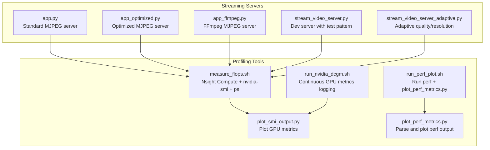
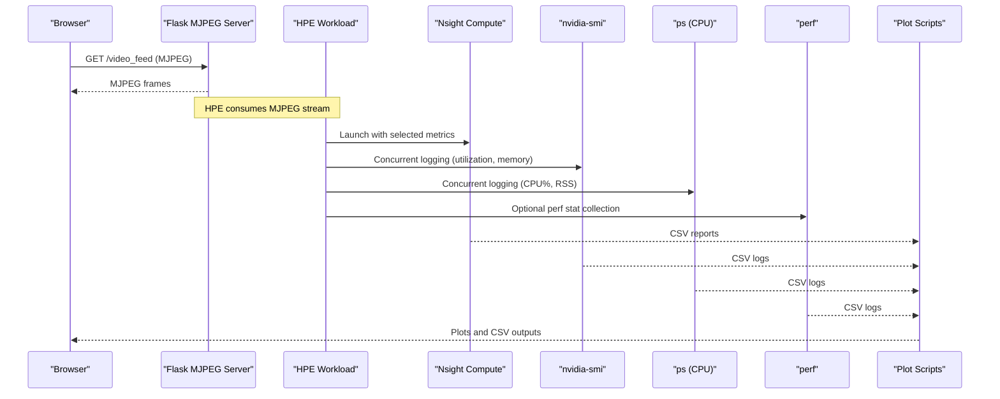
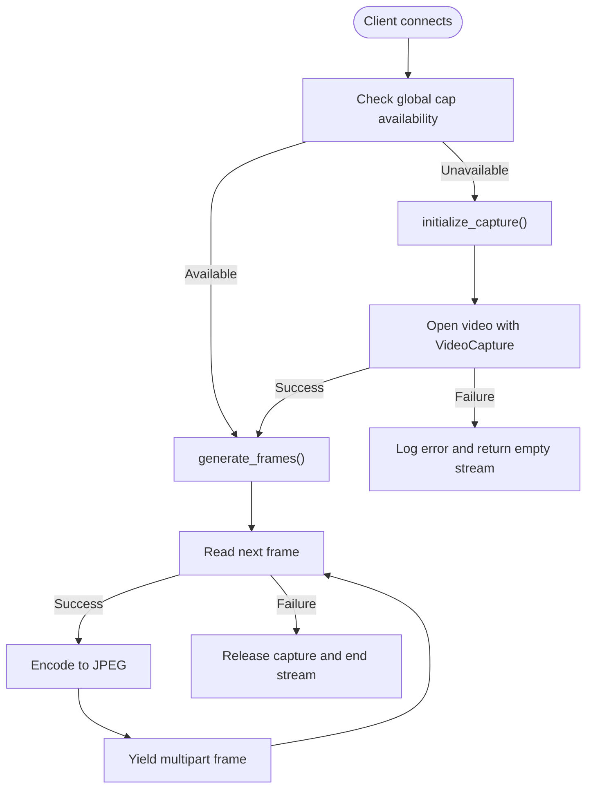
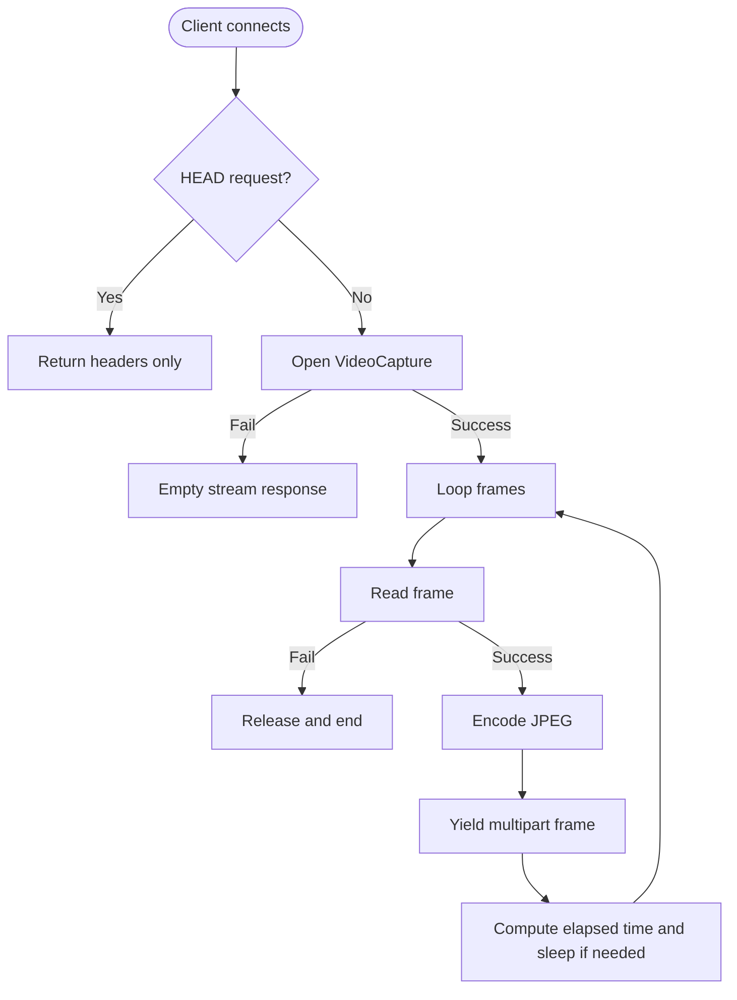
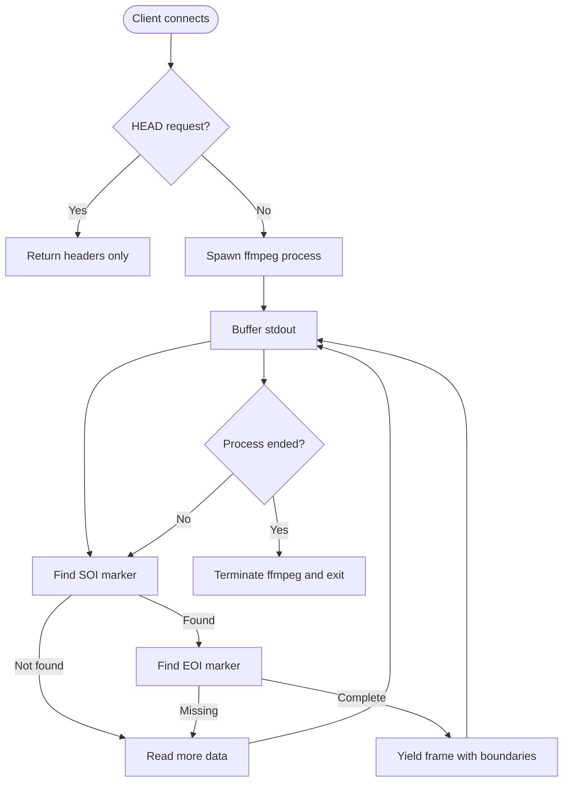
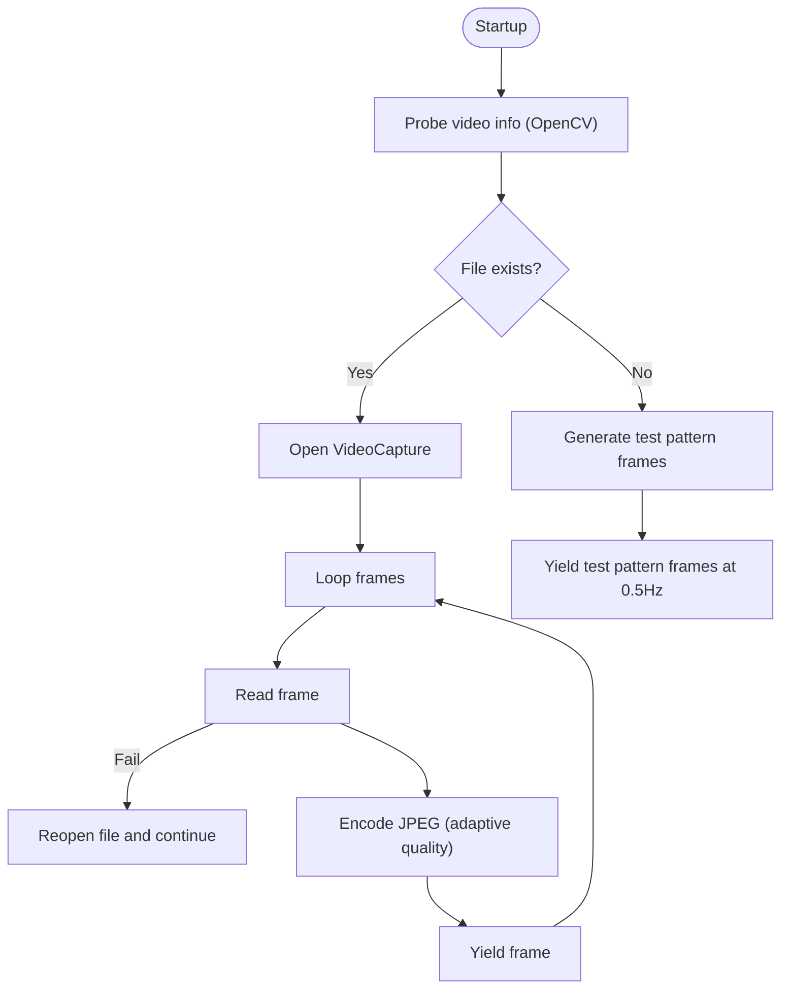
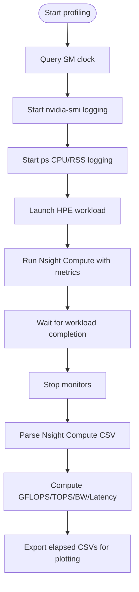
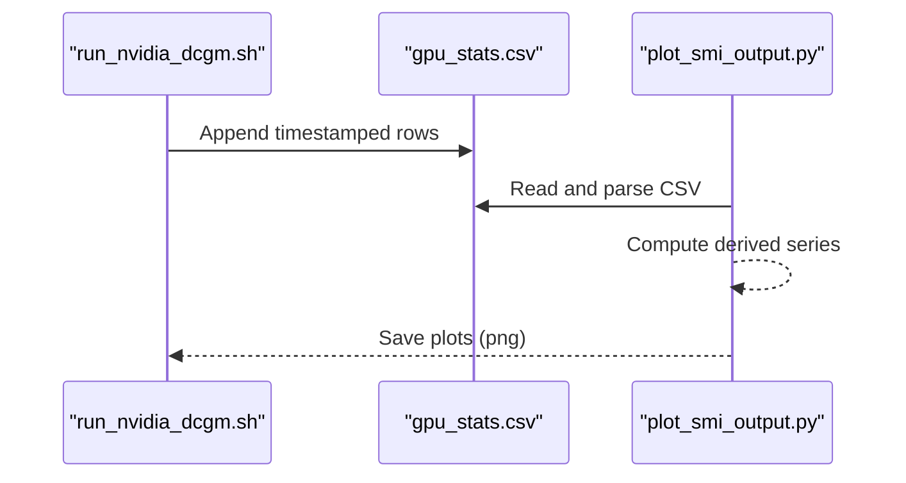
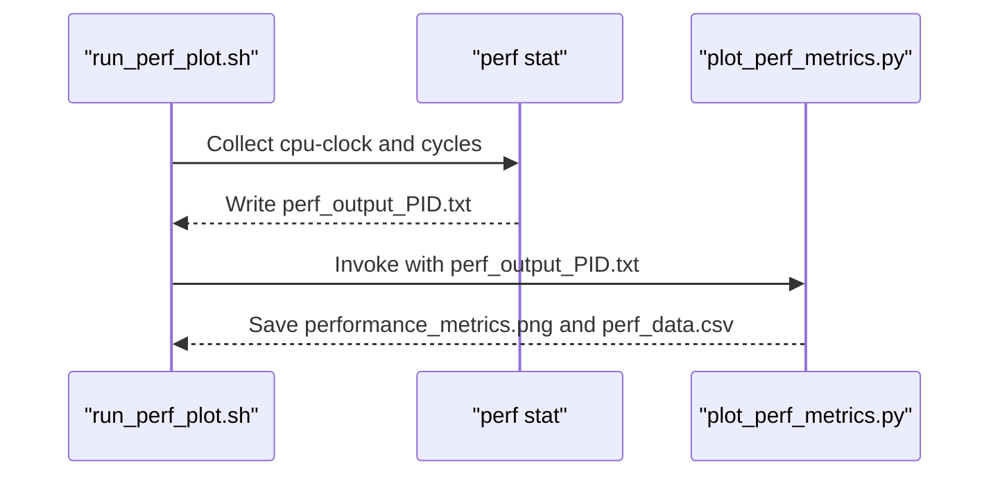
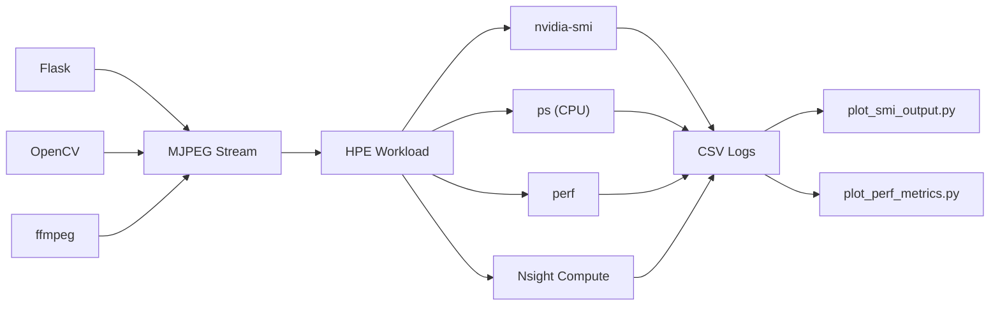

# Performance Profiling Applications

<cite>
**Referenced Files in This Document**
- [app.py](file://dev_tools/app.py)
- [app_optimized.py](file://dev_tools/app_optimized.py)
- [app_ffmpeg.py](file://dev_tools/app_ffmpeg.py)
- [stream_video_server.py](file://dev_tools/stream_video_server.py)
- [stream_video_server_adaptive.py](file://dev_tools/stream_video_server_adaptive.py)
- [measure_flops.sh](file://Measure_Flops/measure_flops.sh)
- [run_nvidia_dcgm.sh](file://Measure_gpu_dcgm/run_nvidia_dcgm.sh)
- [plot_smi_output.py](file://Measure_gpu_dcgm/plot_smi_output.py)
- [run_perf_plot.sh](file://Measure_plot_cpu_perf/run_perf_plot.sh)
- [plot_perf_metrics.py](file://Measure_plot_cpu_perf/plot_perf_metrics.py)
</cite>

## Table of Contents
1. [Introduction](#introduction)
2. [Project Structure](#project-structure)
3. [Core Components](#core-components)
4. [Architecture Overview](#architecture-overview)
5. [Detailed Component Analysis](#detailed-component-analysis)
6. [Dependency Analysis](#dependency-analysis)
7. [Performance Considerations](#performance-considerations)
8. [Troubleshooting Guide](#troubleshooting-guide)
9. [Conclusion](#conclusion)
10. [Appendices](#appendices)

## Introduction
This document describes the performance profiling applications used in the Human Pose Estimation (HPE) framework. It focuses on three development tools that simulate IP/H.264 video streams for HPE input and two profiling scripts that collect CPU/GPU/FLOPS metrics. The goal is to explain how to measure inference performance and resource utilization, interpret profiling results, and validate optimization strategies for HPE pipelines.

## Project Structure
The relevant components for performance profiling and streaming are organized under the dev_tools directory and measurement utilities:

- Streaming servers:
  - Standard Flask MJPEG server for video file playback
  - Optimized Flask MJPEG server with frame-rate control and per-frame timing
  - FFmpeg-based MJPEG server for robust frame extraction
  - Development servers with test patterns and adaptive JPEG quality/resolution
- Measurement utilities:
  - FLOPS/CPU/GPU profiling shell script
  - NVIDIA SMI/DMA GPU metrics logging and plotting
  - CPU perf metrics collection and plotting

**Diagram sources**
- [app.py:1-140](file://dev_tools/app.py#L1-L140)
- [app_optimized.py:1-97](file://dev_tools/app_optimized.py#L1-L97)
- [app_ffmpeg.py:1-204](file://dev_tools/app_ffmpeg.py#L1-L204)
- [stream_video_server.py:1-228](file://dev_tools/stream_video_server.py#L1-L228)
- [stream_video_server_adaptive.py:1-195](file://dev_tools/stream_video_server_adaptive.py#L1-L195)
- [measure_flops.sh:1-128](file://Measure_Flops/measure_flops.sh#L1-L128)
- [run_nvidia_dcgm.sh:1-29](file://Measure_gpu_dcgm/run_nvidia_dcgm.sh#L1-L29)
- [plot_smi_output.py:1-106](file://Measure_gpu_dcgm/plot_smi_output.py#L1-L106)
- [run_perf_plot.sh:1-25](file://Measure_plot_cpu_perf/run_perf_plot.sh#L1-L25)
- [plot_perf_metrics.py:1-146](file://Measure_plot_cpu_perf/plot_perf_metrics.py#L1-L146)

**Section sources**
- [app.py:1-140](file://dev_tools/app.py#L1-L140)
- [app_optimized.py:1-97](file://dev_tools/app_optimized.py#L1-L97)
- [app_ffmpeg.py:1-204](file://dev_tools/app_ffmpeg.py#L1-L204)
- [stream_video_server.py:1-228](file://dev_tools/stream_video_server.py#L1-L228)
- [stream_video_server_adaptive.py:1-195](file://dev_tools/stream_video_server_adaptive.py#L1-L195)
- [measure_flops.sh:1-128](file://Measure_Flops/measure_flops.sh#L1-L128)
- [run_nvidia_dcgm.sh:1-29](file://Measure_gpu_dcgm/run_nvidia_dcgm.sh#L1-L29)
- [plot_smi_output.py:1-106](file://Measure_gpu_dcgm/plot_smi_output.py#L1-L106)
- [run_perf_plot.sh:1-25](file://Measure_plot_cpu_perf/run_perf_plot.sh#L1-L25)
- [plot_perf_metrics.py:1-146](file://Measure_plot_cpu_perf/plot_perf_metrics.py#L1-L146)

## Core Components
- Standard MJPEG server (app.py): Streams a video file once using OpenCV and Flask, yielding MJPEG frames over HTTP. Supports HEAD requests and logs video metadata.
- Optimized MJPEG server (app_optimized.py): Initializes a new capture per client, controls frame rate to match video FPS, and sleeps to throttle output. Uses per-frame timing and per-call cleanup.
- FFmpeg MJPEG server (app_ffmpeg.py): Spawns ffmpeg to produce MJPEG frames, parses SOI/EOI markers, and yields complete JPEG frames. Handles HEAD requests and logs video details via ffprobe.
- Development servers:
  - stream_video_server.py: Initializes video info at startup, falls back to a test pattern if the file is missing, loops the video, and encodes frames at the original FPS.
  - stream_video_server_adaptive.py: Adapts JPEG quality and optionally downscales HD resolutions for better throughput, streams until end-of-video.

These servers provide consistent MJPEG endpoints suitable for feeding HPE models that accept HTTP MJPEG streams.

**Section sources**
- [app.py:1-140](file://dev_tools/app.py#L1-L140)
- [app_optimized.py:1-97](file://dev_tools/app_optimized.py#L1-L97)
- [app_ffmpeg.py:1-204](file://dev_tools/app_ffmpeg.py#L1-L204)
- [stream_video_server.py:1-228](file://dev_tools/stream_video_server.py#L1-L228)
- [stream_video_server_adaptive.py:1-195](file://dev_tools/stream_video_server_adaptive.py#L1-L195)

## Architecture Overview
The profiling pipeline integrates streaming servers with external measurement tools:

- Streaming servers expose /video_feed endpoints that emit MJPEG frames.
- measure_flops.sh runs the HPE workload under Nsight Compute and concurrently logs CPU and GPU metrics.
- run_nvidia_dcgm.sh continuously logs GPU telemetry via nvidia-smi.
- plot_smi_output.py visualizes GPU metrics from CSV logs.
- run_perf_plot.sh executes perf and invokes plot_perf_metrics.py to visualize CPU metrics.

**Diagram sources**
- [app.py:79-102](file://dev_tools/app.py#L79-L102)
- [app_optimized.py:65-76](file://dev_tools/app_optimized.py#L65-L76)
- [app_ffmpeg.py:154-169](file://dev_tools/app_ffmpeg.py#L154-L169)
- [measure_flops.sh:17-55](file://Measure_Flops/measure_flops.sh#L17-L55)
- [run_nvidia_dcgm.sh:7-27](file://Measure_gpu_dcgm/run_nvidia_dcgm.sh#L7-L27)
- [plot_smi_output.py:1-106](file://Measure_gpu_dcgm/plot_smi_output.py#L1-L106)
- [run_perf_plot.sh:1-25](file://Measure_plot_cpu_perf/run_perf_plot.sh#L1-L25)
- [plot_perf_metrics.py:1-146](file://Measure_plot_cpu_perf/plot_perf_metrics.py#L1-L146)

## Detailed Component Analysis

### Standard MJPEG Server (app.py)
- Purpose: Serve a pre-recorded video file as an MJPEG stream for HPE input.
- Key behaviors:
  - Reads VIDEO_PATH from environment with a default fallback.
  - Logs absolute path and existence checks.
  - Initializes a single global VideoCapture at startup; reinitializes per connection if needed.
  - Encodes frames to JPEG and yields multipart boundaries for MJPEG.
  - Supports HEAD requests returning appropriate headers.
  - Runs with threaded=True for concurrency.

**Diagram sources**
- [app.py:26-78](file://dev_tools/app.py#L26-L78)

**Section sources**
- [app.py:1-140](file://dev_tools/app.py#L1-L140)

### Optimized MJPEG Server (app_optimized.py)
- Purpose: Per-client initialization with precise frame-rate control and throttling.
- Key behaviors:
  - Each /video_feed invocation opens a new VideoCapture and closes it upon completion.
  - Queries FPS and computes desired_time_per_frame; measures per-frame elapsed time and sleeps to match FPS.
  - Yields MJPEG frames with multipart boundaries.
  - Handles HEAD requests with appropriate headers.

**Diagram sources**
- [app_optimized.py:19-63](file://dev_tools/app_optimized.py#L19-L63)

**Section sources**
- [app_optimized.py:1-97](file://dev_tools/app_optimized.py#L1-L97)

### FFmpeg MJPEG Server (app_ffmpeg.py)
- Purpose: Use ffmpeg to decode and encode MJPEG frames, ensuring complete JPEG boundaries.
- Key behaviors:
  - Validates ffmpeg presence and probes video details with ffprobe.
  - Spawns ffmpeg with -f mjpeg and scales to a target resolution.
  - Buffers stdout, detects SOI/EOI markers, and yields complete JPEG frames.
  - Handles HEAD requests and ensures ffmpeg termination on exit.

**Diagram sources**
- [app_ffmpeg.py:69-151](file://dev_tools/app_ffmpeg.py#L69-L151)

**Section sources**
- [app_ffmpeg.py:1-204](file://dev_tools/app_ffmpeg.py#L1-L204)

### Development Servers (stream_video_server*.py)
- stream_video_server.py:
  - Initializes video info at startup, falls back to a test pattern if the file is missing, loops the video, and encodes frames at the original FPS.
- stream_video_server_adaptive.py:
  - Adapts JPEG quality based on resolution (HD vs VGA), optionally downsamples HD videos, and streams until end-of-video.

**Diagram sources**
- [stream_video_server.py:34-171](file://dev_tools/stream_video_server.py#L34-L171)
- [stream_video_server_adaptive.py:35-150](file://dev_tools/stream_video_server_adaptive.py#L35-L150)

**Section sources**
- [stream_video_server.py:1-228](file://dev_tools/stream_video_server.py#L1-L228)
- [stream_video_server_adaptive.py:1-195](file://dev_tools/stream_video_server_adaptive.py#L1-L195)

### Profiling Tools

#### measure_flops.sh
- Purpose: End-to-end profiling of HPE workloads with CPU, GPU, and FLOPS metrics.
- Workflow:
  - Starts nvidia-smi logging for GPU utilization and memory.
  - Starts CPU monitoring via ps.
  - Runs the HPE command under Nsight Compute with selected metrics.
  - Parses Nsight Compute report and computes GFLOPS/TOPS/Bandwidth/Latency.
  - Converts timestamps to elapsed seconds for plotting.

**Diagram sources**
- [measure_flops.sh:17-97](file://Measure_Flops/measure_flops.sh#L17-L97)

**Section sources**
- [measure_flops.sh:1-128](file://Measure_Flops/measure_flops.sh#L1-L128)

#### run_nvidia_dcgm.sh and plot_smi_output.py
- Purpose: Continuous GPU telemetry logging and visualization.
- Behavior:
  - run_nvidia_dcgm.sh writes periodic nvidia-smi CSV entries with timestamp, power draw, temperature, GPU/memory utilization, and memory usage.
  - plot_smi_output.py reads the CSV, converts timestamps, and generates plots for GPU/Memory utilization, temperature, memory usage, P-state transitions, and power consumption.

**Diagram sources**
- [run_nvidia_dcgm.sh:7-27](file://Measure_gpu_dcgm/run_nvidia_dcgm.sh#L7-L27)
- [plot_smi_output.py:20-105](file://Measure_gpu_dcgm/plot_smi_output.py#L20-L105)

**Section sources**
- [run_nvidia_dcgm.sh:1-29](file://Measure_gpu_dcgm/run_nvidia_dcgm.sh#L1-L29)
- [plot_smi_output.py:1-106](file://Measure_gpu_dcgm/plot_smi_output.py#L1-L106)

#### run_perf_plot.sh and plot_perf_metrics.py
- Purpose: Collect and visualize CPU perf metrics.
- Behavior:
  - run_perf_plot.sh iterates PIDs from a PID file, runs perf stat for each, and invokes plot_perf_metrics.py to save plots and CSV.

**Diagram sources**
- [run_perf_plot.sh:11-24](file://Measure_plot_cpu_perf/run_perf_plot.sh#L11-L24)
- [plot_perf_metrics.py:16-132](file://Measure_plot_cpu_perf/plot_perf_metrics.py#L16-L132)

**Section sources**
- [run_perf_plot.sh:1-25](file://Measure_plot_cpu_perf/run_perf_plot.sh#L1-L25)
- [plot_perf_metrics.py:1-146](file://Measure_plot_cpu_perf/plot_perf_metrics.py#L1-L146)

## Dependency Analysis
- Streaming servers depend on:
  - Flask for HTTP endpoints and multipart streaming.
  - OpenCV for video capture and JPEG encoding (app.py, app_optimized.py, stream servers).
  - FFmpeg for decoding and MJPEG encoding (app_ffmpeg.py).
  - Environment variables for configuration (VIDEO_PATH, PORT).
- Profiling tools depend on:
  - NVIDIA drivers and nvidia-smi for GPU telemetry.
  - Nsight Compute for CUDA kernel metrics.
  - perf for CPU metrics.
  - Python libraries (pandas, matplotlib) for plotting.

**Diagram sources**
- [app.py:4-10](file://dev_tools/app.py#L4-L10)
- [app_optimized.py:4-5](file://dev_tools/app_optimized.py#L4-L5)
- [app_ffmpeg.py:4-10](file://dev_tools/app_ffmpeg.py#L4-L10)
- [measure_flops.sh:25-55](file://Measure_Flops/measure_flops.sh#L25-L55)
- [run_nvidia_dcgm.sh:10-16](file://Measure_gpu_dcgm/run_nvidia_dcgm.sh#L10-L16)
- [plot_smi_output.py:20-39](file://Measure_gpu_dcgm/plot_smi_output.py#L20-L39)
- [run_perf_plot.sh:11-24](file://Measure_plot_cpu_perf/run_perf_plot.sh#L11-L24)
- [plot_perf_metrics.py:1-7](file://Measure_plot_cpu_perf/plot_perf_metrics.py#L1-L7)

**Section sources**
- [app.py:1-140](file://dev_tools/app.py#L1-L140)
- [app_optimized.py:1-97](file://dev_tools/app_optimized.py#L1-L97)
- [app_ffmpeg.py:1-204](file://dev_tools/app_ffmpeg.py#L1-L204)
- [measure_flops.sh:1-128](file://Measure_Flops/measure_flops.sh#L1-L128)
- [run_nvidia_dcgm.sh:1-29](file://Measure_gpu_dcgm/run_nvidia_dcgm.sh#L1-L29)
- [plot_smi_output.py:1-106](file://Measure_gpu_dcgm/plot_smi_output.py#L1-L106)
- [run_perf_plot.sh:1-25](file://Measure_plot_cpu_perf/run_perf_plot.sh#L1-L25)
- [plot_perf_metrics.py:1-146](file://Measure_plot_cpu_perf/plot_perf_metrics.py#L1-L146)

## Performance Considerations
- Streaming server selection:
  - Use app_optimized.py for strict FPS control and per-frame throttling.
  - Use app_ffmpeg.py for robust MJPEG extraction and standardized frame timing.
  - Use stream_video_server*.py for development and testing with fallbacks.
- Resource utilization:
  - Monitor GPU utilization, memory usage, and temperature with run_nvidia_dcgm.sh and plot_smi_output.py.
  - Collect CPU metrics with run_perf_plot.sh and plot_perf_metrics.py.
- Throughput and latency:
  - Measure FLOPS/TOPS and bandwidth with measure_flops.sh to assess compute efficiency.
  - Adjust JPEG quality and resolution adaptively (stream_video_server_adaptive.py) to balance quality and throughput.
- Bottleneck identification:
  - Compare CPU%, GPU%, and bandwidth across implementations to locate CPU-bound vs. GPU-bound vs. I/O-bound stages.

[No sources needed since this section provides general guidance]

## Troubleshooting Guide
- Video file not found:
  - stream_video_server.py and stream_video_server_adaptive.py fall back to test patterns and log warnings; verify VIDEO_PATH and file permissions.
- FFmpeg not installed:
  - app_ffmpeg.py logs an error if ffmpeg is unavailable; install ffmpeg and ensure it is in PATH.
- Frame-rate mismatch:
  - app_optimized.py computes desired_time_per_frame from video FPS; if FPS is zero, it defaults to 25 FPS. Verify video metadata probing.
- GPU telemetry issues:
  - run_nvidia_dcgm.sh requires nvidia-smi; ensure NVIDIA drivers are installed and accessible.
- Perf permission errors:
  - run_perf_plot.sh requires sudo; ensure the user has permission to run perf stat.

**Section sources**
- [stream_video_server.py:40-80](file://dev_tools/stream_video_server.py#L40-L80)
- [stream_video_server_adaptive.py:23-54](file://dev_tools/stream_video_server_adaptive.py#L23-L54)
- [app_ffmpeg.py:54-66](file://dev_tools/app_ffmpeg.py#L54-L66)
- [app_optimized.py:32-37](file://dev_tools/app_optimized.py#L32-L37)
- [run_nvidia_dcgm.sh:5-6](file://Measure_gpu_dcgm/run_nvidia_dcgm.sh#L5-L6)
- [run_perf_plot.sh:6-8](file://Measure_plot_cpu_perf/run_perf_plot.sh#L6-L8)

## Conclusion
The profiling suite combines flexible MJPEG streaming servers with robust GPU/CPU/FLOPS measurement tools. By selecting the appropriate server and running the profiling scripts, teams can collect comprehensive performance metrics, compare implementations, and optimize HPE pipelines effectively.

[No sources needed since this section summarizes without analyzing specific files]

## Appendices

### Usage Examples and Parameter Configuration
- Environment variables:
  - VIDEO_PATH: Path to the input video file for streaming servers.
  - PORT: TCP port for the Flask server (default 8089).
- Running streaming servers:
  - Standard: python dev_tools/app.py
  - Optimized: python dev_tools/app_optimized.py
  - FFmpeg-based: python dev_tools/app_ffmpeg.py
  - Development servers: python dev_tools/stream_video_server.py [--video PATH]
- Profiling HPE workload:
  - ./Measure_Flops/measure_flops.sh python3 your_hpe_script.py
- GPU telemetry:
  - ./Measure_gpu_dcgm/run_nvidia_dcgm.sh
  - python3 Measure_gpu_dcgm/plot_smi_output.py gpu_stats.csv
- CPU perf metrics:
  - ./Measure_plot_cpu_perf/run_perf_plot.sh
  - python3 Measure_plot_cpu_perf/plot_perf_metrics.py

**Section sources**
- [app.py:12-13](file://dev_tools/app.py#L12-L13)
- [app_optimized.py:14-15](file://dev_tools/app_optimized.py#L14-L15)
- [app_ffmpeg.py:12-14](file://dev_tools/app_ffmpeg.py#L12-L14)
- [stream_video_server.py:212-220](file://dev_tools/stream_video_server.py#L212-L220)
- [measure_flops.sh:5-6](file://Measure_Flops/measure_flops.sh#L5-L6)
- [run_nvidia_dcgm.sh:4-5](file://Measure_gpu_dcgm/run_nvidia_dcgm.sh#L4-L5)
- [plot_smi_output.py:13-13](file://Measure_gpu_dcgm/plot_smi_output.py#L13-L13)
- [run_perf_plot.sh:4-4](file://Measure_plot_cpu_perf/run_perf_plot.sh#L4-L4)
- [plot_perf_metrics.py:11-14](file://Measure_plot_cpu_perf/plot_perf_metrics.py#L11-L14)

### Profiling Metrics and Interpretation
- GPU metrics (nvidia-smi):
  - Utilization (%), memory used (MiB), temperature (°C), power draw (W), P-state transitions.
  - Use plot_smi_output.py to visualize trends and detect thermal throttling or memory pressure.
- CPU metrics (perf):
  - CPU utilization (%) and cycles over time; use plot_perf_metrics.py to inspect CPU activity during HPE execution.
- FLOPS/TOPS/bandwidth (Nsight Compute):
  - sm__inst_executed_pipe_fma.sum, sm__cycles_elapsed.sum, sm__inst_executed_pipe_tensor.sum, dram__bytes.sum, sm__average_warp_latency.sum.
  - measure_flops.sh computes GFLOPS, TOPS, and effective bandwidth; compare across implementations to validate optimizations.

**Section sources**
- [measure_flops.sh:47-97](file://Measure_Flops/measure_flops.sh#L47-L97)
- [plot_smi_output.py:41-105](file://Measure_gpu_dcgm/plot_smi_output.py#L41-L105)
- [plot_perf_metrics.py:31-88](file://Measure_plot_cpu_perf/plot_perf_metrics.py#L31-L88)

### Comparing Implementations and Optimization Validation
- Baseline vs. optimized:
  - Compare CPU%, GPU%, and bandwidth across app.py, app_optimized.py, and app_ffmpeg.py with identical HPE workloads.
- Resolution and quality impact:
  - Use stream_video_server_adaptive.py to evaluate trade-offs between JPEG quality/resolution and throughput.
- Validation techniques:
  - Run measure_flops.sh for each implementation and compare GFLOPS/TOPS and bandwidth.
  - Correlate CPU utilization and GPU occupancy to identify bottlenecks and guide optimization (e.g., CPU-bound pre/post-processing vs. GPU-bound kernels).

[No sources needed since this section provides general guidance]