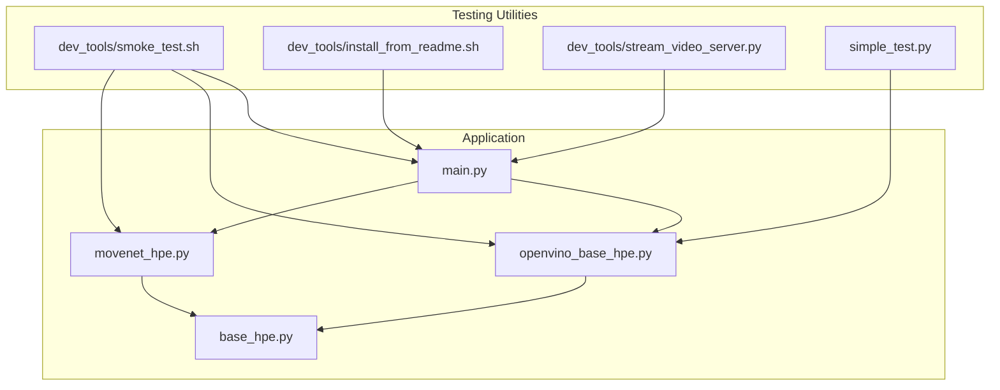
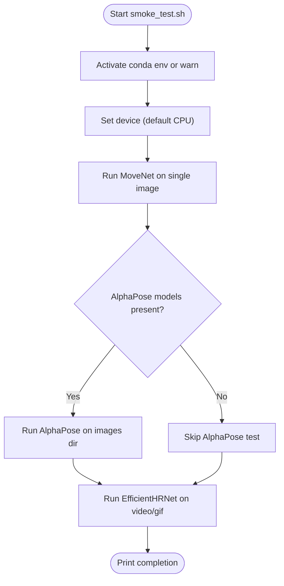
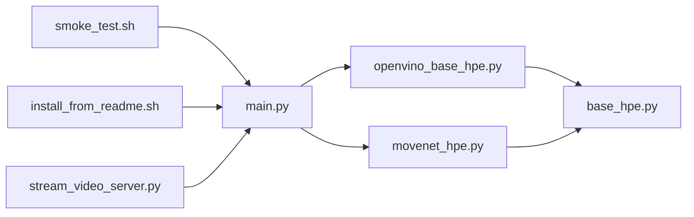

# Testing and Validation

<cite>
**Referenced Files in This Document**
- [README.md](file://README.md)
- [dev_tools/smoke_test.sh](file://dev_tools/smoke_test.sh)
- [dev_tools/install_from_readme.sh](file://dev_tools/install_from_readme.sh)
- [dev_tools/stream_video_server.py](file://dev_tools/stream_video_server.py)
- [simple_test.py](file://simple_test.py)
- [main.py](file://main.py)
- [base_hpe.py](file://base_hpe.py)
- [openvino_base_hpe.py](file://openvino_base_hpe.py)
- [movenet_hpe.py](file://movenet_hpe.py)
</cite>

## Table of Contents
1. [Introduction](#introduction)
2. [Project Structure](#project-structure)
3. [Core Components](#core-components)
4. [Architecture Overview](#architecture-overview)
5. [Detailed Component Analysis](#detailed-component-analysis)
6. [Dependency Analysis](#dependency-analysis)
7. [Performance Considerations](#performance-considerations)
8. [Troubleshooting Guide](#troubleshooting-guide)
9. [Conclusion](#conclusion)
10. [Appendices](#appendices)

## Introduction
This document describes the testing and validation utilities for the Human Pose Estimation (HPE) framework. It focuses on:
- The smoke test script that validates basic functionality across multiple HPE methods (MoveNet, AlphaPose, EfficientHRNet variants).
- The testing methodology, device configuration options (CPU/GPU), and expected outcomes.
- Installation validation and environment setup verification.
- Guidance on running tests, interpreting results, and troubleshooting common failures.
- Coverage of input types (images, videos, directories, HTTP streams) and model configurations.

## Project Structure
The testing ecosystem centers around:
- A smoke test script that orchestrates end-to-end runs for different HPE methods.
- An installation script that recreates the documented environment.
- A development video streaming server for HTTP stream testing.
- A simple test script demonstrating synchronous webcam processing with OpenVINO.
- The main application entry point and shared HPE base classes that implement the tested behaviors.



**Diagram sources**
- [dev_tools/smoke_test.sh:1-42](file://dev_tools/smoke_test.sh#L1-L42)
- [dev_tools/install_from_readme.sh:1-39](file://dev_tools/install_from_readme.sh#L1-L39)
- [dev_tools/stream_video_server.py:1-228](file://dev_tools/stream_video_server.py#L1-L228)
- [simple_test.py:1-288](file://simple_test.py#L1-L288)
- [main.py:1-99](file://main.py#L1-L99)
- [base_hpe.py:1-546](file://base_hpe.py#L1-L546)
- [openvino_base_hpe.py:1-653](file://openvino_base_hpe.py#L1-L653)
- [movenet_hpe.py:1-111](file://movenet_hpe.py#L1-L111)

**Section sources**
- [README.md:1-125](file://README.md#L1-L125)
- [dev_tools/smoke_test.sh:1-42](file://dev_tools/smoke_test.sh#L1-L42)
- [dev_tools/install_from_readme.sh:1-39](file://dev_tools/install_from_readme.sh#L1-L39)
- [dev_tools/stream_video_server.py:1-228](file://dev_tools/stream_video_server.py#L1-L228)
- [simple_test.py:1-288](file://simple_test.py#L1-L288)
- [main.py:1-99](file://main.py#L1-L99)
- [base_hpe.py:1-546](file://base_hpe.py#L1-L546)
- [openvino_base_hpe.py:1-653](file://openvino_base_hpe.py#L1-L653)
- [movenet_hpe.py:1-111](file://movenet_hpe.py#L1-L111)

## Core Components
- Smoke test script: Executes representative runs for MoveNet, AlphaPose, and EfficientHRNet variants across image, directory, and video inputs. It respects device selection and handles missing AlphaPose models gracefully.
- Installation script: Creates a conda environment with pinned Python and PyTorch versions, installs dependencies, and builds AlphaPose extensions if available.
- Stream server: Provides a local HTTP stream for validating IP-based input handling.
- Simple test: Demonstrates synchronous webcam processing with OpenVINO, including camera availability checks, inference timing, and pose rendering.
- Application entry point: Parses arguments, selects an HPE method, loads the model, and dispatches to appropriate processing loops (image, directory, video, HTTP stream).
- Base HPE classes: Provide shared logic for input detection, padding/resizing, processing loops, and output handling.

**Section sources**
- [dev_tools/smoke_test.sh:1-42](file://dev_tools/smoke_test.sh#L1-L42)
- [dev_tools/install_from_readme.sh:1-39](file://dev_tools/install_from_readme.sh#L1-L39)
- [dev_tools/stream_video_server.py:1-228](file://dev_tools/stream_video_server.py#L1-L228)
- [simple_test.py:1-288](file://simple_test.py#L1-L288)
- [main.py:1-99](file://main.py#L1-L99)
- [base_hpe.py:1-546](file://base_hpe.py#L1-L546)
- [openvino_base_hpe.py:1-653](file://openvino_base_hpe.py#L1-L653)
- [movenet_hpe.py:1-111](file://movenet_hpe.py#L1-L111)

## Architecture Overview
The smoke test executes the main application with different method and input combinations. The main application selects a concrete HPE implementation, initializes the model, and runs the appropriate processing loop. OpenVINO-based implementations leverage the model API and adapters, while MoveNet uses OpenVINO runtime directly.

```mermaid
sequenceDiagram
participant User as "User"
participant ST as "smoke_test.sh"
participant Main as "main.py"
participant Sel as "get_hpe_method()"
participant Impl as "HPE Implementation"
participant Loop as "main_loop/main_loop_with_timeout"
User->>ST : Run smoke test
ST->>Main : Invoke with method, device, input
Main->>Sel : Select HPE class by method
Sel-->>Main : Return instance (MoveNet/OpenVINO)
Main->>Impl : load_model()
Impl-->>Main : Model ready
alt HTTP stream
Main->>Loop : main_loop_with_timeout(timeout, max_frames)
else Image/Directory/Video/Webcam
Main->>Loop : main_loop()
end
Loop-->>User : Outputs (images/videos/json/csv) and logs
```

**Diagram sources**
- [dev_tools/smoke_test.sh:28-41](file://dev_tools/smoke_test.sh#L28-L41)
- [main.py:22-46](file://main.py#L22-L46)
- [main.py:64-83](file://main.py#L64-L83)
- [openvino_base_hpe.py:316-395](file://openvino_base_hpe.py#L316-L395)
- [movenet_hpe.py:58-86](file://movenet_hpe.py#L58-L86)

## Detailed Component Analysis

### Smoke Test Script
Purpose:
- Validate end-to-end operation across multiple HPE methods and input types.
- Verify environment activation and model presence for AlphaPose.

Behavior highlights:
- Accepts device and environment name as arguments with defaults.
- Uses conda environment activation if available; otherwise proceeds with system Python.
- Executes MoveNet on a single image, AlphaPose on a directory if models are present, and EfficientHRNet on a GIF/video.
- Prints completion status upon success.

Expected outcomes:
- Successful model loading and inference for each selected method.
- Output artifacts (images/videos) when requested.
- Graceful skip for AlphaPose when models are missing.



**Diagram sources**
- [dev_tools/smoke_test.sh:10-41](file://dev_tools/smoke_test.sh#L10-L41)

**Section sources**
- [dev_tools/smoke_test.sh:1-42](file://dev_tools/smoke_test.sh#L1-L42)

### Installation Validation and Environment Setup
Purpose:
- Recreate the documented environment and build prerequisites.

Highlights:
- Creates a named conda environment with pinned Python and PyTorch versions.
- Installs dependencies from requirements.
- Attempts to build AlphaPose extensions if the build script exists.

Verification steps:
- Confirm environment creation and activation.
- Confirm PyTorch and dependencies installation.
- Confirm AlphaPose build completion if applicable.

**Section sources**
- [dev_tools/install_from_readme.sh:1-39](file://dev_tools/install_from_readme.sh#L1-L39)
- [README.md:71-94](file://README.md#L71-L94)

### HTTP Stream Testing Utility
Purpose:
- Provide a local HTTP stream for validating IP-based input handling.

Highlights:
- Starts a Flask server serving a video feed or a test pattern.
- Initializes video metadata at startup.
- Supports command-line override of the video path.

Usage:
- Start the server in one terminal.
- In another terminal, run the main application pointing to the server’s address.

**Section sources**
- [dev_tools/stream_video_server.py:1-228](file://dev_tools/stream_video_server.py#L1-L228)
- [README.md:116-125](file://README.md#L116-L125)

### Simple Test: Synchronous Webcam with OpenVINO
Purpose:
- Demonstrate synchronous webcam processing and pose rendering with OpenVINO.

Highlights:
- Lists available cameras and tests frame acquisition.
- Loads an OpenVINO model (EfficientHRNet variant) and performs inference.
- Renders pose results and displays FPS/bitrate metrics.
- Handles user interruption and cleanup.

Interpretation tips:
- Camera access messages indicate whether the camera is usable.
- First few frames include detailed logs for debugging.
- Real-time display shows rendered poses and performance indicators.

**Section sources**
- [simple_test.py:1-288](file://simple_test.py#L1-L288)

### Main Application Entry Point and Method Selection
Purpose:
- Parse arguments, select an HPE method, and run the appropriate processing loop.

Highlights:
- Argument parsing supports method selection, input source, device, and output options.
- Method mapping resolves to concrete HPE implementations.
- Dispatches to specialized loops for HTTP streams, videos, and images/directories.

**Section sources**
- [main.py:1-99](file://main.py#L1-L99)

### Base HPE Classes and Processing Loops
Purpose:
- Provide shared logic for input detection, padding/resizing, processing, and output.

Highlights:
- Input type detection covers images, directories, videos, HTTP streams, and webcams.
- Padding/resizing ensures consistent model input dimensions.
- Processing loops handle timeouts, frame limits, and progress reporting.
- Output generation includes JSON/COCO, CSV, and saving images/videos.

**Section sources**
- [base_hpe.py:1-546](file://base_hpe.py#L1-L546)

### OpenVINO-Based HPE Implementations
Purpose:
- Implement OpenVINO-specific model loading, preprocessing, inference, and postprocessing.

Highlights:
- Model configuration includes architecture, input sizes, and GPU support flags.
- Core configuration sets performance mode, threads, streams, and CPU pinning/hyper-threading.
- Pre/post-processing adapts model outputs to standardized body structures.
- Fallback handling for HTTP streams using FFmpeg backend.

**Section sources**
- [openvino_base_hpe.py:1-653](file://openvino_base_hpe.py#L1-L653)

### MoveNet HPE Implementation
Purpose:
- Implement MoveNet using OpenVINO runtime.

Highlights:
- Enforces CPU device for MoveNet.
- Initializes OpenCV video capture with FFmpeg backend for HTTP streams.
- Preprocessing converts frames to the expected tensor layout.
- Postprocessing unpacks MoveNet outputs into body detections.

**Section sources**
- [movenet_hpe.py:1-111](file://movenet_hpe.py#L1-L111)

## Dependency Analysis
The smoke test depends on the main application and HPE implementations. The main application depends on the base classes and concrete implementations. The OpenVINO implementations depend on the model API and adapters. The installation script depends on conda and requirements.



**Diagram sources**
- [dev_tools/smoke_test.sh:1-42](file://dev_tools/smoke_test.sh#L1-L42)
- [dev_tools/install_from_readme.sh:1-39](file://dev_tools/install_from_readme.sh#L1-L39)
- [dev_tools/stream_video_server.py:1-228](file://dev_tools/stream_video_server.py#L1-L228)
- [main.py:1-99](file://main.py#L1-L99)
- [base_hpe.py:1-546](file://base_hpe.py#L1-L546)
- [openvino_base_hpe.py:1-653](file://openvino_base_hpe.py#L1-L653)
- [movenet_hpe.py:1-111](file://movenet_hpe.py#L1-L111)

**Section sources**
- [dev_tools/smoke_test.sh:1-42](file://dev_tools/smoke_test.sh#L1-L42)
- [main.py:1-99](file://main.py#L1-L99)
- [openvino_base_hpe.py:1-653](file://openvino_base_hpe.py#L1-L653)
- [movenet_hpe.py:1-111](file://movenet_hpe.py#L1-L111)
- [base_hpe.py:1-546](file://base_hpe.py#L1-L546)
- [dev_tools/install_from_readme.sh:1-39](file://dev_tools/install_from_readme.sh#L1-L39)
- [dev_tools/stream_video_server.py:1-228](file://dev_tools/stream_video_server.py#L1-L228)

## Performance Considerations
- Device selection: MoveNet falls back to CPU regardless of the requested device. OpenVINO-based models support CPU/GPU depending on model configuration.
- Throughput vs latency: OpenVINO core configuration supports throughput and latency modes; adjust threads, streams, and CPU pinning for performance tuning.
- HTTP stream handling: FFmpeg backend reduces latency for HTTP streams; timeouts and frame limits prevent indefinite processing.
- Webcam and video processing: Frame buffering and progress reporting help diagnose bottlenecks.

[No sources needed since this section provides general guidance]

## Troubleshooting Guide
Common issues and resolutions:
- Conda environment not found: Ensure the environment is created and activated before running tests.
- AlphaPose models missing: The smoke test skips AlphaPose when models are not present; install required models to enable AlphaPose tests.
- Camera access failures: The simple test includes camera availability checks and retries; verify camera permissions and drivers.
- HTTP stream errors: Use the development stream server to validate HTTP input handling; confirm server is reachable and serving frames.
- Timeout or frame limit exceeded: Adjust timeout and max_frames parameters when processing HTTP streams.
- GPU device not supported: Some models do not support GPU; the implementations fall back to CPU automatically.

**Section sources**
- [dev_tools/smoke_test.sh:10-19](file://dev_tools/smoke_test.sh#L10-L19)
- [dev_tools/smoke_test.sh:32-36](file://dev_tools/smoke_test.sh#L32-L36)
- [simple_test.py:36-100](file://simple_test.py#L36-L100)
- [openvino_base_hpe.py:87-89](file://openvino_base_hpe.py#L87-L89)
- [movenet_hpe.py:28-30](file://movenet_hpe.py#L28-L30)
- [main.py:29-45](file://main.py#L29-L45)

## Conclusion
The testing and validation utilities provide a practical way to verify the HPE framework across multiple methods and input types. The smoke test automates representative scenarios, the installation script ensures reproducible environments, and the development server enables HTTP stream validation. Together with the base and concrete HPE implementations, they form a robust foundation for continuous validation of the system.

[No sources needed since this section summarizes without analyzing specific files]

## Appendices

### Running the Smoke Test
- Activate the environment and run the smoke test with optional device and environment name arguments.
- The script will execute MoveNet on a single image, optionally AlphaPose on a directory if models are present, and EfficientHRNet on a GIF/video.

**Section sources**
- [dev_tools/smoke_test.sh:5-41](file://dev_tools/smoke_test.sh#L5-L41)

### Running the Simple Test
- Execute the simple test to validate synchronous webcam processing with OpenVINO.
- The test prints camera availability, loads the model, and renders poses with performance metrics.

**Section sources**
- [simple_test.py:36-288](file://simple_test.py#L36-L288)

### Environment Setup Verification
- Use the installation script to recreate the documented environment.
- Confirm Python, PyTorch, and dependencies are installed.
- Build AlphaPose extensions if the build script is present.

**Section sources**
- [dev_tools/install_from_readme.sh:1-39](file://dev_tools/install_from_readme.sh#L1-L39)
- [README.md:71-94](file://README.md#L71-L94)

### HTTP Stream Validation
- Start the development stream server and access the video feed endpoint.
- Use the feed URL as the input argument for the main application to validate HTTP stream handling.

**Section sources**
- [dev_tools/stream_video_server.py:206-228](file://dev_tools/stream_video_server.py#L206-L228)
- [README.md:116-125](file://README.md#L116-L125)