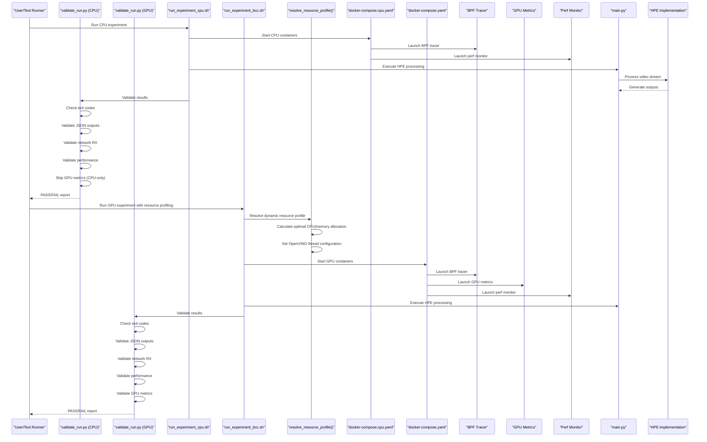
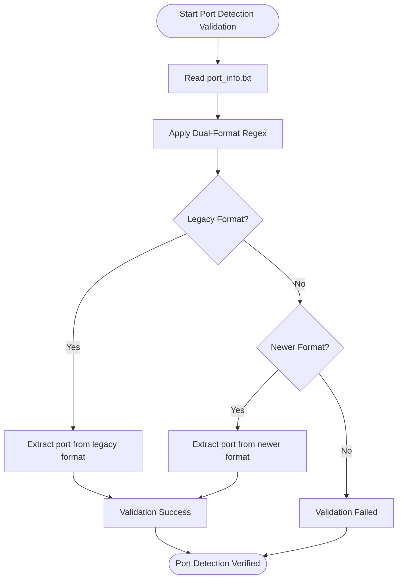
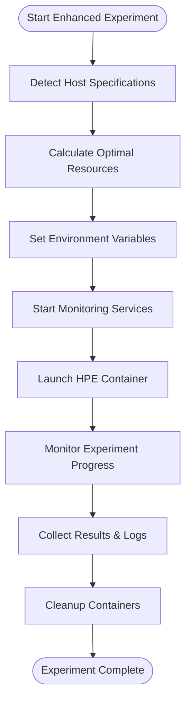
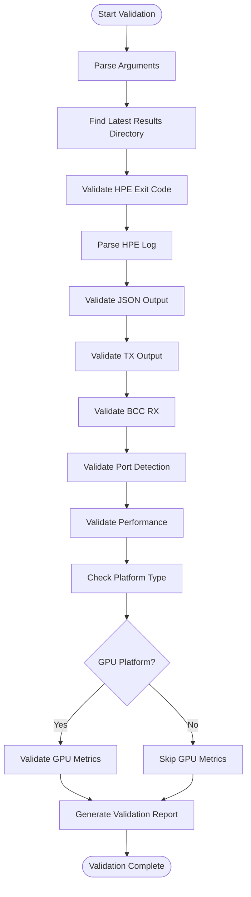
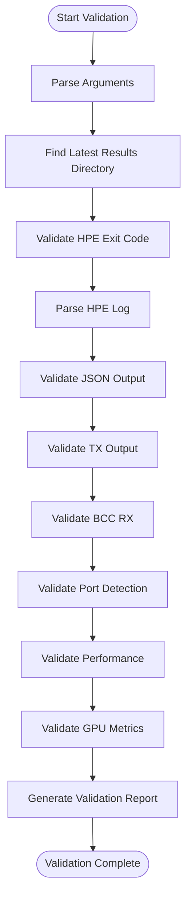
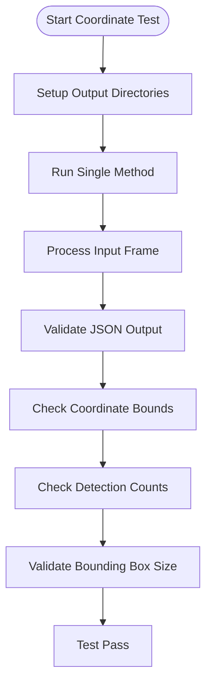
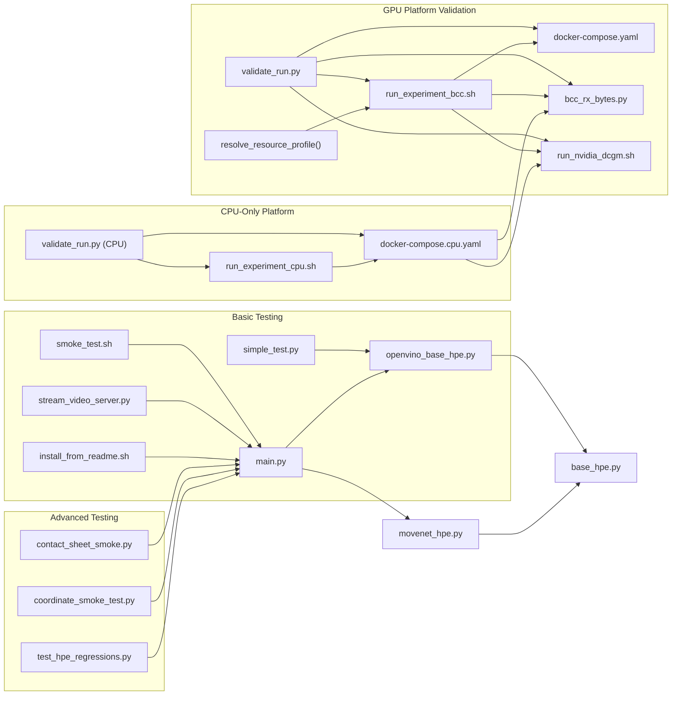

# Testing and Validation

<cite>
**Referenced Files in This Document**
- [README.md](file://README.md)
- [dev_tools/smoke_test.sh](file://dev_tools/smoke_test.sh)
- [dev_tools/install_from_readme.sh](file://dev_tools/install_from_readme.sh)
- [dev_tools/stream_video_server.py](file://dev_tools/stream_video_server.py)
- [simple_test.py](file://simple_test.py)
- [main.py](file://main.py)
- [base_hpe.py](file://base_hpe.py)
- [openvino_base_hpe.py](file://openvino_base_hpe.py)
- [movenet_hpe.py](file://movenet_hpe.py)
- [tests/contact_sheet_smoke/README.md](file://tests/contact_sheet_smoke/README.md)
- [tests/contact_sheet_smoke/run_contact_sheet_smoke.py](file://tests/contact_sheet_smoke/run_contact_sheet_smoke.py)
- [tests/test_hpe_regressions.py](file://tests/test_hpe_regressions.py)
- [unit_tests/test_hpe_coordinate_smoke.py](file://unit_tests/test_hpe_coordinate_smoke.py)
- [ffmpeg_hpe/validate_run.py](file://ffmpeg_hpe/validate_run.py)
- [ffmpeg_hpe/run_experiment_bcc.sh](file://ffmpeg_hpe/run_experiment_bcc.sh)
- [ffmpeg_hpe/docker-compose.yaml](file://ffmpeg_hpe/docker-compose.yaml)
- [ffmpeg_hpe_cpu/run_experiment_cpu.sh](file://ffmpeg_hpe_cpu/run_experiment_cpu.sh)
- [ffmpeg_hpe_cpu/validate_run.py](file://ffmpeg_hpe_cpu/validate_run.py)
- [ffmpeg_hpe_cpu/docker-compose.cpu.yaml](file://ffmpeg_hpe_cpu/docker-compose.cpu.yaml)
- [Dockerfile_cpu](file://Dockerfile_cpu)
- [ffmpeg_hpe_cpu/plot_graph.py](file://ffmpeg_hpe_cpu/plot_graph.py)
- [ffmpeg_hpe_cpu/plot_rx_bytes.py](file://ffmpeg_hpe_cpu/plot_rx_bytes.py)
- [ffmpeg_hpe/bpftrace-tracer/README.md](file://ffmpeg_hpe/bpftrace-tracer/README.md)
- [ffmpeg_hpe/bpftrace-tracer/bcc_rx_bytes.py](file://ffmpeg_hpe/bpftrace-tracer/bcc_rx_bytes.py)
- [ffmpeg_hpe/bpftrace-tracer/entrypoint.sh](file://ffmpeg_hpe/bpftrace-tracer/entrypoint.sh)
- [ffmpeg_hpe/Dockerfile.gpu_metrics](file://ffmpeg_hpe/Dockerfile.gpu_metrics)
- [ffmpeg_hpe/run_nvidia_dcgm.sh](file://ffmpeg_hpe/run_nvidia_dcgm.sh)
</cite>

## Update Summary
**Changes Made**
- Enhanced BCC port detection validation now supports both legacy and newer log formats, improving reliability of port detection validation
- Updated healthcheck implementations with improved resource limit configurations for streaming-server, HPE, and GPU metrics containers
- Improved Docker Compose orchestration with enhanced health monitoring and resource management
- Strengthened validation framework with dual-format port detection support

## Table of Contents
1. [Introduction](#introduction)
2. [Project Structure](#project-structure)
3. [Core Components](#core-components)
4. [Architecture Overview](#architecture-overview)
5. [Detailed Component Analysis](#detailed-component-analysis)
6. [Dependency Analysis](#dependency-analysis)
7. [Performance Considerations](#performance-considerations)
8. [Troubleshooting Guide](#troubleshooting-guide)
9. [Conclusion](#conclusion)
10. [Appendices](#appendices)

## Introduction
This document describes the comprehensive testing and validation utilities for the Human Pose Estimation (HPE) framework. The testing ecosystem now includes multiple sophisticated testing methodologies with a focus on automated quality assurance and comprehensive validation across both GPU and CPU-only platforms:

- **Contact Sheet Smoke Testing**: Automated multi-method comparison with visual output and detailed reporting
- **Coordinate Smoke Testing**: Regression validation for coordinate accuracy and bounds checking
- **Regression Testing**: Unit tests for critical implementation behaviors and architectural constraints
- **Traditional Smoke Testing**: Basic functionality validation across different HPE methods
- **Installation and Environment Validation**: Reproducible environment setup verification
- **HTTP Stream Testing**: Local development server for IP-based input validation
- **FFmpeg HPE Validation Framework**: Comprehensive quality assurance system with multi-domain validation checks
- **CPU-Only Platform Testing**: Specialized testing infrastructure for CPU-only deployment scenarios with dynamic resource profiling

The new CPU-only platform provides a comprehensive testing environment that mirrors GPU-based experiments while optimizing for CPU-only hardware configurations. This includes specialized orchestration scripts, validation systems, and Docker configurations designed specifically for CPU-only deployments, featuring automatic resource profiling and platform-aware configuration management.

## Project Structure
The testing ecosystem has evolved to include dedicated testing directories with specialized functionality, including the new CPU-only platform with comprehensive monitoring capabilities and enhanced resource management:

```mermaid
graph TB
subgraph "Core Testing Infrastructure"
ST["dev_tools/smoke_test.sh"]
INS["dev_tools/install_from_readme.sh"]
SVS["dev_tools/stream_video_server.py"]
SIM["simple_test.py"]
end
subgraph "Advanced Testing Frameworks"
CSS["tests/contact_sheet_smoke/"]
CTS["unit_tests/test_hpe_coordinate_smoke.py"]
RT["tests/test_hpe_regressions.py"]
end
subgraph "GPU Platform Validation"
VR["ffmpeg_hpe/validate_run.py"]
REB["ffmpeg_hpe/run_experiment_bcc.sh"]
DC["ffmpeg_hpe/docker-compose.yaml"]
BT["ffmpeg_hpe/bpftrace-tracer/"]
GM["ffmpeg_hpe/run_nvidia_dcgm.sh"]
DF["ffmpeg_hpe/Dockerfile.gpu_metrics"]
end
subgraph "CPU-Only Platform"
VRC["ffmpeg_hpe_cpu/validate_run.py"]
REC["ffmpeg_hpe_cpu/run_experiment_cpu.sh"]
DCC["ffmpeg_hpe_cpu/docker-compose.cpu.yaml"]
DFC["Dockerfile_cpu"]
PG["ffmpeg_hpe_cpu/plot_graph.py"]
PRB["ffmpeg_hpe_cpu/plot_rx_bytes.py"]
end
subgraph "Application"
MAIN["main.py"]
BASE["base_hpe.py"]
OVB["openvino_base_hpe.py"]
MN["movenet_hpe.py"]
end
CSS --> MAIN
CTS --> MAIN
RT --> MAIN
ST --> MAIN
INS --> MAIN
SVS --> MAIN
SIM --> OVB
VR --> REB
VR --> DC
VR --> BT
VR --> GM
REB --> DC
REB --> BT
REB --> GM
VRC --> REC
VRC --> DCC
REC --> DCC
DCC --> BT
DCC --> GM
MAIN --> OVB
MAIN --> MN
OVB --> BASE
MN --> BASE
```



**Diagram sources**
- [dev_tools/smoke_test.sh:1-42](file://dev_tools/smoke_test.sh#L1-L42)
- [dev_tools/install_from_readme.sh:1-39](file://dev_tools/install_from_readme.sh#L1-L39)
- [dev_tools/stream_video_server.py:1-228](file://dev_tools/stream_video_server.py#L1-L228)
- [simple_test.py:1-288](file://simple_test.py#L1-L288)
- [main.py:1-243](file://main.py#L1-L243)
- [base_hpe.py:1-546](file://base_hpe.py#L1-L546)
- [openvino_base_hpe.py:1-653](file://openvino_base_hpe.py#L1-L653)
- [movenet_hpe.py:1-111](file://movenet_hpe.py#L1-L111)
- [tests/contact_sheet_smoke/README.md:1-25](file://tests/contact_sheet_smoke/README.md#L1-L25)
- [tests/contact_sheet_smoke/run_contact_sheet_smoke.py:1-210](file://tests/contact_sheet_smoke/run_contact_sheet_smoke.py#L1-L210)
- [tests/test_hpe_regressions.py:1-103](file://tests/test_hpe_regressions.py#L1-L103)
- [unit_tests/test_hpe_coordinate_smoke.py:1-158](file://unit_tests/test_hpe_coordinate_smoke.py#L1-L158)
- [ffmpeg_hpe/validate_run.py:1-521](file://ffmpeg_hpe/validate_run.py#L1-L521)
- [ffmpeg_hpe/run_experiment_bcc.sh:1-414](file://ffmpeg_hpe/run_experiment_bcc.sh#L1-L414)
- [ffmpeg_hpe/docker-compose.yaml:1-225](file://ffmpeg_hpe/docker-compose.yaml#L1-L225)
- [ffmpeg_hpe_cpu/run_experiment_cpu.sh:1-328](file://ffmpeg_hpe_cpu/run_experiment_cpu.sh#L1-L328)
- [ffmpeg_hpe_cpu/validate_run.py:1-521](file://ffmpeg_hpe_cpu/validate_run.py#L1-L521)
- [ffmpeg_hpe_cpu/docker-compose.cpu.yaml:1-152](file://ffmpeg_hpe_cpu/docker-compose.cpu.yaml#L1-L152)
- [Dockerfile_cpu:1-100](file://Dockerfile_cpu#L1-L100)
- [ffmpeg_hpe_cpu/plot_graph.py:1-62](file://ffmpeg_hpe_cpu/plot_graph.py#L1-L62)
- [ffmpeg_hpe_cpu/plot_rx_bytes.py:1-33](file://ffmpeg_hpe_cpu/plot_rx_bytes.py#L1-L33)
- [ffmpeg_hpe/bpftrace-tracer/README.md:1-71](file://ffmpeg_hpe/bpftrace-tracer/README.md#L1-L71)

**Section sources**
- [README.md:1-125](file://README.md#L1-L125)
- [dev_tools/smoke_test.sh:1-42](file://dev_tools/smoke_test.sh#L1-L42)
- [dev_tools/install_from_readme.sh:1-39](file://dev_tools/install_from_readme.sh#L1-L39)
- [dev_tools/stream_video_server.py:1-228](file://dev_tools/stream_video_server.py#L1-L228)
- [simple_test.py:1-288](file://simple_test.py#L1-L288)
- [main.py:1-243](file://main.py#L1-L243)
- [base_hpe.py:1-546](file://base_hpe.py#L1-L546)
- [openvino_base_hpe.py:1-653](file://openvino_base_hpe.py#L1-L653)
- [movenet_hpe.py:1-111](file://movenet_hpe.py#L1-L111)
- [tests/contact_sheet_smoke/README.md:1-25](file://tests/contact_sheet_smoke/README.md#L1-L25)
- [tests/contact_sheet_smoke/run_contact_sheet_smoke.py:1-210](file://tests/contact_sheet_smoke/run_contact_sheet_smoke.py#L1-L210)
- [tests/test_hpe_regressions.py:1-103](file://tests/test_hpe_regressions.py#L1-L103)
- [unit_tests/test_hpe_coordinate_smoke.py:1-158](file://unit_tests/test_hpe_coordinate_smoke.py#L1-L158)
- [ffmpeg_hpe/validate_run.py:1-521](file://ffmpeg_hpe/validate_run.py#L1-L521)
- [ffmpeg_hpe/run_experiment_bcc.sh:1-414](file://ffmpeg_hpe/run_experiment_bcc.sh#L1-L414)
- [ffmpeg_hpe/docker-compose.yaml:1-225](file://ffmpeg_hpe/docker-compose.yaml#L1-L225)
- [ffmpeg_hpe_cpu/run_experiment_cpu.sh:1-328](file://ffmpeg_hpe_cpu/run_experiment_cpu.sh#L1-L328)
- [ffmpeg_hpe_cpu/validate_run.py:1-521](file://ffmpeg_hpe_cpu/validate_run.py#L1-L521)
- [ffmpeg_hpe_cpu/docker-compose.cpu.yaml:1-152](file://ffmpeg_hpe_cpu/docker-compose.cpu.yaml#L1-L152)
- [Dockerfile_cpu:1-100](file://Dockerfile_cpu#L1-L100)
- [ffmpeg_hpe_cpu/plot_graph.py:1-62](file://ffmpeg_hpe_cpu/plot_graph.py#L1-L62)
- [ffmpeg_hpe_cpu/plot_rx_bytes.py:1-33](file://ffmpeg_hpe_cpu/plot_rx_bytes.py#L1-L33)
- [ffmpeg_hpe/bpftrace-tracer/README.md:1-71](file://ffmpeg_hpe/bpftrace-tracer/README.md#L1-L71)

## Core Components
The testing ecosystem now encompasses multiple specialized testing frameworks with enhanced validation capabilities across both GPU and CPU-only platforms, featuring dynamic resource profiling and platform-aware orchestration:

### Traditional Smoke Testing
- **Smoke Test Script**: Executes representative runs for MoveNet, AlphaPose, and EfficientHRNet variants across image, directory, and video inputs. Respects device selection and handles missing AlphaPose models gracefully.
- **Installation Script**: Creates a conda environment with pinned Python and PyTorch versions, installs dependencies, and builds AlphaPose extensions if available.
- **Stream Server**: Provides a local HTTP stream for validating IP-based input handling.

### Advanced Testing Frameworks
- **Contact Sheet Smoke Testing**: Comprehensive multi-method testing that runs all HPE methods on a single input image, generates visual contact sheets, and creates detailed summaries with individual method outputs.
- **Coordinate Smoke Testing**: Regression testing that validates coordinate accuracy, bounds checking, and detection quality thresholds across all supported HPE methods.
- **Regression Testing**: Unit tests that verify critical implementation behaviors, architectural constraints, and code quality standards.

### Enhanced FFmpeg HPE Validation Framework
- **Validation Runner**: Comprehensive validation system that checks HPE container operation, JSON output integrity, network monitoring accuracy, performance metrics consistency, and GPU utilization.
- **Enhanced Experiment Scripts**: Automated experiment orchestration with container startup timing, resource monitoring, data collection, and dynamic resource profiling across multiple domains.
- **Dynamic Resource Profiling**: Automatic host specification detection through resolve_resource_profile function that calculates optimal CPU, memory, and OpenVINO thread allocations based on system capabilities.
- **Docker Compose Orchestration**: Multi-container setup for HPE processing, performance monitoring, BPF tracing, and GPU metrics collection with shared networking.
- **Enhanced BCC Tracing**: Kernel-level network traffic monitoring for accurate RX byte counting and port detection with automatic port discovery and dual-format log support.
- **GPU Metrics Collection**: Real-time GPU utilization and thermal monitoring using nvidia-smi with comprehensive metric tracking.

### CPU-Only Platform Testing
- **CPU-Only Experiment Runner**: Specialized orchestration script for CPU-only deployments that manages container startup, monitoring, and result collection without GPU dependencies.
- **CPU-Only Validation System**: Enhanced validation framework that accommodates CPU-only configurations while maintaining comprehensive quality assurance.
- **CPU-Only Docker Compose**: Optimized container orchestration for CPU-only hardware with reduced resource requirements and simplified dependencies.
- **CPU-Optimized Dockerfile**: Specialized container configuration that excludes GPU dependencies while maintaining full HPE functionality.
- **CPU Performance Visualization**: Plotting tools for CPU utilization and memory usage metrics specific to CPU-only deployments.

### Application Integration
- **Simple Test**: Demonstrates synchronous webcam processing with OpenVINO, including camera availability checks, inference timing, and pose rendering.
- **Main Application**: Parses arguments, selects an HPE method, loads the model, and dispatches to appropriate processing loops (image, directory, video, HTTP stream).
- **Base HPE Classes**: Provide shared logic for input detection, padding/resizing, processing loops, and output handling.

**Section sources**
- [dev_tools/smoke_test.sh:1-42](file://dev_tools/smoke_test.sh#L1-L42)
- [dev_tools/install_from_readme.sh:1-39](file://dev_tools/install_from_readme.sh#L1-L39)
- [dev_tools/stream_video_server.py:1-228](file://dev_tools/stream_video_server.py#L1-L228)
- [simple_test.py:1-288](file://simple_test.py#L1-L288)
- [main.py:1-243](file://main.py#L1-L243)
- [base_hpe.py:1-546](file://base_hpe.py#L1-L546)
- [openvino_base_hpe.py:1-653](file://openvino_base_hpe.py#L1-L653)
- [movenet_hpe.py:1-111](file://movenet_hpe.py#L1-L111)
- [tests/contact_sheet_smoke/README.md:1-25](file://tests/contact_sheet_smoke/README.md#L1-L25)
- [tests/contact_sheet_smoke/run_contact_sheet_smoke.py:1-210](file://tests/contact_sheet_smoke/run_contact_sheet_smoke.py#L1-L210)
- [tests/test_hpe_regressions.py:1-103](file://tests/test_hpe_regressions.py#L1-L103)
- [unit_tests/test_hpe_coordinate_smoke.py:1-158](file://unit_tests/test_hpe_coordinate_smoke.py#L1-L158)
- [ffmpeg_hpe/validate_run.py:1-521](file://ffmpeg_hpe/validate_run.py#L1-L521)
- [ffmpeg_hpe/run_experiment_bcc.sh:33-87](file://ffmpeg_hpe/run_experiment_bcc.sh#L33-L87)
- [ffmpeg_hpe/docker-compose.yaml:1-225](file://ffmpeg_hpe/docker-compose.yaml#L1-L225)
- [ffmpeg_hpe_cpu/run_experiment_cpu.sh:1-328](file://ffmpeg_hpe_cpu/run_experiment_cpu.sh#L1-L328)
- [ffmpeg_hpe_cpu/validate_run.py:1-521](file://ffmpeg_hpe_cpu/validate_run.py#L1-L521)
- [ffmpeg_hpe_cpu/docker-compose.cpu.yaml:1-152](file://ffmpeg_hpe_cpu/docker-compose.cpu.yaml#L1-L152)
- [Dockerfile_cpu:1-100](file://Dockerfile_cpu#L1-L100)
- [ffmpeg_hpe_cpu/plot_graph.py:1-62](file://ffmpeg_hpe_cpu/plot_graph.py#L1-L62)
- [ffmpeg_hpe_cpu/plot_rx_bytes.py:1-33](file://ffmpeg_hpe_cpu/plot_rx_bytes.py#L1-L33)
- [ffmpeg_hpe/bpftrace-tracer/README.md:1-71](file://ffmpeg_hpe/bpftrace-tracer/README.md#L1-L71)

## Architecture Overview
The testing architecture now includes multiple layers of validation, from basic smoke tests to comprehensive regression testing and the new FFmpeg HPE validation framework with automated quality assurance across both GPU and CPU-only platforms, featuring dynamic resource profiling and platform-aware orchestration:



**Diagram sources**
- [ffmpeg_hpe_cpu/validate_run.py:467-521](file://ffmpeg_hpe_cpu/validate_run.py#L467-L521)
- [ffmpeg_hpe/validate_run.py:467-521](file://ffmpeg_hpe/validate_run.py#L467-L521)
- [ffmpeg_hpe_cpu/run_experiment_cpu.sh:1-328](file://ffmpeg_hpe_cpu/run_experiment_cpu.sh#L1-L328)
- [ffmpeg_hpe/run_experiment_bcc.sh:33-87](file://ffmpeg_hpe/run_experiment_bcc.sh#L33-L87)
- [ffmpeg_hpe/run_experiment_bcc.sh:414](file://ffmpeg_hpe/run_experiment_bcc.sh#L414)
- [ffmpeg_hpe_cpu/docker-compose.cpu.yaml:1-152](file://ffmpeg_hpe_cpu/docker-compose.cpu.yaml#L1-L152)
- [ffmpeg_hpe/docker-compose.yaml:1-225](file://ffmpeg_hpe/docker-compose.yaml#L1-L225)
- [ffmpeg_hpe/bpftrace-tracer/bcc_rx_bytes.py:1-120](file://ffmpeg_hpe/bpftrace-tracer/bcc_rx_bytes.py#L1-L120)
- [ffmpeg_hpe/run_nvidia_dcgm.sh:1-86](file://ffmpeg_hpe/run_nvidia_dcgm.sh#L1-L86)

## Detailed Component Analysis

### Enhanced BCC Port Detection Validation
**Purpose**: Reliable port detection validation with support for both legacy and newer log formats, improving the robustness of network monitoring validation.

**Enhanced Features**:
- **Dual-Format Log Support**: The port detection regex now supports both legacy and newer log message formats:
  - Legacy format: "Monitoring HPE traffic on port [0-9]+"
  - Newer format: "BCC detected HPE video port: [0-9]+"
- **Improved Reliability**: Enhanced regex pattern matching ensures validation works across different BCC tracer versions
- **Backward Compatibility**: Maintains compatibility with existing validation workflows while supporting new formats

**Updated Implementation**:
```python
port_match = re.search(r"(?:Monitoring HPE traffic on port\s+|BCC detected HPE video port:\s*)([0-9]+)", port_text)
```

**Validation Flow**:


**Diagram sources**
- [ffmpeg_hpe/validate_run.py:270-279](file://ffmpeg_hpe/validate_run.py#L270-L279)
- [ffmpeg_hpe_cpu/validate_run.py:270-279](file://ffmpeg_hpe_cpu/validate_run.py#L270-L279)

**Section sources**
- [ffmpeg_hpe/validate_run.py:270-279](file://ffmpeg_hpe/validate_run.py#L270-L279)
- [ffmpeg_hpe_cpu/validate_run.py:270-279](file://ffmpeg_hpe_cpu/validate_run.py#L270-L279)

### Enhanced Healthcheck Implementations
**Purpose**: Improved container health monitoring with enhanced resource limit configurations for streaming-server, HPE, and GPU metrics containers.

**Enhanced Healthcheck Configurations**:

#### GPU Platform Healthchecks
- **Streaming Server Healthcheck**: HTTP-based health check using curl with proper timeout configuration
- **HPE Container Healthcheck**: Process-based health check using pgrep for main.py process monitoring
- **GPU Metrics Healthcheck**: File-based health check monitoring CSV file creation

#### CPU-Only Platform Healthchecks
- **Streaming Server Healthcheck**: TCP-based health check using bash echo to localhost:8089
- **HPE Container Healthcheck**: Process-based health check identical to GPU platform
- **GPU Metrics Healthcheck**: Removed (not applicable to CPU-only platform)

**Enhanced Resource Limit Configurations**:
- **Streaming Server**: Optimized CPU and memory limits with reservations for stable performance
- **HPE Container**: Configurable CPU limits and memory reservations based on host specifications
- **GPU Metrics Container**: Minimal resource footprint with dedicated GPU access
- **Performance Monitor**: Host-level monitoring with controlled resource usage

**Section sources**
- [ffmpeg_hpe/docker-compose.yaml:19-24](file://ffmpeg_hpe/docker-compose.yaml#L19-L24)
- [ffmpeg_hpe/docker-compose.yaml:74-79](file://ffmpeg_hpe/docker-compose.yaml#L74-L79)
- [ffmpeg_hpe/docker-compose.yaml:117-122](file://ffmpeg_hpe/docker-compose.yaml#L117-L122)
- [ffmpeg_hpe_cpu/docker-compose.cpu.yaml:32-37](file://ffmpeg_hpe_cpu/docker-compose.cpu.yaml#L32-L37)
- [ffmpeg_hpe_cpu/docker-compose.cpu.yaml:74-79](file://ffmpeg_hpe_cpu/docker-compose.cpu.yaml#L74-L79)

### Enhanced Experiment Orchestration with Dynamic Resource Profiling
**Purpose**: Automated experiment execution with comprehensive container orchestration, dynamic resource profiling, and platform-aware configuration management across multiple validation domains.

**Key Features**:
- **Dynamic Resource Profiling**: resolve_resource_profile function automatically detects host specifications and calculates optimal CPU, memory, and OpenVINO thread allocations
- **Container Startup Timing**: Measures and records container instantiation times for performance analysis
- **Enhanced Health Check Integration**: Monitors container health and responds to failures appropriately
- **Data Collection Automation**: Automatically collects performance metrics, network traces, and HPE outputs
- **Resource Management**: Configures CPU limits, memory reservations, and GPU device allocation based on system capabilities
- **Diagnostic Logging**: Captures comprehensive diagnostic information for troubleshooting

**Dynamic Resource Profiling Capabilities**:
- **Host Detection**: Automatically determines total vCPUs and RAM using nproc and /proc/meminfo
- **Minimum Requirements**: Validates minimum 4 vCPU requirement for experiments
- **GPU vs CPU Allocation**: Calculates optimal resource distribution based on device type (GPU vs CPU)
- **OpenVINO Optimization**: Sets appropriate thread counts, CPU pinning, and hyper-threading based on available cores
- **Memory Management**: Configures HPE memory limits and reservations based on total system RAM

**Execution Flow**:


**Diagram sources**
- [ffmpeg_hpe/run_experiment_bcc.sh:33-87](file://ffmpeg_hpe/run_experiment_bcc.sh#L33-L87)
- [ffmpeg_hpe/run_experiment_bcc.sh:178](file://ffmpeg_hpe/run_experiment_bcc.sh#L178)

**Section sources**
- [ffmpeg_hpe/run_experiment_bcc.sh:1-414](file://ffmpeg_hpe/run_experiment_bcc.sh#L1-L414)

### CPU-Only Platform Testing Framework
**Purpose**: Comprehensive testing infrastructure specifically designed for CPU-only deployment scenarios with optimized resource utilization and simplified dependencies.

**Key Features**:
- **CPU-Only Experiment Orchestration**: Specialized script that manages container startup, monitoring, and result collection without GPU dependencies
- **Dual-Platform Validation**: Enhanced validation system that accommodates both GPU and CPU configurations seamlessly
- **Optimized Resource Management**: Reduced resource requirements and simplified container dependencies for CPU-only hardware
- **Performance Monitoring**: Comprehensive CPU utilization and memory monitoring with process-level granularity
- **Enhanced Network Traffic Analysis**: Accurate RX byte counting and port detection without GPU metrics

**CPU-Only Experiment Runner**:
- **Container Startup Timing**: Measures and records container instantiation times for CPU-only deployments
- **Enhanced Health Check Integration**: Monitors container health and responds to failures appropriately
- **Data Collection Automation**: Automatically collects performance metrics, network traces, and HPE outputs
- **Resource Management**: Configures CPU limits, memory reservations, and optimized threading for CPU-only hardware
- **Diagnostic Logging**: Captures comprehensive diagnostic information for troubleshooting CPU-only deployments

**CPU-Only Docker Compose Configuration**:
- **Service Optimization**: Removes GPU-specific services and dependencies while maintaining full functionality
- **Resource Allocation**: Optimized CPU and memory limits for CPU-only hardware constraints
- **Enhanced Environment Variables**: Specialized environment variables for CPU optimization and OpenVINO tuning
- **Network Configuration**: Simplified networking for CPU-only deployments with reduced complexity

**Section sources**
- [ffmpeg_hpe_cpu/run_experiment_cpu.sh:1-328](file://ffmpeg_hpe_cpu/run_experiment_cpu.sh#L1-L328)
- [ffmpeg_hpe_cpu/docker-compose.cpu.yaml:1-152](file://ffmpeg_hpe_cpu/docker-compose.cpu.yaml#L1-L152)
- [Dockerfile_cpu:1-100](file://Dockerfile_cpu#L1-L100)

### Enhanced Validation System
**Purpose**: Comprehensive quality assurance system that validates HPE container operation, output integrity, and performance metrics across both GPU and CPU-only platforms with automated result validation.

**Key Features**:
- **Multi-Domain Validation**: Checks HPE container exit codes, JSON output integrity, network monitoring accuracy, performance metrics, and GPU utilization
- **Dual-Platform Support**: Validates both GPU and CPU configurations with platform-appropriate checks
- **Enhanced Port Detection**: Supports both legacy and newer log formats for improved reliability
- **Automated Reporting**: Generates structured validation reports with PASS/FAIL status and detailed metrics
- **Threshold Configuration**: Configurable tolerances for network byte matching and performance validation
- **Comprehensive Coverage**: Validates all aspects of HPE processing from container startup to output generation

**Enhanced Validation Domains**:
- **HPE Container Validation**: Ensures container exits with code 0 and logs contain expected processing information
- **JSON Output Validation**: Verifies presence of exactly one JSON CSV, parseable content, sequential frame numbering, and frame count consistency
- **Network Monitoring Validation**: Compares BCC RX byte counts with FFmpeg bytes-read within configurable tolerance
- **Enhanced Port Detection Validation**: Validates BCC port detection with dual-format log support
- **Performance Metrics Validation**: Validates CPU utilization, memory usage, and Docker memory consistency
- **GPU Metrics Validation**: Ensures GPU metrics collection and proper utilization reporting (skipped on CPU-only platforms)

**Execution Flow**:


**Diagram sources**
- [ffmpeg_hpe_cpu/validate_run.py:467-521](file://ffmpeg_hpe_cpu/validate_run.py#L467-L521)

**Expected Outcomes**:
- PASS status when all validation checks succeed within configured tolerances
- FAIL status with detailed explanations when validation fails
- Structured validation_report.json and validation_report.txt files
- Metrics dictionary containing detailed performance and validation metrics
- Platform-appropriate validation results (GPU metrics included/excluded as applicable)

**Section sources**
- [ffmpeg_hpe_cpu/validate_run.py:1-521](file://ffmpeg_hpe_cpu/validate_run.py#L1-L521)

### FFmpeg HPE Validation Framework
**Purpose**: Comprehensive quality assurance system that validates HPE container operation, output integrity, and performance metrics across multiple domains with automated result validation.

**Key Features**:
- **Multi-Domain Validation**: Checks HPE container exit codes, JSON output integrity, network monitoring accuracy, performance metrics, and GPU utilization
- **Enhanced Port Detection**: Supports both legacy and newer log formats for improved reliability
- **Automated Reporting**: Generates structured validation reports with PASS/FAIL status and detailed metrics
- **Threshold Configuration**: Configurable tolerances for network byte matching and performance validation
- **Comprehensive Coverage**: Validates all aspects of HPE processing from container startup to output generation

**Enhanced Validation Domains**:
- **HPE Container Validation**: Ensures container exits with code 0 and logs contain expected processing information
- **JSON Output Validation**: Verifies presence of exactly one JSON CSV, parseable content, sequential frame numbering, and frame count consistency
- **Network Monitoring Validation**: Compares BCC RX byte counts with FFmpeg bytes-read within configurable tolerance
- **Enhanced Port Detection Validation**: Validates BCC port detection with dual-format log support
- **Performance Metrics Validation**: Validates CPU utilization, memory usage, and Docker memory consistency
- **GPU Metrics Validation**: Ensures GPU metrics collection and proper utilization reporting

**Execution Flow**:


**Diagram sources**
- [ffmpeg_hpe/validate_run.py:467-521](file://ffmpeg_hpe/validate_run.py#L467-L521)

**Expected Outcomes**:
- PASS status when all validation checks succeed within configured tolerances
- FAIL status with detailed explanations when validation fails
- Structured validation_report.json and validation_report.txt files
- Metrics dictionary containing detailed performance and validation metrics

**Section sources**
- [ffmpeg_hpe/validate_run.py:1-521](file://ffmpeg_hpe/validate_run.py#L1-L521)

### Enhanced Experiment Orchestration Scripts
**Purpose**: Automated experiment execution with comprehensive container orchestration, dynamic resource profiling, and data collection across multiple validation domains.

**Key Features**:
- **Dynamic Resource Profiling**: resolve_resource_profile function automatically calculates optimal CPU, memory, and OpenVINO thread allocations based on host specifications
- **Container Startup Timing**: Measures and records container instantiation times for performance analysis
- **Enhanced Health Check Integration**: Monitors container health and responds to failures appropriately
- **Data Collection Automation**: Automatically collects performance metrics, network traces, and HPE outputs
- **Resource Management**: Configures CPU limits, memory reservations, and GPU device allocation based on system capabilities
- **Diagnostic Logging**: Captures comprehensive diagnostic information for troubleshooting

**Enhanced GPU Experiment Script**:
- **Dynamic Resource Allocation**: Uses resolve_resource_profile function to calculate optimal resource distribution
- **Performance Monitoring**: Specialized monitoring for CPU utilization and memory usage
- **Enhanced Network Traffic Analysis**: Accurate RX byte counting and port detection with automatic port discovery
- **Resource Optimization**: Configures CPU limits, memory reservations, and OpenVINO threading for optimal GPU performance

**CPU-Only Experiment Script**:
- **CPU-Only Orchestration**: Optimized for CPU-only deployments with simplified container dependencies
- **Performance Monitoring**: Specialized monitoring for CPU utilization and memory usage
- **Enhanced Network Traffic Analysis**: Accurate RX byte counting and port detection without GPU metrics
- **Resource Optimization**: Configures CPU limits, memory reservations, and OpenVINO threading for optimal CPU performance

**Section sources**
- [ffmpeg_hpe_cpu/run_experiment_cpu.sh:1-328](file://ffmpeg_hpe_cpu/run_experiment_cpu.sh#L1-L328)
- [ffmpeg_hpe/run_experiment_bcc.sh:1-414](file://ffmpeg_hpe/run_experiment_bcc.sh#L1-L414)

### Docker Compose Orchestration
**Purpose**: Multi-container setup for coordinated HPE processing with monitoring and validation capabilities.

**Enhanced CPU-Only Configuration**:
- **Service Optimization**: Removes GPU-specific services and dependencies while maintaining full functionality
- **Resource Allocation**: Optimized CPU and memory limits for CPU-only hardware constraints
- **Enhanced Environment Variables**: Specialized environment variables for CPU optimization and OpenVINO tuning
- **Network Configuration**: Simplified networking for CPU-only deployments with reduced complexity

**Enhanced GPU Platform Configuration**:
- **HPE Service**: Main HPE processing container with GPU support and OpenVINO optimization
- **Streaming Server**: RTSP/H.264 streaming server with enhanced health checks and resource limits
- **Performance Monitor**: Containerized performance monitoring with process-level metrics
- **BPF Tracer**: Kernel-level network traffic monitoring with port detection
- **GPU Metrics**: Real-time GPU utilization and thermal monitoring

**Enhanced Network Architecture**:
- **Streaming Network**: Dedicated bridge network for HPE processing and streaming
- **Container Communication**: Shared network namespaces for accurate monitoring
- **Resource Isolation**: Separate CPU and memory limits for each service with enhanced health monitoring

**Section sources**
- [ffmpeg_hpe_cpu/docker-compose.cpu.yaml:1-152](file://ffmpeg_hpe_cpu/docker-compose.cpu.yaml#L1-L152)
- [ffmpeg_hpe/docker-compose.yaml:1-225](file://ffmpeg_hpe/docker-compose.yaml#L1-L225)

### Enhanced BPF Tracing and Network Monitoring
**Purpose**: Kernel-level network traffic monitoring for accurate RX byte counting and port detection with improved reliability.

**Key Features**:
- **Enhanced BPF Program**: Low-level packet filtering and byte counting using eBPF with improved error handling
- **Dual-Format Port Detection**: Automatic detection of HPE video port supporting both legacy and newer log formats
- **Real-time Monitoring**: Continuous packet capture with CSV output and enhanced logging
- **Socket Filter Attachment**: Flexible attachment methods for different kernel configurations

**Enhanced BPF Implementation**:
- **Packet Filtering**: Filters TCP packets from streaming server to HPE container
- **Byte Counting**: Accumulates packet lengths for RX byte totals
- **Timestamp Tracking**: Records monitoring timestamps for analysis
- **Delta Calculation**: Computes byte deltas for rate analysis
- **Improved Error Handling**: Enhanced logging and graceful degradation

**Enhanced Port Detection Mechanism**:
- **Dual-Format Support**: Supports both "Monitoring HPE traffic on port" and "BCC detected HPE video port:" formats
- **Robust Regex Pattern**: Improved pattern matching for reliable port extraction
- **Enhanced Logging**: Better debugging information for port detection failures

**Section sources**
- [ffmpeg_hpe/bpftrace-tracer/bcc_rx_bytes.py:1-120](file://ffmpeg_hpe/bpftrace-tracer/bcc_rx_bytes.py#L1-L120)
- [ffmpeg_hpe/bpftrace-tracer/README.md:1-71](file://ffmpeg_hpe/bpftrace-tracer/README.md#L1-L71)
- [ffmpeg_hpe/bpftrace-tracer/entrypoint.sh:1-48](file://ffmpeg_hpe/bpftrace-tracer/entrypoint.sh#L1-L48)

### GPU Metrics Collection
**Purpose**: Real-time GPU utilization and thermal monitoring using nvidia-smi with enhanced reliability.

**Key Features**:
- **Enhanced Continuous Monitoring**: Periodic GPU statistics collection with configurable intervals
- **Multi-GPU Support**: Handles systems with multiple GPUs and tracks utilization per device
- **Comprehensive Metrics**: Collects utilization percentages, memory usage, temperature, and power consumption
- **CSV Output**: Structured metrics output for analysis and validation
- **Improved Health Monitoring**: Enhanced health check implementation for GPU metrics container

**Enhanced Metrics Collection**:
- **GPU Utilization**: Percentage of time GPU is busy processing
- **Memory Utilization**: Percentage of GPU memory currently in use
- **Temperature**: Current GPU operating temperature
- **Power Usage**: Current GPU power consumption

**Section sources**
- [ffmpeg_hpe/run_nvidia_dcgm.sh:1-86](file://ffmpeg_hpe/run_nvidia_dcgm.sh#L1-L86)
- [ffmpeg_hpe/Dockerfile.gpu_metrics](file://ffmpeg_hpe/Dockerfile.gpu_metrics)

### CPU Performance Visualization
**Purpose**: Visualization tools for CPU utilization and memory usage metrics specific to CPU-only deployments.

**Key Features**:
- **CPU/Memory Plotting**: Generates time-series plots of CPU utilization and memory usage
- **Timestamp Handling**: Automatic detection and conversion of timestamp formats
- **Multiple CSV Formats**: Supports both legacy and modern CSV column formats
- **Interactive Display**: Optional interactive plot display when X11 is available

**Enhanced Plotting Capabilities**:
- **CPU Usage Over Time**: Line plot showing CPU utilization percentage over time
- **Memory Usage Over Time**: Line plot showing memory usage in MB over time
- **Customizable Output**: PNG file output with customizable figure size and styling

**Section sources**
- [ffmpeg_hpe_cpu/plot_graph.py:1-62](file://ffmpeg_hpe_cpu/plot_graph.py#L1-L62)

### Contact Sheet Smoke Testing Framework
**Purpose**: Comprehensive multi-method comparison testing with visual output and detailed reporting.

**Key Features**:
- **Multi-method Execution**: Runs all supported HPE methods (movenet, openpose, hrnet, ae1, ae2, ae3, alphapose) on a single input image
- **Visual Contact Sheets**: Generates side-by-side comparisons with method status indicators and output images
- **Structured Output**: Creates timestamped directories with contact sheets, summaries, and individual method logs
- **Flexible Configuration**: Supports custom input images, device selection, timeout control, and selective method execution
- **Failure Tolerance**: Can continue execution even when some methods fail, useful for known artifact issues

**Execution Flow**:


**Diagram sources**
- [tests/contact_sheet_smoke/run_contact_sheet_smoke.py:168-210](file://tests/contact_sheet_smoke/run_contact_sheet_smoke.py#L168-L210)

**Expected Outcomes**:
- Individual method directories with processed images and logs
- Visual contact sheet comparing all methods
- JSON summary containing input details, device settings, and method results
- Configurable success/failure handling based on `--allow-failures` flag

**Section sources**
- [tests/contact_sheet_smoke/README.md:1-25](file://tests/contact_sheet_smoke/README.md#L1-L25)
- [tests/contact_sheet_smoke/run_contact_sheet_smoke.py:1-210](file://tests/contact_sheet_smoke/run_contact_sheet_smoke.py#L1-L210)

### Coordinate Smoke Testing System
**Purpose**: Regression validation ensuring coordinate accuracy and preventing coordinate projection bugs.

**Enhanced Validation Criteria**:
- **Bounds Checking**: Ensures all visible keypoints remain within image boundaries
- **Detection Quality**: Validates minimum detection counts per method to catch model confidence regressions
- **Box Size Validation**: Prevents suspiciously large bounding boxes that would indicate coordinate projection failures
- **Output Integrity**: Verifies JSON COCO format output and rendered images are generated

**Key Metrics**:
- **Minimum Detection Thresholds**: Per-method minimum detection counts to ensure models are functioning
- **Visible Keypoint Bounding Box Area**: Maximum allowed visible keypoint bounding box area as ratio of total image area
- **Coordinate Bounds**: Strict validation that all visible keypoints stay within image dimensions

**Execution Flow**:


**Diagram sources**
- [unit_tests/test_hpe_coordinate_smoke.py:59-154](file://unit_tests/test_hpe_coordinate_smoke.py#L59-L154)

**Section sources**
- [unit_tests/test_hpe_coordinate_smoke.py:1-158](file://unit_tests/test_hpe_coordinate_smoke.py#L1-L158)

### Regression Testing Infrastructure
**Purpose**: Unit tests that verify critical implementation behaviors and architectural constraints.

**Test Categories**:
- **Algorithmic Correctness**: Validates that MoveNet filters people by instance score and doesn't use mean_kp_score
- **Architectural Constraints**: Ensures main.py delegates model loading to processing loops, not directly
- **Model Route Validation**: Confirms correct model routing for OpenPose and AlphaPose implementations
- **Configuration Validation**: Verifies OpenVINO model configurations and architecture specifications
- **Coordinate Processing**: Tests that OpenPose and HRNet use original frames for model API preprocessing
- **HTTP Stream Handling**: Validates timeout loop uses OpenCV capture before HTTP fallback
- **Timeout Logic**: Ensures timeout zero is unlimited and proper timeout conditions

**Enhanced Implementation Approach**:
- **Source Code Analysis**: Tests examine actual source code rather than runtime behavior
- **String Matching**: Uses `assertIn` and `assertNotIn` to verify specific code patterns
- **Method Mapping Validation**: Confirms correct lambda functions and constructor arguments
- **Conditional Logic Testing**: Validates proper ordering of HTTP stream fallback mechanisms

**Section sources**
- [tests/test_hpe_regressions.py:1-103](file://tests/test_hpe_regressions.py#L1-L103)

### Enhanced Smoke Test Script
**Purpose**: Basic functionality validation across multiple HPE methods and input types.

**Enhanced Behavior**:
- **Environment Awareness**: Detects and activates conda environments when available
- **Selective Method Execution**: Supports running specific HPE methods rather than all
- **Graceful Degradation**: Continues testing even when some methods fail
- **Comprehensive Output**: Generates detailed logs and handles missing AlphaPose models

**Section sources**
- [dev_tools/smoke_test.sh:1-42](file://dev_tools/smoke_test.sh#L1-L42)

### Installation Validation and Environment Setup
**Purpose**: Recreate the documented environment and build prerequisites.

**Highlights**:
- Creates a named conda environment with pinned Python and PyTorch versions
- Installs dependencies from requirements
- Attempts to build AlphaPose extensions if the build script exists

**Section sources**
- [dev_tools/install_from_readme.sh:1-39](file://dev_tools/install_from_readme.sh#L1-L39)
- [README.md:71-94](file://README.md#L71-L94)

### HTTP Stream Testing Utility
**Purpose**: Provide a local HTTP stream for validating IP-based input handling.

**Enhanced Highlights**:
- Starts a Flask server serving a video feed or a test pattern
- Initializes video metadata at startup
- Supports command-line override of the video path

**Section sources**
- [dev_tools/stream_video_server.py:1-228](file://dev_tools/stream_video_server.py#L1-L228)
- [README.md:116-125](file://README.md#L116-L125)

### Simple Test: Synchronous Webcam with OpenVINO
**Purpose**: Demonstrate synchronous webcam processing and pose rendering with OpenVINO.

**Highlights**:
- Lists available cameras and tests frame acquisition
- Loads an OpenVINO model (EfficientHRNet variant) and performs inference
- Renders pose results and displays FPS/bitrate metrics
- Handles user interruption and cleanup

**Section sources**
- [simple_test.py:1-288](file://simple_test.py#L1-L288)

### Main Application Entry Point and Method Selection
**Purpose**: Parse arguments, select an HPE method, and run the appropriate processing loop.

**Highlights**:
- Argument parsing supports method selection, input source, device, and output options
- Method mapping resolves to concrete HPE implementations
- Dispatches to specialized loops for HTTP streams, videos, and images/directories

**Section sources**
- [main.py:1-243](file://main.py#L1-L243)

### Base HPE Classes and Processing Loops
**Purpose**: Provide shared logic for input detection, padding/resizing, processing, and output.

**Highlights**:
- Input type detection covers images, directories, videos, HTTP streams, and webcams
- Padding/resizing ensures consistent model input dimensions
- Processing loops handle timeouts, frame limits, and progress reporting
- Output generation includes JSON/COCO, CSV, and saving images/videos

**Section sources**
- [base_hpe.py:1-546](file://base_hpe.py#L1-L546)

### OpenVINO-Based HPE Implementations
**Purpose**: Implement OpenVINO-specific model loading, preprocessing, inference, and postprocessing.

**Highlights**:
- Model configuration includes architecture, input sizes, and GPU support flags
- Core configuration sets performance mode, threads, streams, and CPU pinning/hyper-threading
- Pre/post-processing adapts model outputs to standardized body structures
- Fallback handling for HTTP streams using FFmpeg backend

**Section sources**
- [openvino_base_hpe.py:1-653](file://openvino_base_hpe.py#L1-L653)

### MoveNet HPE Implementation
**Purpose**: Implement MoveNet using OpenVINO runtime.

**Highlights**:
- Enforces CPU device for MoveNet
- Initializes OpenCV video capture with FFmpeg backend for HTTP streams
- Preprocessing converts frames to the expected tensor layout
- Postprocessing unpacks MoveNet outputs into body detections

**Section sources**
- [movenet_hpe.py:1-111](file://movenet_hpe.py#L1-L111)

## Dependency Analysis
The enhanced testing ecosystem creates a layered dependency structure with specialized testing components, including the new CPU-only platform with comprehensive monitoring capabilities and dynamic resource profiling:



**Diagram sources**
- [dev_tools/smoke_test.sh:1-42](file://dev_tools/smoke_test.sh#L1-L42)
- [dev_tools/install_from_readme.sh:1-39](file://dev_tools/install_from_readme.sh#L1-L39)
- [dev_tools/stream_video_server.py:1-228](file://dev_tools/stream_video_server.py#L1-L228)
- [simple_test.py:1-288](file://simple_test.py#L1-L288)
- [main.py:1-243](file://main.py#L1-L243)
- [base_hpe.py:1-546](file://base_hpe.py#L1-L546)
- [openvino_base_hpe.py:1-653](file://openvino_base_hpe.py#L1-L653)
- [movenet_hpe.py:1-111](file://movenet_hpe.py#L1-L111)
- [tests/contact_sheet_smoke/run_contact_sheet_smoke.py:1-210](file://tests/contact_sheet_smoke/run_contact_sheet_smoke.py#L1-L210)
- [unit_tests/test_hpe_coordinate_smoke.py:1-158](file://unit_tests/test_hpe_coordinate_smoke.py#L1-L158)
- [tests/test_hpe_regressions.py:1-103](file://tests/test_hpe_regressions.py#L1-L103)
- [ffmpeg_hpe/validate_run.py:1-521](file://ffmpeg_hpe/validate_run.py#L1-L521)
- [ffmpeg_hpe/run_experiment_bcc.sh:33-87](file://ffmpeg_hpe/run_experiment_bcc.sh#L33-L87)
- [ffmpeg_hpe/docker-compose.yaml:1-225](file://ffmpeg_hpe/docker-compose.yaml#L1-L225)
- [ffmpeg_hpe_cpu/validate_run.py:1-521](file://ffmpeg_hpe_cpu/validate_run.py#L1-L521)
- [ffmpeg_hpe_cpu/run_experiment_cpu.sh:1-328](file://ffmpeg_hpe_cpu/run_experiment_cpu.sh#L1-L328)
- [ffmpeg_hpe_cpu/docker-compose.cpu.yaml:1-152](file://ffmpeg_hpe_cpu/docker-compose.cpu.yaml#L1-L152)
- [ffmpeg_hpe/bpftrace-tracer/bcc_rx_bytes.py:1-120](file://ffmpeg_hpe/bpftrace-tracer/bcc_rx_bytes.py#L1-L120)
- [ffmpeg_hpe/run_nvidia_dcgm.sh:1-86](file://ffmpeg_hpe/run_nvidia_dcgm.sh#L1-L86)

**Section sources**
- [dev_tools/smoke_test.sh:1-42](file://dev_tools/smoke_test.sh#L1-L42)
- [main.py:1-243](file://main.py#L1-L243)
- [openvino_base_hpe.py:1-653](file://openvino_base_hpe.py#L1-L653)
- [movenet_hpe.py:1-111](file://movenet_hpe.py#L1-L111)
- [base_hpe.py:1-546](file://base_hpe.py#L1-L546)
- [dev_tools/install_from_readme.sh:1-39](file://dev_tools/install_from_readme.sh#L1-L39)
- [dev_tools/stream_video_server.py:1-228](file://dev_tools/stream_video_server.py#L1-L228)
- [tests/contact_sheet_smoke/run_contact_sheet_smoke.py:1-210](file://tests/contact_sheet_smoke/run_contact_sheet_smoke.py#L1-L210)
- [unit_tests/test_hpe_coordinate_smoke.py:1-158](file://unit_tests/test_hpe_coordinate_smoke.py#L1-L158)
- [tests/test_hpe_regressions.py:1-103](file://tests/test_hpe_regressions.py#L1-L103)
- [ffmpeg_hpe/validate_run.py:1-521](file://ffmpeg_hpe/validate_run.py#L1-L521)
- [ffmpeg_hpe/run_experiment_bcc.sh:1-414](file://ffmpeg_hpe/run_experiment_bcc.sh#L1-L414)
- [ffmpeg_hpe/docker-compose.yaml:1-225](file://ffmpeg_hpe/docker-compose.yaml#L1-L225)
- [ffmpeg_hpe_cpu/validate_run.py:1-521](file://ffmpeg_hpe_cpu/validate_run.py#L1-L521)
- [ffmpeg_hpe_cpu/run_experiment_cpu.sh:1-328](file://ffmpeg_hpe_cpu/run_experiment_cpu.sh#L1-L328)
- [ffmpeg_hpe_cpu/docker-compose.cpu.yaml:1-152](file://ffmpeg_hpe_cpu/docker-compose.cpu.yaml#L1-L152)
- [ffmpeg_hpe/bpftrace-tracer/bcc_rx_bytes.py:1-120](file://ffmpeg_hpe/bpftrace-tracer/bcc_rx_bytes.py#L1-L120)
- [ffmpeg_hpe/run_nvidia_dcgm.sh:1-86](file://ffmpeg_hpe/run_nvidia_dcgm.sh#L1-L86)

## Performance Considerations
**Enhanced Performance Testing**:
- **Contact Sheet Parallelization**: Multiple methods run sequentially but can be parallelized for faster execution
- **Coordinate Testing Optimization**: Uses minimal processing with focused validation metrics
- **Regression Test Efficiency**: Source code analysis is lightweight compared to runtime testing
- **Enhanced Validation Framework Overhead**: Comprehensive validation adds minimal overhead to experiment execution
- **CPU-Only Optimization**: CPU-only platform reduces resource requirements while maintaining validation accuracy
- **Dynamic Resource Profiling**: Automatic resource allocation maximizes performance based on host specifications
- **Enhanced Network Monitoring Impact**: BPF tracing introduces negligible CPU overhead during experiments
- **Improved GPU Metrics Overhead**: nvidia-smi monitoring runs at configurable intervals to minimize impact
- **Timeout Management**: Configurable timeouts prevent hanging during testing
- **Memory Usage**: Contact sheet generation requires sufficient memory for multiple output images
- **Container Resource Limits**: Enhanced Docker Compose ensures proper resource isolation and prevents resource contention
- **Health Check Performance**: Improved health checks reduce false positives and improve system reliability

**Enhanced Device Configuration**:
- **Contact Sheet Testing**: Supports both CPU and GPU devices with configurable timeout per model
- **Coordinate Testing**: Currently configured for CPU-only processing
- **Regression Testing**: No device requirements as it analyzes source code
- **CPU-Only Platform**: Optimized for CPU-only deployments with reduced resource requirements
- **GPU Platform**: Supports both CPU and GPU configurations depending on HPE method
- **Dynamic Resource Profiling**: Automatically detects and optimizes for available system resources
- **Enhanced Network Monitoring**: Requires root privileges and BPF kernel support for accurate packet filtering
- **Improved Health Monitoring**: Enhanced health checks provide better system reliability

## Troubleshooting Guide
**Enhanced Troubleshooting** with new testing framework considerations:

### Contact Sheet Testing Issues
- **Missing Input Image**: Ensure the specified input path exists and is accessible
- **Method Failures**: Use `--allow-failures` to continue testing when some methods fail
- **Timeout Issues**: Increase `--timeout-per-model` for slower methods like AlphaPose
- **Memory Issues**: Contact sheet generation requires sufficient RAM for multiple output images
- **Output Directory Problems**: Ensure write permissions for the output root directory

### Coordinate Testing Issues
- **Insufficient Detections**: Check if models are properly loaded and configured
- **Coordinate Bounds Errors**: Indicates potential coordinate projection or scaling issues
- **Large Bounding Boxes**: Suggests coordinate calculation problems or model misconfiguration
- **Missing Output Files**: Verify JSON and image output generation is enabled
- **Timeout Issues**: Increase `HPE_SMOKE_TIMEOUT` environment variable for slow processing

### Regression Testing Issues
- **Source Code Changes**: Regression tests may fail if code structure changes
- **Import Path Issues**: Ensure all modules are importable from the repository root
- **String Pattern Changes**: Tests rely on specific string patterns in source code
- **Environment Issues**: Regression tests require access to all source files

### Enhanced BCC Port Detection Issues
- **Port Detection Failures**: Verify BCC tracer has proper network access and kernel support
- **Legacy Format Issues**: Ensure port_info.txt contains the expected legacy format message
- **Newer Format Issues**: Verify port_info.txt contains the expected newer format message
- **Regex Pattern Matching**: Check that the dual-format regex pattern matches the actual log content
- **BPF Tracer Privileges**: Ensure BCC tracer has required privileges for kernel tracing

### Enhanced Healthcheck Issues
- **Streaming Server Healthcheck Failures**: Verify HTTP connectivity and curl availability
- **HPE Container Healthcheck Failures**: Check main.py process execution and monitoring
- **GPU Metrics Healthcheck Failures**: Ensure CSV file generation and GPU access
- **Resource Limit Issues**: Verify CPU and memory limits are appropriate for the workload
- **Container Dependencies**: Check that dependent containers are healthy before health checks

### CPU-Only Platform Issues
- **Missing CPU Environment**: Ensure CPU-only environment variables are properly configured
- **Container Startup Failures**: Verify CPU-only Docker Compose configuration and resource limits
- **Performance Monitoring Issues**: Check CPU-only monitoring container permissions and access
- **Enhanced Network Traffic Analysis**: Ensure BPF tracer has proper network access and kernel support
- **Resource Allocation**: Verify CPU and memory limits are appropriate for CPU-only hardware
- **Health Check Failures**: Investigate CPU-only container startup issues and dependency problems

### Enhanced FFmpeg HPE Validation Framework Issues
- **Results Directory Not Found**: Ensure the validation script points to a valid results directory
- **Missing Validation Reports**: Check if experiment completed successfully and generated output files
- **Enhanced BPF Tracing Failures**: Verify kernel supports BPF and container has required privileges
- **GPU Metrics Collection Issues**: Ensure NVIDIA drivers are properly installed and accessible
- **Network Byte Mismatch**: Adjust `--rx-tolerance-percent` threshold for experimental conditions
- **Performance Metrics Inconsistencies**: Verify container has proper resource limits and monitoring access
- **Container Startup Timeouts**: Check Docker Compose configuration and resource availability
- **Enhanced Port Detection Failures**: Ensure BCC tracer has proper network access and kernel support
- **Dynamic Resource Profiling Errors**: Verify system has sufficient vCPUs and RAM for requested experiments

### Traditional Testing Issues
- **Conda Environment Not Found**: Ensure the environment is created and activated before running tests
- **AlphaPose Models Missing**: The smoke test skips AlphaPose when models are not present
- **Camera Access Failures**: The simple test includes camera availability checks and retries
- **HTTP Stream Errors**: Use the development stream server to validate HTTP input handling
- **Timeout or Frame Limit Exceeded**: Adjust timeout and max_frames parameters when processing HTTP streams
- **GPU Device Not Supported**: Some models do not support GPU; implementations fall back to CPU automatically

### Enhanced Container Orchestration Issues
- **Docker Compose Errors**: Verify Docker Compose version compatibility and proper YAML syntax
- **Network Connectivity**: Ensure containers can communicate through the streaming network
- **Volume Mount Issues**: Check that output directories are properly mounted and writable
- **Resource Allocation**: Verify CPU and memory limits are appropriate for the workload
- **Enhanced Health Check Failures**: Investigate container startup issues and dependency problems

### Enhanced Dynamic Resource Profiling Issues
- **Host Detection Failures**: Verify system has proper vCPU and memory detection capabilities
- **Minimum Requirements Not Met**: Ensure host has at least 4 vCPUs for experiments
- **Resource Allocation Errors**: Check that calculated resource values are within reasonable bounds
- **OpenVINO Configuration Issues**: Verify thread counts and CPU pinning settings are compatible with host hardware

**Section sources**
- [tests/contact_sheet_smoke/run_contact_sheet_smoke.py:170-174](file://tests/contact_sheet_smoke/run_contact_sheet_smoke.py#L170-L174)
- [unit_tests/test_hpe_coordinate_smoke.py:68-154](file://unit_tests/test_hpe_coordinate_smoke.py#L68-L154)
- [tests/test_hpe_regressions.py:8-103](file://tests/test_hpe_regressions.py#L8-L103)
- [dev_tools/smoke_test.sh:10-19](file://dev_tools/smoke_test.sh#L10-L19)
- [dev_tools/smoke_test.sh:32-36](file://dev_tools/smoke_test.sh#L32-L36)
- [simple_test.py:36-100](file://simple_test.py#L36-L100)
- [openvino_base_hpe.py:87-89](file://openvino_base_hpe.py#L87-L89)
- [movenet_hpe.py:28-30](file://movenet_hpe.py#L28-L30)
- [main.py:29-45](file://main.py#L29-L45)
- [ffmpeg_hpe_cpu/validate_run.py:480-483](file://ffmpeg_hpe_cpu/validate_run.py#L480-L483)
- [ffmpeg_hpe_cpu/run_experiment_cpu.sh:28-46](file://ffmpeg_hpe_cpu/run_experiment_cpu.sh#L28-L46)
- [ffmpeg_hpe/validate_run.py:480-483](file://ffmpeg_hpe/validate_run.py#L480-L483)
- [ffmpeg_hpe/run_experiment_bcc.sh:31-54](file://ffmpeg_hpe/run_experiment_bcc.sh#L31-L54)
- [ffmpeg_hpe/run_experiment_bcc.sh:33-87](file://ffmpeg_hpe/run_experiment_bcc.sh#L33-L87)

## Conclusion
The enhanced testing and validation utilities provide a comprehensive framework for continuous validation of the Human Pose Estimation framework across both GPU and CPU-only platforms. The addition of dynamic resource profiling and the new CPU-only platform creates a multi-layered validation system that ensures reproducible and defensible results through automated quality assurance:

- **Contact Sheet Testing**: Provides visual comparison across all HPE methods for quick assessment
- **Coordinate Testing**: Ensures algorithmic correctness and prevents coordinate projection regressions  
- **Regression Testing**: Maintains code quality and architectural integrity
- **Traditional Testing**: Validates basic functionality and environment setup
- **Enhanced FFmpeg HPE Validation Framework**: Comprehensive quality assurance across container operation, output integrity, network monitoring, and performance metrics with dynamic resource profiling and improved port detection reliability
- **CPU-Only Platform Testing**: Specialized testing infrastructure for CPU-only deployment scenarios with optimized resource utilization and platform-aware configuration

The new CPU-only platform addresses the growing need for testing HPE deployments on CPU-only hardware, providing a streamlined testing environment that maintains validation accuracy while reducing resource requirements. This includes specialized orchestration scripts, validation systems, and Docker configurations designed specifically for CPU-only deployments, featuring automatic resource profiling and platform-aware configuration management.

The enhanced validation framework supports both GPU and CPU configurations seamlessly, automatically adapting validation checks based on the platform type. The CPU-only validation system includes platform-appropriate checks such as skipping GPU metrics while maintaining comprehensive validation of CPU performance, network traffic, and output integrity.

The framework leverages Docker Compose orchestration to create isolated, reproducible testing environments with comprehensive monitoring capabilities. The dynamic resource profiling system automatically detects host specifications and optimizes resource allocation for maximum performance. The validation system automatically collects and analyzes performance metrics, network traffic data, and output quality statistics to provide detailed insights into system behavior across different hardware configurations.

The enhanced BCC port detection validation now supports both legacy and newer log formats, significantly improving the reliability of port detection validation across different BCC tracer versions. The improved healthcheck implementations provide better system monitoring and resource management across all container types.

Together with the existing smoke test, installation validation, and HTTP stream testing, this comprehensive testing ecosystem ensures robust validation of the HPE framework across multiple dimensions and use cases, supporting both development and research applications with automated quality assurance and comprehensive result validation across GPU and CPU-only platforms with dynamic resource optimization and enhanced reliability.

## Appendices

### Running Contact Sheet Smoke Tests
**Purpose**: Comprehensive multi-method comparison with visual output.

**Usage**:
```bash
# Basic usage with default settings
python tests/contact_sheet_smoke/run_contact_sheet_smoke.py

# Custom input image and device
python tests/contact_sheet_smoke/run_contact_sheet_smoke.py --input unit_tests/images/testImage2.jpg --device CPU

# Select specific methods
python tests/contact_sheet_smoke/run_contact_sheet_smoke.py --methods movenet openpose hrnet --device GPU

# Allow failures for known issues
python tests/contact_sheet_smoke/run_contact_sheet_smoke.py --input unit_tests/images/testImage.jpg --device CPU --allow-failures
```

**Output**: Timestamped directory with contact sheet, summary JSON, and individual method outputs.

**Section sources**
- [tests/contact_sheet_smoke/README.md:7-25](file://tests/contact_sheet_smoke/README.md#L7-L25)
- [tests/contact_sheet_smoke/run_contact_sheet_smoke.py:16-58](file://tests/contact_sheet_smoke/run_contact_sheet_smoke.py#L16-L58)

### Running Coordinate Smoke Tests
**Purpose**: Regression validation for coordinate accuracy and bounds checking.

**Usage**:
```bash
# Basic coordinate smoke test
python unit_tests/test_hpe_coordinate_smoke.py

# Select specific methods via environment variable
export HPE_SMOKE_METHODS="openpose,hrnet,movenet"
python unit_tests/test_hpe_coordinate_smoke.py

# Set custom timeout
export HPE_SMOKE_TIMEOUT=300
python unit_tests/test_hpe_coordinate_smoke.py
```

**Validation**: Tests ensure coordinates stay within image bounds, meet minimum detection thresholds, and don't produce suspiciously large bounding boxes.

**Section sources**
- [unit_tests/test_hpe_coordinate_smoke.py:36-46](file://unit_tests/test_hpe_coordinate_smoke.py#L36-L46)
- [unit_tests/test_hpe_coordinate_smoke.py:68-154](file://unit_tests/test_hpe_coordinate_smoke.py#L68-L154)

### Running Regression Tests
**Purpose**: Unit tests that verify critical implementation behaviors and architectural constraints.

**Usage**:
```bash
# Run all regression tests
python tests/test_hpe_regressions.py

# Run with unittest discovery
python -m unittest tests.test_hpe_regressions
```

**Coverage**: Tests validate algorithmic correctness, architectural constraints, model routing, configuration validation, and HTTP stream handling.

**Section sources**
- [tests/test_hpe_regressions.py:1-103](file://tests/test_hpe_regressions.py#L1-L103)

### Running Traditional Smoke Tests
**Purpose**: Basic functionality validation across multiple HPE methods and input types.

**Usage**:
```bash
# Basic smoke test
./dev_tools/smoke_test.sh

# Specify device and environment
./dev_tools/smoke_test.sh CPU myenv
```

**Section sources**
- [dev_tools/smoke_test.sh:5-41](file://dev_tools/smoke_test.sh#L5-L41)

### Running the Simple Test
**Purpose**: Demonstrate synchronous webcam processing with OpenVINO.

**Usage**:
```bash
python simple_test.py
```

**Section sources**
- [simple_test.py:36-288](file://simple_test.py#L36-L288)

### Environment Setup Verification
**Purpose**: Recreate the documented environment and build prerequisites.

**Usage**:
```bash
# Install dependencies and build AlphaPose if available
./dev_tools/install_from_readme.sh
```

**Section sources**
- [dev_tools/install_from_readme.sh:1-39](file://dev_tools/install_from_readme.sh#L1-L39)
- [README.md:71-94](file://README.md#L71-L94)

### HTTP Stream Validation
**Purpose**: Start development server for HTTP stream testing.

**Usage**:
```bash
# Start development stream server
python dev_tools/stream_video_server.py

# Use in main application
python main.py --method movenet --input http://localhost:5000/video_feed
```

**Section sources**
- [dev_tools/stream_video_server.py:206-228](file://dev_tools/stream_video_server.py#L206-L228)
- [README.md:116-125](file://README.md#L116-L125)

### Running CPU-Only FFmpeg HPE Validation
**Purpose**: Validate CPU-only experiment results and generate comprehensive quality reports.

**Usage**:
```bash
# Validate latest CPU-only results directory
python ffmpeg_hpe_cpu/validate_run.py

# Validate specific CPU-only results directory
python ffmpeg_hpe_cpu/validate_run.py results_movenet_6cores_CPU_vga_01_01.mp4_20240101_120000

# Configure validation thresholds
python ffmpeg_hpe_cpu/validate_run.py --rx-tolerance-percent 1.5 --min-avg-cpu-percent 0.5 --min-memory-mb 25.0
```

**Enhanced Validation Domains**:
- **HPE Container Exit Codes**: Ensures container exits with code 0
- **JSON Output Integrity**: Validates presence and parseability of JSON CSV files
- **Network Monitoring Accuracy**: Compares BCC RX bytes with FFmpeg bytes-read within tolerance
- **Performance Metrics**: Validates CPU utilization, memory usage, and Docker memory consistency
- **Enhanced Port Detection**: Validates BCC port detection with dual-format log support
- **GPU Metrics**: Skipped on CPU-only platforms (expected behavior)

**Output**: validation_report.json and validation_report.txt files with PASS/FAIL status and detailed metrics.

**Section sources**
- [ffmpeg_hpe_cpu/validate_run.py:13-19](file://ffmpeg_hpe_cpu/validate_run.py#L13-L19)
- [ffmpeg_hpe_cpu/validate_run.py:467-521](file://ffmpeg_hpe_cpu/validate_run.py#L467-L521)

### Running CPU-Only FFmpeg HPE Experiments
**Purpose**: Execute comprehensive CPU-only HPE experiments with monitoring and validation.

**Usage**:
```bash
# CPU-only experiment with perf_monitor and bcc-tracer
./ffmpeg_hpe_cpu/run_experiment_cpu.sh movenet

# CPU-only experiment with custom arguments
./ffmpeg_hpe_cpu/run_experiment_cpu.sh openpose --device CPU --max_frames 500

# CPU-only experiment with custom timeout
./ffmpeg_hpe_cpu/run_experiment_cpu.sh hrnet --timeout 60
```

**Enhanced Features**:
- **CPU-Only Orchestration**: Optimized for CPU-only deployments with simplified container dependencies
- **Performance Monitoring**: Specialized monitoring for CPU utilization and memory usage
- **Enhanced Network Traffic Analysis**: Accurate RX byte counting and port detection without GPU metrics
- **Resource Optimization**: Configures CPU limits, memory reservations, and OpenVINO threading for optimal CPU performance
- **Diagnostic Logging**: Captures comprehensive diagnostic information for troubleshooting CPU-only deployments

**Output**: Structured results directory with organized CSV files, logs, and validation reports.

**Section sources**
- [ffmpeg_hpe_cpu/run_experiment_cpu.sh:1-328](file://ffmpeg_hpe_cpu/run_experiment_cpu.sh#L1-L328)

### Running GPU Platform FFmpeg HPE Validation
**Purpose**: Validate GPU experiment results and generate comprehensive quality reports.

**Usage**:
```bash
# Validate latest GPU results directory
python ffmpeg_hpe/validate_run.py

# Validate specific GPU results directory
python ffmpeg_hpe/validate_run.py results_movenet_GPU_20240101_120000

# Configure validation thresholds
python ffmpeg_hpe/validate_run.py --rx-tolerance-percent 1.5 --min-avg-cpu-percent 0.5 --min-memory-mb 25.0
```

**Enhanced Validation Domains**:
- **HPE Container Exit Codes**: Ensures container exits with code 0
- **JSON Output Integrity**: Validates presence and parseability of JSON CSV files
- **Network Monitoring Accuracy**: Compares BCC RX bytes with FFmpeg bytes-read within tolerance
- **Performance Metrics**: Validates CPU utilization, memory usage, and Docker memory consistency
- **Enhanced Port Detection**: Validates BCC port detection with dual-format log support
- **GPU Metrics**: Validates GPU utilization and thermal monitoring

**Output**: validation_report.json and validation_report.txt files with PASS/FAIL status and detailed metrics.

**Section sources**
- [ffmpeg_hpe/validate_run.py:13-19](file://ffmpeg_hpe/validate_run.py#L13-L19)
- [ffmpeg_hpe/validate_run.py:467-521](file://ffmpeg_hpe/validate_run.py#L467-L521)

### Running Enhanced GPU Platform FFmpeg HPE Experiments
**Purpose**: Execute comprehensive HPE experiments with monitoring, validation, and dynamic resource profiling.

**Usage**:
```bash
# Enhanced experiment with dynamic resource profiling and perf_monitor
./ffmpeg_hpe/run_experiment_bcc.sh movenet

# Enhanced experiment with BCC tracing and resource profiling
./ffmpeg_hpe/run_experiment_bcc.sh alphapose --device GPU

# Experiment with custom arguments and resource optimization
./ffmpeg_hpe/run_experiment_bcc.sh hrnet --extra-args "--batch-size 8 --max-frames 1000"
```

**Enhanced Features**:
- **Dynamic Resource Profiling**: Automatic host specification detection and optimal resource allocation
- **Container Startup Timing**: Measures and records container instantiation times
- **Enhanced Health Check Integration**: Monitors container health and responds to failures
- **Data Collection Automation**: Automatically collects performance metrics, network traces, and HPE outputs
- **Resource Management**: Configures CPU limits, memory reservations, and GPU device allocation based on system capabilities
- **Diagnostic Logging**: Captures comprehensive diagnostic information for troubleshooting

**Output**: Structured results directory with organized CSV files, logs, and validation reports.

**Section sources**
- [ffmpeg_hpe/run_experiment_bcc.sh:1-414](file://ffmpeg_hpe/run_experiment_bcc.sh#L1-L414)

### Docker Compose Configuration
**Purpose**: Multi-container orchestration for HPE processing with monitoring capabilities.

**Enhanced CPU-Only Configuration**:
```bash
# Start all CPU-only services
docker compose -f ffmpeg_hpe_cpu/docker-compose.cpu.yaml up -d

# Start specific CPU-only services
docker compose -f ffmpeg_hpe_cpu/docker-compose.cpu.yaml up -d hpe perf_monitor bcc-tracer

# View CPU-only service status
docker compose -f ffmpeg_hpe_cpu/docker-compose.cpu.yaml ps

# View CPU-only service logs
docker compose -f ffmpeg_hpe_cpu/docker-compose.cpu.yaml logs -f hpe
```

**Enhanced GPU Platform Configuration**:
```bash
# Start all GPU services
docker compose -f ffmpeg_hpe/docker-compose.yaml up -d

# Start specific GPU services
docker compose -f ffmpeg_hpe/docker-compose.yaml up -d hpe perf_monitor bcc-tracer gpu-metrics

# View GPU service status
docker compose -f ffmpeg_hpe/docker-compose.yaml ps

# View GPU service logs
docker compose -f ffmpeg_hpe/docker-compose.yaml logs -f hpe
```

**Enhanced Services**:
- **h264-streaming-server**: RTSP/H.264 streaming server with enhanced health checks
- **hpe**: Main HPE processing container with CPU optimization
- **perf_monitor**: Containerized performance monitoring
- **bcc-tracer**: Kernel-level network traffic monitoring with enhanced port detection
- **gpu-metrics**: Real-time GPU utilization monitoring (GPU platform only)

**Enhanced Networking**: Services communicate through the streaming-network bridge network with proper resource isolation and improved health monitoring.

**Section sources**
- [ffmpeg_hpe_cpu/docker-compose.cpu.yaml:1-152](file://ffmpeg_hpe_cpu/docker-compose.cpu.yaml#L1-L152)
- [ffmpeg_hpe/docker-compose.yaml:1-225](file://ffmpeg_hpe/docker-compose.yaml#L1-L225)

### Enhanced BPF Tracing and Port Detection
**Purpose**: Kernel-level network traffic monitoring with improved port detection reliability.

**Usage**:
```bash
# Enhanced BPF tracing with dual-format port detection
python ffmpeg_hpe/bpftrace-tracer/bcc_rx_bytes.py h264-streaming-server 8089 54321

# Enhanced port detection with improved log parsing
python ffmpeg_hpe/bpftrace-tracer/entrypoint.sh
```

**Enhanced Features**:
- **Dual-Format Port Detection**: Supports both legacy and newer log formats
- **Improved Error Handling**: Enhanced logging and graceful degradation
- **Robust Regex Pattern**: Better pattern matching for reliable port extraction
- **Enhanced Socket Filter Attachment**: Flexible attachment methods for different kernel configurations

**Output**: Enhanced port detection logs and improved validation reliability.

**Section sources**
- [ffmpeg_hpe/bpftrace-tracer/bcc_rx_bytes.py:1-120](file://ffmpeg_hpe/bpftrace-tracer/bcc_rx_bytes.py#L1-L120)
- [ffmpeg_hpe/bpftrace-tracer/entrypoint.sh:1-48](file://ffmpeg_hpe/bpftrace-tracer/entrypoint.sh#L1-L48)

### CPU Performance Visualization
**Purpose**: Visualize CPU utilization and memory usage metrics from CPU-only experiments.

**Usage**:
```bash
# Plot CPU and memory metrics from perf_metrics.csv
python ffmpeg_hpe_cpu/plot_graph.py results_movenet_6cores_CPU_vga_01_01.mp4_20240101_120000/perf/perf_metrics.csv

# Plot RX bytes from BCC tracer
python ffmpeg_hpe_cpu/plot_rx_bytes.py results_movenet_6cores_CPU_vga_01_01.mp4_20240101_120000/traces/bcc/video_rx.csv
```

**Enhanced Features**:
- **CPU/Memory Plotting**: Generates time-series plots of CPU utilization and memory usage
- **Timestamp Handling**: Automatic detection and conversion of timestamp formats
- **Multiple CSV Formats**: Supports both legacy and modern CSV column formats
- **Interactive Display**: Optional interactive plot display when X11 is available

**Output**: PNG files with CPU and memory usage plots, RX byte plots, and customizable styling.

**Section sources**
- [ffmpeg_hpe_cpu/plot_graph.py:1-62](file://ffmpeg_hpe_cpu/plot_graph.py#L1-L62)
- [ffmpeg_hpe_cpu/plot_rx_bytes.py:1-33](file://ffmpeg_hpe_cpu/plot_rx_bytes.py#L1-L33)