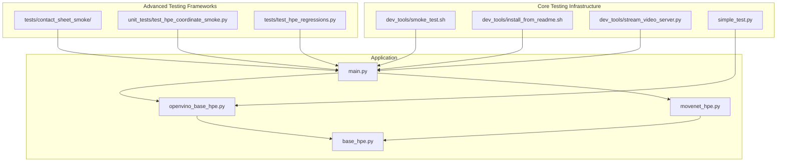
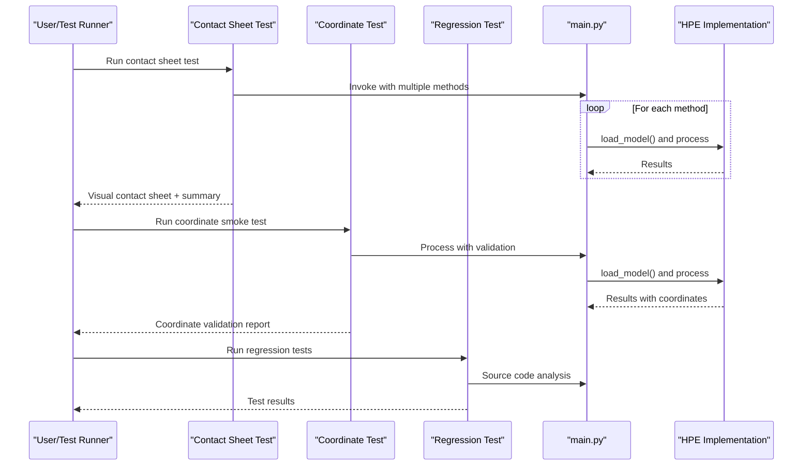
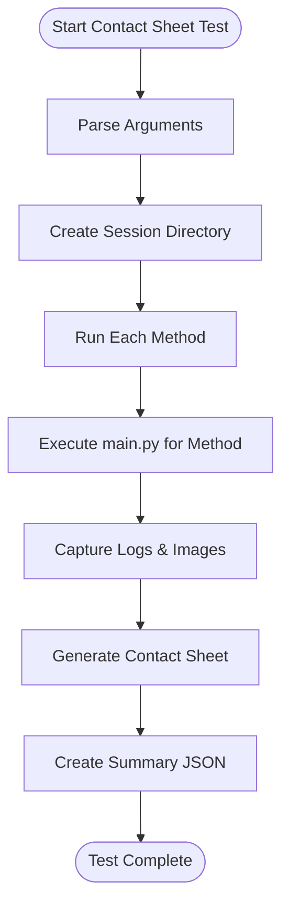
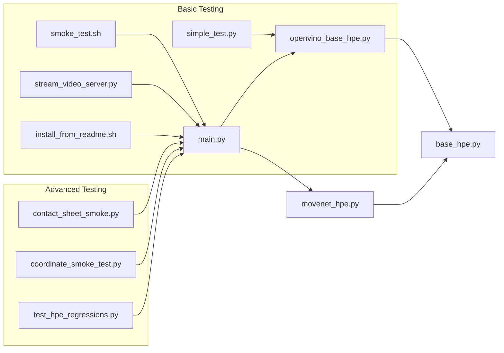

# Testing and Validation

<cite>
**Referenced Files in This Document**
- [README.md](file://README.md)
- [dev_tools/smoke_test.sh](file://dev_tools/smoke_test.sh)
- [dev_tools/install_from_readme.sh](file://dev_tools/install_from_readme.sh)
- [dev_tools/stream_video_server.py](file://dev_tools/stream_video_server.py)
- [simple_test.py](file://simple_test.py)
- [main.py](file://main.py)
- [base_hpe.py](file://base_hpe.py)
- [openvino_base_hpe.py](file://openvino_base_hpe.py)
- [movenet_hpe.py](file://movenet_hpe.py)
- [tests/contact_sheet_smoke/README.md](file://tests/contact_sheet_smoke/README.md)
- [tests/contact_sheet_smoke/run_contact_sheet_smoke.py](file://tests/contact_sheet_smoke/run_contact_sheet_smoke.py)
- [tests/test_hpe_regressions.py](file://tests/test_hpe_regressions.py)
- [unit_tests/test_hpe_coordinate_smoke.py](file://unit_tests/test_hpe_coordinate_smoke.py)
</cite>

## Update Summary
**Changes Made**
- Added comprehensive contact sheet smoke testing framework documentation
- Documented coordinate smoke testing system with regression validation
- Enhanced testing methodology section with new testing infrastructure
- Updated architecture overview to include new testing components
- Added new testing components to project structure visualization
- Expanded troubleshooting guide with new test-specific issues

## Table of Contents
1. [Introduction](#introduction)
2. [Project Structure](#project-structure)
3. [Core Components](#core-components)
4. [Architecture Overview](#architecture-overview)
5. [Detailed Component Analysis](#detailed-component-analysis)
6. [Dependency Analysis](#dependency-analysis)
7. [Performance Considerations](#performance-considerations)
8. [Troubleshooting Guide](#troubleshooting-guide)
9. [Conclusion](#conclusion)
10. [Appendices](#appendices)

## Introduction
This document describes the comprehensive testing and validation utilities for the Human Pose Estimation (HPE) framework. The testing ecosystem now includes multiple sophisticated testing methodologies:

- **Contact Sheet Smoke Testing**: Automated multi-method comparison with visual output
- **Coordinate Smoke Testing**: Regression validation for coordinate accuracy and bounds checking
- **Regression Testing**: Unit tests for critical implementation behaviors and architectural constraints
- **Traditional Smoke Testing**: Basic functionality validation across different HPE methods
- **Installation and Environment Validation**: Reproducible environment setup verification
- **HTTP Stream Testing**: Local development server for IP-based input validation

These testing frameworks provide comprehensive coverage for different aspects of HPE functionality, from basic smoke tests to detailed coordinate validation and architectural regression testing.

## Project Structure
The testing ecosystem has evolved to include dedicated testing directories with specialized functionality:



**Diagram sources**
- [dev_tools/smoke_test.sh:1-42](file://dev_tools/smoke_test.sh#L1-L42)
- [dev_tools/install_from_readme.sh:1-39](file://dev_tools/install_from_readme.sh#L1-L39)
- [dev_tools/stream_video_server.py:1-228](file://dev_tools/stream_video_server.py#L1-L228)
- [simple_test.py:1-288](file://simple_test.py#L1-L288)
- [main.py:1-243](file://main.py#L1-L243)
- [base_hpe.py:1-546](file://base_hpe.py#L1-L546)
- [openvino_base_hpe.py:1-653](file://openvino_base_hpe.py#L1-L653)
- [movenet_hpe.py:1-111](file://movenet_hpe.py#L1-L111)
- [tests/contact_sheet_smoke/README.md:1-25](file://tests/contact_sheet_smoke/README.md#L1-L25)
- [tests/contact_sheet_smoke/run_contact_sheet_smoke.py:1-210](file://tests/contact_sheet_smoke/run_contact_sheet_smoke.py#L1-L210)
- [tests/test_hpe_regressions.py:1-103](file://tests/test_hpe_regressions.py#L1-L103)
- [unit_tests/test_hpe_coordinate_smoke.py:1-158](file://unit_tests/test_hpe_coordinate_smoke.py#L1-L158)

**Section sources**
- [README.md:1-125](file://README.md#L1-L125)
- [dev_tools/smoke_test.sh:1-42](file://dev_tools/smoke_test.sh#L1-L42)
- [dev_tools/install_from_readme.sh:1-39](file://dev_tools/install_from_readme.sh#L1-L39)
- [dev_tools/stream_video_server.py:1-228](file://dev_tools/stream_video_server.py#L1-L228)
- [simple_test.py:1-288](file://simple_test.py#L1-L288)
- [main.py:1-243](file://main.py#L1-L243)
- [base_hpe.py:1-546](file://base_hpe.py#L1-L546)
- [openvino_base_hpe.py:1-653](file://openvino_base_hpe.py#L1-L653)
- [movenet_hpe.py:1-111](file://movenet_hpe.py#L1-L111)
- [tests/contact_sheet_smoke/README.md:1-25](file://tests/contact_sheet_smoke/README.md#L1-L25)
- [tests/contact_sheet_smoke/run_contact_sheet_smoke.py:1-210](file://tests/contact_sheet_smoke/run_contact_sheet_smoke.py#L1-L210)
- [tests/test_hpe_regressions.py:1-103](file://tests/test_hpe_regressions.py#L1-L103)
- [unit_tests/test_hpe_coordinate_smoke.py:1-158](file://unit_tests/test_hpe_coordinate_smoke.py#L1-L158)

## Core Components
The testing ecosystem now encompasses multiple specialized testing frameworks:

### Traditional Smoke Testing
- **Smoke Test Script**: Executes representative runs for MoveNet, AlphaPose, and EfficientHRNet variants across image, directory, and video inputs. Respects device selection and handles missing AlphaPose models gracefully.
- **Installation Script**: Creates a conda environment with pinned Python and PyTorch versions, installs dependencies, and builds AlphaPose extensions if available.
- **Stream Server**: Provides a local HTTP stream for validating IP-based input handling.

### Advanced Testing Frameworks
- **Contact Sheet Smoke Testing**: Comprehensive multi-method testing that runs all HPE methods on a single input image, generates visual contact sheets, and creates detailed summaries with individual method outputs.
- **Coordinate Smoke Testing**: Regression testing that validates coordinate accuracy, bounds checking, and detection quality thresholds across all supported HPE methods.
- **Regression Testing**: Unit tests that verify critical implementation behaviors, architectural constraints, and code quality standards.

### Application Integration
- **Simple Test**: Demonstrates synchronous webcam processing with OpenVINO, including camera availability checks, inference timing, and pose rendering.
- **Main Application**: Parses arguments, selects an HPE method, loads the model, and dispatches to appropriate processing loops (image, directory, video, HTTP stream).
- **Base HPE Classes**: Provide shared logic for input detection, padding/resizing, processing loops, and output handling.

**Section sources**
- [dev_tools/smoke_test.sh:1-42](file://dev_tools/smoke_test.sh#L1-L42)
- [dev_tools/install_from_readme.sh:1-39](file://dev_tools/install_from_readme.sh#L1-L39)
- [dev_tools/stream_video_server.py:1-228](file://dev_tools/stream_video_server.py#L1-L228)
- [simple_test.py:1-288](file://simple_test.py#L1-L288)
- [main.py:1-243](file://main.py#L1-L243)
- [base_hpe.py:1-546](file://base_hpe.py#L1-L546)
- [openvino_base_hpe.py:1-653](file://openvino_base_hpe.py#L1-L653)
- [movenet_hpe.py:1-111](file://movenet_hpe.py#L1-L111)
- [tests/contact_sheet_smoke/README.md:1-25](file://tests/contact_sheet_smoke/README.md#L1-L25)
- [tests/contact_sheet_smoke/run_contact_sheet_smoke.py:1-210](file://tests/contact_sheet_smoke/run_contact_sheet_smoke.py#L1-L210)
- [tests/test_hpe_regressions.py:1-103](file://tests/test_hpe_regressions.py#L1-L103)
- [unit_tests/test_hpe_coordinate_smoke.py:1-158](file://unit_tests/test_hpe_coordinate_smoke.py#L1-L158)

## Architecture Overview
The testing architecture now includes multiple layers of validation, from basic smoke tests to comprehensive regression testing:



**Diagram sources**
- [tests/contact_sheet_smoke/run_contact_sheet_smoke.py:61-101](file://tests/contact_sheet_smoke/run_contact_sheet_smoke.py#L61-L101)
- [unit_tests/test_hpe_coordinate_smoke.py:78-101](file://unit_tests/test_hpe_coordinate_smoke.py#L78-L101)
- [tests/test_hpe_regressions.py:8-103](file://tests/test_hpe_regressions.py#L8-L103)
- [main.py:208-227](file://main.py#L208-L227)

## Detailed Component Analysis

### Contact Sheet Smoke Testing Framework
**Purpose**: Comprehensive multi-method comparison testing with visual output and detailed reporting.

**Key Features**:
- **Multi-method Execution**: Runs all supported HPE methods (movenet, openpose, hrnet, ae1, ae2, ae3, alphapose) on a single input image
- **Visual Contact Sheets**: Generates side-by-side comparisons with method status indicators and output images
- **Structured Output**: Creates timestamped directories with contact sheets, summaries, and individual method logs
- **Flexible Configuration**: Supports custom input images, device selection, timeout control, and selective method execution
- **Failure Tolerance**: Can continue execution even when some methods fail, useful for known artifact issues

**Execution Flow**:


**Diagram sources**
- [tests/contact_sheet_smoke/run_contact_sheet_smoke.py:168-210](file://tests/contact_sheet_smoke/run_contact_sheet_smoke.py#L168-L210)

**Expected Outcomes**:
- Individual method directories with processed images and logs
- Visual contact sheet comparing all methods
- JSON summary containing input details, device settings, and method results
- Configurable success/failure handling based on `--allow-failures` flag

**Section sources**
- [tests/contact_sheet_smoke/README.md:1-25](file://tests/contact_sheet_smoke/README.md#L1-L25)
- [tests/contact_sheet_smoke/run_contact_sheet_smoke.py:1-210](file://tests/contact_sheet_smoke/run_contact_sheet_smoke.py#L1-L210)

### Coordinate Smoke Testing System
**Purpose**: Regression validation ensuring coordinate accuracy and preventing coordinate projection bugs.

**Validation Criteria**:
- **Bounds Checking**: Ensures all visible keypoints remain within image boundaries
- **Detection Quality**: Validates minimum detection counts per method to catch model confidence regressions
- **Box Size Validation**: Prevents suspiciously large bounding boxes that would indicate coordinate projection failures
- **Output Integrity**: Verifies JSON COCO format output and rendered images are generated

**Key Metrics**:
- **Minimum Detection Thresholds**: Per-method minimum detection counts to ensure models are functioning
- **Visible Keypoint Bounding Box Area**: Maximum allowed visible keypoint bounding box area as ratio of total image area
- **Coordinate Bounds**: Strict validation that all visible keypoints stay within image dimensions

**Execution Flow**:


**Diagram sources**
- [unit_tests/test_hpe_coordinate_smoke.py:59-154](file://unit_tests/test_hpe_coordinate_smoke.py#L59-L154)

**Section sources**
- [unit_tests/test_hpe_coordinate_smoke.py:1-158](file://unit_tests/test_hpe_coordinate_smoke.py#L1-L158)

### Regression Testing Infrastructure
**Purpose**: Unit tests that verify critical implementation behaviors and architectural constraints.

**Test Categories**:
- **Algorithmic Correctness**: Validates that MoveNet filters people by instance score and doesn't use mean_kp_score
- **Architectural Constraints**: Ensures main.py delegates model loading to processing loops, not directly
- **Model Route Validation**: Confirms correct model routing for OpenPose and AlphaPose implementations
- **Configuration Validation**: Verifies OpenVINO model configurations and architecture specifications
- **Coordinate Processing**: Tests that OpenPose and HRNet use original frames for model API preprocessing
- **HTTP Stream Handling**: Validates timeout loop uses OpenCV capture before HTTP fallback
- **Timeout Logic**: Ensures timeout zero is unlimited and proper timeout conditions

**Implementation Approach**:
- **Source Code Analysis**: Tests examine actual source code rather than runtime behavior
- **String Matching**: Uses `assertIn` and `assertNotIn` to verify specific code patterns
- **Method Mapping Validation**: Confirms correct lambda functions and constructor arguments
- **Conditional Logic Testing**: Validates proper ordering of HTTP stream fallback mechanisms

**Section sources**
- [tests/test_hpe_regressions.py:1-103](file://tests/test_hpe_regressions.py#L1-L103)

### Enhanced Smoke Test Script
**Purpose**: Basic functionality validation across multiple HPE methods and input types.

**Enhanced Behavior**:
- **Environment Awareness**: Detects and activates conda environments when available
- **Selective Method Execution**: Supports running specific HPE methods rather than all
- **Graceful Degradation**: Continues testing even when some methods fail
- **Comprehensive Output**: Generates detailed logs and handles missing AlphaPose models

**Section sources**
- [dev_tools/smoke_test.sh:1-42](file://dev_tools/smoke_test.sh#L1-L42)

### Installation Validation and Environment Setup
**Purpose**: Recreate the documented environment and build prerequisites.

**Highlights**:
- Creates a named conda environment with pinned Python and PyTorch versions
- Installs dependencies from requirements
- Attempts to build AlphaPose extensions if the build script exists

**Section sources**
- [dev_tools/install_from_readme.sh:1-39](file://dev_tools/install_from_readme.sh#L1-L39)
- [README.md:71-94](file://README.md#L71-L94)

### HTTP Stream Testing Utility
**Purpose**: Provide a local HTTP stream for validating IP-based input handling.

**Highlights**:
- Starts a Flask server serving a video feed or a test pattern
- Initializes video metadata at startup
- Supports command-line override of the video path

**Section sources**
- [dev_tools/stream_video_server.py:1-228](file://dev_tools/stream_video_server.py#L1-L228)
- [README.md:116-125](file://README.md#L116-L125)

### Simple Test: Synchronous Webcam with OpenVINO
**Purpose**: Demonstrate synchronous webcam processing and pose rendering with OpenVINO.

**Highlights**:
- Lists available cameras and tests frame acquisition
- Loads an OpenVINO model (EfficientHRNet variant) and performs inference
- Renders pose results and displays FPS/bitrate metrics
- Handles user interruption and cleanup

**Section sources**
- [simple_test.py:1-288](file://simple_test.py#L1-L288)

### Main Application Entry Point and Method Selection
**Purpose**: Parse arguments, select an HPE method, and run the appropriate processing loop.

**Highlights**:
- Argument parsing supports method selection, input source, device, and output options
- Method mapping resolves to concrete HPE implementations
- Dispatches to specialized loops for HTTP streams, videos, and images/directories

**Section sources**
- [main.py:1-243](file://main.py#L1-L243)

### Base HPE Classes and Processing Loops
**Purpose**: Provide shared logic for input detection, padding/resizing, processing, and output.

**Highlights**:
- Input type detection covers images, directories, videos, HTTP streams, and webcams
- Padding/resizing ensures consistent model input dimensions
- Processing loops handle timeouts, frame limits, and progress reporting
- Output generation includes JSON/COCO, CSV, and saving images/videos

**Section sources**
- [base_hpe.py:1-546](file://base_hpe.py#L1-L546)

### OpenVINO-Based HPE Implementations
**Purpose**: Implement OpenVINO-specific model loading, preprocessing, inference, and postprocessing.

**Highlights**:
- Model configuration includes architecture, input sizes, and GPU support flags
- Core configuration sets performance mode, threads, streams, and CPU pinning/hyper-threading
- Pre/post-processing adapts model outputs to standardized body structures
- Fallback handling for HTTP streams using FFmpeg backend

**Section sources**
- [openvino_base_hpe.py:1-653](file://openvino_base_hpe.py#L1-L653)

### MoveNet HPE Implementation
**Purpose**: Implement MoveNet using OpenVINO runtime.

**Highlights**:
- Enforces CPU device for MoveNet
- Initializes OpenCV video capture with FFmpeg backend for HTTP streams
- Preprocessing converts frames to the expected tensor layout
- Postprocessing unpacks MoveNet outputs into body detections

**Section sources**
- [movenet_hpe.py:1-111](file://movenet_hpe.py#L1-L111)

## Dependency Analysis
The enhanced testing ecosystem creates a layered dependency structure with specialized testing components:



**Diagram sources**
- [dev_tools/smoke_test.sh:1-42](file://dev_tools/smoke_test.sh#L1-L42)
- [dev_tools/install_from_readme.sh:1-39](file://dev_tools/install_from_readme.sh#L1-L39)
- [dev_tools/stream_video_server.py:1-228](file://dev_tools/stream_video_server.py#L1-L228)
- [simple_test.py:1-288](file://simple_test.py#L1-L288)
- [main.py:1-243](file://main.py#L1-L243)
- [base_hpe.py:1-546](file://base_hpe.py#L1-L546)
- [openvino_base_hpe.py:1-653](file://openvino_base_hpe.py#L1-L653)
- [movenet_hpe.py:1-111](file://movenet_hpe.py#L1-L111)
- [tests/contact_sheet_smoke/run_contact_sheet_smoke.py:1-210](file://tests/contact_sheet_smoke/run_contact_sheet_smoke.py#L1-L210)
- [unit_tests/test_hpe_coordinate_smoke.py:1-158](file://unit_tests/test_hpe_coordinate_smoke.py#L1-L158)
- [tests/test_hpe_regressions.py:1-103](file://tests/test_hpe_regressions.py#L1-L103)

**Section sources**
- [dev_tools/smoke_test.sh:1-42](file://dev_tools/smoke_test.sh#L1-L42)
- [main.py:1-243](file://main.py#L1-L243)
- [openvino_base_hpe.py:1-653](file://openvino_base_hpe.py#L1-L653)
- [movenet_hpe.py:1-111](file://movenet_hpe.py#L1-L111)
- [base_hpe.py:1-546](file://base_hpe.py#L1-L546)
- [dev_tools/install_from_readme.sh:1-39](file://dev_tools/install_from_readme.sh#L1-L39)
- [dev_tools/stream_video_server.py:1-228](file://dev_tools/stream_video_server.py#L1-L228)
- [tests/contact_sheet_smoke/run_contact_sheet_smoke.py:1-210](file://tests/contact_sheet_smoke/run_contact_sheet_smoke.py#L1-L210)
- [unit_tests/test_hpe_coordinate_smoke.py:1-158](file://unit_tests/test_hpe_coordinate_smoke.py#L1-L158)
- [tests/test_hpe_regressions.py:1-103](file://tests/test_hpe_regressions.py#L1-L103)

## Performance Considerations
**Enhanced Performance Testing**:
- **Contact Sheet Parallelization**: Multiple methods run sequentially but can be parallelized for faster execution
- **Coordinate Testing Optimization**: Uses minimal processing with focused validation metrics
- **Regression Test Efficiency**: Source code analysis is lightweight compared to runtime testing
- **Timeout Management**: Configurable timeouts prevent hanging during testing
- **Memory Usage**: Contact sheet generation requires sufficient memory for multiple output images

**Device Configuration**:
- **Contact Sheet Testing**: Supports both CPU and GPU devices with configurable timeout per model
- **Coordinate Testing**: Currently configured for CPU-only processing
- **Regression Testing**: No device requirements as it analyzes source code

## Troubleshooting Guide
**Enhanced Troubleshooting** with new testing framework considerations:

### Contact Sheet Testing Issues
- **Missing Input Image**: Ensure the specified input path exists and is accessible
- **Method Failures**: Use `--allow-failures` to continue testing when some methods fail
- **Timeout Issues**: Increase `--timeout-per-model` for slower methods like AlphaPose
- **Memory Issues**: Contact sheet generation requires sufficient RAM for multiple output images
- **Output Directory Problems**: Ensure write permissions for the output root directory

### Coordinate Testing Issues
- **Insufficient Detections**: Check if models are properly loaded and configured
- **Coordinate Bounds Errors**: Indicates potential coordinate projection or scaling issues
- **Large Bounding Boxes**: Suggests coordinate calculation problems or model misconfiguration
- **Missing Output Files**: Verify JSON and image output generation is enabled
- **Timeout Issues**: Increase `HPE_SMOKE_TIMEOUT` environment variable for slow processing

### Regression Testing Issues
- **Source Code Changes**: Regression tests may fail if code structure changes
- **Import Path Issues**: Ensure all modules are importable from the repository root
- **String Pattern Changes**: Tests rely on specific string patterns in source code
- **Environment Issues**: Regression tests require access to all source files

### Traditional Testing Issues
- **Conda Environment Not Found**: Ensure the environment is created and activated before running tests
- **AlphaPose Models Missing**: The smoke test skips AlphaPose when models are not present
- **Camera Access Failures**: The simple test includes camera availability checks and retries
- **HTTP Stream Errors**: Use the development stream server to validate HTTP input handling
- **Timeout or Frame Limit Exceeded**: Adjust timeout and max_frames parameters when processing HTTP streams
- **GPU Device Not Supported**: Some models do not support GPU; implementations fall back to CPU automatically

**Section sources**
- [tests/contact_sheet_smoke/run_contact_sheet_smoke.py:170-174](file://tests/contact_sheet_smoke/run_contact_sheet_smoke.py#L170-L174)
- [unit_tests/test_hpe_coordinate_smoke.py:68-154](file://unit_tests/test_hpe_coordinate_smoke.py#L68-L154)
- [tests/test_hpe_regressions.py:8-103](file://tests/test_hpe_regressions.py#L8-L103)
- [dev_tools/smoke_test.sh:10-19](file://dev_tools/smoke_test.sh#L10-L19)
- [dev_tools/smoke_test.sh:32-36](file://dev_tools/smoke_test.sh#L32-L36)
- [simple_test.py:36-100](file://simple_test.py#L36-L100)
- [openvino_base_hpe.py:87-89](file://openvino_base_hpe.py#L87-L89)
- [movenet_hpe.py:28-30](file://movenet_hpe.py#L28-L30)
- [main.py:29-45](file://main.py#L29-L45)

## Conclusion
The enhanced testing and validation utilities provide a comprehensive framework for continuous validation of the Human Pose Estimation framework. The addition of contact sheet smoke testing, coordinate smoke testing, and regression testing creates multiple layers of validation:

- **Contact Sheet Testing**: Provides visual comparison across all HPE methods for quick assessment
- **Coordinate Testing**: Ensures algorithmic correctness and prevents coordinate projection regressions  
- **Regression Testing**: Maintains code quality and architectural integrity
- **Traditional Testing**: Validates basic functionality and environment setup

Together with the existing smoke test, installation validation, and HTTP stream testing, this comprehensive testing ecosystem ensures robust validation of the HPE framework across multiple dimensions and use cases.

## Appendices

### Running Contact Sheet Smoke Tests
**Purpose**: Comprehensive multi-method comparison with visual output.

**Usage**:
```bash
# Basic usage with default settings
python tests/contact_sheet_smoke/run_contact_sheet_smoke.py

# Custom input image and device
python tests/contact_sheet_smoke/run_contact_sheet_smoke.py --input unit_tests/images/testImage2.jpg --device CPU

# Select specific methods
python tests/contact_sheet_smoke/run_contact_sheet_smoke.py --methods movenet openpose hrnet --device GPU

# Allow failures for known issues
python tests/contact_sheet_smoke/run_contact_sheet_smoke.py --input unit_tests/images/testImage.jpg --device CPU --allow-failures
```

**Output**: Timestamped directory with contact sheet, summary JSON, and individual method outputs.

**Section sources**
- [tests/contact_sheet_smoke/README.md:7-25](file://tests/contact_sheet_smoke/README.md#L7-L25)
- [tests/contact_sheet_smoke/run_contact_sheet_smoke.py:16-58](file://tests/contact_sheet_smoke/run_contact_sheet_smoke.py#L16-L58)

### Running Coordinate Smoke Tests
**Purpose**: Regression validation for coordinate accuracy and bounds checking.

**Usage**:
```bash
# Basic coordinate smoke test
python unit_tests/test_hpe_coordinate_smoke.py

# Select specific methods via environment variable
export HPE_SMOKE_METHODS="openpose,hrnet,movenet"
python unit_tests/test_hpe_coordinate_smoke.py

# Set custom timeout
export HPE_SMOKE_TIMEOUT=300
python unit_tests/test_hpe_coordinate_smoke.py
```

**Validation**: Tests ensure coordinates stay within image bounds, meet minimum detection thresholds, and don't produce suspiciously large bounding boxes.

**Section sources**
- [unit_tests/test_hpe_coordinate_smoke.py:36-46](file://unit_tests/test_hpe_coordinate_smoke.py#L36-L46)
- [unit_tests/test_hpe_coordinate_smoke.py:68-154](file://unit_tests/test_hpe_coordinate_smoke.py#L68-L154)

### Running Regression Tests
**Purpose**: Unit tests that verify critical implementation behaviors and architectural constraints.

**Usage**:
```bash
# Run all regression tests
python tests/test_hpe_regressions.py

# Run with unittest discovery
python -m unittest tests.test_hpe_regressions
```

**Coverage**: Tests validate algorithmic correctness, architectural constraints, model routing, configuration validation, and HTTP stream handling.

**Section sources**
- [tests/test_hpe_regressions.py:1-103](file://tests/test_hpe_regressions.py#L1-L103)

### Running Traditional Smoke Tests
**Purpose**: Basic functionality validation across multiple HPE methods and input types.

**Usage**:
```bash
# Basic smoke test
./dev_tools/smoke_test.sh

# Specify device and environment
./dev_tools/smoke_test.sh CPU myenv
```

**Section sources**
- [dev_tools/smoke_test.sh:5-41](file://dev_tools/smoke_test.sh#L5-L41)

### Running the Simple Test
**Purpose**: Demonstrate synchronous webcam processing with OpenVINO.

**Usage**:
```bash
python simple_test.py
```

**Section sources**
- [simple_test.py:36-288](file://simple_test.py#L36-L288)

### Environment Setup Verification
**Purpose**: Recreate the documented environment and build prerequisites.

**Usage**:
```bash
# Install dependencies and build AlphaPose if available
./dev_tools/install_from_readme.sh
```

**Section sources**
- [dev_tools/install_from_readme.sh:1-39](file://dev_tools/install_from_readme.sh#L1-L39)
- [README.md:71-94](file://README.md#L71-L94)

### HTTP Stream Validation
**Purpose**: Start development server for HTTP stream testing.

**Usage**:
```bash
# Start development stream server
python dev_tools/stream_video_server.py

# Use in main application
python main.py --method movenet --input http://localhost:5000/video_feed
```

**Section sources**
- [dev_tools/stream_video_server.py:206-228](file://dev_tools/stream_video_server.py#L206-L228)
- [README.md:116-125](file://README.md#L116-L125)