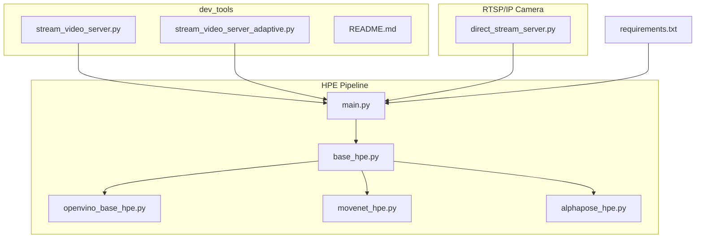
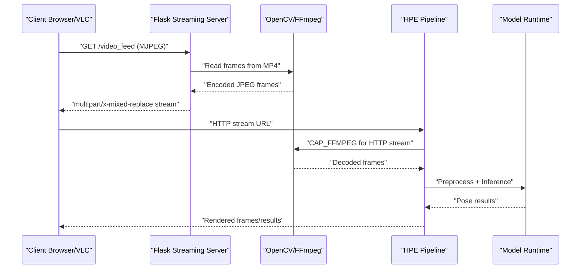
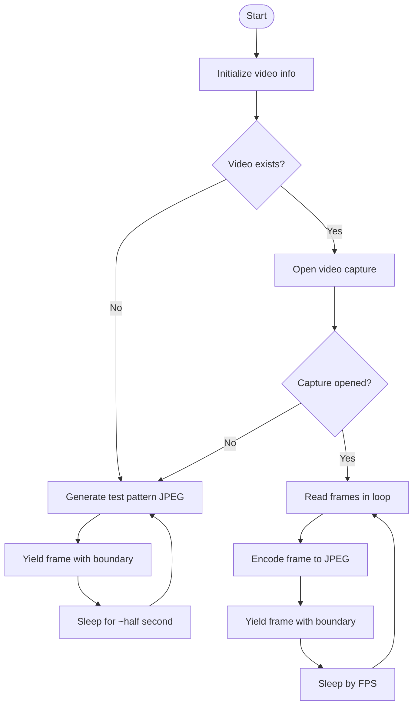
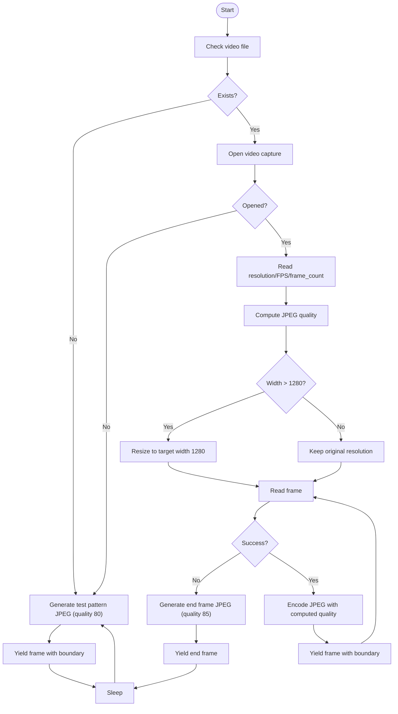
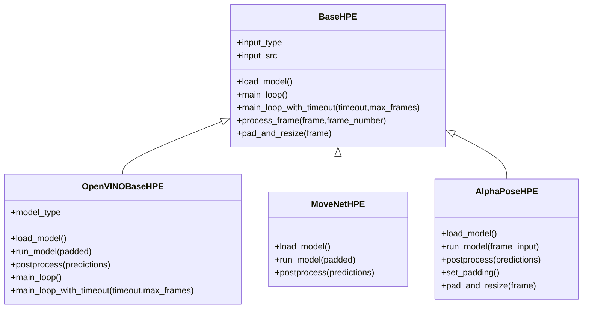
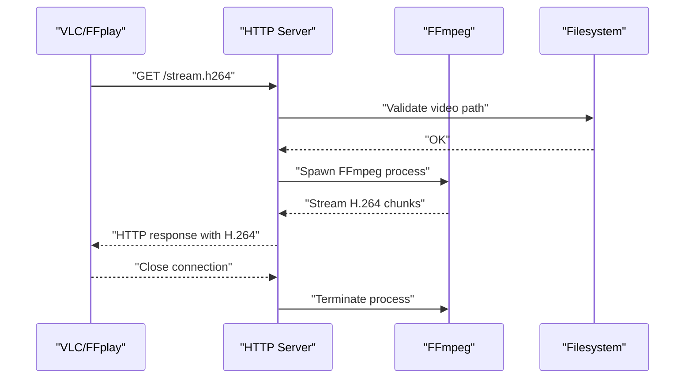
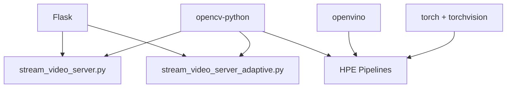

# Video Streaming Development

<cite>
**Referenced Files in This Document**
- [stream_video_server.py](file://dev_tools/stream_video_server.py)
- [stream_video_server_adaptive.py](file://dev_tools/stream_video_server_adaptive.py)
- [README.md](file://dev_tools/README.md)
- [main.py](file://main.py)
- [base_hpe.py](file://base_hpe.py)
- [openvino_base_hpe.py](file://openvino_base_hpe.py)
- [movenet_hpe.py](file://movenet_hpe.py)
- [alphapose_hpe.py](file://alphapose_hpe.py)
- [direct_stream_server.py](file://rtsp-ipcam/direct_stream_server.py)
- [requirements.txt](file://requirements.txt)
- [simple_test.py](file://simple_test.py)
</cite>

## Table of Contents
1. [Introduction](#introduction)
2. [Project Structure](#project-structure)
3. [Core Components](#core-components)
4. [Architecture Overview](#architecture-overview)
5. [Detailed Component Analysis](#detailed-component-analysis)
6. [Dependency Analysis](#dependency-analysis)
7. [Performance Considerations](#performance-considerations)
8. [Troubleshooting Guide](#troubleshooting-guide)
9. [Conclusion](#conclusion)
10. [Appendices](#appendices)

## Introduction
This document describes the video streaming development tools used in the Human Pose Estimation (HPE) framework. It focuses on two development-grade streaming servers:
- Standard streaming server (stream_video_server.py): A Flask-based MJPEG streamer for local testing of IP-stream-based HPE input.
- Adaptive streaming server (stream_video_server_adaptive.py): A Flask-based MJPEG streamer with adaptive JPEG quality and optional downscaling for HD content.

It also covers:
- Streaming protocols and video encoding options
- Client connection handling
- Integration with HPE processing pipelines
- Configuration parameters
- Deployment instructions
- Testing procedures for streaming quality, latency, and bandwidth optimization

## Project Structure
The streaming development tools reside under dev_tools and integrate with the broader HPE pipeline under the repository root.

**Diagram sources**
- [stream_video_server.py](file://dev_tools/stream_video_server.py)
- [stream_video_server_adaptive.py](file://dev_tools/stream_video_server_adaptive.py)
- [README.md](file://dev_tools/README.md)
- [main.py](file://main.py)
- [base_hpe.py](file://base_hpe.py)
- [openvino_base_hpe.py](file://openvino_base_hpe.py)
- [movenet_hpe.py](file://movenet_hpe.py)
- [alphapose_hpe.py](file://alphapose_hpe.py)
- [direct_stream_server.py](file://rtsp-ipcam/direct_stream_server.py)
- [requirements.txt](file://requirements.txt)

**Section sources**
- [stream_video_server.py](file://dev_tools/stream_video_server.py)
- [stream_video_server_adaptive.py](file://dev_tools/stream_video_server_adaptive.py)
- [README.md](file://dev_tools/README.md)
- [main.py](file://main.py)
- [base_hpe.py](file://base_hpe.py)
- [openvino_base_hpe.py](file://openvino_base_hpe.py)
- [movenet_hpe.py](file://movenet_hpe.py)
- [alphapose_hpe.py](file://alphapose_hpe.py)
- [direct_stream_server.py](file://rtsp-ipcam/direct_stream_server.py)
- [requirements.txt](file://requirements.txt)

## Core Components
- Standard MJPEG streaming server (Flask + OpenCV): Reads a local MP4, optionally loops, and streams MJPEG frames over HTTP with multipart/x-mixed-replace.
- Adaptive MJPEG streaming server (Flask + OpenCV): Detects resolution, selects JPEG quality thresholds, optionally downscales HD streams, and streams MJPEG frames.
- HPE pipeline integration: The main entry point accepts HTTP URLs and routes them to the appropriate HPE implementation, which uses OpenCV’s FFmpeg backend for HTTP streams.
- RTSP/IP camera emulation: An HTTP server that streams H.264 via FFmpeg for clients like VLC and FFplay.

Key capabilities:
- HTTP-based streaming with Flask
- MJPEG encoding for broad client compatibility
- Resolution-aware JPEG quality and optional downscaling
- HTTP stream handling with timeouts and frame limits
- FFmpeg-backed HTTP stream decoding for robustness

**Section sources**
- [stream_video_server.py](file://dev_tools/stream_video_server.py)
- [stream_video_server_adaptive.py](file://dev_tools/stream_video_server_adaptive.py)
- [main.py](file://main.py)
- [base_hpe.py](file://base_hpe.py)
- [openvino_base_hpe.py](file://openvino_base_hpe.py)
- [direct_stream_server.py](file://rtsp-ipcam/direct_stream_server.py)

## Architecture Overview
The streaming servers act as development proxies for IP-camera/HPE integration. The HPE pipeline detects HTTP inputs and uses OpenCV’s FFmpeg backend to decode streams efficiently.

**Diagram sources**
- [stream_video_server.py](file://dev_tools/stream_video_server.py)
- [stream_video_server_adaptive.py](file://dev_tools/stream_video_server_adaptive.py)
- [main.py](file://main.py)
- [base_hpe.py](file://base_hpe.py)
- [openvino_base_hpe.py](file://openvino_base_hpe.py)

## Detailed Component Analysis

### Standard MJPEG Streaming Server (stream_video_server.py)
- Purpose: Development-only MJPEG streamer from an MP4 file.
- Protocol: HTTP with multipart/x-mixed-replace boundary.
- Encoding: JPEG frames generated via OpenCV imencode.
- Behavior:
  - Initializes video metadata (resolution, FPS, frame count).
  - If the MP4 is missing, emits a test pattern.
  - Loops the MP4 indefinitely and encodes frames at the original FPS.
  - Exposes a simple HTML page with debug info.
- Arguments:
  - --video: Path to MP4 file (overridden by CLI).
- Ports: Default host binding and port configured in app.run.

**Diagram sources**
- [stream_video_server.py](file://dev_tools/stream_video_server.py)

**Section sources**
- [stream_video_server.py](file://dev_tools/stream_video_server.py)

### Adaptive MJPEG Streaming Server (stream_video_server_adaptive.py)
- Purpose: Development-only MJPEG streamer with adaptive JPEG quality and optional HD downscaling.
- Protocol: HTTP with multipart/x-mixed-replace boundary.
- Encoding: JPEG frames with quality tuned by resolution.
- Adaptive features:
  - get_jpeg_quality(width,height): Higher quality for HD, lower for VGA.
  - Downscale HD (>1280px width) to 1280px width with proportional height.
  - End-of-video frame with gradient background.
- Behavior:
  - Initializes video metadata.
  - If the MP4 is missing, emits a test pattern.
  - Streams until end-of-file (no looping).
- Arguments:
  - --video: Path to MP4 file (overridden by CLI).
- Ports: Default host binding and port configured in app.run.

**Diagram sources**
- [stream_video_server_adaptive.py](file://dev_tools/stream_video_server_adaptive.py)

**Section sources**
- [stream_video_server_adaptive.py](file://dev_tools/stream_video_server_adaptive.py)

### HPE Pipeline Integration
- Input detection:
  - main.py routes HTTP URLs to HPE implementations and calls main_loop_with_timeout for HTTP inputs.
- HTTP stream handling:
  - BaseHPE and OpenVINOBaseHPE use OpenCV with CAP_FFMPEG backend for HTTP streams and reduce buffer size for lower latency.
  - main_loop_with_timeout enforces timeout and max frame limits for HTTP streams.
- Model-specific behavior:
  - MoveNetHPE forces CPU for the selected model and uses CAP_FFMPEG for HTTP.
  - AlphaPoseHPE integrates with its own detector and pose model; for video/webcam/stream it relies on BaseHPE’s input handling.

**Diagram sources**
- [base_hpe.py](file://base_hpe.py)
- [openvino_base_hpe.py](file://openvino_base_hpe.py)
- [movenet_hpe.py](file://movenet_hpe.py)
- [alphapose_hpe.py](file://alphapose_hpe.py)

**Section sources**
- [main.py](file://main.py)
- [base_hpe.py](file://base_hpe.py)
- [openvino_base_hpe.py](file://openvino_base_hpe.py)
- [movenet_hpe.py](file://movenet_hpe.py)
- [alphapose_hpe.py](file://alphapose_hpe.py)

### RTSP/IP Camera Emulation (direct_stream_server.py)
- Purpose: Serve H.264 over HTTP for clients like VLC and FFplay.
- Protocol: HTTP GET /stream.h264.
- Encoding: Uses FFmpeg to transcode and stream H.264 (FLV or H.264 output depending on chosen command).
- Behavior:
  - Validates video file existence.
  - Starts HTTP server and streams via FFmpeg subprocess.
  - Logs client connections and FFmpeg stderr for diagnostics.
- Clients:
  - VLC: http://localhost:PORT/stream.h264
  - FFplay: ffplay http://localhost:PORT/stream.h264

**Diagram sources**
- [direct_stream_server.py](file://rtsp-ipcam/direct_stream_server.py)

**Section sources**
- [direct_stream_server.py](file://rtsp-ipcam/direct_stream_server.py)

## Dependency Analysis
- Flask and OpenCV are required for the streaming servers.
- HPE pipeline depends on OpenCV, OpenVINO, PyTorch, and model-specific libraries.
- The streaming servers are development-only and should not be used in production.

**Diagram sources**
- [requirements.txt](file://requirements.txt)
- [stream_video_server.py](file://dev_tools/stream_video_server.py)
- [stream_video_server_adaptive.py](file://dev_tools/stream_video_server_adaptive.py)
- [openvino_base_hpe.py](file://openvino_base_hpe.py)
- [movenet_hpe.py](file://movenet_hpe.py)
- [alphapose_hpe.py](file://alphapose_hpe.py)

**Section sources**
- [requirements.txt](file://requirements.txt)
- [stream_video_server.py](file://dev_tools/stream_video_server.py)
- [stream_video_server_adaptive.py](file://dev_tools/stream_video_server_adaptive.py)
- [openvino_base_hpe.py](file://openvino_base_hpe.py)
- [movenet_hpe.py](file://movenet_hpe.py)
- [alphapose_hpe.py](file://alphapose_hpe.py)

## Performance Considerations
- Streaming protocol choice:
  - MJPEG (Flask servers) offers broad client compatibility and simplicity for development.
  - H.264 (direct_stream_server) reduces bandwidth but requires clients supporting H.264 demuxing.
- Latency:
  - HTTP streams: OpenCV CAP_FFMPEG with reduced buffer improves responsiveness.
  - MJPEG servers: Frame timing controlled by FPS; adaptive server avoids sleep per frame.
- Bandwidth optimization:
  - Adaptive server adjusts JPEG quality based on resolution and optionally downscales HD.
  - H.264 streaming via FFmpeg can be tuned for bitrate and profile.
- Throughput:
  - HPE pipeline supports configurable OpenVINO threads, streams, and CPU pinning via environment variables.

[No sources needed since this section provides general guidance]

## Troubleshooting Guide
- Video file not found:
  - Both Flask servers fall back to a test pattern when the MP4 is missing.
- HTTP stream issues:
  - Ensure the HPE pipeline uses an HTTP URL; main.py detects HTTP inputs and applies timeout/frame limits.
  - OpenCV CAP_FFMPEG is used for HTTP streams to improve reliability.
- Latency spikes:
  - Reduce buffer size for HTTP streams (already set in BaseHPE).
  - Use the adaptive MJPEG server to minimize per-frame overhead.
- Client playback:
  - For MJPEG: Open browser or VLC with the /video_feed endpoint.
  - For H.264: Use VLC or FFplay with the /stream.h264 endpoint.

**Section sources**
- [stream_video_server.py](file://dev_tools/stream_video_server.py)
- [stream_video_server_adaptive.py](file://dev_tools/stream_video_server_adaptive.py)
- [main.py](file://main.py)
- [base_hpe.py](file://base_hpe.py)
- [openvino_base_hpe.py](file://openvino_base_hpe.py)
- [direct_stream_server.py](file://rtsp-ipcam/direct_stream_server.py)

## Conclusion
The development streaming tools provide flexible, low-overhead MJPEG and H.264 streaming for HPE testing. The standard and adaptive Flask servers simplify local testing of IP-stream-based inputs, while the H.264 HTTP server enables client compatibility verification. The HPE pipeline integrates seamlessly with HTTP streams using OpenCV’s FFmpeg backend and supports robust timeout and frame-limit controls for streaming scenarios.

[No sources needed since this section summarizes without analyzing specific files]

## Appendices

### Configuration Parameters and Deployment
- Standard MJPEG server:
  - Host/port: Configured in app.run.
  - Video path: Default relative path overridden by --video CLI argument.
- Adaptive MJPEG server:
  - Host/port: Configured in app.run.
  - Video path: Default relative path overridden by --video CLI argument.
  - JPEG quality: Automatically selected by resolution.
  - Downscaling: Applied for HD videos (>1280px width).
- RTSP/IP camera emulation:
  - Port: Default 8089; configurable via CLI.
  - Video path: Required via --video argument.
  - Clients: VLC and FFplay endpoints provided in logs.

**Section sources**
- [stream_video_server.py](file://dev_tools/stream_video_server.py)
- [stream_video_server_adaptive.py](file://dev_tools/stream_video_server_adaptive.py)
- [direct_stream_server.py](file://rtsp-ipcam/direct_stream_server.py)

### Integration with HPE Processing Pipelines
- main.py:
  - Detects HTTP input and calls main_loop_with_timeout for streaming.
  - Supports multiple HPE backends (OpenVINO, AlphaPose, MoveNet).
- BaseHPE:
  - Detects HTTP, video file, webcam, or image inputs.
  - Uses OpenCV CAP_FFMPEG for HTTP streams with reduced buffer size.
- OpenVINOBaseHPE:
  - Loads models and configures OpenVINO properties (threads, streams, CPU pinning).
  - Uses FFmpeg backend for HTTP streams.
- MoveNetHPE:
  - Forces CPU for the selected model and uses CAP_FFMPEG for HTTP.
- AlphaPoseHPE:
  - Integrates with its own detector and pose model; relies on BaseHPE for input handling.

**Section sources**
- [main.py](file://main.py)
- [base_hpe.py](file://base_hpe.py)
- [openvino_base_hpe.py](file://openvino_base_hpe.py)
- [movenet_hpe.py](file://movenet_hpe.py)
- [alphapose_hpe.py](file://alphapose_hpe.py)

### Testing Procedures
- Streaming quality:
  - Use the adaptive MJPEG server to compare JPEG quality and frame sizes across resolutions.
  - Validate end-of-video behavior and test pattern fallback.
- Latency measurements:
  - The HPE pipeline computes inference time and FPS; use these metrics to assess stream responsiveness.
- Bandwidth optimization:
  - Compare MJPEG vs H.264 streaming throughput.
  - Adjust JPEG quality and optional downscaling in the adaptive server.

**Section sources**
- [stream_video_server_adaptive.py](file://dev_tools/stream_video_server_adaptive.py)
- [simple_test.py](file://simple_test.py)
- [base_hpe.py](file://base_hpe.py)
- [openvino_base_hpe.py](file://openvino_base_hpe.py)